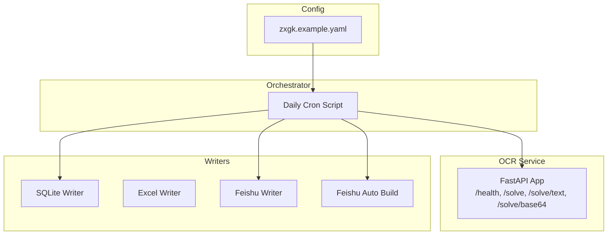
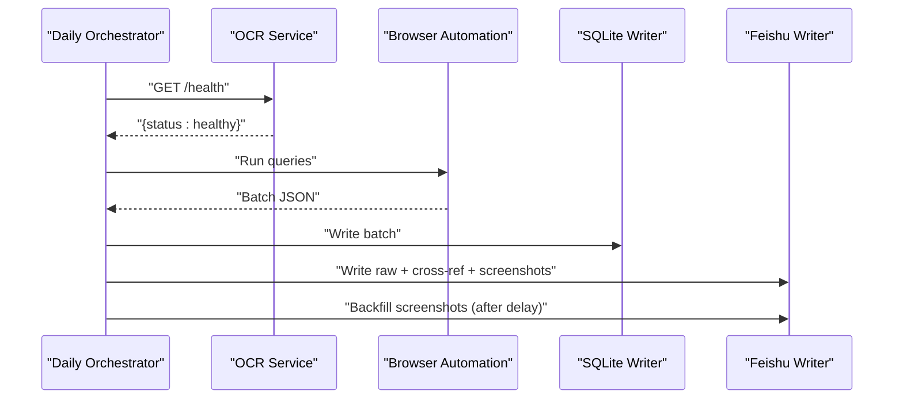
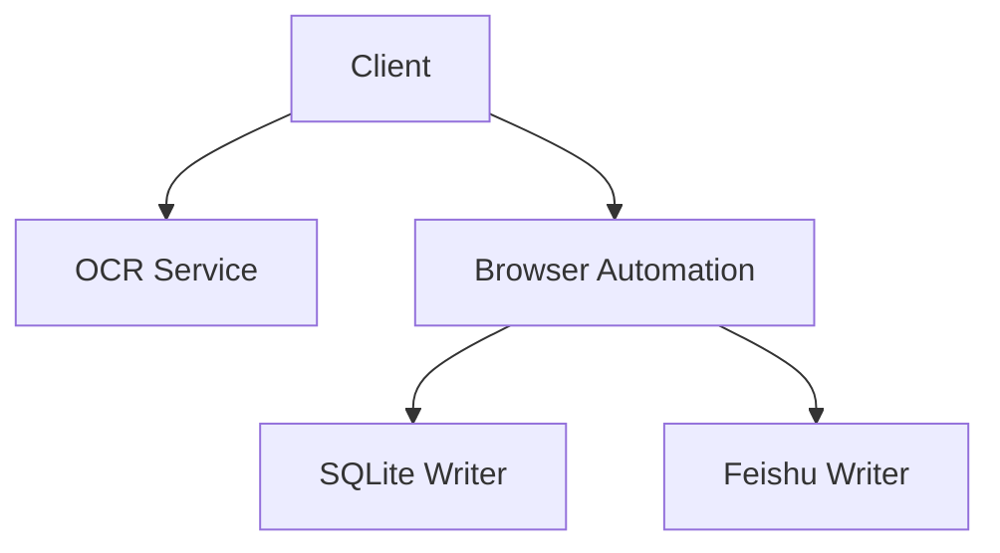
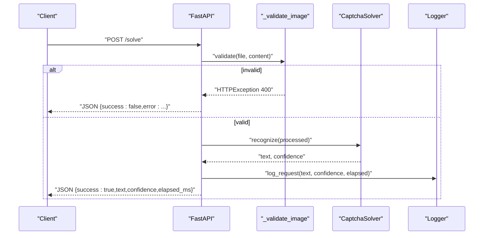
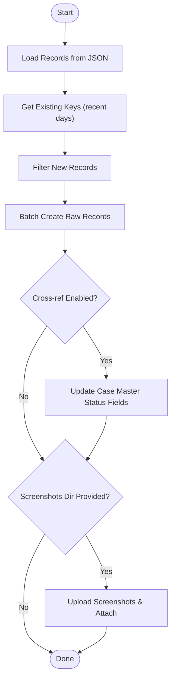
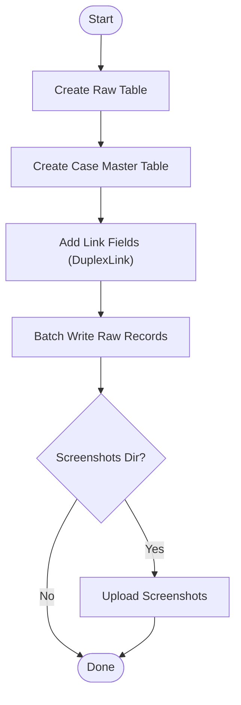
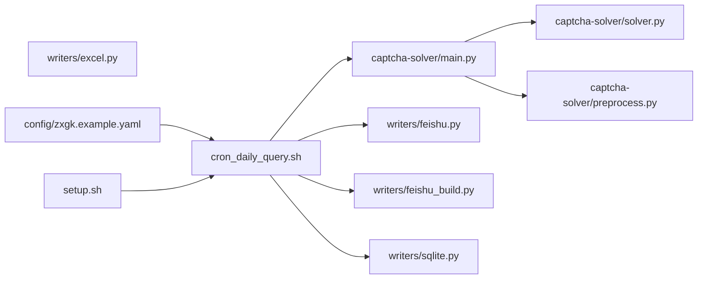

# API Reference

<cite>
**Referenced Files in This Document**
- [README.md](file://README.md)
- [API.md](file://captcha-solver/API.md)
- [main.py](file://captcha-solver/main.py)
- [solver.py](file://captcha-solver/solver.py)
- [preprocess.py](file://captcha-solver/preprocess.py)
- [feishu.py](file://writers/feishu.py)
- [feishu_build.py](file://writers/feishu_build.py)
- [sqlite.py](file://writers/sqlite.py)
- [excel.py](file://writers/excel.py)
- [cron_daily_query.sh](file://cron_daily_query.sh)
- [setup.sh](file://setup.sh)
- [zxgk.example.yaml](file://config/zxgk.example.yaml)
</cite>

## Table of Contents
1. [Introduction](#introduction)
2. [Project Structure](#project-structure)
3. [Core Components](#core-components)
4. [Architecture Overview](#architecture-overview)
5. [Detailed Component Analysis](#detailed-component-analysis)
6. [Dependency Analysis](#dependency-analysis)
7. [Performance Considerations](#performance-considerations)
8. [Troubleshooting Guide](#troubleshooting-guide)
9. [Conclusion](#conclusion)
10. [Appendices](#appendices)

## Introduction
This document provides API documentation for the Execution Information Query System, focusing on:
- OCR service API for CAPTCHA solving
- Feishu integration APIs for table synchronization
- Authentication and data mapping
- Protocol-specific examples, rate limiting, versioning, and security considerations
- Common use cases, client implementation guidelines, and integration patterns
- Migration notes, error handling, and performance optimization tips

## Project Structure
The system consists of:
- OCR service (FastAPI) for CAPTCHA recognition
- Writers for storage and export (SQLite, Excel, Feishu)
- Orchestrator script for daily runs and Feishu screenshot backfill
- Configuration for browser automation, WAF behavior, and Feishu mapping

**Diagram sources**
- [main.py:102-215](file://captcha-solver/main.py#L102-L215)
- [feishu.py:1-596](file://writers/feishu.py#L1-L596)
- [feishu_build.py:1-242](file://writers/feishu_build.py#L1-L242)
- [sqlite.py:1-121](file://writers/sqlite.py#L1-L121)
- [excel.py:1-97](file://writers/excel.py#L1-L97)
- [cron_daily_query.sh:1-246](file://cron_daily_query.sh#L1-L246)
- [zxgk.example.yaml:1-103](file://config/zxgk.example.yaml#L1-L103)

**Section sources**
- [README.md:1-122](file://README.md#L1-L122)
- [cron_daily_query.sh:1-246](file://cron_daily_query.sh#L1-L246)
- [setup.sh:1-150](file://setup.sh#L1-L150)

## Core Components
- OCR service API: Health check and multiple solve endpoints for file uploads and base64 inputs
- Feishu writer: Batch write to raw tables, cross-reference updates, and screenshot uploads
- Feishu auto-build: Create tables and fields, establish links, and populate data
- Storage writers: SQLite and Excel export
- Orchestrator: Daily orchestration, health checks, and Feishu backfill

**Section sources**
- [API.md:19-28](file://captcha-solver/API.md#L19-L28)
- [main.py:102-215](file://captcha-solver/main.py#L102-L215)
- [feishu.py:1-596](file://writers/feishu.py#L1-L596)
- [feishu_build.py:1-242](file://writers/feishu_build.py#L1-L242)
- [sqlite.py:1-121](file://writers/sqlite.py#L1-L121)
- [excel.py:1-97](file://writers/excel.py#L1-L97)

## Architecture Overview
End-to-end flow:
- The orchestrator ensures the OCR service is healthy, then runs browser automation to collect data
- Results are exported to SQLite and optionally synchronized to Feishu
- Feishu screenshots are backfilled after Feishu calculations complete

**Diagram sources**
- [cron_daily_query.sh:48-96](file://cron_daily_query.sh#L48-L96)
- [main.py:107-109](file://captcha-solver/main.py#L107-L109)
- [feishu.py:556-596](file://writers/feishu.py#L556-L596)

## Detailed Component Analysis

### OCR Service API

- Service endpoints
  - GET /health
  - POST /solve (multipart/form-data)
  - POST /solve/text (multipart/form-data)
  - POST /solve/base64 (application/json)

- Request/response schemas
  - /solve
    - Request: multipart/form-data with file and optional preprocess query parameter
    - Response: JSON with fields success, text, confidence, elapsed_ms, error
  - /solve/text
    - Request: multipart/form-data with file and optional preprocess query parameter
    - Response: text/plain on success, JSON on failure
  - /solve/base64
    - Request: JSON with image (base64 string) and optional preprocess
    - Response: JSON with fields success, text, confidence, elapsed_ms, error

- Error handling
  - Validation errors return HTTP 400 with descriptive messages
  - Unexpected exceptions return JSON with success=false and error message
  - Health endpoint returns a simple status payload

- Rate limiting and constraints
  - File type: image/*
  - Max file size: 5 MB
  - Max image dimensions: 2000x1000 px
  - Single recognition latency: ~50–150 ms (CPU mode)

- Versioning and environment
  - Service version: 1.0.0
  - Environment variables: PORT, ALLOWED_ORIGINS, LOG_LEVEL, PADDLE_PDX_DISABLE_MODEL_SOURCE_CHECK

- Security considerations
  - CORS configured via ALLOWED_ORIGINS
  - Logs include client IP and timing metrics

- Example usage
  - Health check: curl http://localhost:8000/health
  - File upload: curl -X POST http://localhost:8000/solve -F "file=@captcha.jpg"
  - Base64 input: curl -X POST http://localhost:8000/solve/base64 -H "Content-Type: application/json" -d '{"image": "..."}'

**Section sources**
- [API.md:19-121](file://captcha-solver/API.md#L19-L121)
- [main.py:107-215](file://captcha-solver/main.py#L107-L215)
- [solver.py:1-83](file://captcha-solver/solver.py#L1-L83)
- [preprocess.py:1-130](file://captcha-solver/preprocess.py#L1-L130)

### Feishu Integration APIs

- Authentication
  - Uses lark-cli with user context (--as user)
  - Requires lark-cli auth before running Feishu-related tasks
  - FEISHU_APP_TOKEN environment variable supplies the Base token

- Data mapping and endpoints
  - Raw tables per subsite (zhixing, shixin, xgl)
  - Case master table with fields for status flags and dates
  - DuplexLink established between raw and case tables
  - Media upload endpoint for screenshots

- Endpoints and flows
  - Write raw records: POST /open-apis/bitable/v1/apps/{app_token}/tables/{table_id}/records/batch_create
  - Update records: PUT /open-apis/bitable/v1/apps/{app_token}/tables/{table_id}/records/{record_id}
  - Search records: POST /open-apis/bitable/v1/apps/{app_token}/tables/{table_id}/records/search
  - Upload media: POST /open-apis/drive/v1/medias/upload_all

- Cross-reference updates
  - After writing raw records, update case master table fields based on case numbers

- Screenshot uploads
  - Parse viewId from raw records
  - Upload to media storage and attach to case master table record
  - Remove uploaded files locally after successful update

- Configuration
  - Subsite-specific selectors and wait times
  - WAF retry and cooldown parameters
  - Output directories for JSON and screenshots

- Example usage
  - Write raw records: python3 -m writers.feishu --input batch.json --subsite zhixing
  - Cross-reference: python3 -m writers.feishu --input batch.json --subsite shixin --cross-ref
  - Upload screenshots: python3 -m writers.feishu --input batch.json --subsite zhixing --screenshots output/screenshots

**Section sources**
- [feishu.py:1-596](file://writers/feishu.py#L1-L596)
- [feishu_build.py:1-242](file://writers/feishu_build.py#L1-L242)
- [cron_daily_query.sh:101-154](file://cron_daily_query.sh#L101-L154)
- [zxgk.example.yaml:1-103](file://config/zxgk.example.yaml#L1-L103)

### Storage Writers

- SQLite writer
  - Stores batch results with optional screenshot data as file path or BLOB
  - Creates table per subsite and migrates schema if needed

- Excel writer
  - Exports batch results to XLSX with formatted headers
  - Supports multiple input files to multiple sheets

**Section sources**
- [sqlite.py:1-121](file://writers/sqlite.py#L1-L121)
- [excel.py:1-97](file://writers/excel.py#L1-L97)

## Architecture Overview

**Diagram sources**
- [main.py:102-215](file://captcha-solver/main.py#L102-L215)
- [feishu.py:556-596](file://writers/feishu.py#L556-L596)
- [sqlite.py:37-100](file://writers/sqlite.py#L37-L100)

## Detailed Component Analysis

### OCR Service Endpoints

**Diagram sources**
- [main.py:112-142](file://captcha-solver/main.py#L112-L142)
- [main.py:71-88](file://captcha-solver/main.py#L71-L88)
- [solver.py:34-55](file://captcha-solver/solver.py#L34-L55)

**Section sources**
- [API.md:31-68](file://captcha-solver/API.md#L31-L68)
- [main.py:112-142](file://captcha-solver/main.py#L112-L142)
- [solver.py:34-55](file://captcha-solver/solver.py#L34-L55)

### Feishu Write Flow

**Diagram sources**
- [feishu.py:154-202](file://writers/feishu.py#L154-L202)
- [feishu.py:208-278](file://writers/feishu.py#L208-L278)
- [feishu.py:369-478](file://writers/feishu.py#L369-L478)

**Section sources**
- [feishu.py:154-202](file://writers/feishu.py#L154-L202)
- [feishu.py:208-278](file://writers/feishu.py#L208-L278)
- [feishu.py:369-478](file://writers/feishu.py#L369-L478)

### Feishu Auto Build Flow

**Diagram sources**
- [feishu_build.py:128-204](file://writers/feishu_build.py#L128-L204)

**Section sources**
- [feishu_build.py:109-204](file://writers/feishu_build.py#L109-L204)

## Dependency Analysis

**Diagram sources**
- [main.py:1-215](file://captcha-solver/main.py#L1-L215)
- [solver.py:1-83](file://captcha-solver/solver.py#L1-L83)
- [preprocess.py:1-130](file://captcha-solver/preprocess.py#L1-L130)
- [feishu.py:1-596](file://writers/feishu.py#L1-L596)
- [feishu_build.py:1-242](file://writers/feishu_build.py#L1-L242)
- [sqlite.py:1-121](file://writers/sqlite.py#L1-L121)
- [excel.py:1-97](file://writers/excel.py#L1-L97)
- [cron_daily_query.sh:1-246](file://cron_daily_query.sh#L1-L246)
- [setup.sh:1-150](file://setup.sh#L1-L150)
- [zxgk.example.yaml:1-103](file://config/zxgk.example.yaml#L1-L103)

**Section sources**
- [main.py:1-215](file://captcha-solver/main.py#L1-L215)
- [feishu.py:1-596](file://writers/feishu.py#L1-L596)
- [feishu_build.py:1-242](file://writers/feishu_build.py#L1-L242)
- [sqlite.py:1-121](file://writers/sqlite.py#L1-L121)
- [excel.py:1-97](file://writers/excel.py#L1-L97)
- [cron_daily_query.sh:1-246](file://cron_daily_query.sh#L1-L246)
- [setup.sh:1-150](file://setup.sh#L1-L150)
- [zxgk.example.yaml:1-103](file://config/zxgk.example.yaml#L1-L103)

## Performance Considerations
- OCR recognition latency is approximately 50–150 ms per request on CPU mode
- File size limit: 5 MB; image dimension cap: 2000x1000 px
- Feishu batch writes use chunk sizes up to 500 records per request
- Screenshot uploads include a small delay between requests to avoid throttling
- Deduplication filters recent records to reduce search overhead

[No sources needed since this section provides general guidance]

## Troubleshooting Guide
- OCR service not reachable
  - Verify health endpoint: curl http://localhost:8001/health
  - Ensure OCR service is started via Docker or venv
- Feishu authentication
  - Run lark-cli auth and confirm user_info endpoint succeeds
  - Ensure FEISHU_APP_TOKEN is set
- WAF blocking
  - Review WAF configuration in the YAML file for retries and cooldowns
- Cross-reference and screenshot backfill
  - Allow time for Feishu calculations before backfilling screenshots
  - Confirm DuplexLink is established between raw and case tables

**Section sources**
- [cron_daily_query.sh:48-96](file://cron_daily_query.sh#L48-L96)
- [cron_daily_query.sh:101-107](file://cron_daily_query.sh#L101-L107)
- [setup.sh:112-124](file://setup.sh#L112-L124)
- [zxgk.example.yaml:15-22](file://config/zxgk.example.yaml#L15-L22)

## Conclusion
This API reference documents the OCR service and Feishu integration components of the Execution Information Query System. It covers endpoints, schemas, constraints, authentication, and operational patterns. Use the provided flows and configurations to integrate reliably and monitor performance effectively.

[No sources needed since this section summarizes without analyzing specific files]

## Appendices

### API Definitions

- OCR Service
  - GET /health
    - Response: {status: "healthy"}
  - POST /solve
    - Content-Type: multipart/form-data
    - Body: file (image/*), preprocess (optional)
    - Response: {success, text, confidence, elapsed_ms, error}
  - POST /solve/text
    - Content-Type: multipart/form-data
    - Body: file (image/*), preprocess (optional)
    - Response: text/plain on success, JSON on failure
  - POST /solve/base64
    - Content-Type: application/json
    - Body: {image: base64 string, preprocess: "full|gray|none"}
    - Response: {success, text, confidence, elapsed_ms}

- Feishu Writer
  - Write raw records: POST /open-apis/bitable/v1/apps/{app_token}/tables/{table_id}/records/batch_create
  - Update records: PUT /open-apis/bitable/v1/apps/{app_token}/tables/{table_id}/records/{record_id}
  - Search records: POST /open-apis/bitable/v1/apps/{app_token}/tables/{table_id}/records/search
  - Upload media: POST /open-apis/drive/v1/medias/upload_all

**Section sources**
- [API.md:19-68](file://captcha-solver/API.md#L19-L68)
- [main.py:107-215](file://captcha-solver/main.py#L107-L215)
- [feishu.py:121-126](file://writers/feishu.py#L121-L126)
- [feishu.py:56-66](file://writers/feishu.py#L56-L66)

### Client Implementation Guidelines
- Use multipart/form-data for file uploads; use base64 for inline images
- Respect file size and dimension limits
- Implement retries with exponential backoff for OCR failures
- For Feishu, ensure lark-cli is authenticated and FEISHU_APP_TOKEN is set
- Batch writes to Feishu in chunks up to 500 records
- Apply delays between screenshot uploads to avoid throttling

[No sources needed since this section provides general guidance]

### Security Considerations
- CORS origins controlled via ALLOWED_ORIGINS
- Log client IP and timing; avoid logging sensitive OCR content
- Store FEISHU_APP_TOKEN securely; avoid embedding tokens in scripts
- Validate and sanitize inputs before OCR processing

[No sources needed since this section provides general guidance]

### Migration and Backwards Compatibility Notes
- OCR service version: 1.0.0
- Feishu field names and table IDs are configurable; adjust mappings in the YAML file
- SQLite schema migration adds missing columns automatically
- Feishu auto-build creates tables and fields; existing tables require manual mapping updates

**Section sources**
- [main.py:47-52](file://captcha-solver/main.py#L47-L52)
- [sqlite.py:54-58](file://writers/sqlite.py#L54-L58)
- [feishu_build.py:128-204](file://writers/feishu_build.py#L128-L204)
- [zxgk.example.yaml:46-92](file://config/zxgk.example.yaml#L46-L92)

### Monitoring Recommendations
- Monitor OCR service health endpoint and error rates
- Track Feishu API response codes and latency
- Observe browser automation logs for WAF events and timeouts
- Use sentinels and daily summaries for end-to-end visibility

[No sources needed since this section provides general guidance]