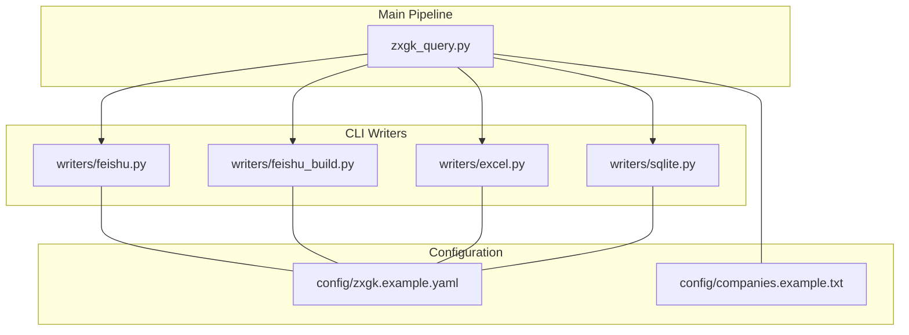
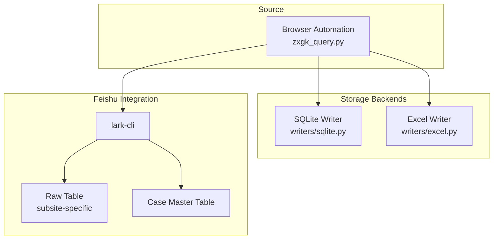
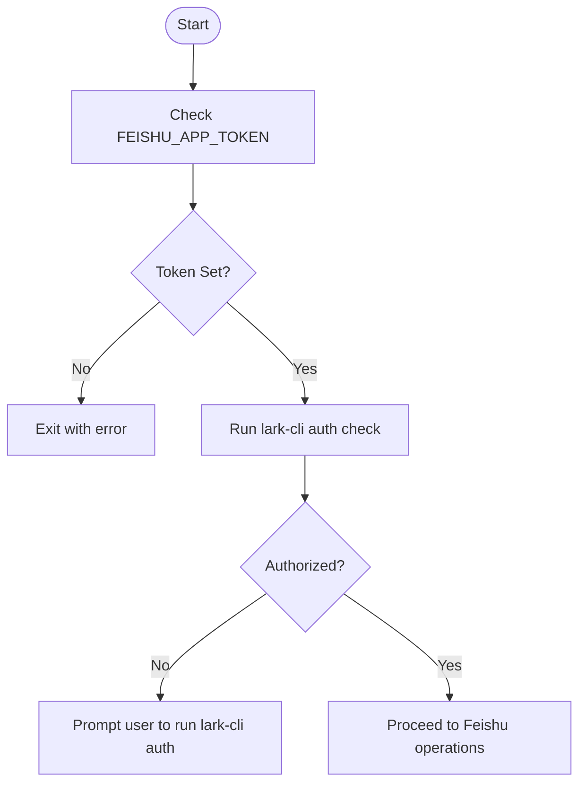
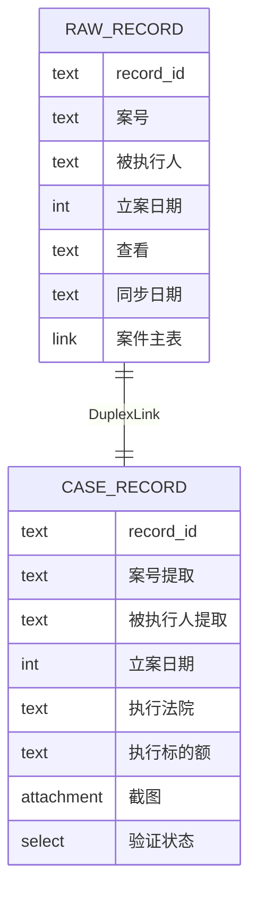
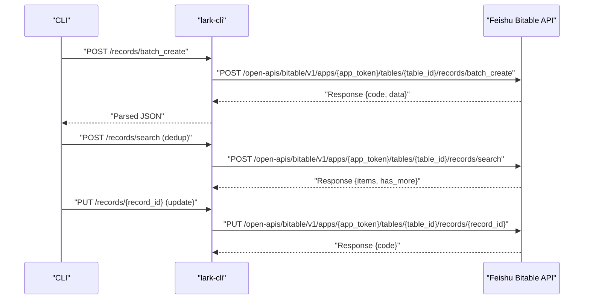
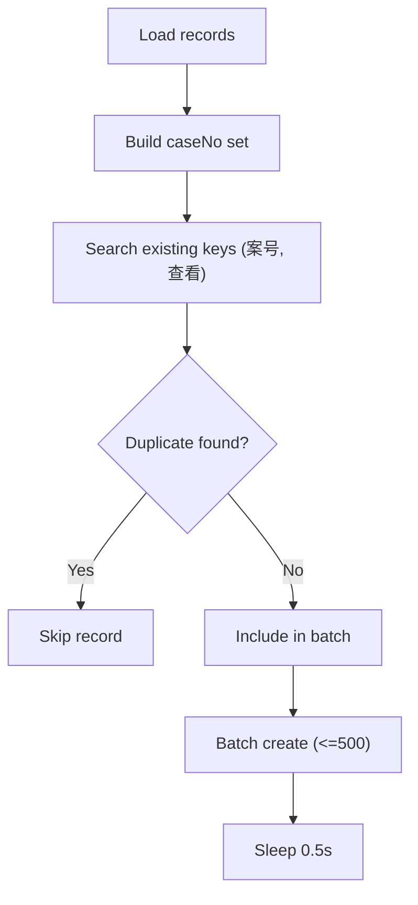
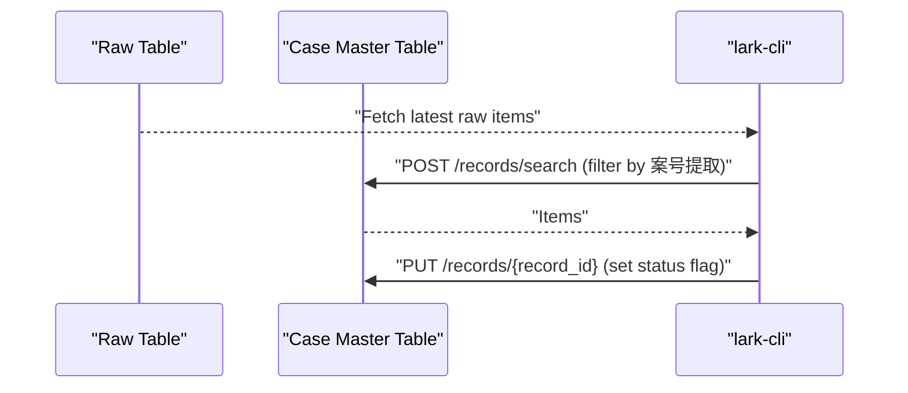
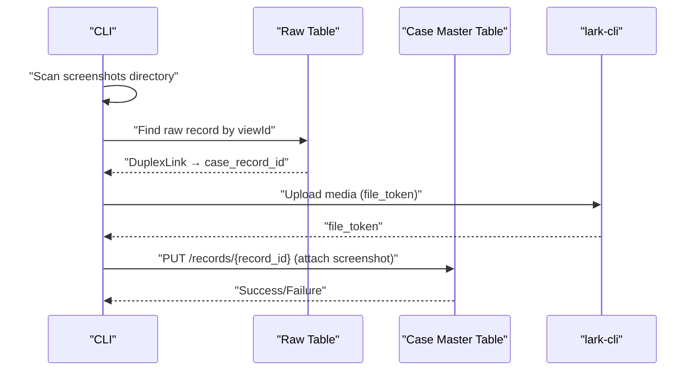
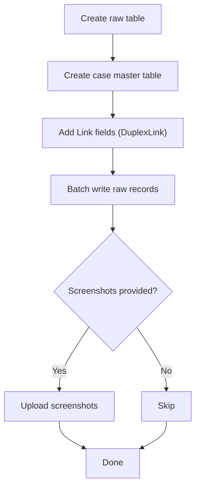
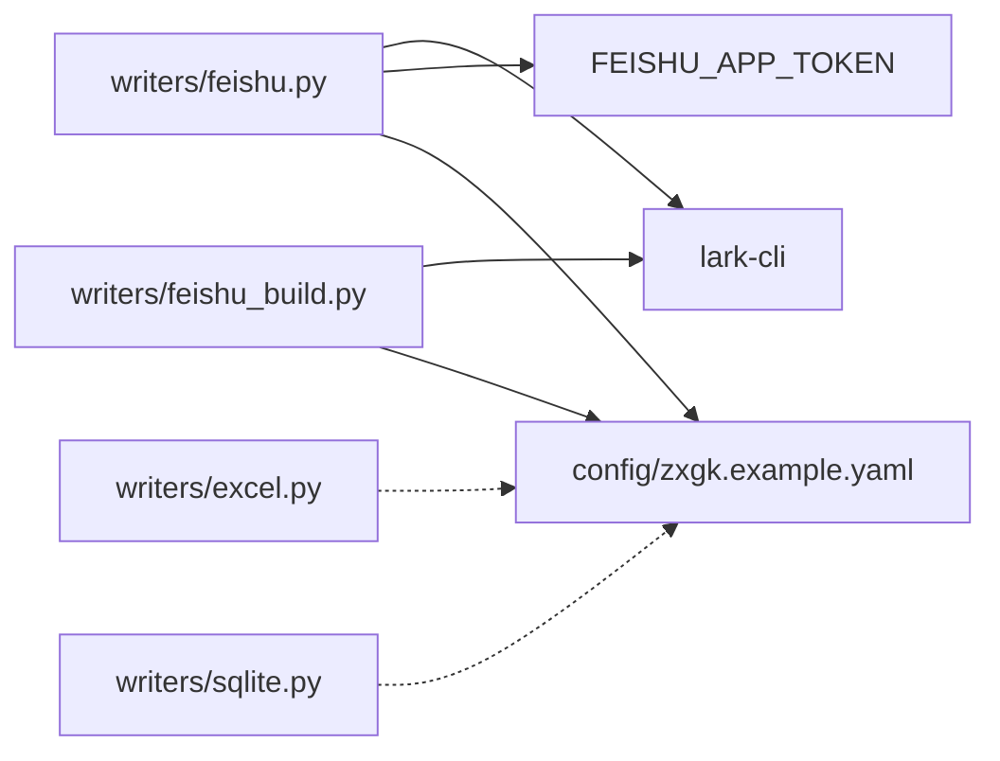

# Feishu Integration API

<cite>
**Referenced Files in This Document**
- [writers/feishu.py](file://writers/feishu.py)
- [writers/feishu_build.py](file://writers/feishu_build.py)
- [writers/__init__.py](file://writers/__init__.py)
- [writers/excel.py](file://writers/excel.py)
- [writers/sqlite.py](file://writers/sqlite.py)
- [README.md](file://README.md)
- [SKILL.md](file://SKILL.md)
- [config/zxgk.example.yaml](file://config/zxgk.example.yaml)
- [config/companies.example.txt](file://config/companies.example.txt)
- [zxgk_query.py](file://zxgk_query.py)
</cite>

## Table of Contents
1. [Introduction](#introduction)
2. [Project Structure](#project-structure)
3. [Core Components](#core-components)
4. [Architecture Overview](#architecture-overview)
5. [Detailed Component Analysis](#detailed-component-analysis)
6. [Dependency Analysis](#dependency-analysis)
7. [Performance Considerations](#performance-considerations)
8. [Troubleshooting Guide](#troubleshooting-guide)
9. [Conclusion](#conclusion)
10. [Appendices](#appendices)

## Introduction
This document provides comprehensive API documentation for the Feishu integration system used by the daily execution information query pipeline. It covers:
- Authentication via lark-cli and environment-based token configuration
- Endpoints and workflows for writing raw records, updating case master records, uploading screenshots, and deduplication
- Data mapping from internal execution records to Feishu multi-dimensional table fields
- Rate limiting, retries, and monitoring strategies
- Incremental update patterns and conflict resolution
- Integration guidelines for customizing table structures and handling large datasets

## Project Structure
The Feishu integration is implemented as pluggable writer modules under the writers package, with optional automatic table building and storage backends.

**Diagram sources**
- [writers/feishu.py:1-596](file://writers/feishu.py#L1-L596)
- [writers/feishu_build.py:1-242](file://writers/feishu_build.py#L1-L242)
- [writers/excel.py:1-97](file://writers/excel.py#L1-L97)
- [writers/sqlite.py:1-121](file://writers/sqlite.py#L1-L121)
- [config/zxgk.example.yaml:1-103](file://config/zxgk.example.yaml#L1-L103)
- [config/companies.example.txt:1-7](file://config/companies.example.txt#L1-L7)
- [zxgk_query.py:1-200](file://zxgk_query.py#L1-L200)

**Section sources**
- [writers/__init__.py:1-10](file://writers/__init__.py#L1-L10)
- [README.md:1-122](file://README.md#L1-L122)
- [SKILL.md:241-247](file://SKILL.md#L241-L247)

## Core Components
- Feishu Writer (existing tables): writes raw records, performs deduplication, optionally updates case master records, and uploads screenshots.
- Feishu Builder (auto-create): creates raw and case master tables, establishes bidirectional links, and writes initial data.
- Storage backends: Excel export, SQLite persistence (fallback when Feishu is disabled).
- Configuration: Feishu app token, table IDs, and field mappings.

Key responsibilities:
- Authentication and API invocation via lark-cli
- Batch creation and per-record updates
- Media upload to Feishu Drive
- Cross-reference updates and screenshot backfilling

**Section sources**
- [writers/feishu.py:25-66](file://writers/feishu.py#L25-L66)
- [writers/feishu_build.py:28-42](file://writers/feishu_build.py#L28-L42)
- [writers/excel.py:1-97](file://writers/excel.py#L1-L97)
- [writers/sqlite.py:1-121](file://writers/sqlite.py#L1-L121)
- [config/zxgk.example.yaml:46-92](file://config/zxgk.example.yaml#L46-L92)

## Architecture Overview
The system orchestrates browser automation to produce batch JSON, then writes to storage backends. When Feishu is configured, it writes to raw and case master tables, updates cross-references, and uploads screenshots.

**Diagram sources**
- [SKILL.md:249-272](file://SKILL.md#L249-L272)
- [writers/feishu.py:55-66](file://writers/feishu.py#L55-L66)
- [writers/feishu_build.py:109-204](file://writers/feishu_build.py#L109-L204)

## Detailed Component Analysis

### Authentication and Token Configuration
- Token source: FEISHU_APP_TOKEN environment variable.
- Authentication method: lark-cli user context (--as user).
- Validation: scripts check token presence and lark-cli auth status.

**Diagram sources**
- [writers/feishu.py:29-33](file://writers/feishu.py#L29-L33)
- [writers/feishu.py:56-66](file://writers/feishu.py#L56-L66)
- [SKILL.md:175-189](file://SKILL.md#L175-L189)

**Section sources**
- [writers/feishu.py:25-33](file://writers/feishu.py#L25-L33)
- [writers/feishu.py:56-66](file://writers/feishu.py#L56-L66)
- [SKILL.md:175-189](file://SKILL.md#L175-L189)

### Data Mapping: Execution Records to Feishu Fields
- Internal record fields: company, caseNo, name, date, timestamp, viewId.
- Raw table fields (per subsite): 案号, 被执行人, 立案日期, 查看, 同步日期.
- Case master table fields: 案号提取, 被执行人提取, 立案日期, 执行法院, 执行标的额, 截图, 验证状态.
- Cross-reference fields: DuplexLink between raw and case master tables.

**Diagram sources**
- [writers/feishu.py:35-51](file://writers/feishu.py#L35-L51)
- [writers/feishu_build.py:130-152](file://writers/feishu_build.py#L130-L152)

**Section sources**
- [writers/feishu.py:176-183](file://writers/feishu.py#L176-L183)
- [writers/feishu_build.py:170-178](file://writers/feishu_build.py#L170-L178)
- [config/zxgk.example.yaml:49-92](file://config/zxgk.example.yaml#L49-L92)

### Endpoints and Workflows
- Raw table batch creation: POST /open-apis/bitable/v1/apps/{app_token}/tables/{table_id}/records/batch_create
- Raw record update: PUT /open-apis/bitable/v1/apps/{app_token}/tables/{table_id}/records/{record_id}
- Case master record update: PUT /open-apis/bitable/v1/apps/{app_token}/tables/{table_id}/records/{record_id}
- Media upload: POST /open-apis/drive/v1/medias/upload_all
- Search records: POST /open-apis/bitable/v1/apps/{app_token}/tables/{table_id}/records/search
- Get records (pagination): GET /open-apis/bitable/v1/apps/{app_token}/tables/{table_id}/records?page_size=N

**Diagram sources**
- [writers/feishu.py:190-198](file://writers/feishu.py#L190-L198)
- [writers/feishu.py:528-549](file://writers/feishu.py#L528-L549)
- [writers/feishu.py:121-126](file://writers/feishu.py#L121-L126)

**Section sources**
- [writers/feishu.py:190-198](file://writers/feishu.py#L190-L198)
- [writers/feishu.py:528-549](file://writers/feishu.py#L528-L549)
- [writers/feishu.py:121-126](file://writers/feishu.py#L121-L126)

### Deduplication and Incremental Updates
- Deduplication strategy: query existing (案号, 查看=viewId) pairs within a recent window and skip duplicates.
- Batch size: 500 records per batch for creation.
- Incremental pattern: search raw table for today’s records and update case master flags.

**Diagram sources**
- [writers/feishu.py:154-201](file://writers/feishu.py#L154-L201)
- [writers/feishu.py:502-549](file://writers/feishu.py#L502-L549)

**Section sources**
- [writers/feishu.py:154-201](file://writers/feishu.py#L154-L201)
- [writers/feishu.py:502-549](file://writers/feishu.py#L502-L549)

### Cross-Reference Updates and Conflict Resolution
- Purpose: update case master “是否失信” or “是否限高” based on newly written raw records.
- Method: search case master by 案号提取, then PUT update flag.
- Conflict resolution: only updates records that match; skips missing or mismatched entries.

**Diagram sources**
- [writers/feishu.py:208-277](file://writers/feishu.py#L208-L277)

**Section sources**
- [writers/feishu.py:208-277](file://writers/feishu.py#L208-L277)

### Screenshot Upload and Backfilling
- Media upload: upload to Feishu Drive media store and obtain file_token.
- Update case master: attach file_token to “截图” field.
- Backfill flow: scan case master for empty(截图), resolve real viewId via DuplexLink, upload, and remove local file.

**Diagram sources**
- [writers/feishu.py:284-478](file://writers/feishu.py#L284-L478)
- [writers/feishu.py:68-118](file://writers/feishu.py#L68-L118)

**Section sources**
- [writers/feishu.py:284-478](file://writers/feishu.py#L284-L478)
- [writers/feishu.py:68-118](file://writers/feishu.py#L68-L118)

### Auto-Build Workflow
- Creates raw table and case master table with predefined fields.
- Establishes DuplexLink between tables.
- Writes batch records and optionally uploads screenshots.

**Diagram sources**
- [writers/feishu_build.py:109-204](file://writers/feishu_build.py#L109-L204)

**Section sources**
- [writers/feishu_build.py:109-204](file://writers/feishu_build.py#L109-L204)

## Dependency Analysis
- writers/feishu.py depends on lark-cli for API calls and environment token.
- writers/feishu_build.py depends on lark-cli and configuration for table creation.
- Configuration file defines Feishu app token and field mappings.
- Storage backends (Excel, SQLite) are independent of Feishu.

**Diagram sources**
- [writers/feishu.py:25-66](file://writers/feishu.py#L25-L66)
- [writers/feishu_build.py:28-42](file://writers/feishu_build.py#L28-L42)
- [config/zxgk.example.yaml:46-92](file://config/zxgk.example.yaml#L46-L92)

**Section sources**
- [writers/feishu.py:25-66](file://writers/feishu.py#L25-L66)
- [writers/feishu_build.py:28-42](file://writers/feishu_build.py#L28-L42)
- [config/zxgk.example.yaml:46-92](file://config/zxgk.example.yaml#L46-L92)

## Performance Considerations
- Batch size: 500 records per batch for creation to reduce API overhead.
- Rate limiting: enforced by deliberate sleeps between batches and per-request delays to avoid throttling.
- Pagination: search endpoints support pagination tokens for large result sets.
- Media upload: streaming via stdin to bypass known lark-cli file argument issues.

Recommendations:
- Monitor API response codes and implement exponential backoff on transient errors.
- Use smaller batches for high-content fields (attachments) to reduce payload size.
- Cache deduplication queries per run to minimize repeated searches.

**Section sources**
- [writers/feishu.py:185-199](file://writers/feishu.py#L185-L199)
- [writers/feishu.py:517-547](file://writers/feishu.py#L517-L547)
- [writers/feishu.py:101-107](file://writers/feishu.py#L101-L107)

## Troubleshooting Guide
Common issues and resolutions:
- Missing token or unauthorized: configure FEISHU_APP_TOKEN and run lark-cli auth.
- API errors during upload: verify file path and size limits; retry after delay.
- No screenshots uploaded: confirm viewId extraction and DuplexLink presence.
- Cross-reference not updating: ensure 案号提取 matches raw 案号.

Operational checks:
- Verify lark-cli user info endpoint and handle 401 responses.
- Confirm raw and case master table IDs and field names in configuration.
- Validate screenshot directory naming convention and uniqueness per viewId.

**Section sources**
- [SKILL.md:175-189](file://SKILL.md#L175-L189)
- [writers/feishu.py:61-65](file://writers/feishu.py#L61-L65)
- [writers/feishu.py:423-452](file://writers/feishu.py#L423-L452)

## Conclusion
The Feishu integration provides a robust pipeline for synchronizing execution records into Feishu multi-dimensional tables. It supports deduplication, incremental updates, cross-references, and screenshot backfilling. By leveraging lark-cli and environment-based configuration, it offers a flexible and maintainable solution for teams needing centralized visibility into enforcement actions.

## Appendices

### API Reference Summary
- Raw table batch create: POST /open-apis/bitable/v1/apps/{app_token}/tables/{table_id}/records/batch_create
- Raw record update: PUT /open-apis/bitable/v1/apps/{app_token}/tables/{table_id}/records/{record_id}
- Case master update: PUT /open-apis/bitable/v1/apps/{app_token}/tables/{table_id}/records/{record_id}
- Media upload: POST /open-apis/drive/v1/medias/upload_all
- Record search: POST /open-apis/bitable/v1/apps/{app_token}/tables/{table_id}/records/search
- List records: GET /open-apis/bitable/v1/apps/{app_token}/tables/{table_id}/records?page_size=N

**Section sources**
- [writers/feishu.py:190-198](file://writers/feishu.py#L190-L198)
- [writers/feishu.py:121-126](file://writers/feishu.py#L121-L126)
- [writers/feishu.py:68-118](file://writers/feishu.py#L68-L118)
- [writers/feishu.py:528-549](file://writers/feishu.py#L528-L549)

### Configuration Options
- FEISHU_APP_TOKEN: Feishu Base app token (required for Feishu writer).
- Field mappings: 案号, 被执行人, 立案日期, 查看, 同步日期 (raw); 案号提取, 截图, 验证状态 (case master).
- Subsite selection: zhixing, shixin, xgl.

**Section sources**
- [README.md:29-34](file://README.md#L29-L34)
- [config/zxgk.example.yaml:46-92](file://config/zxgk.example.yaml#L46-L92)
- [writers/feishu.py:35-51](file://writers/feishu.py#L35-L51)