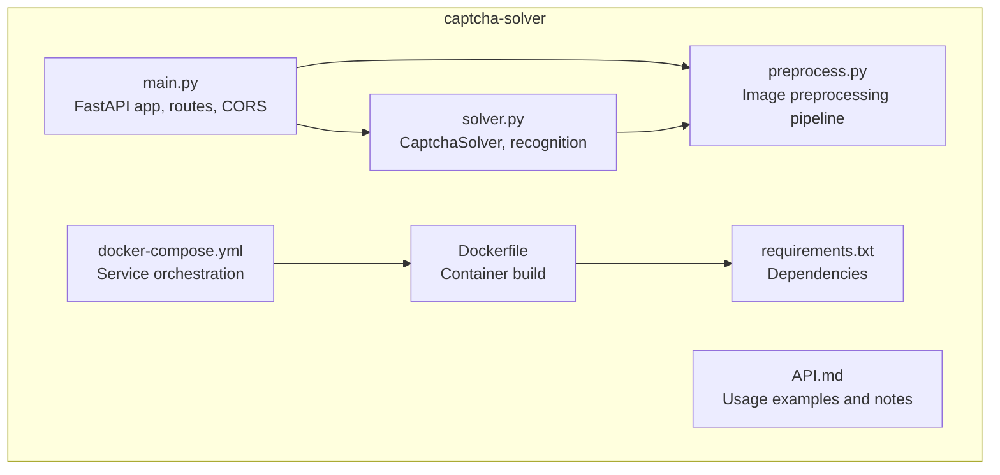
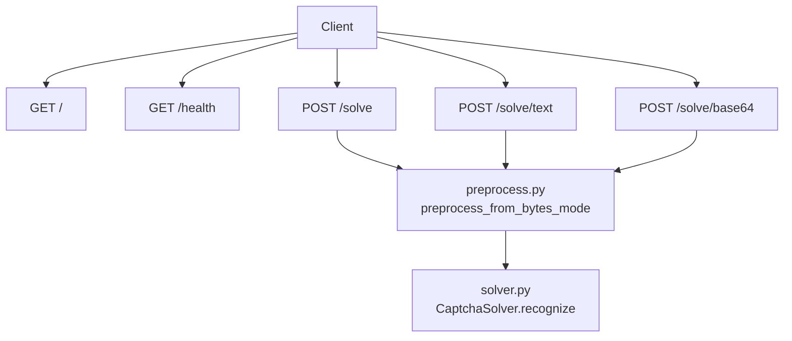
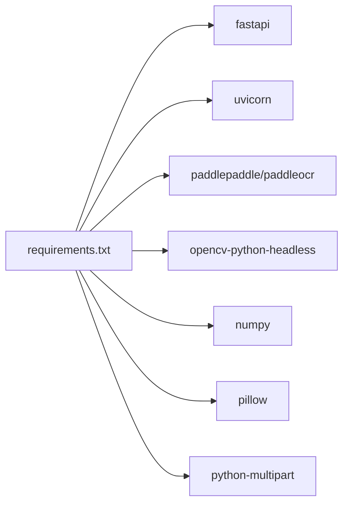

# OCR Service API

<cite>
**Referenced Files in This Document**
- [main.py](file://captcha-solver/main.py)
- [solver.py](file://captcha-solver/solver.py)
- [preprocess.py](file://captcha-solver/preprocess.py)
- [API.md](file://captcha-solver/API.md)
- [requirements.txt](file://captcha-solver/requirements.txt)
- [Dockerfile](file://captcha-solver/Dockerfile)
- [docker-compose.yml](file://captcha-solver/docker-compose.yml)
- [README.md](file://README.md)
</cite>

## Table of Contents
1. [Introduction](#introduction)
2. [Project Structure](#project-structure)
3. [Core Components](#core-components)
4. [Architecture Overview](#architecture-overview)
5. [Detailed Component Analysis](#detailed-component-analysis)
6. [Dependency Analysis](#dependency-analysis)
7. [Performance Considerations](#performance-considerations)
8. [Troubleshooting Guide](#troubleshooting-guide)
9. [Conclusion](#conclusion)
10. [Appendices](#appendices)

## Introduction
This document provides comprehensive API documentation for the OCR service that powers CAPTCHA recognition. It covers all HTTP endpoints, request/response schemas, validation rules, error handling, pre-processing modes, configuration, client implementation guidelines, performance considerations, and troubleshooting tips. The service is built with FastAPI and uses PaddleOCR for text recognition.

## Project Structure
The OCR service resides under the captcha-solver directory and consists of:
- FastAPI application entrypoint and routes
- OCR solver and pre-processing modules
- Docker configuration for containerized deployment
- API usage guide and examples

**Diagram sources**
- [main.py](file://captcha-solver/main.py)
- [solver.py](file://captcha-solver/solver.py)
- [preprocess.py](file://captcha-solver/preprocess.py)
- [requirements.txt](file://captcha-solver/requirements.txt)
- [Dockerfile](file://captcha-solver/Dockerfile)
- [docker-compose.yml](file://captcha-solver/docker-compose.yml)
- [API.md](file://captcha-solver/API.md)

**Section sources**
- [main.py](file://captcha-solver/main.py)
- [solver.py](file://captcha-solver/solver.py)
- [preprocess.py](file://captcha-solver/preprocess.py)
- [requirements.txt](file://captcha-solver/requirements.txt)
- [Dockerfile](file://captcha-solver/Dockerfile)
- [docker-compose.yml](file://captcha-solver/docker-compose.yml)
- [API.md](file://captcha-solver/API.md)

## Core Components
- FastAPI application with lifecycle management, CORS configuration, and route handlers
- OCR solver encapsulated in a singleton class using PaddleOCR
- Preprocessing module offering three modes: full pipeline, grayscale-only, and raw input
- Pydantic model for standardized response schema

Key runtime constants and limits:
- Port: configurable via environment variable
- Allowed origins: configurable via environment variable
- Max file size: 5 MB
- Max image dimensions: 2000 x 1000 pixels

**Section sources**
- [main.py](file://captcha-solver/main.py)
- [solver.py](file://captcha-solver/solver.py)
- [preprocess.py](file://captcha-solver/preprocess.py)

## Architecture Overview
The service exposes four endpoints:
- GET / (root): service metadata
- GET /health (health check): service status
- POST /solve: multipart/form-data upload with JSON response
- POST /solve/text: multipart/form-data upload with plain text response
- POST /solve/base64: JSON payload with Base64 image and JSON response

**Diagram sources**
- [main.py](file://captcha-solver/main.py)
- [solver.py](file://captcha-solver/solver.py)
- [preprocess.py](file://captcha-solver/preprocess.py)

## Detailed Component Analysis

### Endpoint: GET /
- Method: GET
- Path: /
- Description: Returns service metadata indicating the service name and running status.
- Response: JSON object containing service name and status.
- Example response:
  - {"service": "CAPTCHA Solver", "status": "running"}

Common use cases:
- Verify service availability during deployment checks.

**Section sources**
- [main.py](file://captcha-solver/main.py)

### Endpoint: GET /health
- Method: GET
- Path: /health
- Description: Health check endpoint returning a simple status indicator.
- Response: JSON object with a status field set to "healthy".
- Example response:
  - {"status": "healthy"}

Common use cases:
- Kubernetes readiness/liveness probes, monitoring dashboards.

**Section sources**
- [main.py](file://captcha-solver/main.py)

### Endpoint: POST /solve
- Method: POST
- Path: /solve
- Content-Type: multipart/form-data
- Description: Uploads an image file for OCR recognition. Returns a structured JSON response with success flag, recognized text, confidence, and elapsed time. Supports pre-processing mode selection.
- Query parameters:
  - preprocess (string, optional): Pre-processing mode. Allowed values: full, gray, none. Defaults to gray.
- Request body:
  - file (multipart/form-data): Image file to process. Must be a valid image type.
- Response schema (Pydantic model):
  - success: boolean
  - text: string
  - confidence: float | null
  - elapsed_ms: float
  - error: string | null
- Validation rules:
  - Only image/* content types are accepted.
  - File size must not exceed 5 MB.
  - Image dimensions must not exceed 2000 x 1000 pixels.
- Error handling:
  - On invalid file type, size limit exceeded, or dimension limit exceeded: returns HTTP 400 with an error message.
  - On internal processing errors: returns JSON with success=false and error populated.
- Pre-processing modes:
  - full: Complete pipeline (grayscale, noise removal, contrast enhancement, binarization, morphological cleaning).
  - gray: Grayscale only (lightweight).
  - none: No pre-processing (raw image).
- Example request:
  - curl -X POST http://localhost:8000/solve -F "file=@captcha.jpg"
- Example successful response:
  - {"success": true, "text": "4xZL", "confidence": 0.9521, "elapsed_ms": 85.3, "error": null}
- Example failure response:
  - {"success": false, "text": "", "elapsed_ms": 1.2, "error": "..."}

Common use cases:
- Standard OCR recognition with JSON response for downstream processing.

**Section sources**
- [main.py](file://captcha-solver/main.py)
- [solver.py](file://captcha-solver/solver.py)
- [preprocess.py](file://captcha-solver/preprocess.py)

### Endpoint: POST /solve/text
- Method: POST
- Path: /solve/text
- Content-Type: multipart/form-data
- Description: Same as /solve but returns plain text on success and JSON on failure.
- Query parameters:
  - preprocess (string, optional): Pre-processing mode. Allowed values: full, gray, none. Defaults to full.
- Request body:
  - file (multipart/form-data): Image file to process.
- Response:
  - Success: Plain text response containing recognized text.
  - Failure: JSON with success=false, empty text, elapsed_ms, and error.
- Validation rules and error handling:
  - Same as /solve endpoint.
- Example request:
  - curl -X POST http://localhost:8000/solve/text -F "file=@captcha.jpg"
- Example successful response:
  - 4xZL
- Example failure response:
  - {"success": false, "text": "", "elapsed_ms": 1.2, "error": "..."}

Common use cases:
- Lightweight clients that prefer plain text responses.

**Section sources**
- [main.py](file://captcha-solver/main.py)
- [solver.py](file://captcha-solver/solver.py)
- [preprocess.py](file://captcha-solver/preprocess.py)

### Endpoint: POST /solve/base64
- Method: POST
- Path: /solve/base64
- Content-Type: application/json
- Description: Accepts a JSON payload containing a Base64-encoded image and optional pre-processing mode. Returns a structured JSON response.
- Request body schema:
  - image: string (required). Base64-encoded image. Optional MIME prefix (e.g., data:image/png;base64,...) is supported; the part after comma is extracted automatically.
  - preprocess: string (optional). Allowed values: full, gray, none. Defaults to gray.
- Response schema (JSON):
  - success: boolean
  - text: string
  - confidence: float | null
  - elapsed_ms: float
- Validation rules:
  - image field must be present and non-empty.
  - preprocess must be one of full, gray, none; otherwise defaults to full.
  - Decoding Base64 must succeed.
- Error handling:
  - On missing image field: returns HTTP 400.
  - On invalid Base64 or decoding errors: returns JSON with success=false and error populated.
  - On internal processing errors: returns JSON with success=false and error populated.
- Example request:
  - curl -X POST http://localhost:8000/solve/base64 -H "Content-Type: application/json" -d '{"image": "base64编码的图片字符串"}'
- Example successful response:
  - {"success": true, "text": "4xZL", "confidence": 0.9521, "elapsed_ms": 85.3}
- Example failure response:
  - {"success": false, "text": "", "elapsed_ms": 1.2, "error": "..."}

Common use cases:
- Clients that already have Base64 images (e.g., browser uploads, screenshots).

**Section sources**
- [main.py](file://captcha-solver/main.py)
- [solver.py](file://captcha-solver/solver.py)
- [preprocess.py](file://captcha-solver/preprocess.py)

### Data Model: SolveResponse (Pydantic)
- Fields:
  - success: boolean
  - text: string
  - confidence: float | null (optional)
  - elapsed_ms: float
  - error: string | null (optional)
- Notes:
  - Used by POST /solve and POST /solve/base64 endpoints.
  - For POST /solve/text, the endpoint returns either plain text or a JSON object with the same fields when an error occurs.

**Section sources**
- [main.py](file://captcha-solver/main.py)

### Pre-processing Modes
- full: Complete pipeline including grayscale conversion, interference line removal, contrast enhancement, binarization, and morphological cleaning. Recommended for most cases.
- gray: Grayscale conversion only. Faster and suitable for small-size or low-noise images.
- none: No pre-processing; passes raw image to OCR. Use when image quality is already optimal.

Parameters influencing preprocessing (when using full pipeline):
- median_kernel: controls strength of interference line removal
- clahe_clip: CLAHE clip limit for contrast enhancement
- clahe_tile: tile grid size for CLAHE
- binarize_method: adaptive or otsu
- adaptive_block: block size for adaptive thresholding
- adaptive_c: constant subtracted from mean for adaptive thresholding
- morph_open_kernel: opening kernel size
- morph_close_kernel: closing kernel size

These parameters are passed internally during preprocessing and are not exposed as explicit API parameters.

**Section sources**
- [preprocess.py](file://captcha-solver/preprocess.py)
- [solver.py](file://captcha-solver/solver.py)

## Dependency Analysis
External dependencies include FastAPI, Uvicorn, PaddleOCR, OpenCV, NumPy, Pillow, and python-multipart. The Dockerfile installs system libraries required by OpenCV and sets environment variables to optimize model loading.

**Diagram sources**
- [requirements.txt](file://captcha-solver/requirements.txt)

**Section sources**
- [requirements.txt](file://captcha-solver/requirements.txt)
- [Dockerfile](file://captcha-solver/Dockerfile)

## Performance Considerations
- Model initialization: The PaddleOCR model is loaded once during application startup and reused across requests.
- CPU vs GPU: Recognition latency depends on hardware. Typical CPU latency is around 50–150 ms per request.
- Pre-processing cost: Using full pipeline increases accuracy but also processing time. For speed-sensitive scenarios, consider gray mode.
- Concurrency: Uvicorn serves requests concurrently; ensure adequate memory allocation (recommended ≥ 4 GB RAM).
- Image size limits: Large images increase processing time and memory usage. Keep images within the configured bounds.

[No sources needed since this section provides general guidance]

## Troubleshooting Guide
Common issues and resolutions:
- Invalid file type:
  - Symptom: HTTP 400 error indicating unsupported content type.
  - Resolution: Ensure the uploaded file has a valid image/* MIME type.
- File size too large:
  - Symptom: HTTP 400 error mentioning file size limit exceeded.
  - Resolution: Compress or resize the image to stay under 5 MB.
- Image dimensions too large:
  - Symptom: HTTP 400 error mentioning dimension limits exceeded.
  - Resolution: Resize the image to fit within 2000 x 1000 pixels.
- Invalid Base64:
  - Symptom: HTTP 400 error for missing image field or decoding failures.
  - Resolution: Provide a valid Base64 string; optional MIME prefix is supported (comma-separated data is extracted automatically).
- Internal processing errors:
  - Symptom: JSON response with success=false and error populated.
  - Resolution: Retry with corrected input or switch pre-processing mode (e.g., gray or none).
- CORS errors:
  - Symptom: Browser-side CORS policy blocking requests.
  - Resolution: Configure ALLOWED_ORIGINS appropriately; default allows all origins.

Operational checks:
- Health check: Use GET /health to confirm service availability.
- Root endpoint: Use GET / to verify service metadata.

**Section sources**
- [main.py](file://captcha-solver/main.py)
- [API.md](file://captcha-solver/API.md)

## Conclusion
The OCR service provides a robust, configurable API for CAPTCHA recognition with multiple input formats and response styles. By leveraging PaddleOCR and a flexible pre-processing pipeline, it balances accuracy and performance. Proper configuration of environment variables, adherence to size and dimension limits, and careful selection of pre-processing modes enable reliable operation across diverse environments.

[No sources needed since this section summarizes without analyzing specific files]

## Appendices

### Configuration Reference
Environment variables:
- PORT: Listening port (default: 8000)
- ALLOWED_ORIGINS: Comma-separated list of allowed CORS origins (default: *)
- LOG_LEVEL: Logging verbosity (default: info)
- PADDLE_PDX_DISABLE_MODEL_SOURCE_CHECK: Set to True to skip model source checks

Containerization:
- Dockerfile builds a minimal Python image, installs system dependencies for OpenCV, and runs model initialization at startup.
- docker-compose.yml exposes port 8001 mapped to 8000 inside the container, sets environment variables, and applies a memory limit.

**Section sources**
- [main.py](file://captcha-solver/main.py)
- [Dockerfile](file://captcha-solver/Dockerfile)
- [docker-compose.yml](file://captcha-solver/docker-compose.yml)
- [README.md](file://README.md)

### Client Implementation Guidelines
- File upload (multipart/form-data):
  - Use POST /solve or POST /solve/text with a file field named file.
  - For JSON responses, prefer POST /solve; for plain text, use POST /solve/text.
- Base64 input (application/json):
  - Send a JSON object with image as a Base64 string and optional preprocess field.
  - Optional MIME prefix is supported; the part after comma is extracted automatically.
- Error handling:
  - For POST /solve/text, handle both plain text success and JSON error responses.
  - For POST /solve and POST /solve/base64, parse the JSON response and check success and error fields.
- Pre-processing mode:
  - Choose gray for speed or none for images already optimized; full is recommended for general cases.

**Section sources**
- [main.py](file://captcha-solver/main.py)
- [API.md](file://captcha-solver/API.md)