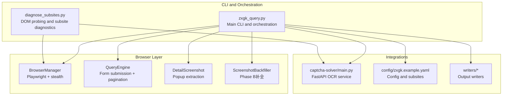
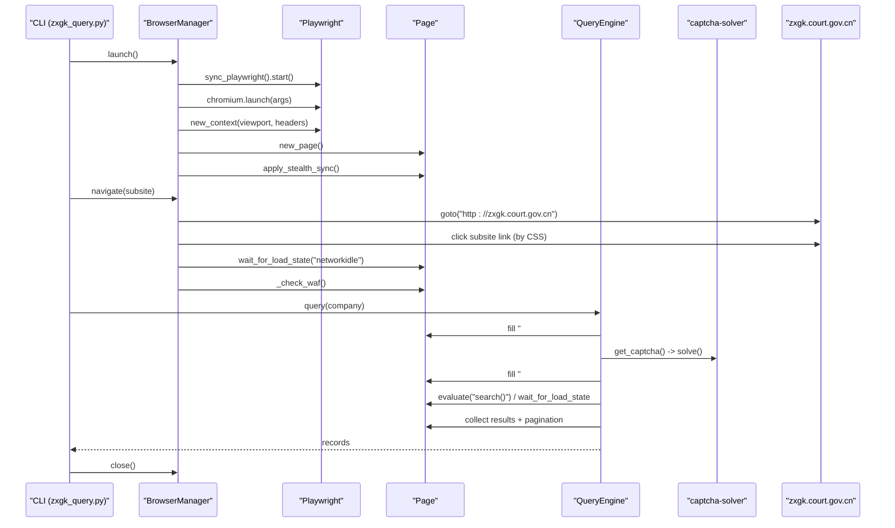
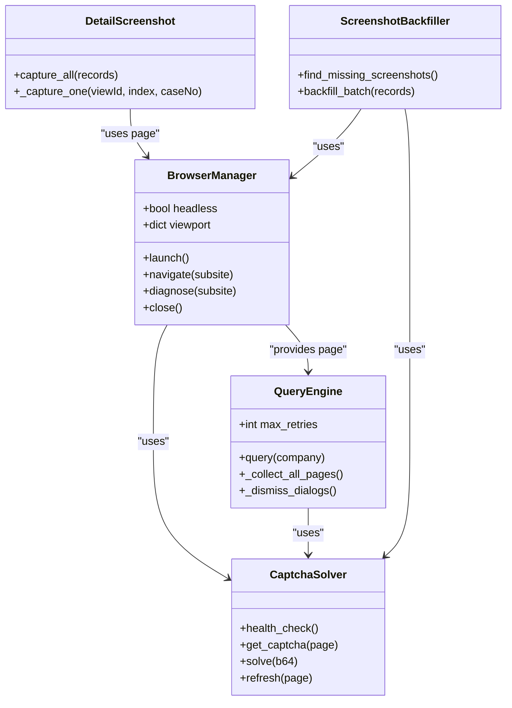
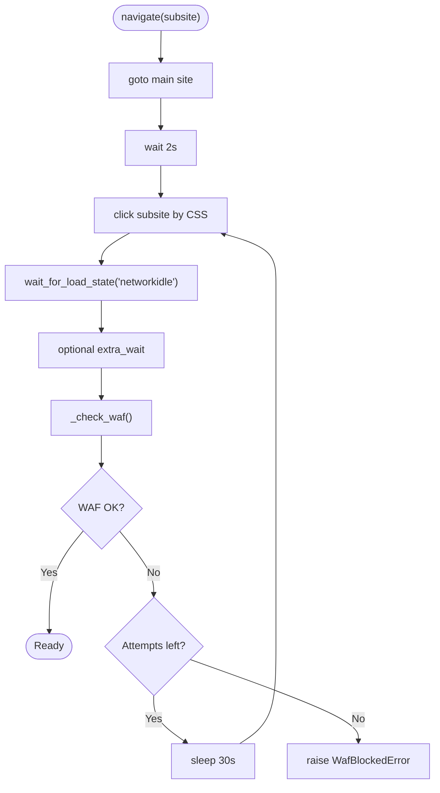
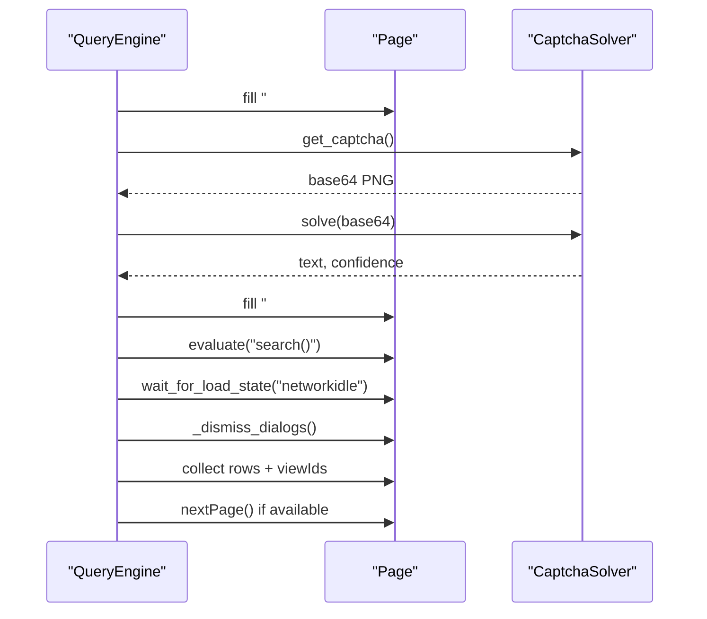
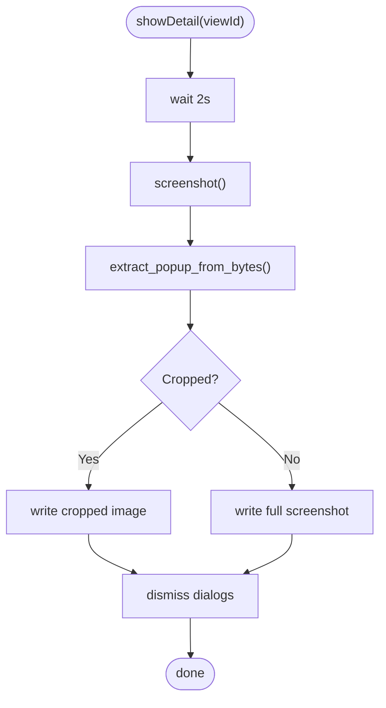
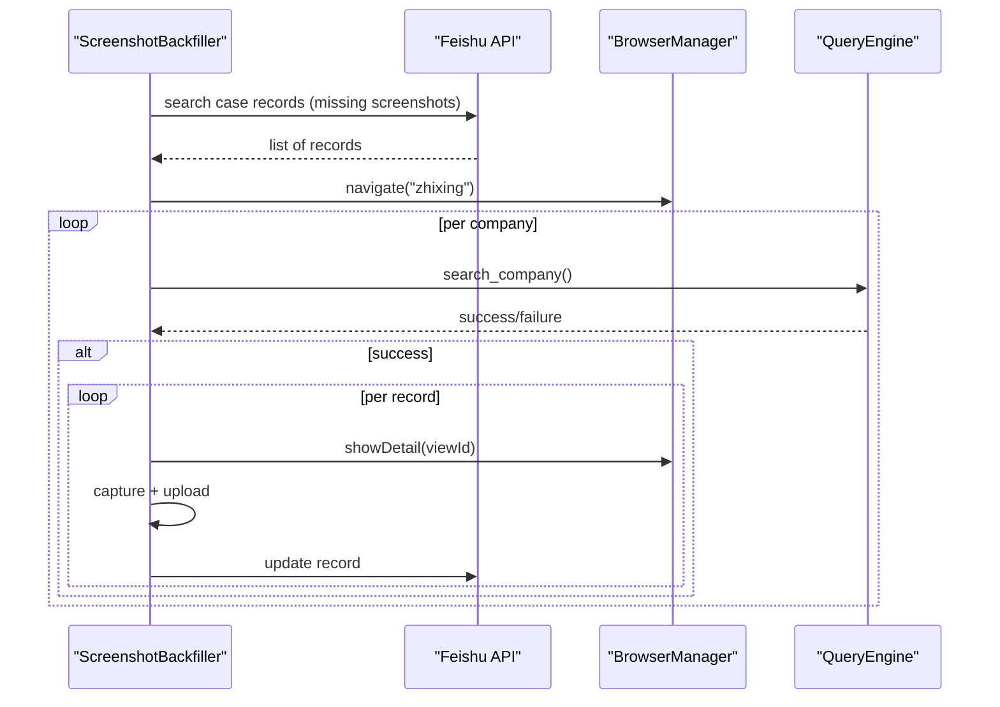
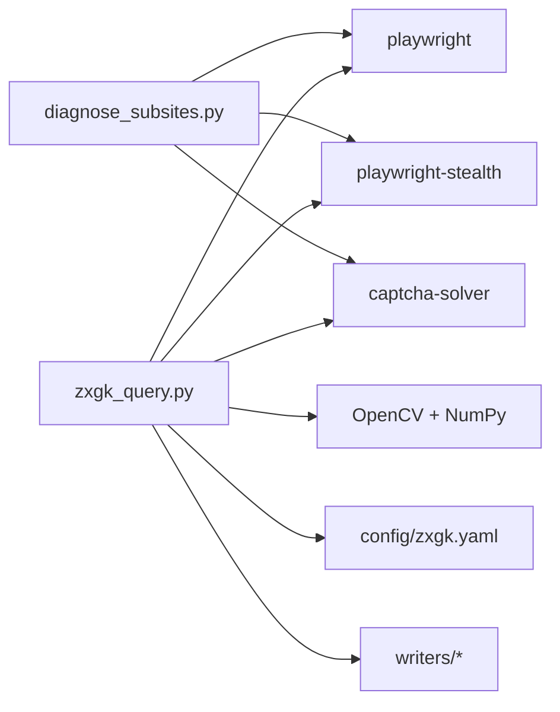

# Browser Automation System

<cite>
**Referenced Files in This Document**
- [README.md](file://README.md)
- [zxgk_query.py](file://zxgk_query.py)
- [diagnose_subsites.py](file://diagnose_subsites.py)
- [config/zxgk.example.yaml](file://config/zxgk.example.yaml)
- [captcha-solver/main.py](file://captcha-solver/main.py)
- [writers/__init__.py](file://writers/__init__.py)
</cite>

## Table of Contents
1. [Introduction](#introduction)
2. [Project Structure](#project-structure)
3. [Core Components](#core-components)
4. [Architecture Overview](#architecture-overview)
5. [Detailed Component Analysis](#detailed-component-analysis)
6. [Dependency Analysis](#dependency-analysis)
7. [Performance Considerations](#performance-considerations)
8. [Troubleshooting Guide](#troubleshooting-guide)
9. [Conclusion](#conclusion)
10. [Appendices](#appendices)

## Introduction
This document explains the browser automation subsystem that powers Playwright-based stealth browsing and multi-subsite navigation for querying China’s enforcement information websites. It focuses on:
- The BrowserManager class and its stealth configuration
- WAF detection and bypass mechanisms
- Subsite-specific navigation patterns for zhixing, shixin, and xgl domains
- Integration with the CAPTCHA solver service
- Error recovery, session management, proxies, and performance tuning
- Practical examples from the codebase for browser initialization, page interactions, and element selection strategies

The goal is to make the system understandable for beginners while providing deep technical insights for experienced developers.

## Project Structure
The automation system centers around a single CLI script that orchestrates browser sessions, navigations, queries, screenshots, and storage. Supporting modules include diagnostics, configuration, and optional writers for output.

**Diagram sources**
- [zxgk_query.py](file://zxgk_query.py)
- [diagnose_subsites.py](file://diagnose_subsites.py)
- [config/zxgk.example.yaml](file://config/zxgk.example.yaml)
- [captcha-solver/main.py](file://captcha-solver/main.py)
- [writers/__init__.py](file://writers/__init__.py)

**Section sources**
- [README.md](file://README.md)
- [zxgk_query.py](file://zxgk_query.py)
- [diagnose_subsites.py](file://diagnose_subsites.py)
- [config/zxgk.example.yaml](file://config/zxgk.example.yaml)
- [writers/__init__.py](file://writers/__init__.py)

## Core Components
- BrowserManager: Launches a stealth Chromium browser, creates a new context/page, applies Playwright stealth, and navigates to subsites with robust WAF checks and retries.
- QueryEngine: Handles form filling, CAPTCHA acquisition and solving, submission, result collection, and pagination with de-duplication.
- CaptchaSolver: Integrates with the OCR service to extract and solve CAPTCHAs from the page.
- DetailScreenshot: Captures and crops detail popups using DOM hints and OpenCV fallback.
- ScreenshotBackfiller: Phase B workflow to find missing screenshots and re-query to capture/upload them.
- Diagnostics: Probes DOM structure and validates subsite readiness.

**Section sources**
- [zxgk_query.py](file://zxgk_query.py)
- [diagnose_subsites.py](file://diagnose_subsites.py)

## Architecture Overview
The system uses Playwright with stealth to emulate a real browser, navigates to the main site, clicks into subsites, solves CAPTCHAs, submits queries, collects results, and optionally captures screenshots.

**Diagram sources**
- [zxgk_query.py](file://zxgk_query.py)
- [captcha-solver/main.py](file://captcha-solver/main.py)

## Detailed Component Analysis

### BrowserManager: Stealth Navigation and WAF Detection
- Responsibilities:
  - Launch Chromium with hardened arguments and stealth overrides
  - Create a new browser context with locale and headers
  - Navigate to the main site, click subsite links, and wait for stability
  - Detect WAF封禁 and retry with backoff
  - Provide diagnostic mode to inspect readiness

- Key implementation details:
  - Stealth configuration includes navigator platform, languages, vendor, and WebGL overrides.
  - Navigation retries up to three times with delays when WAF封禁 occurs.
  - WAF detection checks for presence of the CAPTCHA container and body length.
  - Subsite CSS selectors are configured centrally and used to click into subsites.

- Example code paths:
  - Browser launch and stealth: [BrowserManager.launch:195-221](file://zxgk_query.py#L195-L221)
  - Navigation and WAF checks: [BrowserManager.navigate/_check_waf:251-304](file://zxgk_query.py#L251-L304)
  - Subsite click via CSS: [BrowserManager._click_subsite:278-295](file://zxgk_query.py#L278-L295)
  - Diagnostic mode: [BrowserManager.diagnose:306-324](file://zxgk_query.py#L306-L324)

- Subsite-specific navigation patterns:
  - zhixing: CSS selector targets the “被执行人” link.
  - shixin: CSS selector targets the “失信被执行人” link.
  - xgl: CSS selector targets the “限制消费人员” link.
  - Each subsite can define extra wait seconds to stabilize dynamic content.

- Session management and cleanup:
  - Global cleanup hooks and signal handlers ensure orphaned Chromium processes are killed.
  - Context and page lifecycle is managed via context manager and explicit close.

- Proxy configuration:
  - Environment variables for HTTP/HTTPS/all proxies are cleaned before launching the browser to avoid leaking proxies.

- Error handling:
  - WafBlockedError raised when WAF封禁 is detected.
  - SubsiteNavError raised when CSS selector fails to locate the subsite link.

**Section sources**
- [zxgk_query.py](file://zxgk_query.py)
- [config/zxgk.example.yaml](file://config/zxgk.example.yaml)

### QueryEngine: Form Submission, CAPTCHA Solving, and Pagination
- Responsibilities:
  - Fill search forms, acquire and solve CAPTCHAs, submit queries, and collect results
  - Handle special cases like shixin province selection
  - Dismiss overlays and dialogs that block result access
  - Paginate through results and de-duplicate by viewId

- Key implementation details:
  - CAPTCHA extraction uses JavaScript to locate the image inside the CAPTCHA container and draw it to a canvas for base64 encoding.
  - OCR service is called with preprocessed grayscale images for higher accuracy.
  - Submission waits for the search function to be ready and triggers it safely.
  - Dialog dismissal iterates through known modal/dialog selectors and clicks confirm/close buttons.
  - Pagination checks for next button state and continues until exhausted.

- Example code paths:
  - CAPTCHA extraction and solving: [CaptchaSolver.get_captcha/solve:339-392](file://zxgk_query.py#L339-L392)
  - Query loop and result collection: [QueryEngine.query/_collect_all_pages:409-618](file://zxgk_query.py#L409-L618)
  - Dialog dismissal: [QueryEngine._dismiss_dialogs/_dismiss_overlay:507-557](file://zxgk_query.py#L507-L557)

- Special handling for subsites:
  - shixin requires selecting “全部” (all provinces) in the province dropdown before search.

- Error recovery:
  - Re-tries on OCR failures, low confidence, or CAPTCHA errors
  - Refreshes CAPTCHAs and resets form fields on failures

**Section sources**
- [zxgk_query.py](file://zxgk_query.py)

### DetailScreenshot: Popup Extraction and Cropping
- Responsibilities:
  - Trigger detail popups by invoking showDetail with viewId
  - Capture screenshots and crop to popup region using OpenCV
  - Fallback to full-page screenshot if cropping fails

- Key implementation details:
  - Uses OpenCV to detect popup-like rectangles by edges, white backgrounds, and column projections
  - Writes cropped images to disk and returns dimensions for verification

- Example code paths:
  - Popup extraction: [extract_popup_from_bytes:623-677](file://zxgk_query.py#L623-L677)
  - Detail capture workflow: [DetailScreenshot.capture_all/_capture_one:689-725](file://zxgk_query.py#L689-L725)

**Section sources**
- [zxgk_query.py](file://zxgk_query.py)

### ScreenshotBackfiller: Phase B补全 Workflow
- Responsibilities:
  - Find missing screenshots in the case table via Feishu API
  - Resolve viewId from raw table via DuplexLink
  - Re-run search and capture screenshots for missing records
  - Upload screenshots to Feishu and update records

- Key implementation details:
  - Uses Feishu APIs to search records, upload media, and update fields
  - Groups records by company and performs controlled intervals between actions
  - Reuses BrowserManager and QueryEngine for consistent behavior

- Example code paths:
  - Missing screenshot discovery: [ScreenshotBackfiller.find_missing_screenshots:824-880](file://zxgk_query.py#L824-L880)
  - Backfill loop: [ScreenshotBackfiller.backfill_batch:882-956](file://zxgk_query.py#L882-L956)
  - Search and capture: [ScreenshotBackfiller._search_company/_capture_detail:958-1048](file://zxgk_query.py#L958-L1048)

**Section sources**
- [zxgk_query.py](file://zxgk_query.py)

### Diagnostics: Subsite DOM Probe and Health Checks
- Responsibilities:
  - Probe DOM structure for zhixing, shixin, and xgl
  - Validate WAF readiness and form fields
  - Run a test search and report results

- Key implementation details:
  - Applies stealth and navigates to each subsite using CSS selectors
  - Extracts CAPTCHA, sends to OCR service, and attempts search
  - Reports table structure, pagination, and column counts

- Example code paths:
  - Probe routine: [probe_subsite:103-330](file://diagnose_subsites.py#L103-L330)
  - Main driver: [main:333-429](file://diagnose_subsites.py#L333-L429)

**Section sources**
- [diagnose_subsites.py](file://diagnose_subsites.py)

### CAPTCHA Solver Integration
- Responsibilities:
  - Provide OCR service for CAPTCHA recognition
  - Expose health check and solve endpoints
  - Support multiple input formats (multipart, base64)

- Key implementation details:
  - FastAPI service with CORS middleware and request validation
  - Preprocessing modes: full, gray, none
  - Async execution to offload heavy OCR work

- Example code paths:
  - Health check and endpoints: [captcha-solver/main.py:107-209](file://captcha-solver/main.py#L107-L209)

**Section sources**
- [captcha-solver/main.py](file://captcha-solver/main.py)

## Architecture Overview

**Diagram sources**
- [zxgk_query.py](file://zxgk_query.py)

## Detailed Component Analysis

### BrowserManager Class
- Initialization and stealth:
  - Configurable headless mode, viewport, and optional executable path
  - Applies navigator platform, language, vendor, and WebGL overrides
- Navigation:
  - Navigates to the main site, clicks subsite link by CSS selector, waits for network idle, and applies extra wait
  - Retries navigation on WAF封禁 with exponential backoff
- WAF detection:
  - Checks for CAPTCHA container and body length; raises WafBlockedError if absent
- Diagnostics:
  - Returns readiness status and key DOM indicators for debugging

**Diagram sources**
- [zxgk_query.py](file://zxgk_query.py)

**Section sources**
- [zxgk_query.py](file://zxgk_query.py)

### QueryEngine: Submission and Collection
- Submission flow:
  - Fill company name
  - Acquire CAPTCHA image, solve via OCR, fill CAPTCHA field
  - Trigger search function and dismiss overlays
- Result collection:
  - Read result block and table rows
  - De-duplicate by viewId and paginate until exhausted
- Error handling:
  - Re-try on OCR failures, low confidence, or CAPTCHA errors
  - Reset form and CAPTCHA on failures

**Diagram sources**
- [zxgk_query.py](file://zxgk_query.py)

**Section sources**
- [zxgk_query.py](file://zxgk_query.py)

### DetailScreenshot: Popup Extraction
- Strategy:
  - Use OpenCV to detect popup-like regions by edges, white background, and column projection
  - Crop and save; fall back to full-page screenshot if cropping fails
- Controls:
  - Interval between captures to avoid rate limits

**Diagram sources**
- [zxgk_query.py](file://zxgk_query.py)

**Section sources**
- [zxgk_query.py](file://zxgk_query.py)

### ScreenshotBackfiller: Phase B补全
- Workflow:
  - Query case table for missing screenshots
  - Resolve viewId via DuplexLink
  - Re-search, capture, upload, and update records
- Controls:
  - Limits per session and intervals between actions

**Diagram sources**
- [zxgk_query.py](file://zxgk_query.py)

**Section sources**
- [zxgk_query.py](file://zxgk_query.py)

## Dependency Analysis
- Internal dependencies:
  - BrowserManager depends on Playwright and playwright-stealth
  - QueryEngine depends on CaptchaSolver and DOM evaluation
  - DetailScreenshot depends on OpenCV and NumPy
  - ScreenshotBackfiller depends on Feishu APIs and writers
- External dependencies:
  - captcha-solver FastAPI service for OCR
  - Feishu APIs for data synchronization (optional)
- Configuration:
  - Centralized via YAML with subsite CSS selectors and WAF parameters

**Diagram sources**
- [zxgk_query.py](file://zxgk_query.py)
- [diagnose_subsites.py](file://diagnose_subsites.py)
- [config/zxgk.example.yaml](file://config/zxgk.example.yaml)
- [captcha-solver/main.py](file://captcha-solver/main.py)

**Section sources**
- [zxgk_query.py](file://zxgk_query.py)
- [diagnose_subsites.py](file://diagnose_subsites.py)
- [config/zxgk.example.yaml](file://config/zxgk.example.yaml)
- [captcha-solver/main.py](file://captcha-solver/main.py)

## Performance Considerations
- Headless mode reduces overhead; adjust viewport to balance speed and stability.
- Use extra_wait per subsite to avoid race conditions during dynamic content loading.
- Control intervals between screenshots and companies to reduce rate limiting.
- Limit concurrent sessions and reuse a single BrowserManager per session to minimize process churn.
- Prefer grayscale preprocessing for OCR to improve accuracy and speed.
- Clean environment variables before launch to avoid proxy-related slowdowns.

[No sources needed since this section provides general guidance]

## Troubleshooting Guide
- WAF封禁:
  - Symptoms: absence of CAPTCHA container or extremely short body length
  - Actions: increase cooldown, retry navigation, verify stealth overrides
- CAPTCHA solver unavailable:
  - Symptoms: health check fails or OCR returns empty
  - Actions: start OCR service, verify endpoint, adjust preprocess mode
- Subsite link not found:
  - Symptoms: CSS selector fails to locate anchor
  - Actions: update CSS selector in config, re-run diagnostics
- Overlays blocking results:
  - Symptoms: dialogs prevent reading result block
  - Actions: enable dialog dismissal, verify selectors
- Session leaks:
  - Symptoms: lingering Chromium processes
  - Actions: ensure cleanup hooks and signal handlers are active

**Section sources**
- [zxgk_query.py](file://zxgk_query.py)
- [diagnose_subsites.py](file://diagnose_subsites.py)

## Conclusion
The browser automation subsystem combines Playwright stealth, robust WAF detection, and resilient CAPTCHA solving to reliably query multiple enforcement sub-sites. Its modular design enables diagnostics, screenshot capture, and optional Feishu integration. By tuning configuration, managing sessions, and leveraging error recovery, the system achieves high throughput while minimizing failures.

[No sources needed since this section summarizes without analyzing specific files]

## Appendices

### Configuration Reference
- Browser options: headless, viewport
- WAF parameters: captcha_max_retries, cooldown_on_block_sec, company_interval_sec, screenshot_interval_sec, max_consecutive_fails
- Subsites: name, css_selector, extra_wait_sec
- Output: directories for JSON and screenshots

**Section sources**
- [config/zxgk.example.yaml](file://config/zxgk.example.yaml)

### Example Code Paths
- Browser launch and stealth: [BrowserManager.launch:195-221](file://zxgk_query.py#L195-L221)
- Navigation and WAF checks: [BrowserManager.navigate/_check_waf:251-304](file://zxgk_query.py#L251-L304)
- Subsite click via CSS: [BrowserManager._click_subsite:278-295](file://zxgk_query.py#L278-L295)
- CAPTCHA extraction and solving: [CaptchaSolver.get_captcha/solve:339-392](file://zxgk_query.py#L339-L392)
- Query loop and result collection: [QueryEngine.query/_collect_all_pages:409-618](file://zxgk_query.py#L409-L618)
- Popup extraction: [extract_popup_from_bytes:623-677](file://zxgk_query.py#L623-L677)
- Missing screenshot discovery: [ScreenshotBackfiller.find_missing_screenshots:824-880](file://zxgk_query.py#L824-L880)
- OCR service endpoints: [captcha-solver/main.py:107-209](file://captcha-solver/main.py#L107-L209)