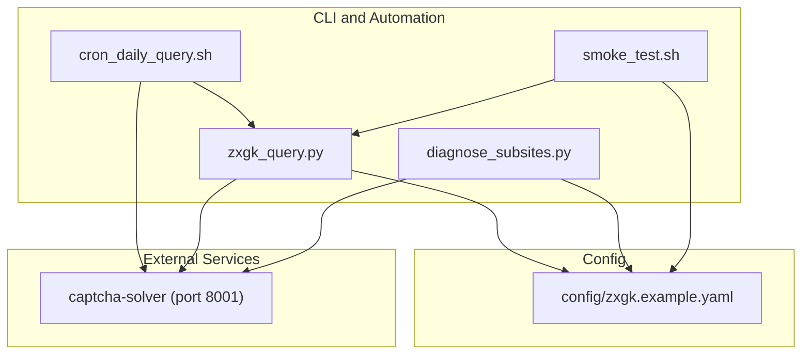
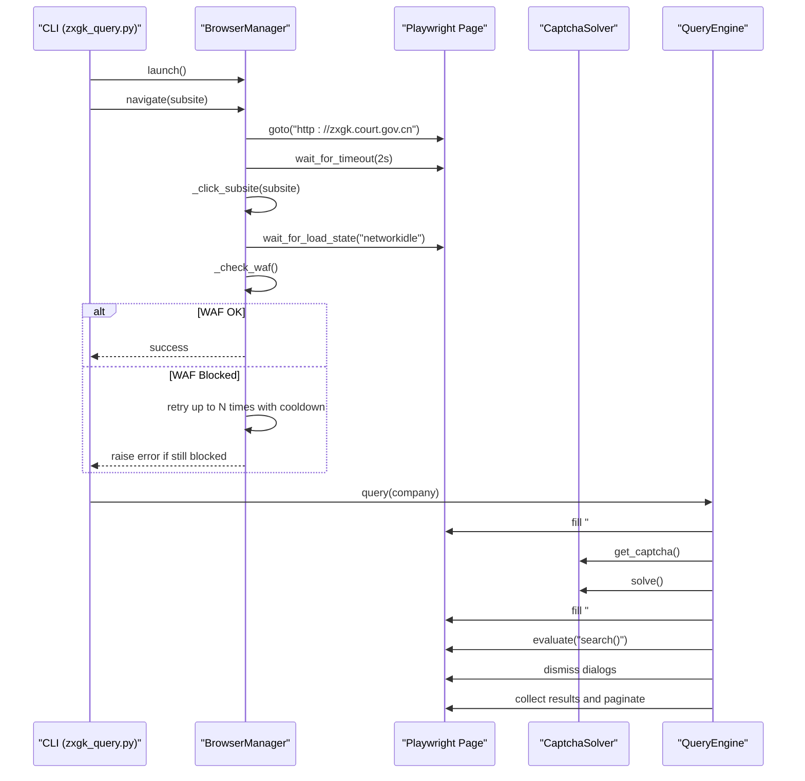
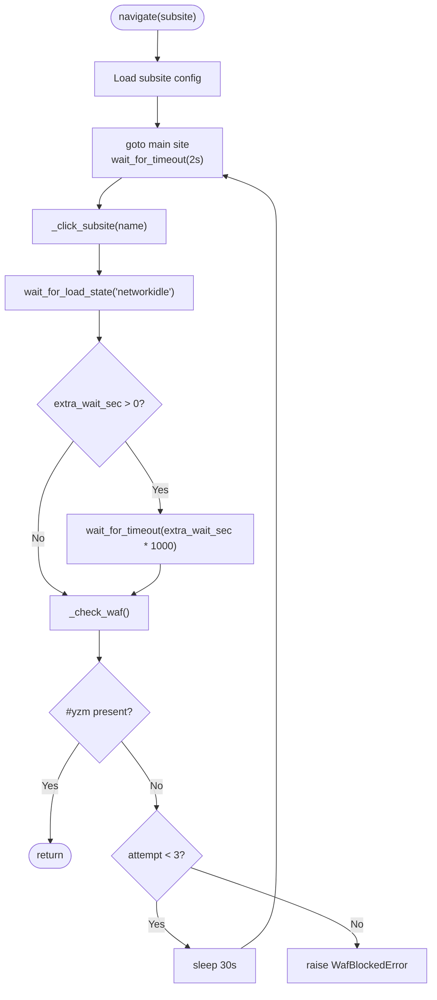
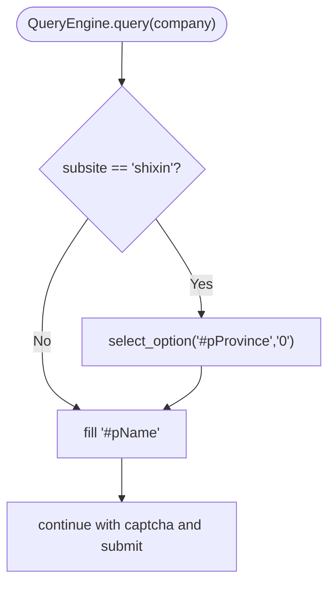
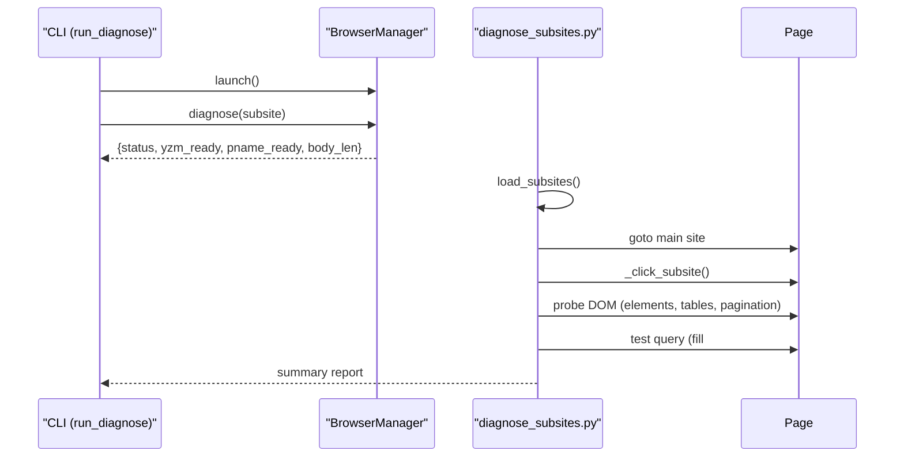
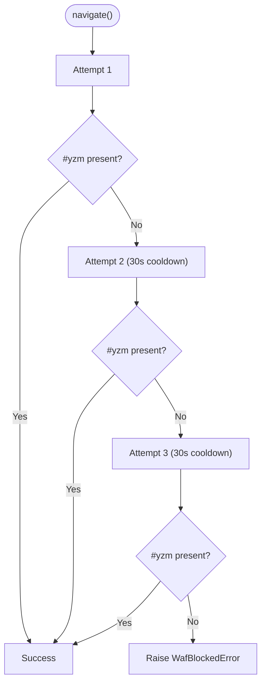
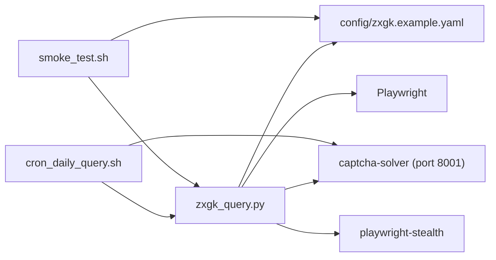

# Multi-Subsite Navigation

<cite>
**Referenced Files in This Document**
- [zxgk_query.py](file://zxgk_query.py)
- [diagnose_subsites.py](file://diagnose_subsites.py)
- [config/zxgk.example.yaml](file://config/zxgk.example.yaml)
- [README.md](file://README.md)
- [cron_daily_query.sh](file://cron_daily_query.sh)
- [smoke_test.sh](file://smoke_test.sh)
</cite>

## Table of Contents
1. [Introduction](#introduction)
2. [Project Structure](#project-structure)
3. [Core Components](#core-components)
4. [Architecture Overview](#architecture-overview)
5. [Detailed Component Analysis](#detailed-component-analysis)
6. [Dependency Analysis](#dependency-analysis)
7. [Performance Considerations](#performance-considerations)
8. [Troubleshooting Guide](#troubleshooting-guide)
9. [Conclusion](#conclusion)

## Introduction
This document explains the multi-subsite navigation system used to seamlessly transition between three sub-sites under the unified execution information public disclosure platform: zhixing (executed person), shixin (dishonest executed person), and xgl (restricted consumption personnel). It focuses on:
- The navigate() method implementation for robust navigation and WAF resilience
- Subsite configuration loading and CSS selector-based link targeting
- Navigation state management and error handling
- The _click_subsite() method and its DOM interaction strategies
- Subsite-specific differences, especially the shixin special case requiring province selection
- Concrete navigation flows, error handling, and retry mechanisms
- The diagnose() method for system health verification and DOM structure validation
- Common navigation issues and performance considerations for rapid subsite switching

## Project Structure
The navigation system is implemented primarily in a single module with complementary diagnostic and orchestration scripts:
- Core navigation and query logic: [zxgk_query.py](file://zxgk_query.py)
- Subsite diagnostics and DOM probing: [diagnose_subsites.py](file://diagnose_subsites.py)
- Configuration for subsites and runtime parameters: [config/zxgk.example.yaml](file://config/zxgk.example.yaml)
- Orchestration of daily runs across all subsites: [cron_daily_query.sh](file://cron_daily_query.sh)
- Smoke testing for environment readiness: [smoke_test.sh](file://smoke_test.sh)
- High-level project overview and subsite differences: [README.md](file://README.md)



**Diagram sources**
- [zxgk_query.py](file://zxgk_query.py)
- [diagnose_subsites.py](file://diagnose_subsites.py)
- [config/zxgk.example.yaml](file://config/zxgk.example.yaml)
- [cron_daily_query.sh](file://cron_daily_query.sh)
- [smoke_test.sh](file://smoke_test.sh)

**Section sources**
- [README.md](file://README.md)
- [config/zxgk.example.yaml](file://config/zxgk.example.yaml)
- [cron_daily_query.sh](file://cron_daily_query.sh)

## Core Components
- BrowserManager: Launches and manages a persistent browser session, performs navigation to a target subsite, handles WAF detection, and provides a diagnose() endpoint.
- QueryEngine: Executes queries within a subsite, handles captcha solving, form submission, pagination, and result collection.
- CaptchaSolver: Integrates with the local OCR service to extract and solve captchas.
- ScreenshotBackfiller: Supports post-run screenshot backfill for missing records.
- BatchRunner: Orchestrates batch queries, manages retries, cooldowns, and progress persistence.
- diagnose_subsites.py: Probes DOM structure and key elements across all three subsites for health checks and selector validation.

Key responsibilities:
- navigate(): Loads subsite configuration, clicks the CSS-selector-based link, waits for network idle, applies extra wait, and validates WAF readiness with retry on failure.
- _click_subsite(): Uses a CSS selector to locate a DOM element, finds its anchor ancestor, and triggers a click with target="_self".
- diagnose(): Validates WAF readiness and returns structured status for a given subsite.

**Section sources**
- [zxgk_query.py](file://zxgk_query.py)
- [diagnose_subsites.py](file://diagnose_subsites.py)

## Architecture Overview
The navigation pipeline connects the CLI entrypoint to subsite-specific pages via a CSS-selector-driven click. The system accounts for WAF protections and transient UI overlays.



**Diagram sources**
- [zxgk_query.py](file://zxgk_query.py)

## Detailed Component Analysis

### BrowserManager: navigate(), _click_subsite(), _check_waf(), diagnose()
- navigate(subsite_name)
  - Loads subsite configuration from config["subsites"]
  - Navigates to the main site, waits, clicks the subsite link via CSS selector, waits for network idle, applies extra wait, and verifies WAF readiness
  - Retries up to three times on WAF block with 30-second cooldown between attempts
- _click_subsite(name)
  - Retrieves CSS selector from config["subsites"][name]["css_selector"]
  - Evaluates a script to select the element, find its anchor ancestor, set target="_self", and click
  - Raises a dedicated error if the selector fails to match
- _check_waf()
  - Checks for presence of #yzm and logs body length
  - Raises WafBlockedError if #yzm is absent
- diagnose(subsite_name)
  - Runs navigate(subsite_name)
  - Returns structured status including readiness flags and body length



**Diagram sources**
- [zxgk_query.py](file://zxgk_query.py)

**Section sources**
- [zxgk_query.py](file://zxgk_query.py)

### Subsite Configuration Loading and CSS Selector-Based Link Targeting
- Configuration source: config["subsites"] with keys "zhixing", "shixin", "xgl"
- Each entry includes:
  - name: human-readable label
  - css_selector: CSS selector for the subsite tile/link
  - extra_wait_sec: additional wait after navigation
- The _click_subsite() method uses the configured CSS selector to locate the element and click its anchor ancestor, ensuring target="_self" for in-page navigation.

```mermaid
classDiagram
class BrowserManager {
+config
+navigate(subsite_name)
+_click_subsite(name)
+_check_waf()
+diagnose(subsite_name)
}
class Config {
+subsites : map[name] = {name, css_selector, extra_wait_sec}
}
BrowserManager --> Config : "loads"
```

**Diagram sources**
- [zxgk_query.py](file://zxgk_query.py)
- [config/zxgk.example.yaml](file://config/zxgk.example.yaml)

**Section sources**
- [config/zxgk.example.yaml](file://config/zxgk.example.yaml)
- [zxgk_query.py](file://zxgk_query.py)

### Subsite-Specific Navigation Differences: shixin Province Selection
- The QueryEngine sets the province dropdown to "全部" (all provinces) for the shixin subsite before filling the company name. This ensures broader coverage of dishonest executed persons across jurisdictions.
- Other subsites (zhixing, xgl) do not require this explicit province selection.



**Diagram sources**
- [zxgk_query.py](file://zxgk_query.py)

**Section sources**
- [zxgk_query.py](file://zxgk_query.py)
- [README.md](file://README.md)

### diagnose() Method for System Health Verification and DOM Validation
- The diagnose() method in BrowserManager:
  - Navigates to the target subsite
  - Checks for presence of key elements (#yzm, #pName, #pProvince if present)
  - Returns structured status including readiness flags and body length
- The standalone diagnose_subsites.py script:
  - Loads subsite configuration from config/zxgk.yaml (or falls back to defaults)
  - Navigates to each subsite, probes DOM structure, and prints a comprehensive summary
  - Attempts a test query to validate the search flow and pagination



**Diagram sources**
- [zxgk_query.py](file://zxgk_query.py)
- [diagnose_subsites.py](file://diagnose_subsites.py)

**Section sources**
- [zxgk_query.py](file://zxgk_query.py)
- [diagnose_subsites.py](file://diagnose_subsites.py)

### Navigation Flow Examples and Error Handling
- Typical flow:
  - Launch browser
  - Navigate to main site
  - Click subsite link via CSS selector
  - Wait for network idle and optional extra wait
  - Validate WAF readiness (#yzm present)
  - Retry on WAF block with cooldown
- Error handling:
  - WafBlockedError raised when #yzm is absent
  - SubsiteNavError raised when CSS selector fails to locate the link
  - BatchRunner restarts browser after consecutive failures and applies cooldowns
- Retry mechanisms:
  - navigate(): up to 3 attempts with 30s cooldown
  - BatchRunner: configurable max consecutive failures and cooldown on block



**Diagram sources**
- [zxgk_query.py](file://zxgk_query.py)

**Section sources**
- [zxgk_query.py](file://zxgk_query.py)

### Rapid Subsite Switching Considerations
- The system maintains a single browser session across multiple subsites during a run to minimize overhead.
- Each subsite navigation uses CSS selectors defined in configuration to ensure fast and reliable transitions.
- BatchRunner applies company intervals and cooldowns to balance throughput and stability.

**Section sources**
- [zxgk_query.py](file://zxgk_query.py)
- [cron_daily_query.sh](file://cron_daily_query.sh)

## Dependency Analysis
- Internal dependencies:
  - BrowserManager depends on configuration subsites and Playwright page APIs
  - QueryEngine depends on CaptchaSolver and DOM selectors
  - BatchRunner orchestrates BrowserManager, QueryEngine, and output writers
- External dependencies:
  - captcha-solver service (port 8001) for OCR
  - Playwright and stealth libraries for browser automation



**Diagram sources**
- [zxgk_query.py](file://zxgk_query.py)
- [config/zxgk.example.yaml](file://config/zxgk.example.yaml)
- [cron_daily_query.sh](file://cron_daily_query.sh)
- [smoke_test.sh](file://smoke_test.sh)

**Section sources**
- [zxgk_query.py](file://zxgk_query.py)
- [config/zxgk.example.yaml](file://config/zxgk.example.yaml)
- [cron_daily_query.sh](file://cron_daily_query.sh)
- [smoke_test.sh](file://smoke_test.sh)

## Performance Considerations
- Minimize repeated browser launches by reusing a single BrowserManager instance across subsites
- Use extra_wait_sec judiciously to avoid unnecessary delays; tune per subsite based on observed load times
- Apply company intervals and cooldowns to prevent rate limiting and reduce WAF-triggered blocks
- Prefer CSS selectors that are stable and specific to reduce evaluation overhead
- Limit screenshot operations to necessary moments to reduce I/O overhead

[No sources needed since this section provides general guidance]

## Troubleshooting Guide
Common issues and resolutions:
- CSS selector updates due to website changes:
  - Update the css_selector for the affected subsite in config/zxgk.yaml
  - Use diagnose_subsites.py to probe DOM structure and confirm selectors
- WAF blocking:
  - Increase cooldown periods and adjust max_consecutive_fails
  - Verify captcha-solver health and availability
- Navigation failures:
  - Confirm subsite configuration and extra_wait_sec values
  - Validate that _click_subsite() can locate the anchor ancestor
- Shixin province selection:
  - Ensure #pProvince is set to "全部" before query submission for shixin
- Diagnostics:
  - Run the diagnose() method or diagnose_subsites.py to validate readiness and DOM structure

**Section sources**
- [zxgk_query.py](file://zxgk_query.py)
- [diagnose_subsites.py](file://diagnose_subsites.py)
- [config/zxgk.example.yaml](file://config/zxgk.example.yaml)

## Conclusion
The multi-subsite navigation system provides a robust, configurable, and resilient pathway to switch between zhixing, shixin, and xgl sub-sites. By leveraging CSS selector-based targeting, structured WAF detection, and comprehensive diagnostics, it minimizes brittle failures and adapts to evolving site structures. Proper configuration, careful tuning of timing and retry parameters, and periodic health checks ensure reliable operation across rapid subsite switching scenarios.