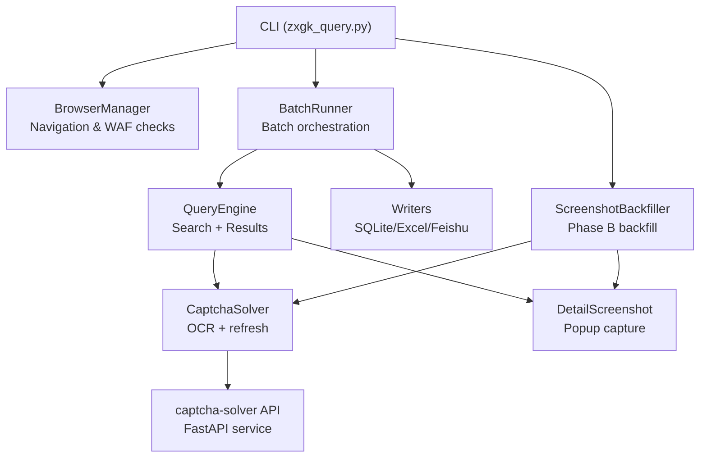
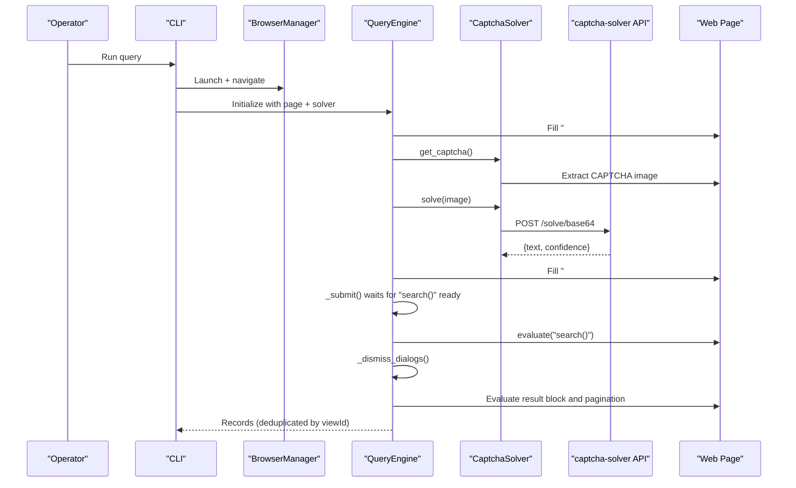
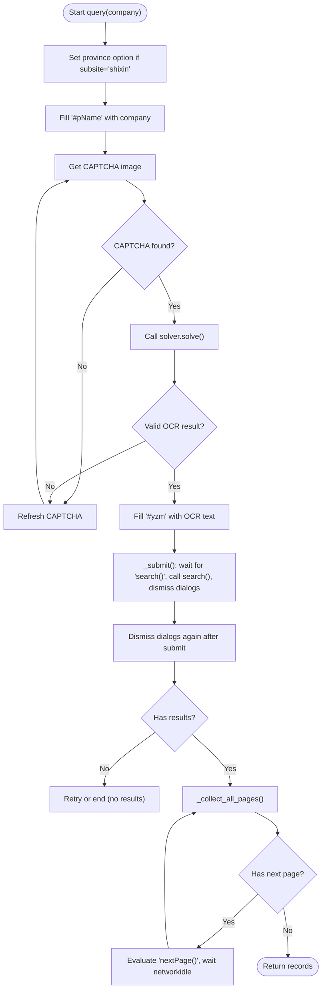
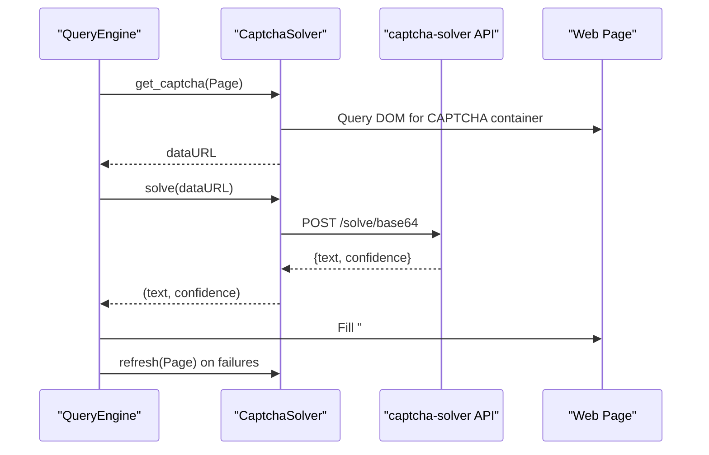
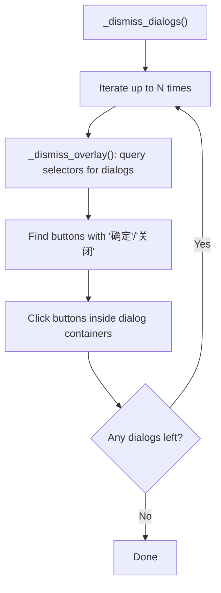
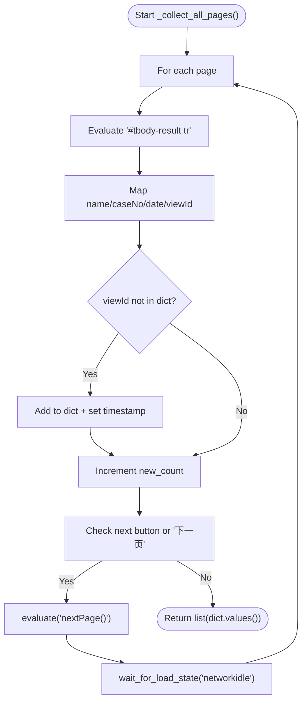
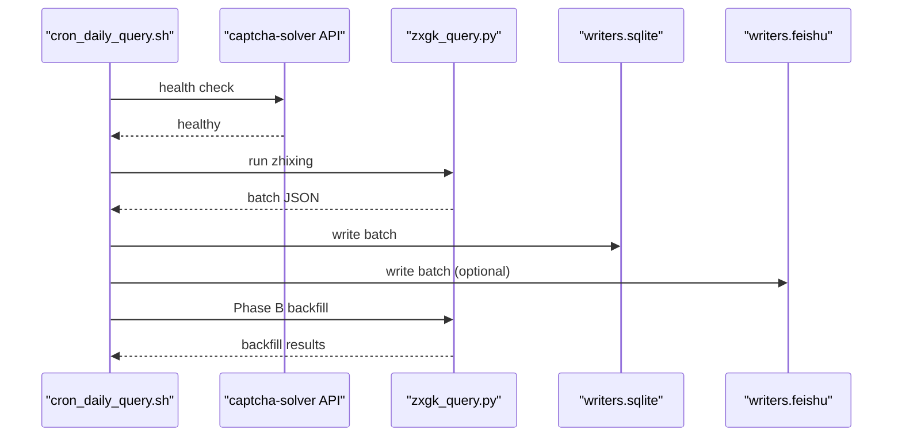
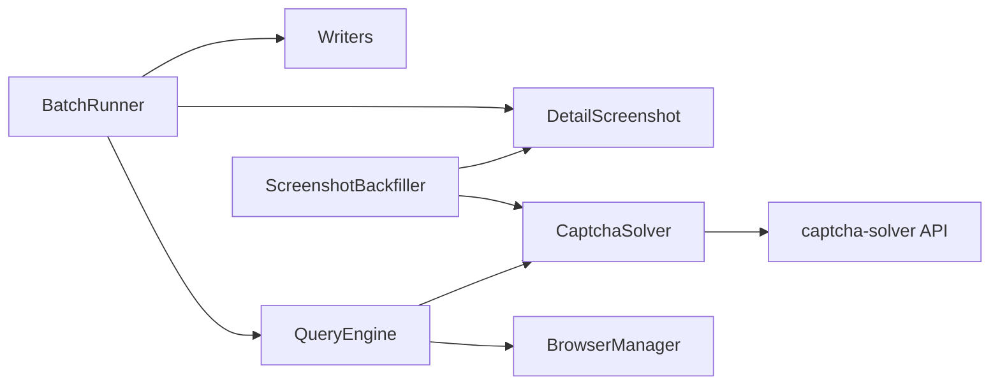

# Page Interaction Engine

<cite>
**Referenced Files in This Document**
- [zxgk_query.py](file://zxgk_query.py)
- [README.md](file://README.md)
- [config/zxgk.example.yaml](file://config/zxgk.example.yaml)
- [captcha-solver/main.py](file://captcha-solver/main.py)
- [captcha-solver/API.md](file://captcha-solver/API.md)
- [cron_daily_query.sh](file://cron_daily_query.sh)
- [writers/sqlite.py](file://writers/sqlite.py)
</cite>

## Table of Contents
1. [Introduction](#introduction)
2. [Project Structure](#project-structure)
3. [Core Components](#core-components)
4. [Architecture Overview](#architecture-overview)
5. [Detailed Component Analysis](#detailed-component-analysis)
6. [Dependency Analysis](#dependency-analysis)
7. [Performance Considerations](#performance-considerations)
8. [Troubleshooting Guide](#troubleshooting-guide)
9. [Conclusion](#conclusion)

## Introduction
This document explains the page interaction engine responsible for dynamic DOM manipulation and form submission automation against the China Enforcement Publicity Website. It focuses on the QueryEngine class, covering company search submission, CAPTCHA handling integration, result collection mechanisms, dialog dismissal systems, viewId-based deduplication, pagination handling, and error recovery strategies. It also documents the integration with the external captcha-solver service and outlines the end-to-end flow orchestrated by the daily cron script.

## Project Structure
The project is organized around a central CLI that orchestrates browser automation, CAPTCHA solving, and result persistence. Key modules include:
- Browser automation and navigation (Playwright)
- CAPTCHA solver integration
- Query engine for search submission and result extraction
- Batch runner and backfiller for multi-company workflows
- Writers for persisting results to SQLite and other destinations

**Diagram sources**
- [zxgk_query.py](file://zxgk_query.py)
- [captcha-solver/main.py](file://captcha-solver/main.py)

**Section sources**
- [README.md](file://README.md)
- [config/zxgk.example.yaml](file://config/zxgk.example.yaml)

## Core Components
- BrowserManager: Launches Chromium, applies stealth, navigates to substation pages, and performs WAF checks.
- CaptchaSolver: Extracts CAPTCHA images from the page, posts to the captcha-solver service, and refreshes CAPTCHAs when needed.
- QueryEngine: Orchestrates search submission, waits for JavaScript readiness, dismisses dialogs, collects results, handles pagination, and deduplicates by viewId.
- DetailScreenshot: Captures detail popups and crops them using OpenCV heuristics.
- ScreenshotBackfiller: Phase B backfill for missing screenshots by searching records and capturing detail popups.
- BatchRunner: Manages batch runs, retries, and error recovery, coordinating with QueryEngine and writers.
- Writers: Persist results to SQLite and other sinks.

**Section sources**
- [zxgk_query.py](file://zxgk_query.py)

## Architecture Overview
The engine integrates browser automation with an external OCR service to handle CAPTCHAs. The flow is:
- Navigate to the target substation
- Fill the company name field
- Extract and solve CAPTCHA
- Submit the search by invoking the JavaScript search() function
- Dismiss overlays and confirm dialogs
- Parse results, deduplicate by viewId, and paginate through pages
- Capture screenshots for detail records

**Diagram sources**
- [zxgk_query.py](file://zxgk_query.py)
- [captcha-solver/main.py](file://captcha-solver/main.py)

## Detailed Component Analysis

### QueryEngine: Dynamic DOM Manipulation and Submission Automation
The QueryEngine encapsulates the core logic for:
- Company search submission
- CAPTCHA handling integration
- Result collection and pagination
- Dialog dismissal and overlay handling
- ViewId-based deduplication

Key responsibilities:
- query(company): Orchestrates the full lifecycle, including CAPTCHA refresh, OCR, submission, result parsing, and pagination.
- _submit(): Ensures the JavaScript search() function is ready, invokes it, and dismisses dialogs.
- _dismiss_dialogs()/_dismiss_overlay(): Detects and clicks confirmation/close buttons inside modal/dialog containers.
- _collect_all_pages(): Iterates pages, extracts records, and deduplicates by viewId.

Implementation highlights:
- Form field population: Fills the company name into the expected input element and the CAPTCHA text into the verification field.
- JavaScript readiness: Polls for the presence of the search() function before invoking it.
- Result parsing: Uses DOM queries to locate result rows and extract fields, including extracting viewId from detail links.
- Pagination: Checks for a next button and a textual indicator, then triggers nextPage() and waits for network idle.
- Deduplication: Maintains a dictionary keyed by viewId to avoid duplicates across pages and companies.

**Diagram sources**
- [zxgk_query.py](file://zxgk_query.py)

**Section sources**
- [zxgk_query.py](file://zxgk_query.py)

### CAPTCHA Handling Integration
The engine integrates with an external OCR service to handle CAPTCHAs:
- CaptchaSolver.get_captcha(): Extracts the CAPTCHA image from the page and returns a data URL.
- CaptchaSolver.solve(): Posts the image to the captcha-solver API and returns the recognized text and confidence.
- CaptchaSolver.refresh(): Clicks the CAPTCHA image to refresh it.
- Health checks: The service is probed for availability before use.

Operational behavior:
- If OCR returns empty or low confidence, the engine refreshes the CAPTCHA and retries.
- On “验证码错误” or “验证码已过期” messages, the engine refreshes and retries.
- The engine ensures a fresh CAPTCHA is used for each company to avoid cross-company reuse.

**Diagram sources**
- [zxgk_query.py](file://zxgk_query.py)
- [captcha-solver/main.py](file://captcha-solver/main.py)

**Section sources**
- [zxgk_query.py](file://zxgk_query.py)
- [captcha-solver/API.md](file://captcha-solver/API.md)

### Dialog Dismissal System
The engine automates dismissal of overlays and dialogs that block result access:
- _dismiss_overlay(): Scans for modal/dialog-like containers and clicks “确定” and “关闭” buttons scoped to those containers.
- _dismiss_dialogs(): Repeatedly polls and dismisses until no dialogs remain or a timeout occurs.

This ensures the result block and subsequent parsing steps can access the DOM reliably.

**Diagram sources**
- [zxgk_query.py](file://zxgk_query.py)

**Section sources**
- [zxgk_query.py](file://zxgk_query.py)

### Result Collection, Pagination, and Deduplication
- Result extraction: The engine evaluates the DOM to count rows and map fields, extracting name, case number, date, and viewId.
- Pagination: It checks for a next button and a textual “下一页” indicator, then calls nextPage() and waits for network idle.
- Deduplication: A dictionary keyed by viewId prevents duplicate records across pages and companies. A timestamp derived from the date field is included for chronological sorting.

**Diagram sources**
- [zxgk_query.py](file://zxgk_query.py)

**Section sources**
- [zxgk_query.py](file://zxgk_query.py)

### Error Recovery and WAF Handling
- WAF封禁 detection: The engine checks for the presence of the CAPTCHA element and logs body length to detect封禁 conditions.
- Retries: The engine retries submissions with refreshed CAPTCHAs on OCR failures or CAPTCHA rejection messages.
- Browser restart: After a configurable number of consecutive failures, the engine closes and relaunches the browser to recover from transient issues.
- Graceful exits: The CLI maps specific exceptions to exit codes for downstream scripts.

**Section sources**
- [zxgk_query.py](file://zxgk_query.py)

### End-to-End Orchestration
The daily cron script coordinates the entire pipeline:
- Ensures the captcha-solver service is running and healthy
- Runs the three substation queries in sequence
- Writes results to SQLite and optionally to Feishu
- Waits for Feishu computation and performs Phase B backfill for missing screenshots

**Diagram sources**
- [cron_daily_query.sh](file://cron_daily_query.sh)
- [writers/sqlite.py](file://writers/sqlite.py)
- [zxgk_query.py](file://zxgk_query.py)

**Section sources**
- [cron_daily_query.sh](file://cron_daily_query.sh)
- [writers/sqlite.py](file://writers/sqlite.py)

## Dependency Analysis
- Internal dependencies:
  - QueryEngine depends on BrowserManager’s page context and CaptchaSolver for OCR.
  - BatchRunner composes QueryEngine, DetailScreenshot, and writers.
  - ScreenshotBackfiller composes CaptchaSolver and DetailScreenshot for Phase B.
- External dependencies:
  - captcha-solver FastAPI service for OCR.
  - Playwright for browser automation and stealth.
  - Optional writers for persistence (SQLite, Excel, Feishu).

**Diagram sources**
- [zxgk_query.py](file://zxgk_query.py)
- [captcha-solver/main.py](file://captcha-solver/main.py)

**Section sources**
- [zxgk_query.py](file://zxgk_query.py)

## Performance Considerations
- Network idle waits: The engine waits for networkidle after submissions and pagination to ensure DOM stability.
- Modal polling: Repeated dismissal loops prevent blocking on overlays.
- CAPTCHA refresh: Fresh CAPTCHAs reduce retries and improve throughput.
- Batch intervals: Configurable delays between companies and screenshots balance rate and reliability.
- Deduplication cost: Using a dictionary keyed by viewId is O(n) per page and efficient for typical result sizes.

[No sources needed since this section provides general guidance]

## Troubleshooting Guide
Common issues and remedies:
- captcha-solver unavailable: Verify the service is running and reachable. The CLI checks health before proceeding.
- WAF封禁: The engine detects封禁 and sleeps before retrying. Consider increasing cooldown intervals.
- No results: The engine treats “没有找到” as no-results and returns an empty list.
- CAPTCHA rejected: On “验证码错误” or “验证码已过期”, the engine refreshes and retries.
- JavaScript not ready: The engine waits for the search() function to be defined before invoking it.
- Overlays blocking results: The engine dismisses dialogs automatically; if persistent, adjust selectors or increase polling attempts.
- Browser crashes: Consecutive failure thresholds trigger browser restarts.

**Section sources**
- [zxgk_query.py](file://zxgk_query.py)
- [README.md](file://README.md)

## Conclusion
The page interaction engine provides a robust, automated solution for querying enforcement records with strong CAPTCHA handling, reliable dialog dismissal, and resilient pagination and deduplication. Its modular design enables easy maintenance and extension, while the daily orchestration script ensures end-to-end reliability for production use.