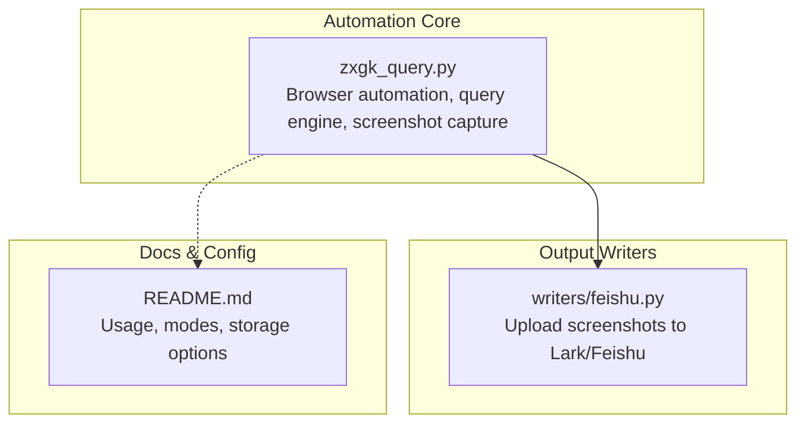
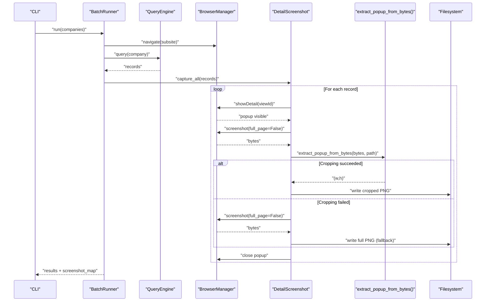
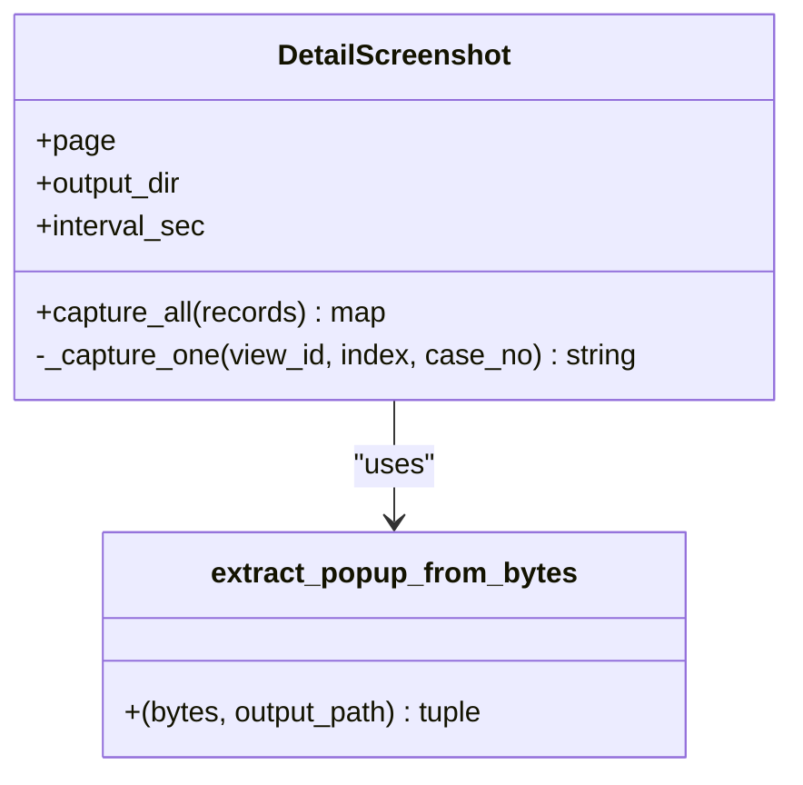
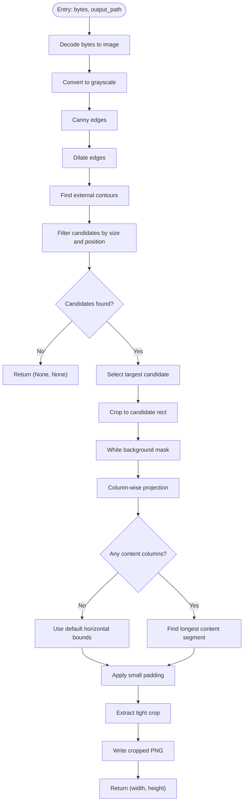
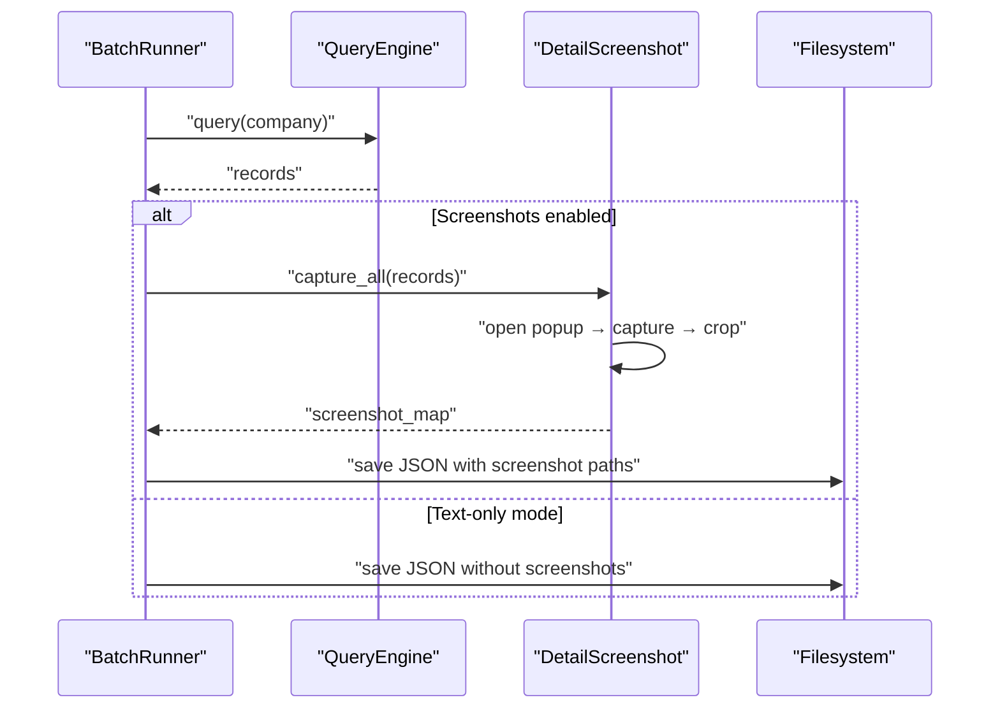
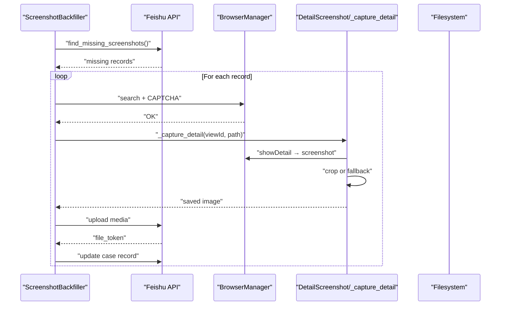
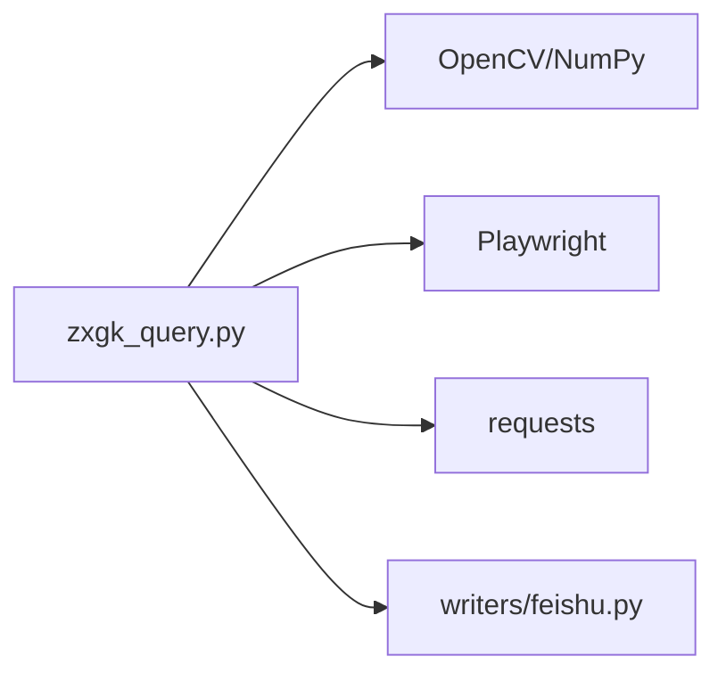

# Screenshot Capture System

<cite>
**Referenced Files in This Document**
- [zxgk_query.py](file://zxgk_query.py)
- [README.md](file://README.md)
- [writers/feishu.py](file://writers/feishu.py)
</cite>

## Table of Contents
1. [Introduction](#introduction)
2. [Project Structure](#project-structure)
3. [Core Components](#core-components)
4. [Architecture Overview](#architecture-overview)
5. [Detailed Component Analysis](#detailed-component-analysis)
6. [Dependency Analysis](#dependency-analysis)
7. [Performance Considerations](#performance-considerations)
8. [Troubleshooting Guide](#troubleshooting-guide)
9. [Conclusion](#conclusion)
10. [Appendices](#appendices)

## Introduction
This document explains the screenshot capture system designed to automate detail page capture and intelligently crop popup windows from the China Execution Information Public Service website. It focuses on:
- The DetailScreenshot class for batch and individual screenshot processing
- The extract_popup_from_bytes() function powered by OpenCV for popup detection and cropping
- Quality optimization, memory-efficient processing, and fallback mechanisms
- Integration with the main query workflow, performance considerations for large-scale operations, and troubleshooting

## Project Structure
The screenshot capture system is implemented in a single module file alongside supporting modules for writing results and diagnostics. The key files are:
- Main automation and screenshot logic: [zxgk_query.py](file://zxgk_query.py)
- Output writers for screenshots and results: [writers/feishu.py](file://writers/feishu.py)
- Project overview and usage: [README.md](file://README.md)

**Diagram sources**
- [zxgk_query.py](file://zxgk_query.py)
- [writers/feishu.py](file://writers/feishu.py)
- [README.md](file://README.md)

**Section sources**
- [README.md:1-122](file://README.md#L1-L122)

## Core Components
- DetailScreenshot: Orchestrates opening detail popups, capturing screenshots, cropping, and saving images.
- extract_popup_from_bytes(): Uses OpenCV to detect and crop popup regions from screenshot bytes.
- BatchRunner: Integrates screenshot capture into the main query workflow, controlling intervals and output.
- ScreenshotBackfiller: Phase B process to re-collect missing screenshots and upload them to the database.

Key responsibilities:
- Batch capture: Iterates over records, opens detail popups, captures, crops, and saves images.
- Individual capture: Opens a specific detail popup, captures, crops, and falls back to full-page capture if cropping fails.
- Intelligent cropping: Detects popup boundaries using edge detection, contour analysis, and white background masking.
- Memory-first processing: Operates purely in-memory without intermediate disk writes when cropping succeeds.
- Fallback mechanism: Writes full-page screenshot if cropping fails.

**Section sources**
- [zxgk_query.py:682-726](file://zxgk_query.py#L682-L726)
- [zxgk_query.py:623-677](file://zxgk_query.py#L623-L677)
- [zxgk_query.py:1065-1197](file://zxgk_query.py#L1065-L1197)
- [zxgk_query.py:776-1059](file://zxgk_query.py#L776-L1059)

## Architecture Overview
The screenshot capture system integrates tightly with the browser automation and query engine. The flow below shows how the main workflow triggers detail capture after successful query results.

**Diagram sources**
- [zxgk_query.py:1095-1197](file://zxgk_query.py#L1095-L1197)
- [zxgk_query.py:682-726](file://zxgk_query.py#L682-L726)
- [zxgk_query.py:623-677](file://zxgk_query.py#L623-L677)

## Detailed Component Analysis

### DetailScreenshot Class
The DetailScreenshot class encapsulates the end-to-end process for capturing and saving detail popups.

- Initialization:
  - Stores Playwright page handle, output directory, and per-screenshot interval.
  - Ensures output directory exists.

- Batch capture workflow:
  - Iterates through records, opens each detail popup, captures a screenshot, attempts intelligent cropping, and saves the image.
  - Applies a configurable delay between captures to reduce load and stabilize rendering.

- Individual capture:
  - Opens the popup via JavaScript evaluation.
  - Generates a filename based on index, viewId, and sanitized case number.
  - Captures a screenshot (non-full-page) and passes bytes to the cropping function.
  - If cropping returns None, writes the original screenshot bytes as a fallback.
  - Closes the popup using DOM traversal to click a “Close” button.

- File naming convention:
  - Pattern: detail_r{index}_{viewId}_{caseNoSanitized}.png
  - Sanitization replaces parentheses, spaces, and other special characters with underscores.

**Diagram sources**
- [zxgk_query.py:682-726](file://zxgk_query.py#L682-L726)
- [zxgk_query.py:623-677](file://zxgk_query.py#L623-L677)

**Section sources**
- [zxgk_query.py:682-726](file://zxgk_query.py#L682-L726)

### extract_popup_from_bytes() — Intelligent Popup Cropping
This function performs OpenCV-based detection and cropping of popup windows from screenshot bytes.

- Input:
  - Full-page screenshot bytes and an output path.

- Processing pipeline:
  - Decode bytes to an OpenCV image.
  - Convert to grayscale.
  - Apply Canny edge detection, dilate edges, and find external contours.
  - Filter candidates by width/height thresholds and vertical position to select likely popup regions.
  - Select the largest candidate rectangle and crop it.
  - Create a white-background mask using a threshold on grayscale.
  - Compute column-wise projection to locate the content region inside the popup.
  - Derive left/right bounds of the content and apply small padding.
  - Save the cropped image and return its dimensions.

- Fallback behavior:
  - If no candidates are found or content projection yields no content, the function returns None, None.
  - The caller writes the full-page screenshot as a fallback.

**Diagram sources**
- [zxgk_query.py:623-677](file://zxgk_query.py#L623-L677)

**Section sources**
- [zxgk_query.py:623-677](file://zxgk_query.py#L623-L677)

### Integration with Main Query Workflow
- BatchRunner coordinates:
  - Launches the browser, navigates to the target subsite, initializes the query engine and optional screenshotter.
  - For each company, fills the search field, refreshes the CAPTCHA, runs the query, and collects results.
  - If screenshots are enabled, calls DetailScreenshot.capture_all() to produce images and returns a mapping from viewId to file path.
  - Saves per-company JSON with embedded screenshot paths and optionally writes results to Feishu.

- Timing controls:
  - Per-screenshot interval is configurable and enforced between captures.
  - Company-level interval prevents rapid successive queries.
  - Automatic cooldown occurs on WAF blocking.

- Output management:
  - Results are saved to JSON with embedded screenshot paths.
  - Screenshots are stored under a dedicated directory.

**Diagram sources**
- [zxgk_query.py:1095-1197](file://zxgk_query.py#L1095-L1197)
- [zxgk_query.py:682-726](file://zxgk_query.py#L682-L726)

**Section sources**
- [zxgk_query.py:1065-1197](file://zxgk_query.py#L1065-L1197)

### Phase B Backfilling
- ScreenshotBackfiller locates missing screenshots in the case master table, resolves real viewIds via DuplexLink, and re-queries to capture and upload missing images.
- It uses the same cropping and fallback logic as the main workflow.

**Diagram sources**
- [zxgk_query.py:776-1059](file://zxgk_query.py#L776-L1059)
- [writers/feishu.py:369-445](file://writers/feishu.py#L369-L445)

**Section sources**
- [zxgk_query.py:776-1059](file://zxgk_query.py#L776-L1059)
- [writers/feishu.py:369-445](file://writers/feishu.py#L369-L445)

## Dependency Analysis
- Internal dependencies:
  - DetailScreenshot depends on extract_popup_from_bytes() for cropping.
  - BatchRunner composes QueryEngine, DetailScreenshot, and optional FeishuWriter.
  - ScreenshotBackfiller composes BrowserManager and uses Feishu APIs for lookup and upload.

- External libraries:
  - OpenCV (cv2) and NumPy for image processing.
  - Playwright for browser automation and screenshot capture.
  - Requests for Feishu API calls.

**Diagram sources**
- [zxgk_query.py](file://zxgk_query.py)
- [writers/feishu.py](file://writers/feishu.py)

**Section sources**
- [zxgk_query.py:41-42](file://zxgk_query.py#L41-L42)
- [writers/feishu.py](file://writers/feishu.py)

## Performance Considerations
- Memory-first processing:
  - extract_popup_from_bytes() decodes bytes to memory and writes only the cropped image, avoiding unnecessary disk I/O when cropping succeeds.
- Controlled throughput:
  - Per-screenshot interval reduces CPU/GPU load and stabilizes popup rendering.
  - Company-level intervals prevent rate limiting and WAF triggers.
- Efficient cropping:
  - Early filtering of contours by size and position minimizes computation.
  - White background masking and column projection provide robust content boundary detection.
- Large-scale operations:
  - BatchRunner supports resuming progress to avoid repeating work.
  - Session restarts on consecutive failures improve stability during long runs.

[No sources needed since this section provides general guidance]

## Troubleshooting Guide
Common issues and remedies:
- Cropping returns None:
  - Symptom: Full-page screenshot is written as fallback.
  - Causes: Popup not detected due to layout changes, low contrast, or unexpected size.
  - Actions: Adjust cropping thresholds or inspect the popup structure; consider increasing tolerance margins slightly.
- Popup does not close:
  - Symptom: Subsequent captures fail due to overlay.
  - Actions: Verify the “Close” button detection logic; ensure the popup is fully rendered before closing.
- WAF blocking:
  - Symptom: Queries fail or are throttled.
  - Actions: Increase cooldown, reduce request rate, or adjust navigation delays.
- OCR-related failures:
  - Symptom: CAPTCHA invalid or expired.
  - Actions: Refresh CAPTCHA before each query; ensure the OCR service is healthy.
- Output not uploaded:
  - Symptom: Images captured but not linked in the database.
  - Actions: Confirm Feishu credentials and table IDs; verify DuplexLink integrity in Phase B.

**Section sources**
- [zxgk_query.py:1157-1191](file://zxgk_query.py#L1157-L1191)
- [writers/feishu.py:369-445](file://writers/feishu.py#L369-L445)

## Conclusion
The screenshot capture system combines robust browser automation with intelligent image processing to reliably extract detail popups. Its memory-efficient design, controlled timing, and fallback mechanisms make it suitable for large-scale operations. Integration with the main query workflow ensures seamless capture of results, while Phase B backfilling maintains completeness of the dataset.

[No sources needed since this section summarizes without analyzing specific files]

## Appendices

### File Naming Conventions
- Pattern: detail_r{index}_{viewId}_{caseNoSanitized}.png
- Example: detail_r3_abc123_def456.png

**Section sources**
- [zxgk_query.py:705-707](file://zxgk_query.py#L705-L707)

### Output Management
- Per-company JSON includes embedded screenshot paths for downstream processing.
- Screenshots are stored under a dedicated directory configured in the output settings.

**Section sources**
- [zxgk_query.py:1199-1219](file://zxgk_query.py#L1199-L1219)
- [zxgk_query.py:1087-1090](file://zxgk_query.py#L1087-L1090)

### Usage Modes and Storage Options
- Modes:
  - text-only: Query and write results without screenshots.
  - screenshot: Query and capture screenshots immediately.
  - full: Run Phase A, wait for calculations, then Phase B backfill.
  - backfill: Re-collect missing screenshots for a given batch.
- Storage options:
  - SQLite, Excel, or Feishu multi-tables.

**Section sources**
- [README.md:63-96](file://README.md#L63-L96)
- [zxgk_query.py:1544-1547](file://zxgk_query.py#L1544-L1547)