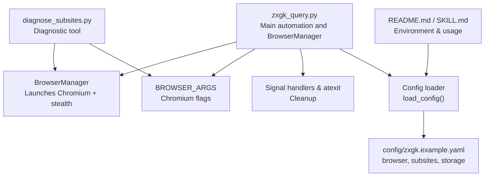
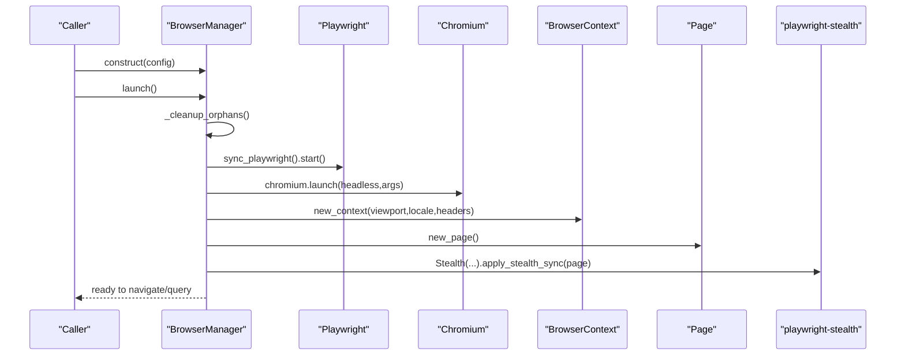
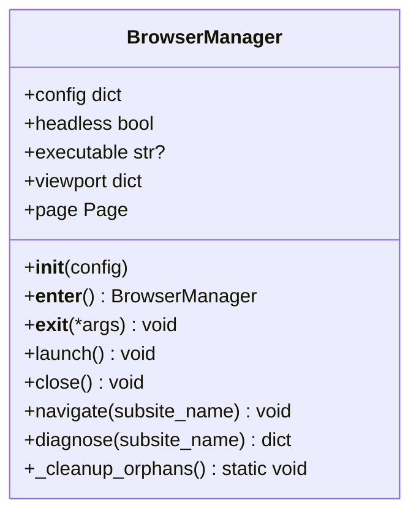
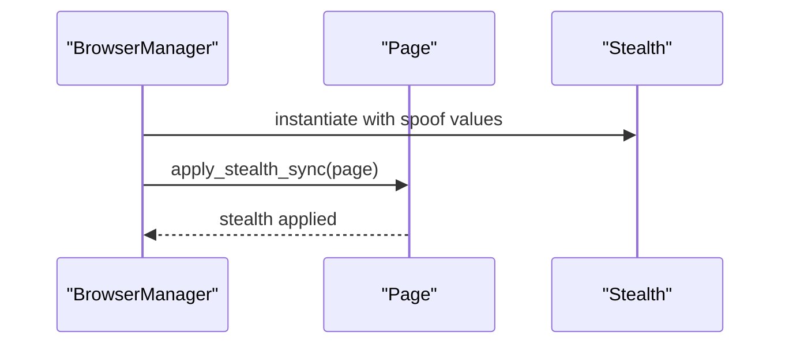
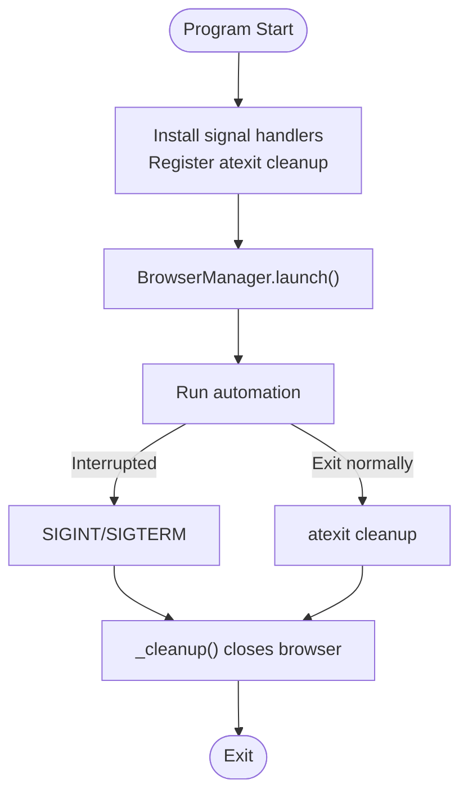
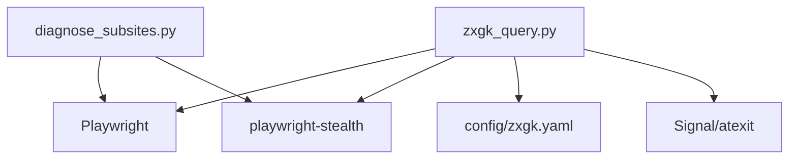

# Stealth Browser Configuration

<cite>
**Referenced Files in This Document**
- [zxgk_query.py](file://zxgk_query.py)
- [diagnose_subsites.py](file://diagnose_subsites.py)
- [config/zxgk.example.yaml](file://config/zxgk.example.yaml)
- [README.md](file://README.md)
- [SKILL.md](file://SKILL.md)
</cite>

## Table of Contents
1. [Introduction](#introduction)
2. [Project Structure](#project-structure)
3. [Core Components](#core-components)
4. [Architecture Overview](#architecture-overview)
5. [Detailed Component Analysis](#detailed-component-analysis)
6. [Dependency Analysis](#dependency-analysis)
7. [Performance Considerations](#performance-considerations)
8. [Troubleshooting Guide](#troubleshooting-guide)
9. [Conclusion](#conclusion)
10. [Appendices](#appendices)

## Introduction
This document explains the stealth browser configuration system used to initialize a Playwright-controlled Chromium browser with anti-detection measures. It focuses on the BrowserManager class, the BROWSER_ARGS array, the playwright-stealth integration, and supporting mechanisms such as proxy environment handling, process cleanup, and signal-driven graceful shutdown. It also provides practical examples for browser context creation, viewport and locale configuration, and troubleshooting guidance.

## Project Structure
The stealth browser configuration is implemented primarily in the main automation script and a diagnostic utility. The configuration file defines runtime options such as headless mode and viewport. The README and SKILL documents describe environment variables and operational procedures.

**Diagram sources**
- [zxgk_query.py:57-69](file://zxgk_query.py#L57-L69)
- [zxgk_query.py:175-250](file://zxgk_query.py#L175-L250)
- [config/zxgk.example.yaml:10-44](file://config/zxgk.example.yaml#L10-L44)
- [diagnose_subsites.py:50-55](file://diagnose_subsites.py#L50-L55)

**Section sources**
- [README.md:1-122](file://README.md#L1-L122)
- [SKILL.md:225-273](file://SKILL.md#L225-L273)

## Core Components
- BrowserManager: Orchestrates Playwright startup, Chromium launch, browser context creation, stealth injection, navigation, and lifecycle cleanup.
- BROWSER_ARGS: A curated list of Chromium command-line flags designed to reduce automation detection signals.
- Signal and atexit handlers: Ensure cleanup of the Chromium process on interruption or exit.
- Config loader: Loads and resolves environment variables in the YAML configuration.

Key responsibilities:
- Initialize Playwright and launch Chromium with stealth settings.
- Create a browser context with viewport, locale, and HTTP headers.
- Apply playwright-stealth to spoof navigator platform, languages, WebGL vendor/renderer.
- Provide navigation and diagnostics helpers.
- Clean up orphaned Chromium processes and gracefully shut down on signals.

**Section sources**
- [zxgk_query.py:175-250](file://zxgk_query.py#L175-L250)
- [zxgk_query.py:57-69](file://zxgk_query.py#L57-L69)
- [zxgk_query.py:78-94](file://zxgk_query.py#L78-L94)
- [zxgk_query.py:116-137](file://zxgk_query.py#L116-L137)

## Architecture Overview
The system initializes a stealth browser session, navigates to target sub-sites, and performs OCR-based query automation. Anti-detection is achieved through stealth flags and playwright-stealth.

**Diagram sources**
- [zxgk_query.py:195-221](file://zxgk_query.py#L195-L221)

## Detailed Component Analysis

### BrowserManager Class
The BrowserManager encapsulates the entire browser lifecycle and stealth setup.

Constructor parameters and behavior:
- Accepts a configuration dictionary.
- Reads browser settings: headless, executable path, viewport.
- Initializes internal handles for Playwright, browser, context, and page.

Lifecycle methods:
- __enter__/__exit__: Context manager support to launch and close automatically.
- launch(): Starts Playwright, launches Chromium with BROWSER_ARGS, creates a context with viewport and locale, sets HTTP headers, creates a page, applies stealth, and stores a global reference for cleanup.
- close(): Closes context, browser, and Playwright in order, clearing the global reference.
- _cleanup_orphans(): Searches and terminates lingering Chromium processes to prevent resource leaks.
- navigate(): Navigates from the main site to a sub-site, clicks the link, waits for network idle, and retries on WAF block detection.
- diagnose(): Diagnostic wrapper around navigate to return status and key page indicators.

**Diagram sources**
- [zxgk_query.py:175-250](file://zxgk_query.py#L175-L250)

**Section sources**
- [zxgk_query.py:175-250](file://zxgk_query.py#L175-L250)

### BROWSER_ARGS: Chromium Flags and Security Implications
The BROWSER_ARGS array configures Chromium to reduce automation detection signals. Each flag is explained below.

- --no-sandbox
  - Disables sandboxing for compatibility in containerized environments.
  - Security implication: Reduced OS-level sandbox isolation; acceptable for controlled automation tasks.
- --disable-setuid-sandbox
  - Disables setuid sandbox helper; often paired with --no-sandbox.
  - Security implication: Further reduces sandbox enforcement.
- --disable-dev-shm-usage
  - Prevents Chromium from using /dev/shm for shared memory, avoiding memory contention on systems with small tmpfs.
  - Security implication: No meaningful security impact; improves stability.
- --disable-blink-features=AutomationControlled
  - Removes the navigator.webdriver property and related automation indicators exposed by Blink.
  - Security implication: Reduces fingerprinting leakage; widely effective against basic bot detection.
- --disable-features=IsolateOrigins,site-per-process
  - Disables origin isolation and per-process site isolation to reduce multi-process overhead and potential detection artifacts.
  - Security implication: Slight reduction in hardening; improves performance and stealth consistency.
- --disable-web-security
  - Disables CORS and same-origin policy checks to simplify cross-origin interactions during automation.
  - Security implication: Reduces web security; use only within trusted automation contexts.

These flags collectively minimize the browser’s “bot-like” fingerprint and improve reliability on sites with anti-bot protections.

**Section sources**
- [zxgk_query.py:57-64](file://zxgk_query.py#L57-L64)
- [diagnose_subsites.py:50-55](file://diagnose_subsites.py#L50-L55)

### stealth.js Integration via playwright-stealth
The system integrates playwright-stealth to spoof browser attributes at the JavaScript level.

Applied overrides:
- navigator.platform: Spoofed to a Linux desktop platform string.
- navigator.languages: Overridden with a realistic language list.
- navigator.vendor: Overridden to a common vendor identifier.
- WebGL vendor/renderer: Overridden to common Intel identifiers.

These overrides are applied synchronously to the page to ensure stealth before navigation and interaction.

**Diagram sources**
- [zxgk_query.py:211-218](file://zxgk_query.py#L211-L218)

**Section sources**
- [zxgk_query.py:211-218](file://zxgk_query.py#L211-L218)

### Browser Context Creation, Viewport, and Locale
The browser context is created with:
- viewport: Width and height derived from configuration or defaults.
- locale: Set to a Chinese locale to align with target site expectations.
- extra_http_headers: Accept-Language and Accept headers configured to reflect a typical Chinese user agent profile.

These settings help normalize the browser’s HTTP identity and rendering characteristics.

**Section sources**
- [zxgk_query.py:202-209](file://zxgk_query.py#L202-L209)

### Proxy Environment Variable Handling
Proxy-related environment variables are cleaned from the process environment before launching the browser. The list includes common uppercase and lowercase variants.

- Variables cleaned: HTTP_PROXY, HTTPS_PROXY, http_proxy, https_proxy, ALL_PROXY, all_proxy.
- Purpose: Ensures the browser does not route traffic through unintended proxies, which could interfere with automation or violate network policies.

**Section sources**
- [zxgk_query.py:66-69](file://zxgk_query.py#L66-L69)
- [zxgk_query.py:111-115](file://zxgk_query.py#L111-L115)
- [diagnose_subsites.py:334-336](file://diagnose_subsites.py#L334-L336)

### Process Cleanup Mechanisms and Signal Handling
- Global cleanup routine: A module-level function closes the browser instance if still open.
- Signal handlers: SIGINT and SIGTERM trigger cleanup and exit with a signal-derived exit code.
- atexit registration: Ensures cleanup runs on normal program termination.
- Orphan cleanup: A dedicated method searches for and terminates lingering Chromium processes using process name patterns.

**Diagram sources**
- [zxgk_query.py:78-94](file://zxgk_query.py#L78-L94)
- [zxgk_query.py:234-249](file://zxgk_query.py#L234-L249)

**Section sources**
- [zxgk_query.py:78-94](file://zxgk_query.py#L78-L94)
- [zxgk_query.py:234-249](file://zxgk_query.py#L234-L249)

### Configuration and Example Usage
- Configuration file: Defines browser headless mode, viewport, subsites, and other runtime options.
- Example usage patterns:
  - Headless mode and viewport: Controlled via the browser section in the YAML.
  - Locale and headers: Applied automatically when creating the browser context.
  - Executable path: Optional; if provided, Chromium will use the specified binary.

**Section sources**
- [config/zxgk.example.yaml:10-44](file://config/zxgk.example.yaml#L10-L44)
- [zxgk_query.py:175-209](file://zxgk_query.py#L175-L209)

## Dependency Analysis
The stealth browser configuration depends on:
- Playwright for browser automation.
- playwright-stealth for JavaScript-level spoofing.
- YAML configuration for runtime customization.
- Signal/atexit hooks for robust lifecycle management.

**Diagram sources**
- [zxgk_query.py:38-39](file://zxgk_query.py#L38-L39)
- [diagnose_subsites.py:353-359](file://diagnose_subsites.py#L353-L359)

**Section sources**
- [zxgk_query.py:38-39](file://zxgk_query.py#L38-L39)
- [diagnose_subsites.py:353-359](file://diagnose_subsites.py#L353-L359)

## Performance Considerations
- Use headless mode for speed and reduced resource usage.
- Keep viewport consistent with target site expectations to avoid layout recalculations.
- Limit per-process isolation features via BROWSER_ARGS to reduce overhead.
- Avoid unnecessary proxy configuration to prevent network latency.
- Clean up orphaned processes regularly to prevent resource exhaustion.

[No sources needed since this section provides general guidance]

## Troubleshooting Guide
Common issues and resolutions:
- WAF blocked: The system detects封禁 by checking for the presence of a captcha element and body length. It retries automatically with delays.
  - Reference: [WAF detection and retry logic:251-277](file://zxgk_query.py#L251-L277)
- Subsite navigation failures: If the CSS selector for a sub-site link is invalid, navigation fails. Verify selectors in the configuration.
  - Reference: [Subsite navigation error handling:278-295](file://zxgk_query.py#L278-L295)
- Captcha solver unavailable: Health-check ensures the OCR service is reachable before proceeding.
  - Reference: [Captcha solver health check:328-338](file://zxgk_query.py#L328-L338)
- Proxy interference: Ensure proxy variables are cleared before launching the browser.
  - Reference: [Proxy cleanup:111-115](file://zxgk_query.py#L111-L115)
- Graceful shutdown: If interrupted, signal handlers and atexit ensure cleanup.
  - Reference: [Signal and atexit handlers:78-94](file://zxgk_query.py#L78-94)
- Orphaned processes: Use the orphan cleanup routine to terminate lingering Chromium processes.
  - Reference: [Orphan cleanup:234-249](file://zxgk_query.py#L234-249)

**Section sources**
- [zxgk_query.py:251-295](file://zxgk_query.py#L251-L295)
- [zxgk_query.py:328-338](file://zxgk_query.py#L328-L338)
- [zxgk_query.py:111-115](file://zxgk_query.py#L111-L115)
- [zxgk_query.py:78-94](file://zxgk_query.py#L78-L94)
- [zxgk_query.py:234-249](file://zxgk_query.py#L234-L249)

## Conclusion
The stealth browser configuration combines Chromium flags, playwright-stealth, and robust lifecycle management to reliably automate interactions with anti-detection-aware targets. The BrowserManager centralizes initialization, context creation, and cleanup, while BROWSER_ARGS and stealth overrides reduce detection signals. Proper configuration of locale, headers, and viewport, along with signal handling and orphan cleanup, ensures stable operation across repeated runs.

[No sources needed since this section summarizes without analyzing specific files]

## Appendices

### Appendix A: Configuration Options
- browser.headless: Controls whether the browser runs headless.
- browser.viewport: Sets width and height for the browser window.
- subsites: Defines sub-sites with CSS selectors and extra wait times.

**Section sources**
- [config/zxgk.example.yaml:10-44](file://config/zxgk.example.yaml#L10-L44)

### Appendix B: Environment Variables
- FEISHU_APP_TOKEN: Optional token for writing results to Feishu tables.

**Section sources**
- [README.md:29-34](file://README.md#L29-L34)
- [SKILL.md:241-246](file://SKILL.md#L241-L246)