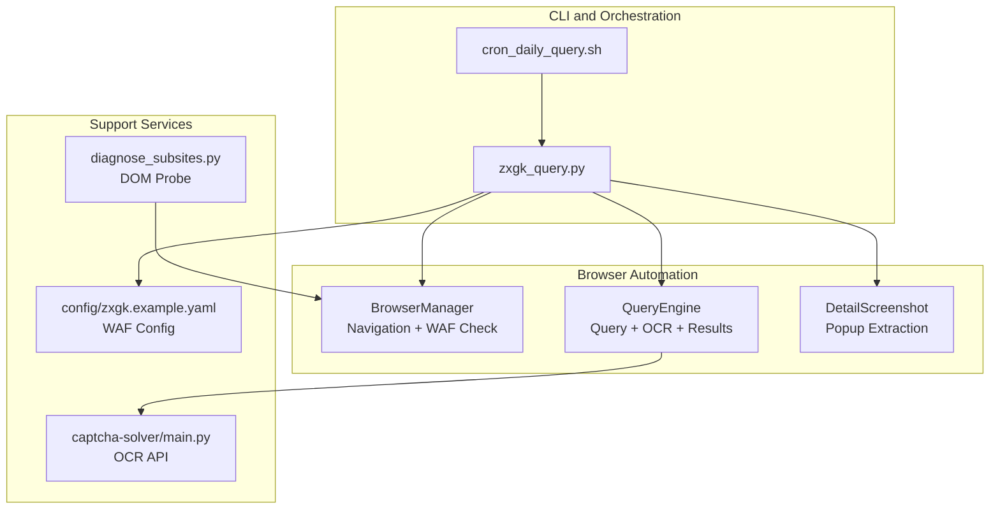
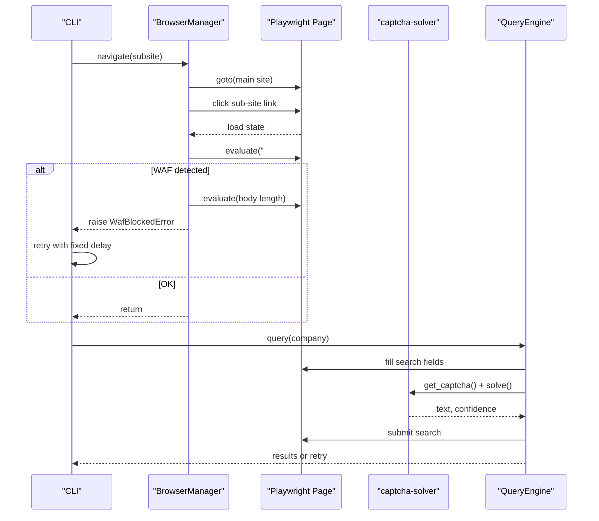
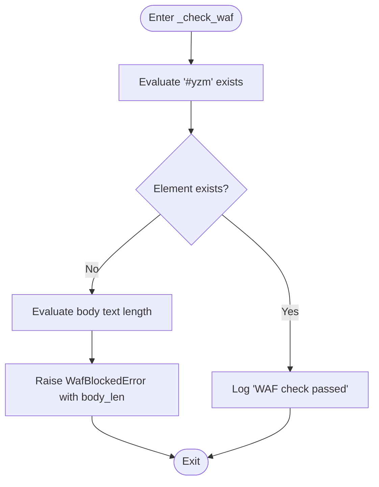
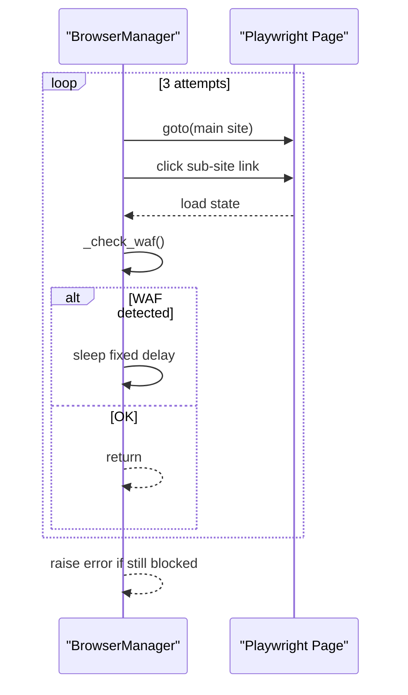
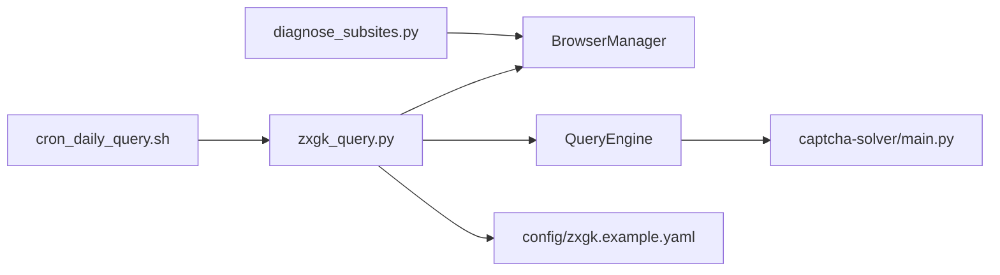

# WAF Detection and Bypass

<cite>
**Referenced Files in This Document**
- [zxgk_query.py](file://zxgk_query.py)
- [README.md](file://README.md)
- [config/zxgk.example.yaml](file://config/zxgk.example.yaml)
- [diagnose_subsites.py](file://diagnose_subsites.py)
- [cron_daily_query.sh](file://cron_daily_query.sh)
- [captcha-solver/main.py](file://captcha-solver/main.py)
</cite>

## Table of Contents
1. [Introduction](#introduction)
2. [Project Structure](#project-structure)
3. [Core Components](#core-components)
4. [Architecture Overview](#architecture-overview)
5. [Detailed Component Analysis](#detailed-component-analysis)
6. [Dependency Analysis](#dependency-analysis)
7. [Performance Considerations](#performance-considerations)
8. [Troubleshooting Guide](#troubleshooting-guide)
9. [Conclusion](#conclusion)
10. [Appendices](#appendices)

## Introduction
This document explains the WAF detection and bypass system designed to circumvent anti-bot protections on the China Execution Information Public Disclosure website. It focuses on the _check_waf() method, element existence checks, body length analysis, and timeout-based detection strategies. It documents the WafBlockedError exception handling and automatic retry mechanisms with fixed delays, the relationship between WAF detection and navigation failures, and practical mitigation strategies. It also covers operational resilience, psychological warfare aspects of WAF detection, and provides troubleshooting guidance and performance tuning tips.

## Project Structure
The project is a CLI automation tool that navigates to sub-sites, performs queries, and captures screenshots. The WAF detection logic resides in the BrowserManager class and integrates with the query pipeline and batch runner.

**Diagram sources**
- [zxgk_query.py:251-324](file://zxgk_query.py#L251-L324)
- [captcha-solver/main.py:107-142](file://captcha-solver/main.py#L107-L142)
- [config/zxgk.example.yaml:15-22](file://config/zxgk.example.yaml#L15-L22)
- [diagnose_subsites.py:103-331](file://diagnose_subsites.py#L103-L331)
- [cron_daily_query.sh:112-154](file://cron_daily_query.sh#L112-L154)

**Section sources**
- [README.md:1-122](file://README.md#L1-L122)
- [zxgk_query.py:1-120](file://zxgk_query.py#L1-L120)
- [config/zxgk.example.yaml:1-103](file://config/zxgk.example.yaml#L1-L103)

## Core Components
- BrowserManager: Launches the browser, navigates to sub-sites, and performs WAF detection via _check_waf().
- WafBlockedError: Exception raised when WAF is detected.
- QueryEngine: Executes queries, handles OCR, and manages retries.
- BatchRunner: Orchestrates batch runs with WAF-aware intervals and cooldowns.
- Diagnostics: Probes DOM structure and WAF indicators across sub-sites.
- OCR service: captcha-solver provides health checks and solves captchas.

Key WAF detection logic:
- Element existence check: presence of the captcha container element.
- Body length analysis: measures page body text length to infer WAF pages.
- Navigation retry: fixed delay retries on WAF detection.

**Section sources**
- [zxgk_query.py:99-107](file://zxgk_query.py#L99-L107)
- [zxgk_query.py:297-304](file://zxgk_query.py#L297-L304)
- [zxgk_query.py:259-277](file://zxgk_query.py#L259-L277)
- [config/zxgk.example.yaml:15-22](file://config/zxgk.example.yaml#L15-L22)
- [diagnose_subsites.py:133-137](file://diagnose_subsites.py#L133-L137)

## Architecture Overview
The system uses Playwright to automate browser actions, applies stealth configurations, and integrates with an OCR service for captcha solving. WAF detection is embedded into navigation and query stages to prevent wasted attempts on blocked pages.

**Diagram sources**
- [zxgk_query.py:259-304](file://zxgk_query.py#L259-L304)
- [zxgk_query.py:409-482](file://zxgk_query.py#L409-L482)
- [captcha-solver/main.py:174-209](file://captcha-solver/main.py#L174-L209)

## Detailed Component Analysis

### WAF Detection Method: _check_waf()
The _check_waf() method performs two checks:
- Element existence: verifies the presence of the captcha container element.
- Body length analysis: measures the page body text length to distinguish between normal and WAF-protected pages.

Behavior:
- If the captcha element does not exist, the method raises WafBlockedError with the body length included in the message.
- If the element exists, the method logs a successful check.

**Diagram sources**
- [zxgk_query.py:297-304](file://zxgk_query.py#L297-L304)

**Section sources**
- [zxgk_query.py:297-304](file://zxgk_query.py#L297-L304)

### Navigation Retry Mechanism
The navigate() method retries navigation on WAF detection:
- Attempts up to three times.
- On each failure, waits a fixed delay before retrying.
- Raises the error after the third attempt.

**Diagram sources**
- [zxgk_query.py:259-277](file://zxgk_query.py#L259-L277)

**Section sources**
- [zxgk_query.py:259-277](file://zxgk_query.py#L259-L277)

### WafBlockedError Exception Handling
WafBlockedError is raised during navigation when WAF is detected. The CLI and orchestration scripts handle this error and return a specific exit code to indicate WAF封禁 (block).

- CLI exit code mapping includes a dedicated code for WAF封禁.
- The BatchRunner aggregates blocked attempts separately.

**Section sources**
- [zxgk_query.py:99-101](file://zxgk_query.py#L99-L101)
- [zxgk_query.py:1452-1454](file://zxgk_query.py#L1452-L1454)
- [README.md:87-96](file://README.md#L87-L96)

### Relationship Between WAF Detection and Navigation Failures
- Navigation failures can be caused by:
  - DOM changes breaking CSS selectors.
  - WAF blocking the page.
- The system mitigates this by:
  - Using robust element checks in _check_waf().
  - Providing diagnostics to detect DOM drift.
  - Retrying navigation with fixed delays.

Mitigation strategies:
- Update CSS selectors in configuration when DOM changes occur.
- Use diagnose_subsites.py to verify DOM structure and WAF readiness.
- Adjust extra_wait_sec per sub-site to accommodate slower loads.

**Section sources**
- [zxgk_query.py:278-296](file://zxgk_query.py#L278-L296)
- [diagnose_subsites.py:103-331](file://diagnose_subsites.py#L103-L331)
- [config/zxgk.example.yaml:32-44](file://config/zxgk.example.yaml#L32-L44)

### Cooldown Period Management
Cooldown periods are configured in the WAF section of the configuration:
- cooldown_on_block_sec: time to wait after a WAF block before resuming.
- company_interval_sec: delay between processing companies.
- max_consecutive_fails: threshold for consecutive failures before escalating.

These parameters are used by the CLI and BatchRunner to manage operational cadence and reduce the risk of repeated blocks.

**Section sources**
- [config/zxgk.example.yaml:15-22](file://config/zxgk.example.yaml#L15-L22)
- [zxgk_query.py:1081-1084](file://zxgk_query.py#L1081-L1084)

### Psychological Warfare and Operational Resilience
- WAF detection is designed to be resilient against transient protections by:
  - Performing deterministic checks (element existence + body length).
  - Using fixed-delay retries to avoid rapid-fire requests.
  - Separating navigation and query phases to localize failures.
- Operational resilience is achieved through:
  - Health checks for the OCR service.
  - Graceful error handling and exit codes.
  - Diagnostic tools to quickly identify and isolate issues.

**Section sources**
- [captcha-solver/main.py:107-109](file://captcha-solver/main.py#L107-L109)
- [README.md:5-7](file://README.md#L5-L7)

## Dependency Analysis
The WAF detection system depends on:
- Playwright for browser automation and stealth.
- captcha-solver for OCR support.
- Configuration for WAF parameters and sub-site selectors.

**Diagram sources**
- [zxgk_query.py:1-120](file://zxgk_query.py#L1-L120)
- [config/zxgk.example.yaml:1-103](file://config/zxgk.example.yaml#L1-L103)
- [diagnose_subsites.py:1-200](file://diagnose_subsites.py#L1-L200)
- [cron_daily_query.sh:112-154](file://cron_daily_query.sh#L112-L154)
- [captcha-solver/main.py:107-142](file://captcha-solver/main.py#L107-L142)

**Section sources**
- [zxgk_query.py:1-120](file://zxgk_query.py#L1-L120)
- [config/zxgk.example.yaml:1-103](file://config/zxgk.example.yaml#L1-L103)

## Performance Considerations
- WAF detection overhead is minimal due to lightweight DOM evaluations.
- Fixed-delay retries trade latency for reliability; adjust cooldown_on_block_sec to balance throughput and risk.
- OCR retries in QueryEngine help recover from OCR failures without failing the entire query.
- Use diagnose_subsites.py to validate DOM stability and reduce navigation retries.

[No sources needed since this section provides general guidance]

## Troubleshooting Guide
Common WAF-related issues and resolutions:
- WAF封禁 (exit code 2):
  - Verify OCR service health and availability.
  - Increase cooldown_on_block_sec and review network conditions.
  - Use diagnose_subsites.py to confirm DOM readiness and element presence.
- Navigation failures:
  - Confirm CSS selectors in configuration match current DOM.
  - Increase extra_wait_sec for sub-sites with heavy initial loads.
- OCR failures:
  - Ensure captcha-solver is healthy and reachable.
  - Adjust preprocess mode and retry counts in QueryEngine.

Operational checks:
- Health check for captcha-solver endpoint.
- Review logs for WafBlockedError messages and body length indicators.
- Validate configuration keys and sub-site settings.

**Section sources**
- [README.md:87-96](file://README.md#L87-L96)
- [captcha-solver/main.py:107-109](file://captcha-solver/main.py#L107-L109)
- [diagnose_subsites.py:133-137](file://diagnose_subsites.py#L133-L137)
- [config/zxgk.example.yaml:15-22](file://config/zxgk.example.yaml#L15-L22)

## Conclusion
The WAF detection and bypass system combines deterministic DOM checks, body length analysis, and fixed-delay retries to maintain operational resilience against anti-bot protections. By separating navigation and query phases, integrating OCR health checks, and providing diagnostics, the system minimizes false positives and reduces the impact of transient WAF blocks. Tuning configuration parameters and using diagnostic tools ensures reliable operation across sub-sites and evolving website structures.

[No sources needed since this section summarizes without analyzing specific files]

## Appendices

### Example Scenarios
- WAF detection scenario:
  - Navigate to a sub-site and observe that the captcha element is absent; the system raises WafBlockedError and logs the body length.
- Retry logic scenario:
  - On WAF detection, the system waits a fixed delay and retries navigation up to three times before raising an error.
- Cooldown period scenario:
  - After encountering WAF封禁, the CLI exits with a specific code; the orchestrator respects cooldown_on_block_sec before resuming.

**Section sources**
- [zxgk_query.py:297-304](file://zxgk_query.py#L297-L304)
- [zxgk_query.py:259-277](file://zxgk_query.py#L259-L277)
- [README.md:87-96](file://README.md#L87-L96)