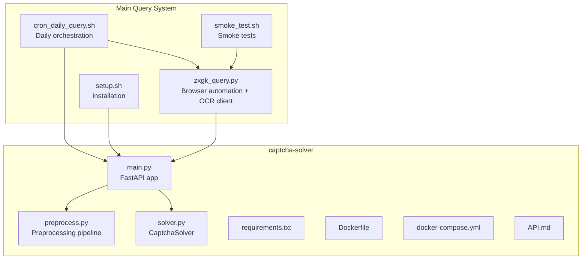
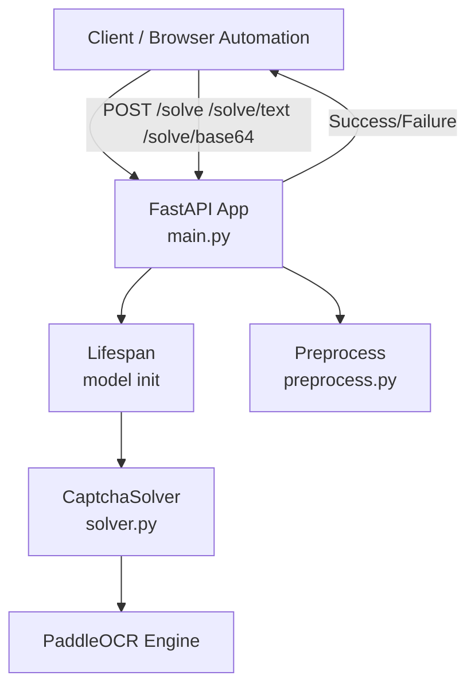
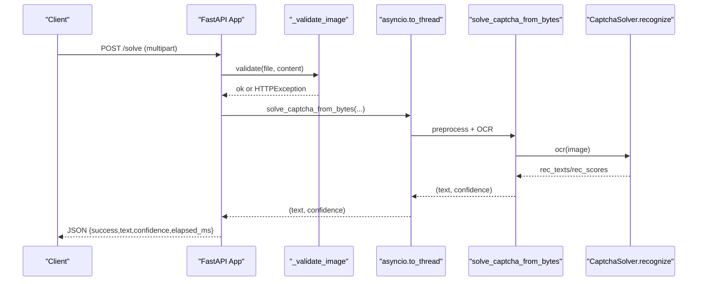
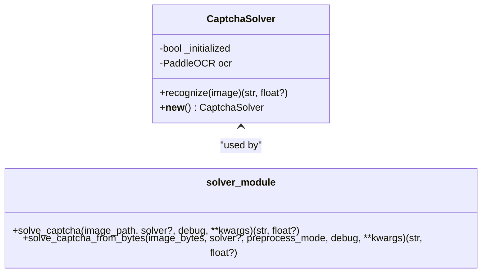
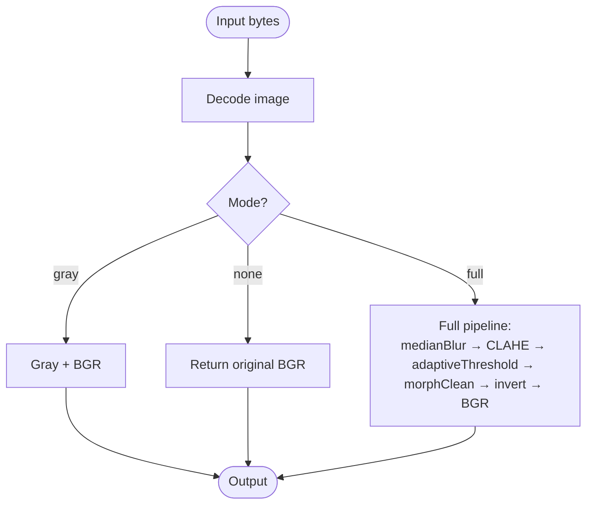
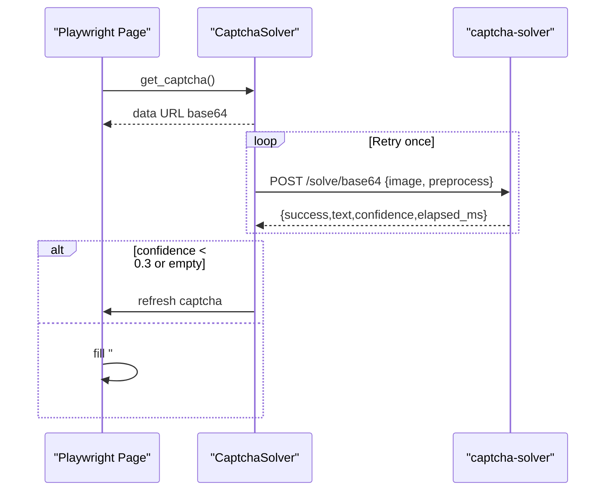
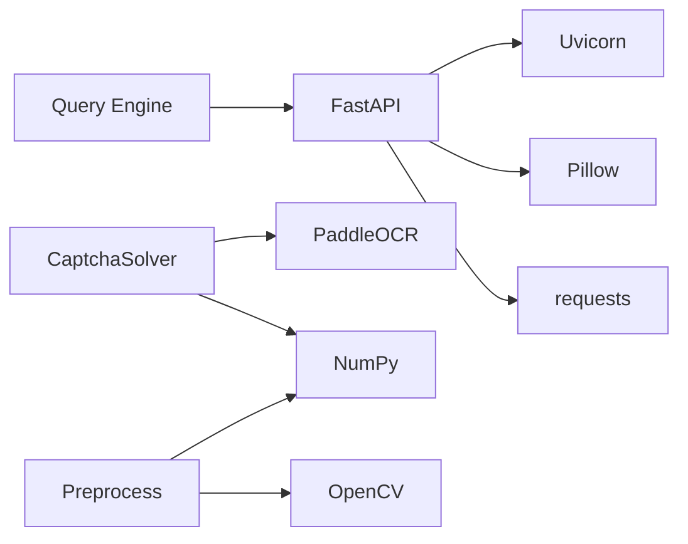

# CAPTCHA Solving System

<cite>
**Referenced Files in This Document**
- [main.py](file://captcha-solver/main.py)
- [solver.py](file://captcha-solver/solver.py)
- [preprocess.py](file://captcha-solver/preprocess.py)
- [API.md](file://captcha-solver/API.md)
- [Dockerfile](file://captcha-solver/Dockerfile)
- [docker-compose.yml](file://captcha-solver/docker-compose.yml)
- [requirements.txt](file://captcha-solver/requirements.txt)
- [README.md](file://README.md)
- [zxgk_query.py](file://zxgk_query.py)
- [cron_daily_query.sh](file://cron_daily_query.sh)
- [smoke_test.sh](file://smoke_test.sh)
- [setup.sh](file://setup.sh)
</cite>

## Table of Contents
1. [Introduction](#introduction)
2. [Project Structure](#project-structure)
3. [Core Components](#core-components)
4. [Architecture Overview](#architecture-overview)
5. [Detailed Component Analysis](#detailed-component-analysis)
6. [Dependency Analysis](#dependency-analysis)
7. [Performance Considerations](#performance-considerations)
8. [Troubleshooting Guide](#troubleshooting-guide)
9. [Conclusion](#conclusion)
10. [Appendices](#appendices)

## Introduction
This document describes the standalone OCR-based CAPTCHA solving system designed as a FastAPI microservice. It explains the service architecture, browser automation integration, image preprocessing pipeline, solver implementation, and operational guidance for deployment and troubleshooting. The OCR service is consumed by the main query system to automate form submissions that require CAPTCHA recognition.

Key goals:
- Provide a FastAPI-based OCR service for CAPTCHA recognition.
- Offer multiple input modes: file upload, pure text response, and base64 payload.
- Integrate with browser automation for seamless end-to-end operation.
- Document deployment via Docker and manual installation.
- Detail error handling, availability checks, and graceful degradation strategies.

## Project Structure
The repository is organized into two primary parts:
- captcha-solver: Standalone OCR service (FastAPI app, solver, and preprocessing).
- Root scripts and modules: Main query system that drives browser automation and consumes the OCR service.

**Diagram sources**
- [main.py:1-215](file://captcha-solver/main.py#L1-L215)
- [solver.py:1-83](file://captcha-solver/solver.py#L1-L83)
- [preprocess.py:1-130](file://captcha-solver/preprocess.py#L1-L130)
- [API.md:1-121](file://captcha-solver/API.md#L1-L121)
- [Dockerfile:1-22](file://captcha-solver/Dockerfile#L1-L22)
- [docker-compose.yml:1-13](file://captcha-solver/docker-compose.yml#L1-L13)
- [requirements.txt:1-9](file://captcha-solver/requirements.txt#L1-L9)
- [zxgk_query.py:1-200](file://zxgk_query.py#L1-L200)
- [cron_daily_query.sh:1-246](file://cron_daily_query.sh#L1-L246)
- [smoke_test.sh:1-155](file://smoke_test.sh#L1-L155)
- [setup.sh:1-150](file://setup.sh#L1-L150)

**Section sources**
- [README.md:1-122](file://README.md#L1-L122)
- [API.md:1-121](file://captcha-solver/API.md#L1-L121)

## Core Components
- FastAPI Application: Exposes health check and OCR endpoints, validates uploads, and logs requests.
- Solver: Encapsulates PaddleOCR model initialization and text extraction with confidence aggregation.
- Preprocessing Pipeline: Provides multiple modes (full, gray, none) to transform images for OCR.
- OCR Client: Consumed by the main query system to send CAPTCHA images and receive recognized text.

Key implementation highlights:
- Lifecycle-managed model loading via FastAPI lifespan.
- Async I/O offloading to thread pool for CPU-bound OCR tasks.
- Structured response models and robust error handling.
- Preprocessing modes tailored to different CAPTCHA styles.

**Section sources**
- [main.py:37-52](file://captcha-solver/main.py#L37-L52)
- [main.py:112-142](file://captcha-solver/main.py#L112-L142)
- [main.py:144-172](file://captcha-solver/main.py#L144-L172)
- [main.py:174-209](file://captcha-solver/main.py#L174-L209)
- [solver.py:8-33](file://captcha-solver/solver.py#L8-L33)
- [solver.py:34-56](file://captcha-solver/solver.py#L34-L56)
- [solver.py:71-83](file://captcha-solver/solver.py#L71-L83)
- [preprocess.py:42-67](file://captcha-solver/preprocess.py#L42-L67)
- [preprocess.py:117-130](file://captcha-solver/preprocess.py#L117-L130)

## Architecture Overview
The OCR service is a FastAPI app that loads a PaddleOCR model at startup and exposes endpoints for image-based recognition. The main query system orchestrates browser automation and calls the OCR service to resolve CAPTCHAs.

**Diagram sources**
- [main.py:37-52](file://captcha-solver/main.py#L37-L52)
- [main.py:112-209](file://captcha-solver/main.py#L112-L209)
- [solver.py:8-33](file://captcha-solver/solver.py#L8-L33)
- [preprocess.py:42-67](file://captcha-solver/preprocess.py#L42-L67)

## Detailed Component Analysis

### FastAPI Application and Endpoints
The service defines:
- Health endpoint for readiness checks.
- Two file-upload endpoints: one returning structured JSON, another returning plain text.
- A base64 endpoint for direct payload submission.

Processing logic:
- Validates uploaded file type, size, and dimensions.
- Offloads OCR to a thread pool to keep the event loop responsive.
- Logs client IP, recognized text, confidence, and elapsed time.
- Returns structured responses with success flag, text, confidence, and elapsed time.

**Diagram sources**
- [main.py:112-142](file://captcha-solver/main.py#L112-L142)
- [main.py:71-88](file://captcha-solver/main.py#L71-L88)
- [solver.py:71-83](file://captcha-solver/solver.py#L71-L83)
- [solver.py:34-56](file://captcha-solver/solver.py#L34-L56)

**Section sources**
- [main.py:102-142](file://captcha-solver/main.py#L102-L142)
- [main.py:144-172](file://captcha-solver/main.py#L144-L172)
- [main.py:174-209](file://captcha-solver/main.py#L174-L209)
- [main.py:71-88](file://captcha-solver/main.py#L71-L88)

### Solver Implementation
The solver encapsulates PaddleOCR with:
- Singleton initialization to avoid repeated model loading.
- Configurable thresholds and batch size for detection and recognition.
- Text cleaning to remove non-alphanumeric characters.
- Confidence aggregation across detected segments.

**Diagram sources**
- [solver.py:8-33](file://captcha-solver/solver.py#L8-L33)
- [solver.py:34-56](file://captcha-solver/solver.py#L34-L56)
- [solver.py:58-83](file://captcha-solver/solver.py#L58-L83)

**Section sources**
- [solver.py:8-33](file://captcha-solver/solver.py#L8-L33)
- [solver.py:34-56](file://captcha-solver/solver.py#L34-L56)
- [solver.py:58-83](file://captcha-solver/solver.py#L58-L83)

### Image Preprocessing Pipeline
The preprocessing module offers three modes:
- Full: decode → grayscale → median blur → CLAHE → adaptive threshold → morphological cleaning → invert → BGR.
- Gray: decode → grayscale → BGR.
- None: decode → original BGR.

Parameters include kernel sizes, CLAHE clip limit/tile size, adaptive threshold block size and constant, and morphological kernels.

**Diagram sources**
- [preprocess.py:78-102](file://captcha-solver/preprocess.py#L78-L102)
- [preprocess.py:105-109](file://captcha-solver/preprocess.py#L105-L109)
- [preprocess.py:112-114](file://captcha-solver/preprocess.py#L112-L114)
- [preprocess.py:117-130](file://captcha-solver/preprocess.py#L117-L130)

**Section sources**
- [preprocess.py:42-67](file://captcha-solver/preprocess.py#L42-L67)
- [preprocess.py:78-102](file://captcha-solver/preprocess.py#L78-L102)
- [preprocess.py:105-109](file://captcha-solver/preprocess.py#L105-L109)
- [preprocess.py:112-114](file://captcha-solver/preprocess.py#L112-L114)
- [preprocess.py:117-130](file://captcha-solver/preprocess.py#L117-L130)

### Base64 Image Processing and Retry Mechanisms
The OCR client in the main query system:
- Extracts base64 payload from data URL if needed.
- Sends POST /solve/base64 with preprocessor mode set to gray.
- Implements a simple retry once on transient failures.
- Applies confidence threshold validation to decide whether to submit.

**Diagram sources**
- [zxgk_query.py:339-391](file://zxgk_query.py#L339-L391)
- [zxgk_query.py:429-444](file://zxgk_query.py#L429-L444)

**Section sources**
- [zxgk_query.py:328-391](file://zxgk_query.py#L328-L391)
- [zxgk_query.py:429-444](file://zxgk_query.py#L429-L444)

## Dependency Analysis
External dependencies and runtime relationships:
- FastAPI and Uvicorn for the web server.
- PaddleOCR and OpenCV for image processing and recognition.
- Numpy for numerical operations.
- Pillow for image handling in FastAPI.

**Diagram sources**
- [requirements.txt:1-9](file://captcha-solver/requirements.txt#L1-L9)
- [solver.py:4](file://captcha-solver/solver.py#L4)
- [preprocess.py:2-4](file://captcha-solver/preprocess.py#L2-L4)
- [main.py:10-14](file://captcha-solver/main.py#L10-L14)
- [zxgk_query.py:36-39](file://zxgk_query.py#L36-L39)

**Section sources**
- [requirements.txt:1-9](file://captcha-solver/requirements.txt#L1-L9)
- [main.py:10-14](file://captcha-solver/main.py#L10-L14)
- [solver.py:4](file://captcha-solver/solver.py#L4)
- [preprocess.py:2-4](file://captcha-solver/preprocess.py#L2-L4)
- [zxgk_query.py:36-39](file://zxgk_query.py#L36-L39)

## Performance Considerations
- Model initialization cost: First request after cold start includes model download and load (~1.5 GB). Subsequent requests reuse the singleton instance.
- CPU-bound OCR: Offloaded to threads to prevent blocking the event loop.
- Preprocessing tuning: Gray mode reduces computational overhead for small-size or low-noise CAPTCHAs.
- Concurrency: Uvicorn’s worker model allows concurrent requests; ensure adequate memory for OCR model and browser automation.

[No sources needed since this section provides general guidance]

## Troubleshooting Guide
Common issues and remedies:
- OCR service not reachable:
  - Verify health endpoint responds.
  - Check port binding and firewall.
  - Confirm model download completed during first run.
- Invalid or unsupported image:
  - Ensure file type is image/*, size ≤ 5 MB, and dimensions ≤ 2000x1000.
- Low confidence or empty result:
  - Adjust preprocess mode to gray or full depending on CAPTCHA style.
  - Retry once after refreshing the CAPTCHA.
- Docker deployment:
  - Build and run with docker-compose; ensure port mapping and memory limits are sufficient.
- Manual installation:
  - Install dependencies, activate virtual environment, and run with PORT set.

Operational checks:
- Smoke tests validate Python syntax, shell scripts, configuration, and presence of generated batch JSON.
- Daily orchestration script ensures OCR service is running and starts it if needed.

**Section sources**
- [main.py:71-88](file://captcha-solver/main.py#L71-L88)
- [API.md:77-91](file://captcha-solver/API.md#L77-L91)
- [smoke_test.sh:106-113](file://smoke_test.sh#L106-L113)
- [cron_daily_query.sh:48-96](file://cron_daily_query.sh#L48-L96)
- [setup.sh:70-106](file://setup.sh#L70-L106)

## Conclusion
The OCR service provides a robust, FastAPI-based solution for CAPTCHA recognition integrated with browser automation. Its modular design separates concerns across preprocessing, OCR inference, and API exposure. The main query system applies confidence-based validation and retry logic to improve reliability. Deployment options include Docker and manual installation, with comprehensive health checks and troubleshooting procedures.

[No sources needed since this section summarizes without analyzing specific files]

## Appendices

### API Endpoints and Formats
- GET /
  - Description: Service information.
  - Response: Service metadata.
- GET /health
  - Description: Health check.
  - Response: {"status":"healthy"}.
- POST /solve
  - Content-Type: multipart/form-data.
  - Body: file=image/*.
  - Query: preprocess=full|gray|none.
  - Response: JSON with success, text, confidence, elapsed_ms, and optional error.
- POST /solve/text
  - Content-Type: multipart/form-data.
  - Body: file=image/*.
  - Query: preprocess=full|gray|none.
  - Response: Plain text on success, JSON on failure.
- POST /solve/base64
  - Content-Type: application/json.
  - Body: {"image": "base64 string", "preprocess": "full|gray|none"}.
  - Response: JSON with success, text, confidence, elapsed_ms, and optional error.

**Section sources**
- [API.md:19-76](file://captcha-solver/API.md#L19-L76)
- [API.md:31-69](file://captcha-solver/API.md#L31-L69)
- [main.py:102-209](file://captcha-solver/main.py#L102-L209)

### Deployment Instructions
- Docker (recommended):
  - Build and run with docker-compose; service listens on port 8000 inside container mapped to 8001 on host.
  - Environment variables: PORT, LOG_LEVEL, ALLOWED_ORIGINS.
- Manual installation:
  - Create and activate a virtual environment.
  - Install dependencies from requirements.txt.
  - Run with PORT set (e.g., 8001) to match main query system expectations.

**Section sources**
- [API.md:3-17](file://captcha-solver/API.md#L3-L17)
- [docker-compose.yml:1-13](file://captcha-solver/docker-compose.yml#L1-13)
- [Dockerfile:1-22](file://captcha-solver/Dockerfile#L1-L22)
- [requirements.txt:1-9](file://captcha-solver/requirements.txt#L1-L9)
- [setup.sh:70-106](file://setup.sh#L70-L106)

### Relationship with Main Query System
- The main query system launches and monitors the OCR service, ensuring it is available before performing automated queries.
- It sends CAPTCHA images captured from the browser to the OCR service and applies confidence thresholds to decide whether to submit forms.
- Graceful degradation occurs when the OCR service is unavailable, causing the orchestration to fail with a specific exit code.

**Section sources**
- [README.md:5-6](file://README.md#L5-L6)
- [cron_daily_query.sh:48-96](file://cron_daily_query.sh#L48-L96)
- [zxgk_query.py:1390-1392](file://zxgk_query.py#L1390-L1392)
- [zxgk_query.py:429-444](file://zxgk_query.py#L429-L444)