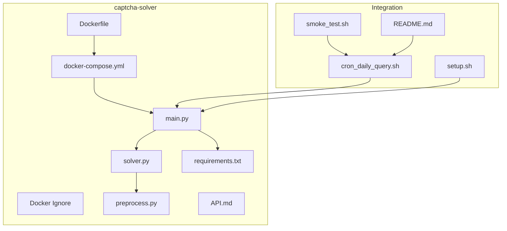
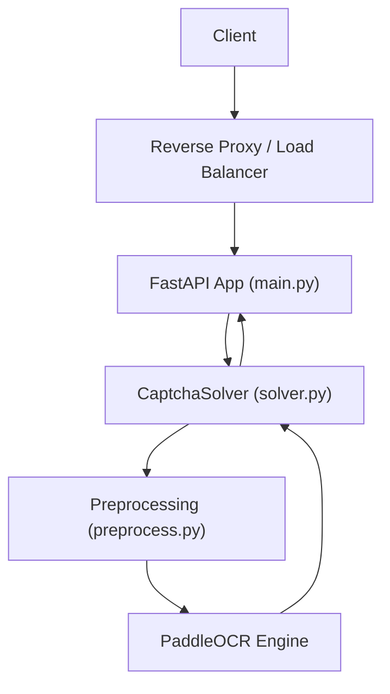
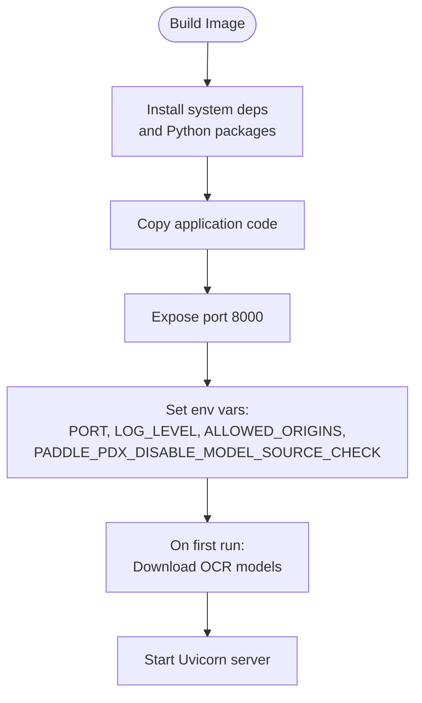
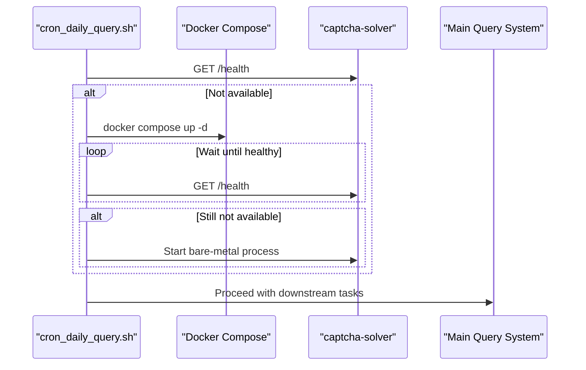
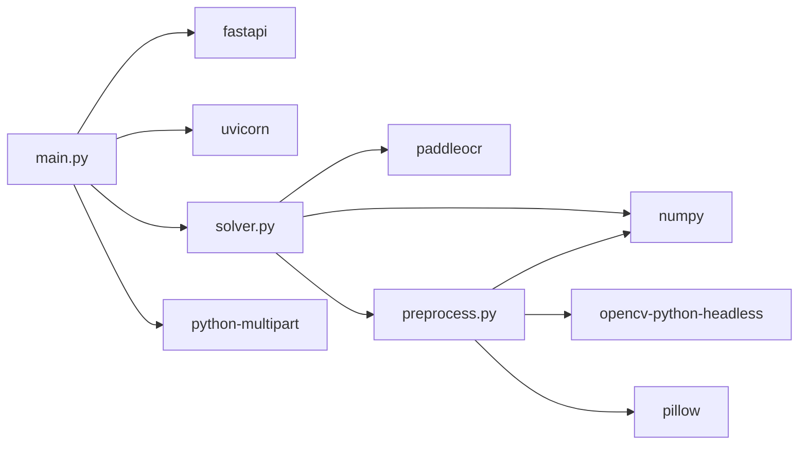

# Deployment and Configuration

<cite>
**Referenced Files in This Document**
- [Dockerfile](file://captcha-solver/Dockerfile)
- [docker-compose.yml](file://captcha-solver/docker-compose.yml)
- [.dockerignore](file://captcha-solver/.dockerignore)
- [main.py](file://captcha-solver/main.py)
- [solver.py](file://captcha-solver/solver.py)
- [preprocess.py](file://captcha-solver/preprocess.py)
- [requirements.txt](file://captcha-solver/requirements.txt)
- [API.md](file://captcha-solver/API.md)
- [setup.sh](file://setup.sh)
- [smoke_test.sh](file://smoke_test.sh)
- [README.md](file://README.md)
- [cron_daily_query.sh](file://cron_daily_query.sh)
</cite>

## Table of Contents
1. [Introduction](#introduction)
2. [Project Structure](#project-structure)
3. [Core Components](#core-components)
4. [Architecture Overview](#architecture-overview)
5. [Detailed Component Analysis](#detailed-component-analysis)
6. [Dependency Analysis](#dependency-analysis)
7. [Performance Considerations](#performance-considerations)
8. [Troubleshooting Guide](#troubleshooting-guide)
9. [Conclusion](#conclusion)
10. [Appendices](#appendices)

## Introduction
This document provides comprehensive guidance for deploying and configuring the CAPTCHA solving service. It covers Docker containerization, manual installation, environment variables, service startup, health checks, monitoring, security, and integration with the main query system. The service exposes REST endpoints for image-based and base64-based CAPTCHA recognition and integrates with the broader daily query pipeline.

## Project Structure
The CAPTCHA solver is implemented as a FastAPI application packaged with Uvicorn. It uses PaddleOCR for text detection and recognition, with OpenCV-based preprocessing to improve OCR accuracy. The repository includes:
- A Dockerfile for containerized deployment
- A docker-compose configuration for orchestration
- A main application module exposing REST endpoints
- A solver module wrapping PaddleOCR
- A preprocessing module implementing image enhancement and binarization
- Requirements and API documentation

**Diagram sources**
- [Dockerfile:1-22](file://captcha-solver/Dockerfile#L1-L22)
- [docker-compose.yml:1-13](file://captcha-solver/docker-compose.yml#L1-L13)
- [.dockerignore:1-10](file://captcha-solver/.dockerignore#L1-L10)
- [main.py:1-215](file://captcha-solver/main.py#L1-L215)
- [solver.py:1-83](file://captcha-solver/solver.py#L1-L83)
- [preprocess.py:1-130](file://captcha-solver/preprocess.py#L1-L130)
- [requirements.txt:1-9](file://captcha-solver/requirements.txt#L1-L9)
- [API.md:1-121](file://captcha-solver/API.md#L1-L121)
- [cron_daily_query.sh:1-246](file://cron_daily_query.sh#L1-L246)
- [smoke_test.sh:1-155](file://smoke_test.sh#L1-L155)
- [setup.sh:1-150](file://setup.sh#L1-L150)
- [README.md:1-122](file://README.md#L1-L122)

**Section sources**
- [Dockerfile:1-22](file://captcha-solver/Dockerfile#L1-L22)
- [docker-compose.yml:1-13](file://captcha-solver/docker-compose.yml#L1-L13)
- [.dockerignore:1-10](file://captcha-solver/.dockerignore#L1-L10)
- [main.py:1-215](file://captcha-solver/main.py#L1-L215)
- [solver.py:1-83](file://captcha-solver/solver.py#L1-L83)
- [preprocess.py:1-130](file://captcha-solver/preprocess.py#L1-L130)
- [requirements.txt:1-9](file://captcha-solver/requirements.txt#L1-L9)
- [API.md:1-121](file://captcha-solver/API.md#L1-L121)
- [README.md:1-122](file://README.md#L1-L122)
- [cron_daily_query.sh:1-246](file://cron_daily_query.sh#L1-L246)
- [smoke_test.sh:1-155](file://smoke_test.sh#L1-L155)
- [setup.sh:1-150](file://setup.sh#L1-L150)

## Core Components
- FastAPI application with lifecycle management, CORS middleware, and health endpoint
- OCR solver using PaddleOCR with configurable parameters
- Preprocessing pipeline for image enhancement and binarization
- REST endpoints for file upload, pure text response, and base64 input
- Environment-driven configuration for port, allowed origins, and log level

Key configuration options:
- PORT: service listening port
- ALLOWED_ORIGINS: CORS origins (comma-separated)
- LOG_LEVEL: logging verbosity
- PADDLE_PDX_DISABLE_MODEL_SOURCE_CHECK: disable model source verification

**Section sources**
- [main.py:18-31](file://captcha-solver/main.py#L18-L31)
- [main.py:102-171](file://captcha-solver/main.py#L102-L171)
- [solver.py:19-32](file://captcha-solver/solver.py#L19-L32)
- [API.md:77-84](file://captcha-solver/API.md#L77-L84)

## Architecture Overview
The service runs as a standalone FastAPI app behind Uvicorn. It loads the PaddleOCR model during application startup and serves multiple endpoints for CAPTCHA recognition. The main query system orchestrates the service via cron scripts, automatically starting Docker or a local process if the health endpoint is unavailable.

**Diagram sources**
- [main.py:37-52](file://captcha-solver/main.py#L37-L52)
- [solver.py:8-33](file://captcha-solver/solver.py#L8-L33)
- [preprocess.py:42-67](file://captcha-solver/preprocess.py#L42-L67)

**Section sources**
- [main.py:37-52](file://captcha-solver/main.py#L37-L52)
- [solver.py:8-33](file://captcha-solver/solver.py#L8-L33)
- [preprocess.py:42-67](file://captcha-solver/preprocess.py#L42-L67)

## Detailed Component Analysis

### Docker Containerization
- Base image: Python slim with additional system libraries for GUI/graphics support
- Model download is deferred to runtime to keep images small
- Exposed port: 8000
- Environment variables:
  - PORT: service port
  - LOG_LEVEL: logging level
  - ALLOWED_ORIGINS: CORS origins
  - PADDLE_PDX_DISABLE_MODEL_SOURCE_CHECK: disable model source check
- Compose configuration:
  - Maps host port 8001 to container port 8000
  - Sets timezone and memory limit
  - Uses restart policy unless-stopped

**Diagram sources**
- [Dockerfile:1-22](file://captcha-solver/Dockerfile#L1-L22)
- [docker-compose.yml:1-13](file://captcha-solver/docker-compose.yml#L1-L13)

**Section sources**
- [Dockerfile:1-22](file://captcha-solver/Dockerfile#L1-L22)
- [docker-compose.yml:1-13](file://captcha-solver/docker-compose.yml#L1-L13)
- [API.md:77-84](file://captcha-solver/API.md#L77-L84)

### Manual Installation and System Prerequisites
- OS: Ubuntu or macOS
- Python 3.10+ and virtual environment
- Node/npm for optional tooling
- Docker recommended for OCR service deployment
- Memory recommendation: 4GB+ (OCR model ~1.5GB + browser overhead)
- Optional: Playwright Chromium for main query system

Installation steps:
- Create and activate a Python virtual environment
- Install Python dependencies from requirements.txt
- Install Playwright Chromium if needed for the main system
- Optionally install PaddleOCR directly or rely on Docker image

**Section sources**
- [README.md:8-13](file://README.md#L8-L13)
- [setup.sh:27-45](file://setup.sh#L27-L45)
- [requirements.txt:1-9](file://captcha-solver/requirements.txt#L1-L9)

### Service Startup Procedures
- Docker: docker compose up -d
- Bare metal: source venv/bin/activate, set PORT, run main.py
- First-run model download occurs automatically during container initialization or first request

Health checks:
- GET /health returns {"status":"healthy"}
- Cron orchestration checks /health on port 8001 and starts the service if missing

**Section sources**
- [API.md:3-17](file://captcha-solver/API.md#L3-L17)
- [main.py:107-109](file://captcha-solver/main.py#L107-L109)
- [cron_daily_query.sh:48-96](file://cron_daily_query.sh#L48-L96)

### API Endpoints and Behavior
- GET /: service metadata
- GET /health: health status
- POST /solve: multipart/form-data upload, returns structured JSON
- POST /solve/text: multipart/form-data upload, returns plain text or JSON on error
- POST /solve/base64: JSON input with base64 image, returns structured JSON

Validation and limits:
- Only image/* uploads accepted
- Max file size: 5MB
- Max image dimensions: 2000x1000 pixels
- Preprocessing modes: full, gray, none

**Section sources**
- [API.md:19-28](file://captcha-solver/API.md#L19-L28)
- [main.py:71-88](file://captcha-solver/main.py#L71-L88)
- [main.py:112-171](file://captcha-solver/main.py#L112-L171)
- [main.py:174-209](file://captcha-solver/main.py#L174-L209)

### OCR Model Settings and Preprocessing
- PaddleOCR engine configured with language, version, and detection thresholds
- Preprocessing pipeline includes:
  - Median blur to remove interference lines
  - Contrast enhancement via CLAHE
  - Adaptive or Otsu thresholding
  - Morphological cleaning (open/close)
  - Grayscale-to-BGR conversion for OCR compatibility
- Modes:
  - full: complete pipeline
  - gray: grayscale only
  - none: raw image

**Section sources**
- [solver.py:19-32](file://captcha-solver/solver.py#L19-L32)
- [preprocess.py:42-67](file://captcha-solver/preprocess.py#L42-L67)
- [preprocess.py:117-129](file://captcha-solver/preprocess.py#L117-L129)

### Monitoring Setup
- Health endpoint: GET /health
- Logging: configurable log level via environment variable
- Orchestrator: cron job checks health and auto-starts service

**Section sources**
- [main.py:107-109](file://captcha-solver/main.py#L107-L109)
- [main.py:26-29](file://captcha-solver/main.py#L26-L29)
- [cron_daily_query.sh:48-96](file://cron_daily_query.sh#L48-L96)

### Security Configurations
- CORS: controlled by ALLOWED_ORIGINS environment variable
- File upload validation: type, size, and dimension checks
- Base64 input parsing with optional header stripping
- Reverse proxy recommended for production deployments

**Section sources**
- [main.py:54-59](file://captcha-solver/main.py#L54-L59)
- [main.py:71-88](file://captcha-solver/main.py#L71-L88)
- [main.py:174-209](file://captcha-solver/main.py#L174-L209)

### Integration with Main Query System
- The main system expects a compatible OCR service on localhost:8001
- Cron orchestration:
  - Checks /health on port 8001
  - Starts Docker container if missing
  - Falls back to bare-metal process if Docker fails
- Smoke testing validates service availability and basic functionality

**Diagram sources**
- [cron_daily_query.sh:48-96](file://cron_daily_query.sh#L48-L96)
- [docker-compose.yml:1-13](file://captcha-solver/docker-compose.yml#L1-L13)
- [main.py:107-109](file://captcha-solver/main.py#L107-L109)

**Section sources**
- [README.md:5-6](file://README.md#L5-L6)
- [cron_daily_query.sh:48-96](file://cron_daily_query.sh#L48-L96)
- [smoke_test.sh:106-113](file://smoke_test.sh#L106-L113)

## Dependency Analysis
External dependencies include FastAPI, Uvicorn, PaddleOCR, OpenCV, NumPy, Pillow, and multipart handling. The Docker image installs system-level libraries for graphics support.

**Diagram sources**
- [requirements.txt:1-9](file://captcha-solver/requirements.txt#L1-L9)
- [main.py:10-16](file://captcha-solver/main.py#L10-L16)
- [solver.py:1-6](file://captcha-solver/solver.py#L1-L6)
- [preprocess.py:1-4](file://captcha-solver/preprocess.py#L1-L4)

**Section sources**
- [requirements.txt:1-9](file://captcha-solver/requirements.txt#L1-L9)
- [main.py:10-16](file://captcha-solver/main.py#L10-L16)
- [solver.py:1-6](file://captcha-solver/solver.py#L1-L6)
- [preprocess.py:1-4](file://captcha-solver/preprocess.py#L1-L4)

## Performance Considerations
- Model loading cost: first-run model download occurs during container init or first request
- CPU-based OCR latency: approximately 50–150 ms per request
- Preprocessing tuning:
  - Adjust CLAHE clip limit and tile size for contrast enhancement
  - Tune adaptive threshold block size and constant for binarization
  - Morphological kernels to balance noise removal and character connectivity
- Concurrency:
  - Uvicorn’s default worker count is suitable for CPU-bound OCR
  - Consider scaling horizontally with multiple replicas behind a load balancer
- Resource limits:
  - Memory limit set in compose configuration (2GB)
  - Ensure sufficient host memory for OCR model and concurrent requests

[No sources needed since this section provides general guidance]

## Troubleshooting Guide
Common deployment issues and resolutions:
- Port conflicts:
  - Verify port 8001 is free; the orchestrator detects non-captcha processes occupying the port
  - Stop conflicting processes or adjust the target port in configuration
- Model download failures:
  - Ensure network connectivity and disk space (~1.5GB)
  - The container initializes model downloads on first run
- CORS errors:
  - Set ALLOWED_ORIGINS to include the origin(s) of clients
- Health check failures:
  - Confirm service is reachable on the configured port
  - Use the smoke test script to validate environment and dependencies
- OCR accuracy:
  - Try different preprocessing modes (full vs gray vs none)
  - Adjust preprocessing parameters in the preprocessing module

**Section sources**
- [cron_daily_query.sh:48-57](file://cron_daily_query.sh#L48-L57)
- [smoke_test.sh:106-113](file://smoke_test.sh#L106-L113)
- [API.md:77-84](file://captcha-solver/API.md#L77-L84)
- [main.py:54-59](file://captcha-solver/main.py#L54-L59)

## Conclusion
The CAPTCHA solver is designed for robust deployment via Docker or bare-metal environments. It integrates seamlessly with the main query system through health checks and automatic startup. Proper configuration of environment variables, resource limits, and preprocessing parameters ensures reliable OCR performance and smooth operation within the broader automation pipeline.

[No sources needed since this section summarizes without analyzing specific files]

## Appendices

### Environment Variables Reference
- PORT: service port (default 8000)
- ALLOWED_ORIGINS: comma-separated CORS origins (default *)
- LOG_LEVEL: logging level (debug/info/warning/error)
- PADDLE_PDX_DISABLE_MODEL_SOURCE_CHECK: disable model source verification

**Section sources**
- [main.py:18-21](file://captcha-solver/main.py#L18-L21)
- [API.md:77-84](file://captcha-solver/API.md#L77-L84)

### API Reference
- GET /: service metadata
- GET /health: health status
- POST /solve: multipart/form-data upload, structured JSON response
- POST /solve/text: multipart/form-data upload, plain text or JSON error
- POST /solve/base64: JSON base64 input, structured JSON response

**Section sources**
- [API.md:19-28](file://captcha-solver/API.md#L19-L28)
- [main.py:102-171](file://captcha-solver/main.py#L102-L171)
- [main.py:174-209](file://captcha-solver/main.py#L174-L209)

### Orchestration and Integration Notes
- The main system expects a compatible OCR service on localhost:8001
- Cron orchestration attempts Docker first, then falls back to bare-metal
- Smoke tests validate service readiness and environment configuration

**Section sources**
- [README.md:5-6](file://README.md#L5-L6)
- [cron_daily_query.sh:48-96](file://cron_daily_query.sh#L48-L96)
- [smoke_test.sh:106-113](file://smoke_test.sh#L106-L113)