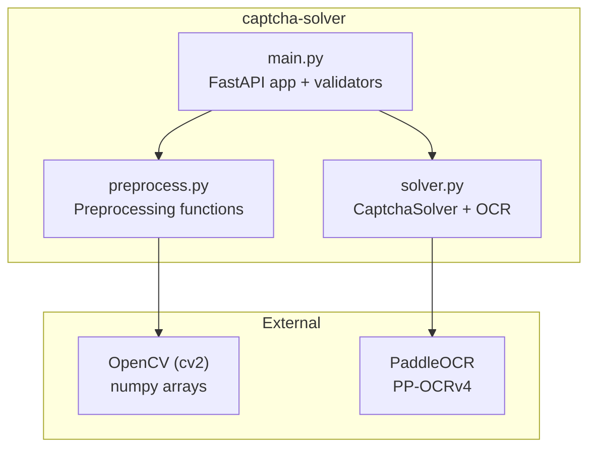
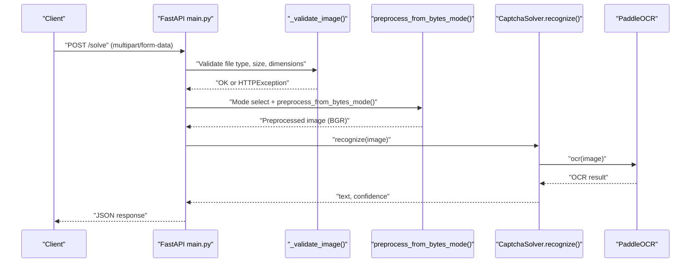
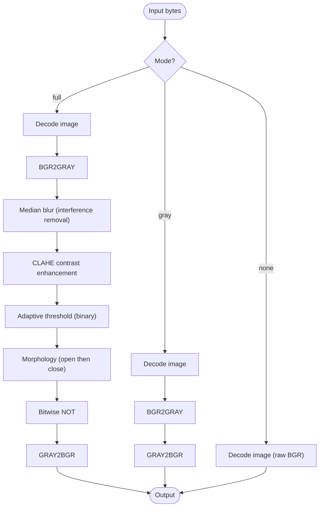
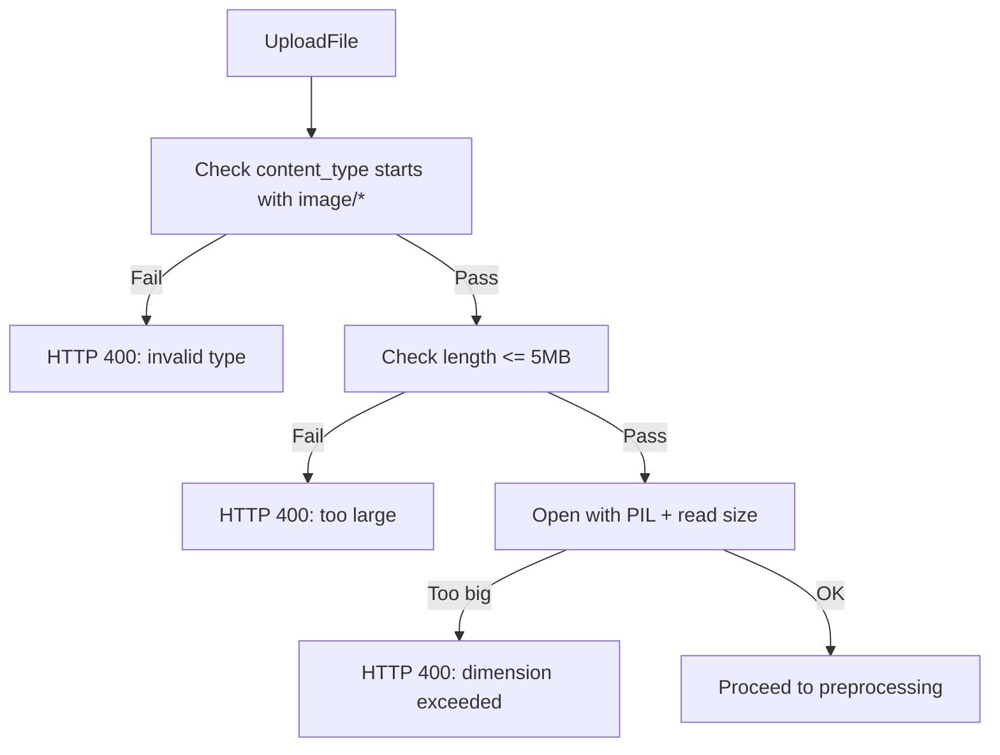
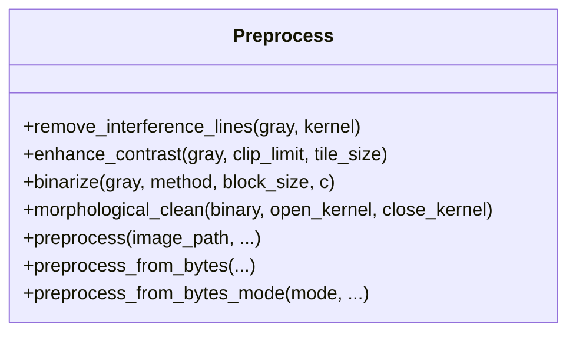
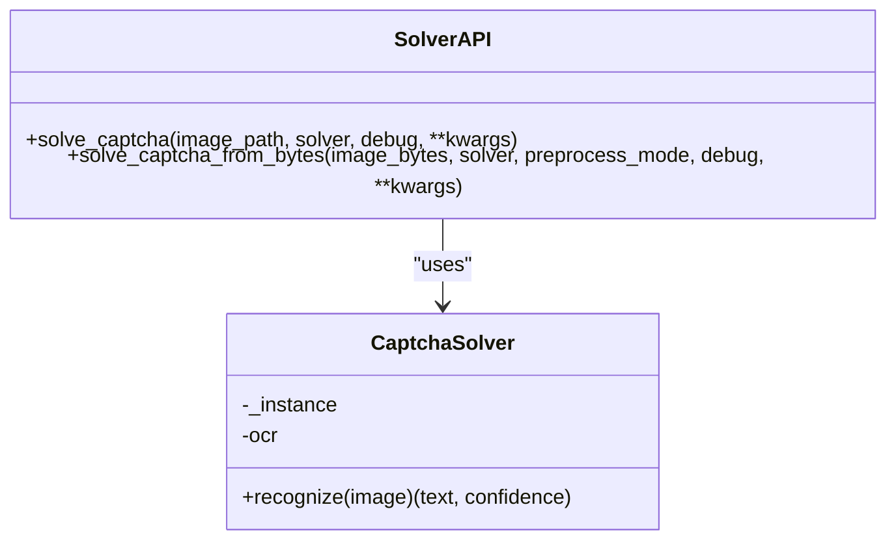
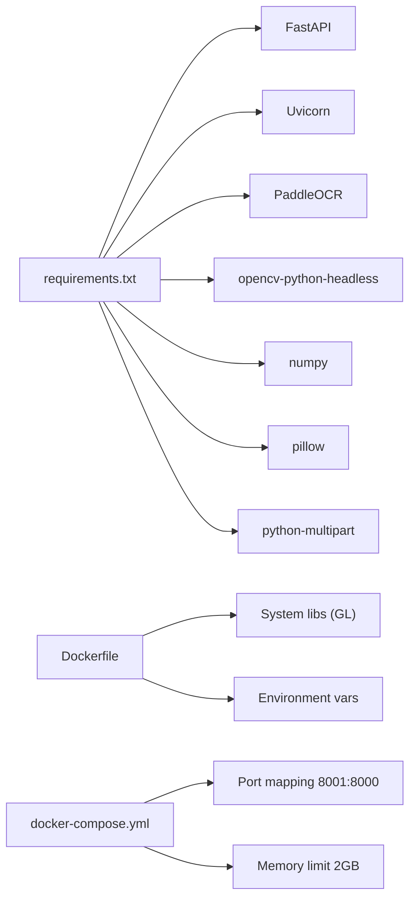

# Image Preprocessing Pipeline

<cite>
**Referenced Files in This Document**
- [preprocess.py](file://captcha-solver/preprocess.py)
- [solver.py](file://captcha-solver/solver.py)
- [main.py](file://captcha-solver/main.py)
- [API.md](file://captcha-solver/API.md)
- [requirements.txt](file://captcha-solver/requirements.txt)
- [Dockerfile](file://captcha-solver/Dockerfile)
- [docker-compose.yml](file://captcha-solver/docker-compose.yml)
- [README.md](file://README.md)
</cite>

## Table of Contents
1. [Introduction](#introduction)
2. [Project Structure](#project-structure)
3. [Core Components](#core-components)
4. [Architecture Overview](#architecture-overview)
5. [Detailed Component Analysis](#detailed-component-analysis)
6. [Dependency Analysis](#dependency-analysis)
7. [Performance Considerations](#performance-considerations)
8. [Troubleshooting Guide](#troubleshooting-guide)
9. [Conclusion](#conclusion)
10. [Appendices](#appendices)

## Introduction
This document explains the image preprocessing pipeline used in the CAPTCHA solving service. It covers the three preprocessing modes (full, gray, none), image validation rules, enhancement techniques, noise reduction, contrast adjustment, and practical workflows. It also documents performance characteristics, memory usage, and troubleshooting tips for common CAPTCHA types.

## Project Structure
The preprocessing and recognition pipeline is implemented in a small set of focused modules:
- Preprocessing: OpenCV-based transformations for grayscale, noise removal, contrast enhancement, binarization, and morphological cleanup.
- Recognition: PaddleOCR integration for text extraction and confidence scoring.
- API: FastAPI endpoints validating images and routing requests to the solver.

**Diagram sources**
- [main.py:101-214](file://captcha-solver/main.py#L101-L214)
- [solver.py:8-83](file://captcha-solver/solver.py#L8-L83)
- [preprocess.py:42-130](file://captcha-solver/preprocess.py#L42-L130)

**Section sources**
- [main.py:101-214](file://captcha-solver/main.py#L101-L214)
- [solver.py:8-83](file://captcha-solver/solver.py#L8-L83)
- [preprocess.py:42-130](file://captcha-solver/preprocess.py#L42-L130)

## Core Components
- Preprocessing module exposes:
  - Full pipeline: grayscale → interference removal → CLAHE contrast enhancement → adaptive thresholding → morphological cleaning → bitwise inversion → BGR conversion.
  - Gray mode: grayscale only, suitable for small or robust CAPTCHAs.
  - None mode: raw BGR pass-through.
  - Byte-based variants for in-memory processing and mode selection.
- Validation module enforces:
  - MIME type checks for image/*.
  - File size limit.
  - Maximum width and height.
- Recognition module:
  - Singleton PaddleOCR wrapper configured for PP-OCRv4 with tuned detection thresholds and batch size.
  - Post-processing strips non-alphanumeric characters and computes average confidence.

**Section sources**
- [preprocess.py:42-130](file://captcha-solver/preprocess.py#L42-L130)
- [main.py:71-88](file://captcha-solver/main.py#L71-L88)
- [solver.py:21-55](file://captcha-solver/solver.py#L21-L55)

## Architecture Overview
End-to-end flow from HTTP request to OCR result:

**Diagram sources**
- [main.py:112-142](file://captcha-solver/main.py#L112-L142)
- [main.py:71-88](file://captcha-solver/main.py#L71-L88)
- [solver.py:71-83](file://captcha-solver/solver.py#L71-L83)
- [preprocess.py:117-130](file://captcha-solver/preprocess.py#L117-L130)

## Detailed Component Analysis

### Preprocessing Modes
- full: Complete pipeline designed for varied CAPTCHA styles. Produces white-on-black BGR images suitable for PaddleOCR.
- gray: Grayscale-only mode for small or low-noise CAPTCHAs; reduces overhead.
- none: Raw BGR pass-through for special cases or when upstream normalization is preferred.

**Diagram sources**
- [preprocess.py:86-102](file://captcha-solver/preprocess.py#L86-L102)
- [preprocess.py:105-109](file://captcha-solver/preprocess.py#L105-L109)
- [preprocess.py:112-114](file://captcha-solver/preprocess.py#L112-L114)
- [preprocess.py:117-129](file://captcha-solver/preprocess.py#L117-L129)

**Section sources**
- [preprocess.py:42-67](file://captcha-solver/preprocess.py#L42-L67)
- [preprocess.py:105-109](file://captcha-solver/preprocess.py#L105-L109)
- [preprocess.py:112-114](file://captcha-solver/preprocess.py#L112-L114)
- [preprocess.py:117-129](file://captcha-solver/preprocess.py#L117-L129)

### Image Validation
Validation ensures safe and predictable OCR input:
- MIME type: image/*
- File size: <= 5 MB
- Dimensions: width <= 2000 px, height <= 1000 px
- Parsing errors are surfaced as HTTP 400.

**Diagram sources**
- [main.py:71-88](file://captcha-solver/main.py#L71-L88)

**Section sources**
- [main.py:22-24](file://captcha-solver/main.py#L22-L24)
- [main.py:71-88](file://captcha-solver/main.py#L71-L88)

### Enhancement Techniques and Noise Reduction
- Interference removal: Median blur to reduce thin lines and noise while preserving character edges.
- Contrast enhancement: CLAHE (Contrast Limited Adaptive Histogram Equalization) improves text-background separation.
- Binarization: Adaptive thresholding is robust to uneven illumination; Otsu thresholding is available for clean backgrounds.
- Morphological cleaning: Opening removes small noise; closing connects broken strokes.
- Output inversion: Converts black-on-white to white-on-black for PaddleOCR.

**Diagram sources**
- [preprocess.py:7-130](file://captcha-solver/preprocess.py#L7-L130)

**Section sources**
- [preprocess.py:7-39](file://captcha-solver/preprocess.py#L7-L39)
- [preprocess.py:12-15](file://captcha-solver/preprocess.py#L12-L15)
- [preprocess.py:18-28](file://captcha-solver/preprocess.py#L18-L28)
- [preprocess.py:31-39](file://captcha-solver/preprocess.py#L31-L39)

### OCR Integration and Confidence Scoring
- PaddleOCR is initialized once (singleton) with:
  - Language: English
  - Model: PP-OCRv4
  - Detection thresholds tuned for small CAPTCHA text
  - Batch size configured for throughput
- Recognition returns:
  - Cleaned alphanumeric text
  - Average confidence across recognized segments

**Diagram sources**
- [solver.py:8-83](file://captcha-solver/solver.py#L8-L83)

**Section sources**
- [solver.py:21-31](file://captcha-solver/solver.py#L21-L31)
- [solver.py:34-55](file://captcha-solver/solver.py#L34-L55)
- [solver.py:58-83](file://captcha-solver/solver.py#L58-L83)

### Practical Preprocessing Workflows and Impact on OCR Accuracy
- Small or heavy-font CAPTCHAs: Prefer gray mode to reduce computation and avoid over-cleaning.
- Noisy or low-contrast CAPTCHAs: Use full mode to maximize separation between text and background.
- Mixed lighting conditions: Adaptive thresholding in full mode generally yields better results than fixed thresholds.
- Very small or pixelated text: Consider increasing CLAHE tile size slightly or adjusting adaptive block size to preserve fine details.

[No sources needed since this section provides general guidance]

### API Endpoints and Usage Patterns
- GET /health: Health check endpoint returning a simple status payload.
- POST /solve: Upload CAPTCHA as multipart/form-data; returns JSON with success, text, confidence, and elapsed time.
- POST /solve/text: Same as above, but returns pure text on success.
- POST /solve/base64: Accepts JSON with base64 image and optional preprocess mode; returns JSON.

**Section sources**
- [API.md:19-28](file://captcha-solver/API.md#L19-L28)
- [API.md:29-68](file://captcha-solver/API.md#L29-L68)
- [API.md:77-84](file://captcha-solver/API.md#L77-L84)
- [main.py:102-142](file://captcha-solver/main.py#L102-L142)
- [main.py:144-172](file://captcha-solver/main.py#L144-L172)
- [main.py:174-209](file://captcha-solver/main.py#L174-L209)

## Dependency Analysis
- Runtime dependencies include FastAPI, Uvicorn, PaddleOCR, OpenCV headless, NumPy, Pillow, and multipart parsing.
- Dockerfile installs system GL libraries for OpenCV compatibility and sets environment to skip model source checks.
- docker-compose exposes port 8001 mapped to container port 8000 and applies a 2 GB memory limit.

**Diagram sources**
- [requirements.txt:1-9](file://captcha-solver/requirements.txt#L1-L9)
- [Dockerfile:1-22](file://captcha-solver/Dockerfile#L1-L22)
- [docker-compose.yml:1-13](file://captcha-solver/docker-compose.yml#L1-L13)

**Section sources**
- [requirements.txt:1-9](file://captcha-solver/requirements.txt#L1-L9)
- [Dockerfile:1-22](file://captcha-solver/Dockerfile#L1-L22)
- [docker-compose.yml:1-13](file://captcha-solver/docker-compose.yml#L1-L13)

## Performance Considerations
- Memory footprint:
  - PaddleOCR model (~1.5 GB) plus runtime overhead; container memory limit set to 2 GB.
  - CPU-only inference latency: approximately 50–150 ms per image.
- Throughput:
  - OCR batch size configured to 6 for improved throughput on small texts.
  - Async I/O with thread pool offloading to keep the event loop responsive.
- Image size limits:
  - Enforced at API boundary to prevent excessive memory usage during decoding and processing.
- Preprocessing cost:
  - Full mode adds median blur, CLAHE, thresholding, and morphology; gray mode avoids most steps.
- Deployment:
  - Headless OpenCV and CPU-based PaddleOCR minimize GPU overhead; adjust memory limits accordingly.

**Section sources**
- [docker-compose.yml:12-12](file://captcha-solver/docker-compose.yml#L12-L12)
- [API.md:86-92](file://captcha-solver/API.md#L86-L92)
- [solver.py:30-30](file://captcha-solver/solver.py#L30-L30)
- [main.py:22-24](file://captcha-solver/main.py#L22-L24)

## Troubleshooting Guide
Common issues and remedies:
- Invalid image type:
  - Cause: Non-image/* content type.
  - Fix: Ensure multipart upload uses a valid image file.
- File too large:
  - Cause: > 5 MB.
  - Fix: Compress or resize before upload.
- Excessive dimensions:
  - Cause: Width or height > 2000x1000.
  - Fix: Downscale image prior to upload.
- OCR returns empty text:
  - Cause: Low contrast, severe noise, or unsupported characters.
  - Remedy: Try full mode; adjust adaptive threshold parameters; verify font is supported.
- Incorrect mode selection:
  - Cause: Using gray for noisy or low-contrast CAPTCHAs.
  - Remedy: Switch to full mode; if still failing, try none to bypass preprocessing.
- Slow performance:
  - Cause: Large images or CPU-bound environment.
  - Remedy: Reduce image size; ensure adequate CPU/memory resources; consider GPU acceleration if available.
- Docker model download failures:
  - Cause: Network restrictions or missing environment variable.
  - Remedy: Set the environment variable to disable model source checks; ensure outbound connectivity.

**Section sources**
- [main.py:71-88](file://captcha-solver/main.py#L71-L88)
- [API.md:86-92](file://captcha-solver/API.md#L86-L92)
- [Dockerfile:16-21](file://captcha-solver/Dockerfile#L16-L21)
- [README.md:10-11](file://README.md#L10-L11)

## Conclusion
The preprocessing pipeline offers flexible modes tailored to different CAPTCHA styles. Validation ensures robustness, while PaddleOCR provides reliable text extraction with confidence scores. By selecting the appropriate mode and tuning parameters, users can achieve high OCR accuracy across diverse CAPTCHA types while maintaining performance and memory efficiency.

## Appendices

### API Reference Summary
- GET /health: Returns health status.
- POST /solve: Upload CAPTCHA; returns JSON with success, text, confidence, elapsed_ms.
- POST /solve/text: Upload CAPTCHA; returns plain text on success.
- POST /solve/base64: Base64 image input; returns JSON.

**Section sources**
- [API.md:19-28](file://captcha-solver/API.md#L19-L28)
- [API.md:29-68](file://captcha-solver/API.md#L29-L68)