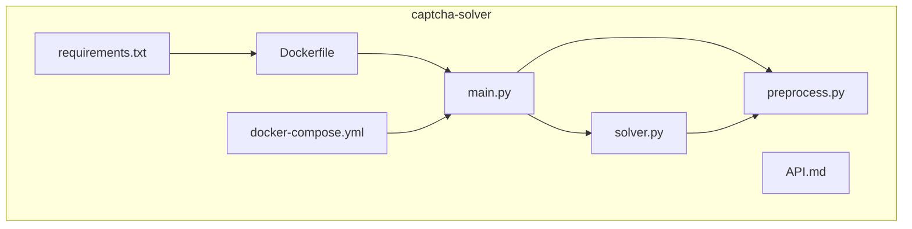
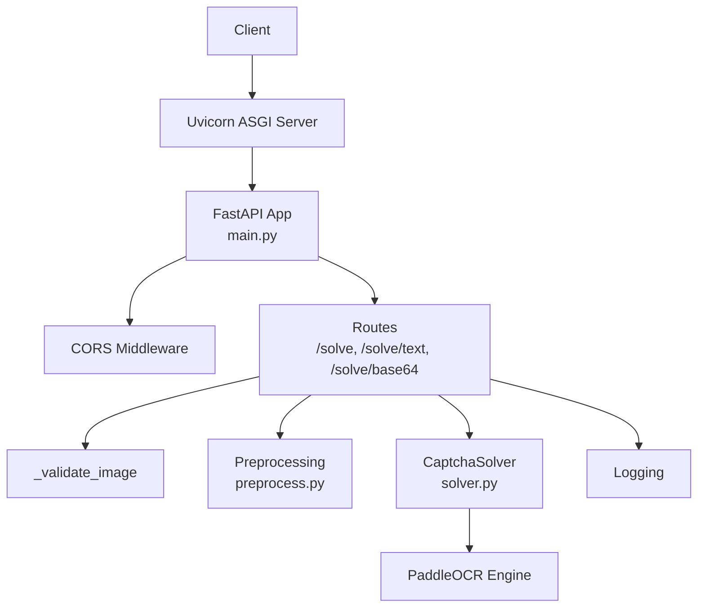
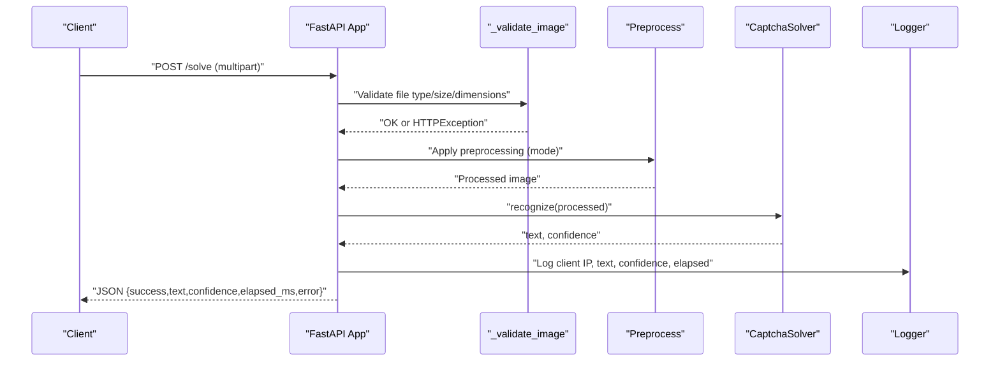
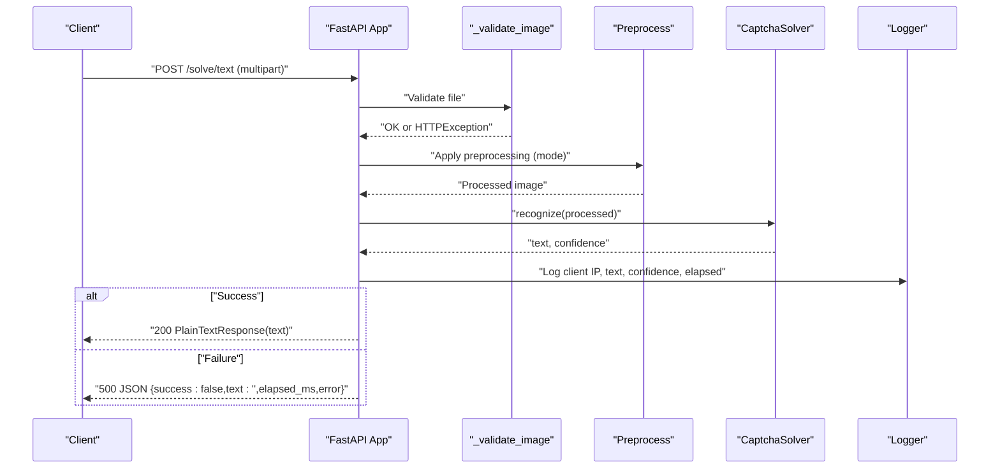
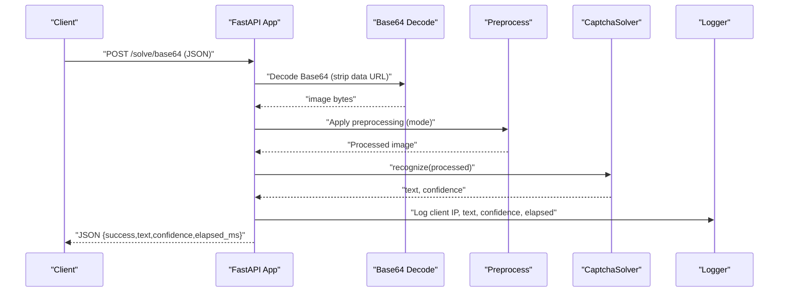
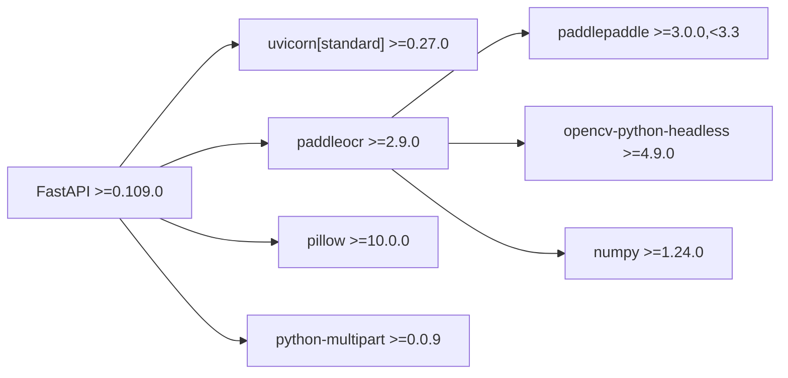

# OCR Service API Endpoints

<cite>
**Referenced Files in This Document**
- [main.py](file://captcha-solver/main.py)
- [solver.py](file://captcha-solver/solver.py)
- [preprocess.py](file://captcha-solver/preprocess.py)
- [API.md](file://captcha-solver/API.md)
- [Dockerfile](file://captcha-solver/Dockerfile)
- [docker-compose.yml](file://captcha-solver/docker-compose.yml)
- [requirements.txt](file://captcha-solver/requirements.txt)
- [README.md](file://README.md)
</cite>

## Table of Contents
1. [Introduction](#introduction)
2. [Project Structure](#project-structure)
3. [Core Components](#core-components)
4. [Architecture Overview](#architecture-overview)
5. [Detailed Component Analysis](#detailed-component-analysis)
6. [Dependency Analysis](#dependency-analysis)
7. [Performance Considerations](#performance-considerations)
8. [Troubleshooting Guide](#troubleshooting-guide)
9. [Conclusion](#conclusion)
10. [Appendices](#appendices)

## Introduction
This document provides comprehensive API documentation for the CAPTCHA solving service built with FastAPI and PaddleOCR. It covers HTTP endpoints, request/response schemas, authentication, CORS configuration, error handling, and practical usage examples. The service exposes three primary endpoints:
- POST /solve: Multipart upload with configurable preprocessing
- POST /solve/text: Multipart upload returning plain text or JSON on failure
- POST /solve/base64: JSON payload with Base64 image and optional preprocessing

It also documents health checks, environment variables, rate limits, and client integration guidelines.

## Project Structure
The OCR service is organized into focused modules:
- main.py: FastAPI application, routes, middleware, and endpoint handlers
- solver.py: OCR engine wrapper using PaddleOCR
- preprocess.py: Image preprocessing pipeline supporting multiple modes
- API.md: Reference documentation and examples
- Dockerfile and docker-compose.yml: Containerization and runtime configuration
- requirements.txt: Python dependencies

**Diagram sources**
- [main.py:1-215](file://captcha-solver/main.py#L1-L215)
- [solver.py:1-83](file://captcha-solver/solver.py#L1-L83)
- [preprocess.py:1-130](file://captcha-solver/preprocess.py#L1-L130)
- [Dockerfile:1-22](file://captcha-solver/Dockerfile#L1-L22)
- [docker-compose.yml:1-13](file://captcha-solver/docker-compose.yml#L1-L13)
- [requirements.txt:1-9](file://captcha-solver/requirements.txt#L1-L9)

**Section sources**
- [main.py:1-215](file://captcha-solver/main.py#L1-L215)
- [solver.py:1-83](file://captcha-solver/solver.py#L1-L83)
- [preprocess.py:1-130](file://captcha-solver/preprocess.py#L1-L130)
- [API.md:1-121](file://captcha-solver/API.md#L1-L121)
- [Dockerfile:1-22](file://captcha-solver/Dockerfile#L1-L22)
- [docker-compose.yml:1-13](file://captcha-solver/docker-compose.yml#L1-L13)
- [requirements.txt:1-9](file://captcha-solver/requirements.txt#L1-L9)

## Core Components
- FastAPI Application: Defines routes, CORS middleware, and lifecycle management
- PaddleOCR Wrapper: Encapsulates OCR recognition and preprocessing selection
- Preprocessing Pipeline: Supports full, gray, and none modes with configurable parameters
- Response Model: Standardized JSON response with success flag, text, confidence, elapsed time, and optional error

Key behaviors:
- Lifecycle initialization loads the PaddleOCR model once
- CORS allows GET and POST methods from configured origins
- Validation enforces image type, size, and dimension constraints
- Logging records client IP, recognized text, confidence, and elapsed time

**Section sources**
- [main.py:36-59](file://captcha-solver/main.py#L36-L59)
- [main.py:61-68](file://captcha-solver/main.py#L61-L68)
- [main.py:71-88](file://captcha-solver/main.py#L71-L88)
- [solver.py:8-33](file://captcha-solver/solver.py#L8-L33)
- [preprocess.py:117-130](file://captcha-solver/preprocess.py#L117-L130)

## Architecture Overview
The service architecture integrates FastAPI routing, asynchronous execution, and PaddleOCR inference with OpenCV preprocessing.

**Diagram sources**
- [main.py:10-14](file://captcha-solver/main.py#L10-L14)
- [main.py:54-59](file://captcha-solver/main.py#L54-L59)
- [main.py:112-142](file://captcha-solver/main.py#L112-L142)
- [main.py:144-172](file://captcha-solver/main.py#L144-L172)
- [main.py:174-209](file://captcha-solver/main.py#L174-L209)
- [solver.py:8-33](file://captcha-solver/solver.py#L8-L33)
- [preprocess.py:117-130](file://captcha-solver/preprocess.py#L117-L130)

## Detailed Component Analysis

### Endpoint: GET /
- Method: GET
- Path: /
- Purpose: Service information endpoint
- Response: JSON object containing service metadata
- Notes: Lightweight health/status probe

**Section sources**
- [main.py:102-104](file://captcha-solver/main.py#L102-L104)

### Endpoint: GET /health
- Method: GET
- Path: /health
- Purpose: Health check endpoint
- Response: JSON object indicating service health
- Notes: Used by upstream systems to verify service availability

**Section sources**
- [main.py:107-109](file://captcha-solver/main.py#L107-L109)

### Endpoint: POST /solve
- Method: POST
- Path: /solve
- Content-Type: multipart/form-data
- Purpose: Upload CAPTCHA image for OCR recognition
- Request Parameters:
  - file: image file (required)
  - preprocess: preprocessing mode (optional; default "gray"; allowed: "full", "gray", "none")
- Response Schema (JSON):
  - success: boolean
  - text: string
  - confidence: number or null
  - elapsed_ms: number
  - error: string or null
- Behavior:
  - Validates file type, size, and dimensions
  - Applies selected preprocessing mode
  - Performs OCR recognition asynchronously
  - Logs client IP, text, confidence, and elapsed time
  - On success: returns structured JSON with confidence and timing
  - On failure: returns JSON with success=false and error message

**Diagram sources**
- [main.py:112-142](file://captcha-solver/main.py#L112-L142)
- [main.py:71-88](file://captcha-solver/main.py#L71-L88)
- [solver.py:34-55](file://captcha-solver/solver.py#L34-L55)
- [preprocess.py:117-130](file://captcha-solver/preprocess.py#L117-L130)

**Section sources**
- [main.py:112-142](file://captcha-solver/main.py#L112-L142)
- [main.py:71-88](file://captcha-solver/main.py#L71-L88)
- [solver.py:34-55](file://captcha-solver/solver.py#L34-L55)
- [preprocess.py:117-130](file://captcha-solver/preprocess.py#L117-L130)

### Endpoint: POST /solve/text
- Method: POST
- Path: /solve/text
- Content-Type: multipart/form-data
- Purpose: Upload CAPTCHA image for OCR recognition returning plain text on success
- Request Parameters:
  - file: image file (required)
  - preprocess: preprocessing mode (optional; default "full"; allowed: "full", "gray", "none")
- Response:
  - Success: Plain text response containing recognized text
  - Failure: JSON object with success=false, empty text, elapsed_ms, and error message
- Behavior:
  - Same validation and preprocessing as /solve
  - Returns PlainTextResponse on success
  - Returns JSONResponse with error details on failure

**Diagram sources**
- [main.py:144-172](file://captcha-solver/main.py#L144-L172)
- [solver.py:34-55](file://captcha-solver/solver.py#L34-L55)
- [preprocess.py:117-130](file://captcha-solver/preprocess.py#L117-L130)

**Section sources**
- [main.py:144-172](file://captcha-solver/main.py#L144-L172)
- [solver.py:34-55](file://captcha-solver/solver.py#L34-L55)
- [preprocess.py:117-130](file://captcha-solver/preprocess.py#L117-L130)

### Endpoint: POST /solve/base64
- Method: POST
- Path: /solve/base64
- Content-Type: application/json
- Purpose: Submit CAPTCHA image as Base64 string for OCR recognition
- Request Body:
  - image: Base64-encoded image string (required)
  - preprocess: preprocessing mode (optional; default "gray"; allowed: "full", "gray", "none")
- Response Schema (JSON):
  - success: boolean
  - text: string
  - confidence: number or null
  - elapsed_ms: number
- Behavior:
  - Extracts Base64 string and strips data URL prefixes if present
  - Validates presence of image field
  - Applies selected preprocessing mode
  - Performs OCR recognition asynchronously
  - Returns standardized JSON response

**Diagram sources**
- [main.py:174-209](file://captcha-solver/main.py#L174-L209)
- [solver.py:34-55](file://captcha-solver/solver.py#L34-L55)
- [preprocess.py:117-130](file://captcha-solver/preprocess.py#L117-L130)

**Section sources**
- [main.py:174-209](file://captcha-solver/main.py#L174-L209)
- [solver.py:34-55](file://captcha-solver/solver.py#L34-L55)
- [preprocess.py:117-130](file://captcha-solver/preprocess.py#L117-L130)

### Authentication Methods
- No authentication is implemented in the service. All endpoints are public.
- Security recommendation: Deploy behind an API gateway or reverse proxy with authentication and rate limiting.

**Section sources**
- [main.py:10-14](file://captcha-solver/main.py#L10-L14)

### CORS Configuration
- Allowed origins: Configurable via environment variable (default allows all)
- Allowed methods: GET and POST
- Allowed headers: All headers
- Origin configuration: Comma-separated list parsed at startup

**Section sources**
- [main.py:19-21](file://captcha-solver/main.py#L19-L21)
- [main.py:54-59](file://captcha-solver/main.py#L54-L59)
- [docker-compose.yml:10](file://captcha-solver/docker-compose.yml#L10)

### Error Handling Strategies
- Validation errors: HTTP 400 with descriptive messages for unsupported content types, oversized files, or invalid images
- Recognition errors: JSON response with success=false and error message; elapsed_ms recorded
- Logging: Structured logs include client IP, recognized text, confidence, and elapsed time
- Health endpoint: Returns healthy status for readiness probes

**Section sources**
- [main.py:71-88](file://captcha-solver/main.py#L71-L88)
- [main.py:134-141](file://captcha-solver/main.py#L134-L141)
- [main.py:163-171](file://captcha-solver/main.py#L163-L171)
- [main.py:203-208](file://captcha-solver/main.py#L203-L208)
- [main.py:90-97](file://captcha-solver/main.py#L90-L97)

### Rate Limiting Considerations
- No built-in rate limiting is implemented
- Recommendation: Apply rate limiting at the network layer (e.g., Nginx, cloud load balancer) or behind a gateway
- Practical guidance:
  - Enforce per-IP quotas
  - Apply burst controls for short intervals
  - Consider exponential backoff for retries

[No sources needed since this section provides general guidance]

### Service Availability Checks
- GET /health: Returns {"status":"healthy"} for liveness/readiness
- GET /: Returns service metadata
- Docker deployment exposes port 8000; mapped to 8001 in docker-compose.yml

**Section sources**
- [main.py:107-109](file://captcha-solver/main.py#L107-L109)
- [main.py:102-104](file://captcha-solver/main.py#L102-L104)
- [docker-compose.yml:4-5](file://captcha-solver/docker-compose.yml#L4-L5)

### Request Parameters and Preprocessing Modes
- preprocess parameter:
  - full: Full preprocessing pipeline (recommended default)
  - gray: Gray-scale only (lightweight)
  - none: No preprocessing (raw image)
- Validation ensures only supported modes are accepted

**Section sources**
- [main.py:114](file://captcha-solver/main.py#L114)
- [main.py:146](file://captcha-solver/main.py#L146)
- [main.py:188-190](file://captcha-solver/main.py#L188-L190)
- [preprocess.py:117-130](file://captcha-solver/preprocess.py#L117-L130)

### Response Models and Fields
- success: Boolean flag indicating operation outcome
- text: Recognized CAPTCHA text; empty string on failure
- confidence: Average OCR confidence score or null if no text detected
- elapsed_ms: Milliseconds taken for the request
- error: Error message or null if successful

**Section sources**
- [main.py:62-67](file://captcha-solver/main.py#L62-L67)
- [main.py:131-141](file://captcha-solver/main.py#L131-L141)
- [main.py:168-171](file://captcha-solver/main.py#L168-L171)
- [main.py:202](file://captcha-solver/main.py#L202)

### Practical Usage Examples

#### curl Examples
- Upload image for OCR:
  - curl -X POST http://localhost:8001/solve -F "file=@captcha.jpg"
- Plain text response:
  - curl -X POST http://localhost:801/solve/text -F "file=@captcha.jpg"
- Base64 input:
  - curl -X POST http://localhost:8001/solve/base64 -H "Content-Type: application/json" -d '{"image": "base64..."}'

#### Client Implementation Guidelines
- multipart/form-data uploads:
  - Use standard HTTP clients to send image files
  - Set preprocess mode according to image quality
- Base64 uploads:
  - Send JSON with image field containing Base64 string
  - Optionally include preprocess mode
- Error handling:
  - For /solve/text, handle both text and JSON responses on failure
  - For /solve and /solve/base64, parse JSON response fields

**Section sources**
- [API.md:33-68](file://captcha-solver/API.md#L33-L68)
- [API.md:114-120](file://captcha-solver/API.md#L114-L120)

## Dependency Analysis
The service depends on FastAPI for routing, Uvicorn for ASGI server, PaddleOCR for OCR, OpenCV for preprocessing, and NumPy for image processing.

**Diagram sources**
- [requirements.txt:1-9](file://captcha-solver/requirements.txt#L1-L9)

**Section sources**
- [requirements.txt:1-9](file://captcha-solver/requirements.txt#L1-L9)

## Performance Considerations
- Model loading: PaddleOCR model (~1.5GB) is downloaded on first run; subsequent runs reuse cached model
- CPU inference: Typical latency 50–150ms per request depending on image complexity
- Memory footprint: Service memory limit set to 2GB in docker-compose.yml
- Recommendations:
  - Scale horizontally behind a load balancer
  - Use GPU acceleration if available
  - Tune preprocess parameters for target CAPTCHA styles

**Section sources**
- [Dockerfile:16-21](file://captcha-solver/Dockerfile#L16-L21)
- [docker-compose.yml:12](file://captcha-solver/docker-compose.yml#L12)
- [API.md:89-91](file://captcha-solver/API.md#L89-L91)

## Troubleshooting Guide
- Service not reachable:
  - Verify port mapping: container port 8000 exposed as 8001
  - Check health endpoint: curl http://localhost:8001/health
- Model download failures:
  - Ensure network connectivity and disk space
  - Set PADDLE_PDX_DISABLE_MODEL_SOURCE_CHECK=True in environment
- Image validation errors:
  - Confirm file is image/*, under 5MB, and within 2000x1000 pixels
- OCR failures:
  - Try different preprocess modes ("full", "gray", "none")
  - Adjust preprocessing parameters for specific CAPTCHA styles
- Logging:
  - Review INFO logs for client IP, text, confidence, and elapsed_ms

**Section sources**
- [docker-compose.yml:4-5](file://captcha-solver/docker-compose.yml#L4-L5)
- [main.py:107-109](file://captcha-solver/main.py#L107-L109)
- [main.py:76-87](file://captcha-solver/main.py#L76-L87)
- [main.py:90-97](file://captcha-solver/main.py#L90-L97)
- [Dockerfile:16](file://captcha-solver/Dockerfile#L16)

## Conclusion
The CAPTCHA solving service provides three complementary endpoints for OCR recognition with flexible preprocessing and robust error handling. While no authentication or rate limiting is built-in, the service is designed for containerized deployment and can be secured and scaled at the infrastructure layer. Clients should select appropriate preprocess modes and handle both success and error responses consistently.

## Appendices

### Environment Variables
- PORT: Listening port (default 8000)
- ALLOWED_ORIGINS: Comma-separated CORS origins (default *)
- LOG_LEVEL: Logging verbosity (default info)
- PADDLE_PDX_DISABLE_MODEL_SOURCE_CHECK: Skip model source check (set to True)

**Section sources**
- [main.py:19-21](file://captcha-solver/main.py#L19-L21)
- [Dockerfile:16](file://captcha-solver/Dockerfile#L16)
- [API.md:77-84](file://captcha-solver/API.md#L77-L84)

### Deployment Options
- Docker Compose: Build and run with mapped port 8001:8000
- Bare metal: Install dependencies and run with uvicorn

**Section sources**
- [docker-compose.yml:1-13](file://captcha-solver/docker-compose.yml#L1-L13)
- [API.md:5-15](file://captcha-solver/API.md#L5-L15)
- [README.md:5-6](file://README.md#L5-L6)