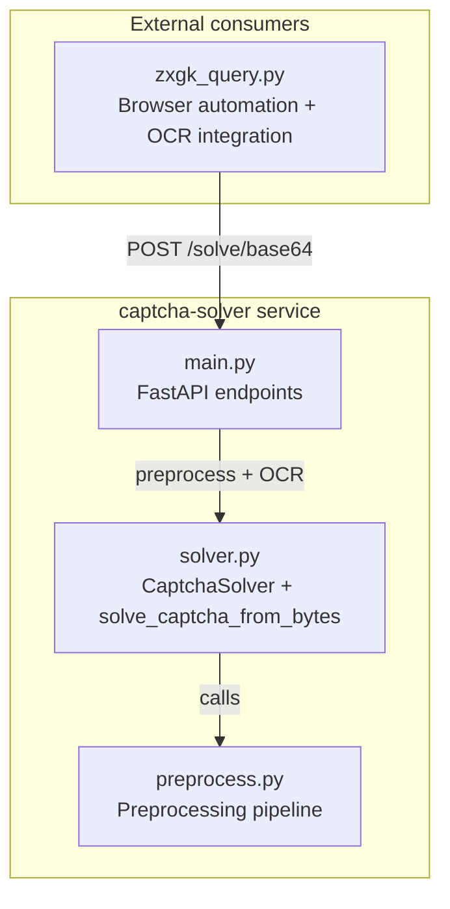
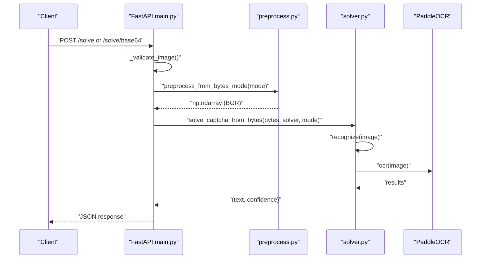
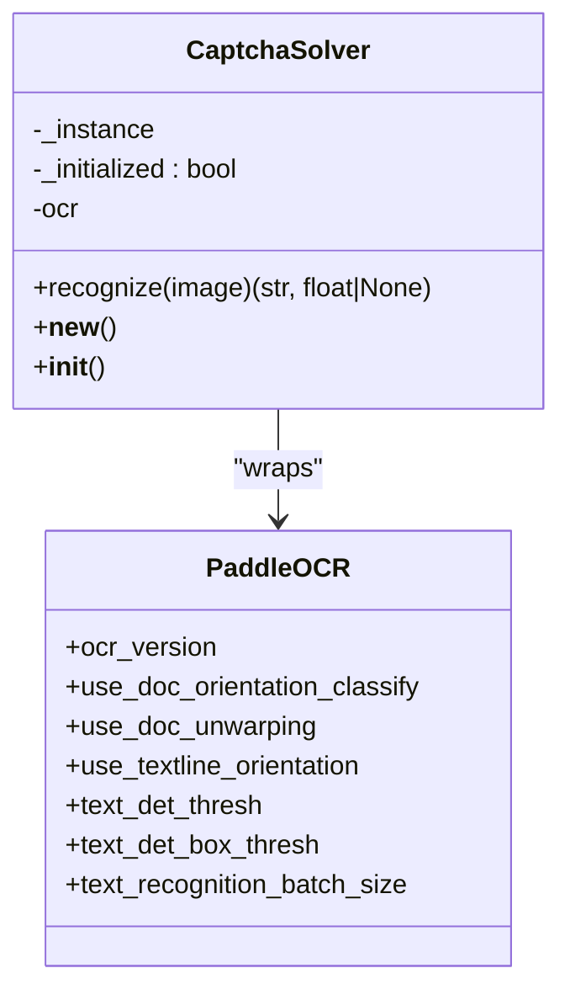
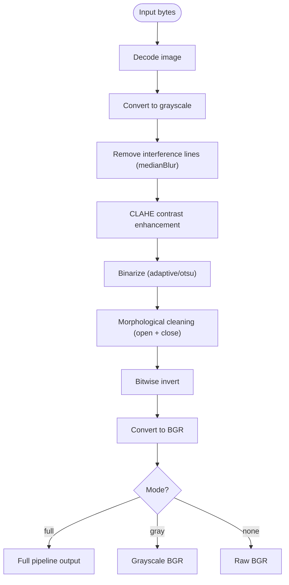
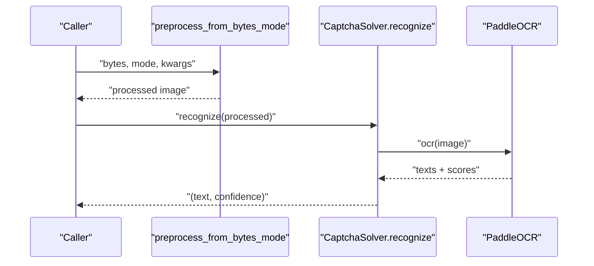
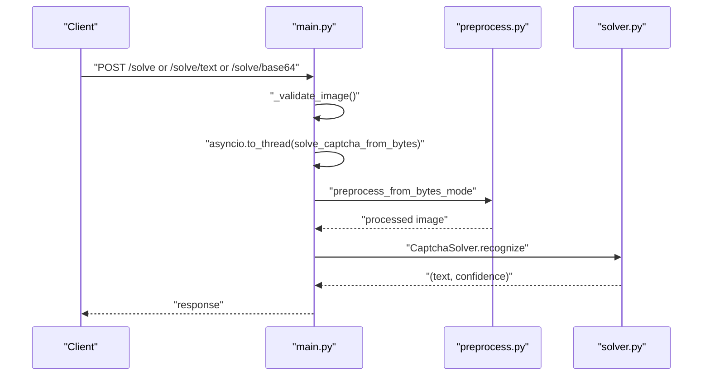
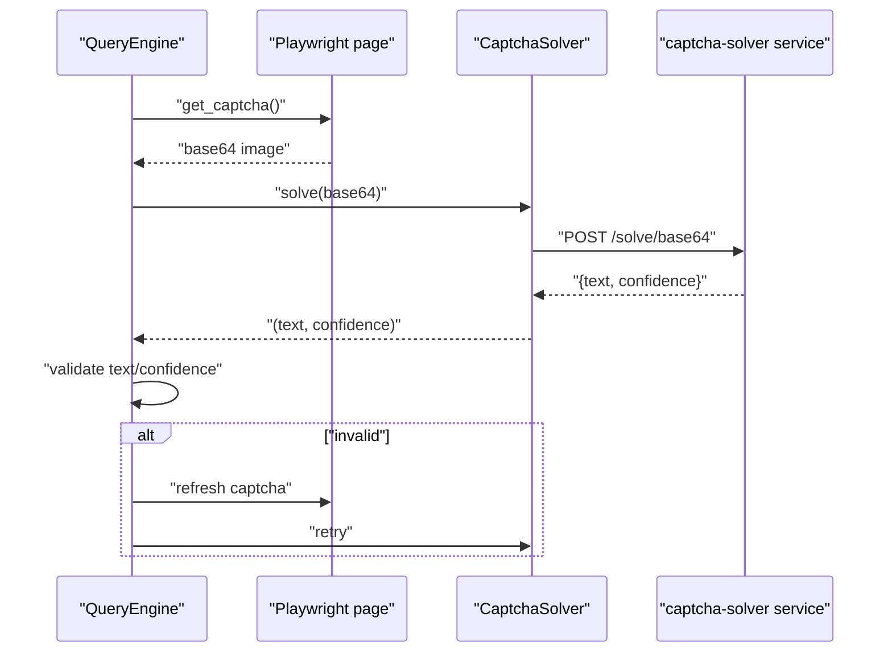
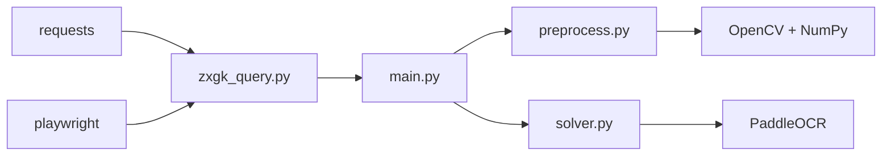

# Solver Implementation

<cite>
**Referenced Files in This Document**
- [main.py](file://captcha-solver/main.py)
- [solver.py](file://captcha-solver/solver.py)
- [preprocess.py](file://captcha-solver/preprocess.py)
- [API.md](file://captcha-solver/API.md)
- [Dockerfile](file://captcha-solver/Dockerfile)
- [docker-compose.yml](file://captcha-solver/docker-compose.yml)
- [requirements.txt](file://captcha-solver/requirements.txt)
- [zxgk_query.py](file://zxgk_query.py)
</cite>

## Table of Contents
1. [Introduction](#introduction)
2. [Project Structure](#project-structure)
3. [Core Components](#core-components)
4. [Architecture Overview](#architecture-overview)
5. [Detailed Component Analysis](#detailed-component-analysis)
6. [Dependency Analysis](#dependency-analysis)
7. [Performance Considerations](#performance-considerations)
8. [Troubleshooting Guide](#troubleshooting-guide)
9. [Conclusion](#conclusion)
10. [Appendices](#appendices)

## Introduction
This document explains the CAPTCHA solver implementation used to automate queries against the China Execution Information Public Service website. It focuses on the solver architecture, PaddleOCR integration, and text extraction algorithms. It documents the solve_captcha_from_bytes function, including confidence threshold validation, retry mechanisms, and error handling strategies. It also covers configuration options for OCR models, preprocessing parameters, and performance tuning, and explains how the solver integrates with the main query system and preprocessing pipeline.

## Project Structure
The solver is implemented as a FastAPI service that exposes three endpoints for CAPTCHA recognition. It delegates preprocessing to a dedicated module and uses PaddleOCR for text recognition. The main query system consumes the solver via HTTP requests.

**Diagram sources**
- [main.py:112-209](file://captcha-solver/main.py#L112-L209)
- [solver.py:71-83](file://captcha-solver/solver.py#L71-L83)
- [preprocess.py:117-130](file://captcha-solver/preprocess.py#L117-L130)
- [zxgk_query.py:328-378](file://zxgk_query.py#L328-L378)

**Section sources**
- [main.py:101-209](file://captcha-solver/main.py#L101-L209)
- [solver.py:8-83](file://captcha-solver/solver.py#L8-L83)
- [preprocess.py:1-130](file://captcha-solver/preprocess.py#L1-L130)
- [API.md:19-91](file://captcha-solver/API.md#L19-L91)

## Core Components
- CaptchaSolver: Singleton wrapper around PaddleOCR with tuned detection thresholds and batch size. It exposes a recognize method that returns cleaned text and average confidence.
- Preprocess pipeline: Provides three modes—full pipeline, grayscale-only, and raw—covering denoising, contrast enhancement, binarization, morphological cleaning, and color conversion.
- solve_captcha_from_bytes: High-level function that selects preprocessing mode, runs preprocessing, and performs OCR via the solver.
- FastAPI service: Exposes endpoints for file upload, pure text return, and base64 input, validates images, logs results, and handles errors.

Key behaviors:
- Confidence threshold validation: The main query system enforces a minimum confidence threshold before accepting OCR results.
- Retry mechanisms: The main query system retries OCR on transient failures and when confidence is too low.
- Error handling: The service wraps exceptions and returns structured responses; the consumer treats unavailable solver as a distinct exit code.

**Section sources**
- [solver.py:8-56](file://captcha-solver/solver.py#L8-L56)
- [solver.py:71-83](file://captcha-solver/solver.py#L71-L83)
- [preprocess.py:42-130](file://captcha-solver/preprocess.py#L42-L130)
- [main.py:71-142](file://captcha-solver/main.py#L71-L142)
- [zxgk_query.py:328-378](file://zxgk_query.py#L328-L378)

## Architecture Overview
The solver service initializes a single PaddleOCR instance at startup and serves multiple recognition requests. Requests are validated, preprocessed according to the selected mode, and passed to the OCR engine. The result is post-processed to extract alphanumeric text and compute average confidence.

**Diagram sources**
- [main.py:112-209](file://captcha-solver/main.py#L112-L209)
- [preprocess.py:117-130](file://captcha-solver/preprocess.py#L117-L130)
- [solver.py:71-83](file://captcha-solver/solver.py#L71-L83)
- [solver.py:34-55](file://captcha-solver/solver.py#L34-L55)

## Detailed Component Analysis

### CaptchaSolver class
CaptchaSolver is a singleton that lazily initializes a PaddleOCR instance with specific parameters optimized for small-size, fine-line CAPTCHAs. It exposes a recognize method that:
- Calls the OCR engine on the preprocessed image.
- Aggregates recognition texts and scores.
- Returns cleaned alphanumeric text and average confidence, or empty text with no confidence if nothing is detected.

**Diagram sources**
- [solver.py:8-56](file://captcha-solver/solver.py#L8-L56)

**Section sources**
- [solver.py:8-56](file://captcha-solver/solver.py#L8-L56)

### Preprocessing pipeline
The preprocessing module offers three modes:
- full: Complete pipeline with median blur, CLAHE contrast enhancement, adaptive thresholding, morphological cleaning, bitwise inversion, and BGR conversion.
- gray: Grayscale only, preserving original resolution and avoiding aggressive filtering.
- none: Raw BGR image without modifications.

Parameters for the full pipeline include kernel sizes, CLAHE clip limit/tile size, adaptive threshold block size and constant, and morphological kernels.

**Diagram sources**
- [preprocess.py:86-130](file://captcha-solver/preprocess.py#L86-L130)

**Section sources**
- [preprocess.py:42-130](file://captcha-solver/preprocess.py#L42-L130)

### solve_captcha_from_bytes function
This function orchestrates preprocessing and OCR:
- Selects preprocessing mode via preprocess_from_bytes_mode.
- Calls the solver’s recognize method.
- Returns the recognized text and confidence.

It is invoked by FastAPI endpoints and the main query system.

**Diagram sources**
- [solver.py:71-83](file://captcha-solver/solver.py#L71-L83)
- [preprocess.py:117-130](file://captcha-solver/preprocess.py#L117-L130)
- [solver.py:34-55](file://captcha-solver/solver.py#L34-L55)

**Section sources**
- [solver.py:71-83](file://captcha-solver/solver.py#L71-L83)

### FastAPI service and endpoints
The service defines:
- Health checks and root endpoint.
- POST /solve: multipart upload returning JSON with success, text, confidence, and elapsed time.
- POST /solve/text: multipart upload returning plain text or JSON on error.
- POST /solve/base64: JSON input with base64 image and optional preprocess mode.

Endpoints validate image type, size, and dimensions, then delegate to solve_captcha_from_bytes. Errors are logged and returned as structured responses.

**Diagram sources**
- [main.py:112-209](file://captcha-solver/main.py#L112-L209)
- [preprocess.py:117-130](file://captcha-solver/preprocess.py#L117-L130)
- [solver.py:71-83](file://captcha-solver/solver.py#L71-L83)

**Section sources**
- [main.py:101-209](file://captcha-solver/main.py#L101-L209)
- [API.md:19-91](file://captcha-solver/API.md#L19-L91)

### Integration with main query system
The main query system (zxgk_query.py) integrates the solver as follows:
- Health-check ensures the solver is reachable.
- Extracts a CAPTCHA image from the target page and sends it to the solver via POST /solve/base64.
- Applies confidence threshold validation and retry logic when results are empty or confidence is too low.
- Treats solver unavailability as a distinct exit code.

**Diagram sources**
- [zxgk_query.py:328-378](file://zxgk_query.py#L328-L378)
- [main.py:173-209](file://captcha-solver/main.py#L173-L209)

**Section sources**
- [zxgk_query.py:328-378](file://zxgk_query.py#L328-L378)
- [zxgk_query.py:409-482](file://zxgk_query.py#L409-L482)

## Dependency Analysis
The solver service depends on:
- FastAPI and Uvicorn for the HTTP server.
- OpenCV and NumPy for image processing.
- Pillow for image decoding helpers.
- PaddleOCR for text detection and recognition.

The main query system depends on:
- Requests for HTTP communication with the solver.
- Playwright for browser automation and CAPTCHA capture.

**Diagram sources**
- [requirements.txt:1-9](file://captcha-solver/requirements.txt#L1-L9)
- [zxgk_query.py:328-378](file://zxgk_query.py#L328-L378)
- [main.py:10-16](file://captcha-solver/main.py#L10-L16)

**Section sources**
- [requirements.txt:1-9](file://captcha-solver/requirements.txt#L1-L9)
- [Dockerfile:1-22](file://captcha-solver/Dockerfile#L1-L22)
- [docker-compose.yml:1-13](file://captcha-solver/docker-compose.yml#L1-L13)

## Performance Considerations
- Model initialization: The service initializes PaddleOCR once at startup; subsequent requests reuse the model instance.
- Preprocessing mode selection:
  - gray mode reduces computational overhead and can improve reliability for small-size, fine-line CAPTCHAs.
  - full mode increases accuracy with contrast enhancement and morphological cleaning but costs more CPU.
- Batch size and detection thresholds: The solver sets OCR thresholds and batch size tuned for speed and stability.
- Concurrency: Requests are offloaded to threads to prevent blocking the event loop.
- Container memory limits: The Docker configuration caps memory to constrain resource usage.

[No sources needed since this section provides general guidance]

## Troubleshooting Guide
Common issues and remedies:
- Empty or low-confidence results:
  - The main query system ignores empty text or confidence below a threshold and refreshes the CAPTCHA.
  - Adjust preprocessing mode to gray or none depending on image characteristics.
- Unavailable solver:
  - The main query system treats solver downtime as a distinct exit code and aborts the current phase.
  - Verify health endpoint availability and container logs.
- Image validation errors:
  - Ensure uploaded images are under size and dimension limits and are valid image files.
- Model download and readiness:
  - The Dockerfile triggers model download at container startup; ensure network access and sufficient disk space.

**Section sources**
- [main.py:71-88](file://captcha-solver/main.py#L71-L88)
- [main.py:134-141](file://captcha-solver/main.py#L134-L141)
- [API.md:86-91](file://captcha-solver/API.md#L86-L91)
- [Dockerfile:19-21](file://captcha-solver/Dockerfile#L19-L21)

## Conclusion
The CAPTCHA solver provides a robust, configurable OCR pipeline tailored for small-size, fine-line CAPTCHAs. Its integration with the main query system includes strict confidence validation and retry logic to handle transient failures. By tuning preprocessing modes and leveraging the solver’s singleton model instance, the system achieves reliable and efficient recognition suitable for automated querying.

[No sources needed since this section summarizes without analyzing specific files]

## Appendices

### Configuration Options
- Environment variables (service):
  - PORT, ALLOWED_ORIGINS, LOG_LEVEL, PADDLE_PDX_DISABLE_MODEL_SOURCE_CHECK.
- Preprocessing parameters (full pipeline):
  - median_kernel, clahe_clip, clahe_tile, adaptive_block, adaptive_c, binarize_method, morph_open_kernel, morph_close_kernel.
- Endpoint parameters:
  - preprocess mode: full, gray, none.

**Section sources**
- [API.md:77-91](file://captcha-solver/API.md#L77-L91)
- [preprocess.py:42-102](file://captcha-solver/preprocess.py#L42-L102)
- [main.py:113-118](file://captcha-solver/main.py#L113-L118)
- [main.py:188-190](file://captcha-solver/main.py#L188-L190)

### Example Workflows
- Solver initialization:
  - The service constructs a singleton CaptchaSolver during startup lifecycle.
- Image processing:
  - Choose preprocess mode based on image quality; gray often improves reliability for small CAPTCHAs.
- Result interpretation:
  - Cleaned alphanumeric text and confidence are returned; empty text indicates no detection.

**Section sources**
- [main.py:37-44](file://captcha-solver/main.py#L37-L44)
- [solver.py:19-32](file://captcha-solver/solver.py#L19-L32)
- [solver.py:52-55](file://captcha-solver/solver.py#L52-L55)