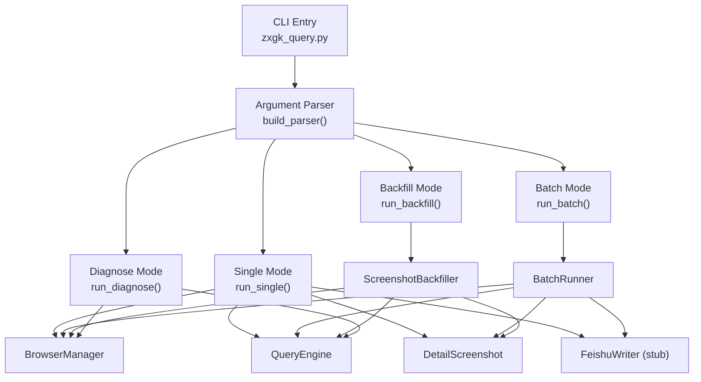
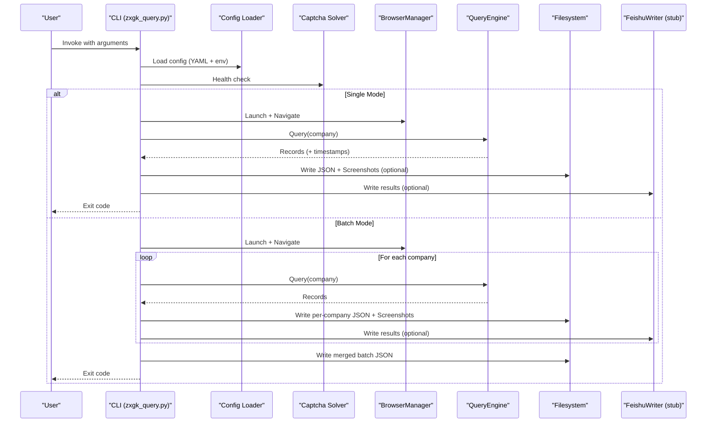
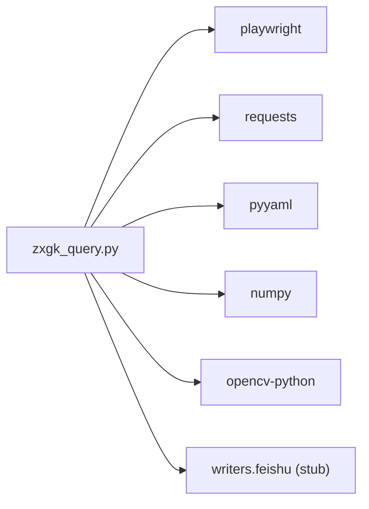

# CLI Interface Reference

<cite>
**Referenced Files in This Document**
- [zxgk_query.py](file://zxgk_query.py)
- [README.md](file://README.md)
- [SKILL.md](file://SKILL.md)
- [config/zxgk.example.yaml](file://config/zxgk.example.yaml)
- [config/companies.example.txt](file://config/companies.example.txt)
- [cron_daily_query.sh](file://cron_daily_query.sh)
- [diagnose_subsites.py](file://diagnose_subsites.py)
- [smoke_test.sh](file://smoke_test.sh)
</cite>

## Table of Contents
1. [Introduction](#introduction)
2. [Project Structure](#project-structure)
3. [Core Components](#core-components)
4. [Architecture Overview](#architecture-overview)
5. [Detailed Component Analysis](#detailed-component-analysis)
6. [Dependency Analysis](#dependency-analysis)
7. [Performance Considerations](#performance-considerations)
8. [Troubleshooting Guide](#troubleshooting-guide)
9. [Conclusion](#conclusion)
10. [Appendices](#appendices)

## Introduction
This document provides a comprehensive CLI interface reference for the main command-line tool that automates querying China Execution Information Public Network (zxgk.court.gov.cn) across three subsites: “Executed Person”, “Dishonest Executed Person”, and “Restricted Consumption Personnel”. It covers all command-line arguments, modes, batch processing, output formats, return codes, error handling, configuration, environment variables, parameter validation, input sanitization, and automation best practices.

## Project Structure
The CLI tool is implemented as a single Python module with supporting scripts and configuration templates. The primary entry point is the main script that parses arguments, orchestrates browser automation, performs OCR-based CAPTCHA solving, and writes results to disk and optionally to cloud storage.

**Diagram sources**
- [zxgk_query.py:1514-1612](file://zxgk_query.py#L1514-L1612)
- [zxgk_query.py:1385-1510](file://zxgk_query.py#L1385-L1510)

**Section sources**
- [zxgk_query.py:1514-1612](file://zxgk_query.py#L1514-L1612)
- [README.md:15-77](file://README.md#L15-L77)

## Core Components
- CLI Argument Parser: Defines all supported options, modes, and validation rules.
- Single Query Runner: Executes a single company search with optional screenshots and Feishu writing.
- Batch Runner: Processes a list of companies with retry, WAF resilience, progress tracking, and optional Feishu writing.
- Backfill Runner: Re-queries missing screenshots for previously collected records.
- Diagnostics: Health checks for OCR service, WAF readiness, and environment.
- Configuration Loader: Loads YAML configuration with environment variable expansion.
- Company List Loader: Supports both YAML and plain-text company lists.

**Section sources**
- [zxgk_query.py:1514-1612](file://zxgk_query.py#L1514-L1612)
- [zxgk_query.py:116-154](file://zxgk_query.py#L116-L154)
- [zxgk_query.py:139-154](file://zxgk_query.py#L139-L154)

## Architecture Overview
The CLI integrates browser automation, OCR, and optional cloud storage. It supports multiple operational modes and robust error handling with retries and cooldowns.

**Diagram sources**
- [zxgk_query.py:1385-1510](file://zxgk_query.py#L1385-L1510)
- [zxgk_query.py:1065-1197](file://zxgk_query.py#L1065-L1197)

## Detailed Component Analysis

### CLI Arguments and Modes
- Global options
  - --config PATH: Configuration file path (default: config/zxgk.yaml)
  - --verbose/-v: Enable debug logging
- Single query mode
  - --company NAME: Company name (required for single mode)
  - --subsite {zhixing,shixin,xgl}: Target subsite (default: zhixing)
  - --mode {text-only,screenshot,full,backfill}: Operation mode
  - --no-screenshots: Disable screenshots (effective only in screenshot/full modes)
  - --feishu: Enable writing to Feishu (stub in current version)
  - --captcha-server URL: Override OCR service URL
  - --output-dir DIR: Output directory for JSON and screenshots
  - --batch-id ID: Batch identifier (used in backfill/full modes)
  - --no-wait: Skip waiting for Feishu computation (full mode)
  - --max-per-session INT: Max screenshots per session (default: 10)
  - --resume: Not applicable in single mode
- Batch mode
  - --batch PATH: Company list file (YAML or plain text)
  - --mode {text-only,screenshot,full,backfill}: Operation mode
  - --feishu: Enable writing to Feishu (stub in current version)
  - --resume: Enable checkpoint resume
  - --output PATH: Merge batch JSON output path
  - --batch-id ID: Batch identifier (used in backfill/full modes)
  - --no-wait: Skip waiting for Feishu computation (full mode)
  - --max-per-session INT: Max screenshots per session (default: 10)
  - --captcha-server URL: Override OCR service URL
  - --output-dir DIR: Output directory for JSON and screenshots
- Backfill mode
  - --mode backfill: Requires --batch-id
  - --batch-id ID: Must match {YYYYMMDD}-{subsite}
  - --max-per-session INT: Max screenshots per session (default: 10)
  - --captcha-server URL: Override OCR service URL
  - --output-dir DIR: Output directory for JSON and screenshots
- Diagnose mode
  - --diagnose: Run diagnostics for OCR, WAF, and environment
  - --subsite {zhixing,shixin,xgl}: Subsite to diagnose

Validation rules
- Single mode requires --company and disallows --batch
- Batch mode requires --batch and disallows --company
- --mode backfill requires --batch-id
- --mode full implies --feishu
- --company and --batch cannot be used together

Output formats
- Single mode: Writes a single JSON file containing records and optional screenshot mapping
- Batch mode: Writes per-company JSON files and a merged batch JSON file
- Screenshots: Captured PNG images saved under output/screenshots (unless disabled)

Return codes
- 0: Success (results found)
- 1: No results found
- 2: WAF blocked
- 3: OCR service unavailable
- 4: Configuration/argument error

**Section sources**
- [zxgk_query.py:1514-1612](file://zxgk_query.py#L1514-L1612)
- [README.md:87-96](file://README.md#L87-L96)

### Configuration File Format
The configuration file is a YAML document with the following sections:
- captcha_server: URL of the OCR service (default: http://localhost:8001)
- browser: headless (bool), viewport [width,height]
- waf: captcha_max_retries, cooldown_on_block_sec, company_interval_sec, screenshot_interval_sec, max_consecutive_fails
- screenshots: enabled (bool)
- storage: screenshots storage mode (file/blob/both)
- subsites: zhixing, shixin, xgl with name, css_selector, extra_wait_sec
- feishu: app_token (supports ${ENV_VAR}), raw_table and detail_table field mappings, dedup_options, batch_field_id
- output: dir, screenshots_dir
- companies: list of company names (example included)

Environment variable expansion
- Values starting with ${VAR} are expanded using environment variables; defaults to empty string if unset.

Example template
- See [config/zxgk.example.yaml](file://config/zxgk.example.yaml)

**Section sources**
- [config/zxgk.example.yaml:1-103](file://config/zxgk.example.yaml#L1-L103)
- [zxgk_query.py:116-137](file://zxgk_query.py#L116-L137)

### Environment Variables
- FEISHU_APP_TOKEN: Optional; if set, enables Feishu integration (currently stubbed). The configuration supports ${FEISHU_APP_TOKEN} expansion.

**Section sources**
- [README.md:29-34](file://README.md#L29-L34)
- [config/zxgk.example.yaml:48](file://config/zxgk.example.yaml#L48)

### Parameter Validation and Input Sanitization
- Company list loading supports both YAML arrays and plain-text files; comments and blank lines are ignored in plain-text mode.
- Mode validation ensures mutually exclusive options and required arguments per mode.
- Batch ID parsing enforces {YYYYMMDD}-{subsite} format for backfill mode.
- Proxy environment variables are cleaned before launching the browser to reduce detection signals.
- Input sanitization for filenames and directory names prevents unsafe characters.

**Section sources**
- [zxgk_query.py:139-154](file://zxgk_query.py#L139-L154)
- [zxgk_query.py:1514-1612](file://zxgk_query.py#L1514-L1612)
- [zxgk_query.py:111-115](file://zxgk_query.py#L111-L115)

### Error Handling and Recovery Strategies
- WAF blocking: Automatic retries with cooldown; raises a dedicated exception when blocked.
- OCR failures: Retries with refreshed CAPTCHA; low-confidence OCR prompts refresh.
- Browser crashes: Restart browser after consecutive failures; maintains progress checkpoints.
- Resume capability: Batch mode tracks completed companies to support resuming interrupted runs.
- Diagnostics mode: Validates OCR health, WAF readiness, and environment dependencies.

**Section sources**
- [zxgk_query.py:99-107](file://zxgk_query.py#L99-L107)
- [zxgk_query.py:1157-1191](file://zxgk_query.py#L1157-L1191)
- [zxgk_query.py:1321-1379](file://zxgk_query.py#L1321-L1379)

### Practical Usage Patterns

#### Single company search
- Basic single query
  - python3 zxgk_query.py --company "XX公司"
- Single query with text-only mode and Feishu
  - python3 zxgk_query.py --company "XX公司" --mode text-only --feishu
- Single query with full mode and Feishu
  - python3 zxgk_query.py --company "XX公司" --mode full --feishu

#### Batch processing
- Batch with default subsite (zhixing)
  - python3 zxgk_query.py --batch config/companies.txt --feishu
- Batch with full mode and resume
  - python3 zxgk_query.py --batch config/companies.txt --mode full --feishu --resume
- Batch with explicit subsite and output path
  - python3 zxgk_query.py --batch config/companies.txt --subsite zhixing --mode text-only --output output/batch.json

#### Backfill mode
- Backfill screenshots for a previous batch
  - python3 zxgk_query.py --mode backfill --batch-id "20260510-zhixing" --feishu

#### Diagnostics
- Run diagnostics to check OCR and WAF readiness
  - python3 zxgk_query.py --diagnose

**Section sources**
- [README.md:63-77](file://README.md#L63-L77)
- [zxgk_query.py:1519-1528](file://zxgk_query.py#L1519-L1528)

### Automation Scripts and Best Practices
- Daily orchestration script
  - cron_daily_query.sh: Runs all three subsites, writes SQLite backups, optionally writes to Feishu, waits for Feishu computation, and performs backfill.
- Smoke testing
  - smoke_test.sh: Verifies Python/Shell syntax, configuration, environment variables, and batch JSON structure.
- Diagnostics
  - diagnose_subsites.py: Probes DOM structure and pagination across subsites.

Best practices
- Always ensure OCR service is healthy before running queries.
- Use --mode full for end-to-end pipeline; otherwise use --mode text-only for quick checks.
- Use --resume for long-running batches to recover from interruptions.
- Clean proxy environment variables before launching the browser.
- Monitor exit codes to drive automation decisions.

**Section sources**
- [cron_daily_query.sh:1-246](file://cron_daily_query.sh#L1-L246)
- [smoke_test.sh:1-155](file://smoke_test.sh#L1-L155)
- [diagnose_subsites.py:1-429](file://diagnose_subsites.py#L1-L429)

## Dependency Analysis
The CLI depends on:
- Playwright for browser automation and stealth
- Requests for OCR service communication
- PyYAML for configuration parsing
- NumPy/OpenCV for screenshot cropping
- Optional Feishu writer module for cloud storage

**Diagram sources**
- [zxgk_query.py:36-42](file://zxgk_query.py#L36-L42)

**Section sources**
- [zxgk_query.py:36-42](file://zxgk_query.py#L36-L42)

## Performance Considerations
- Headless browser reduces overhead; adjust viewport and concurrency based on hardware.
- WAF parameters (intervals, retries, cooldowns) balance speed and reliability.
- Screenshots are captured with configurable intervals to avoid rate limits.
- Batch mode writes intermediate files; ensure sufficient disk space and I/O throughput.

## Troubleshooting Guide
Common issues and resolutions
- OCR service unavailable
  - Verify health endpoint and port availability; cron_daily_query.sh attempts Docker and fallback venv startup.
- WAF blocked
  - Wait for cooldown period; diagnostics can confirm block conditions.
- No results found
  - Exit code 1 indicates no matches; verify company name spelling and subsite selection.
- Configuration/argument errors
  - Exit code 4 indicates invalid combination or missing required arguments.
- Browser crashes or orphaned processes
  - Use cleanup routines; restart browser after consecutive failures.
- Feishu integration
  - If FEISHU_APP_TOKEN is not set, Feishu writing is skipped; configure and authenticate lark-cli if needed.

**Section sources**
- [README.md:87-96](file://README.md#L87-L96)
- [cron_daily_query.sh:48-96](file://cron_daily_query.sh#L48-L96)
- [smoke_test.sh:106-114](file://smoke_test.sh#L106-L114)

## Conclusion
The CLI provides a robust, configurable, and resilient interface for querying China Execution Information Public Network across multiple subsites. It supports single and batch modes, diagnostics, and optional cloud storage integration. Proper configuration, environment preparation, and adherence to validation rules ensure reliable automation.

## Appendices

### Appendix A: Example Configuration and Company Lists
- Configuration template: [config/zxgk.example.yaml](file://config/zxgk.example.yaml)
- Company list template: [config/companies.example.txt](file://config/companies.example.txt)

**Section sources**
- [config/zxgk.example.yaml:1-103](file://config/zxgk.example.yaml#L1-L103)
- [config/companies.example.txt:1-7](file://config/companies.example.txt#L1-L7)