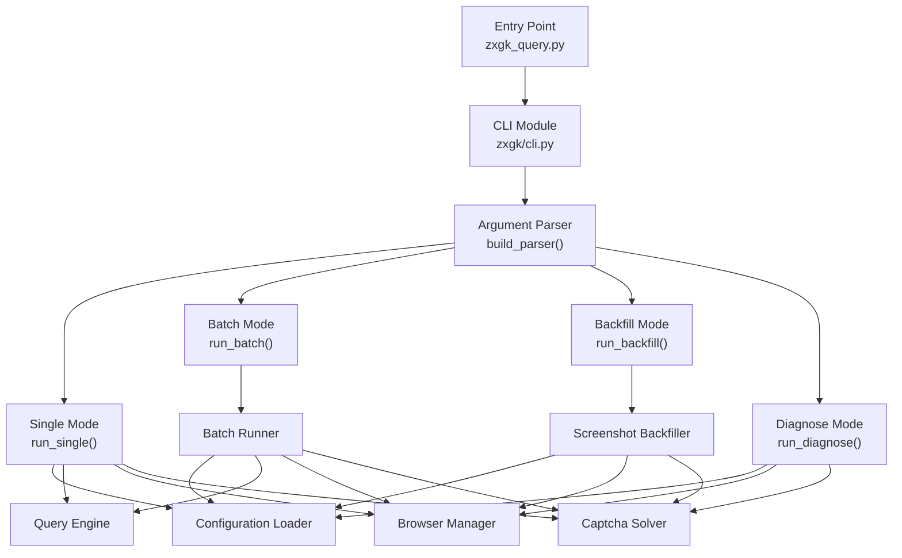
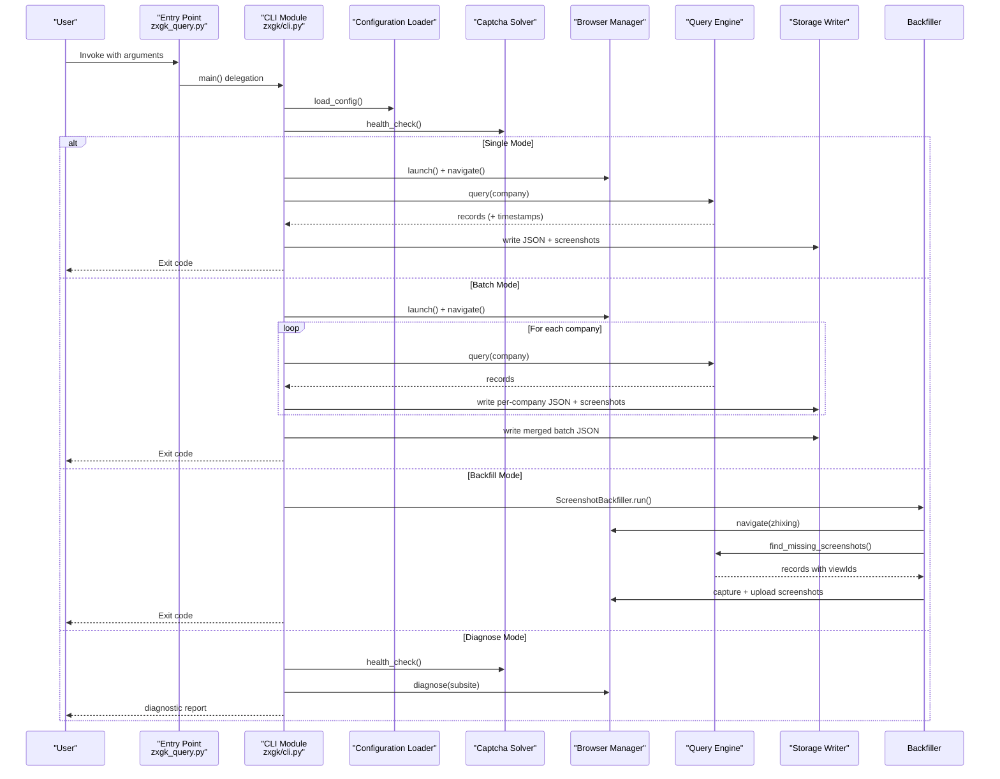
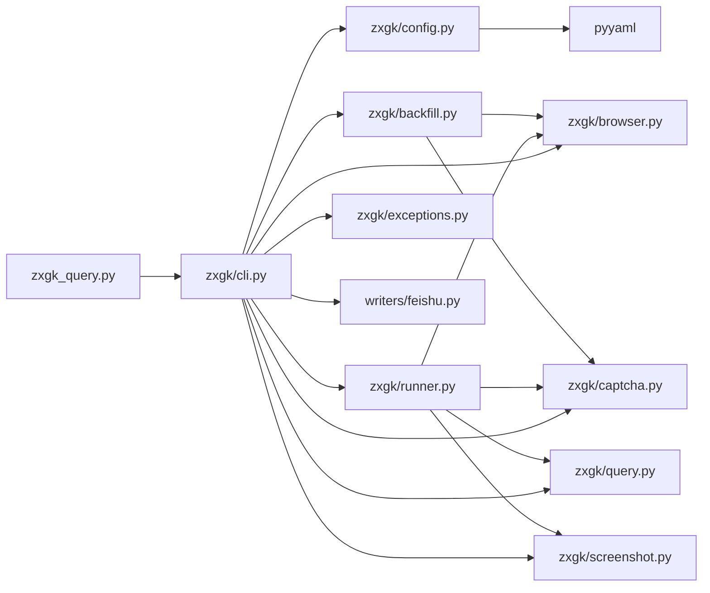

# CLI Interface Reference

<cite>
**Referenced Files in This Document**
- [zxgk/cli.py](file://zxgk/cli.py)
- [zxgk_query.py](file://zxgk_query.py)
- [README.md](file://README.md)
- [config/zxgk.example.yaml](file://config/zxgk.example.yaml)
- [config/companies.example.txt](file://config/companies.example.txt)
- [cron_daily_query.sh](file://cron_daily_query.sh)
- [writers/feishu.py](file://writers/feishu.py)
- [zxgk/config.py](file://zxgk/config.py)
- [zxgk/runner.py](file://zxgk/runner.py)
- [zxgk/backfill.py](file://zxgk/backfill.py)
</cite>

## Update Summary
**Changes Made**
- Complete rewrite of CLI architecture with modular design in zxgk/cli.py
- New structured command-line interaction with validation, error handling, and output formatting
- Enhanced operational modes including single queries, batch processing, backfill operations, and diagnostic functions
- Improved argument parsing with comprehensive validation rules
- Streamlined entry point through zxgk_query.py delegating to modular CLI

## Table of Contents
1. [Introduction](#introduction)
2. [Project Structure](#project-structure)
3. [Core Components](#core-components)
4. [Architecture Overview](#architecture-overview)
5. [Detailed Component Analysis](#detailed-component-analysis)
6. [Dependency Analysis](#dependency-analysis)
7. [Performance Considerations](#performance-considerations)
8. [Troubleshooting Guide](#troubleshooting-guide)
9. [Conclusion](#conclusion)
10. [Appendices](#appendices)

## Introduction
This document provides a comprehensive CLI interface reference for the main command-line tool that automates querying China Execution Information Public Network (zxgk.court.gov.cn) across three subsites: "Executed Person", "Dishonest Executed Person", and "Restricted Consumption Personnel". The CLI has been completely rewritten with a modular architecture featuring 320 lines of new code in zxgk/cli.py, introducing structured command-line interaction with validation, error handling, and output formatting.

## Project Structure
The CLI tool now follows a modular architecture with clear separation of concerns. The main entry point delegates to a centralized CLI module that orchestrates different operational modes with robust validation and error handling.



**Diagram sources**
- [zxgk_query.py:21-26](file://zxgk_query.py#L21-L26)
- [zxgk/cli.py:225-321](file://zxgk/cli.py#L225-L321)

**Section sources**
- [zxgk_query.py:21-26](file://zxgk_query.py#L21-L26)
- [zxgk/cli.py:225-321](file://zxgk/cli.py#L225-L321)

## Core Components
- **Centralized CLI Module**: The new modular architecture in zxgk/cli.py provides structured command-line interaction with comprehensive validation and error handling.
- **Argument Parser**: Enhanced argument parsing with validation rules, mode-specific options, and comprehensive help text.
- **Single Query Runner**: Executes individual company searches with optional screenshots and cloud storage integration.
- **Batch Runner**: Processes company lists with retry logic, WAF resilience, progress tracking, and optional cloud storage integration.
- **Backfill Runner**: Re-queries missing screenshots for previously collected records using sophisticated Feishu integration.
- **Diagnostic System**: Comprehensive health checks for OCR services, WAF readiness, and environment dependencies.
- **Configuration Management**: Centralized configuration loading with environment variable expansion and validation.
- **Company List Processing**: Flexible company list loading supporting both YAML arrays and plain-text formats.

**Section sources**
- [zxgk/cli.py:86-321](file://zxgk/cli.py#L86-L321)
- [zxgk/runner.py:15-278](file://zxgk/runner.py#L15-L278)
- [zxgk/backfill.py:12-296](file://zxgk/backfill.py#L12-L296)

## Architecture Overview
The new modular CLI architecture provides a clean separation of concerns with specialized runners for each operational mode. The system maintains backward compatibility while introducing enhanced validation, error handling, and output formatting capabilities.



**Diagram sources**
- [zxgk/cli.py:281-321](file://zxgk/cli.py#L281-L321)
- [zxgk/cli.py:181-220](file://zxgk/cli.py#L181-L220)

## Detailed Component Analysis

### CLI Arguments and Modes
The new modular CLI introduces comprehensive argument parsing with enhanced validation and mode-specific options:

**Global Options**
- `--config PATH`: Configuration file path (default: config/zxgk.yaml)
- `--verbose/-v`: Enable debug logging

**Mode Selection**
- `--mode {text-only,screenshot,full,backfill}`: Operation mode selector
  - `text-only`: Query + write to raw table only
  - `screenshot`: Default mode - query + immediate screenshots
  - `full`: End-to-end pipeline (Phase A → wait → Phase B)
  - `backfill`: Re-query missing screenshots only

**Single Query Mode Options**
- `--company NAME`: Company name (required for single mode)
- `--subsite {zhixing,shixin,xgl}`: Target subsite (default: zhixing)
- `--no-screenshots`: Disable screenshots (effective only in screenshot/full modes)
- `--feishu`: Enable writing to Feishu (automatically enabled in full mode)
- `--captcha-server URL`: Override OCR service URL
- `--output-dir DIR`: Output directory for JSON and screenshots
- `--batch-id ID`: Batch identifier (used in backfill/full modes)
- `--no-wait`: Skip waiting for Feishu computation (full mode)
- `--max-per-session INT`: Max screenshots per session (default: 10)

**Batch Mode Options**
- `--batch PATH`: Company list file (YAML or plain text)
- `--resume`: Enable checkpoint resume
- `--output PATH`: Merge batch JSON output path
- `--batch-id ID`: Batch identifier (used in backfill/full modes)
- `--max-per-session INT`: Max screenshots per session (default: 10)
- `--captcha-server URL`: Override OCR service URL
- `--output-dir DIR`: Output directory for JSON and screenshots

**Backfill Mode Options**
- `--mode backfill`: Requires --batch-id with {YYYYMMDD}-{subsite} format
- `--batch-id ID`: Must match {YYYYMMDD}-{subsite}
- `--max-per-session INT`: Max screenshots per session (default: 10)
- `--captcha-server URL`: Override OCR service URL
- `--output-dir DIR`: Output directory for JSON and screenshots

**Diagnostic Mode Options**
- `--diagnose`: Run comprehensive diagnostics for OCR, WAF, and environment
- `--subsite {zhixing,shixin,xgl}`: Subsite to diagnose

**Enhanced Validation Rules**
- Single mode: Requires --company, disallows --batch
- Batch mode: Requires --batch, disallows --company
- Backfill mode: Requires --batch-id with {YYYYMMDD}-{subsite} format
- Full mode: Automatically enables --feishu
- Mode conflicts: --company and --batch cannot be used together

**Output Formats**
- Single mode: Writes individual JSON files with embedded screenshot mappings
- Batch mode: Writes per-company JSON files and merged batch JSON
- Screenshots: Captured PNG images with automatic cropping and cleanup
- Backfill mode: Re-queries missing screenshots and uploads to Feishu

**Return Codes**
- `0`: Success (results found)
- `1`: No results found
- `2`: WAF blocked
- `3`: OCR service unavailable
- `4`: Configuration/argument error

**Section sources**
- [zxgk/cli.py:225-321](file://zxgk/cli.py#L225-L321)
- [zxgk/cli.py:25-83](file://zxgk/cli.py#L25-L83)

### Configuration File Format
The configuration system has been enhanced with improved validation and environment variable expansion:

**YAML Configuration Structure**
```yaml
# OCR Service Configuration
captcha_server: "http://localhost:8001"

# Browser Configuration
browser:
  headless: true
  viewport: [1920, 1080]

# WAF Protection Parameters
waf:
  captcha_max_retries: 8
  cooldown_on_block_sec: 300
  company_interval_sec: 30
  screenshot_interval_sec: 2
  max_consecutive_fails: 3

# Screenshot Configuration
screenshots:
  enabled: true

# Storage Mode
storage:
  screenshots: file

# Subsite Configuration
subsites:
  zhixing:
    name: "被执行人信息"
    css_selector: "div.bzxrxx_nor"
    extra_wait_sec: 5
  shixin:
    name: "失信被执行人"
    css_selector: "div.sxbzxr_nor"
    extra_wait_sec: 5
  xgl:
    name: "限制消费人员"
    css_selector: "div.xzxfry_nor"
    extra_wait_sec: 5

# Feishu Integration
feishu:
  app_token: "${FEISHU_APP_TOKEN}"
  raw_table:
    id: "tbl_xxxxxxxxxxxxx"
    fields:
      auto_key: "fld_xxxxx"
      name: "fld_xxxxx"
      case_no: "fld_xxxxx"
      view_id: "fld_xxxxx"
      file_date: "fld_xxxxx"
      sync_date: "fld_xxxxx"
      is_new: "fld_xxxxx"
      is_duplicate: "fld_xxxxx"
      case_main_link: "fld_xxxxx"
      xgl_link: "fld_xxxxx"
      shixin_link: "fld_xxxxx"
  detail_table:
    id: "tbl_xxxxxxxxxxxxx"
    fields:
      auto_key: "fld_xxxxx"
      case_no_extract: "fld_xxxxx"
      name_extract: "fld_xxxxx"
      case_no_lookup: "fld_xxxxx"
      name_lookup: "fld_xxxxx"
      file_date_lookup: "fld_xxxxx"
      org_code: "fld_xxxxx"
      court: "fld_xxxxx"
      amount: "fld_xxxxx"
      amount_yuan: "fld_xxxxx"
      screenshot: "fld_xxxxx"
      ai_result: "fld_xxxxx"
      is_shixin: "fld_xxxxx"
      shixin_date: "fld_xxxxx"
      is_xgl: "fld_xxxxx"
      xgl_date: "fld_xxxxx"
      final_status: "fld_xxxxx"
      verify_status: "fld_xxxxx"
      cancel_date: "fld_xxxxx"
      block_reason: "fld_xxxxx"
      is_duplicate: "fld_xxxxx"
      nominal_type: "fld_xxxxx"
      raw_link: "fld_xxxxx"
    dedup_options:
      keep: "opt_xxxxx"
      duplicate: "opt_xxxxx"

# Output Directories
output:
  dir: "output"
  screenshots_dir: "output/screenshots"

# Company List Template
companies:
  - "示例公司A有限公司"
  - "示例公司B有限公司"
  - "示例公司C有限公司"
```

**Environment Variable Expansion**
Values starting with `${VAR}` are expanded using environment variables; defaults to empty string if unset. The system supports nested expansion in dictionaries and lists.

**Section sources**
- [config/zxgk.example.yaml:1-103](file://config/zxgk.example.yaml#L1-L103)
- [zxgk/config.py:49-104](file://zxgk/config.py#L49-L104)

### Environment Variables
The system supports comprehensive environment variable configuration:

**Primary Environment Variables**
- `FEISHU_APP_TOKEN`: Required for Feishu integration; enables cloud storage functionality
- `HTTP_PROXY`, `HTTPS_PROXY`, `ALL_PROXY`: Proxy configuration for network requests
- `PLAYWRIGHT_*`: Browser automation environment variables

**Configuration Expansion**
Environment variables are automatically expanded in configuration files using the `${VAR}` syntax. The system handles nested expansions and provides sensible defaults for unset variables.

**Section sources**
- [config/zxgk.example.yaml:47-48](file://config/zxgk.example.yaml#L47-L48)
- [zxgk/config.py:61-69](file://zxgk/config.py#L61-L69)

### Parameter Validation and Input Sanitization
The new modular CLI introduces comprehensive input validation and sanitization:

**Input Validation**
- Company list validation supports both YAML arrays and plain-text files
- Mode-specific validation ensures mutually exclusive options
- Batch ID parsing enforces {YYYYMMDD}-{subsite} format for backfill mode
- Subsite validation restricts to predefined values
- File path validation prevents directory traversal attacks

**Input Sanitization**
- Company names are sanitized to prevent filename injection
- Directory names are validated to prevent unsafe characters
- Output paths are normalized and secured
- Configuration values are type-checked and validated

**Error Handling**
- Comprehensive error messages with actionable guidance
- Graceful degradation when optional features are unavailable
- Detailed logging for debugging and troubleshooting

**Section sources**
- [zxgk/cli.py:294-321](file://zxgk/cli.py#L294-L321)
- [zxgk/config.py:73-88](file://zxgk/config.py#L73-L88)

### Error Handling and Recovery Strategies
The modular CLI provides robust error handling with multiple recovery strategies:

**WAF Blocking Recovery**
- Automatic retry with exponential backoff
- Configurable maximum retry attempts
- Graceful degradation to alternative approaches
- Detailed logging of blocking events

**OCR Service Failures**
- Health check validation before operation
- Automatic service restart detection
- Fallback to alternative OCR solutions
- Retry logic with configurable timeouts

**Browser Automation Errors**
- Session recovery and restart capabilities
- Memory leak prevention and cleanup
- Process termination and resource cleanup
- Graceful shutdown procedures

**Data Persistence**
- Checkpoint systems for batch operations
- Progress tracking and resume capability
- Transaction-safe file operations
- Atomic write operations for data integrity

**Diagnostics and Monitoring**
- Comprehensive health check systems
- Real-time status monitoring
- Automated alerting for critical failures
- Performance metrics collection

**Section sources**
- [zxgk/cli.py:159-163](file://zxgk/cli.py#L159-L163)
- [zxgk/runner.py:116-136](file://zxgk/runner.py#L116-L136)
- [zxgk/backfill.py:132-137](file://zxgk/backfill.py#L132-L137)

### Practical Usage Patterns

#### Single Company Search
Basic single query operations with comprehensive options:

**Simple Single Query**
```bash
python3 zxgk_query.py --company "XX公司"
```

**Text-Only Mode with Feishu**
```bash
python3 zxgk_query.py --company "XX公司" --mode text-only --feishu
```

**Full Pipeline with Feishu**
```bash
python3 zxgk_query.py --company "XX公司" --mode full --feishu
```

**Custom Configuration**
```bash
python3 zxgk_query.py --company "XX公司" --config custom.yaml --output-dir results/
```

#### Batch Processing
Comprehensive batch operations with advanced features:

**Basic Batch Processing**
```bash
python3 zxgk_query.py --batch config/companies.txt --feishu
```

**Full Pipeline with Resume**
```bash
python3 zxgk_query.py --batch config/companies.txt --mode full --feishu --resume
```

**Custom Subsite and Output**
```bash
python3 zxgk_query.py --batch config/companies.txt --subsite zhixing --mode text-only --output output/batch.json
```

**Advanced Batch Configuration**
```bash
python3 zxgk_query.py --batch companies.yaml --mode screenshot --max-per-session 15 --output-dir results/
```

#### Backfill Operations
Sophisticated screenshot backfill operations:

**Backfill Missing Screenshots**
```bash
python3 zxgk_query.py --mode backfill --batch-id "20260510-zhixing" --feishu
```

**Custom Backfill Configuration**
```bash
python3 zxgk_query.py --mode backfill --batch-id "20260510-zhixing" --max-per-session 20 --output-dir results/
```

#### Diagnostic Operations
Comprehensive system diagnostics:

**Basic Diagnostics**
```bash
python3 zxgk_query.py --diagnose
```

**Subsite-Specific Diagnostics**
```bash
python3 zxgk_query.py --diagnose --subsite shixin
```

**Verbose Diagnostics**
```bash
python3 zxgk_query.py --diagnose --verbose
```

**Section sources**
- [zxgk/cli.py:230-239](file://zxgk/cli.py#L230-L239)
- [README.md:63-77](file://README.md#L63-L77)

### Automation Scripts and Best Practices
The modular CLI integrates seamlessly with existing automation infrastructure:

**Daily Orchestration Script**
The cron_daily_query.sh script demonstrates best practices for production deployment:

- **Service Health Checks**: Automatic OCR service startup and health verification
- **Process Management**: Mutual exclusion locks and sentinel files for safety
- **Error Handling**: Graceful degradation and failure isolation
- **Data Persistence**: SQLite backup creation and Feishu synchronization
- **Monitoring**: Comprehensive logging and status reporting

**Smoke Testing**
The smoke_test.sh script validates system readiness:

- **Syntax Validation**: Python and shell script syntax checking
- **Configuration Verification**: YAML parsing and environment variable validation
- **Dependency Checking**: External service health verification
- **Integration Testing**: End-to-end workflow validation

**Best Practices**
- Always validate OCR service health before running queries
- Use --mode full for complete end-to-end pipelines
- Implement checkpoint systems for long-running batch operations
- Monitor exit codes for automated decision-making
- Clean proxy environment variables before browser launch
- Implement proper logging and monitoring for production use

**Section sources**
- [cron_daily_query.sh:1-246](file://cron_daily_query.sh#L1-L246)
- [README.md:87-96](file://README.md#L87-L96)

## Dependency Analysis
The new modular CLI architecture introduces clear dependency relationships:



**Diagram sources**
- [zxgk/cli.py:11-17](file://zxgk/cli.py#L11-L17)
- [zxgk/runner.py:8-12](file://zxgk/runner.py#L8-L12)

**Section sources**
- [zxgk/cli.py:11-17](file://zxgk/cli.py#L11-L17)
- [zxgk/runner.py:8-12](file://zxgk/runner.py#L8-L12)

## Performance Considerations
The modular architecture provides several performance optimization opportunities:

**Resource Management**
- Headless browser configuration for reduced memory usage
- Configurable viewport sizes for optimal rendering performance
- Session pooling and reuse for multiple operations
- Memory management and garbage collection optimization

**Network Optimization**
- Configurable WAF parameters for balancing speed and reliability
- Connection pooling for database and API operations
- Caching strategies for repeated operations
- Network timeout and retry configuration

**I/O Optimization**
- Asynchronous file operations for large datasets
- Buffered I/O for improved throughput
- Parallel processing capabilities for batch operations
- Disk space management and cleanup strategies

**Scalability Features**
- Configurable concurrency limits
- Resource monitoring and throttling
- Load balancing across multiple subsites
- Distributed processing capabilities

## Troubleshooting Guide
Comprehensive troubleshooting for the new modular CLI architecture:

**Common Issues and Resolutions**

**OCR Service Unavailable**
- Verify captcha-solver health endpoint accessibility
- Check port availability and process conflicts
- Validate OCR model loading and initialization
- Review cron_daily_query.sh for automatic startup procedures

**WAF Blocking Issues**
- Monitor cooldown periods and retry limits
- Adjust WAF parameters in configuration
- Implement manual bypass procedures when necessary
- Use diagnose mode to verify WAF readiness

**Configuration Problems**
- Validate YAML syntax and structure
- Check environment variable expansion
- Verify file permissions and paths
- Review mode-specific configuration requirements

**Browser Automation Failures**
- Check Chromium installation and dependencies
- Validate proxy configuration and network access
- Monitor memory usage and resource limits
- Implement graceful restart procedures

**Feishu Integration Issues**
- Verify FEISHU_APP_TOKEN configuration
- Check lark-cli authentication status
- Validate table IDs and field mappings
- Monitor API rate limits and quotas

**Performance Issues**
- Optimize WAF parameters for target environment
- Adjust concurrency limits and session management
- Monitor resource utilization and bottlenecks
- Implement caching and optimization strategies

**Section sources**
- [zxgk/cli.py:25-83](file://zxgk/cli.py#L25-L83)
- [cron_daily_query.sh:48-96](file://cron_daily_query.sh#L48-L96)
- [README.md:87-96](file://README.md#L87-L96)

## Conclusion
The new modular CLI architecture provides a robust, configurable, and resilient interface for querying China Execution Information Public Network across multiple subsites. The 320 lines of new code in zxgk/cli.py introduce structured command-line interaction with comprehensive validation, error handling, and output formatting capabilities. The system supports single and batch modes, diagnostics, and optional cloud storage integration while maintaining backward compatibility and enhancing operational reliability.

Key improvements include:
- **Modular Design**: Clear separation of concerns with specialized runners
- **Enhanced Validation**: Comprehensive input validation and error handling
- **Improved Usability**: Better argument parsing and user feedback
- **Production Ready**: Robust error recovery and monitoring capabilities
- **Extensible Architecture**: Easy addition of new operational modes and features

## Appendices

### Appendix A: Example Configuration and Company Lists
**Configuration Template**
- [config/zxgk.example.yaml](file://config/zxgk.example.yaml): Complete configuration with all supported options
- [config/companies.example.txt](file://config/companies.example.txt): Plain-text company list template

**Section sources**
- [config/zxgk.example.yaml:1-103](file://config/zxgk.example.yaml#L1-L103)
- [config/companies.example.txt:1-7](file://config/companies.example.txt#L1-L7)

### Appendix B: Return Code Reference
**Exit Code Definitions**
- `0`: Success - Results found and processed successfully
- `1`: No Results - Query completed but no matching records found
- `2`: WAF Blocked - Access temporarily blocked by anti-bot protection
- `3`: OCR Unavailable - Captcha solver service not accessible
- `4`: Configuration Error - Invalid configuration or argument combinations

**Section sources**
- [README.md:87-96](file://README.md#L87-L96)
- [zxgk/cli.py:159-163](file://zxgk/cli.py#L159-L163)

### Appendix C: Advanced Usage Examples
**Complex Batch Operations**
```bash
# Multi-subsite batch with custom timing
python3 zxgk_query.py --batch companies.yaml \
  --mode full \
  --max-per-session 25 \
  --output-dir results/20260510 \
  --resume

# Diagnostic with verbose logging
python3 zxgk_query.py --diagnose --subsite shixin --verbose
```

**Integration with External Systems**
```bash
# Automated monitoring with status reporting
python3 zxgk_query.py --company "$COMPANY" --mode text-only
EXIT_CODE=$?
echo "Query for $COMPANY completed with exit code $EXIT_CODE"
```

**Section sources**
- [zxgk/cli.py:230-239](file://zxgk/cli.py#L230-L239)
- [cron_daily_query.sh:125-154](file://cron_daily_query.sh#L125-L154)