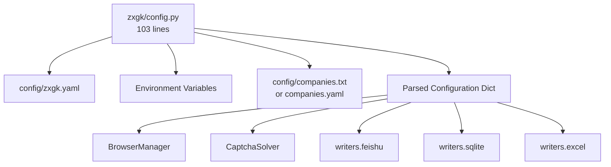
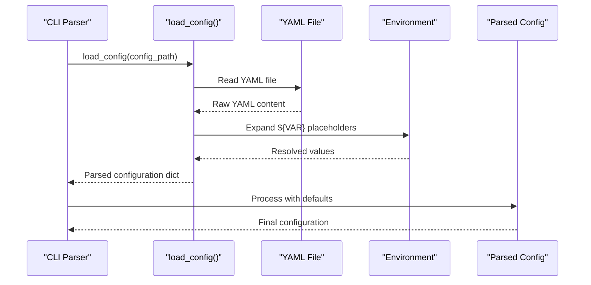
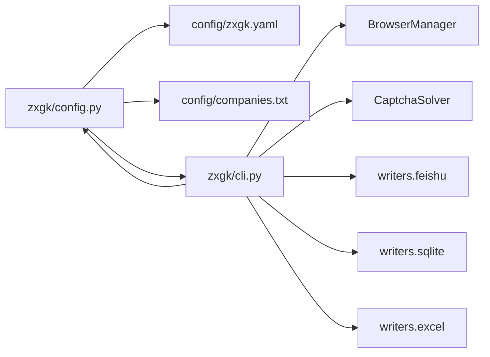

# Configuration Management

<cite>
**Referenced Files in This Document**
- [zxgk/config.py](file://zxgk/config.py)
- [config/zxgk.yaml](file://config/zxgk.yaml)
- [config/zxgk.example.yaml](file://config/zxgk.example.yaml)
- [config/companies.example.txt](file://config/companies.example.txt)
- [zxgk/cli.py](file://zxgk/cli.py)
- [diagnose_subsites.py](file://diagnose_subsites.py)
- [writers/__init__.py](file://writers/__init__.py)
- [writers/sqlite.py](file://writers/sqlite.py)
- [writers/excel.py](file://writers/excel.py)
- [writers/feishu.py](file://writers/feishu.py)
- [README.md](file://README.md)
- [cron_daily_query.sh](file://cron_daily_query.sh)
- [setup.sh](file://setup.sh)
- [smoke_test.sh](file://smoke_test.sh)
</cite>

## Update Summary
**Changes Made**
- Updated configuration loading system to use new centralized config.py module
- Added comprehensive environment variable expansion support with ${VAR} syntax
- Enhanced validation rules and runtime precedence handling
- Updated YAML schema documentation with new fields and structure
- Revised integration examples to reflect new configuration management approach

## Table of Contents
1. [Introduction](#introduction)
2. [Project Structure](#project-structure)
3. [Core Components](#core-components)
4. [Architecture Overview](#architecture-overview)
5. [Detailed Component Analysis](#detailed-component-analysis)
6. [Dependency Analysis](#dependency-analysis)
7. [Performance Considerations](#performance-considerations)
8. [Troubleshooting Guide](#troubleshooting-guide)
9. [Conclusion](#conclusion)
10. [Appendices](#appendices)

## Introduction
This document explains the comprehensive YAML-based configuration management system for the execution information query system. The new configuration system, centered around a 103-line configuration module in `zxgk/config.py`, provides robust environment variable expansion, validation rules, and runtime precedence handling. It covers the complete configuration schema including subsite definitions, output preferences, security parameters, and integration with output writers. The system emphasizes security through environment variable handling for sensitive data and provides clear validation mechanisms for reliable operation across different environments.

## Project Structure
The configuration system now centers around a unified configuration module that handles:
- Centralized YAML configuration loading with environment variable expansion
- Company list loading from both YAML and text formats
- Date parsing utilities for Chinese date formats
- Environment cleanup and proxy variable management
- Comprehensive validation and default value handling

**Diagram sources**
- [zxgk/config.py:49-70](file://zxgk/config.py#L49-L70)
- [config/zxgk.yaml:1-102](file://config/zxgk.yaml#L1-L102)
- [writers/feishu.py:26-32](file://writers/feishu.py#L26-L32)

**Section sources**
- [zxgk/config.py:1-104](file://zxgk/config.py#L1-L104)
- [config/zxgk.yaml:1-102](file://config/zxgk.yaml#L1-L102)
- [writers/__init__.py:1-10](file://writers/__init__.py#L1-L10)

## Core Components

### Centralized Configuration Module
The new configuration system is built around `zxgk/config.py` which provides:
- **Environment Variable Expansion**: Recursive expansion of `${VAR}` placeholders in strings, dictionaries, and lists
- **Default Value Handling**: Graceful fallback to empty dictionaries when config files are missing
- **Company List Loading**: Support for both YAML and plain text company list formats
- **Date Parsing Utilities**: Specialized functions for processing Chinese date formats
- **Environment Cleanup**: Automatic proxy variable cleanup for secure browser operations

### Enhanced YAML Schema
The configuration schema now includes:
- **Captcha Server Configuration**: Endpoint definition for captcha solver service
- **Browser Configuration**: Headless mode, viewport dimensions, and executable settings
- **WAF Protection Parameters**: Comprehensive retry and cooldown mechanisms
- **Screenshot Management**: Enable/disable functionality with storage mode options
- **Subsite Definitions**: Structured configuration for multiple legal information sites
- **Feishu Integration**: Complete table and field mapping configuration
- **Output Directories**: Organized storage for batch JSON and screenshot files
- **Company Lists**: Flexible company list management supporting multiple formats

### Runtime Precedence System
The system implements a clear precedence hierarchy:
1. **CLI Arguments** (highest priority)
2. **Configuration File Values**
3. **Default Values** (lowest priority)

**Section sources**
- [zxgk/config.py:49-104](file://zxgk/config.py#L49-L104)
- [config/zxgk.yaml:1-102](file://config/zxgk.yaml#L1-L102)
- [smoke_test.sh:59-79](file://smoke_test.sh#L59-L79)

## Architecture Overview
The configuration management system follows a centralized loading pattern that ensures consistency and security across all components:

**Diagram sources**
- [zxgk/cli.py:288-289](file://zxgk/cli.py#L288-L289)
- [zxgk/config.py:49-70](file://zxgk/config.py#L49-L70)

**Section sources**
- [zxgk/cli.py:281-321](file://zxgk/cli.py#L281-L321)
- [zxgk/config.py:49-70](file://zxgk/config.py#L49-L70)

## Detailed Component Analysis

### YAML Configuration Schema
The configuration file defines a comprehensive structure with the following key sections:

#### Basic Configuration
- **captcha_server**: Endpoint URL for captcha solver service
- **browser**: Configuration for headless mode and viewport dimensions
- **waf**: Advanced protection parameters for WAF handling
- **screenshots**: Enable/disable screenshot functionality
- **storage**: Screenshot storage mode configuration
- **subsites**: Multi-site configuration with CSS selectors and timing
- **feishu**: Complete Feishu integration with table and field mappings
- **output**: Organized output directory structure
- **companies**: Company list management

#### Environment Variable Expansion
The system supports recursive environment variable expansion:
- `${FEISHU_APP_TOKEN}` expands to the actual token value
- Nested structures maintain variable expansion at all levels
- Unset variables resolve to empty strings gracefully

#### Default Value Handling
When configuration files are missing or incomplete:
- Empty dictionary returned for missing config files
- Downstream components provide sensible defaults
- Company list loading supports both YAML and text formats

**Section sources**
- [config/zxgk.yaml:1-102](file://config/zxgk.yaml#L1-L102)
- [zxgk/config.py:49-87](file://zxgk/config.py#L49-L87)
- [smoke_test.sh:59-79](file://smoke_test.sh#L59-L79)

### Environment Variable Expansion and Security
The configuration system provides robust environment variable handling:

#### Expansion Mechanism
- **Recursive Processing**: Handles nested dictionaries, lists, and strings
- **Type Preservation**: Maintains original data types during expansion
- **Fallback Behavior**: Unset variables resolve to empty strings
- **Security Focus**: Sensitive data (tokens, passwords) never stored in plaintext YAML

#### Security Implementation
- **Proxy Cleanup**: Automatic removal of proxy environment variables
- **Token Isolation**: Feishu app tokens loaded from environment only
- **Minimal Exposure**: Configuration files contain only non-sensitive defaults

**Section sources**
- [zxgk/config.py:43-47](file://zxgk/config.py#L43-L47)
- [writers/feishu.py:26-32](file://writers/feishu.py#L26-L32)

### Subsite Definitions and Navigation
Each subsite configuration includes:
- **name**: Human-readable identifier for the site
- **css_selector**: CSS selector for locating navigation elements
- **extra_wait_sec**: Additional wait time after navigation completion

The system supports three primary legal information sites:
- **zhixing**: Execution information site
- **shixin**: Dishonest被执行人 site  
- **xgl**: Consumption restriction site

**Section sources**
- [config/zxgk.yaml:29-41](file://config/zxgk.yaml#L29-L41)
- [diagnose_subsites.py:27-44](file://diagnose_subsites.py#L27-L44)

### Output Preferences and Storage Management
The system provides flexible output configuration:
- **output.dir**: Main output directory for batch JSON files
- **output.screenshots_dir**: Dedicated directory for screenshot storage
- **storage.screenshots**: Storage mode selection (file, blob, both)

Storage modes offer different trade-offs:
- **file**: Store only file paths (space-efficient)
- **blob**: Store binary data directly (higher fidelity)
- **both**: Store both paths and binary data (complete redundancy)

**Section sources**
- [config/zxgk.yaml:90-93](file://config/zxgk.yaml#L90-L93)
- [writers/sqlite.py:37-44](file://writers/sqlite.py#L37-L44)

### Security Parameters and WAF Handling
The WAF protection system includes comprehensive parameters:
- **captcha_max_retries**: Maximum attempts for captcha solving
- **cooldown_on_block_sec**: Delay period when blocked by WAF
- **company_interval_sec**: Delay between company queries
- **screenshot_interval_sec**: Minimum delay between screenshots
- **max_consecutive_fails**: Failure threshold before cooldown

These parameters work together to balance query performance with WAF evasion effectiveness.

**Section sources**
- [config/zxgk.yaml:16-22](file://config/zxgk.yaml#L16-L22)
- [zxgk/cli.py:109-121](file://zxgk/cli.py#L109-L121)

### Integration with Output Writers
The configuration system seamlessly integrates with all output writers:

#### SQLite Writer Integration
- **Database Creation**: Automatic database and table creation
- **Schema Migration**: Handles backward compatibility
- **Storage Options**: Supports all three storage modes
- **Binary Data Handling**: Optional screenshot binary storage

#### Excel Writer Integration
- **Report Generation**: Creates formatted Excel reports
- **Header Formatting**: Professional styling with custom colors
- **Multi-sheet Support**: Separate sheets for each subsite
- **Data Export**: Comprehensive field export capabilities

#### Feishu Writer Integration
- **Table Configuration**: Complete field mapping support
- **Cross-reference Updates**: Automatic status updates
- **Screenshot Upload**: Direct media upload to Feishu
- **Duplicate Detection**: Intelligent duplicate prevention

**Section sources**
- [writers/sqlite.py:19-100](file://writers/sqlite.py#L19-L100)
- [writers/excel.py:29-73](file://writers/excel.py#L29-L73)
- [writers/feishu.py:154-201](file://writers/feishu.py#L154-L201)

### Relationship with Command-Line Arguments and Runtime Precedence
The system implements a clear precedence hierarchy:

#### Priority Order
1. **CLI Arguments** (highest): Override all other settings
2. **Configuration File**: Provides base settings
3. **Default Values**: Fallback when neither CLI nor config specify values

#### Practical Implications
- **Mode Selection**: CLI flags override configuration for operation modes
- **Output Control**: Command-line output paths take precedence over config
- **Feature Toggles**: CLI switches can enable/disable features regardless of config
- **Subsite Selection**: Direct CLI specification overrides configuration

**Section sources**
- [zxgk/cli.py:281-321](file://zxgk/cli.py#L281-L321)

### Validation Rules and Quality Assurance
The system includes comprehensive validation mechanisms:

#### YAML Parsing Validation
- **Format Verification**: Ensures syntactically correct YAML
- **Structure Validation**: Confirms required sections exist
- **Type Checking**: Validates data types for each field
- **Range Validation**: Checks numeric values are within acceptable ranges

#### Runtime Diagnostics
- **Subsite Validation**: CSS selectors tested for accessibility
- **Feishu Integration**: App token verification and table access testing
- **Company List Validation**: Format checking for both YAML and text formats
- **Dependency Verification**: Ensures all required components are available

**Section sources**
- [smoke_test.sh:59-79](file://smoke_test.sh#L59-L79)
- [diagnose_subsites.py:27-44](file://diagnose_subsites.py#L27-L44)

## Dependency Analysis
The configuration system creates clear dependency relationships:

**Diagram sources**
- [zxgk/config.py:49-87](file://zxgk/config.py#L49-L87)
- [zxgk/cli.py:13-17](file://zxgk/cli.py#L13-L17)

**Section sources**
- [zxgk/config.py:49-87](file://zxgk/config.py#L49-L87)
- [zxgk/cli.py:13-17](file://zxgk/cli.py#L13-L17)

## Performance Considerations
The configuration system is designed for optimal performance:

### Memory Efficiency
- **Lazy Loading**: Configuration loaded only when needed
- **Minimal Caching**: No persistent state retained between loads
- **Efficient Parsing**: Direct YAML to dictionary conversion

### Network Optimization
- **Connection Reuse**: Browser connections maintained across operations
- **Batch Processing**: Multiple companies processed efficiently
- **Resource Pooling**: Shared resources minimize overhead

### Storage Optimization
- **Selective Storage**: Choose appropriate storage modes based on needs
- **Cleanup Automation**: Automatic temporary file removal
- **Compression Options**: Binary storage reduces database size

## Troubleshooting Guide

### Common Configuration Issues

#### Missing Configuration Files
- **Symptom**: Empty configuration returned with warnings
- **Solution**: Create `config/zxgk.yaml` from the example template
- **Prevention**: Include configuration files in version control

#### Environment Variable Problems
- **Symptom**: Empty values where tokens should appear
- **Solution**: Set required environment variables before running
- **Verification**: Use `echo $FEISHU_APP_TOKEN` to confirm setup

#### YAML Syntax Errors
- **Symptom**: Parsing failures or incomplete configurations
- **Solution**: Validate YAML syntax using online validators
- **Debugging**: Start with minimal configuration and add complexity gradually

#### Company List Format Issues
- **Symptom**: Empty company lists or parsing errors
- **Solution**: Use either YAML list format or plain text format consistently
- **Format Choice**: YAML allows structured data, text format is simpler

### Security and Access Issues
- **Feishu Authentication**: Ensure `FEISHU_APP_TOKEN` is set and valid
- **File Permissions**: Verify write permissions for output directories
- **Network Access**: Confirm connectivity to captcha-solver service

**Section sources**
- [zxgk/config.py:54-56](file://zxgk/config.py#L54-L56)
- [writers/feishu.py:29-32](file://writers/feishu.py#L29-L32)
- [smoke_test.sh:98-106](file://smoke_test.sh#L98-L106)

## Conclusion
The new configuration management system provides a robust, secure, and flexible foundation for the execution information query system. Its centralized design, comprehensive environment variable support, and clear validation mechanisms ensure reliable operation across diverse environments. The system successfully balances security (through environment variable handling for sensitive data) with usability (through sensible defaults and clear error messages). By implementing proper precedence handling and comprehensive validation, it enables teams to confidently deploy and operate the system in production environments.

## Appendices

### Configuration Reference

#### Core Configuration Fields
- **captcha_server**: URL endpoint for captcha solver service
- **browser.headless**: Enable/disable headless browser mode
- **browser.viewport**: Width and height tuple for browser viewport
- **waf.captcha_max_retries**: Maximum captcha solving attempts
- **waf.cooldown_on_block_sec**: Delay when WAF blocks queries
- **waf.company_interval_sec**: Delay between company queries
- **waf.screenshot_interval_sec**: Minimum delay between screenshots
- **waf.max_consecutive_fails**: Failure threshold before cooldown

#### Subsite Configuration
- **subsites.<name>.name**: Human-readable subsite identifier
- **subsites.<name>.css_selector**: CSS selector for navigation
- **subsites.<name>.extra_wait_sec**: Additional wait after navigation

#### Output Configuration
- **output.dir**: Main output directory path
- **output.screenshots_dir**: Screenshot storage directory
- **storage.screenshots**: Storage mode (file/blob/both)

#### Feishu Integration
- **feishu.app_token**: Environment variable for authentication token
- **feishu.raw_table.id**: Primary table identifier
- **feishu.raw_table.fields**: Field mapping dictionary
- **feishu.detail_table.id**: Detail table identifier
- **feishu.detail_table.fields**: Detail field mapping dictionary

#### Company Management
- **companies**: List of company names for batch processing
- **companies.yaml**: Alternative YAML format for structured data
- **companies.txt**: Plain text format with comment support

**Section sources**
- [config/zxgk.yaml:1-102](file://config/zxgk.yaml#L1-L102)
- [config/zxgk.example.yaml:1-103](file://config/zxgk.example.yaml#L1-L103)
- [config/companies.example.txt:1-7](file://config/companies.example.txt#L1-L7)