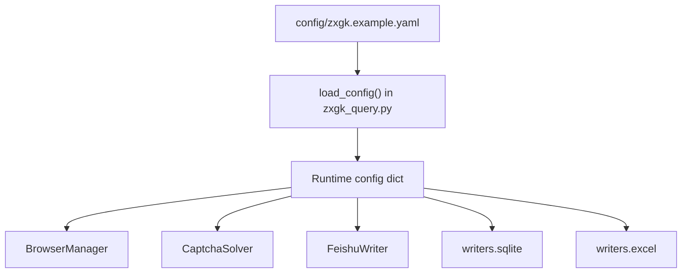
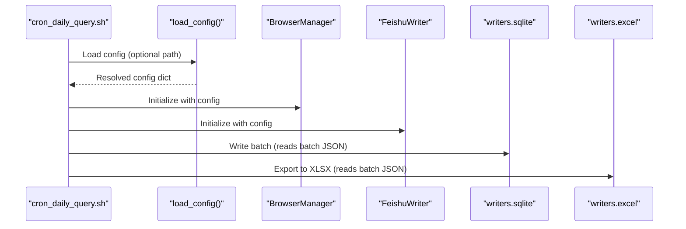
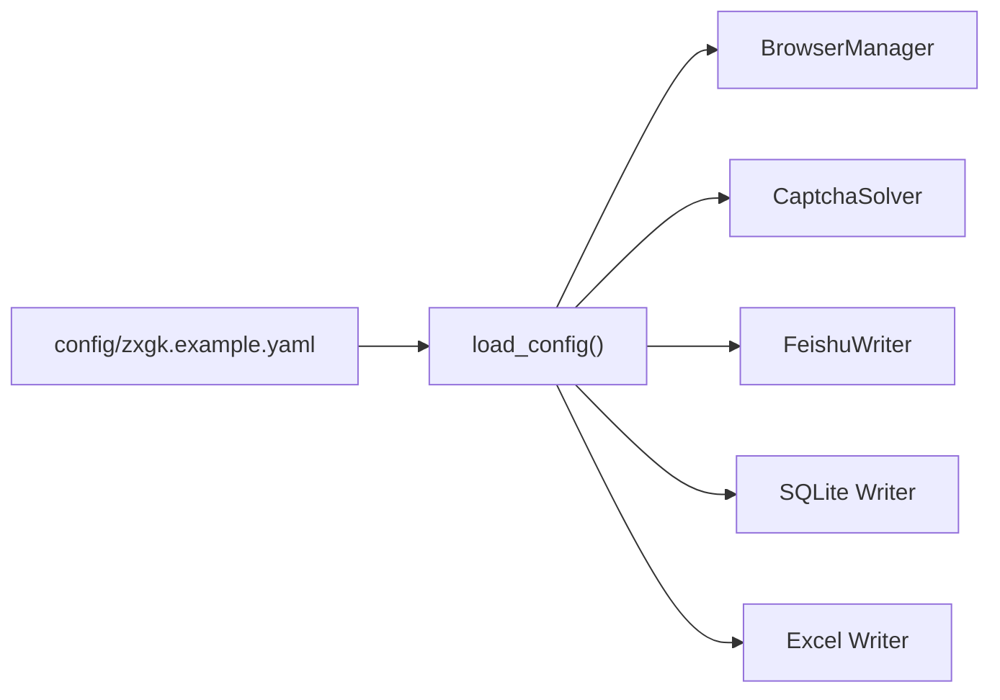

# Configuration Management

<cite>
**Referenced Files in This Document**
- [config/zxgk.example.yaml](file://config/zxgk.example.yaml)
- [zxgk_query.py](file://zxgk_query.py)
- [diagnose_subsites.py](file://diagnose_subsites.py)
- [writers/__init__.py](file://writers/__init__.py)
- [writers/sqlite.py](file://writers/sqlite.py)
- [writers/excel.py](file://writers/excel.py)
- [writers/feishu.py](file://writers/feishu.py)
- [writers/feishu_build.py](file://writers/feishu_build.py)
- [README.md](file://README.md)
- [cron_daily_query.sh](file://cron_daily_query.sh)
- [setup.sh](file://setup.sh)
- [smoke_test.sh](file://smoke_test.sh)
</cite>

## Table of Contents
1. [Introduction](#introduction)
2. [Project Structure](#project-structure)
3. [Core Components](#core-components)
4. [Architecture Overview](#architecture-overview)
5. [Detailed Component Analysis](#detailed-component-analysis)
6. [Dependency Analysis](#dependency-analysis)
7. [Performance Considerations](#performance-considerations)
8. [Troubleshooting Guide](#troubleshooting-guide)
9. [Conclusion](#conclusion)
10. [Appendices](#appendices)

## Introduction
This document explains configuration management for the execution information query system, focusing on YAML configuration format and environment variable handling. It covers the configuration schema (including subsite definitions, output preferences, and security parameters), environment variable expansion, default value handling, validation rules, and integration with output writers. It also clarifies relationships with command-line arguments and runtime parameter precedence, and provides practical guidance for managing configurations across environments.

## Project Structure
The configuration system spans:
- A primary YAML configuration file that defines browser behavior, WAF parameters, screenshots, storage preferences, subsites, Feishu integration, and output directories.
- A loader that reads the YAML, expands environment variables, and supplies defaults.
- Writers that consume configuration to decide storage targets and behavior.
- Scripts that orchestrate end-to-end runs and validate configuration readiness.

**Diagram sources**
- [config/zxgk.example.yaml](file://config/zxgk.example.yaml)
- [zxgk_query.py](file://zxgk_query.py)
- [writers/sqlite.py](file://writers/sqlite.py)
- [writers/excel.py](file://writers/excel.py)
- [writers/feishu.py](file://writers/feishu.py)

**Section sources**
- [config/zxgk.example.yaml](file://config/zxgk.example.yaml)
- [zxgk_query.py](file://zxgk_query.py)
- [writers/__init__.py](file://writers/__init__.py)

## Core Components
- YAML configuration schema: Defines browser, WAF, screenshots, storage, subsites, Feishu, and output directories.
- Environment variable expansion: ${VAR} placeholders are expanded at load time.
- Defaults: Many fields have sensible defaults when omitted.
- Validation: YAML parsing and basic checks occur during smoke testing and runtime diagnostics.

Key configuration areas:
- Captcha server endpoint
- Browser headless mode and viewport
- WAF retry and cooldown parameters
- Screenshots enablement and storage mode
- Subsite definitions (name, CSS selector, extra wait)
- Feishu app token and table/field mappings
- Output directories for batch JSON and screenshots

**Section sources**
- [config/zxgk.example.yaml](file://config/zxgk.example.yaml)
- [zxgk_query.py](file://zxgk_query.py)
- [smoke_test.sh](file://smoke_test.sh)

## Architecture Overview
Configuration drives runtime behavior across modules:
- The loader reads YAML and expands ${VAR} placeholders.
- The BrowserManager uses browser and viewport settings.
- The FeishuWriter uses Feishu app token and table/field mappings.
- Writers (SQLite, Excel, Feishu) interpret configuration to select storage and behavior.

**Diagram sources**
- [cron_daily_query.sh](file://cron_daily_query.sh)
- [zxgk_query.py](file://zxgk_query.py)
- [writers/sqlite.py](file://writers/sqlite.py)
- [writers/excel.py](file://writers/excel.py)
- [writers/feishu.py](file://writers/feishu.py)

## Detailed Component Analysis

### YAML Configuration Schema
The configuration file defines:
- captcha_server: Endpoint for captcha solver service.
- browser: headless mode and viewport dimensions.
- waf: retry and cooldown parameters for WAF handling.
- screenshots: enable/disable screenshots.
- storage: screenshot storage mode (file, blob, both).
- subsites: per-subsite name, CSS selector, and extra wait seconds.
- feishu: app token placeholder using environment variable expansion, raw and detail table IDs and field mappings, and dedup options.
- output: directories for batch JSON and screenshots.
- companies: list of company names.

Environment variable expansion:
- ${VAR_NAME} placeholders are replaced with environment variable values at load time. If the variable is unset, the placeholder resolves to an empty string.

Defaults:
- Many fields have defaults when omitted (e.g., browser headless defaults to true, viewport defaults to 1920x1080).

Validation:
- YAML parsing is validated by smoke tests.
- Diagnostics scripts validate subsite configuration and DOM structure.

**Section sources**
- [config/zxgk.example.yaml](file://config/zxgk.example.yaml)
- [zxgk_query.py](file://zxgk_query.py)
- [smoke_test.sh](file://smoke_test.sh)
- [diagnose_subsites.py](file://diagnose_subsites.py)

### Environment Variable Expansion and Defaults
- Expansion: The loader recursively expands ${VAR} placeholders in strings, dictionaries, and lists. Unset variables resolve to empty strings.
- Defaults: The loader returns an empty dict when the config file does not exist, allowing downstream components to supply defaults.
- Security: Sensitive values (e.g., Feishu app token) are read from environment variables rather than stored in YAML.

Practical implications:
- Use ${FEISHU_APP_TOKEN} in YAML to inject the token at runtime.
- Omit optional sections to rely on defaults.

**Section sources**
- [zxgk_query.py](file://zxgk_query.py)
- [README.md](file://README.md)

### Subsite Definitions and Navigation
- Each subsite defines:
  - name: Human-readable label.
  - css_selector: CSS selector to click the subsite link.
  - extra_wait_sec: Additional wait after navigation.
- The BrowserManager reads these values to navigate to the target subsite and apply extra waits.

Integration:
- Diagnostics script validates CSS selectors and waits.
- Query engine uses subsite configuration to locate and interact with pages.

**Section sources**
- [config/zxgk.example.yaml](file://config/zxgk.example.yaml)
- [zxgk_query.py](file://zxgk_query.py)
- [diagnose_subsites.py](file://diagnose_subsites.py)

### Output Preferences and Storage
- Output directories:
  - output.dir: Directory for batch JSON.
  - output.screenshots_dir: Directory for screenshots.
- Storage modes:
  - storage.screenshots: Controls whether screenshots are saved as file paths, binary blobs, or both.
- Writers:
  - SQLite writer supports storing screenshots as file paths, binary blobs, or both.
  - Excel writer exports a report sheet with selected fields.
  - Feishu writer writes to configured tables and supports uploading screenshots to a case table.

**Section sources**
- [config/zxgk.example.yaml](file://config/zxgk.example.yaml)
- [writers/sqlite.py](file://writers/sqlite.py)
- [writers/excel.py](file://writers/excel.py)
- [writers/feishu.py](file://writers/feishu.py)

### Security Parameters and WAF Handling
- WAF parameters:
  - captcha_max_retries: Maximum retries for CAPTCHA solving.
  - cooldown_on_block_sec: Cooldown period when blocked by WAF.
  - company_interval_sec: Delay between company queries.
  - screenshot_interval_sec: Delay between screenshots.
  - max_consecutive_fails: Threshold for consecutive failures.
- These parameters influence retry logic and delays to mitigate WAF detection.

**Section sources**
- [config/zxgk.example.yaml](file://config/zxgk.example.yaml)
- [zxgk_query.py](file://zxgk_query.py)

### Integration with Output Writers
- SQLite writer:
  - Reads batch JSON and inserts records into a SQLite database.
  - Supports storing screenshots as file paths, binary blobs, or both.
- Excel writer:
  - Exports a report sheet with selected fields to XLSX.
- Feishu writer:
  - Writes raw and detail records to configured tables.
  - Uploads screenshots to a case table and updates cross-reference fields.

**Section sources**
- [writers/sqlite.py](file://writers/sqlite.py)
- [writers/excel.py](file://writers/excel.py)
- [writers/feishu.py](file://writers/feishu.py)
- [writers/feishu_build.py](file://writers/feishu_build.py)

### Relationship with Command-Line Arguments and Runtime Precedence
- Command-line arguments override or augment runtime behavior:
  - Mode selection (e.g., text-only) influences output generation.
  - Subsite selection determines which subsite configuration is used.
  - Output path controls where batch JSON is written.
- Configuration file provides defaults and shared settings; CLI flags refine behavior per run.
- Scripts orchestrate end-to-end runs and pass arguments to the main query program.

**Section sources**
- [cron_daily_query.sh](file://cron_daily_query.sh)
- [README.md](file://README.md)

### Validation Rules and Diagnostics
- YAML parsing is validated by smoke tests.
- Diagnostics script probes subsite DOM structure and verifies CSS selectors and wait times.
- Health checks ensure the captcha solver is reachable.

**Section sources**
- [smoke_test.sh](file://smoke_test.sh)
- [diagnose_subsites.py](file://diagnose_subsites.py)
- [cron_daily_query.sh](file://cron_daily_query.sh)

## Dependency Analysis
Configuration dependencies:
- YAML file is loaded by the main program and passed to BrowserManager, CaptchaSolver, and writers.
- Feishu writer depends on Feishu app token and table/field mappings.
- SQLite and Excel writers depend on batch JSON produced by the main program.

**Diagram sources**
- [config/zxgk.example.yaml](file://config/zxgk.example.yaml)
- [zxgk_query.py](file://zxgk_query.py)
- [writers/sqlite.py](file://writers/sqlite.py)
- [writers/excel.py](file://writers/excel.py)
- [writers/feishu.py](file://writers/feishu.py)

**Section sources**
- [config/zxgk.example.yaml](file://config/zxgk.example.yaml)
- [zxgk_query.py](file://zxgk_query.py)
- [writers/__init__.py](file://writers/__init__.py)

## Performance Considerations
- WAF parameters (retry counts, cooldowns, intervals) balance reliability against speed.
- Screenshots storage mode affects disk usage and write throughput.
- Using file paths for screenshots reduces database size; binary blobs increase fidelity but storage cost.

[No sources needed since this section provides general guidance]

## Troubleshooting Guide
Common configuration issues and resolutions:
- Missing config file: The loader falls back to defaults; ensure subsites and output directories are set as needed.
- Unset environment variables: ${VAR} placeholders expand to empty strings; set FEISHU_APP_TOKEN for Feishu integration.
- Incorrect subsite CSS selectors: Use the diagnostics script to probe DOM structure and adjust selectors.
- WAF blocking: Increase cooldown and retry parameters; verify captcha solver health.
- Output directory permissions: Ensure write permissions for output.dir and output.screenshots_dir.
- Writer errors: Verify batch JSON format and table/field mappings for Feishu; confirm SQLite/Excel dependencies are installed.

**Section sources**
- [zxgk_query.py](file://zxgk_query.py)
- [diagnose_subsites.py](file://diagnose_subsites.py)
- [writers/feishu.py](file://writers/feishu.py)
- [writers/sqlite.py](file://writers/sqlite.py)
- [writers/excel.py](file://writers/excel.py)
- [smoke_test.sh](file://smoke_test.sh)

## Conclusion
The configuration system centers on a YAML schema with environment variable expansion and sensible defaults. It cleanly separates concerns between browser behavior, WAF handling, output preferences, and Feishu integration. By validating configuration early and providing diagnostics, teams can reliably operate across environments while maintaining security for sensitive data.

[No sources needed since this section summarizes without analyzing specific files]

## Appendices

### Configuration Reference
- captcha_server: Endpoint for captcha solver service.
- browser.headless: Enable/disable headless mode.
- browser.viewport: Width and height tuple for viewport.
- waf.captcha_max_retries: Max retries for CAPTCHA solving.
- waf.cooldown_on_block_sec: Cooldown when blocked by WAF.
- waf.company_interval_sec: Delay between company queries.
- waf.screenshot_interval_sec: Delay between screenshots.
- waf.max_consecutive_fails: Consecutive failure threshold.
- screenshots.enabled: Enable/disable screenshots.
- storage.screenshots: file | blob | both.
- subsites.<name>.name: Human-readable name.
- subsites.<name>.css_selector: CSS selector for subsite link.
- subsites.<name>.extra_wait_sec: Extra wait after navigation.
- feishu.app_token: ${FEISHU_APP_TOKEN} placeholder.
- feishu.raw_table.id: Raw table ID.
- feishu.raw_table.fields: Field mappings.
- feishu.detail_table.id: Detail table ID.
- feishu.detail_table.fields: Field mappings.
- feishu.detail_table.dedup_options: Dedup option mappings.
- output.dir: Output directory for batch JSON.
- output.screenshots_dir: Output directory for screenshots.
- companies: List of company names.

**Section sources**
- [config/zxgk.example.yaml](file://config/zxgk.example.yaml)
- [README.md](file://README.md)