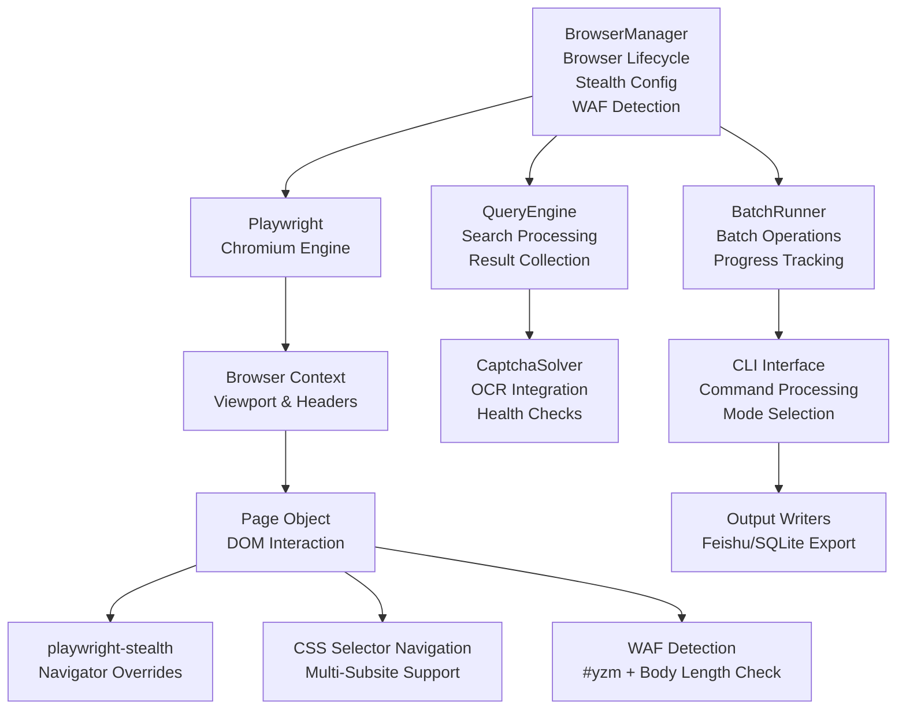
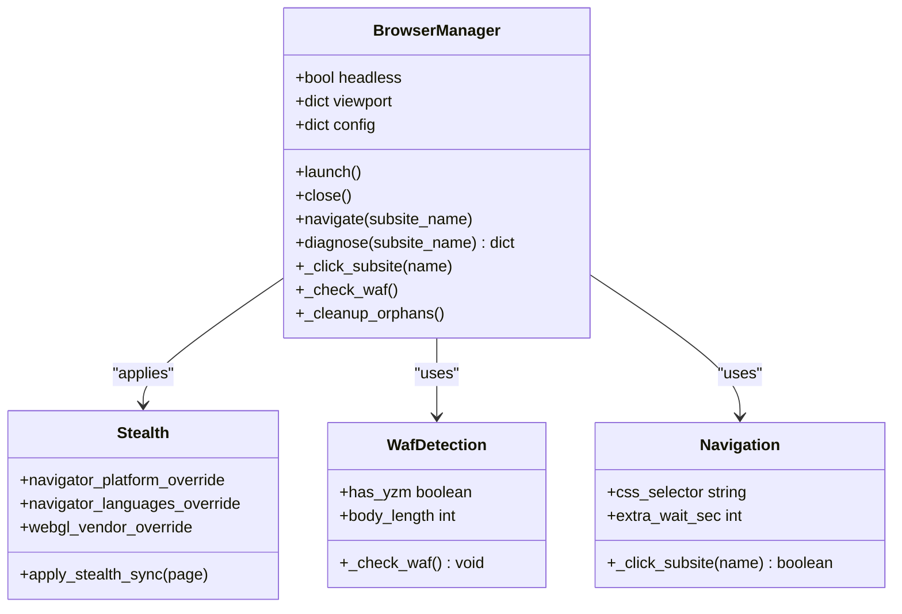
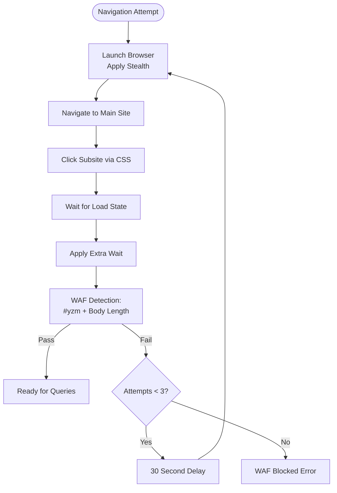
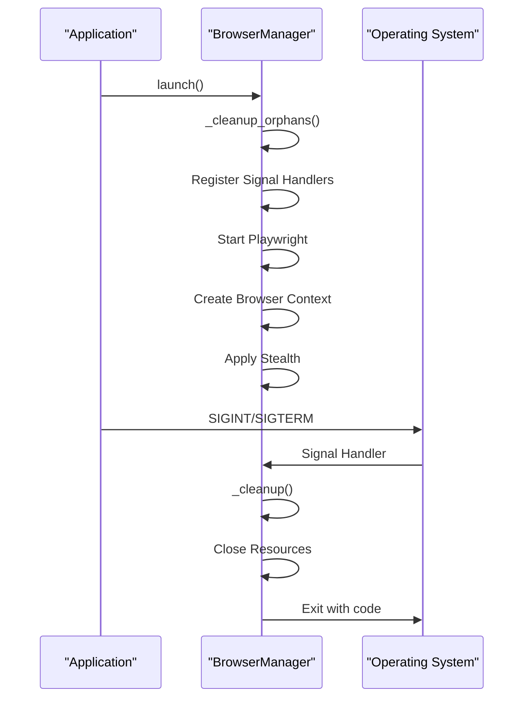
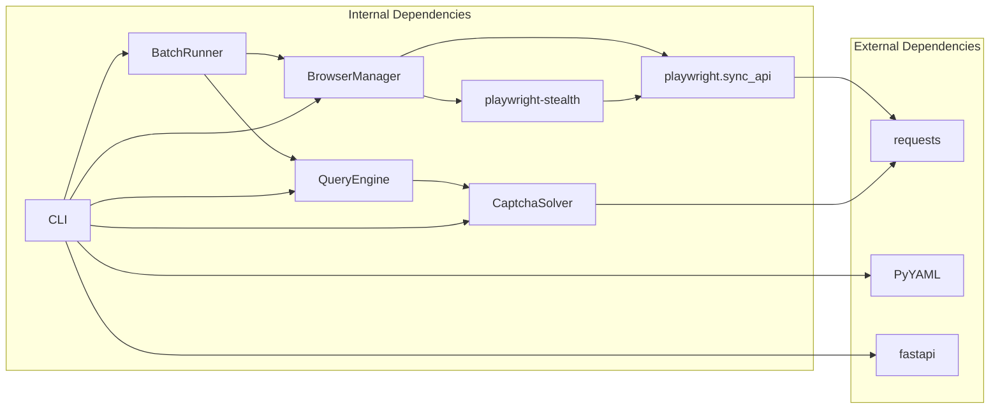

# Browser Automation System

<cite>
**Referenced Files in This Document**
- [README.md](file://README.md)
- [SKILL.md](file://SKILL.md)
- [zxgk_query.py](file://zxgk_query.py)
- [diagnose_subsites.py](file://diagnose_subsites.py)
- [cron_daily_query.sh](file://cron_daily_query.sh)
- [setup.sh](file://setup.sh)
- [config/zxgk.yaml](file://config/zxgk.yaml)
- [config/companies.example.txt](file://config/companies.example.txt)
- [captcha-solver/main.py](file://captcha-solver/main.py)
- [writers/__init__.py](file://writers/__init__.py)
- [writers/sqlite.py](file://writers/sqlite.py)
- [writers/feishu.py](file://writers/feishu.py)
- [zxgk/browser.py](file://zxgk/browser.py)
- [zxgk/config.py](file://zxgk/config.py)
- [zxgk/exceptions.py](file://zxgk/exceptions.py)
- [zxgk/query.py](file://zxgk/query.py)
- [zxgk/cli.py](file://zxgk/cli.py)
- [zxgk/runner.py](file://zxgk/runner.py)
- [zxgk/captcha.py](file://zxgk/captcha.py)
</cite>

## Update Summary
**Changes Made**
- Updated BrowserManager class documentation to reflect the new modular implementation in `zxgk/browser.py`
- Added detailed coverage of the new stealth configuration with playwright-stealth
- Enhanced WAF detection and bypass mechanisms documentation
- Updated architecture diagrams to show the modular component structure
- Added comprehensive examples of the new browser management system
- Updated configuration and dependency analysis to reflect the new modular design

## Table of Contents
1. [Introduction](#introduction)
2. [Project Structure](#project-structure)
3. [Core Components](#core-components)
4. [Architecture Overview](#architecture-overview)
5. [Detailed Component Analysis](#detailed-component-analysis)
6. [Dependency Analysis](#dependency-analysis)
7. [Performance Considerations](#performance-considerations)
8. [Troubleshooting Guide](#troubleshooting-guide)
9. [Conclusion](#conclusion)
10. [Appendices](#appendices)

## Introduction
This document describes the browser automation system that powers the Execution Information Query System. The system has been redesigned with a modular architecture featuring the BrowserManager class that manages Playwright Chromium lifecycle with advanced stealth configuration, robust WAF detection and bypass mechanisms, and graceful cleanup procedures. The new implementation provides enhanced anti-detection capabilities, improved multi-subsite navigation patterns, and comprehensive error handling.

## Project Structure
The project is now organized into modular components with clear separation of concerns. The browser automation core has been extracted into a dedicated `BrowserManager` class, while other components handle specific responsibilities like query processing, CAPTCHA solving, and batch operations.

```mermaid
graph TB
subgraph "Core Modules"
BM["BrowserManager<br/>zxgk/browser.py"]
QE["QueryEngine<br/>zxgk/query.py"]
CS["CaptchaSolver<br/>zxgk/captcha.py"]
BR["BatchRunner<br/>zxgk/runner.py"]
CLI["CLI Interface<br/>zxgk/cli.py"]
end
subgraph "Support Modules"
CFG["Config & Utils<br/>zxgk/config.py"]
EXC["Exceptions<br/>zxgk/exceptions.py"]
DIAG["Diagnosis Tools<br/>diagnose_subsites.py"]
end
subgraph "External Services"
OCR["captcha-solver/main.py"]
FS["writers/feishu.py"]
SQL["writers/sqlite.py"]
end
subgraph "Configuration"
YAML["config/zxgk.yaml"]
END
BM --> CFG
BM --> EXC
QE --> CS
QE --> CFG
BR --> BM
BR --> QE
CLI --> BM
CLI --> QE
CLI --> BR
CLI --> CS
CLI --> CFG
DIAG --> BM
DIAG --> CFG
```

**Diagram sources**
- [zxgk/browser.py:58-190](file://zxgk/browser.py#L58-L190)
- [zxgk/query.py:53-276](file://zxgk/query.py#L53-L276)
- [zxgk/captcha.py:9-73](file://zxgk/captcha.py#L9-L73)
- [zxgk/runner.py:15-278](file://zxgk/runner.py#L15-L278)
- [zxgk/cli.py:11-321](file://zxgk/cli.py#L11-L321)
- [zxgk/config.py:1-104](file://zxgk/config.py#L1-L104)
- [zxgk/exceptions.py:1-14](file://zxgk/exceptions.py#L1-L14)
- [diagnose_subsites.py:17-200](file://diagnose_subsites.py#L17-L200)
- [config/zxgk.yaml:1-102](file://config/zxgk.yaml#L1-L102)

**Section sources**
- [README.md:1-122](file://README.md#L1-L122)
- [SKILL.md:1-273](file://SKILL.md#L1-L273)

## Core Components
- **BrowserManager**: Centralized browser lifecycle management with stealth configuration, multi-subsite navigation, WAF detection, and graceful cleanup.
- **QueryEngine**: Handles search submission, result collection, pagination, and dialog dismissal with robust error handling.
- **CaptchaSolver**: Integrates with local OCR service for CAPTCHA recognition with health checks and retry logic.
- **BatchRunner**: Coordinates batch operations with WAF-aware retries, intervals, and progress persistence.
- **CLI Interface**: Command-line interface that orchestrates the entire workflow with multiple execution modes.
- **Configuration System**: Centralized configuration loading with environment variable support and validation.

**Section sources**
- [zxgk/browser.py:58-190](file://zxgk/browser.py#L58-L190)
- [zxgk/query.py:53-276](file://zxgk/query.py#L53-L276)
- [zxgk/captcha.py:9-73](file://zxgk/captcha.py#L9-L73)
- [zxgk/runner.py:15-278](file://zxgk/runner.py#L15-L278)
- [zxgk/cli.py:11-321](file://zxgk/cli.py#L11-L321)
- [zxgk/config.py:49-104](file://zxgk/config.py#L49-L104)

## Architecture Overview
The system uses a modular Playwright-based architecture with specialized components for each responsibility. The BrowserManager serves as the central orchestrator, managing browser lifecycle and stealth configuration while other components handle specific tasks.



**Diagram sources**
- [zxgk/browser.py:78-190](file://zxgk/browser.py#L78-L190)
- [zxgk/query.py:66-276](file://zxgk/query.py#L66-L276)
- [zxgk/captcha.py:13-73](file://zxgk/captcha.py#L13-L73)
- [zxgk/runner.py:45-145](file://zxgk/runner.py#L45-L145)
- [zxgk/cli.py:86-220](file://zxgk/cli.py#L86-L220)

## Detailed Component Analysis

### BrowserManager: Modular Browser Lifecycle Management
The BrowserManager class provides comprehensive browser lifecycle management with advanced stealth capabilities and robust error handling.

#### Launch and Initialization
- **Orphan Process Cleanup**: Scans and terminates lingering Chromium processes before launching new instances
- **Playwright Startup**: Initializes Playwright with custom arguments for sandbox and automation bypass
- **Context Creation**: Creates browser context with viewport configuration and HTTP headers
- **Stealth Application**: Applies playwright-stealth with comprehensive navigator overrides

#### Stealth Configuration
- **Navigator Platform Override**: Sets Linux x86_64 platform to mimic real desktop environments
- **Language Configuration**: Configures multiple languages (zh-CN, zh, en-US, en) for realistic fingerprint
- **WebGL Vendor Override**: Uses Intel Inc. vendor with Intel Iris OpenGL Engine renderer
- **Header Injection**: Sets Accept-Language and Accept headers for realistic browser behavior

#### Multi-Subsite Navigation
- **Configuration-Based Navigation**: Uses CSS selectors from configuration for reliable element targeting
- **Network State Management**: Waits for networkidle states and applies extra waits for complex pages
- **Retry Logic**: Implements automatic retry mechanism for navigation failures
- **Diagnostic Mode**: Provides detailed status reporting for troubleshooting

#### WAF Detection and Bypass
- **Dual Detection Method**: Checks for both CAPTCHA container (#yzm) and body length validation
- **Automatic Retry**: Implements exponential backoff with configurable retry attempts
- **Error Classification**: Distinguishes between navigation errors and WAF blocks
- **Graceful Degradation**: Continues operation with appropriate error handling



**Diagram sources**
- [zxgk/browser.py:58-190](file://zxgk/browser.py#L58-L190)

**Section sources**
- [zxgk/browser.py:58-190](file://zxgk/browser.py#L58-L190)

### WAF Detection and Bypass Mechanisms
The system implements sophisticated WAF detection using multiple validation criteria and intelligent retry logic.

#### Detection Strategy
- **Primary Indicator**: Presence of CAPTCHA container element (#yzm)
- **Secondary Validation**: Body length analysis to detect blocked responses
- **Real-time Monitoring**: Continuous validation during navigation and query operations

#### Bypass Implementation
- **Retry Configuration**: Up to 3 attempts with 30-second delays between retries
- **Intelligent Recovery**: Differentiates between navigation failures and WAF blocks
- **State Preservation**: Maintains browser state across retry attempts
- **Failure Classification**: Provides detailed error information for troubleshooting

#### Navigation Robustness
- **CSS Selector Validation**: Verifies element existence before interaction
- **Element Targeting**: Uses closest('a') to ensure proper anchor element selection
- **Target Attribute Management**: Sets target='_self' for seamless navigation
- **Error Handling**: Raises specific SubsiteNavError for navigation failures



**Diagram sources**
- [zxgk/browser.py:117-143](file://zxgk/browser.py#L117-L143)
- [zxgk/browser.py:163-170](file://zxgk/browser.py#L163-L170)

**Section sources**
- [zxgk/browser.py:117-143](file://zxgk/browser.py#L117-L143)
- [zxgk/browser.py:163-170](file://zxgk/browser.py#L163-L170)

### Advanced Signal Handling and Cleanup
The system implements comprehensive signal handling and cleanup mechanisms for graceful shutdown.

#### Signal Management
- **SIGINT Handler**: Cleans up browser resources and exits with signal-derived code
- **SIGTERM Handler**: Provides identical cleanup behavior for termination signals
- **atexit Registration**: Ensures cleanup on normal program termination
- **Global Reference Management**: Tracks browser instance for proper cleanup

#### Cleanup Procedures
- **Resource Hierarchy**: Closes contexts, browsers, then Playwright in proper order
- **Exception Suppression**: Prevents cleanup failures from masking original errors
- **Process Termination**: Terminates orphaned Chromium processes before launch
- **Pattern Matching**: Uses multiple process patterns to ensure complete cleanup



**Diagram sources**
- [zxgk/browser.py:20-38](file://zxgk/browser.py#L20-L38)
- [zxgk/browser.py:106-115](file://zxgk/browser.py#L106-L115)

**Section sources**
- [zxgk/browser.py:20-38](file://zxgk/browser.py#L20-L38)
- [zxgk/browser.py:106-115](file://zxgk/browser.py#L106-L115)

### Practical Examples and Usage Patterns
The modular architecture enables flexible usage patterns for different scenarios.

#### Single Company Query
```python
# Basic single company query
bm = BrowserManager(config)
try:
    bm.launch()
    bm.navigate("zhixing")
    records = engine.query("Company Name")
finally:
    bm.close()
```

#### Batch Processing with Error Recovery
```python
# Batch processing with automatic recovery
runner = BatchRunner(config, "zhixing")
results = runner.run(company_list)
```

#### Diagnostic Mode
```python
# System diagnostics
bm = BrowserManager(config)
result = bm.diagnose("zhixing")
print(f"WAF Status: {result['status']}")
```

**Section sources**
- [zxgk/cli.py:86-164](file://zxgk/cli.py#L86-L164)
- [zxgk/runner.py:45-145](file://zxgk/runner.py#L45-L145)
- [zxgk/browser.py:172-190](file://zxgk/browser.py#L172-L190)

## Dependency Analysis
The modular architecture introduces clear dependency relationships between components.

### Internal Dependencies
- **BrowserManager**: Depends on playwright-stealth, Playwright APIs, and configuration utilities
- **QueryEngine**: Relies on CaptchaSolver and DOM manipulation capabilities
- **BatchRunner**: Composes BrowserManager, QueryEngine, and output writers
- **CLI Interface**: Orchestrates all components with configuration management

### External Dependencies
- **Playwright**: Core browser automation framework
- **playwright-stealth**: Anti-detection library for stealth configuration
- **Requests**: HTTP client for CAPTCHA solver communication
- **PyYAML**: Configuration file parsing
- **FastAPI**: OCR service framework



**Diagram sources**
- [zxgk/browser.py:8-12](file://zxgk/browser.py#L8-L12)
- [zxgk/query.py:4](file://zxgk/query.py#L4)
- [zxgk/runner.py:8-12](file://zxgk/runner.py#L8-L12)
- [zxgk/cli.py:11-17](file://zxgk/cli.py#L11-L17)
- [zxgk/config.py:9](file://zxgk/config.py#L9)

**Section sources**
- [zxgk/browser.py:8-12](file://zxgk/browser.py#L8-L12)
- [zxgk/config.py:9](file://zxgk/config.py#L9)

## Performance Considerations
The modular design provides several performance optimization opportunities.

### Resource Management
- **Process Isolation**: Each BrowserManager instance maintains its own browser process
- **Memory Cleanup**: Proper resource hierarchy ensures efficient memory usage
- **Connection Pooling**: Reuses browser contexts within single execution sessions

### Stealth Optimization
- **Minimal Overhead**: playwright-stealth adds negligible performance impact
- **Selective Application**: Stealth only applied to critical pages and operations
- **Configuration Tuning**: Customizable viewport and header settings optimize performance

### Error Recovery
- **Retry Strategy**: Intelligent retry logic prevents unnecessary resource consumption
- **Timeout Management**: Configurable timeouts balance responsiveness with reliability
- **Graceful Degradation**: System continues operation even with partial failures

## Troubleshooting Guide
Comprehensive error handling and diagnostic capabilities aid in troubleshooting.

### Common Issues and Solutions
- **WAF Blocking**: Automatic retry with cooldown periods; check network connectivity
- **Navigation Failures**: Verify CSS selectors in configuration; use diagnostic mode
- **OCR Service Issues**: Health check endpoint; ensure service availability on port 8001
- **Browser Crashes**: Signal handlers ensure cleanup; restart system if needed

### Diagnostic Tools
- **System Health Check**: Comprehensive dependency verification
- **WAF Status Monitoring**: Real-time detection of blocking conditions
- **Component Testing**: Individual component validation and isolation

**Section sources**
- [zxgk/browser.py:172-190](file://zxgk/browser.py#L172-L190)
- [zxgk/cli.py:25-83](file://zxgk/cli.py#L25-L83)
- [diagnose_subsites.py:47-200](file://diagnose_subsites.py#L47-L200)

## Conclusion
The modular browser automation system provides a robust foundation for the Execution Information Query System. The BrowserManager class delivers comprehensive browser lifecycle management with advanced stealth capabilities, while the modular architecture ensures maintainability, scalability, and reliability. The system's sophisticated WAF detection and bypass mechanisms, combined with comprehensive error handling and cleanup procedures, enable reliable operation across diverse environments and use cases.

## Appendices

### Appendix A: Configuration and Setup
- **Browser Configuration**: Headless mode, viewport settings, and executable path specification
- **WAF Parameters**: Retry counts, cooldown periods, and interval configurations
- **Subsite Definitions**: CSS selectors and navigation parameters for each target site
- **Output Configuration**: Directory structure and file naming conventions

**Section sources**
- [config/zxgk.yaml:10-42](file://config/zxgk.yaml#L10-L42)
- [zxgk/config.py:49-104](file://zxgk/config.py#L49-L104)

### Appendix B: Component Integration
- **CLI Integration**: Command-line interface orchestrating all components
- **Batch Processing**: Automated execution with progress tracking and recovery
- **Output Writers**: Multiple export formats including Feishu and SQLite
- **Diagnostic Tools**: Comprehensive system health monitoring and validation

**Section sources**
- [zxgk/cli.py:181-321](file://zxgk/cli.py#L181-L321)
- [zxgk/runner.py:15-278](file://zxgk/runner.py#L15-L278)
- [writers/feishu.py:154-201](file://writers/feishu.py#L154-L201)
- [writers/sqlite.py:37-100](file://writers/sqlite.py#L37-L100)