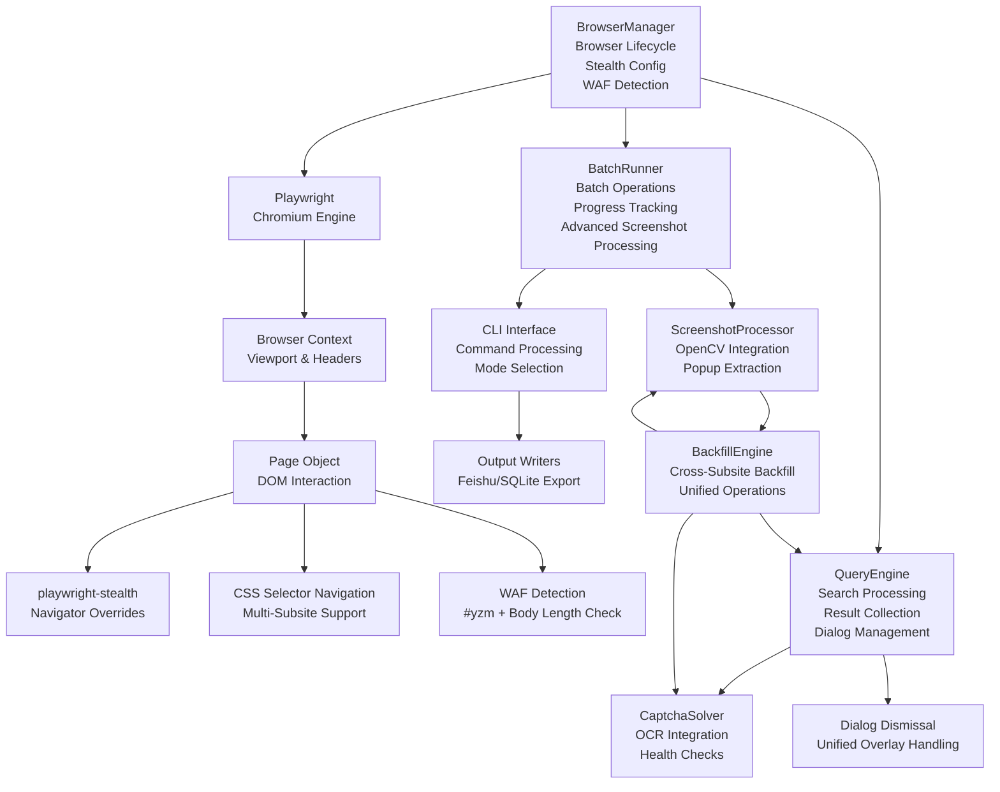
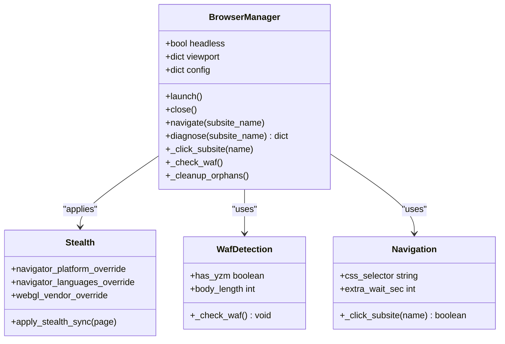
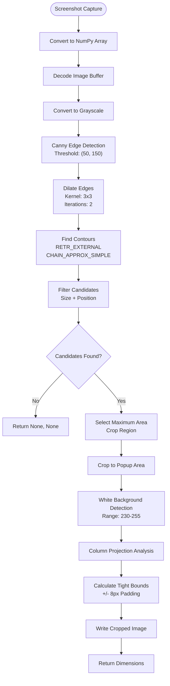
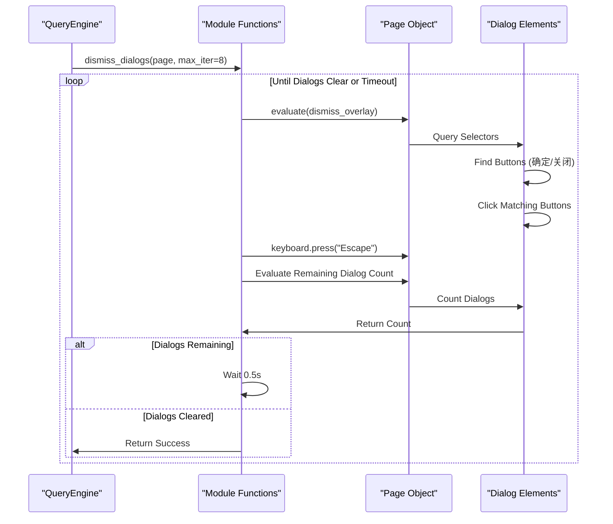
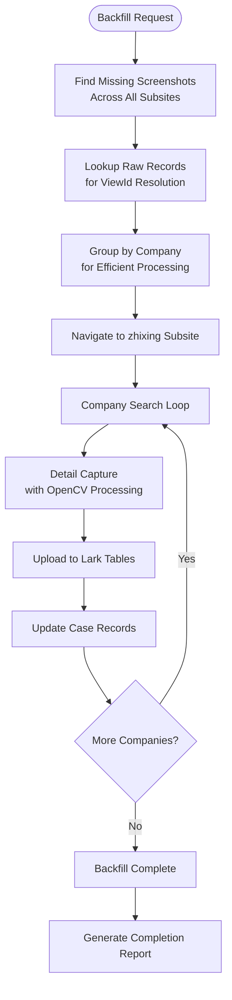
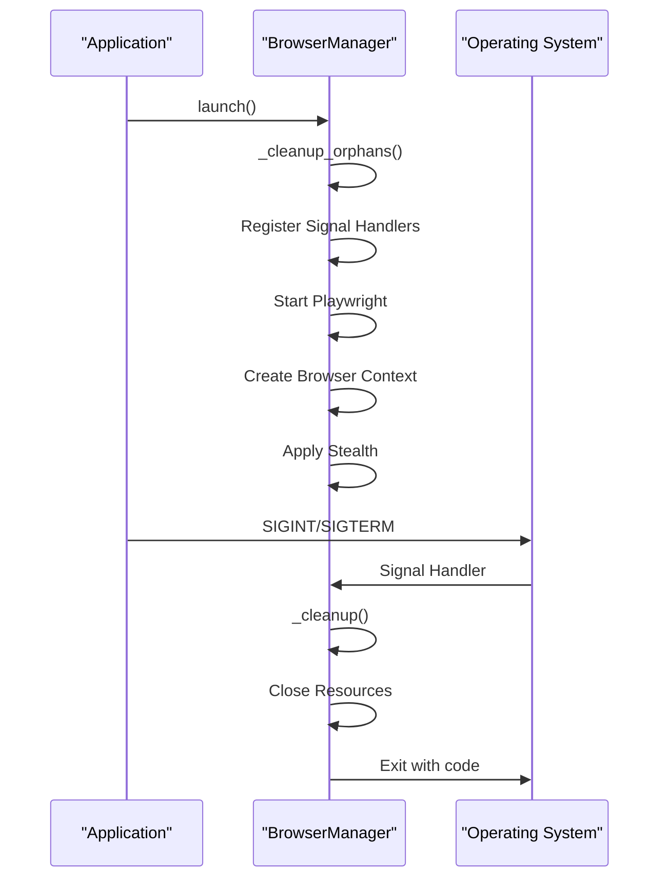
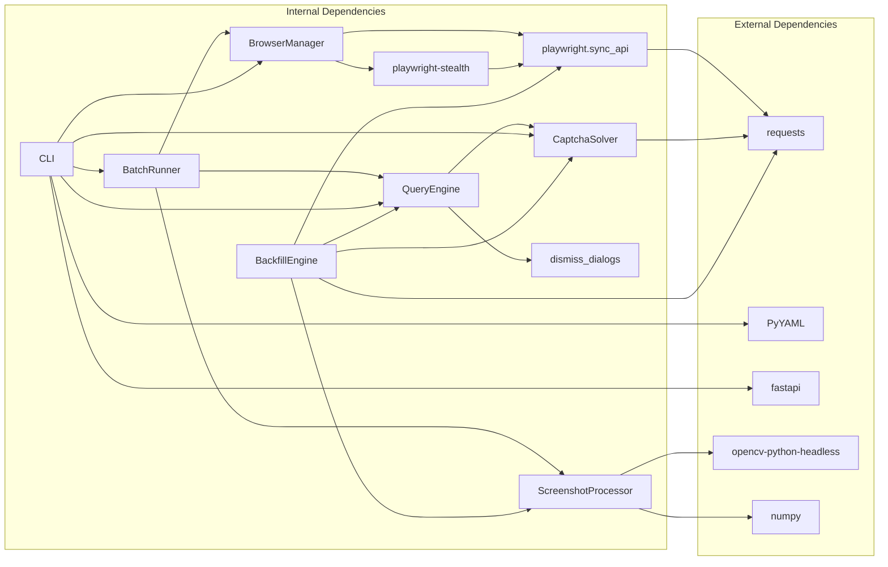

# Browser Automation System

<cite>
**Referenced Files in This Document**
- [README.md](file://README.md)
- [SKILL.md](file://SKILL.md)
- [zxgk_query.py](file://zxgk_query.py)
- [diagnose_subsites.py](file://diagnose_subsites.py)
- [cron_daily_query.sh](file://cron_daily_query.sh)
- [setup.sh](file://setup.sh)
- [config/zxgk.yaml](file://config/zxgk.yaml)
- [config/companies.example.txt](file://config/companies.example.txt)
- [captcha-solver/main.py](file://captcha-solver/main.py)
- [writers/__init__.py](file://writers/__init__.py)
- [writers/sqlite.py](file://writers/sqlite.py)
- [writers/feishu.py](file://writers/feishu.py)
- [zxgk/browser.py](file://zxgk/browser.py)
- [zxgk/config.py](file://zxgk/config.py)
- [zxgk/exceptions.py](file://zxgk/exceptions.py)
- [zxgk/query.py](file://zxgk/query.py)
- [zxgk/cli.py](file://zxgk/cli.py)
- [zxgk/runner.py](file://zxgk/runner.py)
- [zxgk/captcha.py](file://zxgk/captcha.py)
- [zxgk/screenshot.py](file://zxgk/screenshot.py)
- [zxgk/backfill.py](file://zxgk/backfill.py)
- [requirements.txt](file://requirements.txt)
</cite>

## Update Summary
**Changes Made**
- Updated BrowserManager class documentation to reflect the new modular implementation in `zxgk/browser.py`
- Added detailed coverage of the new stealth configuration with playwright-stealth
- Enhanced WAF detection and bypass mechanisms documentation
- Updated architecture diagrams to show the modular component structure
- Added comprehensive examples of the new browser management system
- Updated configuration and dependency analysis to reflect the new modular design
- **Updated** Enhanced screenshot processing with OpenCV integration for precise popup extraction
- **Updated** Improved dialog dismissal mechanisms with unified functions across subsites
- **Updated** Unified backfill functionality demonstrating cross-subsite operations

## Table of Contents
1. [Introduction](#introduction)
2. [Project Structure](#project-structure)
3. [Core Components](#core-components)
4. [Architecture Overview](#architecture-overview)
5. [Detailed Component Analysis](#detailed-component-analysis)
6. [Dependency Analysis](#dependency-analysis)
7. [Performance Considerations](#performance-considerations)
8. [Troubleshooting Guide](#troubleshooting-guide)
9. [Conclusion](#conclusion)
10. [Appendices](#appendices)

## Introduction
This document describes the browser automation system that powers the Execution Information Query System. The system has been redesigned with a modular architecture featuring the BrowserManager class that manages Playwright Chromium lifecycle with advanced stealth configuration, robust WAF detection and bypass mechanisms, and graceful cleanup procedures. The new implementation provides enhanced anti-detection capabilities, improved multi-subsite navigation patterns, comprehensive error handling, and sophisticated screenshot processing with OpenCV integration.

## Project Structure
The project is now organized into modular components with clear separation of concerns. The browser automation core has been extracted into a dedicated `BrowserManager` class, while other components handle specific responsibilities like query processing, CAPTCHA solving, batch operations, and advanced screenshot processing.

```mermaid
graph TB
subgraph "Core Modules"
BM["BrowserManager<br/>zxgk/browser.py"]
QE["QueryEngine<br/>zxgk/query.py"]
CS["CaptchaSolver<br/>zxgk/captcha.py"]
BR["BatchRunner<br/>zxgk/runner.py"]
CLI["CLI Interface<br/>zxgk/cli.py"]
SS["ScreenshotProcessor<br/>zxgk/screenshot.py"]
BF["BackfillEngine<br/>zxgk/backfill.py"]
end
subgraph "Support Modules"
CFG["Config & Utils<br/>zxgk/config.py"]
EXC["Exceptions<br/>zxgk/exceptions.py"]
DIAG["Diagnosis Tools<br/>diagnose_subsites.py"]
end
subgraph "External Services"
OCR["captcha-solver/main.py"]
FS["writers/feishu.py"]
SQL["writers/sqlite.py"]
end
subgraph "Configuration"
YAML["config/zxgk.yaml"]
REQ["requirements.txt<br/>opencv-python-headless<br/>numpy"]
END
BM --> CFG
BM --> EXC
QE --> CS
QE --> CFG
BR --> BM
BR --> QE
BR --> SS
CLI --> BM
CLI --> QE
CLI --> BR
CLI --> CS
CLI --> BF
DIAG --> BM
DIAG --> CFG
BF --> SS
BF --> QE
BF --> CS
SS --> REQ
```

**Diagram sources**
- [zxgk/browser.py:58-190](file://zxgk/browser.py#L58-L190)
- [zxgk/query.py:59-238](file://zxgk/query.py#L59-L238)
- [zxgk/captcha.py:9-73](file://zxgk/captcha.py#L9-L73)
- [zxgk/runner.py:15-275](file://zxgk/runner.py#L15-L275)
- [zxgk/cli.py:11-370](file://zxgk/cli.py#L11-L370)
- [zxgk/config.py:1-104](file://zxgk/config.py#L1-L104)
- [zxgk/exceptions.py:1-14](file://zxgk/exceptions.py#L1-L14)
- [diagnose_subsites.py:17-350](file://diagnose_subsites.py#L17-L350)
- [zxgk/screenshot.py:1-108](file://zxgk/screenshot.py#L1-L108)
- [zxgk/backfill.py:12-281](file://zxgk/backfill.py#L12-L281)
- [config/zxgk.yaml:1-102](file://config/zxgk.yaml#L1-L102)
- [requirements.txt:1-8](file://requirements.txt#L1-L8)

**Section sources**
- [README.md:1-122](file://README.md#L1-L122)
- [SKILL.md:1-273](file://SKILL.md#L1-L273)

## Core Components
- **BrowserManager**: Centralized browser lifecycle management with stealth configuration, multi-subsite navigation, WAF detection, and graceful cleanup.
- **QueryEngine**: Handles search submission, result collection, pagination, and dialog dismissal with robust error handling and unified overlay management.
- **CaptchaSolver**: Integrates with local OCR service for CAPTCHA recognition with health checks and retry logic.
- **BatchRunner**: Coordinates batch operations with WAF-aware retries, intervals, and progress persistence, including advanced screenshot processing.
- **CLI Interface**: Command-line interface that orchestrates the entire workflow with multiple execution modes.
- **ScreenshotProcessor**: Advanced image processing with OpenCV integration for precise popup extraction and cropping.
- **BackfillEngine**: Unified backfill functionality for cross-subsite screenshot completion and data reconciliation.
- **Configuration System**: Centralized configuration loading with environment variable support and validation.

**Section sources**
- [zxgk/browser.py:58-190](file://zxgk/browser.py#L58-L190)
- [zxgk/query.py:59-238](file://zxgk/query.py#L59-L238)
- [zxgk/captcha.py:9-73](file://zxgk/captcha.py#L9-L73)
- [zxgk/runner.py:15-275](file://zxgk/runner.py#L15-L275)
- [zxgk/cli.py:11-370](file://zxgk/cli.py#L11-L370)
- [zxgk/config.py:49-104](file://zxgk/config.py#L49-L104)
- [zxgk/screenshot.py:68-108](file://zxgk/screenshot.py#L68-L108)
- [zxgk/backfill.py:12-281](file://zxgk/backfill.py#L12-L281)

## Architecture Overview
The system uses a modular Playwright-based architecture with specialized components for each responsibility. The BrowserManager serves as the central orchestrator, managing browser lifecycle and stealth configuration while other components handle specific tasks. The architecture now includes advanced screenshot processing capabilities and unified dialog management across all subsites.



**Diagram sources**
- [zxgk/browser.py:78-190](file://zxgk/browser.py#L78-L190)
- [zxgk/query.py:66-238](file://zxgk/query.py#L66-L238)
- [zxgk/captcha.py:13-73](file://zxgk/captcha.py#L13-L73)
- [zxgk/runner.py:45-145](file://zxgk/runner.py#L45-L145)
- [zxgk/cli.py:86-220](file://zxgk/cli.py#L86-L220)
- [zxgk/screenshot.py:11-108](file://zxgk/screenshot.py#L11-L108)
- [zxgk/backfill.py:12-281](file://zxgk/backfill.py#L12-L281)

## Detailed Component Analysis

### BrowserManager: Modular Browser Lifecycle Management
The BrowserManager class provides comprehensive browser lifecycle management with advanced stealth capabilities and robust error handling.

#### Launch and Initialization
- **Orphan Process Cleanup**: Scans and terminates lingering Chromium processes before launching new instances
- **Playwright Startup**: Initializes Playwright with custom arguments for sandbox and automation bypass
- **Context Creation**: Creates browser context with viewport configuration and HTTP headers
- **Stealth Application**: Applies playwright-stealth with comprehensive navigator overrides

#### Stealth Configuration
- **Navigator Platform Override**: Sets Linux x86_64 platform to mimic real desktop environments
- **Language Configuration**: Configures multiple languages (zh-CN, zh, en-US, en) for realistic fingerprint
- **WebGL Vendor Override**: Uses Intel Inc. vendor with Intel Iris OpenGL Engine renderer
- **Header Injection**: Sets Accept-Language and Accept headers for realistic browser behavior

#### Multi-Subsite Navigation
- **Configuration-Based Navigation**: Uses CSS selectors from configuration for reliable element targeting
- **Network State Management**: Waits for networkidle states and applies extra waits for complex pages
- **Retry Logic**: Implements automatic retry mechanism for navigation failures
- **Diagnostic Mode**: Provides detailed status reporting for troubleshooting

#### WAF Detection and Bypass
- **Dual Detection Method**: Checks for both CAPTCHA container (#yzm) and body length validation
- **Automatic Retry**: Implements exponential backoff with configurable retry attempts
- **Error Classification**: Distinguishes between navigation errors and WAF blocks
- **Graceful Degradation**: Continues operation with appropriate error handling



**Diagram sources**
- [zxgk/browser.py:58-190](file://zxgk/browser.py#L58-L190)

**Section sources**
- [zxgk/browser.py:58-190](file://zxgk/browser.py#L58-L190)

### Advanced Screenshot Processing with OpenCV Integration
The system now includes sophisticated screenshot processing capabilities powered by OpenCV for precise popup extraction and cropping.

#### OpenCV-Based Popup Extraction
- **Edge Detection**: Uses Canny edge detection with threshold values (50, 150) for accurate boundary detection
- **Contour Analysis**: Identifies rectangular candidates based on size constraints (400 < width < 1400, 150 < height < 500)
- **Position Filtering**: Filters candidates based on vertical position (y > 35% of image height)
- **White Background Detection**: Validates popup regions using white pixel detection thresholds
- **Column Projection**: Performs column-wise projection analysis for precise cropping boundaries

#### Memory-Efficient Processing
- **In-Memory Processing**: Entire pipeline operates in memory without intermediate disk I/O
- **Optimized Cropping**: Automatically crops to tight bounding boxes around popup content
- **Fallback Mechanisms**: Falls back to full-page screenshots when popup extraction fails
- **File Output**: Writes processed images directly to specified output paths

#### Integration with Screenshot Workflow
- **Seamless Integration**: Extracted popup images replace full-page screenshots when successful
- **Quality Preservation**: Maintains image quality while reducing file size through precise cropping
- **Consistent Output**: Standardizes output dimensions and formats across all subsites



**Diagram sources**
- [zxgk/screenshot.py:11-65](file://zxgk/screenshot.py#L11-L65)

**Section sources**
- [zxgk/screenshot.py:11-108](file://zxgk/screenshot.py#L11-L108)

### Unified Dialog Dismissal Mechanisms
The system implements comprehensive dialog dismissal mechanisms that work consistently across all subsites and scenarios.

#### Module-Level Dialog Management
- **dismiss_overlay**: Handles individual dialog dismissal with comprehensive selector coverage
- **dismiss_dialogs**: Implements polling-based dismissal with configurable iteration limits
- **Universal Coverage**: Targets multiple dialog types including .dialog, .modal, .popup, and role-based dialogs
- **Button Recognition**: Identifies and clicks confirmation and close buttons with text matching

#### Enhanced Dismissal Strategy
- **Multi-Stage Approach**: Combines explicit button clicking with keyboard escape key fallback
- **Polling Mechanism**: Continuously checks for remaining dialogs with exponential backoff
- **Error Resilience**: Gracefully handles exceptions during dialog dismissal operations
- **Timeout Protection**: Limits dismissal attempts to prevent infinite loops

#### Cross-Subsite Compatibility
- **Consistent API**: Same dismissal functions work across zhixing, shixin, and xgl subsites
- **Adaptive Logic**: Automatically adapts to different dialog implementations across subsites
- **Robust Detection**: Handles various dialog container structures and button arrangements
- **Fallback Strategy**: Uses escape key when no explicit close buttons are found



**Diagram sources**
- [zxgk/query.py:8-57](file://zxgk/query.py#L8-L57)

**Section sources**
- [zxgk/query.py:8-57](file://zxgk/query.py#L8-L57)

### Unified Backfill Functionality Across Subsites
The system provides comprehensive backfill capabilities that operate uniformly across all subsites for missing screenshot completion.

#### Cross-Subsite Data Retrieval
- **Unified Missing Detection**: Identifies missing screenshots across all subsites using shared criteria
- **Raw Data Integration**: Leverages raw table relationships to obtain accurate viewIds for missing records
- **Company-Based Grouping**: Organizes backfill operations by company for efficient processing
- **Progress Tracking**: Maintains separate progress tracking for each company group

#### Consistent Processing Pipeline
- **Standardized Flow**: Same processing steps apply regardless of subsite (search → captcha → detail → screenshot → upload)
- **Shared Utilities**: Uses common dialog dismissal and screenshot processing functions
- **Error Handling**: Consistent error handling and retry logic across all subsites
- **Result Reporting**: Uniform success/failure reporting for all backfill operations

#### Advanced Features
- **ViewId Resolution**: Extracts accurate viewIds from raw table relationships rather than relying on batch JSON
- **Company Segmentation**: Processes companies in batches to optimize performance and reduce WAF impact
- **Media Upload Integration**: Seamlessly uploads processed screenshots to Lark tables
- **Record Updates**: Updates case records with screenshot references upon successful upload



**Diagram sources**
- [zxgk/backfill.py:118-191](file://zxgk/backfill.py#L118-L191)

**Section sources**
- [zxgk/backfill.py:12-281](file://zxgk/backfill.py#L12-L281)

### WAF Detection and Bypass Mechanisms
The system implements sophisticated WAF detection using multiple validation criteria and intelligent retry logic.

#### Detection Strategy
- **Primary Indicator**: Presence of CAPTCHA container element (#yzm)
- **Secondary Validation**: Body length analysis to detect blocked responses
- **Real-time Monitoring**: Continuous validation during navigation and query operations

#### Bypass Implementation
- **Retry Configuration**: Up to 3 attempts with 30-second delays between retries
- **Intelligent Recovery**: Differentiates between navigation failures and WAF blocks
- **State Preservation**: Maintains browser state across retry attempts
- **Failure Classification**: Provides detailed error information for troubleshooting

#### Navigation Robustness
- **CSS Selector Validation**: Verifies element existence before interaction
- **Element Targeting**: Uses closest('a') to ensure proper anchor element selection
- **Target Attribute Management**: Sets target='_self' for seamless navigation
- **Error Handling**: Raises specific SubsiteNavError for navigation failures


**Diagram sources**
- [zxgk/browser.py:117-143](file://zxgk/browser.py#L117-L143)
- [zxgk/browser.py:163-170](file://zxgk/browser.py#L163-L170)

**Section sources**
- [zxgk/browser.py:117-143](file://zxgk/browser.py#L117-L143)
- [zxgk/browser.py:163-170](file://zxgk/browser.py#L163-L170)

### Advanced Signal Handling and Cleanup
The system implements comprehensive signal handling and cleanup mechanisms for graceful shutdown.

#### Signal Management
- **SIGINT Handler**: Cleans up browser resources and exits with signal-derived code
- **SIGTERM Handler**: Provides identical cleanup behavior for termination signals
- **atexit Registration**: Ensures cleanup on normal program termination
- **Global Reference Management**: Tracks browser instance for proper cleanup

#### Cleanup Procedures
- **Resource Hierarchy**: Closes contexts, browsers, then Playwright in proper order
- **Exception Suppression**: Prevents cleanup failures from masking original errors
- **Process Termination**: Terminates orphaned Chromium processes before launch
- **Pattern Matching**: Uses multiple process patterns to ensure complete cleanup



**Diagram sources**
- [zxgk/browser.py:20-38](file://zxgk/browser.py#L20-L38)
- [zxgk/browser.py:106-115](file://zxgk/browser.py#L106-L115)

**Section sources**
- [zxgk/browser.py:20-38](file://zxgk/browser.py#L20-L38)
- [zxgk/browser.py:106-115](file://zxgk/browser.py#L106-L115)

### Practical Examples and Usage Patterns
The modular architecture enables flexible usage patterns for different scenarios.

#### Single Company Query
```python
# Basic single company query
bm = BrowserManager(config)
try:
    bm.launch()
    bm.navigate("zhixing")
    records = engine.query("Company Name")
finally:
    bm.close()
```

#### Batch Processing with Error Recovery
```python
# Batch processing with automatic recovery
runner = BatchRunner(config, "zhixing")
results = runner.run(company_list)
```

#### Advanced Screenshot Processing
```python
# Advanced screenshot processing with OpenCV
screenshotter = DetailScreenshot(page, "output/screenshots")
screenshot_map = screenshotter.capture_all(records)
```

#### Unified Backfill Operations
```python
# Cross-subsite backfill operations
backfiller = ScreenshotBackfiller(config, batch_id)
missing = backfiller.find_missing_screenshots()
backfiller.backfill_batch(missing)
```

#### Diagnostic Mode
```python
# System diagnostics
bm = BrowserManager(config)
result = bm.diagnose("zhixing")
print(f"WAF Status: {result['status']}")
```

**Section sources**
- [zxgk/cli.py:86-164](file://zxgk/cli.py#L86-L164)
- [zxgk/runner.py:45-145](file://zxgk/runner.py#L45-L145)
- [zxgk/browser.py:172-190](file://zxgk/browser.py#L172-L190)
- [zxgk/screenshot.py:68-108](file://zxgk/screenshot.py#L68-L108)
- [zxgk/backfill.py:271-281](file://zxgk/backfill.py#L271-L281)

## Dependency Analysis
The modular architecture introduces clear dependency relationships between components, with new dependencies for advanced image processing.

### Internal Dependencies
- **BrowserManager**: Depends on playwright-stealth, Playwright APIs, and configuration utilities
- **QueryEngine**: Relies on CaptchaSolver, DOM manipulation capabilities, and unified dialog dismissal
- **BatchRunner**: Composes BrowserManager, QueryEngine, output writers, and ScreenshotProcessor
- **CLI Interface**: Orchestrates all components with configuration management
- **ScreenshotProcessor**: Requires OpenCV and NumPy for advanced image processing
- **BackfillEngine**: Integrates with all other components for cross-subsite operations

### External Dependencies
- **Playwright**: Core browser automation framework
- **playwright-stealth**: Anti-detection library for stealth configuration
- **Requests**: HTTP client for CAPTCHA solver communication
- **PyYAML**: Configuration file parsing
- **FastAPI**: OCR service framework
- **OpenCV**: Advanced image processing and computer vision algorithms
- **NumPy**: Numerical computing for image processing operations



**Diagram sources**
- [zxgk/browser.py:8-12](file://zxgk/browser.py#L8-L12)
- [zxgk/query.py:4](file://zxgk/query.py#L4)
- [zxgk/runner.py:8-12](file://zxgk/runner.py#L8-L12)
- [zxgk/cli.py:11-17](file://zxgk/cli.py#L11-L17)
- [zxgk/config.py:9](file://zxgk/config.py#L9)
- [requirements.txt:5-6](file://requirements.txt#L5-L6)

**Section sources**
- [zxgk/browser.py:8-12](file://zxgk/browser.py#L8-L12)
- [zxgk/config.py:9](file://zxgk/config.py#L9)
- [requirements.txt:5-6](file://requirements.txt#L5-L6)

## Performance Considerations
The modular design provides several performance optimization opportunities, particularly with the new OpenCV integration.

### Resource Management
- **Process Isolation**: Each BrowserManager instance maintains its own browser process
- **Memory Cleanup**: Proper resource hierarchy ensures efficient memory usage
- **Connection Pooling**: Reuses browser contexts within single execution sessions
- **Image Processing Efficiency**: OpenCV operations are optimized for performance with minimal memory overhead

### Stealth Optimization
- **Minimal Overhead**: playwright-stealth adds negligible performance impact
- **Selective Application**: Stealth only applied to critical pages and operations
- **Configuration Tuning**: Customizable viewport and header settings optimize performance

### Error Recovery
- **Retry Strategy**: Intelligent retry logic prevents unnecessary resource consumption
- **Timeout Management**: Configurable timeouts balance responsiveness with reliability
- **Graceful Degradation**: System continues operation even with partial failures

### Advanced Image Processing
- **Efficient Memory Usage**: OpenCV operations work directly with memory buffers
- **Parallel Processing**: Multiple screenshot operations can be processed concurrently
- **Optimized Algorithms**: Computer vision algorithms are tuned for web page analysis
- **Fallback Mechanisms**: Graceful degradation when popup extraction fails

## Troubleshooting Guide
Comprehensive error handling and diagnostic capabilities aid in troubleshooting, with enhanced support for the new features.

### Common Issues and Solutions
- **WAF Blocking**: Automatic retry with cooldown periods; check network connectivity
- **Navigation Failures**: Verify CSS selectors in configuration; use diagnostic mode
- **OCR Service Issues**: Health check endpoint; ensure service availability on port 8001
- **Browser Crashes**: Signal handlers ensure cleanup; restart system if needed
- **OpenCV Processing Errors**: Check image buffer integrity; verify OpenCV installation
- **Dialog Dismissal Failures**: Review dialog selector patterns; adjust dismissal parameters
- **Backfill Operation Issues**: Verify raw table relationships; check viewId resolution

### Diagnostic Tools
- **System Health Check**: Comprehensive dependency verification
- **WAF Status Monitoring**: Real-time detection of blocking conditions
- **Component Testing**: Individual component validation and isolation
- **OpenCV Debugging**: Image processing pipeline validation and optimization
- **Dialog Analysis**: Comprehensive dialog structure inspection across subsites

**Section sources**
- [zxgk/browser.py:172-190](file://zxgk/browser.py#L172-L190)
- [zxgk/cli.py:25-83](file://zxgk/cli.py#L25-L83)
- [diagnose_subsites.py:47-200](file://diagnose_subsites.py#L47-L200)

## Conclusion
The modular browser automation system provides a robust foundation for the Execution Information Query System. The BrowserManager class delivers comprehensive browser lifecycle management with advanced stealth capabilities, while the modular architecture ensures maintainability, scalability, and reliability. The system's sophisticated WAF detection and bypass mechanisms, combined with comprehensive error handling and cleanup procedures, enable reliable operation across diverse environments and use cases. The enhanced screenshot processing with OpenCV integration, improved dialog dismissal mechanisms, and unified backfill functionality across subsites represent significant advances in automation capability and operational efficiency.

## Appendices

### Appendix A: Configuration and Setup
- **Browser Configuration**: Headless mode, viewport settings, and executable path specification
- **WAF Parameters**: Retry counts, cooldown periods, and interval configurations
- **Subsite Definitions**: CSS selectors and navigation parameters for each target site
- **Output Configuration**: Directory structure and file naming conventions
- **OpenCV Settings**: Image processing parameters and optimization configurations
- **Backfill Configuration**: Cross-subsite operation parameters and data reconciliation settings

**Section sources**
- [config/zxgk.yaml:10-42](file://config/zxgk.yaml#L10-L42)
- [zxgk/config.py:49-104](file://zxgk/config.py#L49-L104)

### Appendix B: Component Integration
- **CLI Integration**: Command-line interface orchestrating all components
- **Batch Processing**: Automated execution with progress tracking and recovery
- **Output Writers**: Multiple export formats including Feishu and SQLite
- **Diagnostic Tools**: Comprehensive system health monitoring and validation
- **Advanced Image Processing**: OpenCV integration for sophisticated screenshot analysis
- **Unified Backfill Operations**: Cross-subsite data reconciliation and screenshot completion

**Section sources**
- [zxgk/cli.py:181-370](file://zxgk/cli.py#L181-L370)
- [zxgk/runner.py:15-275](file://zxgk/runner.py#L15-L275)
- [writers/feishu.py:154-201](file://writers/feishu.py#L154-L201)
- [writers/sqlite.py:37-100](file://writers/sqlite.py#L37-L100)
- [zxgk/screenshot.py:68-108](file://zxgk/screenshot.py#L68-L108)
- [zxgk/backfill.py:12-281](file://zxgk/backfill.py#L12-L281)