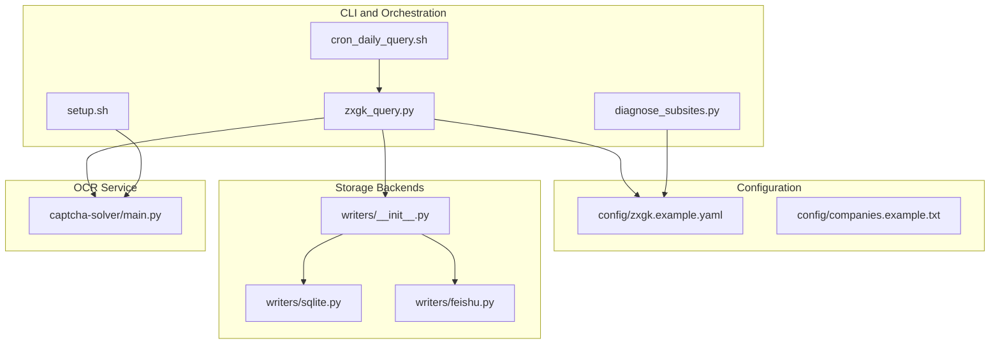
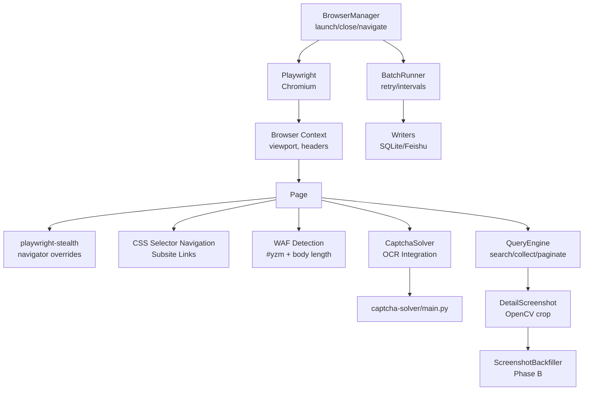
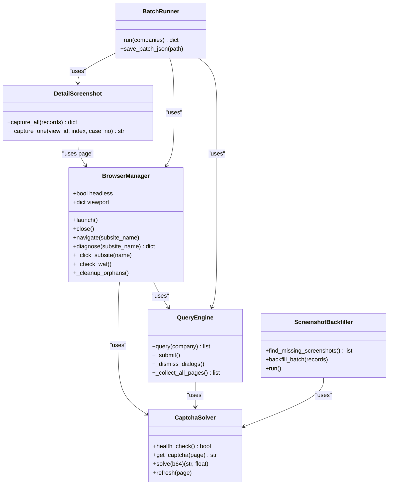
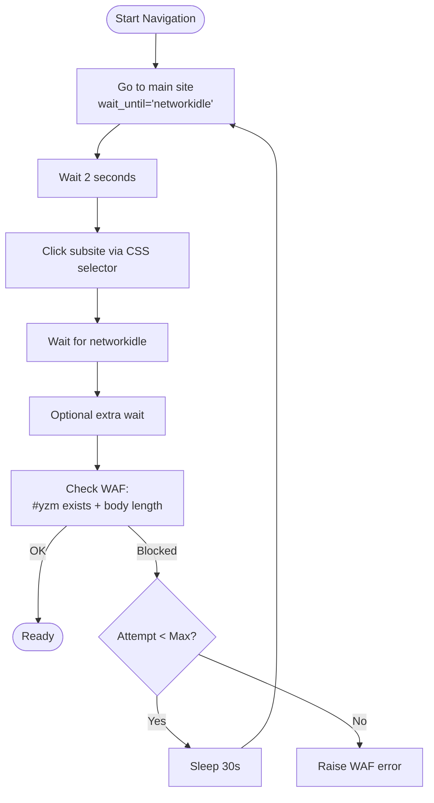
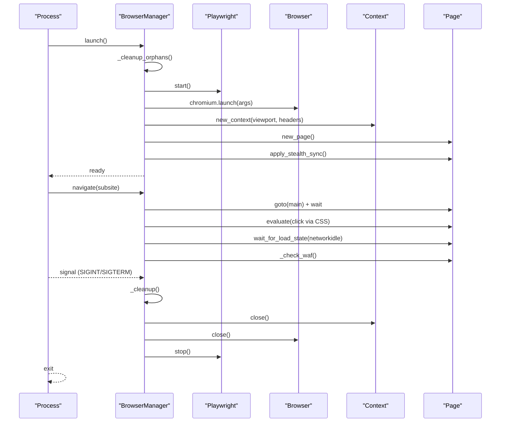
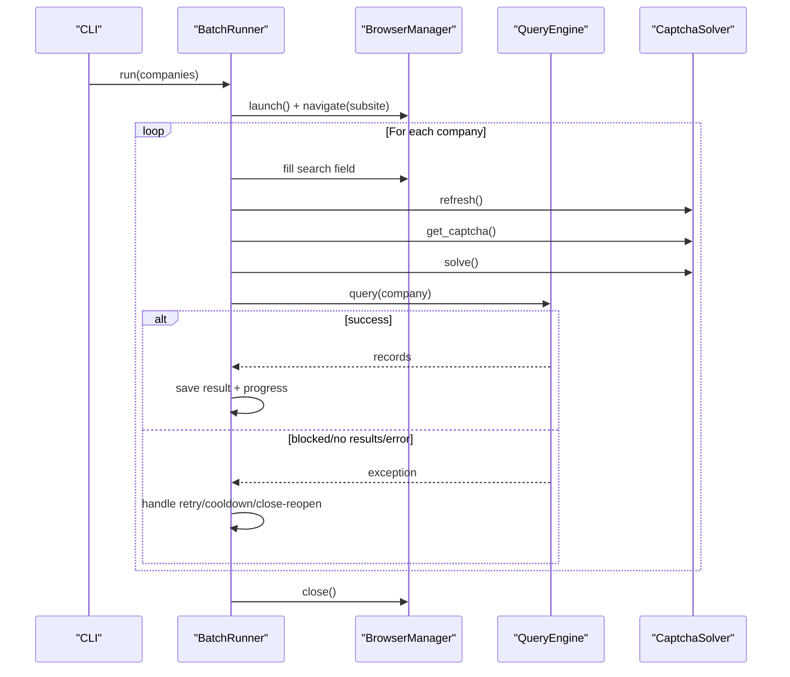
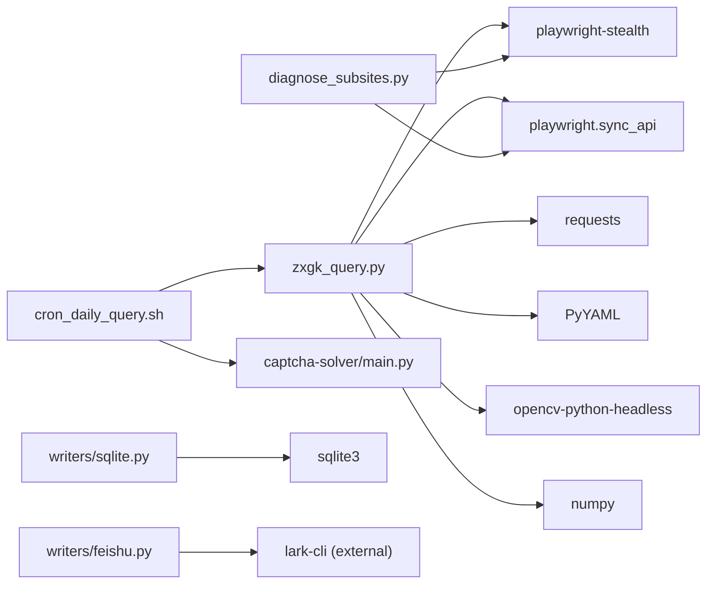

# Browser Automation System

<cite>
**Referenced Files in This Document**
- [README.md](file://README.md)
- [SKILL.md](file://SKILL.md)
- [zxgk_query.py](file://zxgk_query.py)
- [diagnose_subsites.py](file://diagnose_subsites.py)
- [cron_daily_query.sh](file://cron_daily_query.sh)
- [setup.sh](file://setup.sh)
- [config/zxgk.example.yaml](file://config/zxgk.example.yaml)
- [config/companies.example.txt](file://config/companies.example.txt)
- [captcha-solver/main.py](file://captcha-solver/main.py)
- [writers/__init__.py](file://writers/__init__.py)
- [writers/sqlite.py](file://writers/sqlite.py)
- [writers/feishu.py](file://writers/feishu.py)
</cite>

## Table of Contents
1. [Introduction](#introduction)
2. [Project Structure](#project-structure)
3. [Core Components](#core-components)
4. [Architecture Overview](#architecture-overview)
5. [Detailed Component Analysis](#detailed-component-analysis)
6. [Dependency Analysis](#dependency-analysis)
7. [Performance Considerations](#performance-considerations)
8. [Troubleshooting Guide](#troubleshooting-guide)
9. [Conclusion](#conclusion)
10. [Appendices](#appendices)

## Introduction
This document describes the browser automation system that powers the Execution Information Query System. It focuses on the BrowserManager class architecture, stealth configuration with playwright-stealth, process cleanup mechanisms, and multi-subsite navigation patterns. It also documents the stealth browser setup with custom headers, viewport configuration, and automation detection evasion techniques; WAF detection and bypass mechanisms including CSS selector-based navigation, DOM element validation, and automatic retry logic; browser lifecycle management, orphan process cleanup, and signal handling for graceful shutdown; practical examples of browser initialization, navigation sequences, and error recovery strategies; and performance considerations, memory management, and resource cleanup patterns.

## Project Structure
The project is organized around a CLI that orchestrates browser automation, OCR-based CAPTCHA solving, and optional storage backends. The browser automation core resides in the main CLI module, with supporting scripts for diagnostics, orchestration, and storage.

**Diagram sources**
- [zxgk_query.py:1-1612](file://zxgk_query.py#L1-L1612)
- [diagnose_subsites.py:1-429](file://diagnose_subsites.py#L1-L429)
- [cron_daily_query.sh:1-246](file://cron_daily_query.sh#L1-L246)
- [setup.sh:1-150](file://setup.sh#L1-L150)
- [config/zxgk.example.yaml:1-103](file://config/zxgk.example.yaml#L1-L103)
- [config/companies.example.txt:1-7](file://config/companies.example.txt#L1-L7)
- [writers/__init__.py:1-10](file://writers/__init__.py#L1-L10)
- [writers/sqlite.py:1-121](file://writers/sqlite.py#L1-L121)
- [writers/feishu.py:1-596](file://writers/feishu.py#L1-L596)
- [captcha-solver/main.py:1-215](file://captcha-solver/main.py#L1-L215)

**Section sources**
- [README.md:1-122](file://README.md#L1-L122)
- [SKILL.md:1-273](file://SKILL.md#L1-L273)

## Core Components
- BrowserManager: Manages Playwright Chromium lifecycle, applies stealth, navigates multi-subsite targets, validates WAF state, and performs cleanup.
- CaptchaSolver: Integrates with a local OCR service to extract and solve CAPTCHA images.
- QueryEngine: Orchestrates search submission, result collection, pagination, and dialog dismissal.
- DetailScreenshot: Captures detail popups and crops to popup region using OpenCV.
- ScreenshotBackfiller: Phase B backfill of missing screenshots by searching, validating, and uploading per case.
- BatchRunner: Coordinates batch queries with WAF-aware retries, intervals, and progress persistence.
- Writers: Pluggable storage backends (SQLite, Excel, Feishu).

**Section sources**
- [zxgk_query.py:175-324](file://zxgk_query.py#L175-L324)
- [zxgk_query.py:328-392](file://zxgk_query.py#L328-L392)
- [zxgk_query.py:396-618](file://zxgk_query.py#L396-L618)
- [zxgk_query.py:682-725](file://zxgk_query.py#L682-L725)
- [zxgk_query.py:776-1059](file://zxgk_query.py#L776-L1059)
- [zxgk_query.py:1065-1197](file://zxgk_query.py#L1065-L1197)
- [writers/__init__.py:1-10](file://writers/__init__.py#L1-L10)
- [writers/sqlite.py:1-121](file://writers/sqlite.py#L1-L121)
- [writers/feishu.py:1-596](file://writers/feishu.py#L1-L596)

## Architecture Overview
The system uses Playwright with playwright-stealth to emulate a real browser. It navigates the main site, clicks into subsites, solves CAPTCHAs via a local OCR service, submits queries, collects results, and optionally uploads screenshots to a backend.

**Diagram sources**
- [zxgk_query.py:175-324](file://zxgk_query.py#L175-L324)
- [zxgk_query.py:328-392](file://zxgk_query.py#L328-L392)
- [zxgk_query.py:396-618](file://zxgk_query.py#L396-L618)
- [zxgk_query.py:682-725](file://zxgk_query.py#L682-L725)
- [zxgk_query.py:776-1059](file://zxgk_query.py#L776-L1059)
- [zxgk_query.py:1065-1197](file://zxgk_query.py#L1065-L1197)
- [captcha-solver/main.py:1-215](file://captcha-solver/main.py#L1-L215)

## Detailed Component Analysis

### BrowserManager: Stealth, Navigation, and Cleanup
- Launch and context creation:
  - Initializes Playwright, launches Chromium with sandbox and automation flags disabled, sets viewport, locale, and Accept-Language headers.
  - Creates a new browser context and page.
- Stealth configuration:
  - Applies playwright-stealth with platform, languages, vendor, and WebGL overrides to reduce fingerprint detectability.
- Multi-subsite navigation:
  - Navigates to the main site, waits, clicks the target subsite via a CSS selector resolved from configuration, waits for network idle, and applies extra wait if configured.
- WAF detection and retry:
  - Validates presence of the CAPTCHA container element and body length; raises a WAF error if absent; retries up to a fixed number of attempts with delays.
- Orphan process cleanup:
  - Scans for and terminates lingering Chromium processes using process patterns before launching.
- Lifecycle hooks:
  - Provides context manager entry/exit and explicit close to ensure resources are released.
- Signal handling and atexit:
  - Registers handlers for SIGINT/SIGTERM and atexit to close the browser and exit cleanly.

**Diagram sources**
- [zxgk_query.py:175-324](file://zxgk_query.py#L175-L324)
- [zxgk_query.py:328-392](file://zxgk_query.py#L328-L392)
- [zxgk_query.py:396-618](file://zxgk_query.py#L396-L618)
- [zxgk_query.py:682-725](file://zxgk_query.py#L682-L725)
- [zxgk_query.py:776-1059](file://zxgk_query.py#L776-L1059)
- [zxgk_query.py:1065-1197](file://zxgk_query.py#L1065-L1197)

**Section sources**
- [zxgk_query.py:175-324](file://zxgk_query.py#L175-L324)

### WAF Detection and Bypass Mechanisms
- Detection:
  - Checks for the presence of the CAPTCHA container element and evaluates body length to infer WAF blocking.
- Bypass:
  - Automatic retry loop with delays; refreshes CAPTCHA on failures; dismisses overlays before reading results; handles “no results” and “captcha error” messages.
- Navigation robustness:
  - Uses CSS selectors resolved from configuration; validates click success and raises a dedicated navigation error if selector fails.

**Diagram sources**
- [zxgk_query.py:251-304](file://zxgk_query.py#L251-L304)

**Section sources**
- [zxgk_query.py:251-304](file://zxgk_query.py#L251-L304)

### Browser Lifecycle Management and Signal Handling
- Launch:
  - Starts Playwright, cleans orphans, creates browser/context/page, applies stealth, and stores a global reference for cleanup.
- Close:
  - Ensures orderly closure of context, browser, and Playwright, suppressing exceptions during cleanup.
- Orphan cleanup:
  - Uses process patterns to terminate lingering Chromium processes before launching.
- Graceful shutdown:
  - Registers signal handlers for SIGINT/SIGTERM to close the browser and exit with a signal-derived code.
- atexit:
  - Registers a cleanup hook to close the browser on normal termination.

**Diagram sources**
- [zxgk_query.py:195-232](file://zxgk_query.py#L195-L232)
- [zxgk_query.py:234-250](file://zxgk_query.py#L234-L250)
- [zxgk_query.py:78-94](file://zxgk_query.py#L78-L94)

**Section sources**
- [zxgk_query.py:78-94](file://zxgk_query.py#L78-L94)
- [zxgk_query.py:195-232](file://zxgk_query.py#L195-L232)
- [zxgk_query.py:234-250](file://zxgk_query.py#L234-L250)

### Practical Examples
- Browser initialization and navigation:
  - Initialize BrowserManager, launch, navigate to a subsite, and validate readiness.
- Error recovery:
  - Catch WAF errors and retry; refresh CAPTCHA on OCR failures; dismiss overlays before reading results.
- Batch execution:
  - Use BatchRunner to iterate companies with intervals, retries, and progress persistence.

**Diagram sources**
- [zxgk_query.py:1095-1197](file://zxgk_query.py#L1095-L1197)
- [zxgk_query.py:396-618](file://zxgk_query.py#L396-L618)
- [zxgk_query.py:328-392](file://zxgk_query.py#L328-L392)

**Section sources**
- [zxgk_query.py:1095-1197](file://zxgk_query.py#L1095-L1197)
- [zxgk_query.py:396-618](file://zxgk_query.py#L396-L618)
- [zxgk_query.py:328-392](file://zxgk_query.py#L328-L392)

### Configuration and Environment
- Browser configuration:
  - Headless mode, viewport, and proxy environment cleanup.
- WAF parameters:
  - CAPTCHA retries, cooldown on block, company interval, screenshot interval, and max consecutive failures.
- Subsites:
  - Names, CSS selectors, and extra wait durations.
- Output:
  - Directories for general output and screenshots.

**Section sources**
- [config/zxgk.example.yaml:11-44](file://config/zxgk.example.yaml#L11-L44)
- [config/zxgk.example.yaml:16-21](file://config/zxgk.example.yaml#L16-L21)
- [config/zxgk.example.yaml:94-96](file://config/zxgk.example.yaml#L94-L96)

## Dependency Analysis
- Internal dependencies:
  - BrowserManager depends on playwright-stealth and Playwright APIs.
  - QueryEngine depends on CaptchaSolver and DOM evaluation.
  - DetailScreenshot depends on OpenCV and Playwright screenshot APIs.
  - ScreenshotBackfiller depends on Feishu writer utilities for lookup and upload.
  - BatchRunner composes BrowserManager, QueryEngine, DetailScreenshot, and writers.
- External dependencies:
  - Playwright, playwright-stealth, requests, PyYAML, OpenCV, and FastAPI for OCR service.

**Diagram sources**
- [zxgk_query.py:38-39](file://zxgk_query.py#L38-L39)
- [setup.sh:39](file://setup.sh#L39)
- [diagnose_subsites.py:343-359](file://diagnose_subsites.py#L343-L359)
- [writers/sqlite.py:13](file://writers/sqlite.py#L13)
- [writers/feishu.py:56-65](file://writers/feishu.py#L56-L65)
- [captcha-solver/main.py:10](file://captcha-solver/main.py#L10)

**Section sources**
- [setup.sh:39](file://setup.sh#L39)
- [writers/sqlite.py:13](file://writers/sqlite.py#L13)
- [writers/feishu.py:56-65](file://writers/feishu.py#L56-L65)

## Performance Considerations
- Resource limits:
  - Chromium launched with sandbox disabled and dev-shm usage disabled to improve stability on constrained environments.
- Steady-state overhead:
  - playwright-stealth adds minimal overhead; ensure viewport matches typical desktop resolution to reduce layout shifts.
- Retry and backoff:
  - WAF retry delay and cooldown prevent overwhelming the target; tune based on observed blocking frequency.
- Memory management:
  - Close pages, contexts, and browsers explicitly; rely on atexit and signal handlers to ensure cleanup.
- I/O:
  - OpenCV cropping reduces disk I/O by operating in-memory; consider disabling screenshot storage if memory pressure is observed.
- Network:
  - Use local OCR service to minimize latency; ensure service health before automation.

[No sources needed since this section provides general guidance]

## Troubleshooting Guide
- WAF封禁 (WAF blocked):
  - Symptoms: absence of CAPTCHA element or short body length; automatic retry with cooldown.
  - Actions: wait for cooldown, verify subsite CSS selectors, and re-run.
- Subsite navigation failure:
  - Symptoms: CSS selector click returns false; navigation error raised.
  - Actions: update CSS selector in configuration; run diagnostic script to probe DOM.
- CAPTCHA solver unavailable:
  - Symptoms: health check fails; exit code indicates solver issue.
  - Actions: start OCR service, verify port availability, and confirm service endpoints.
- Orphan processes:
  - Symptoms: stale Chromium processes preventing new sessions.
  - Actions: run orphan cleanup routine before launching; ensure signal handlers are registered.
- Graceful shutdown:
  - Actions: send SIGINT/SIGTERM; verify atexit cleanup closes browser.

**Section sources**
- [zxgk_query.py:99-107](file://zxgk_query.py#L99-L107)
- [zxgk_query.py:271-277](file://zxgk_query.py#L271-L277)
- [zxgk_query.py:297-304](file://zxgk_query.py#L297-L304)
- [diagnose_subsites.py:103-130](file://diagnose_subsites.py#L103-L130)
- [cron_daily_query.sh:48-96](file://cron_daily_query.sh#L48-L96)
- [zxgk_query.py:234-250](file://zxgk_query.py#L234-L250)
- [zxgk_query.py:78-94](file://zxgk_query.py#L78-L94)

## Conclusion
The browser automation system integrates Playwright with stealth configuration, robust WAF detection and retry logic, and a modular architecture for navigation, OCR-based CAPTCHA solving, result collection, and optional screenshot upload. Its lifecycle management, signal handling, and cleanup routines ensure reliable operation across repeated runs and diverse environments.

[No sources needed since this section summarizes without analyzing specific files]

## Appendices

### Appendix A: Diagnostics and Setup
- Run diagnostics to probe DOM and validate subsite readiness.
- Install dependencies and configure OCR service; verify lark-cli authentication for Feishu integration.

**Section sources**
- [diagnose_subsites.py:333-429](file://diagnose_subsites.py#L333-L429)
- [setup.sh:1-150](file://setup.sh#L1-150)
- [SKILL.md:155-205](file://SKILL.md#L155-L205)

### Appendix B: Storage Backends
- SQLite writer supports storing records locally with optional screenshot paths or binary blobs.
- Feishu writer writes raw records, supports cross-reference updates, and uploads screenshots to case records.

**Section sources**
- [writers/sqlite.py:37-100](file://writers/sqlite.py#L37-L100)
- [writers/feishu.py:154-201](file://writers/feishu.py#L154-L201)
- [writers/feishu.py:369-478](file://writers/feishu.py#L369-L478)