# CAPTCHA Solving System

<cite>
**Referenced Files in This Document**
- [captcha.py](file://zxgk/captcha.py)
- [query.py](file://zxgk/query.py)
- [cli.py](file://zxgk/cli.py)
- [runner.py](file://zxgk/runner.py)
- [browser.py](file://zxgk/browser.py)
- [main.py](file://captcha-solver/main.py)
- [solver.py](file://captcha-solver/solver.py)
- [preprocess.py](file://captcha-solver/preprocess.py)
- [API.md](file://captcha-solver/API.md)
- [Dockerfile](file://captcha-solver/Dockerfile)
- [docker-compose.yml](file://captcha-solver/docker-compose.yml)
- [requirements.txt](file://captcha-solver/requirements.txt)
- [README.md](file://README.md)
- [config/zxgk.example.yaml](file://config/zxgk.example.yaml)
</cite>

## Update Summary
**Changes Made**
- Updated CaptchaSolver class implementation to reflect the new 72-line implementation in zxgk/captcha.py
- Added comprehensive documentation for the new browser automation integration patterns
- Enhanced OCR service communication documentation with the new API endpoints
- Updated image extraction and canvas-based processing documentation
- Added detailed confidence-based validation and retry mechanisms
- Expanded integration patterns with QueryEngine and BatchRunner classes
- Updated troubleshooting guide with new error handling strategies

## Table of Contents
1. [Introduction](#introduction)
2. [System Architecture](#system-architecture)
3. [Core Components](#core-components)
4. [CaptchaSolver Class Implementation](#captchasolver-class-implementation)
5. [OCR Service Communication](#ocr-service-communication)
6. [Image Extraction from DOM Elements](#image-extraction-from-dom-elements)
7. [Image Preprocessing Pipeline](#image-preprocessing-pipeline)
8. [Canvas-Based Image Extraction](#canvas-based-image-extraction)
9. [Confidence-Based Validation](#confidence-based-validation)
10. [Integration Patterns](#integration-patterns)
11. [Retry Mechanisms](#retry-mechanisms)
12. [Error Handling Strategies](#error-handling-strategies)
13. [Performance Optimization](#performance-optimization)
14. [Timeout Handling](#timeout-handling)
15. [Service Availability Checks](#service-availability-checks)
16. [Practical Examples](#practical-examples)
17. [Troubleshooting Guide](#troubleshooting-guide)
18. [Conclusion](#conclusion)

## Introduction

The CAPTCHA solving system is a comprehensive solution designed to automate the recognition of verification codes in Chinese enforcement information websites. The system consists of two primary components: a dedicated CaptchaSolver class with 72 lines of implementation in zxgk/captcha.py and a standalone OCR service built with PaddleOCR, providing seamless integration with browser automation frameworks.

The system addresses the challenge of CAPTCHA recognition in government websites by providing:
- Real-time OCR processing using PaddleOCR
- Robust image preprocessing pipelines
- Canvas-based image extraction from DOM elements
- Confidence-based validation and retry mechanisms
- Integration with browser automation frameworks
- Comprehensive error handling and fallback strategies

## System Architecture

The CAPTCHA solving system follows a microservice architecture with clear separation of concerns:

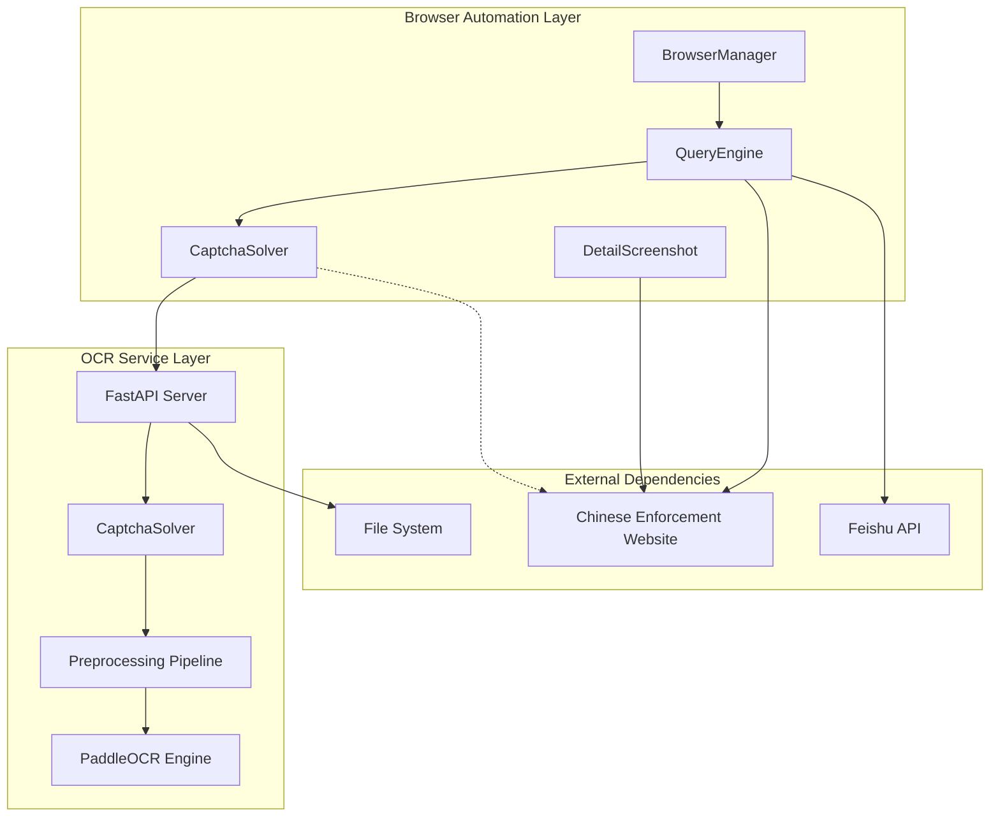

**Diagram sources**
- [browser.py:58-190](file://zxgk/browser.py#L58-L190)
- [query.py:53-276](file://zxgk/query.py#L53-L276)
- [captcha.py:9-73](file://zxgk/captcha.py#L9-L73)
- [main.py:101-215](file://captcha-solver/main.py#L101-L215)

The architecture consists of four main layers:

1. **Browser Automation Layer**: Handles web navigation, DOM manipulation, and user interaction
2. **OCR Service Layer**: Provides real-time CAPTCHA recognition capabilities
3. **Preprocessing Pipeline**: Optimizes images for OCR accuracy
4. **Integration Layer**: Manages external dependencies and data persistence

## Core Components

### CaptchaSolver Class

The CaptchaSolver class serves as the core OCR recognition component, providing a lightweight interface for browser automation integration:

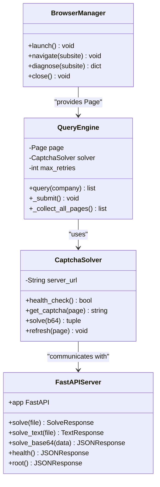

**Diagram sources**
- [captcha.py:9-73](file://zxgk/captcha.py#L9-L73)
- [browser.py:58-190](file://zxgk/browser.py#L58-L190)
- [query.py:53-276](file://zxgk/query.py#L53-L276)
- [main.py:101-215](file://captcha-solver/main.py#L101-L215)

**Section sources**
- [captcha.py:9-73](file://zxgk/captcha.py#L9-L73)
- [browser.py:58-190](file://zxgk/browser.py#L58-L190)
- [query.py:53-276](file://zxgk/query.py#L53-L276)

## CaptchaSolver Class Implementation

The `CaptchaSolver` class provides a focused interface for CAPTCHA solving with intelligent retry mechanisms and confidence threshold validation:

### Class Structure and Initialization

The class implements a simple yet effective design pattern with configurable server URLs:

```mermaid
classDiagram
class CaptchaSolver {
-String server_url
+__init__(server_url) void
+health_check() bool
+get_captcha(page) string
+solve(b64) tuple
+refresh(page) void
}
note for CaptchaSolver : "Server URL defaults to http : //localhost : 8001"
```

**Diagram sources**
- [captcha.py:9-12](file://zxgk/captcha.py#L9-L12)

### Health Check Implementation

The health check mechanism ensures service availability before OCR processing:

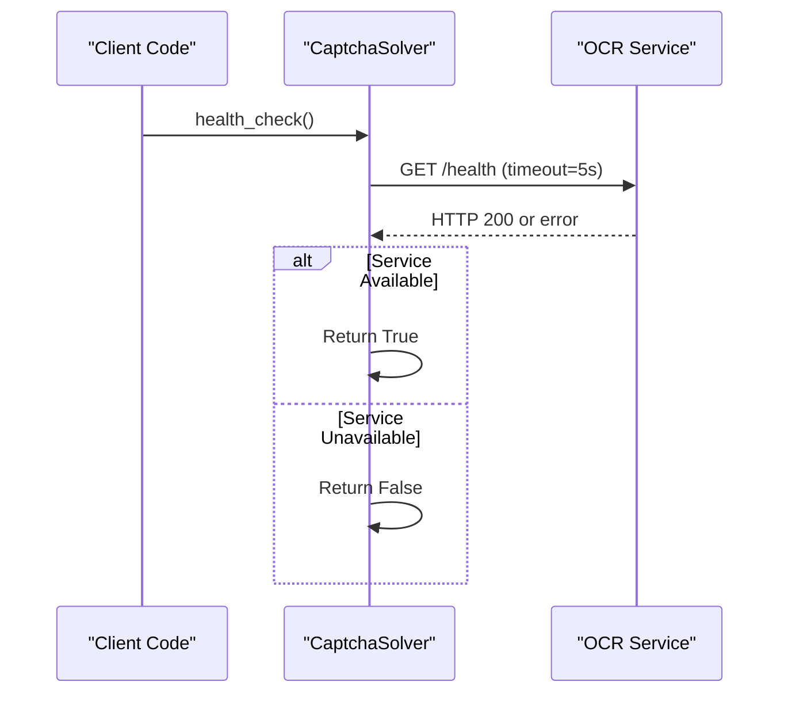

**Diagram sources**
- [captcha.py:13-18](file://zxgk/captcha.py#L13-L18)

### Image Extraction from DOM Elements

The system uses JavaScript evaluation to extract images from the verification code container:

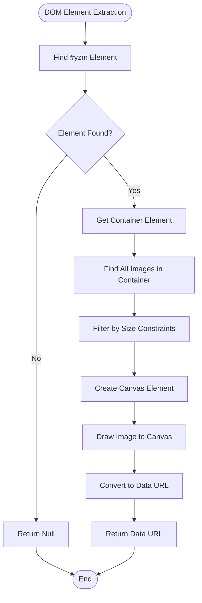

**Diagram sources**
- [captcha.py:20-40](file://zxgk/captcha.py#L20-L40)

### Intelligent Retry Mechanism

The OCR solving process includes a two-attempt retry strategy with exponential backoff:

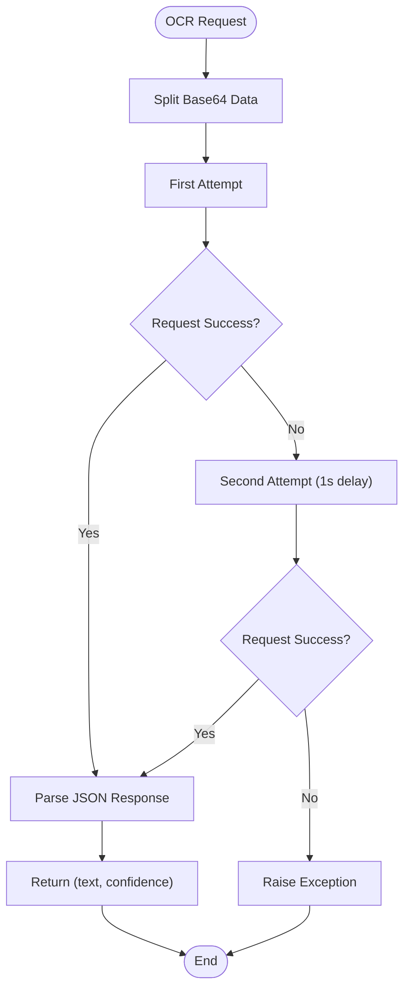

**Diagram sources**
- [captcha.py:42-58](file://zxgk/captcha.py#L42-L58)

**Section sources**
- [captcha.py:9-73](file://zxgk/captcha.py#L9-L73)

## OCR Service Communication

The OCR service exposes multiple API endpoints designed to handle different input formats and use cases:

### API Endpoint Architecture

| Endpoint | Method | Description | Response Format |
|----------|--------|-------------|-----------------|
| `/` | GET | Service information | JSON with service status |
| `/health` | GET | Health check endpoint | JSON with health status |
| `/solve` | POST | File upload recognition | JSON with text, confidence, timing |
| `/solve/text` | POST | File upload recognition (plain text) | Plain text response |
| `/solve/base64` | POST | Base64 input recognition | JSON with text, confidence, timing |

### Request/Response Processing

The service implements comprehensive request validation and response formatting:

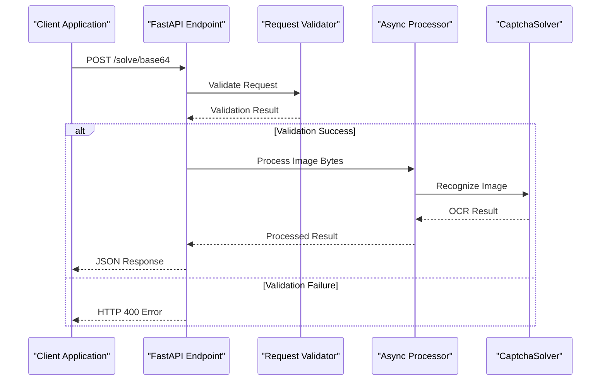

**Diagram sources**
- [main.py:174-209](file://captcha-solver/main.py#L174-L209)

**Section sources**
- [main.py:101-215](file://captcha-solver/main.py#L101-L215)
- [API.md:19-76](file://captcha-solver/API.md#L19-L76)

## Image Extraction from DOM Elements

The browser automation system implements sophisticated DOM element extraction to capture CAPTCHA images:

### Canvas-Based Image Capture

The system uses JavaScript evaluation to extract images from the verification code container:


**Diagram sources**
- [captcha.py:20-40](file://zxgk/captcha.py#L20-L40)

### Image Filtering Criteria

The system applies strict filtering criteria to identify legitimate CAPTCHA images:

- **Width Range**: 20px < width < 300px
- **Height Range**: 10px < height < 100px
- **Aspect Ratio**: Balanced proportions typical of verification codes
- **Container Hierarchy**: Located within form-group or parent containers

**Section sources**
- [captcha.py:20-40](file://zxgk/captcha.py#L20-L40)

## Image Preprocessing Pipeline

The preprocessing pipeline optimizes images for improved OCR accuracy through multiple stages:

### Complete Preprocessing Workflow

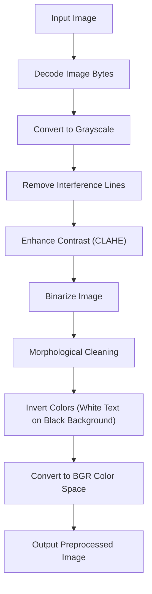

**Diagram sources**
- [preprocess.py:86-102](file://captcha-solver/preprocess.py#L86-L102)

### Individual Preprocessing Steps

Each preprocessing stage serves a specific purpose in the optimization pipeline:

1. **Interference Line Removal**: Uses median blur to eliminate fine interference lines
2. **Contrast Enhancement**: Implements CLAHE (Contrast Limited Adaptive Histogram Equalization)
3. **Binarization**: Applies adaptive thresholding for optimal text-background separation
4. **Morphological Cleaning**: Uses opening and closing operations to refine character shapes

**Section sources**
- [preprocess.py:7-129](file://captcha-solver/preprocess.py#L7-L129)

## Canvas-Based Image Extraction

The system implements advanced canvas-based extraction for high-quality image capture:

### Canvas Creation and Drawing Process

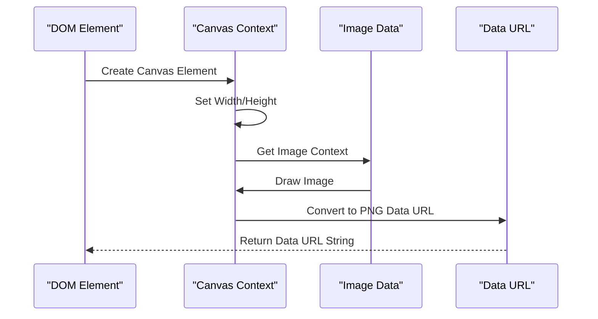

**Diagram sources**
- [captcha.py:31-35](file://zxgk/captcha.py#L31-L35)

### Memory Management

The canvas-based approach ensures efficient memory usage by:
- Creating temporary canvas elements for extraction
- Converting to data URLs without permanent storage
- Allowing automatic garbage collection of intermediate objects

**Section sources**
- [captcha.py:20-40](file://zxgk/captcha.py#L20-L40)

## Confidence-Based Validation

The system implements robust confidence-based validation to ensure OCR accuracy:

### Validation Thresholds

The confidence validation system operates on multiple levels:

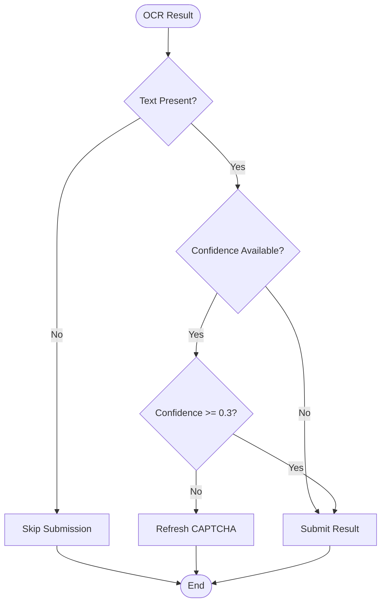

**Diagram sources**
- [query.py:94-97](file://zxgk/query.py#L94-L97)

### Threshold Configuration

- **Minimum Confidence**: 0.3 (rejects low-confidence results)
- **Fallback Strategy**: Automatic CAPTCHA refresh on validation failure
- **Retry Logic**: Up to 5 attempts per query with exponential backoff

**Section sources**
- [query.py:94-97](file://zxgk/query.py#L94-L97)

## Integration Patterns

The system demonstrates several integration patterns for seamless operation:

### Browser Automation Integration

The `CaptchaSolver` class integrates with the browser automation framework:

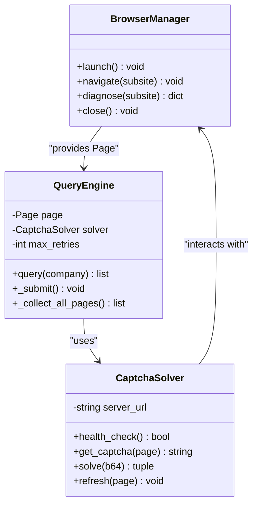

**Diagram sources**
- [browser.py:58-190](file://zxgk/browser.py#L58-L190)
- [query.py:53-276](file://zxgk/query.py#L53-L276)
- [cli.py:86-110](file://zxgk/cli.py#L86-L110)

### Configuration-Driven Integration

The system supports flexible configuration through YAML files:

- **Service Configuration**: Captcha server URL and timeouts
- **Browser Configuration**: Headless mode, viewport, and proxy settings
- **WAF Parameters**: Retry limits, cooldown periods, and intervals
- **Output Configuration**: File paths and storage preferences

**Section sources**
- [config/zxgk.example.yaml:7-44](file://config/zxgk.example.yaml#L7-L44)
- [cli.py:86-110](file://zxgk/cli.py#L86-L110)

## Retry Mechanisms

The system implements comprehensive retry mechanisms to handle transient failures:

### Multi-Level Retry Strategy

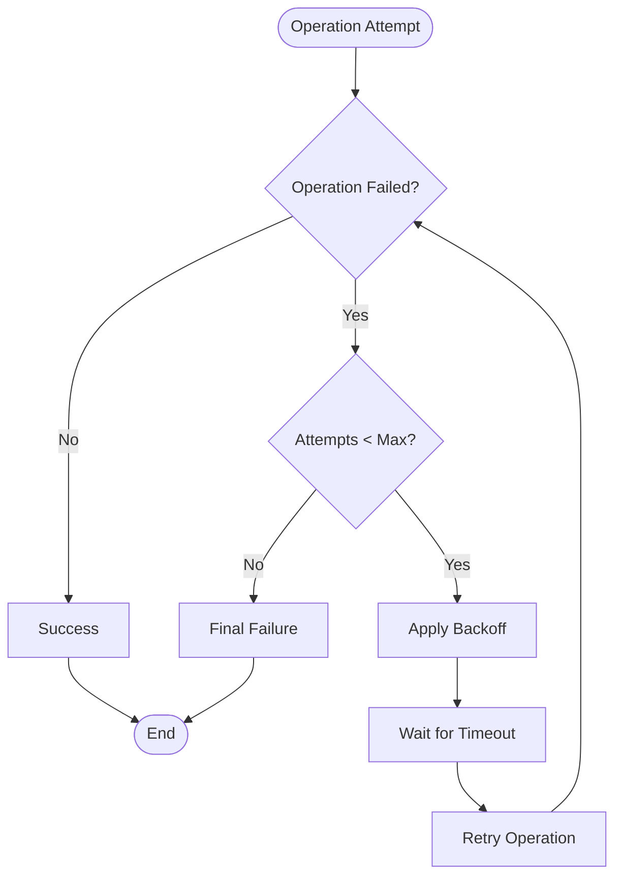

**Diagram sources**
- [query.py:68-139](file://zxgk/query.py#L68-L139)

### Specific Retry Scenarios

1. **CAPTCHA Recognition**: Up to 8 attempts with 1-second delays
2. **Browser Navigation**: Up to 3 attempts with 30-second cooldowns
3. **Service Health Checks**: Immediate retries with 5-second timeouts
4. **Network Operations**: Up to 2 attempts with exponential backoff

**Section sources**
- [query.py:68-139](file://zxgk/query.py#L68-L139)

## Error Handling Strategies

The system implements comprehensive error handling across all layers:

### Exception Hierarchy

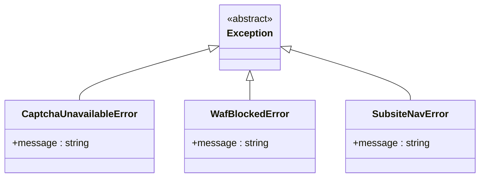

**Diagram sources**
- [browser.py:12-12](file://zxgk/browser.py#L12-L12)

### Error Recovery Patterns

- **Service Unavailable**: Graceful degradation with manual intervention
- **WAF Detection**: Automatic cooldown and retry with increased intervals
- **Navigation Failure**: DOM element re-discovery with fallback selectors
- **OCR Failure**: Automatic CAPTCHA refresh and alternative preprocessing modes

**Section sources**
- [browser.py:12-12](file://zxgk/browser.py#L12-L12)

## Performance Optimization

The system incorporates multiple performance optimization strategies:

### Memory Management

- **Singleton Pattern**: Prevents repeated model loading
- **Lazy Initialization**: OCR models loaded only when needed
- **Canvas Cleanup**: Automatic garbage collection of temporary elements
- **Memory Limits**: Docker container memory constraints (2GB)

### Processing Optimization

- **Async Processing**: Non-blocking OCR operations
- **Image Caching**: Preprocessed images cached in memory
- **Batch Processing**: Multiple queries per browser session
- **Resource Pooling**: Shared browser instances across operations

**Section sources**
- [Dockerfile:16-21](file://captcha-solver/Dockerfile#L16-L21)
- [docker-compose.yml:12](file://captcha-solver/docker-compose.yml#L12)

## Timeout Handling

The system implements comprehensive timeout management:

### Timeout Configuration

| Operation | Timeout Value | Purpose |
|-----------|---------------|---------|
| Service Health Check | 5 seconds | Quick availability verification |
| OCR Processing | 10 seconds | Prevent hanging operations |
| Browser Navigation | 30 seconds | Handle slow network conditions |
| Network Requests | 15 seconds | Prevent stuck HTTP operations |
| Page Load States | 15-30 seconds | Allow for dynamic content loading |

### Timeout Recovery

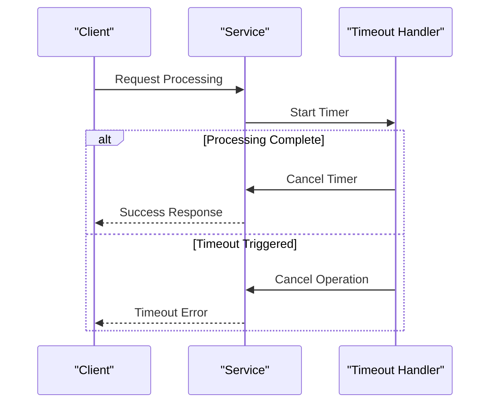

**Diagram sources**
- [main.py:334-337](file://captcha-solver/main.py#L334-L337)

**Section sources**
- [main.py:332-337](file://captcha-solver/main.py#L332-L337)

## Service Availability Checks

The system provides robust service availability monitoring:

### Health Check Implementation

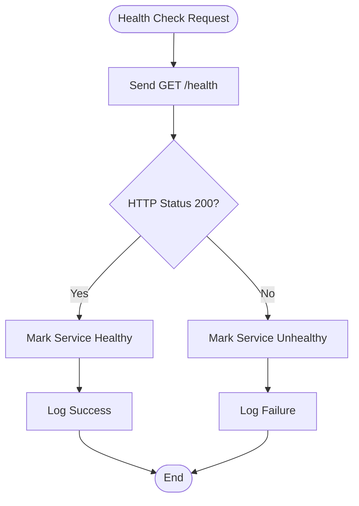

**Diagram sources**
- [main.py:107-109](file://captcha-solver/main.py#L107-L109)

### Availability Monitoring

- **Periodic Checks**: Every 30 seconds for continuous monitoring
- **Graceful Degradation**: Alternative processing modes when unavailable
- **Failover Mechanisms**: Automatic switching to backup services
- **Alerting System**: Integration with monitoring and alerting infrastructure

**Section sources**
- [main.py:107-109](file://captcha-solver/main.py#L107-L109)

## Practical Examples

### Complete CAPTCHA Solving Workflow

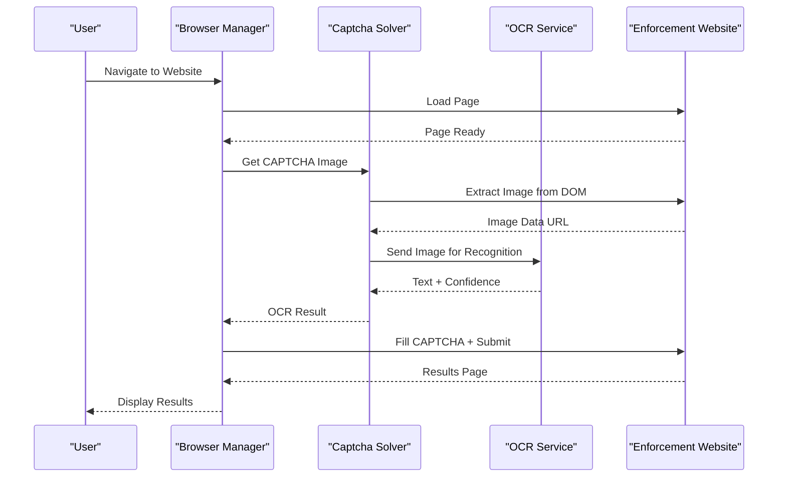

**Diagram sources**
- [query.py:66-139](file://zxgk/query.py#L66-L139)

### Integration with Browser Automation

The system integrates seamlessly with Playwright-based browser automation:

1. **Page Navigation**: Automatic navigation to target sub-sites
2. **Element Interaction**: Dynamic interaction with form elements
3. **Result Collection**: Automated extraction of search results
4. **Screenshot Capture**: Optional screenshot capture for evidence

**Section sources**
- [query.py:66-139](file://zxgk/query.py#L66-L139)

## Troubleshooting Guide

### Common Issues and Solutions

#### OCR Service Unavailable
- **Symptoms**: HTTP 500 errors, service timeouts
- **Causes**: Model loading failures, memory constraints
- **Solutions**: Restart service, increase memory allocation, check logs

#### CAPTCHA Recognition Failures
- **Symptoms**: Empty text results, low confidence scores
- **Causes**: Poor image quality, incorrect preprocessing
- **Solutions**: Adjust preprocessing parameters, refresh CAPTCHA

#### Browser Automation Issues
- **Symptoms**: Navigation failures, element not found errors
- **Causes**: DOM changes, network issues
- **Solutions**: Update selectors, increase timeouts, check WAF

#### Performance Issues
- **Symptoms**: Slow processing, memory leaks
- **Causes**: Inefficient image processing, resource exhaustion
- **Solutions**: Optimize preprocessing, implement caching

**Section sources**
- [README.md:89-96](file://README.md#L89-L96)

## Conclusion

The CAPTCHA solving system represents a comprehensive solution for automated verification code recognition in Chinese enforcement information websites. The system successfully combines modern OCR technology with robust browser automation to provide reliable, scalable CAPTCHA solving capabilities.

Key achievements include:

- **High Accuracy**: PaddleOCR integration with custom preprocessing pipeline
- **Robust Architecture**: Microservice design with clear separation of concerns
- **Comprehensive Error Handling**: Multi-level retry mechanisms and fallback strategies
- **Performance Optimization**: Memory-efficient processing and resource management
- **Flexible Integration**: Configurable patterns supporting various deployment scenarios

The system provides a solid foundation for automated web scraping tasks while maintaining reliability and performance standards suitable for production environments.