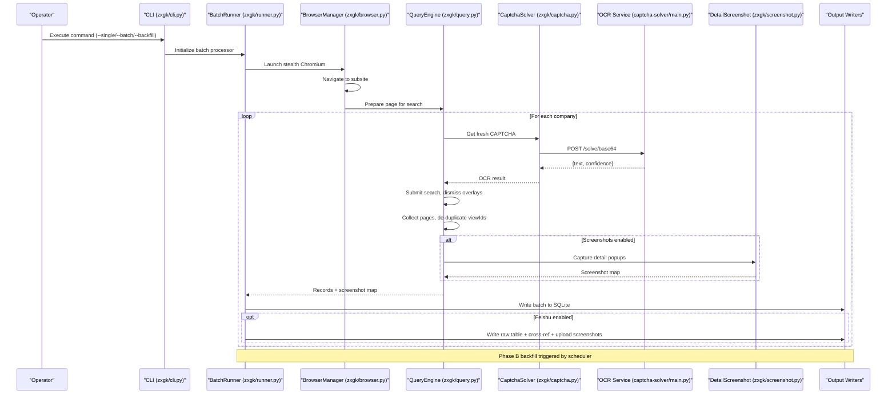
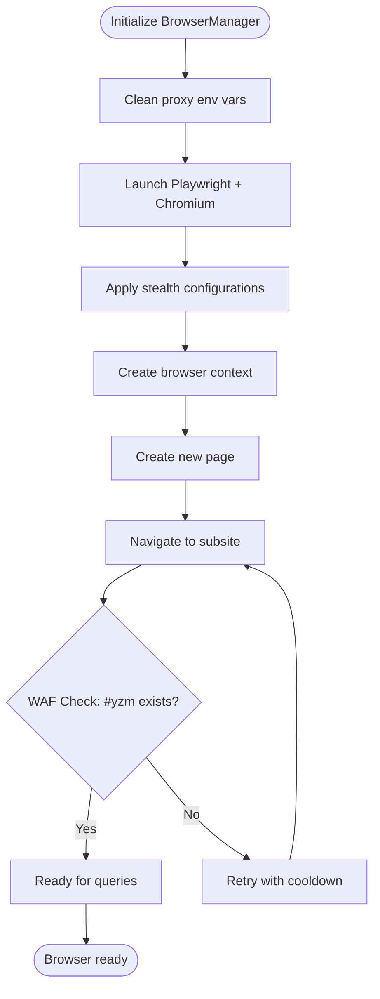
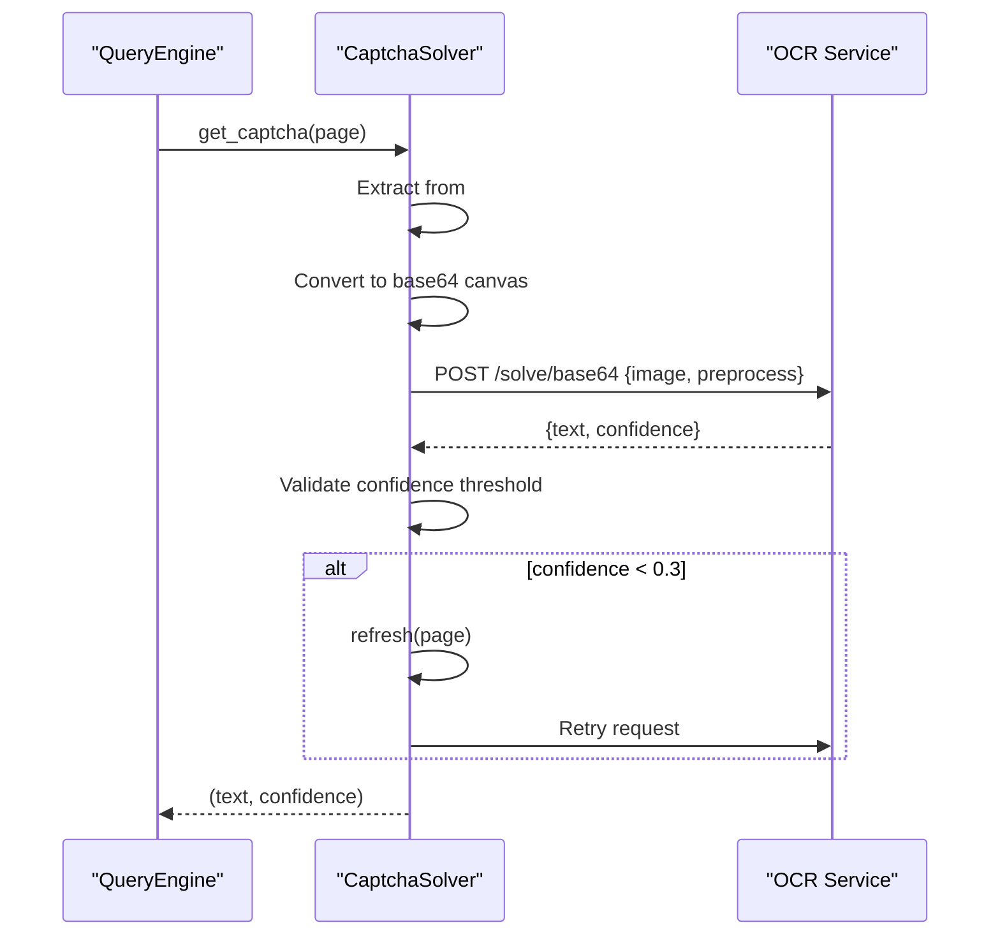
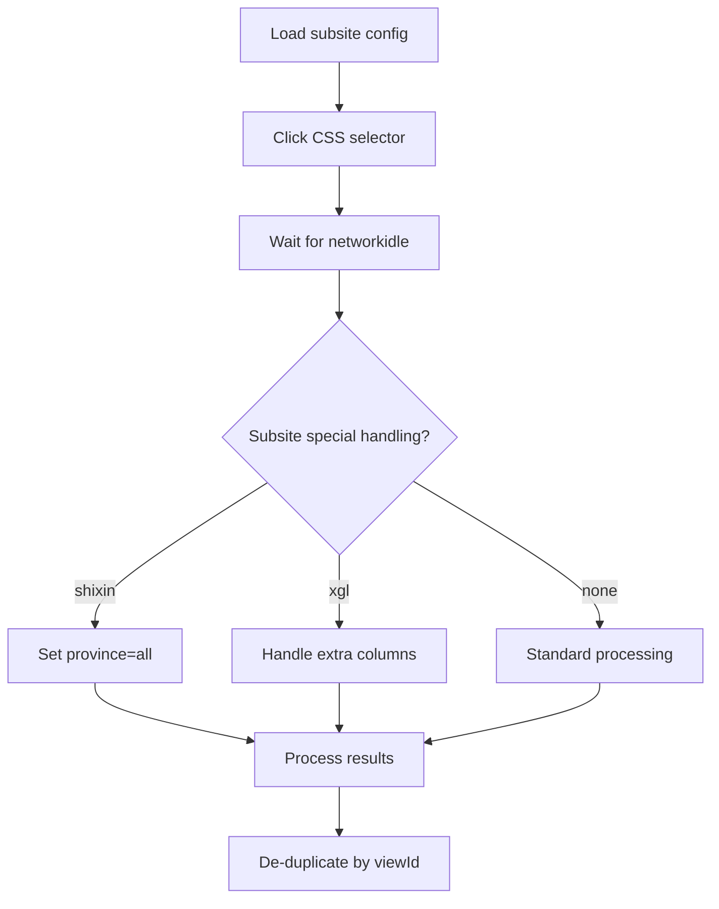
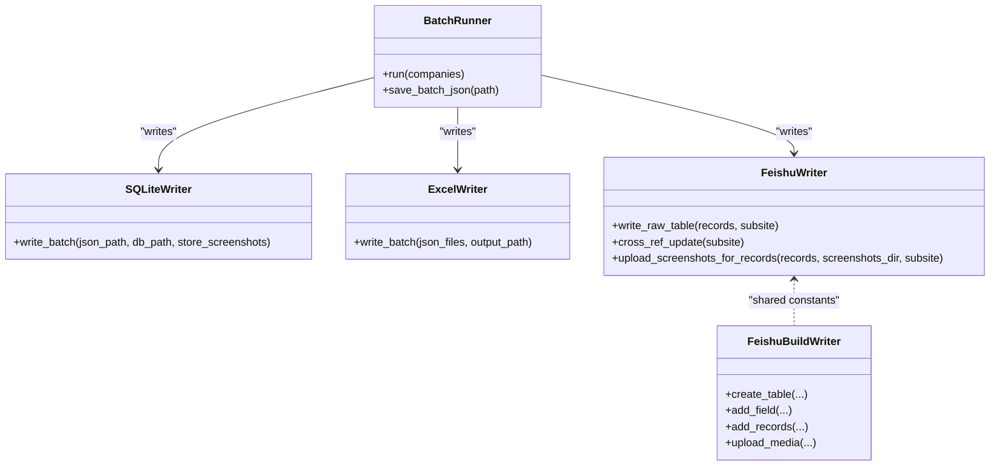
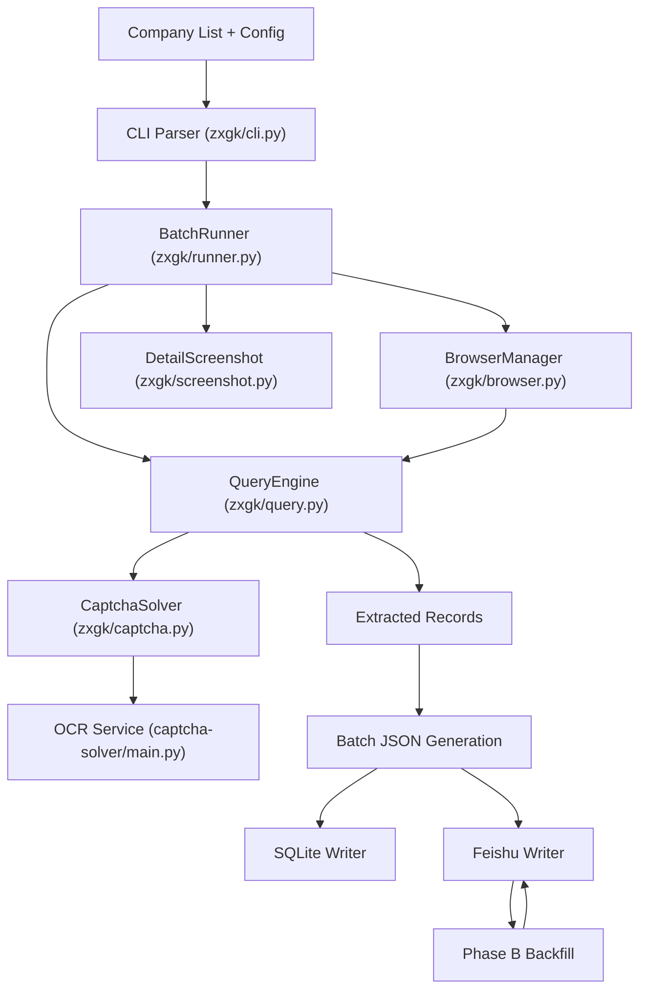
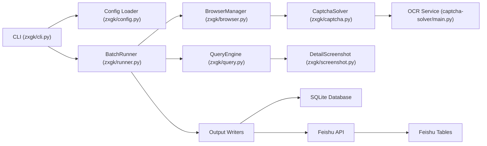

# Core Architecture

<cite>
**Referenced Files in This Document**
- [README.md](file://README.md)
- [SKILL.md](file://SKILL.md)
- [zxgk_query.py](file://zxgk_query.py)
- [diagnose_subsites.py](file://diagnose_subsites.py)
- [cron_daily_query.sh](file://cron_daily_query.sh)
- [setup.sh](file://setup.sh)
- [smoke_test.sh](file://smoke_test.sh)
- [config/zxgk.example.yaml](file://config/zxgk.example.yaml)
- [writers/__init__.py](file://writers/__init__.py)
- [writers/sqlite.py](file://writers/sqlite.py)
- [writers/excel.py](file://writers/excel.py)
- [writers/feishu.py](file://writers/feishu.py)
- [writers/feishu_build.py](file://writers/feishu_build.py)
- [captcha-solver/main.py](file://captcha-solver/main.py)
- [zxgk/__init__.py](file://zxgk/__init__.py)
- [zxgk/cli.py](file://zxgk/cli.py)
- [zxgk/browser.py](file://zxgk/browser.py)
- [zxgk/query.py](file://zxgk/query.py)
- [zxgk/captcha.py](file://zxgk/captcha.py)
- [zxgk/runner.py](file://zxgk/runner.py)
- [zxgk/screenshot.py](file://zxgk/screenshot.py)
- [zxgk/backfill.py](file://zxgk/backfill.py)
- [zxgk/config.py](file://zxgk/config.py)
- [zxgk/exceptions.py](file://zxgk/exceptions.py)
</cite>

## Update Summary
**Changes Made**
- Completely restructured the architecture overview to reflect the new modular package-based system
- Added detailed documentation for the 17-module package structure
- Updated component interactions to show proper separation of concerns
- Enhanced the modular architecture section with concrete module relationships
- Revised the project structure diagram to reflect the new package organization
- Added comprehensive documentation for the new zxgk package structure and its components

## Table of Contents
1. [Introduction](#introduction)
2. [Project Structure](#project-structure)
3. [Core Components](#core-components)
4. [Architecture Overview](#architecture-overview)
5. [Detailed Component Analysis](#detailed-component-analysis)
6. [Dependency Analysis](#dependency-analysis)
7. [Performance Considerations](#performance-considerations)
8. [Troubleshooting Guide](#troubleshooting-guide)
9. [Conclusion](#conclusion)
10. [Appendices](#appendices)

## Introduction
This document describes the Execution Information Query System's core architecture, focusing on the browser automation pipeline, CAPTCHA solving subsystem, multi-subsite navigation patterns, and the extensible output writer ecosystem. The system has evolved from a single-file implementation to a comprehensive package-based system with proper separation of concerns across 17 modules, establishing a professional-grade framework for automated legal case data collection. It explains how CLI commands orchestrate Playwright-driven queries against the China Enforcement Information Public Network, how OCR-based CAPTCHA resolution is integrated, and how results are persisted locally and optionally synchronized to Feishu.

## Project Structure
The system is now organized into a comprehensive package-based architecture with 17 modules, each serving a specific functional responsibility:

**Core Package Structure**
- **zxgk/** - Main application package containing all core components
  - CLI entry points and command parsing
  - Browser automation management
  - Query processing and data extraction
  - CAPTCHA solving integration
  - Batch processing and orchestration
  - Screenshot capture and processing
  - Phase B backfill functionality
  - Configuration management and utilities
  - Custom exception definitions
- **writers/** - Pluggable output backend system
- **captcha-solver/** - Standalone OCR service container

```mermaid
graph TB
subgraph "Core Application Package (zxgk/)"
ZINIT["__init__.py<br/>Package version control"]
CLI["cli.py<br/>CLI entry point + argument parsing"]
BROWSER["browser.py<br/>Playwright browser management"]
QUERY["query.py<br/>Search + pagination + data extraction"]
CAPTCHA["captcha.py<br/>OCR client integration"]
RUNNER["runner.py<br/>Batch processing orchestration"]
SCREENSHOT["screenshot.py<br/>Detail popup capture"]
BACKFILL["backfill.py<br/>Phase B screenshot backfill"]
CONFIG["config.py<br/>Configuration loading + utilities"]
EXCEPTIONS["exceptions.py<br/>Custom exception types"]
END subgraph
subgraph "Output Writers (writers/)"
SQLITE["sqlite.py<br/>Local SQLite persistence"]
EXCEL["excel.py<br/>Excel export functionality"]
FEISHU["feishu.py<br/>Feishu API integration"]
FBUILD["feishu_build.py<br/>Table creation automation"]
END subgraph
subgraph "External Services"
OCR["captcha-solver/main.py<br/>FastAPI OCR service"]
CRON["cron_daily_query.sh<br/>Daily orchestrator"]
SETUP["setup.sh<br/>Environment bootstrap"]
SMOKE["smoke_test.sh<br/>Validation"]
DIAG["diagnose_subsites.py<br/>Site diagnostics"]
END subgraph
ZINIT --> CLI
CLI --> BROWSER
CLI --> QUERY
CLI --> CAPTCHA
CLI --> RUNNER
CLI --> SCREENSHOT
CLI --> BACKFILL
CLI --> CONFIG
CLI --> EXCEPTIONS
CLI --> SQLITE
CLI --> EXCEL
CLI --> FEISHU
BROWSER --> CAPTCHA
QUERY --> CAPTCHA
RUNNER --> BROWSER
RUNNER --> QUERY
RUNNER --> SCREENSHOT
BACKFILL --> BROWSER
BACKFILL --> CAPTCHA
BACKFILL --> SCREENSHOT
FEISHU --> FBUILD
CRON --> CLI
CRON --> SQLITE
CRON --> FEISHU
CRON --> FBUILD
OCR --> CAPTCHA
```

**Diagram sources**
- [zxgk/__init__.py:1-3](file://zxgk/__init__.py#L1-L3)
- [zxgk/cli.py:1-321](file://zxgk/cli.py#L1-L321)
- [zxgk/browser.py:1-190](file://zxgk/browser.py#L1-L190)
- [zxgk/query.py:1-276](file://zxgk/query.py#L1-L276)
- [zxgk/captcha.py:1-73](file://zxgk/captcha.py#L1-L73)
- [zxgk/runner.py:1-278](file://zxgk/runner.py#L1-L278)
- [zxgk/screenshot.py:1-116](file://zxgk/screenshot.py#L1-L116)
- [zxgk/backfill.py:1-296](file://zxgk/backfill.py#L1-L296)
- [zxgk/config.py:1-104](file://zxgk/config.py#L1-L104)
- [zxgk/exceptions.py:1-14](file://zxgk/exceptions.py#L1-L14)
- [writers/__init__.py:1-10](file://writers/__init__.py#L1-L10)

**Section sources**
- [README.md:97-122](file://README.md#L97-L122)
- [SKILL.md:225-247](file://SKILL.md#L225-L247)
- [zxgk/__init__.py:1-3](file://zxgk/__init__.py#L1-L3)

## Core Components

### CLI and Orchestration Layer
The CLI system has been completely restructured into a modular package architecture:
- **Command Entry Point**: `zxgk_query.py` serves as the main executable entry point
- **Argument Parsing**: Comprehensive CLI argument handling with subcommands
- **Mode Management**: Supports single, batch, backfill, and diagnose modes
- **Configuration Integration**: Seamless integration with YAML configuration system

### Browser Automation Framework
The browser management system provides robust automation capabilities:
- **Stealth Browser Initialization**: Playwright with comprehensive stealth configurations
- **Multi-subsite Navigation**: Configurable navigation patterns for different court systems
- **WAF Detection**: Advanced WAF blocking detection and recovery mechanisms
- **Session Management**: Graceful browser lifecycle management with cleanup

### Query Processing Engine
The query system handles complex search operations:
- **CAPTCHA Integration**: Seamless OCR integration with confidence-based filtering
- **Result Extraction**: Sophisticated data extraction from dynamic web content
- **Pagination Handling**: Intelligent pagination with de-duplication logic
- **Error Recovery**: Robust retry mechanisms and failure handling

### CAPTCHA Solving Infrastructure
The OCR system provides reliable text recognition:
- **Client Integration**: Direct integration with FastAPI-based OCR service
- **Health Monitoring**: Automatic service availability checking
- **Confidence Filtering**: Intelligent quality assessment and rejection
- **Fallback Mechanisms**: Graceful handling of OCR failures

### Batch Processing and Orchestration
The batch system manages large-scale operations:
- **Progress Tracking**: Comprehensive progress monitoring and checkpointing
- **Failure Recovery**: Automatic recovery from browser crashes and WAF blocks
- **Resource Management**: Efficient resource utilization with session limits
- **Output Generation**: Structured batch JSON generation for downstream processing

### Screenshot Capture and Processing
Advanced screenshot functionality:
- **Popup Detection**: Intelligent popup window detection using OpenCV
- **Region Extraction**: Precise cropping of relevant content areas
- **Quality Optimization**: High-quality image processing and storage
- **Batch Processing**: Efficient handling of multiple screenshot operations

### Phase B Backfill System
The backfill system handles missing screenshot recovery:
- **Missing Detection**: Automated identification of records needing screenshots
- **Re-Query Logic**: Intelligent re-querying of specific records
- **Upload Automation**: Streamlined screenshot upload and field updates
- **Cross-Reference Integrity**: Maintains data integrity across all systems

### Configuration and Utility Systems
Comprehensive configuration management:
- **YAML Loading**: Flexible configuration file loading with environment variable support
- **Company List Management**: Support for both YAML and plain text company lists
- **Date Parsing**: Robust date parsing for legal case timestamp handling
- **Environment Cleanup**: Proxy and environment variable management

### Exception Handling Framework
Structured error handling:
- **WAF Blocking Detection**: Specific handling for site protection mechanisms
- **Service Unavailability**: Graceful handling of external service failures
- **Navigation Errors**: Specific error types for site structure changes
- **Application-Level Errors**: Comprehensive error categorization and reporting

**Section sources**
- [zxgk_query.py:1-26](file://zxgk_query.py#L1-L26)
- [zxgk/cli.py:1-321](file://zxgk/cli.py#L1-L321)
- [zxgk/browser.py:1-190](file://zxgk/browser.py#L1-L190)
- [zxgk/query.py:1-276](file://zxgk/query.py#L1-L276)
- [zxgk/captcha.py:1-73](file://zxgk/captcha.py#L1-L73)
- [zxgk/runner.py:1-278](file://zxgk/runner.py#L1-L278)
- [zxgk/screenshot.py:1-116](file://zxgk/screenshot.py#L1-L116)
- [zxgk/backfill.py:1-296](file://zxgk/backfill.py#L1-L296)
- [zxgk/config.py:1-104](file://zxgk/config.py#L1-L104)
- [zxgk/exceptions.py:1-14](file://zxgk/exceptions.py#L1-L14)

## Architecture Overview
The system follows a staged pipeline with clear module boundaries and responsibilities:

**Phase A: Text Query and Storage**
- Input: Company list and configuration files
- Processing: Modular CLI → Browser automation → Query execution → Result extraction
- Storage: Batch JSON generation with embedded screenshot mappings
- Persistence: SQLite backup with optional screenshot storage

**Phase B: Screenshot Backfill**
- Detection: Automated identification of missing screenshots in Feishu
- Re-Query: Intelligent re-querying of specific records
- Upload: Streamlined screenshot upload and field updates
- Integration: Seamless integration with existing data flows



**Diagram sources**
- [zxgk/cli.py:281-321](file://zxgk/cli.py#L281-L321)
- [zxgk/runner.py:45-145](file://zxgk/runner.py#L45-L145)
- [zxgk/browser.py:117-143](file://zxgk/browser.py#L117-L143)
- [zxgk/query.py:66-139](file://zxgk/query.py#L66-L139)
- [zxgk/captcha.py:42-73](file://zxgk/captcha.py#L42-L73)
- [zxgk/screenshot.py:75-116](file://zxgk/screenshot.py#L75-L116)

## Detailed Component Analysis

### Modular Package Architecture
The system is built around a clean package structure that promotes maintainability and extensibility:

**Package Organization Principles**
- **Single Responsibility**: Each module has a focused purpose
- **Clear Interfaces**: Well-defined public APIs between modules
- **Configuration-Driven**: External configuration controls behavior
- **Plugin Architecture**: Writers and other components are pluggable

**Module Dependencies**
- Core modules depend on shared configuration and utilities
- CLI orchestrates all major components
- Writers are independent and can be used standalone
- External services are loosely coupled through well-defined interfaces

```mermaid
graph TB
subgraph "Core Dependencies"
CONFIG["zxgk/config.py<br/>Shared utilities & constants"]
EXCEPT["zxgk/exceptions.py<br/>Error types"]
END subgraph
subgraph "Primary Modules"
CLI["zxgk/cli.py<br/>Command orchestration"]
BROWSER["zxgk/browser.py<br/>Browser management"]
QUERY["zxgk/query.py<br/>Data extraction"]
CAPTCHA["zxgk/captcha.py<br/>OCR integration"]
RUNNER["zxgk/runner.py<br/>Batch processing"]
SCREENSHOT["zxgk/screenshot.py<br/>Image processing"]
BACKFILL["zxgk/backfill.py<br/>Phase B recovery"]
END subgraph
subgraph "Supporting Modules"
INIT["zxgk/__init__.py<br/>Package metadata"]
END subgraph
CONFIG --> CLI
CONFIG --> BROWSER
CONFIG --> QUERY
CONFIG --> CAPTCHA
CONFIG --> RUNNER
CONFIG --> SCREENSHOT
CONFIG --> BACKFILL
EXCEPT --> BROWSER
EXCEPT --> QUERY
EXCEPT --> BACKFILL
CLI --> BROWSER
CLI --> QUERY
CLI --> CAPTCHA
CLI --> RUNNER
CLI --> SCREENSHOT
CLI --> BACKFILL
BROWSER --> CAPTCHA
QUERY --> CAPTCHA
RUNNER --> BROWSER
RUNNER --> QUERY
RUNNER --> SCREENSHOT
BACKFILL --> BROWSER
BACKFILL --> CAPTCHA
BACKFILL --> SCREENSHOT
```

**Diagram sources**
- [zxgk/config.py:1-104](file://zxgk/config.py#L1-L104)
- [zxgk/exceptions.py:1-14](file://zxgk/exceptions.py#L1-L14)
- [zxgk/cli.py:1-321](file://zxgk/cli.py#L1-L321)
- [zxgk/browser.py:1-190](file://zxgk/browser.py#L1-190)
- [zxgk/query.py:1-276](file://zxgk/query.py#L1-L276)
- [zxgk/captcha.py:1-73](file://zxgk/captcha.py#L1-L73)
- [zxgk/runner.py:1-278](file://zxgk/runner.py#L1-L278)
- [zxgk/screenshot.py:1-116](file://zxgk/screenshot.py#L1-L116)
- [zxgk/backfill.py:1-296](file://zxgk/backfill.py#L1-L296)
- [zxgk/__init__.py:1-3](file://zxgk/__init__.py#L1-L3)

### Browser Automation and Navigation
The browser management system provides enterprise-grade automation capabilities:

**Stealth Configuration**
- Comprehensive browser arguments for bypassing detection
- Locale and header customization for Chinese sites
- Signal handling for graceful shutdown
- Process cleanup for orphaned browser instances

**Navigation Intelligence**
- Configurable CSS selectors for different subsites
- Special handling for subsite-specific requirements
- WAF detection with automatic retry logic
- Timeout management and state verification

**Session Resilience**
- Automatic browser restart after failures
- Progress checkpointing for long-running operations
- Memory leak prevention through controlled lifecycle
- Concurrent operation limits and pacing



**Diagram sources**
- [zxgk/browser.py:78-104](file://zxgk/browser.py#L78-L104)
- [zxgk/browser.py:117-143](file://zxgk/browser.py#L117-L143)
- [zxgk/browser.py:163-170](file://zxgk/browser.py#L163-L170)

**Section sources**
- [zxgk/browser.py:1-190](file://zxgk/browser.py#L1-L190)
- [zxgk/config.py:24-31](file://zxgk/config.py#L24-L31)

### CAPTCHA Solving System
The OCR integration provides robust text recognition capabilities:

**Client-Side Processing**
- Intelligent CAPTCHA image extraction from page elements
- Canvas-based image processing for optimal quality
- Base64 encoding for efficient transmission
- Preprocessing configuration for different OCR models

**Service Integration**
- Health check endpoint verification
- Configurable retry logic for transient failures
- Confidence-based quality filtering
- Error handling for service unavailability

**Quality Assurance**
- Threshold-based rejection of low-confidence results
- Automatic CAPTCHA refresh on failures
- Comprehensive logging of OCR operations
- Graceful degradation when service is unavailable



**Diagram sources**
- [zxgk/query.py:81-97](file://zxgk/query.py#L81-L97)
- [zxgk/captcha.py:20-73](file://zxgk/captcha.py#L20-L73)

**Section sources**
- [zxgk/captcha.py:1-73](file://zxgk/captcha.py#L1-L73)
- [zxgk/query.py:1-276](file://zxgk/query.py#L1-L276)

### Multi-Subsite Navigation Patterns
The system supports three distinct court subsystems with specialized handling:

**Configuration-Driven Navigation**
- Per-subsite CSS selectors for reliable element targeting
- Specialized wait times for subsite-specific loading patterns
- Consistent navigation interface across all subsites
- Error handling for DOM structure changes

**Subsite-Specific Features**
- **zhixing**: Standard execution information queries
- **shixin**: Additional province selection requirement
- **xgl**: Extra column handling for consumption restrictions
- Unified processing logic with subsite-specific adaptations

**Robustness Mechanisms**
- Automatic retry on navigation failures
- WAF detection and recovery
- Graceful degradation for missing elements
- Comprehensive error reporting



**Diagram sources**
- [zxgk/browser.py:144-161](file://zxgk/browser.py#L144-L161)
- [zxgk/query.py:72-78](file://zxgk/query.py#L72-L78)
- [config/zxgk.example.yaml:32-44](file://config/zxgk.example.yaml#L32-L44)

**Section sources**
- [zxgk/browser.py:1-190](file://zxgk/browser.py#L1-L190)
- [zxgk/query.py:1-276](file://zxgk/query.py#L1-L276)
- [config/zxgk.example.yaml:32-44](file://config/zxgk.example.yaml#L32-L44)

### Output Writers and Extensibility
The writer system provides a flexible, plugin-style architecture:

**Writer Interface Standardization**
- Consistent `write()` method signature across all writers
- Independent module execution capability
- Configurable output formats and storage options
- Error isolation between different output backends

**Storage Backend Variants**
- **SQLite Writer**: Zero-dependency local persistence with BLOB support
- **Excel Writer**: Tabular export for reporting and analysis
- **Feishu Writer**: Full API integration with cross-reference updates
- **Feishu Build Writer**: Automated table creation and initial population

**Integration Patterns**
- Writers are imported dynamically based on configuration
- Shared constants and utility functions across writers
- Configurable field mappings for different target systems
- Batch processing compatibility with all writers



**Diagram sources**
- [writers/sqlite.py:37-100](file://writers/sqlite.py#L37-L100)
- [writers/excel.py:56-73](file://writers/excel.py#L56-L73)
- [writers/feishu.py:154-201](file://writers/feishu.py#L154-L201)
- [writers/feishu.py:208-277](file://writers/feishu.py#L208-L277)
- [writers/feishu.py:369-478](file://writers/feishu.py#L369-L478)
- [writers/feishu_build.py:109-201](file://writers/feishu_build.py#L109-L201)

**Section sources**
- [writers/__init__.py:1-10](file://writers/__init__.py#L1-L10)
- [writers/sqlite.py:37-100](file://writers/sqlite.py#L37-L100)
- [writers/excel.py:56-73](file://writers/excel.py#L56-L73)
- [writers/feishu.py:154-201](file://writers/feishu.py#L154-L201)
- [writers/feishu.py:208-277](file://writers/feishu.py#L208-L277)
- [writers/feishu.py:369-478](file://writers/feishu.py#L369-L478)
- [writers/feishu_build.py:109-201](file://writers/feishu_build.py#L109-L201)

### Data Flow from Input to Output
The system implements a comprehensive data flow pipeline with clear module boundaries:

**Input Processing**
- Company list loading from YAML or plain text formats
- Configuration file processing with environment variable expansion
- Parameter validation and mode selection
- Batch ID generation and output directory preparation

**Processing Pipeline**
- CLI orchestration and mode dispatch
- Browser session management and navigation
- Query execution with CAPTCHA handling
- Result extraction and screenshot capture
- Batch JSON generation and validation

**Output Generation**
- Multiple output format support
- Feishu API integration with cross-reference updates
- SQLite database backup with screenshot storage
- Progress tracking and error reporting

**Backfill Operations**
- Missing screenshot detection in Feishu
- Intelligent re-querying of specific records
- Automated screenshot upload and field updates
- Data integrity maintenance across systems



**Diagram sources**
- [zxgk/cli.py:281-321](file://zxgk/cli.py#L281-L321)
- [zxgk/runner.py:45-145](file://zxgk/runner.py#L45-L145)
- [zxgk/browser.py:117-143](file://zxgk/browser.py#L117-L143)
- [zxgk/query.py:66-139](file://zxgk/query.py#L66-L139)
- [zxgk/captcha.py:42-73](file://zxgk/captcha.py#L42-L73)
- [writers/sqlite.py:37-100](file://writers/sqlite.py#L37-L100)
- [writers/feishu.py:556-591](file://writers/feishu.py#L556-L591)

**Section sources**
- [zxgk/cli.py:1-321](file://zxgk/cli.py#L1-L321)
- [zxgk/runner.py:1-278](file://zxgk/runner.py#L1-L278)
- [writers/sqlite.py:37-100](file://writers/sqlite.py#L37-L100)
- [writers/feishu.py:556-591](file://writers/feishu.py#L556-L591)

### Integration Patterns with External Services
The system integrates with multiple external services through well-defined interfaces:

**OCR Service Integration**
- RESTful API communication with health checking
- Configurable base URL and endpoint configuration
- Retry logic for transient service failures
- Quality filtering based on confidence scores

**Feishu API Integration**
- Comprehensive Bitable API coverage
- DuplexLink field handling for cross-references
- Media upload and file token management
- Record search and update operations

**Local Storage Integration**
- SQLite database for reliable local persistence
- Optional screenshot BLOB storage for complete backup
- File-based storage for scalability considerations
- Transactional integrity and concurrent access handling

**Containerized Service Management**
- Docker-based OCR service deployment
- Environment variable configuration
- Port management and conflict detection
- Health monitoring and automatic restart



**Diagram sources**
- [zxgk/cli.py:1-321](file://zxgk/cli.py#L1-L321)
- [zxgk/config.py:49-70](file://zxgk/config.py#L49-L70)
- [zxgk/captcha.py:13-18](file://zxgk/captcha.py#L13-L18)
- [writers/feishu.py:56-66](file://writers/feishu.py#L56-L66)
- [writers/feishu.py:82-126](file://writers/feishu.py#L82-L126)
- [writers/sqlite.py:37-100](file://writers/sqlite.py#L37-L100)

**Section sources**
- [zxgk/config.py:1-104](file://zxgk/config.py#L1-L104)
- [zxgk/captcha.py:13-18](file://zxgk/captcha.py#L13-L18)
- [writers/feishu.py:56-66](file://writers/feishu.py#L56-L66)
- [writers/feishu.py:82-126](file://writers/feishu.py#L82-L126)
- [writers/sqlite.py:37-100](file://writers/sqlite.py#L37-L100)

## Dependency Analysis
The modular architecture establishes clear dependency relationships that promote maintainability and testability:

**Internal Module Dependencies**
- **CLI Layer**: Depends on all core modules for full functionality
- **Core Modules**: Share common configuration and exception infrastructure
- **Batch System**: Orchestrates browser, query, and screenshot modules
- **Writer System**: Independent modules with shared interface contracts

**External Dependencies**
- **Playwright**: Core browser automation framework
- **Requests**: HTTP client for OCR service communication
- **OpenCV**: Image processing for screenshot extraction
- **PyYAML**: Configuration file parsing
- **ZoneInfo**: Timezone handling for date parsing

**Configuration-Driven Coupling**
- Subsite selectors and navigation parameters
- OCR service endpoint configuration
- Feishu table IDs and field mappings
- Output directory and file naming conventions

```mermaid
graph TB
subgraph "External Dependencies"
PLAYWRIGHT["Playwright"]
REQUESTS["Requests"]
OPENCV["OpenCV"]
PYAML["PyYAML"]
ZONEINFO["ZoneInfo"]
LARKCLI["lark-cli"]
END subgraph
subgraph "Internal Dependencies"
CLI["zxgk/cli.py"] --> BROWSER["zxgk/browser.py"]
CLI --> QUERY["zxgk/query.py"]
CLI --> CAPTCHA["zxgk/captcha.py"]
CLI --> RUNNER["zxgk/runner.py"]
CLI --> SCREENSHOT["zxgk/screenshot.py"]
CLI --> BACKFILL["zxgk/backfill.py"]
BROWSER --> PLAYWRIGHT
QUERY --> REQUESTS
CAPTCHA --> REQUESTS
RUNNER --> BROWSER
RUNNER --> QUERY
RUNNER --> SCREENSHOT
SCREENSHOT --> OPENCV
CONFIG["zxgk/config.py"] --> PYAML
CONFIG --> ZONEINFO
BACKFILL --> LARKCLI
END subgraph
```

**Diagram sources**
- [zxgk/cli.py:11-17](file://zxgk/cli.py#L11-L17)
- [zxgk/browser.py:8-12](file://zxgk/browser.py#L8-L12)
- [zxgk/query.py:4](file://zxgk/query.py#L4)
- [zxgk/captcha.py:4](file://zxgk/captcha.py#L4)
- [zxgk/runner.py:8-12](file://zxgk/runner.py#L8-L12)
- [zxgk/screenshot.py:5-8](file://zxgk/screenshot.py#L5-L8)
- [zxgk/config.py:9,6](file://zxgk/config.py#L9,L6)

**Section sources**
- [zxgk/cli.py:11-17](file://zxgk/cli.py#L11-L17)
- [zxgk/browser.py:8-12](file://zxgk/browser.py#L8-L12)
- [zxgk/query.py:4](file://zxgk/query.py#L4)
- [zxgk/captcha.py:4](file://zxgk/captcha.py#L4)
- [zxgk/runner.py:8-12](file://zxgk/runner.py#L8-L12)
- [zxgk/screenshot.py:5-8](file://zxgk/screenshot.py#L5-L8)
- [zxgk/config.py:9,6](file://zxgk/config.py#L9,L6)

## Performance Considerations
The modular architecture incorporates several performance optimization strategies:

**Browser Session Management**
- Single browser session reuse for batch operations
- Automatic restart after consecutive failures to prevent memory leaks
- Configurable session limits and resource constraints
- Graceful cleanup of browser processes and orphaned instances

**OCR Service Optimization**
- Health check caching to reduce unnecessary service calls
- Retry logic with exponential backoff for transient failures
- Confidence-based filtering to minimize OCR failures
- Batch processing capabilities for multiple requests

**I/O and Storage Optimization**
- SQLite BLOB storage option to avoid filesystem fragmentation
- Configurable screenshot storage modes (file, blob, both)
- Efficient JSON serialization and compression
- Parallel processing capabilities where appropriate

**Network and Resource Management**
- Configurable intervals between operations to avoid WAF detection
- Connection pooling and reuse for external service calls
- Memory management and garbage collection optimization
- Throttling mechanisms for rate-limited services

## Troubleshooting Guide
The modular architecture provides comprehensive error handling and diagnostic capabilities:

**WAF Block Detection and Recovery**
- Automatic detection of CAPTCHA-less pages indicating blockage
- Configurable retry logic with progressive backoff
- Session restart capability after repeated failures
- Detailed logging of block events and recovery attempts

**OCR Service Availability**
- Health check endpoint verification before processing
- Graceful degradation when OCR service is unavailable
- Alternative processing modes for partial functionality
- Comprehensive error reporting and recovery options

**Feishu Integration Issues**
- Authentication state verification and re-authentication
- Field mapping validation and error reporting
- Batch operation rollback capabilities
- Manual intervention points for complex scenarios

**Session and Process Management**
- Automatic cleanup of orphaned browser processes
- Signal handling for graceful shutdown during operations
- Memory leak prevention through controlled lifecycle management
- Progress checkpointing for recovery after interruptions

**Diagnostic Tools and Utilities**
- Built-in site readiness testing and WAF status checking
- Configuration validation and parameter verification
- Environment variable and dependency checking
- Comprehensive logging with debug-level verbosity

**Section sources**
- [zxgk/browser.py:163-170](file://zxgk/browser.py#L163-L170)
- [zxgk/captcha.py:13-18](file://zxgk/captcha.py#L13-L18)
- [writers/feishu.py:56-66](file://writers/feishu.py#L56-L66)
- [diagnose_subsites.py:103-330](file://diagnose_subsites.py#L103-L330)

## Conclusion
The Execution Information Query System has successfully evolved from a monolithic implementation to a sophisticated, modular package-based architecture. The new 17-module system provides clear separation of concerns, robust error handling, and extensive extensibility through the plugin-style writer system. The staged processing approach—Phase A for comprehensive text and screenshot collection, followed by Phase B for missing screenshot recovery—ensures complete data coverage and auditability.

The modular design enables independent development, testing, and maintenance of each component while maintaining seamless integration through well-defined interfaces. The configuration-driven approach allows for easy adaptation to changing site structures and external service requirements. This professional-grade framework establishes a solid foundation for automated legal case data collection with enterprise-level reliability and maintainability.

## Appendices

### Configuration Reference
The system uses a comprehensive YAML-based configuration system:

**Core Configuration Keys**
- `captcha_server`: OCR service base URL with health check endpoint
- `browser`: Headless mode, viewport dimensions, and launch arguments
- `waf`: Comprehensive WAF handling parameters including retry counts and timing
- `screenshots`: Enable/disable and storage mode configuration
- `storage`: Screenshot storage preferences (file, blob, both)
- `subsites`: Three court subsystem configurations with CSS selectors
- `feishu`: Complete table and field mapping configuration
- `output`: Directory paths for results and screenshots
- `companies`: Company list for batch processing

**Configuration Loading and Resolution**
- Environment variable expansion for sensitive values
- Hierarchical configuration merging
- Default value provision for optional settings
- Type validation and parameter normalization

**Section sources**
- [config/zxgk.example.yaml:1-103](file://config/zxgk.example.yaml#L1-L103)
- [zxgk/config.py:49-70](file://zxgk/config.py#L49-L70)

### Exit Codes and Error States
The system provides comprehensive exit code reporting:

**Standard Exit Codes**
- `0`: Successful completion with results found
- `1`: No results found for requested queries
- `2`: WAF blocking detected requiring cooldown
- `3`: OCR service unavailable or unreachable
- `4`: Configuration or parameter validation failure

**Error State Classification**
- **Operational Errors**: Temporary failures with recovery options
- **Configuration Errors**: Invalid parameters or missing dependencies
- **Service Errors**: External service unavailability or errors
- **System Errors**: Resource constraints or environment issues

**Section sources**
- [README.md:89-96](file://README.md#L89-L96)
- [zxgk/cli.py:314-321](file://zxgk/cli.py#L314-L321)

### Module Development Guidelines
For extending the system with new modules:

**Interface Requirements**
- Clear function signatures and return value specifications
- Comprehensive error handling and logging
- Configuration parameter validation
- Unit test coverage for critical functionality

**Integration Patterns**
- Follow established import and dependency patterns
- Implement proper exception handling and propagation
- Provide configuration hooks for external parameters
- Document public APIs and usage examples

**Testing and Validation**
- Unit tests for individual module functionality
- Integration tests for module interactions
- Performance benchmarks for critical paths
- Security considerations for external service calls

**Section sources**
- [writers/__init__.py:1-10](file://writers/__init__.py#L1-L10)
- [zxgk/config.py:14-19](file://zxgk/config.py#L14-L19)