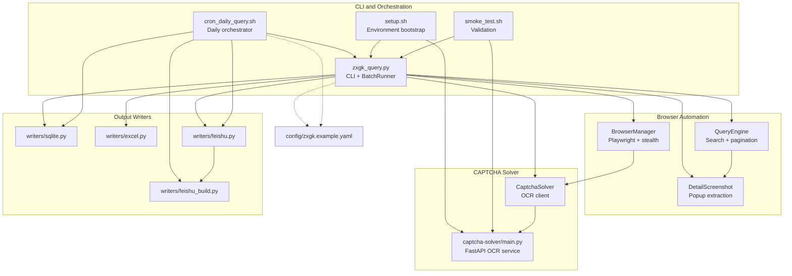
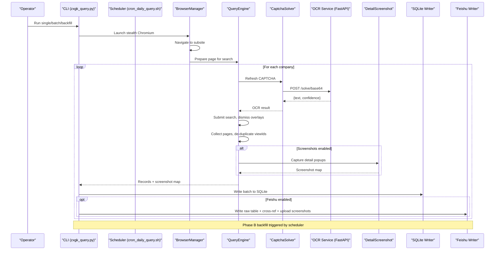
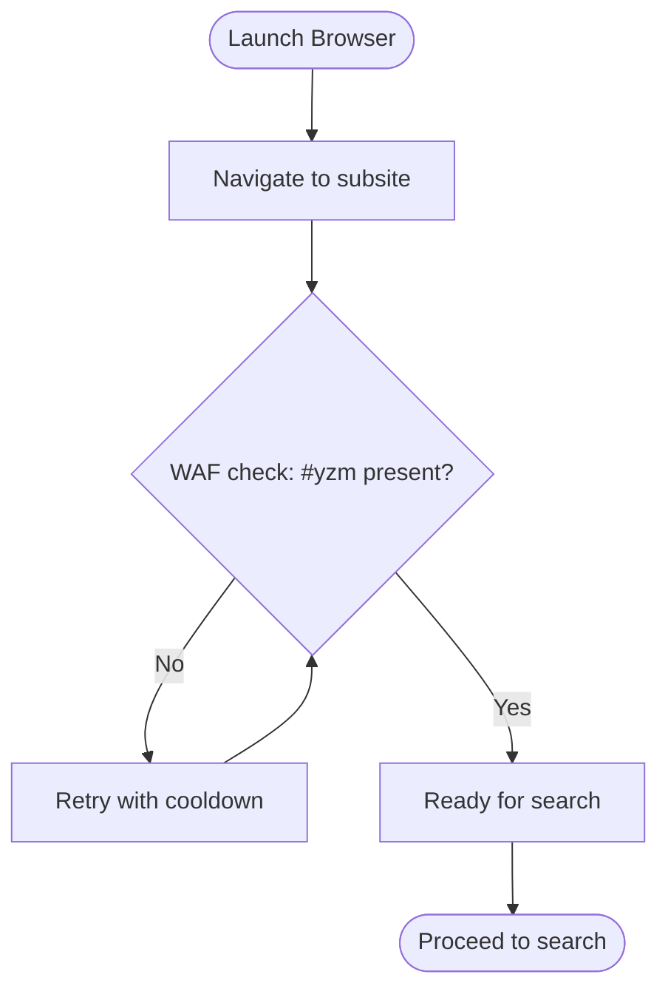
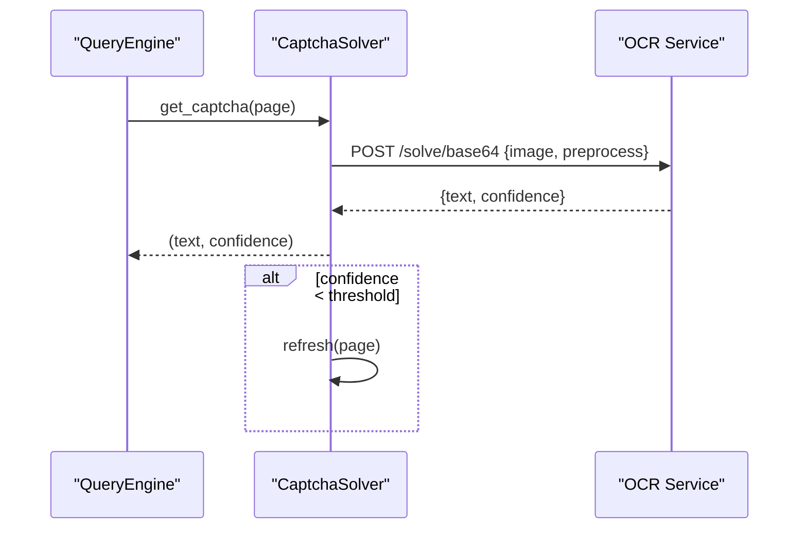
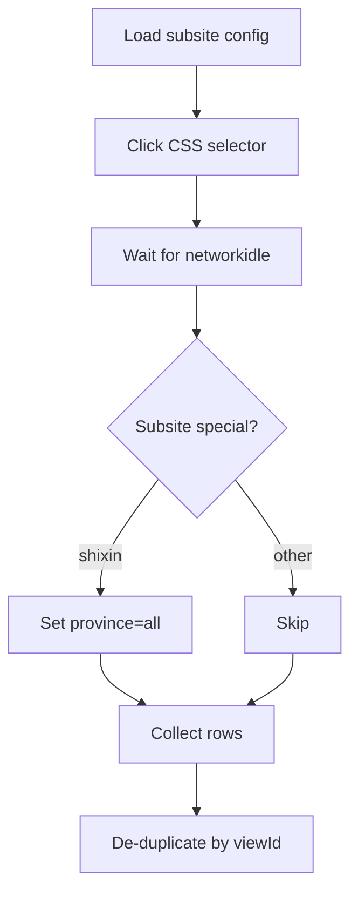
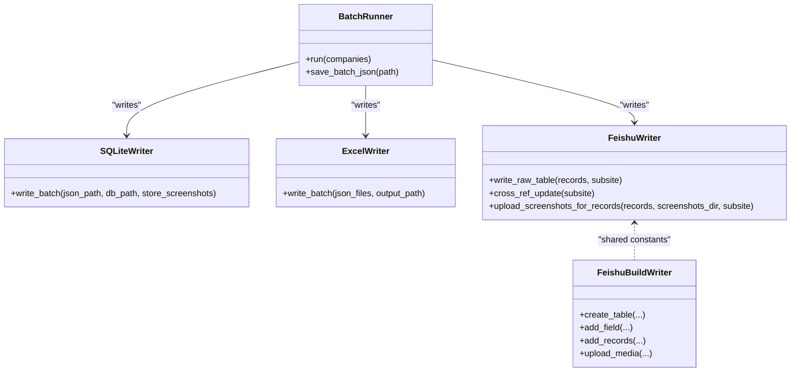
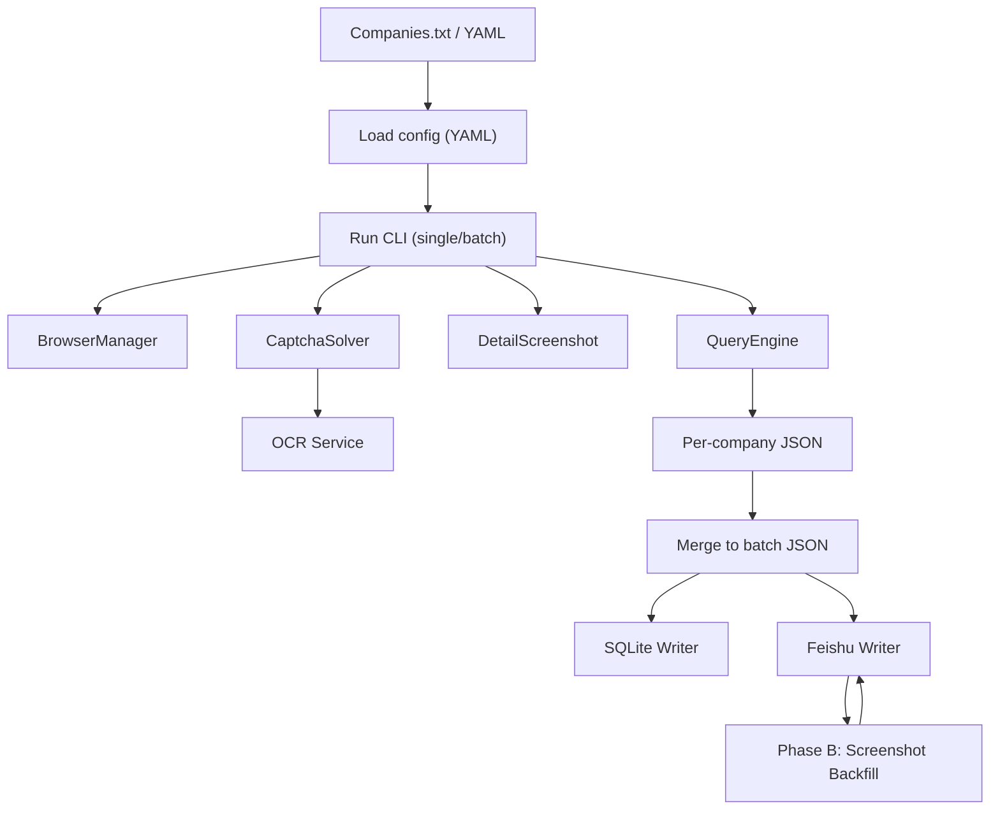
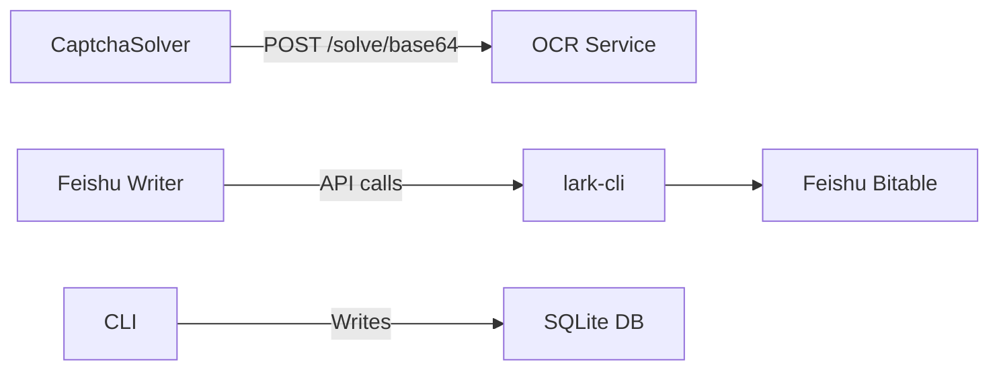
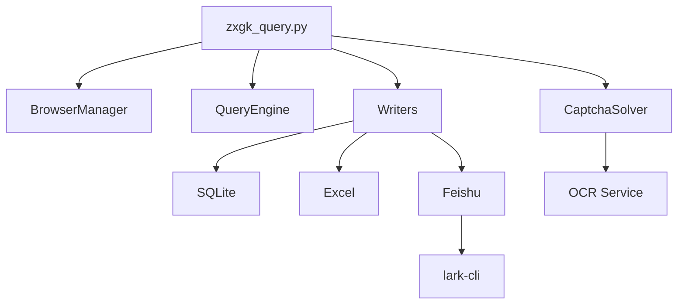

# Core Architecture

<cite>
**Referenced Files in This Document**
- [README.md](file://README.md)
- [SKILL.md](file://SKILL.md)
- [zxgk_query.py](file://zxgk_query.py)
- [diagnose_subsites.py](file://diagnose_subsites.py)
- [cron_daily_query.sh](file://cron_daily_query.sh)
- [setup.sh](file://setup.sh)
- [smoke_test.sh](file://smoke_test.sh)
- [config/zxgk.example.yaml](file://config/zxgk.example.yaml)
- [writers/__init__.py](file://writers/__init__.py)
- [writers/sqlite.py](file://writers/sqlite.py)
- [writers/excel.py](file://writers/excel.py)
- [writers/feishu.py](file://writers/feishu.py)
- [writers/feishu_build.py](file://writers/feishu_build.py)
- [captcha-solver/main.py](file://captcha-solver/main.py)
</cite>

## Table of Contents
1. [Introduction](#introduction)
2. [Project Structure](#project-structure)
3. [Core Components](#core-components)
4. [Architecture Overview](#architecture-overview)
5. [Detailed Component Analysis](#detailed-component-analysis)
6. [Dependency Analysis](#dependency-analysis)
7. [Performance Considerations](#performance-considerations)
8. [Troubleshooting Guide](#troubleshooting-guide)
9. [Conclusion](#conclusion)
10. [Appendices](#appendices)

## Introduction
This document describes the Execution Information Query System’s core architecture, focusing on the browser automation pipeline, CAPTCHA solving subsystem, multi-subsite navigation patterns, and the extensible output writer ecosystem. It explains how CLI commands orchestrate Playwright-driven queries against the China Enforcement Information Public Network, how OCR-based CAPTCHA resolution is integrated, and how results are persisted locally and optionally synchronized to Feishu. It also documents system boundaries, integration patterns with external services, error handling strategies, and performance characteristics.

## Project Structure
The system is organized into cohesive modules:
- CLI and orchestration: main automation and scheduling
- Browser automation: stealth Chromium via Playwright
- CAPTCHA solver: OCR service for验证码 recognition
- Writers: pluggable output backends (SQLite, Excel, Feishu)
- Diagnostics and setup: environment validation and site probing
- Configuration: YAML-driven runtime configuration

**Diagram sources**
- [zxgk_query.py:175-324](file://zxgk_query.py#L175-L324)
- [zxgk_query.py:328-392](file://zxgk_query.py#L328-L392)
- [captcha-solver/main.py:107-142](file://captcha-solver/main.py#L107-L142)
- [writers/sqlite.py:37-100](file://writers/sqlite.py#L37-L100)
- [writers/excel.py:56-73](file://writers/excel.py#L56-L73)
- [writers/feishu.py:556-591](file://writers/feishu.py#L556-L591)
- [writers/feishu_build.py:109-201](file://writers/feishu_build.py#L109-L201)
- [cron_daily_query.sh:112-154](file://cron_daily_query.sh#L112-L154)
- [config/zxgk.example.yaml:1-103](file://config/zxgk.example.yaml#L1-L103)

**Section sources**
- [README.md:97-122](file://README.md#L97-L122)
- [SKILL.md:225-247](file://SKILL.md#L225-L247)

## Core Components
- CLI and Orchestration
  - Command-line entry point with subcommands for single, batch, backfill, and diagnose modes.
  - Daily orchestration script coordinates three subsites, writes to SQLite, conditionally to Feishu, and triggers Phase B screenshot backfill.
- BrowserManager
  - Launches a stealth Chromium session, navigates to subsites, and handles WAF detection and retries.
- QueryEngine
  - Performs search, handles CAPTCHA OCR, dismisses overlays, collects paginated results, and ensures viewId de-duplication.
- CaptchaSolver
  - Extracts CAPTCHA images from the page, posts to OCR service, and applies confidence thresholds.
- DetailScreenshot
  - Captures detail popups, crops to popup region using OpenCV heuristics, and closes dialogs.
- Writers
  - SQLite writer persists batch results locally with optional screenshot storage as file path or BLOB.
  - Excel writer exports tabular results for reporting.
  - Feishu writer writes raw tables, performs cross-reference updates, and uploads screenshots to Feishu.
  - Feishu build writer automates table creation and initial data population.

**Section sources**
- [zxgk_query.py:1514-1567](file://zxgk_query.py#L1514-L1567)
- [cron_daily_query.sh:112-154](file://cron_daily_query.sh#L112-L154)
- [writers/sqlite.py:37-100](file://writers/sqlite.py#L37-L100)
- [writers/excel.py:56-73](file://writers/excel.py#L56-L73)
- [writers/feishu.py:556-591](file://writers/feishu.py#L556-L591)
- [writers/feishu_build.py:109-201](file://writers/feishu_build.py#L109-L201)

## Architecture Overview
The system follows a staged pipeline:
- Input: company list and configuration
- Automation: stealth browser navigates subsites, submits queries, and collects results
- OCR: CAPTCHA images are sent to OCR service for text extraction
- Storage: results saved to SQLite; optional Feishu synchronization and screenshot uploads
- Backfill: Phase B re-queries missing screenshots and uploads them to Feishu

**Diagram sources**
- [zxgk_query.py:1065-1197](file://zxgk_query.py#L1065-L1197)
- [zxgk_query.py:328-392](file://zxgk_query.py#L328-L392)
- [captcha-solver/main.py:174-209](file://captcha-solver/main.py#L174-L209)
- [writers/sqlite.py:37-100](file://writers/sqlite.py#L37-L100)
- [writers/feishu.py:556-591](file://writers/feishu.py#L556-L591)
- [cron_daily_query.sh:112-154](file://cron_daily_query.sh#L112-L154)

## Detailed Component Analysis

### Browser Automation and Navigation
- Stealth browser initialization
  - Chromium launched with sandbox disabled and stealth overrides to mimic a real browser.
  - Locale and headers configured for Chinese sites.
- Multi-subsite navigation
  - Uses CSS selectors defined per subsite to click into “zhixing”, “shixin”, and “xgl”.
  - WAF detection checks for presence of CAPTCHA element and body length; on block, retries with cooldown.
- Retry and resilience
  - Navigation retried up to three times; browser closed and relaunched after consecutive failures.

**Diagram sources**
- [zxgk_query.py:195-277](file://zxgk_query.py#L195-L277)

**Section sources**
- [zxgk_query.py:175-277](file://zxgk_query.py#L175-L277)
- [config/zxgk.example.yaml:32-44](file://config/zxgk.example.yaml#L32-L44)

### CAPTCHA Solving System
- Client-side extraction
  - Captcha image located within the CAPTCHA container and drawn to canvas for data URL conversion.
- OCR service integration
  - Requests sent to OCR endpoint with base64 payload and preprocessing mode.
  - Health-checked before use; on failure, the pipeline aborts early.
- Confidence gating
  - Results below a threshold are rejected and the CAPTCHA is refreshed.

**Diagram sources**
- [zxgk_query.py:339-392](file://zxgk_query.py#L339-L392)
- [captcha-solver/main.py:174-209](file://captcha-solver/main.py#L174-L209)

**Section sources**
- [zxgk_query.py:328-392](file://zxgk_query.py#L328-L392)
- [captcha-solver/main.py:107-142](file://captcha-solver/main.py#L107-L142)

### Multi-Subsite Navigation Patterns
- Configuration-driven selectors
  - Each subsite defines a CSS selector and optional extra wait seconds.
- Special handling
  - “shixin” requires explicit province selection to “all”.
- Consistent result collection
  - Pagination loop reads rows, extracts viewIds, and de-duplicates across pages.

**Diagram sources**
- [zxgk_query.py:416-476](file://zxgk_query.py#L416-L476)
- [config/zxgk.example.yaml:32-44](file://config/zxgk.example.yaml#L32-L44)

**Section sources**
- [zxgk_query.py:416-476](file://zxgk_query.py#L416-L476)
- [config/zxgk.example.yaml:32-44](file://config/zxgk.example.yaml#L32-L44)

### Output Writers and Extensibility
- Plugin-style writers
  - Each writer module exposes a write() function; writers are invoked independently.
- SQLite writer
  - Zero-dependency persistence; supports storing screenshot paths or BLOBs.
- Excel writer
  - Exports tabular results for reporting; requires optional dependency.
- Feishu writer
  - Writes raw tables, performs cross-reference updates, and uploads screenshots to Feishu.
- Feishu build writer
  - Automates table creation, DuplexLink setup, and initial data population.

**Diagram sources**
- [writers/sqlite.py:37-100](file://writers/sqlite.py#L37-L100)
- [writers/excel.py:56-73](file://writers/excel.py#L56-L73)
- [writers/feishu.py:154-201](file://writers/feishu.py#L154-L201)
- [writers/feishu.py:208-277](file://writers/feishu.py#L208-L277)
- [writers/feishu.py:369-478](file://writers/feishu.py#L369-L478)
- [writers/feishu_build.py:109-201](file://writers/feishu_build.py#L109-L201)

**Section sources**
- [writers/__init__.py:1-10](file://writers/__init__.py#L1-L10)
- [writers/sqlite.py:37-100](file://writers/sqlite.py#L37-L100)
- [writers/excel.py:56-73](file://writers/excel.py#L56-L73)
- [writers/feishu.py:154-201](file://writers/feishu.py#L154-L201)
- [writers/feishu.py:208-277](file://writers/feishu.py#L208-L277)
- [writers/feishu.py:369-478](file://writers/feishu.py#L369-L478)
- [writers/feishu_build.py:109-201](file://writers/feishu_build.py#L109-L201)

### Data Flow from Input to Output
- Input: company list (YAML or plain text) and configuration (YAML).
- Automation: CLI loads config, launches browser, navigates subsites, runs queries, captures screenshots.
- Storage: batch JSON produced per company; merged batch JSON aggregated; SQLite backup; optional Feishu writes.
- Backfill: Phase B scans Feishu for missing screenshots and re-queries details to upload.

**Diagram sources**
- [zxgk_query.py:1484-1494](file://zxgk_query.py#L1484-L1494)
- [writers/sqlite.py:37-100](file://writers/sqlite.py#L37-L100)
- [writers/feishu.py:556-591](file://writers/feishu.py#L556-L591)
- [cron_daily_query.sh:112-154](file://cron_daily_query.sh#L112-L154)

**Section sources**
- [zxgk_query.py:1484-1494](file://zxgk_query.py#L1484-L1494)
- [writers/sqlite.py:37-100](file://writers/sqlite.py#L37-L100)
- [writers/feishu.py:556-591](file://writers/feishu.py#L556-L591)
- [cron_daily_query.sh:112-154](file://cron_daily_query.sh#L112-L154)

### Integration Patterns with External Services
- OCR service
  - RESTful endpoints: health check and solve endpoints; configurable base URL.
- Feishu API
  - Uses lark-cli to call Bitable APIs for record creation, updates, media uploads, and search.
- Local storage
  - SQLite database for reliable local persistence; optional screenshot BLOB storage.

**Diagram sources**
- [captcha-solver/main.py:107-142](file://captcha-solver/main.py#L107-L142)
- [writers/feishu.py:56-66](file://writers/feishu.py#L56-L66)
- [writers/feishu.py:82-126](file://writers/feishu.py#L82-L126)
- [writers/sqlite.py:37-100](file://writers/sqlite.py#L37-L100)

**Section sources**
- [captcha-solver/main.py:107-142](file://captcha-solver/main.py#L107-L142)
- [writers/feishu.py:56-66](file://writers/feishu.py#L56-L66)
- [writers/feishu.py:82-126](file://writers/feishu.py#L82-L126)
- [writers/sqlite.py:37-100](file://writers/sqlite.py#L37-L100)

## Dependency Analysis
- Internal dependencies
  - CLI depends on BrowserManager, QueryEngine, CaptchaSolver, and writers.
  - BatchRunner composes these components and manages lifecycle and retry policies.
- External dependencies
  - Playwright and stealth libraries for browser automation.
  - Requests for OCR service calls.
  - Optional: openpyxl for Excel export; lark-cli for Feishu operations.
- Configuration-driven coupling
  - Subsite selectors, OCR server URL, and Feishu table IDs are configured externally.

**Diagram sources**
- [zxgk_query.py:1065-1197](file://zxgk_query.py#L1065-L1197)
- [writers/sqlite.py:37-100](file://writers/sqlite.py#L37-L100)
- [writers/excel.py:56-73](file://writers/excel.py#L56-L73)
- [writers/feishu.py:556-591](file://writers/feishu.py#L556-L591)
- [captcha-solver/main.py:107-142](file://captcha-solver/main.py#L107-L142)

**Section sources**
- [zxgk_query.py:1065-1197](file://zxgk_query.py#L1065-L1197)
- [writers/sqlite.py:37-100](file://writers/sqlite.py#L37-L100)
- [writers/excel.py:56-73](file://writers/excel.py#L56-L73)
- [writers/feishu.py:556-591](file://writers/feishu.py#L556-L591)
- [captcha-solver/main.py:107-142](file://captcha-solver/main.py#L107-L142)

## Performance Considerations
- Browser reuse and session limits
  - BatchRunner maintains a single browser session per run; restarts after consecutive failures to mitigate memory leaks and WAF drift.
- OCR throughput and reliability
  - OCR requests are retried once on transient failure; confidence thresholds reduce retries on low-quality OCR.
- I/O optimization
  - SQLite supports BLOB storage for screenshots to avoid filesystem churn; Excel export is optimized for minimal formatting overhead.
- Concurrency and pacing
  - Configurable intervals between companies and screenshots reduce WAF pressure and improve stability.

[No sources needed since this section provides general guidance]

## Troubleshooting Guide
- WAF封禁 (WAF blocked)
  - Detected when CAPTCHA element is absent; the system waits and retries. Exit code indicates封禁.
- OCR service unavailable
  - Health check fails or OCR returns empty text/confidence; verify OCR service is running and reachable.
- Feishu authentication issues
  - lark-cli not authenticated; re-run authentication and retry Feishu writes.
- Session cleanup
  - Leftover Chromium processes are cleaned up by both Python and shell scripts; manual cleanup available if needed.
- Diagnostics
  - Use diagnose mode to probe subsite readiness and WAF status.

**Section sources**
- [zxgk_query.py:99-107](file://zxgk_query.py#L99-L107)
- [cron_daily_query.sh:48-96](file://cron_daily_query.sh#L48-L96)
- [writers/feishu.py:56-66](file://writers/feishu.py#L56-L66)
- [diagnose_subsites.py:103-330](file://diagnose_subsites.py#L103-L330)

## Conclusion
The Execution Information Query System is a modular, resilient pipeline that combines stealth browser automation, OCR-based CAPTCHA solving, and extensible output writers. Its staged design—Phase A for text results and local backups, Phase B for screenshot backfill—ensures completeness and auditability. The configuration-driven architecture and plugin-style writers enable easy adaptation to evolving site structures and storage needs.

[No sources needed since this section summarizes without analyzing specific files]

## Appendices

### Configuration Reference
- Core keys
  - captcha_server: OCR service base URL
  - browser: headless, viewport
  - waf: captcha_max_retries, cooldown_on_block_sec, company_interval_sec, screenshot_interval_sec, max_consecutive_fails
  - screenshots.enabled
  - storage.screenshots: file | blob | both
  - subsites: zhixing, shixin, xgl with css_selector and extra_wait_sec
  - feishu: app_token, raw_table.id/fields, detail_table.id/fields, dedup_options
  - output.dir, output.screenshots_dir
  - companies: list of company names

**Section sources**
- [config/zxgk.example.yaml:1-103](file://config/zxgk.example.yaml#L1-L103)

### Exit Codes
- 0: Success
- 1: No results
- 2: WAF blocked
- 3: OCR service unavailable
- 4: Configuration/parameter error

**Section sources**
- [README.md:89-96](file://README.md#L89-L96)