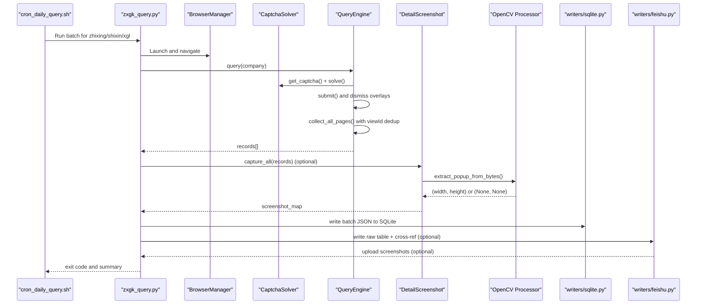
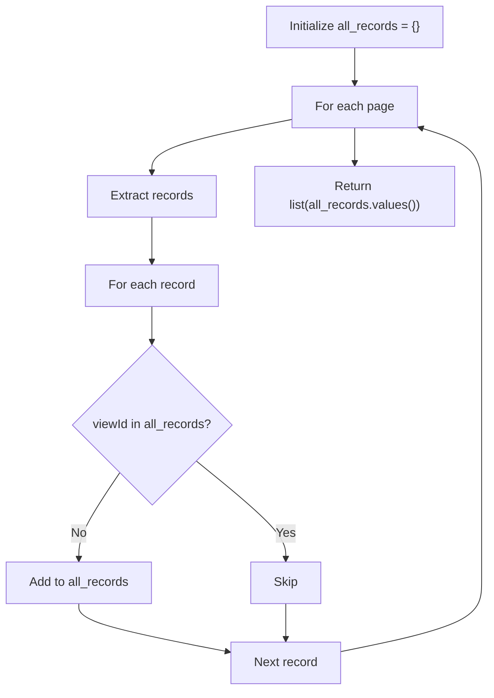
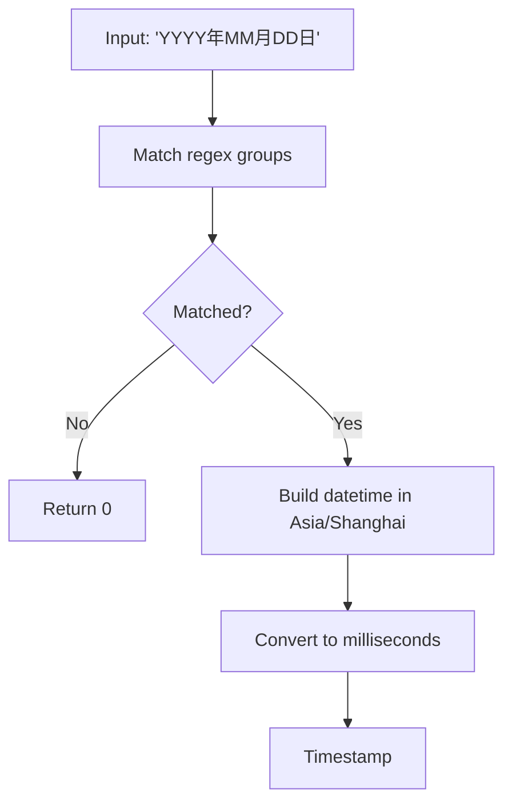
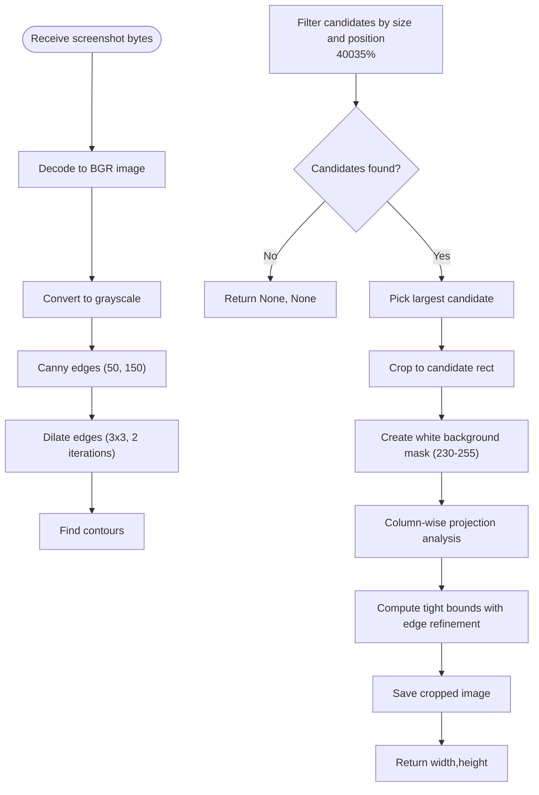
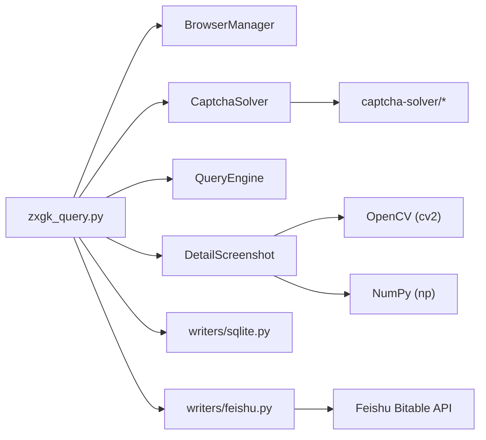

# Data Processing Pipeline

<cite>
**Referenced Files in This Document**
- [zxgk_query.py](file://zxgk_query.py)
- [README.md](file://README.md)
- [SKILL.md](file://SKILL.md)
- [cron_daily_query.sh](file://cron_daily_query.sh)
- [writers/sqlite.py](file://writers/sqlite.py)
- [writers/feishu.py](file://writers/feishu.py)
- [config/zxgk.example.yaml](file://config/zxgk.example.yaml)
- [config/companies.example.txt](file://config/companies.example.txt)
- [captcha-solver/main.py](file://captcha-solver/main.py)
- [captcha-solver/solver.py](file://captcha-solver/solver.py)
- [captcha-solver/preprocess.py](file://captcha-solver/preprocess.py)
- [zxgk/screenshot.py](file://zxgk/screenshot.py)
- [zxgk/cli.py](file://zxgk/cli.py)
- [zxgk/runner.py](file://zxgk/runner.py)
- [zxgk/query.py](file://zxgk/query.py)
- [zxgk/backfill.py](file://zxgk/backfill.py)
</cite>

## Update Summary
**Changes Made**
- Added comprehensive documentation for the new screenshot processing pipeline in `zxgk/screenshot.py`
- Updated the Screenshot Extraction Workflow section to reflect the new 115-line OpenCV-based implementation
- Enhanced the Detailed Component Analysis with new screenshot processing algorithms
- Updated architecture diagrams to include the new screenshot processing components
- Added new sections covering the sophisticated white background detection and popup region identification

## Table of Contents
1. [Introduction](#introduction)
2. [Project Structure](#project-structure)
3. [Core Components](#core-components)
4. [Architecture Overview](#architecture-overview)
5. [Detailed Component Analysis](#detailed-component-analysis)
6. [Dependency Analysis](#dependency-analysis)
7. [Performance Considerations](#performance-considerations)
8. [Troubleshooting Guide](#troubleshooting-guide)
9. [Conclusion](#conclusion)
10. [Appendices](#appendices)

## Introduction
This document describes the data processing pipeline that transforms raw web scraping results from China Execution Information Public Network into structured, usable data. It covers:
- Result extraction algorithms (DOM traversal, data mapping, field validation)
- ViewId deduplication strategy
- Chinese date parsing with timezone conversion
- Result normalization processes
- **Enhanced** Screenshot extraction workflow using OpenCV with sophisticated popup region identification and white background detection
- Error recovery mechanisms, validation rules, and consistency checks
- Practical examples of data transformation workflows, batch processing patterns, and quality assurance measures
- Performance optimization techniques, memory management for large datasets, and integration with output generation systems

## Project Structure
The project is organized into:
- Core automation and processing logic in a single CLI module
- Writers for multiple output targets (SQLite, Excel, Feishu)
- Configuration and company lists
- An embedded OCR service for captcha solving
- A daily orchestration script that coordinates the entire pipeline
- **New** Dedicated screenshot processing module with advanced OpenCV algorithms

```mermaid
graph TB
subgraph "CLI and Automation"
Z["zxgk_query.py"]
CLI["zxgk/cli.py"]
RUN["zxgk/runner.py"]
QRY["zxgk/query.py"]
BK["zxgk/backfill.py"]
END
subgraph "Screenshot Processing"
SS["zxgk/screenshot.py"]
END
subgraph "Output Writers"
S["writers/sqlite.py"]
F["writers/feishu.py"]
END
subgraph "Config and Lists"
Y["config/zxgk.example.yaml"]
C["config/companies.example.txt"]
END
subgraph "OCR Service"
M["captcha-solver/main.py"]
O["captcha-solver/solver.py"]
P["captcha-solver/preprocess.py"]
END
subgraph "Orchestration"
CRON["cron_daily_query.sh"]
END
CRON --> Z
Z --> CLI
CLI --> RUN
CLI --> SS
RUN --> QRY
RUN --> SS
BK --> SS
Z --> M
Z --> S
Z --> F
Z --> Y
Z --> C
M --> O
M --> P
```

**Diagram sources**
- [zxgk_query.py](file://zxgk_query.py)
- [zxgk/cli.py](file://zxgk/cli.py)
- [zxgk/runner.py](file://zxgk/runner.py)
- [zxgk/query.py](file://zxgk/query.py)
- [zxgk/backfill.py](file://zxgk/backfill.py)
- [zxgk/screenshot.py](file://zxgk/screenshot.py)
- [writers/sqlite.py](file://writers/sqlite.py)
- [writers/feishu.py](file://writers/feishu.py)
- [config/zxgk.example.yaml](file://config/zxgk.example.yaml)
- [config/companies.example.txt](file://config/companies.example.txt)
- [captcha-solver/main.py](file://captcha-solver/main.py)
- [captcha-solver/solver.py](file://captcha-solver/solver.py)
- [captcha-solver/preprocess.py](file://captcha-solver/preprocess.py)
- [cron_daily_query.sh](file://cron_daily_query.sh)

**Section sources**
- [README.md](file://README.md)
- [SKILL.md](file://SKILL.md)

## Core Components
- BrowserManager: Launches and manages a headless Chromium instance with stealth settings, navigates to sub-sites, and performs WAF checks.
- CaptchaSolver: Integrates with a local OCR service to extract and solve captchas from the page.
- QueryEngine: Orchestrates the search flow, handles retries, dismisses overlays, collects paginated results, and applies viewId deduplication.
- **Enhanced** DetailScreenshot: Captures detail popups and extracts the popup region using sophisticated OpenCV algorithms with white background detection.
- ScreenshotBackfiller: Re-queries missing screenshots using Feishu APIs and uploads them back to the case table.
- BatchRunner: Executes batch queries with retry, progress tracking, and output generation.
- Writers: SQLite writer for local persistence and Feishu writer for remote synchronization and cross-reference updates.

**Section sources**
- [zxgk_query.py](file://zxgk_query.py)
- [writers/sqlite.py](file://writers/sqlite.py)
- [writers/feishu.py](file://writers/feishu.py)
- [zxgk/screenshot.py](file://zxgk/screenshot.py)

## Architecture Overview
The pipeline follows a two-phase process:
- Phase A: Text-only query and storage (SQLite always; Feishu optional)
- Phase B: Screenshot backfill using Feishu APIs to locate missing screenshots and upload them



**Diagram sources**
- [cron_daily_query.sh](file://cron_daily_query.sh)
- [zxgk_query.py](file://zxgk_query.py)
- [zxgk/runner.py](file://zxgk/runner.py)
- [zxgk/screenshot.py](file://zxgk/screenshot.py)
- [writers/sqlite.py](file://writers/sqlite.py)
- [writers/feishu.py](file://writers/feishu.py)

## Detailed Component Analysis

### Result Extraction and Normalization
- DOM traversal and data mapping:
  - Extracts rows from the result table and maps fields by column indices.
  - Retrieves the viewId from the "showDetail" JavaScript call argument.
  - Normalizes fields: name, caseNo, date, viewId.
- Field validation:
  - Skips rows with insufficient cells or header-like rows.
  - Filters out empty viewId values.
- Result normalization:
  - Converts Chinese date strings to epoch milliseconds in Asia/Shanghai timezone.
  - Adds computed timestamp and screenshot path fields.


**Diagram sources**
- [zxgk_query.py](file://zxgk_query.py)
- [zxgk/query.py](file://zxgk/query.py)

**Section sources**
- [zxgk_query.py](file://zxgk_query.py)
- [zxgk/query.py](file://zxgk/query.py)

### ViewId Deduplication Strategy
- During pagination collection, records are stored in a dictionary keyed by viewId.
- New records are only added if the viewId is not already present.
- This ensures that duplicate records across pages are eliminated.



**Diagram sources**
- [zxgk_query.py](file://zxgk_query.py)
- [zxgk/query.py](file://zxgk/query.py)

**Section sources**
- [zxgk_query.py](file://zxgk_query.py)
- [zxgk/query.py](file://zxgk/query.py)

### Chinese Date Parsing and Timezone Conversion
- Parses Chinese date strings (e.g., "2026年03月26日") using a regex pattern.
- Converts matched year/month/day into a localized Asia/Shanghai datetime.
- Returns epoch milliseconds for consistent downstream processing.



**Diagram sources**
- [zxgk_query.py](file://zxgk_query.py)
- [zxgk/config.py](file://zxgk/config.py)

**Section sources**
- [zxgk_query.py](file://zxgk_query.py)
- [zxgk/config.py](file://zxgk/config.py)

### Result Normalization Processes
- Adds normalized timestamp for each record.
- Embeds screenshot path into each record for downstream use.
- Builds a consolidated batch JSON with company-level statuses and totals.

**Section sources**
- [zxgk_query.py](file://zxgk_query.py)
- [zxgk/runner.py](file://zxgk/runner.py)

### Enhanced Screenshot Extraction Workflow Using OpenCV

**Updated** The new screenshot processing system in `zxgk/screenshot.py` implements a comprehensive 115-line OpenCV-based pipeline for precise detail popup extraction with sophisticated white background detection.

#### Core Processing Algorithm
- Captures a full-page screenshot from the detail popup
- Uses OpenCV to:
  - Convert to grayscale
  - Apply Canny edge detection and dilation
  - Find external contours
  - Filter candidates by size (400 < width < 1400, 150 < height < 500) and vertical position (y > 35% from top)
  - Select the largest candidate rectangle
  - Detect white background regions using threshold masking (230-255 range)
  - Perform column-wise projection analysis to refine cropping boundaries
  - Save the tightly cropped popup region
- Falls back to saving the whole screenshot if popup extraction fails

#### Advanced White Background Detection
The system employs sophisticated white background detection using:
- In-range thresholding (cv2.inRange) with range 230-255 to identify bright pixels
- Column-wise projection analysis to find the longest continuous white region
- Edge refinement with ±8 pixel padding for precise cropping boundaries
- Fallback logic when no white background is detected

#### Popup Region Identification
The algorithm identifies popup regions through:
- Multi-stage contour filtering based on geometric constraints
- Vertical position analysis to distinguish popups from page content
- Size validation to ensure captured content is a popup window
- Robust fallback mechanism for edge cases



**Diagram sources**
- [zxgk/screenshot.py](file://zxgk/screenshot.py)

**Section sources**
- [zxgk/screenshot.py](file://zxgk/screenshot.py)
- [zxgk/runner.py](file://zxgk/runner.py)
- [zxgk/backfill.py](file://zxgk/backfill.py)

### Error Recovery Mechanisms and Validation Rules
- WAF封禁 detection:
  - Checks for presence of a captcha element and body length to detect blocking.
  - Retries navigation with delays on repeated failures.
- Captcha validation:
  - Validates OCR text and confidence thresholds before submission.
  - Refreshes captcha on invalid or expired responses.
- Dialog dismissal:
  - Polls and clicks overlay confirmation/error dialogs to ensure result block accessibility.
- Retry and backoff:
  - Configurable max retries for captcha solving and query submission.
  - Browser restart after consecutive failures.
- Consistency checks:
  - Deduplication by viewId across pages and raw table writes.
  - Cross-reference updates for shixin/xgl to mark case table flags.
- **Enhanced** Screenshot error handling:
  - Graceful fallback to full screenshot when popup extraction fails
  - Robust popup closing mechanism with multiple detection strategies
  - Memory-efficient processing using in-memory numpy arrays

**Section sources**
- [zxgk_query.py](file://zxgk_query.py)
- [zxgk/runner.py](file://zxgk/runner.py)
- [zxgk/backfill.py](file://zxgk/backfill.py)

### Quality Assurance Measures
- Diagnostics:
  - Health checks for captcha-solver and browser stealth.
  - Subsite navigation diagnostics.
- Output verification:
  - SQLite always written as local backup.
  - Feishu writes guarded by authentication checks.
- Idempotent writes:
  - Raw table deduplication prevents duplicate entries.
  - Cross-reference updates only set flags for matched records.
- **Enhanced** Screenshot quality control:
  - Automatic popup region validation through geometric constraints
  - White background detection ensures readable content
  - Fallback mechanisms prevent pipeline failures

**Section sources**
- [zxgk_query.py](file://zxgk_query.py)
- [writers/feishu.py](file://writers/feishu.py)
- [zxgk/screenshot.py](file://zxgk/screenshot.py)

### Practical Examples of Data Transformation Workflows
- Single company query:
  - Navigate to sub-site, solve captcha, submit, collect results, capture screenshots with enhanced OpenCV processing, and write outputs.
- Batch processing:
  - Iterate companies with progress tracking, WAF cooldowns, and session restarts on failures.
- Full pipeline (Phase A + B):
  - Daily orchestration runs three sub-sites, writes to SQLite and Feishu, waits for Feishu calculations, then backfills missing screenshots using the new processing pipeline.
- **New** Backfill operations:
  - Phase B uses dedicated backfiller with improved popup extraction algorithms for missing screenshots.

**Section sources**
- [zxgk_query.py](file://zxgk_query.py)
- [cron_daily_query.sh](file://cron_daily_query.sh)
- [zxgk/runner.py](file://zxgk/runner.py)
- [zxgk/backfill.py](file://zxgk/backfill.py)

### Integration with Output Generation Systems
- SQLite writer:
  - Writes normalized records to a local database with optional screenshot BLOB storage.
- Feishu writer:
  - Writes raw records to Feishu tables, performs cross-reference updates, and uploads screenshots to the case table.
- Batch JSON:
  - Aggregates per-company results and statuses into a consolidated JSON for downstream consumption.
- **Enhanced** Screenshot integration:
  - Seamless integration with both immediate and backfill screenshot processing
  - Consistent screenshot naming and organization across all processing modes

**Section sources**
- [writers/sqlite.py](file://writers/sqlite.py)
- [writers/feishu.py](file://writers/feishu.py)
- [zxgk_query.py](file://zxgk_query.py)
- [zxgk/runner.py](file://zxgk/runner.py)

## Dependency Analysis
Key dependencies and relationships:
- CLI depends on:
  - BrowserManager for navigation and stealth
  - CaptchaSolver for OCR
  - QueryEngine for result collection and deduplication
  - **Enhanced** DetailScreenshot for popup extraction using OpenCV
  - Writers for output persistence
- Writers depend on:
  - Feishu APIs for remote synchronization
  - SQLite for local persistence
- **New** OpenCV dependencies:
  - cv2 for image processing operations
  - numpy for efficient array operations
  - Sophisticated image analysis algorithms for popup detection



**Diagram sources**
- [zxgk_query.py](file://zxgk_query.py)
- [zxgk/runner.py](file://zxgk/runner.py)
- [zxgk/screenshot.py](file://zxgk/screenshot.py)
- [writers/sqlite.py](file://writers/sqlite.py)
- [writers/feishu.py](file://writers/feishu.py)
- [captcha-solver/main.py](file://captcha-solver/main.py)

**Section sources**
- [zxgk_query.py](file://zxgk_query.py)
- [writers/sqlite.py](file://writers/sqlite.py)
- [writers/feishu.py](file://writers/feishu.py)
- [captcha-solver/main.py](file://captcha-solver/main.py)
- [zxgk/screenshot.py](file://zxgk/screenshot.py)

## Performance Considerations
- Memory management:
  - OpenCV operations are performed in-memory from bytes to minimize disk I/O.
  - **Enhanced** NumPy array processing reduces memory overhead compared to PIL/Pillow
  - Screenshot extraction returns shape only when successful; otherwise falls back to full screenshot.
- Concurrency and throttling:
  - Configurable intervals between screenshots and between companies to respect WAF limits.
  - Session restart after consecutive failures to recover from browser instability.
- Output optimization:
  - SQLite supports storing screenshots as BLOBs to reduce filesystem overhead.
  - Feishu uploads are rate-limited and batched.
- **New** Image processing optimization:
  - Efficient Canny edge detection with optimized parameters (50, 150)
  - Minimal contour filtering reduces computational overhead
  - In-range thresholding provides fast white background detection

## Troubleshooting Guide
Common issues and remedies:
- captcha-solver unavailable:
  - Verify health endpoint and port availability; fallback to Docker or bare-metal venv.
- WAF blocked:
  - Use diagnostic mode to check captcha element presence and body length.
  - Wait for cooldown and retry navigation.
- No results:
  - Confirm "没有找到" messages and ensure company name is correct.
- Feishu authentication:
  - Authenticate lark-cli; re-run Feishu writer if needed.
- Phase B failures:
  - Re-run backfiller independently; it queries Feishu for missing screenshots and uploads them.
- **New** Screenshot processing issues:
  - Verify OpenCV installation and version compatibility
  - Check image dimensions and popup visibility
  - Review fallback mechanisms when popup extraction fails
  - Monitor memory usage during batch screenshot processing

**Section sources**
- [zxgk_query.py](file://zxgk_query.py)
- [cron_daily_query.sh](file://cron_daily_query.sh)
- [writers/feishu.py](file://writers/feishu.py)
- [zxgk/screenshot.py](file://zxgk/screenshot.py)
- [zxgk/backfill.py](file://zxgk/backfill.py)

## Conclusion
The pipeline integrates browser automation, OCR-based captcha solving, robust error recovery, and structured output generation across multiple sinks. **Enhanced** with the new comprehensive screenshot processing system featuring sophisticated OpenCV algorithms, the pipeline now provides precise popup region extraction with white background detection. It ensures data integrity through deduplication, normalization, and cross-reference updates, while maintaining performance via in-memory processing and controlled throttling.

## Appendices

### Configuration Reference
- captcha_server: Address of the OCR service
- browser: Headless mode and viewport settings
- waf: Retry counts, cooldowns, intervals, **new** screenshot_interval_sec for popup capture timing
- screenshots: Enable/disable and storage mode
- subsites: CSS selectors and extra waits per sub-site
- feishu: App token, table IDs, field mappings, dedup options
- output: Directory paths for general and screenshot outputs
- companies: List of companies to query

**Section sources**
- [config/zxgk.example.yaml](file://config/zxgk.example.yaml)

### Company List Template
- Companies are read from a text file with one company per line and comments prefixed with "#".

**Section sources**
- [config/companies.example.txt](file://config/companies.example.txt)

### OCR Service Details
- FastAPI-based service with health check and multiple endpoints for solving captchas.
- Preprocessing modes: full, gray, none.
- Uses PaddleOCR for recognition and returns text and confidence.

**Section sources**
- [captcha-solver/main.py](file://captcha-solver/main.py)
- [captcha-solver/solver.py](file://captcha-solver/solver.py)
- [captcha-solver/preprocess.py](file://captcha-solver/preprocess.py)

### OpenCV Screenshot Processing Details
- **New** 115-line comprehensive implementation using OpenCV for precise popup extraction
- Advanced white background detection with threshold-based masking
- Sophisticated contour filtering with geometric constraints
- Column-wise projection analysis for boundary refinement
- Memory-efficient in-place processing using numpy arrays
- Robust fallback mechanisms for edge cases

**Section sources**
- [zxgk/screenshot.py](file://zxgk/screenshot.py)