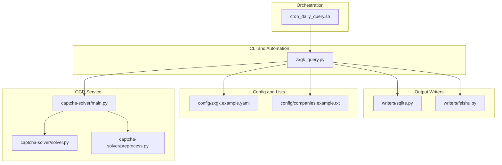
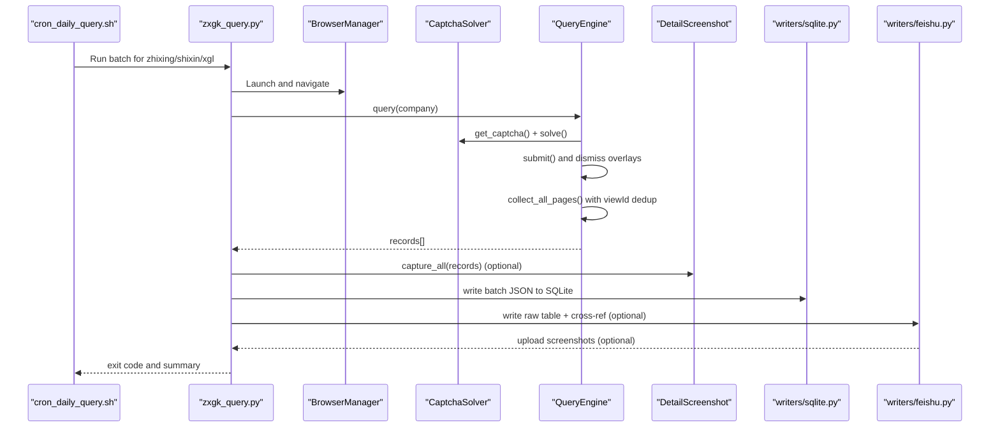
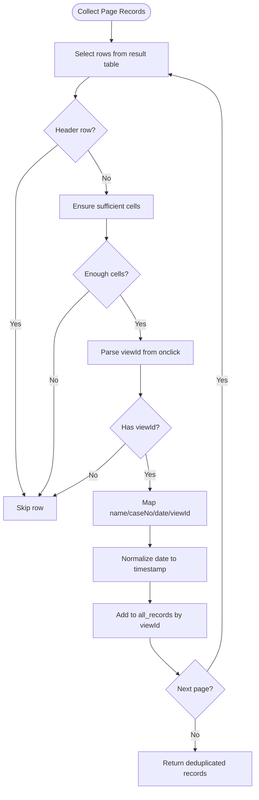
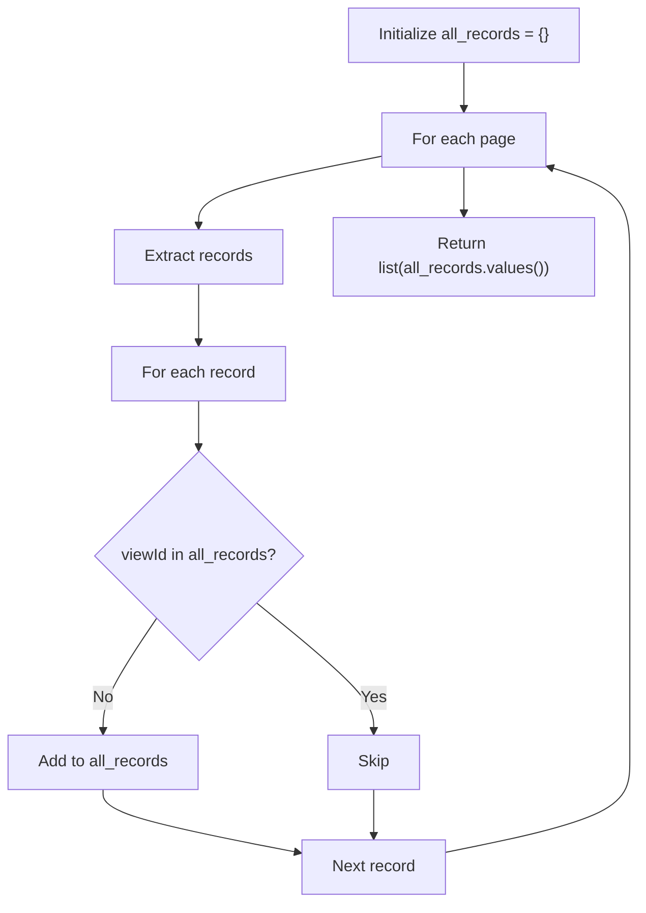
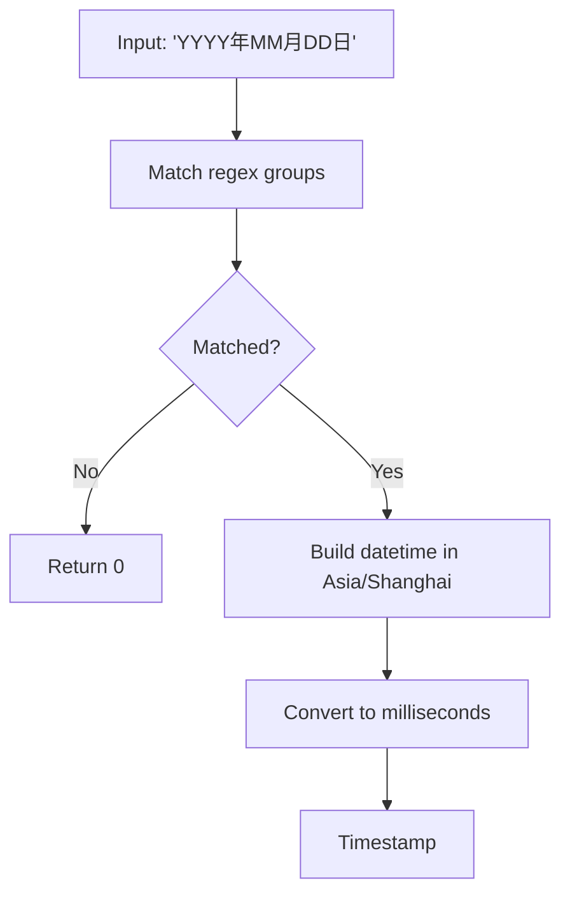
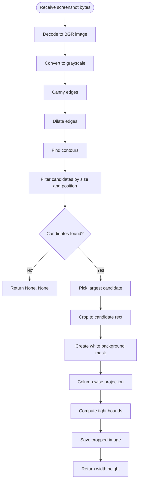
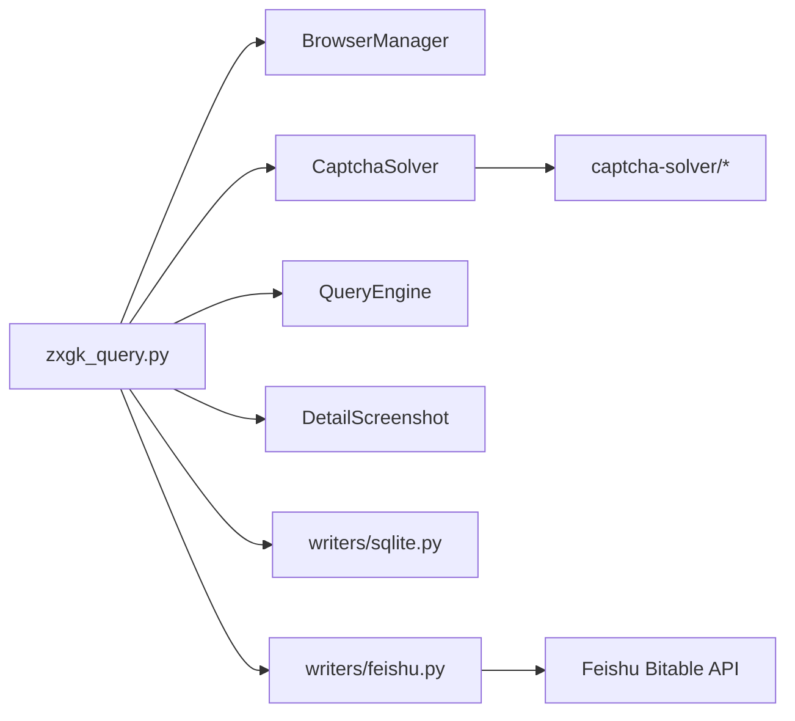

# Data Processing Pipeline

<cite>
**Referenced Files in This Document**
- [zxgk_query.py](file://zxgk_query.py)
- [README.md](file://README.md)
- [SKILL.md](file://SKILL.md)
- [cron_daily_query.sh](file://cron_daily_query.sh)
- [writers/sqlite.py](file://writers/sqlite.py)
- [writers/feishu.py](file://writers/feishu.py)
- [config/zxgk.example.yaml](file://config/zxgk.example.yaml)
- [config/companies.example.txt](file://config/companies.example.txt)
- [captcha-solver/main.py](file://captcha-solver/main.py)
- [captcha-solver/solver.py](file://captcha-solver/solver.py)
- [captcha-solver/preprocess.py](file://captcha-solver/preprocess.py)
</cite>

## Table of Contents
1. [Introduction](#introduction)
2. [Project Structure](#project-structure)
3. [Core Components](#core-components)
4. [Architecture Overview](#architecture-overview)
5. [Detailed Component Analysis](#detailed-component-analysis)
6. [Dependency Analysis](#dependency-analysis)
7. [Performance Considerations](#performance-considerations)
8. [Troubleshooting Guide](#troubleshooting-guide)
9. [Conclusion](#conclusion)
10. [Appendices](#appendices)

## Introduction
This document describes the data processing pipeline that transforms raw web scraping results from China Execution Information Public Network into structured, usable data. It covers:
- Result extraction algorithms (DOM traversal, data mapping, field validation)
- ViewId deduplication strategy
- Chinese date parsing with timezone conversion
- Result normalization processes
- Screenshot extraction workflow using OpenCV (edge detection, contour analysis, popup region identification)
- Error recovery mechanisms, validation rules, and consistency checks
- Practical examples of data transformation workflows, batch processing patterns, and quality assurance measures
- Performance optimization techniques, memory management for large datasets, and integration with output generation systems

## Project Structure
The project is organized into:
- Core automation and processing logic in a single CLI module
- Writers for multiple output targets (SQLite, Excel, Feishu)
- Configuration and company lists
- An embedded OCR service for captcha solving
- A daily orchestration script that coordinates the entire pipeline

**Diagram sources**
- [zxgk_query.py](file://zxgk_query.py)
- [writers/sqlite.py](file://writers/sqlite.py)
- [writers/feishu.py](file://writers/feishu.py)
- [config/zxgk.example.yaml](file://config/zxgk.example.yaml)
- [config/companies.example.txt](file://config/companies.example.txt)
- [captcha-solver/main.py](file://captcha-solver/main.py)
- [captcha-solver/solver.py](file://captcha-solver/solver.py)
- [captcha-solver/preprocess.py](file://captcha-solver/preprocess.py)
- [cron_daily_query.sh](file://cron_daily_query.sh)

**Section sources**
- [README.md](file://README.md)
- [SKILL.md](file://SKILL.md)

## Core Components
- BrowserManager: Launches and manages a headless Chromium instance with stealth settings, navigates to sub-sites, and performs WAF checks.
- CaptchaSolver: Integrates with a local OCR service to extract and solve captchas from the page.
- QueryEngine: Orchestrates the search flow, handles retries, dismisses overlays, collects paginated results, and applies viewId deduplication.
- DetailScreenshot: Captures detail popups and extracts the popup region using OpenCV.
- ScreenshotBackfiller: Re-queries missing screenshots using Feishu APIs and uploads them back to the case table.
- BatchRunner: Executes batch queries with retry, progress tracking, and output generation.
- Writers: SQLite writer for local persistence and Feishu writer for remote synchronization and cross-reference updates.

**Section sources**
- [zxgk_query.py](file://zxgk_query.py)
- [writers/sqlite.py](file://writers/sqlite.py)
- [writers/feishu.py](file://writers/feishu.py)

## Architecture Overview
The pipeline follows a two-phase process:
- Phase A: Text-only query and storage (SQLite always; Feishu optional)
- Phase B: Screenshot backfill using Feishu APIs to locate missing screenshots and upload them

**Diagram sources**
- [cron_daily_query.sh](file://cron_daily_query.sh)
- [zxgk_query.py](file://zxgk_query.py)
- [writers/sqlite.py](file://writers/sqlite.py)
- [writers/feishu.py](file://writers/feishu.py)

## Detailed Component Analysis

### Result Extraction and Normalization
- DOM traversal and data mapping:
  - Extracts rows from the result table and maps fields by column indices.
  - Retrieves the viewId from the “showDetail” JavaScript call argument.
  - Normalizes fields: name, caseNo, date, viewId.
- Field validation:
  - Skips rows with insufficient cells or header-like rows.
  - Filters out empty viewId values.
- Result normalization:
  - Converts Chinese date strings to epoch milliseconds in Asia/Shanghai timezone.
  - Adds computed timestamp and screenshot path fields.

**Diagram sources**
- [zxgk_query.py](file://zxgk_query.py)

**Section sources**
- [zxgk_query.py](file://zxgk_query.py)

### ViewId Deduplication Strategy
- During pagination collection, records are stored in a dictionary keyed by viewId.
- New records are only added if the viewId is not already present.
- This ensures that duplicate records across pages are eliminated.

**Diagram sources**
- [zxgk_query.py](file://zxgk_query.py)

**Section sources**
- [zxgk_query.py](file://zxgk_query.py)

### Chinese Date Parsing and Timezone Conversion
- Parses Chinese date strings (e.g., “2026年03月26日”) using a regex pattern.
- Converts matched year/month/day into a localized Asia/Shanghai datetime.
- Returns epoch milliseconds for consistent downstream processing.

**Diagram sources**
- [zxgk_query.py](file://zxgk_query.py)

**Section sources**
- [zxgk_query.py](file://zxgk_query.py)

### Result Normalization Processes
- Adds normalized timestamp for each record.
- Embeds screenshot path into each record for downstream use.
- Builds a consolidated batch JSON with company-level statuses and totals.

**Section sources**
- [zxgk_query.py](file://zxgk_query.py)

### Screenshot Extraction Workflow Using OpenCV
- Captures a full-page screenshot from the detail popup.
- Uses OpenCV to:
  - Convert to grayscale
  - Apply Canny edge detection and dilation
  - Find external contours
  - Filter candidates by size and vertical position
  - Select the largest candidate rectangle
  - Detect white background regions
  - Perform column-wise projection to refine cropping boundaries
  - Save the tightly cropped popup region
- Falls back to saving the whole screenshot if popup extraction fails.

**Diagram sources**
- [zxgk_query.py](file://zxgk_query.py)

**Section sources**
- [zxgk_query.py](file://zxgk_query.py)

### Error Recovery Mechanisms and Validation Rules
- WAF封禁 detection:
  - Checks for presence of a captcha element and body length to detect blocking.
  - Retries navigation with delays on repeated failures.
- Captcha validation:
  - Validates OCR text and confidence thresholds before submission.
  - Refreshes captcha on invalid or expired responses.
- Dialog dismissal:
  - Polls and clicks overlay confirmation/error dialogs to ensure result block accessibility.
- Retry and backoff:
  - Configurable max retries for captcha solving and query submission.
  - Browser restart after consecutive failures.
- Consistency checks:
  - Deduplication by viewId across pages and raw table writes.
  - Cross-reference updates for shixin/xgl to mark case table flags.

**Section sources**
- [zxgk_query.py](file://zxgk_query.py)

### Quality Assurance Measures
- Diagnostics:
  - Health checks for captcha-solver and browser stealth.
  - Subsite navigation diagnostics.
- Output verification:
  - SQLite always written as local backup.
  - Feishu writes guarded by authentication checks.
- Idempotent writes:
  - Raw table deduplication prevents duplicate entries.
  - Cross-reference updates only set flags for matched records.

**Section sources**
- [zxgk_query.py](file://zxgk_query.py)
- [writers/feishu.py](file://writers/feishu.py)

### Practical Examples of Data Transformation Workflows
- Single company query:
  - Navigate to sub-site, solve captcha, submit, collect results, capture screenshots, and write outputs.
- Batch processing:
  - Iterate companies with progress tracking, WAF cooldowns, and session restarts on failures.
- Full pipeline (Phase A + B):
  - Daily orchestration runs three sub-sites, writes to SQLite and Feishu, waits for Feishu calculations, then backfills missing screenshots.

**Section sources**
- [zxgk_query.py](file://zxgk_query.py)
- [cron_daily_query.sh](file://cron_daily_query.sh)

### Integration with Output Generation Systems
- SQLite writer:
  - Writes normalized records to a local database with optional screenshot BLOB storage.
- Feishu writer:
  - Writes raw records to Feishu tables, performs cross-reference updates, and uploads screenshots to the case table.
- Batch JSON:
  - Aggregates per-company results and statuses into a consolidated JSON for downstream consumption.

**Section sources**
- [writers/sqlite.py](file://writers/sqlite.py)
- [writers/feishu.py](file://writers/feishu.py)
- [zxgk_query.py](file://zxgk_query.py)

## Dependency Analysis
Key dependencies and relationships:
- CLI depends on:
  - BrowserManager for navigation and stealth
  - CaptchaSolver for OCR
  - QueryEngine for result collection and deduplication
  - DetailScreenshot for popup extraction
  - Writers for output persistence
- Writers depend on:
  - Feishu APIs for remote synchronization
  - SQLite for local persistence

**Diagram sources**
- [zxgk_query.py](file://zxgk_query.py)
- [writers/sqlite.py](file://writers/sqlite.py)
- [writers/feishu.py](file://writers/feishu.py)
- [captcha-solver/main.py](file://captcha-solver/main.py)

**Section sources**
- [zxgk_query.py](file://zxgk_query.py)
- [writers/sqlite.py](file://writers/sqlite.py)
- [writers/feishu.py](file://writers/feishu.py)
- [captcha-solver/main.py](file://captcha-solver/main.py)

## Performance Considerations
- Memory management:
  - OpenCV operations are performed in-memory from bytes to minimize disk I/O.
  - Screenshot extraction returns shape only when successful; otherwise falls back to full screenshot.
- Concurrency and throttling:
  - Configurable intervals between screenshots and between companies to respect WAF limits.
  - Session restart after consecutive failures to recover from browser instability.
- Output optimization:
  - SQLite supports storing screenshots as BLOBs to reduce filesystem overhead.
  - Feishu uploads are rate-limited and batched.

[No sources needed since this section provides general guidance]

## Troubleshooting Guide
Common issues and remedies:
- captcha-solver unavailable:
  - Verify health endpoint and port availability; fallback to Docker or bare-metal venv.
- WAF blocked:
  - Use diagnostic mode to check captcha element presence and body length.
  - Wait for cooldown and retry navigation.
- No results:
  - Confirm “没有找到” messages and ensure company name is correct.
- Feishu authentication:
  - Authenticate lark-cli; re-run Feishu writer if needed.
- Phase B failures:
  - Re-run backfiller independently; it queries Feishu for missing screenshots and uploads them.

**Section sources**
- [zxgk_query.py](file://zxgk_query.py)
- [cron_daily_query.sh](file://cron_daily_query.sh)
- [writers/feishu.py](file://writers/feishu.py)

## Conclusion
The pipeline integrates browser automation, OCR-based captcha solving, robust error recovery, and structured output generation across multiple sinks. It ensures data integrity through deduplication, normalization, and cross-reference updates, while maintaining performance via in-memory processing and controlled throttling.

[No sources needed since this section summarizes without analyzing specific files]

## Appendices

### Configuration Reference
- captcha_server: Address of the OCR service
- browser: Headless mode and viewport settings
- waf: Retry counts, cooldowns, intervals
- screenshots: Enable/disable and storage mode
- subsites: CSS selectors and extra waits per sub-site
- feishu: App token, table IDs, field mappings, dedup options
- output: Directory paths for general and screenshot outputs
- companies: List of companies to query

**Section sources**
- [config/zxgk.example.yaml](file://config/zxgk.example.yaml)

### Company List Template
- Companies are read from a text file with one company per line and comments prefixed with “#”.

**Section sources**
- [config/companies.example.txt](file://config/companies.example.txt)

### OCR Service Details
- FastAPI-based service with health check and multiple endpoints for solving captchas.
- Preprocessing modes: full, gray, none.
- Uses PaddleOCR for recognition and returns text and confidence.

**Section sources**
- [captcha-solver/main.py](file://captcha-solver/main.py)
- [captcha-solver/solver.py](file://captcha-solver/solver.py)
- [captcha-solver/preprocess.py](file://captcha-solver/preprocess.py)