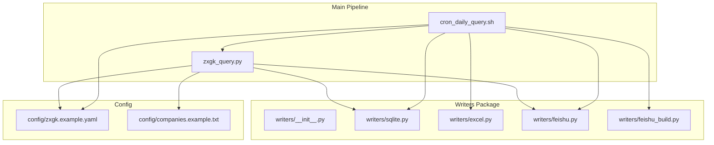
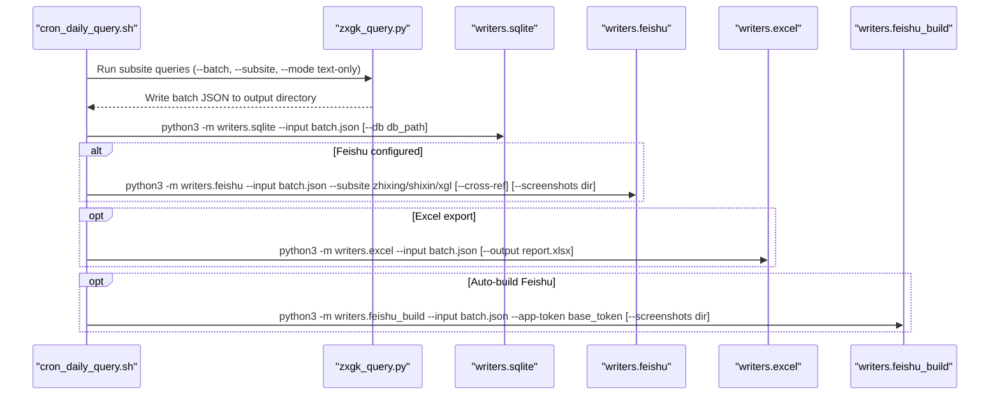
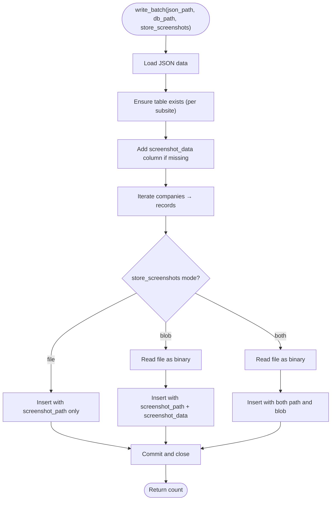
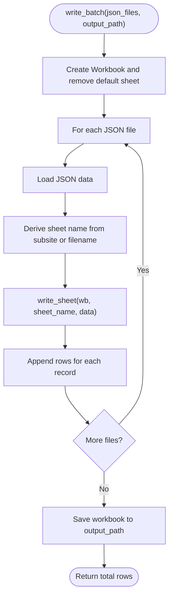
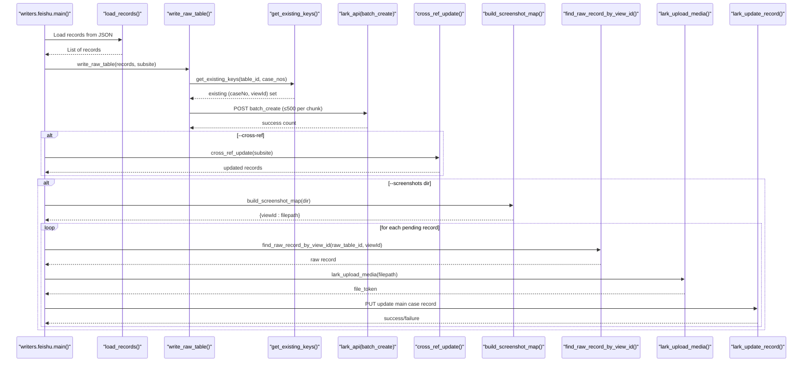
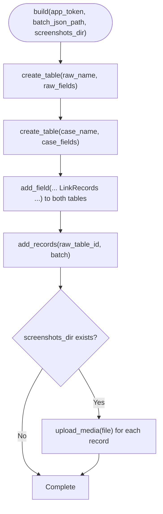
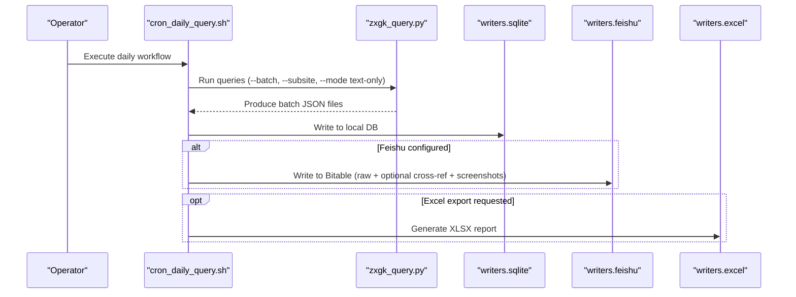
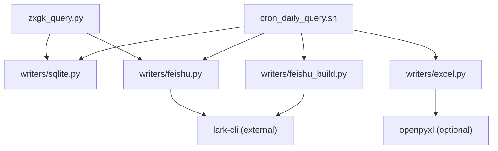

# Output Generation System

<cite>
**Referenced Files in This Document**
- [README.md](file://README.md)
- [writers/__init__.py](file://writers/__init__.py)
- [writers/sqlite.py](file://writers/sqlite.py)
- [writers/excel.py](file://writers/excel.py)
- [writers/feishu.py](file://writers/feishu.py)
- [writers/feishu_build.py](file://writers/feishu_build.py)
- [zxgk_query.py](file://zxgk_query.py)
- [cron_daily_query.sh](file://cron_daily_query.sh)
- [config/zxgk.example.yaml](file://config/zxgk.example.yaml)
- [config/companies.example.txt](file://config/companies.example.txt)
</cite>

## Table of Contents
1. [Introduction](#introduction)
2. [Project Structure](#project-structure)
3. [Core Components](#core-components)
4. [Architecture Overview](#architecture-overview)
5. [Detailed Component Analysis](#detailed-component-analysis)
6. [Dependency Analysis](#dependency-analysis)
7. [Performance Considerations](#performance-considerations)
8. [Troubleshooting Guide](#troubleshooting-guide)
9. [Conclusion](#conclusion)
10. [Appendices](#appendices)

## Introduction
This document describes the pluggable output generation system that persists and exports query results to multiple destinations. It covers the writer architecture pattern, the base interface contract, and specialized implementations for SQLite, Excel, and Feishu integration. It also documents the plugin system design, writer registration mechanisms, extensibility patterns for custom output formats, and the end-to-end workflows that integrate writers into the main query execution pipeline. Practical examples, data serialization processes, file generation workflows, error handling strategies, performance considerations, and concurrent writing strategies are included.

## Project Structure
The output generation system lives under the writers package and integrates with the main query pipeline and orchestration scripts.

**Diagram sources**
- [writers/__init__.py:1-10](file://writers/__init__.py#L1-L10)
- [writers/sqlite.py:1-121](file://writers/sqlite.py#L1-L121)
- [writers/excel.py:1-97](file://writers/excel.py#L1-L97)
- [writers/feishu.py:1-596](file://writers/feishu.py#L1-L596)
- [writers/feishu_build.py:1-242](file://writers/feishu_build.py#L1-L242)
- [zxgk_query.py:1-800](file://zxgk_query.py#L1-L800)
- [cron_daily_query.sh:1-246](file://cron_daily_query.sh#L1-L246)
- [config/zxgk.example.yaml:1-103](file://config/zxgk.example.yaml#L1-L103)
- [config/companies.example.txt:1-7](file://config/companies.example.txt#L1-L7)

**Section sources**
- [README.md:1-122](file://README.md#L1-L122)
- [writers/__init__.py:1-10](file://writers/__init__.py#L1-L10)
- [writers/sqlite.py:1-121](file://writers/sqlite.py#L1-L121)
- [writers/excel.py:1-97](file://writers/excel.py#L1-L97)
- [writers/feishu.py:1-596](file://writers/feishu.py#L1-L596)
- [writers/feishu_build.py:1-242](file://writers/feishu_build.py#L1-L242)
- [zxgk_query.py:1-800](file://zxgk_query.py#L1-L800)
- [cron_daily_query.sh:1-246](file://cron_daily_query.sh#L1-L246)
- [config/zxgk.example.yaml:1-103](file://config/zxgk.example.yaml#L1-L103)
- [config/companies.example.txt:1-7](file://config/companies.example.txt#L1-L7)

## Core Components
- Writer interface contract: Each writer module exposes a write method that accepts a batch JSON path and returns None. Writers can be invoked as Python modules with command-line arguments.
- SQLite writer: Persists normalized records to a local SQLite database with per-subsite tables and optional screenshot storage as file path or binary blob.
- Excel writer: Generates a multi-sheet XLSX report with standardized headers and formatting, suitable for manual review and sharing.
- Feishu writer: Writes to Feishu Bitable raw tables, performs cross-reference updates to a main case table, and optionally uploads screenshots to the main case table.
- Feishu build helper: Automatically creates the required tables and establishes links, then writes initial data and optional screenshots.

Key characteristics:
- Zero external dependencies for SQLite writer.
- Optional openpyxl dependency for Excel writer.
- Feishu writer depends on lark-cli for API calls and media uploads.
- Feishu build helper automates table creation and initial data population.

**Section sources**
- [writers/__init__.py:1-10](file://writers/__init__.py#L1-L10)
- [writers/sqlite.py:37-121](file://writers/sqlite.py#L37-L121)
- [writers/excel.py:56-97](file://writers/excel.py#L56-L97)
- [writers/feishu.py:154-596](file://writers/feishu.py#L154-L596)
- [writers/feishu_build.py:109-242](file://writers/feishu_build.py#L109-L242)

## Architecture Overview
The system follows a pluggable writer architecture:
- Writers implement a uniform interface: write(batch_json_path) → None.
- Writers are invoked independently via Python module entry points.
- The main query pipeline produces a batch JSON file containing normalized records.
- The orchestrator (cron script) decides which writers to run based on configuration and environment.

**Diagram sources**
- [cron_daily_query.sh:112-154](file://cron_daily_query.sh#L112-L154)
- [writers/sqlite.py:103-121](file://writers/sqlite.py#L103-L121)
- [writers/feishu.py:556-596](file://writers/feishu.py#L556-L596)
- [writers/excel.py:76-97](file://writers/excel.py#L76-L97)
- [writers/feishu_build.py:207-242](file://writers/feishu_build.py#L207-L242)

## Detailed Component Analysis

### SQLite Writer
Purpose:
- Persist normalized records locally with minimal dependencies.
- Support flexible screenshot storage modes: file path, binary blob, or both.

Key behaviors:
- Schema design: per-subsite table with primary key, batch metadata, entity fields, and optional screenshot path/blob.
- Migration: adds screenshot_data column if missing.
- Batch insertion: iterates over companies and records, inserting fields and optional screenshot binary.
- Storage modes:
  - file: store only screenshot_path; fast and disk-friendly.
  - blob: read file into memory and store as BLOB; removes local file after successful insert.
  - both: store both path and blob; retains local files.

Concurrency and I/O:
- Uses a single connection per batch write; commits once at the end.
- No explicit concurrency control; suitable for single-threaded batch processing.

Error handling:
- Validates input file existence.
- Handles OS errors when reading screenshot files.
- Prints counts and table names upon completion.

**Diagram sources**
- [writers/sqlite.py:37-100](file://writers/sqlite.py#L37-L100)

**Section sources**
- [writers/sqlite.py:19-34](file://writers/sqlite.py#L19-L34)
- [writers/sqlite.py:37-100](file://writers/sqlite.py#L37-L100)
- [writers/sqlite.py:103-121](file://writers/sqlite.py#L103-L121)

### Excel Writer
Purpose:
- Export a human-readable, formatted XLSX report with one sheet per subsite.

Key behaviors:
- Multi-sheet workbook: deletes default sheet, creates a sheet per subsite.
- Headers: standardized columns for entity name, case number, date, viewId, and screenshot path.
- Formatting: header cells styled with solid fill and centered alignment.
- Column sizing: sets widths for readability.
- Multiple inputs: supports multiple JSON files; each contributes rows to its sheet.

Concurrency and I/O:
- Single workbook opened, sheets appended, saved once at the end.
- No concurrency control; designed for single-threaded export.

Error handling:
- Validates input file existence.
- Uses optional openpyxl import guard; exits with guidance if missing.

**Diagram sources**
- [writers/excel.py:56-73](file://writers/excel.py#L56-L73)
- [writers/excel.py:29-53](file://writers/excel.py#L29-L53)

**Section sources**
- [writers/excel.py:56-73](file://writers/excel.py#L56-L73)
- [writers/excel.py:76-97](file://writers/excel.py#L76-L97)

### Feishu Writer
Purpose:
- Write normalized records to Feishu Bitable raw tables, optionally update a main case table, and upload screenshots to the main case table.

Key behaviors:
- Raw table write: deduplicates by (caseNo, viewId) within a recent window, batches inserts, and prints progress.
- Cross-reference update: for specific subsites, updates main case table fields indicating status and dates.
- Screenshot upload: scans a directory for images, maps by viewId, finds corresponding raw records, resolves main case record via duplex link, uploads media, and updates the main case record’s attachment field.

Concurrency and I/O:
- Uses lark-cli subprocess calls; introduces rate limits and sleeps between operations.
- Deduplication queries paginate and chunk filters to respect API constraints.

Error handling:
- Checks FEISHU_APP_TOKEN presence.
- Validates input file existence.
- Handles API timeouts and errors; prints detailed messages and continues where possible.

**Diagram sources**
- [writers/feishu.py:556-596](file://writers/feishu.py#L556-L596)
- [writers/feishu.py:132-147](file://writers/feishu.py#L132-L147)
- [writers/feishu.py:154-201](file://writers/feishu.py#L154-L201)
- [writers/feishu.py:208-277](file://writers/feishu.py#L208-L277)
- [writers/feishu.py:284-306](file://writers/feishu.py#L284-L306)
- [writers/feishu.py:342-366](file://writers/feishu.py#L342-L366)
- [writers/feishu.py:454-477](file://writers/feishu.py#L454-L477)

**Section sources**
- [writers/feishu.py:29-33](file://writers/feishu.py#L29-L33)
- [writers/feishu.py:34-51](file://writers/feishu.py#L34-L51)
- [writers/feishu.py:132-147](file://writers/feishu.py#L132-L147)
- [writers/feishu.py:154-201](file://writers/feishu.py#L154-L201)
- [writers/feishu.py:208-277](file://writers/feishu.py#L208-L277)
- [writers/feishu.py:284-306](file://writers/feishu.py#L284-L306)
- [writers/feishu.py:342-366](file://writers/feishu.py#L342-L366)
- [writers/feishu.py:454-477](file://writers/feishu.py#L454-L477)
- [writers/feishu.py:556-596](file://writers/feishu.py#L556-L596)

### Feishu Build Helper
Purpose:
- Automate table creation, establish duplex links, and write initial data plus optional screenshots.

Key behaviors:
- Creates raw and main case tables with predefined fields.
- Establishes duplex links between raw and main tables.
- Writes records in batches and optionally uploads screenshots.

**Diagram sources**
- [writers/feishu_build.py:109-205](file://writers/feishu_build.py#L109-L205)

**Section sources**
- [writers/feishu_build.py:109-205](file://writers/feishu_build.py#L109-L205)
- [writers/feishu_build.py:207-242](file://writers/feishu_build.py#L207-L242)

### Integration with the Main Query Execution Pipeline
- The main CLI (zxgk_query.py) generates a batch JSON file containing normalized records per company.
- The orchestrator (cron_daily_query.sh) runs subsite queries, writes SQLite, optionally writes Feishu, and optionally exports Excel.
- The Feishu writer is invoked with subsite selection and optional flags for cross-reference and screenshot upload.
- The Feishu build helper is invoked separately to bootstrap tables and initial data.

**Diagram sources**
- [cron_daily_query.sh:112-154](file://cron_daily_query.sh#L112-L154)
- [writers/sqlite.py:103-121](file://writers/sqlite.py#L103-L121)
- [writers/feishu.py:556-596](file://writers/feishu.py#L556-L596)
- [writers/excel.py:76-97](file://writers/excel.py#L76-L97)

**Section sources**
- [cron_daily_query.sh:112-154](file://cron_daily_query.sh#L112-L154)
- [writers/sqlite.py:103-121](file://writers/sqlite.py#L103-L121)
- [writers/feishu.py:556-596](file://writers/feishu.py#L556-L596)
- [writers/excel.py:76-97](file://writers/excel.py#L76-L97)

## Dependency Analysis
- SQLite writer: pure Python stdlib; zero external dependencies.
- Excel writer: requires openpyxl; guarded by import-time check.
- Feishu writer: requires lark-cli; uses subprocess calls for API and media upload.
- Feishu build helper: requires lark-cli; uses subprocess calls for table creation and uploads.
- Main pipeline: depends on configuration files and environment variables (e.g., FEISHU_APP_TOKEN).

**Diagram sources**
- [writers/excel.py:17-22](file://writers/excel.py#L17-L22)
- [writers/feishu.py:56-65](file://writers/feishu.py#L56-L65)
- [writers/feishu_build.py:28-41](file://writers/feishu_build.py#L28-L41)
- [cron_daily_query.sh:101-107](file://cron_daily_query.sh#L101-L107)

**Section sources**
- [writers/excel.py:17-22](file://writers/excel.py#L17-L22)
- [writers/feishu.py:56-65](file://writers/feishu.py#L56-L65)
- [writers/feishu_build.py:28-41](file://writers/feishu_build.py#L28-L41)
- [cron_daily_query.sh:101-107](file://cron_daily_query.sh#L101-L107)

## Performance Considerations
- SQLite:
  - Use file mode for screenshots to minimize I/O overhead and memory usage.
  - Blob mode reduces filesystem clutter but increases memory and CPU usage during reads.
  - Consider indexing on frequently queried columns if extending schema.
- Excel:
  - Single-pass write with minimal formatting; performance dominated by file I/O.
  - Avoid excessive formatting for large datasets.
- Feishu:
  - Batch size capped at 500 per request; throttling via sleeps prevents rate limiting.
  - Deduplication queries chunk filters and paginate to respect API limits.
  - Media uploads are sequential; consider parallelizing only if API allows and rate limits permit.
- Concurrency:
  - Writers are invoked as separate processes; no shared state between writers.
  - For high-throughput scenarios, consider parallelizing independent writer invocations at the orchestrator level.

[No sources needed since this section provides general guidance]

## Troubleshooting Guide
- SQLite:
  - Verify input JSON path exists.
  - If screenshot file cannot be read, the writer skips that record and continues.
- Excel:
  - Ensure openpyxl is installed; the script checks and exits with guidance if missing.
  - Output path defaults to derived from the first input file if not provided.
- Feishu:
  - Set FEISHU_APP_TOKEN environment variable; the writer checks and exits if missing.
  - Ensure lark-cli is authenticated; the orchestrator checks and warns if not.
  - API timeouts and errors are logged; retry by rerunning the job.
  - For screenshot uploads, ensure the screenshots directory exists and filenames match expected patterns.
- Feishu build:
  - Requires lark-cli authenticated user; validates and exits with guidance if not.
  - App token must be provided via argument or environment variable.

**Section sources**
- [writers/sqlite.py:112-116](file://writers/sqlite.py#L112-L116)
- [writers/excel.py:17-22](file://writers/excel.py#L17-L22)
- [writers/excel.py:82-92](file://writers/excel.py#L82-L92)
- [writers/feishu.py:29-33](file://writers/feishu.py#L29-L33)
- [writers/feishu.py:556-569](file://writers/feishu.py#L556-L569)
- [writers/feishu_build.py:220-237](file://writers/feishu_build.py#L220-L237)

## Conclusion
The output generation system provides a clean, pluggable architecture for persisting and exporting query results. Each writer adheres to a simple interface and can be composed independently. SQLite offers a robust, zero-dependency local option; Excel provides a convenient human-readable report; Feishu enables centralized collaboration with automated synchronization and screenshot uploads. The system integrates seamlessly with the main query pipeline and can be extended by adding new writer modules that conform to the established interface.

[No sources needed since this section summarizes without analyzing specific files]

## Appendices

### Writer Registration and Extensibility Patterns
- Interface contract: Each writer module exposes a write method that accepts a batch JSON path and returns None.
- Invocation: Writers are executed as Python modules with command-line arguments.
- Extensibility: To add a new writer:
  - Create a new module under writers/ with a write method and a main() entry point.
  - Add usage examples to writers/__init__.py.
  - Integrate into the orchestrator (e.g., cron script) by invoking the new module similarly to existing writers.

**Section sources**
- [writers/__init__.py:1-10](file://writers/__init__.py#L1-L10)
- [writers/sqlite.py:103-121](file://writers/sqlite.py#L103-L121)
- [writers/excel.py:76-97](file://writers/excel.py#L76-L97)
- [writers/feishu.py:556-596](file://writers/feishu.py#L556-L596)

### Practical Examples
- SQLite:
  - Store screenshots as file paths: python3 -m writers.sqlite --input batch.json
  - Store screenshots as blobs: python3 -m writers.sqlite --input batch.json --store-screenshots blob
- Excel:
  - Export to XLSX: python3 -m writers.excel --input batch.json
- Feishu:
  - Write raw table: python3 -m writers.feishu --input batch.json --subsite zhixing
  - Cross-reference and update main table: python3 -m writers.feishu --input batch.json --subsite shixin --cross-ref
  - Upload screenshots to main table: python3 -m writers.feishu --input batch.json --subsite zhixing --screenshots output/screenshots
- Feishu build:
  - Auto-create tables and write data: python3 -m writers.feishu_build --input batch.json --app-token base_token [--screenshots dir]

**Section sources**
- [README.md:35-44](file://README.md#L35-L44)
- [writers/__init__.py:6-9](file://writers/__init__.py#L6-L9)

### Batch Processing Workflows
- The orchestrator runs three subsites sequentially, writing SQLite for local backup and Feishu when configured.
- After Feishu synchronization, it waits briefly and then performs screenshot backfilling via the main pipeline’s ScreenshotBackfiller.

**Section sources**
- [cron_daily_query.sh:112-154](file://cron_daily_query.sh#L112-L154)
- [cron_daily_query.sh:215-228](file://cron_daily_query.sh#L215-L228)

### Data Serialization and File Generation
- Batch JSON: produced by the main pipeline; contains normalized records grouped by company.
- SQLite: per-subsite table with records and optional screenshot data.
- Excel: XLSX workbook with one sheet per subsite; headers and formatting applied.
- Feishu: raw table records written in batches; main case table updated via cross-reference; screenshots uploaded and attached.

**Section sources**
- [writers/sqlite.py:37-100](file://writers/sqlite.py#L37-L100)
- [writers/excel.py:56-73](file://writers/excel.py#L56-L73)
- [writers/feishu.py:154-201](file://writers/feishu.py#L154-L201)
- [writers/feishu.py:208-277](file://writers/feishu.py#L208-L277)
- [writers/feishu.py:284-306](file://writers/feishu.py#L284-L306)

### Configuration and Environment
- FEISHU_APP_TOKEN: required for Feishu writers and build helper.
- openpyxl: optional dependency for Excel writer.
- lark-cli: required for Feishu writers and build helper.

**Section sources**
- [README.md:29-34](file://README.md#L29-L34)
- [writers/excel.py:17-22](file://writers/excel.py#L17-L22)
- [writers/feishu.py:26](file://writers/feishu.py#L26)
- [writers/feishu_build.py:20-25](file://writers/feishu_build.py#L20-L25)