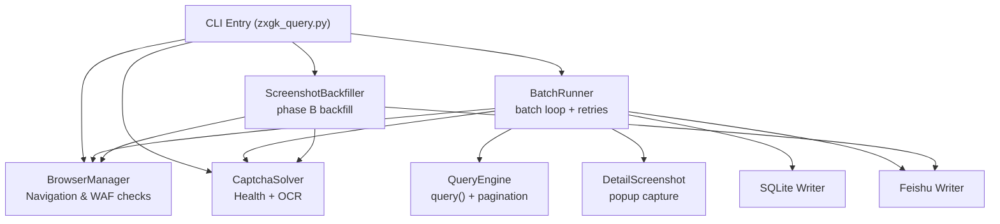
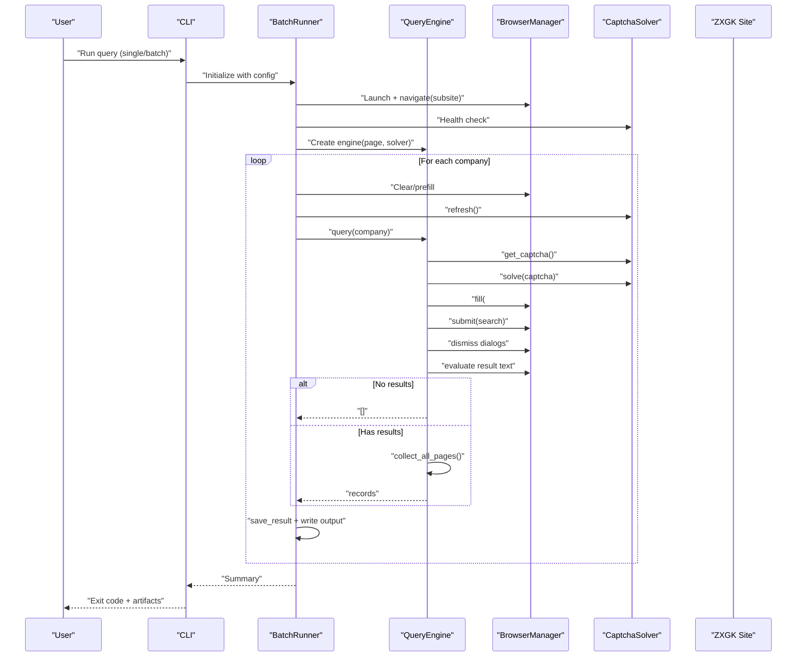
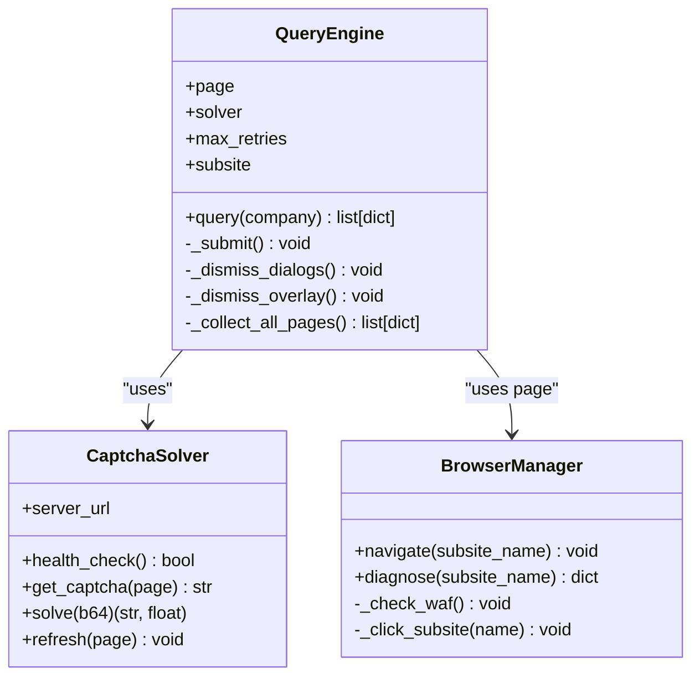
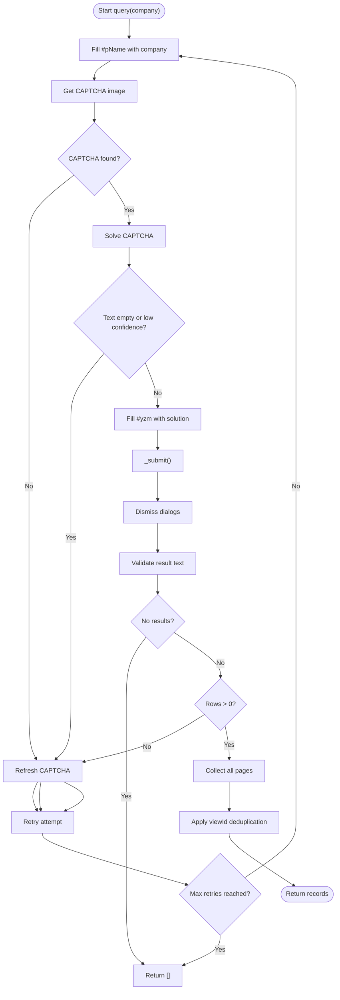
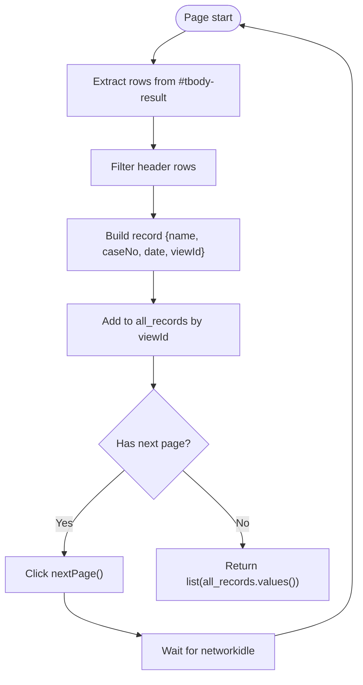
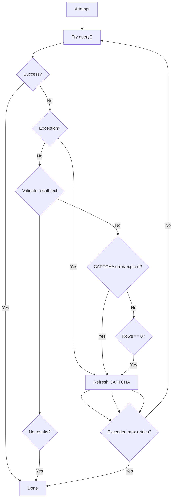
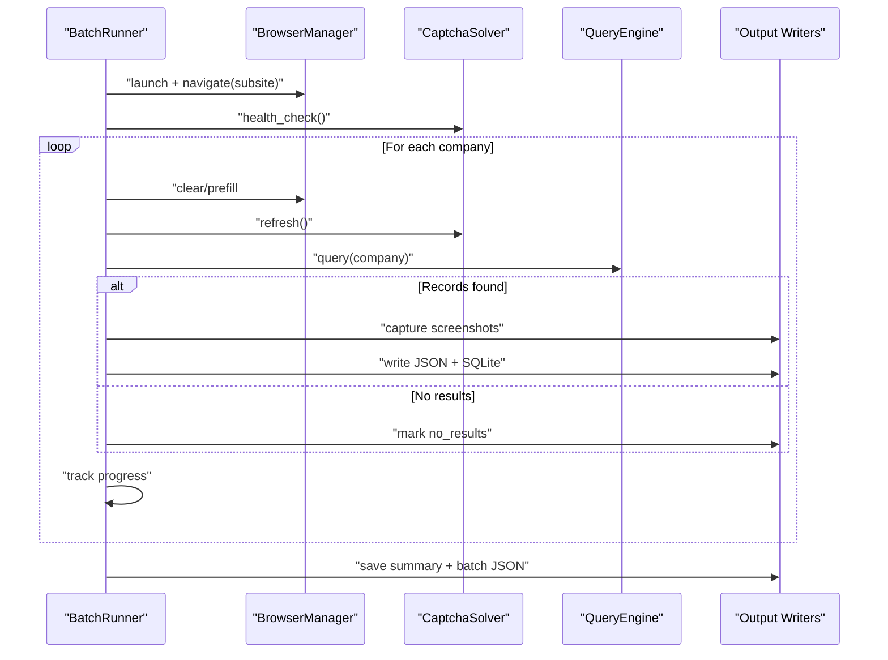
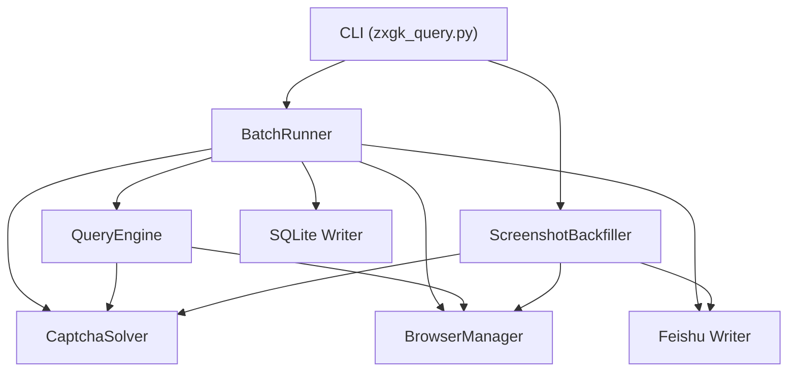

# Query Engine

<cite>
**Referenced Files in This Document**
- [zxgk_query.py](file://zxgk_query.py)
- [config/zxgk.example.yaml](file://config/zxgk.example.yaml)
- [diagnose_subsites.py](file://diagnose_subsites.py)
- [cron_daily_query.sh](file://cron_daily_query.sh)
- [setup.sh](file://setup.sh)
- [smoke_test.sh](file://smoke_test.sh)
- [writers/sqlite.py](file://writers/sqlite.py)
</cite>

## Table of Contents
1. [Introduction](#introduction)
2. [Project Structure](#project-structure)
3. [Core Components](#core-components)
4. [Architecture Overview](#architecture-overview)
5. [Detailed Component Analysis](#detailed-component-analysis)
6. [Dependency Analysis](#dependency-analysis)
7. [Performance Considerations](#performance-considerations)
8. [Troubleshooting Guide](#troubleshooting-guide)
9. [Conclusion](#conclusion)
10. [Appendices](#appendices)

## Introduction
This document provides comprehensive technical documentation for the QueryEngine class that orchestrates the complete search workflow for the China Execution Information Public Disclosure system. It explains the query execution pipeline including form population, CAPTCHA submission, result collection, pagination handling, viewId-based deduplication, Chinese date parsing, and result validation. It also covers error handling strategies, retry logic, state management, subsite-specific behaviors for zhixing, shixin, and xgl sites, result extraction, data transformation, consistency validation, and integration with browser automation and CAPTCHA solving systems.

## Project Structure
The project is organized around a central CLI that coordinates browser automation, CAPTCHA solving, result extraction, and storage. The main orchestration logic resides in a single module with clearly separated concerns:
- Browser automation and navigation
- CAPTCHA acquisition and solving
- Query execution and result collection
- Pagination handling and deduplication
- Screenshot capture and backfill
- Batch processing and progress tracking
- Output writers (SQLite, Excel, Feishu)

**Diagram sources**
- [zxgk_query.py:175-324](file://zxgk_query.py#L175-L324)
- [zxgk_query.py:328-392](file://zxgk_query.py#L328-L392)
- [zxgk_query.py:396-618](file://zxgk_query.py#L396-L618)
- [zxgk_query.py:682-725](file://zxgk_query.py#L682-L725)
- [zxgk_query.py:1065-1197](file://zxgk_query.py#L1065-L1197)
- [zxgk_query.py:776-1059](file://zxgk_query.py#L776-L1059)
- [writers/sqlite.py:19-100](file://writers/sqlite.py#L19-L100)

**Section sources**
- [zxgk_query.py:1-120](file://zxgk_query.py#L1-L120)
- [config/zxgk.example.yaml:1-103](file://config/zxgk.example.yaml#L1-L103)

## Core Components
- BrowserManager: Launches and manages a Chromium browser instance with stealth settings, navigates to subsites, performs WAF checks, and handles diagnostics.
- CaptchaSolver: Interacts with a local OCR service to capture and solve CAPTCHAs, with health checks and refresh capabilities.
- QueryEngine: Executes the core search workflow, handles CAPTCHA submission, collects results across pages, applies viewId-based deduplication, and validates results.
- DetailScreenshot: Captures screenshots of detail popups using DOM-based and pixel-based extraction.
- BatchRunner: Orchestrates batch queries with retry logic, WAF cooling, and progress tracking.
- ScreenshotBackfiller: Phase B backfill of missing screenshots by re-querying and uploading to Feishu.
- Writers: Output writers for SQLite, Excel, and Feishu.

**Section sources**
- [zxgk_query.py:175-324](file://zxgk_query.py#L175-L324)
- [zxgk_query.py:328-392](file://zxgk_query.py#L328-L392)
- [zxgk_query.py:396-618](file://zxgk_query.py#L396-L618)
- [zxgk_query.py:682-725](file://zxgk_query.py#L682-L725)
- [zxgk_query.py:1065-1197](file://zxgk_query.py#L1065-L1197)
- [zxgk_query.py:776-1059](file://zxgk_query.py#L776-L1059)
- [writers/sqlite.py:19-100](file://writers/sqlite.py#L19-L100)

## Architecture Overview
The QueryEngine sits at the center of the search pipeline, coordinating with BrowserManager and CaptchaSolver to submit queries, handle CAPTCHA challenges, and collect results. It integrates with BatchRunner for batch processing and with DetailScreenshot for capturing detail popups. Results are validated, transformed, and written to storage.

**Diagram sources**
- [zxgk_query.py:1095-1197](file://zxgk_query.py#L1095-L1197)
- [zxgk_query.py:409-482](file://zxgk_query.py#L409-L482)
- [zxgk_query.py:558-618](file://zxgk_query.py#L558-L618)
- [zxgk_query.py:328-392](file://zxgk_query.py#L328-L392)
- [zxgk_query.py:175-324](file://zxgk_query.py#L175-L324)

## Detailed Component Analysis

### QueryEngine
The QueryEngine encapsulates the end-to-end search workflow. It ensures the page has a fresh CAPTCHA before each query, submits the form, validates the response, and collects results across pages while applying viewId-based deduplication.

Key behaviors:
- Form population: fills the company name into the search field.
- CAPTCHA handling: retrieves the CAPTCHA image, solves it, and fills the CAPTCHA field.
- Submission: waits for the search function to be ready, initializes current page state, invokes the search function, and dismisses overlays.
- Result validation: checks for “no results” messages and CAPTCHA rejection messages.
- Pagination: iterates through pages, extracts records, and applies viewId-based deduplication.
- Date parsing: converts Chinese dates to epoch milliseconds for consistent sorting and filtering.

**Diagram sources**
- [zxgk_query.py:396-618](file://zxgk_query.py#L396-L618)
- [zxgk_query.py:328-392](file://zxgk_query.py#L328-L392)
- [zxgk_query.py:175-324](file://zxgk_query.py#L175-L324)

**Section sources**
- [zxgk_query.py:396-618](file://zxgk_query.py#L396-L618)
- [zxgk_query.py:155-164](file://zxgk_query.py#L155-L164)

#### Query Execution Flow

**Diagram sources**
- [zxgk_query.py:409-482](file://zxgk_query.py#L409-L482)
- [zxgk_query.py:484-505](file://zxgk_query.py#L484-L505)
- [zxgk_query.py:558-618](file://zxgk_query.py#L558-L618)

#### Pagination and Deduplication
- Pagination detection: checks for a next button element and its disabled/visibility state, with a fallback to scanning the page body for “next” indicators.
- Record extraction: selects rows from the result table, filters out header rows, and extracts name, case number, date, and viewId from the detail link’s onclick attribute.
- Deduplication: maintains a dictionary keyed by viewId to ensure uniqueness across pages and sessions.
- Date normalization: converts Chinese date strings to epoch milliseconds for consistent downstream processing.

**Diagram sources**
- [zxgk_query.py:558-618](file://zxgk_query.py#L558-L618)

#### Subsite-Specific Behaviors
- zhixing: Standard behavior with no special configuration.
- shixin: Explicitly sets the province filter to “all” before searching to ensure broader coverage.
- xgl: Includes an additional column for enterprise information compared to other subsites.

These differences are reflected in the subsite configuration and the diagnostic tool’s probing of DOM structures.

**Section sources**
- [zxgk_query.py:416-421](file://zxgk_query.py#L416-L421)
- [config/zxgk.example.yaml:32-44](file://config/zxgk.example.yaml#L32-L44)
- [diagnose_subsites.py:103-330](file://diagnose_subsites.py#L103-L330)

#### Result Extraction and Transformation
- Field mapping: Extracts name, case number, date, and viewId from the result table.
- Data transformation: Converts Chinese dates to numeric timestamps for consistency.
- Consistency validation: Skips rows with insufficient columns or header-only rows; validates presence of detail links.

**Section sources**
- [zxgk_query.py:564-582](file://zxgk_query.py#L564-L582)
- [zxgk_query.py:588-589](file://zxgk_query.py#L588-L589)

#### Error Handling and Retry Logic
- WAF封禁 detection: Checks for the presence of the CAPTCHA element and body length to detect封禁 conditions.
- CAPTCHA failures: Retries on CAPTCHA errors or expired CAPTCHAs by refreshing and re-solving.
- General exceptions: Wraps query attempts in exception handling and refreshes CAPTCHA on failure.
- Retry limits: Configurable maximum retries per query attempt.
- Continuous failure handling: BatchRunner restarts the browser after a configurable number of consecutive failures.

**Diagram sources**
- [zxgk_query.py:409-482](file://zxgk_query.py#L409-L482)
- [zxgk_query.py:1168-1187](file://zxgk_query.py#L1168-L1187)

**Section sources**
- [zxgk_query.py:297-304](file://zxgk_query.py#L297-L304)
- [zxgk_query.py:453-456](file://zxgk_query.py#L453-L456)
- [zxgk_query.py:477-482](file://zxgk_query.py#L477-L482)
- [zxgk_query.py:1168-1187](file://zxgk_query.py#L1168-L1187)

### BatchRunner
BatchRunner coordinates repeated queries across companies, managing browser lifecycle, CAPTCHA freshness, and output persistence. It implements:
- Progress tracking to support resume functionality.
- WAF cooling periods and consecutive failure thresholds.
- Conditional Feishu writing and screenshot capture modes.
- Consolidation of results into a structured batch JSON.

**Diagram sources**
- [zxgk_query.py:1095-1197](file://zxgk_query.py#L1095-L1197)
- [writers/sqlite.py:37-100](file://writers/sqlite.py#L37-L100)

**Section sources**
- [zxgk_query.py:1065-1197](file://zxgk_query.py#L1065-L1197)

### ScreenshotBackfiller (Phase B)
Phase B identifies missing screenshots from the case table, re-queries the site, captures detail popups, and uploads them to Feishu. It:
- Queries the case table for records with empty screenshot fields.
- Resolves real viewIds via DuplexLink references.
- Navigates to the zhixing subsite, performs CAPTCHA verification, and captures screenshots.
- Uploads screenshots to Feishu and updates the case record.

**Diagram sources**
- [zxgk_query.py:824-1059](file://zxgk_query.py#L824-L1059)

**Section sources**
- [zxgk_query.py:776-1059](file://zxgk_query.py#L776-L1059)

### Writers
- SQLite writer: Writes batch results to a local SQLite database, supporting storing screenshot paths or binary data.
- Excel writer: Outputs results to Excel format.
- Feishu writer: Writes results to Feishu tables (placeholder in current code).

**Section sources**
- [writers/sqlite.py:19-100](file://writers/sqlite.py#L19-L100)
- [zxgk_query.py:730-772](file://zxgk_query.py#L730-L772)

## Dependency Analysis
The system exhibits clear separation of concerns with explicit dependencies:
- CLI depends on BatchRunner for batch operations and on individual runners for single queries.
- BatchRunner depends on BrowserManager, CaptchaSolver, QueryEngine, and output writers.
- QueryEngine depends on CaptchaSolver and BrowserManager.
- ScreenshotBackfiller depends on BrowserManager, CaptchaSolver, and Feishu APIs.

**Diagram sources**
- [zxgk_query.py:1065-1197](file://zxgk_query.py#L1065-L1197)
- [zxgk_query.py:396-618](file://zxgk_query.py#L396-L618)
- [zxgk_query.py:175-324](file://zxgk_query.py#L175-L324)
- [zxgk_query.py:328-392](file://zxgk_query.py#L328-L392)
- [zxgk_query.py:776-1059](file://zxgk_query.py#L776-L1059)
- [writers/sqlite.py:37-100](file://writers/sqlite.py#L37-L100)

**Section sources**
- [zxgk_query.py:1065-1197](file://zxgk_query.py#L1065-L1197)
- [zxgk_query.py:396-618](file://zxgk_query.py#L396-L618)

## Performance Considerations
- Browser reuse: Reusing a single browser session across queries reduces startup overhead.
- Stealth settings: Applying stealth attributes helps reduce detection and improves stability.
- Timeout tuning: Configurable timeouts for page loads and network idle states balance reliability and speed.
- Retry strategies: Controlled retries for CAPTCHA and WAF封禁 prevent unnecessary failures.
- Output modes: Using text-only mode reduces screenshot overhead for large batches.
- Concurrency: The current implementation runs sequentially; parallelization could improve throughput but requires careful state management.

[No sources needed since this section provides general guidance]

## Troubleshooting Guide
Common issues and resolutions:
- WAF封禁: Detected when the CAPTCHA element is absent or body length indicates封禁. The system automatically retries with delays.
- CAPTCHA solver unavailable: Health check failure prevents execution; ensure the OCR service is running on the configured port.
- Navigation failures: CSS selectors for subsites may change; use the diagnostic tool to probe DOM structures.
- No results: The system distinguishes between “no results” and “CAPTCHA error.” In the latter case, it refreshes and retries.
- Continuous failures: The BatchRunner restarts the browser after a threshold of consecutive failures to recover from state corruption.

**Section sources**
- [zxgk_query.py:297-304](file://zxgk_query.py#L297-L304)
- [zxgk_query.py:1157-1187](file://zxgk_query.py#L1157-L1187)
- [diagnose_subsites.py:103-330](file://diagnose_subsites.py#L103-L330)

## Conclusion
The QueryEngine provides a robust, modular framework for automating queries against the China Execution Information Public Disclosure system. It integrates browser automation, CAPTCHA solving, result extraction, pagination, and output persistence while offering comprehensive error handling, retry logic, and subsite-specific adaptations. The design supports both single queries and large-scale batch processing, with clear pathways for diagnostics and recovery.

[No sources needed since this section summarizes without analyzing specific files]

## Appendices

### Practical Examples
- Single query: Run a single company search with optional screenshots and Feishu writing.
- Batch processing: Execute queries for a list of companies with progress tracking and consolidated output.
- Error recovery: The system handles封禁, CAPTCHA errors, and continuous failures with automatic retries and browser restarts.

**Section sources**
- [zxgk_query.py:1385-1456](file://zxgk_query.py#L1385-L1456)
- [zxgk_query.py:1471-1509](file://zxgk_query.py#L1471-L1509)
- [cron_daily_query.sh:112-154](file://cron_daily_query.sh#L112-L154)

### Configuration Reference
- Subsite configuration: Defines CSS selectors and extra wait times for each subsite.
- WAF parameters: Controls retry counts, cooldown periods, intervals, and screenshot timing.
- Output settings: Directories for JSON and screenshot storage.

**Section sources**
- [config/zxgk.example.yaml:32-96](file://config/zxgk.example.yaml#L32-L96)

### Setup and Diagnostics
- One-click setup: Installs Python dependencies, Playwright Chromium, lark-cli, and optional OCR service.
- Smoke testing: Validates Python/Shell syntax, YAML configuration, environment variables, and recent batch JSON format.
- Subsite diagnostics: Probes DOM structures and pagination behavior across all three subsites.

**Section sources**
- [setup.sh:1-150](file://setup.sh#L1-L150)
- [smoke_test.sh:1-155](file://smoke_test.sh#L1-L155)
- [diagnose_subsites.py:1-429](file://diagnose_subsites.py#L1-L429)