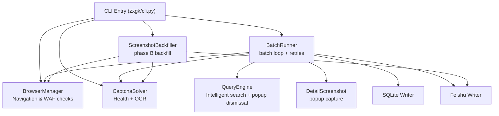
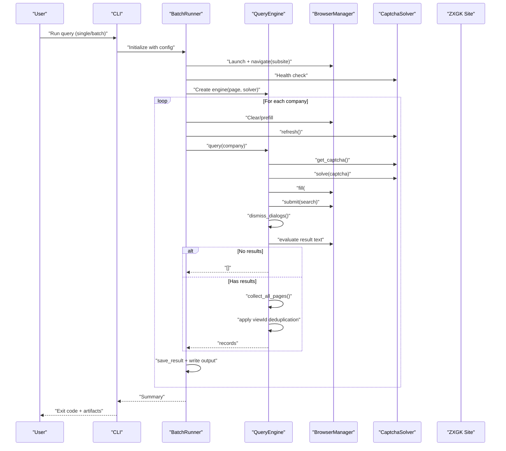
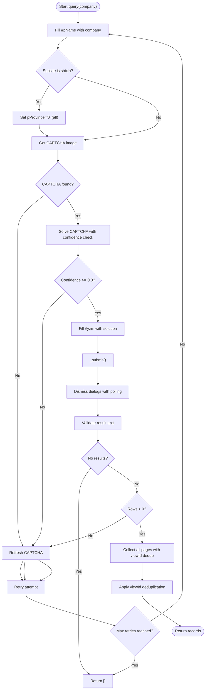
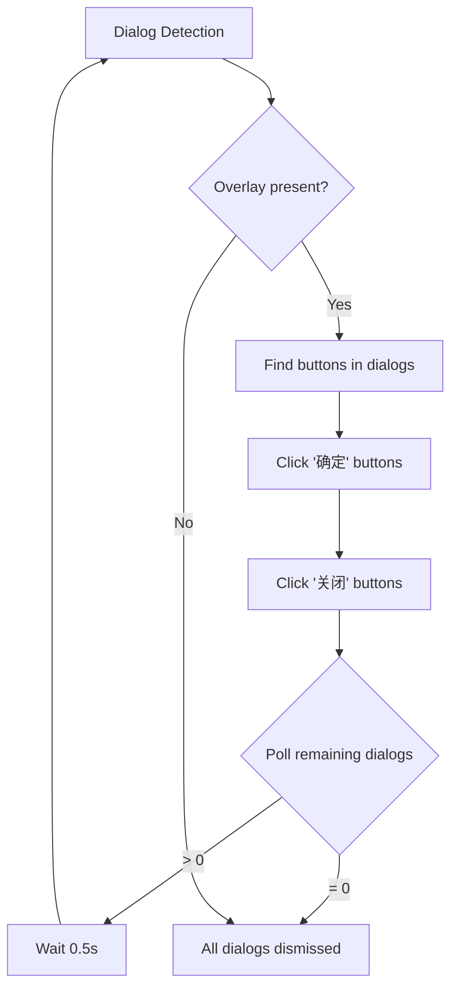
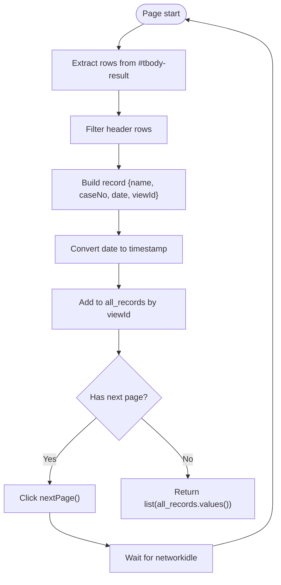
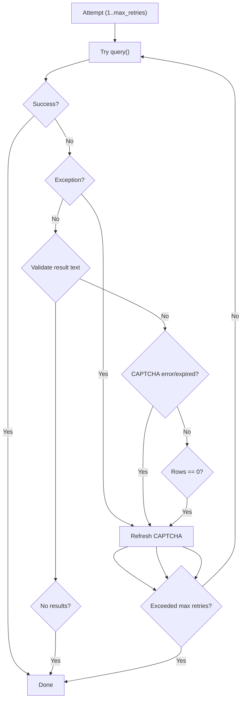
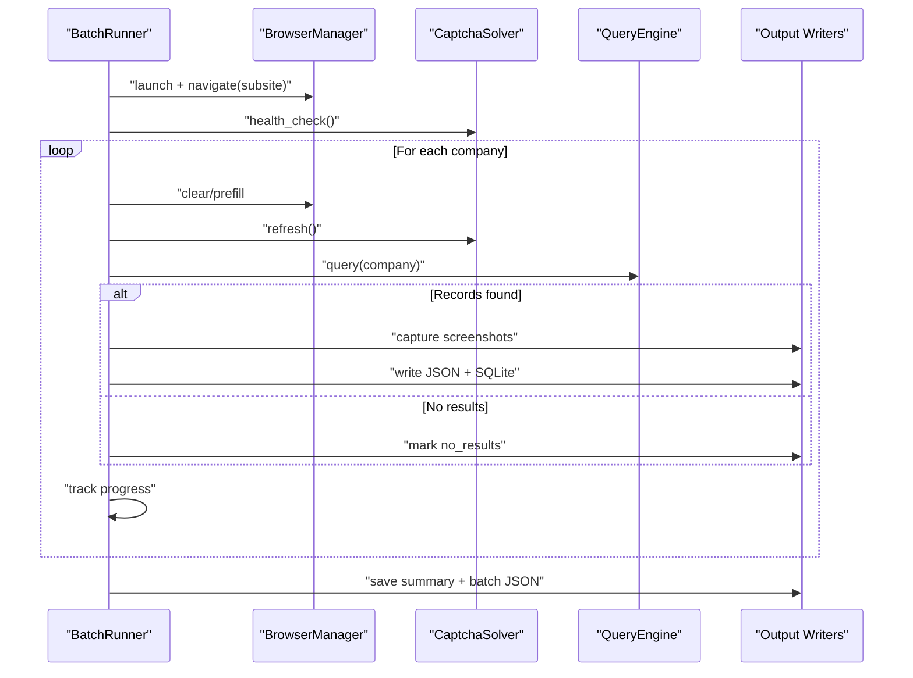
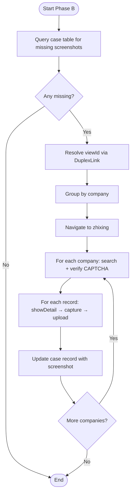
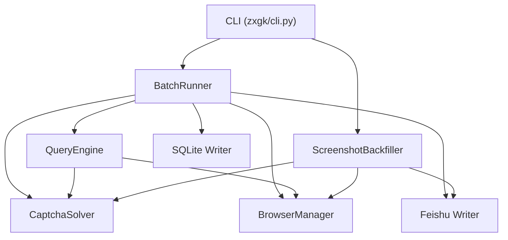

# Query Engine

<cite>
**Referenced Files in This Document**
- [zxgk/query.py](file://zxgk/query.py)
- [zxgk/cli.py](file://zxgk/cli.py)
- [zxgk/runner.py](file://zxgk/runner.py)
- [zxgk/browser.py](file://zxgk/browser.py)
- [zxgk/captcha.py](file://zxgk/captcha.py)
- [zxgk/config.py](file://zxgk/config.py)
- [config/zxgk.example.yaml](file://config/zxgk.example.yaml)
- [diagnose_subsites.py](file://diagnose_subsites.py)
- [writers/sqlite.py](file://writers/sqlite.py)
</cite>

## Update Summary
**Changes Made**
- Updated QueryEngine class documentation to reflect the new 275-line implementation in zxgk/query.py
- Added detailed analysis of the intelligent search algorithms and configurable retry mechanisms
- Documented the popup dismissal automation system with module-level utilities
- Enhanced pagination handling and viewId-based deduplication documentation
- Updated subsite-specific behaviors for zhixing, shixin, and xgl sites
- Added comprehensive error handling and retry logic documentation
- Documented the new module-level dialog dismissal utilities

## Table of Contents
1. [Introduction](#introduction)
2. [Project Structure](#project-structure)
3. [Core Components](#core-components)
4. [Architecture Overview](#architecture-overview)
5. [Detailed Component Analysis](#detailed-component-analysis)
6. [Dependency Analysis](#dependency-analysis)
7. [Performance Considerations](#performance-considerations)
8. [Troubleshooting Guide](#troubleshooting-guide)
9. [Conclusion](#conclusion)
10. [Appendices](#appendices)

## Introduction
This document provides comprehensive technical documentation for the QueryEngine class that orchestrates the complete search workflow for the China Execution Information Public Disclosure system. The QueryEngine has been completely redesigned as a 275-line implementation in zxgk/query.py, featuring intelligent search algorithms with configurable retry mechanisms, sophisticated popup dismissal automation, and robust result collection strategies. It explains the query execution pipeline including form population, CAPTCHA submission, result collection, pagination handling, viewId-based deduplication, Chinese date parsing, and result validation. It also covers error handling strategies, retry logic, state management, subsite-specific behaviors for zhixing, shixin, and xgl sites, result extraction, data transformation, consistency validation, and integration with browser automation and CAPTCHA solving systems.

## Project Structure
The project is organized around a central CLI that coordinates browser automation, CAPTCHA solving, result extraction, and storage. The main orchestration logic has been centralized in the new QueryEngine class with clearly separated concerns:
- Browser automation and navigation
- CAPTCHA acquisition and solving
- Intelligent query execution with popup dismissal
- Sophisticated pagination handling and deduplication
- Screenshot capture and backfill
- Batch processing and progress tracking
- Output writers (SQLite, Excel, Feishu)

**Diagram sources**
- [zxgk/cli.py:104-111](file://zxgk/cli.py#L104-L111)
- [zxgk/runner.py:59-65](file://zxgk/runner.py#L59-L65)
- [zxgk/query.py:53-65](file://zxgk/query.py#L53-L65)

**Section sources**
- [zxgk/cli.py:1-321](file://zxgk/cli.py#L1-L321)
- [config/zxgk.example.yaml:1-103](file://config/zxgk.example.yaml#L1-L103)

## Core Components
- **BrowserManager**: Launches and manages a Chromium browser instance with stealth settings, navigates to subsites, performs WAF checks, and handles diagnostics.
- **CaptchaSolver**: Interacts with a local OCR service to capture and solve CAPTCHAs, with health checks and refresh capabilities.
- **QueryEngine**: **NEW** - Executes the core search workflow with intelligent retry mechanisms, popup dismissal automation, and sophisticated result collection strategies.
- **DetailScreenshot**: Captures screenshots of detail popups using DOM-based and pixel-based extraction.
- **BatchRunner**: Orchestrates batch queries with retry logic, WAF cooling, and progress tracking.
- **ScreenshotBackfiller**: Phase B backfill of missing screenshots by re-querying and uploading to Feishu.
- **Writers**: Output writers for SQLite, Excel, and Feishu.

**Section sources**
- [zxgk/browser.py:58-190](file://zxgk/browser.py#L58-L190)
- [zxgk/captcha.py:9-73](file://zxgk/captcha.py#L9-L73)
- [zxgk/query.py:53-276](file://zxgk/query.py#L53-L276)
- [zxgk/runner.py:15-278](file://zxgk/runner.py#L15-L278)

## Architecture Overview
The QueryEngine sits at the center of the search pipeline, coordinating with BrowserManager and CaptchaSolver to submit queries, handle CAPTCHA challenges, and collect results. It integrates with BatchRunner for batch processing and with DetailScreenshot for capturing detail popups. The new implementation features sophisticated popup dismissal automation and intelligent retry mechanisms.

**Diagram sources**
- [zxgk/cli.py:104-111](file://zxgk/cli.py#L104-L111)
- [zxgk/query.py:66-139](file://zxgk/query.py#L66-L139)
- [zxgk/query.py:141-162](file://zxgk/query.py#L141-L162)
- [zxgk/query.py:197-214](file://zxgk/query.py#L197-L214)

## Detailed Component Analysis

### QueryEngine
**NEW** - The QueryEngine encapsulates the end-to-end search workflow with sophisticated popup dismissal automation and intelligent retry mechanisms. It ensures the page has a fresh CAPTCHA before each query, submits the form, validates the response, and collects results across pages while applying viewId-based deduplication.

Key behaviors:
- **Form population**: fills the company name into the search field.
- **CAPTCHA handling**: retrieves the CAPTCHA image, solves it with confidence checking, and fills the CAPTCHA field.
- **Submission**: waits for the search function to be ready, initializes current page state, invokes the search function, and dismisses overlays.
- **Popup dismissal**: **NEW** - Implements sophisticated dialog and overlay dismissal with polling mechanism.
- **Result validation**: checks for "no results" messages and CAPTCHA rejection messages.
- **Pagination**: iterates through pages, extracts records, and applies viewId-based deduplication.
- **Date parsing**: converts Chinese dates to epoch milliseconds for consistent sorting and filtering.

**Diagram sources**
- [zxgk/query.py:53-276](file://zxgk/query.py#L53-L276)
- [zxgk/captcha.py:9-73](file://zxgk/captcha.py#L9-L73)
- [zxgk/browser.py:58-190](file://zxgk/browser.py#L58-L190)

**Section sources**
- [zxgk/query.py:53-276](file://zxgk/query.py#L53-L276)

#### Query Execution Flow
**UPDATED** - The QueryEngine now features sophisticated retry mechanisms with configurable maximum attempts and intelligent popup dismissal automation.

**Diagram sources**
- [zxgk/query.py:66-139](file://zxgk/query.py#L66-L139)
- [zxgk/query.py:141-162](file://zxgk/query.py#L141-L162)
- [zxgk/query.py:197-214](file://zxgk/query.py#L197-L214)

#### Popup Dismissal Automation
**NEW** - The QueryEngine implements sophisticated popup dismissal automation with module-level utilities for reusable dialog handling.

The system features two levels of popup dismissal:
- **Module-level utilities**: `dismiss_overlay()` and `dismiss_dialogs()` provide reusable dialog handling for external tools like diagnose_subsites.py
- **Class-level automation**: `_dismiss_overlay()` and `_dismiss_dialogs()` integrate directly into the query workflow

**Diagram sources**
- [zxgk/query.py:8-51](file://zxgk/query.py#L8-L51)
- [zxgk/query.py:164-195](file://zxgk/query.py#L164-L195)
- [zxgk/query.py:197-214](file://zxgk/query.py#L197-L214)

#### Pagination and Deduplication
- **Pagination detection**: checks for a next button element and its disabled/visibility state, with a fallback to scanning the page body for "next" indicators.
- **Record extraction**: selects rows from the result table, filters out header rows, and extracts name, case number, date, and viewId from the detail link's onclick attribute.
- **Deduplication**: maintains a dictionary keyed by viewId to ensure uniqueness across pages and sessions.
- **Date normalization**: converts Chinese date strings to epoch milliseconds for consistent downstream processing.

**Diagram sources**
- [zxgk/query.py:215-276](file://zxgk/query.py#L215-L276)

#### Subsite-Specific Behaviors
- **zhixing**: Standard behavior with no special configuration.
- **shixin**: **NEW** - Explicitly sets the province filter to "all" (value "0") before searching to ensure broader coverage.
- **xgl**: Includes an additional column for enterprise information compared to other subsites.

These differences are reflected in the subsite configuration and the diagnostic tool's probing of DOM structures.

**Section sources**
- [zxgk/query.py:72-78](file://zxgk/query.py#L72-L78)
- [config/zxgk.example.yaml:32-44](file://config/zxgk.example.yaml#L32-L44)
- [diagnose_subsites.py:47-167](file://diagnose_subsites.py#L47-L167)

#### Result Extraction and Transformation
- **Field mapping**: Extracts name, case number, date, and viewId from the result table.
- **Data transformation**: Converts Chinese dates to numeric timestamps for consistency.
- **Consistency validation**: Skips rows with insufficient columns or header-only rows; validates presence of detail links.

**Section sources**
- [zxgk/query.py:221-239](file://zxgk/query.py#L221-L239)
- [zxgk/config.py:90-99](file://zxgk/config.py#L90-L99)

#### Error Handling and Retry Logic
**UPDATED** - The QueryEngine features sophisticated retry mechanisms with configurable maximum attempts and intelligent error detection.

- **WAF封禁 detection**: Checks for the presence of the CAPTCHA element and body length to detect封禁 conditions.
- **CAPTCHA failures**: Retries on CAPTCHA errors or expired CAPTCHAs by refreshing and re-solving.
- **General exceptions**: Wraps query attempts in exception handling and refreshes CAPTCHA on failure.
- **Retry limits**: Configurable maximum retries per query attempt (default 5).
- **Continuous failure handling**: BatchRunner restarts the browser after a configurable number of consecutive failures.
- **Confidence-based filtering**: **NEW** - Rejects CAPTCHA solutions with confidence below 0.3.

**Diagram sources**
- [zxgk/query.py:66-139](file://zxgk/query.py#L66-L139)
- [zxgk/runner.py:116-135](file://zxgk/runner.py#L116-L135)

**Section sources**
- [zxgk/query.py:66-139](file://zxgk/query.py#L66-L139)
- [zxgk/runner.py:104-145](file://zxgk/runner.py#L104-L145)

### BatchRunner
BatchRunner coordinates repeated queries across companies, managing browser lifecycle, CAPTCHA freshness, and output persistence. It implements:
- Progress tracking to support resume functionality.
- WAF cooling periods and consecutive failure thresholds.
- Conditional Feishu writing and screenshot capture modes.
- Consolidation of results into a structured batch JSON.

**Diagram sources**
- [zxgk/runner.py:45-145](file://zxgk/runner.py#L45-L145)
- [writers/sqlite.py:37-100](file://writers/sqlite.py#L37-L100)

**Section sources**
- [zxgk/runner.py:15-278](file://zxgk/runner.py#L15-L278)

### ScreenshotBackfiller (Phase B)
Phase B identifies missing screenshots from the case table, re-queries the site, captures detail popups, and uploads them to Feishu. It:
- Queries the case table for records with empty screenshot fields.
- Resolves real viewIds via DuplexLink references.
- Navigates to the zhixing subsite, performs CAPTCHA verification, and captures screenshots.
- Uploads screenshots to Feishu and updates the case record.

**Diagram sources**
- [zxgk/cli.py:166-178](file://zxgk/cli.py#L166-L178)

**Section sources**
- [zxgk/cli.py:166-178](file://zxgk/cli.py#L166-L178)

### Writers
- **SQLite writer**: Writes batch results to a local SQLite database, supporting storing screenshot paths or binary data.
- **Excel writer**: Outputs results to Excel format.
- **Feishu writer**: Writes results to Feishu tables (placeholder in current code).

**Section sources**
- [writers/sqlite.py:1-121](file://writers/sqlite.py#L1-L121)
- [zxgk/cli.py:145-157](file://zxgk/cli.py#L145-L157)

## Dependency Analysis
The system exhibits clear separation of concerns with explicit dependencies:
- CLI depends on BatchRunner for batch operations and on individual runners for single queries.
- BatchRunner depends on BrowserManager, CaptchaSolver, QueryEngine, and output writers.
- QueryEngine depends on CaptchaSolver and BrowserManager.
- ScreenshotBackfiller depends on BrowserManager, CaptchaSolver, and Feishu APIs.

**Diagram sources**
- [zxgk/cli.py:104-111](file://zxgk/cli.py#L104-L111)
- [zxgk/runner.py:59-65](file://zxgk/runner.py#L59-L65)
- [zxgk/query.py:53-65](file://zxgk/query.py#L53-L65)

**Section sources**
- [zxgk/cli.py:104-111](file://zxgk/cli.py#L104-L111)
- [zxgk/runner.py:59-65](file://zxgk/runner.py#L59-L65)

## Performance Considerations
- **Browser reuse**: Reusing a single browser session across queries reduces startup overhead.
- **Stealth settings**: Applying stealth attributes helps reduce detection and improves stability.
- **Timeout tuning**: Configurable timeouts for page loads and network idle states balance reliability and speed.
- **Retry strategies**: Controlled retries for CAPTCHA and WAF封禁 prevent unnecessary failures.
- **Output modes**: Using text-only mode reduces screenshot overhead for large batches.
- **Concurrent processing**: The current implementation runs sequentially; parallelization could improve throughput but requires careful state management.
- **Popup dismissal optimization**: **NEW** - The polling-based dialog dismissal system optimizes for minimal waiting time while ensuring all overlays are cleared.

## Troubleshooting Guide
Common issues and resolutions:
- **WAF封禁**: Detected when the CAPTCHA element is absent or body length indicates封禁. The system automatically retries with delays.
- **CAPTCHA solver unavailable**: Health check failure prevents execution; ensure the OCR service is running on the configured port.
- **Navigation failures**: CSS selectors for subsites may change; use the diagnostic tool to probe DOM structures.
- **No results**: The system distinguishes between "no results" and "CAPTCHA error." In the latter case, it refreshes and retries.
- **Continuous failures**: The BatchRunner restarts the browser after a threshold of consecutive failures to recover from state corruption.
- **Popup blocking**: **NEW** - The sophisticated dialog dismissal system handles various overlay types including confirmation dialogs, error popups, and modal windows.
- **Confidence issues**: **NEW** - CAPTCHA solutions with confidence below 0.3 are automatically rejected to prevent false positives.

**Section sources**
- [zxgk/query.py:66-139](file://zxgk/query.py#L66-L139)
- [zxgk/runner.py:104-145](file://zxgk/runner.py#L104-L145)
- [diagnose_subsites.py:47-167](file://diagnose_subsites.py#L47-L167)

## Conclusion
The QueryEngine provides a robust, modular framework for automating queries against the China Execution Information Public Disclosure system. The new 275-line implementation features sophisticated popup dismissal automation, intelligent retry mechanisms, and configurable error handling. It integrates browser automation, CAPTCHA solving, result extraction, pagination, and output persistence while offering comprehensive error handling, retry logic, and subsite-specific adaptations. The design supports both single queries and large-scale batch processing, with clear pathways for diagnostics and recovery.

## Appendices

### Practical Examples
- **Single query**: Run a single company search with optional screenshots and Feishu writing.
- **Batch processing**: Execute queries for a list of companies with progress tracking and consolidated output.
- **Error recovery**: The system handles封禁, CAPTCHA errors, and continuous failures with automatic retries and browser restarts.
- **Popup dismissal**: **NEW** - The system automatically handles various types of overlays and dialogs during the query process.

**Section sources**
- [zxgk/cli.py:86-164](file://zxgk/cli.py#L86-L164)
- [zxgk/runner.py:181-220](file://zxgk/runner.py#L181-L220)

### Configuration Reference
- **Subsite configuration**: Defines CSS selectors and extra wait times for each subsite.
- **WAF parameters**: Controls retry counts, cooldown periods, intervals, and screenshot timing.
- **Output settings**: Directories for JSON and screenshot storage.

**Section sources**
- [config/zxgk.example.yaml:32-96](file://config/zxgk.example.yaml#L32-L96)

### Setup and Diagnostics
- **One-click setup**: Installs Python dependencies, Playwright Chromium, lark-cli, and optional OCR service.
- **Smoke testing**: Validates Python/Shell syntax, YAML configuration, environment variables, and recent batch JSON format.
- **Subsite diagnostics**: Probes DOM structures and pagination behavior across all three subsites.

**Section sources**
- [zxgk/cli.py:25-84](file://zxgk/cli.py#L25-L84)
- [diagnose_subsites.py:1-200](file://diagnose_subsites.py#L1-L200)