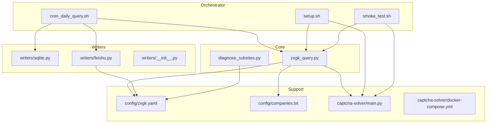
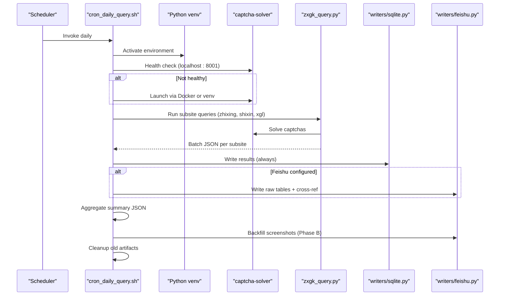
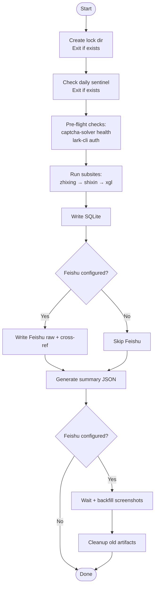
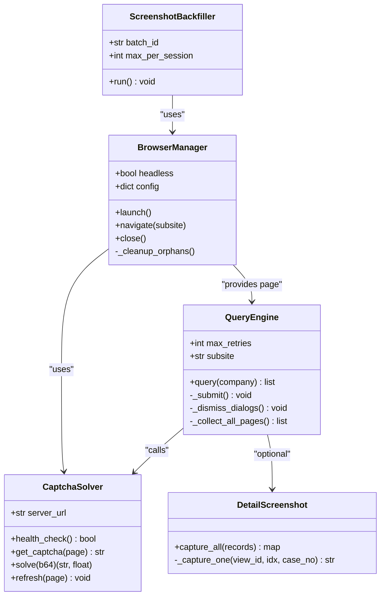
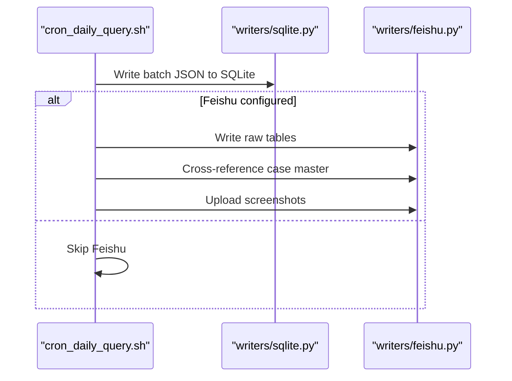
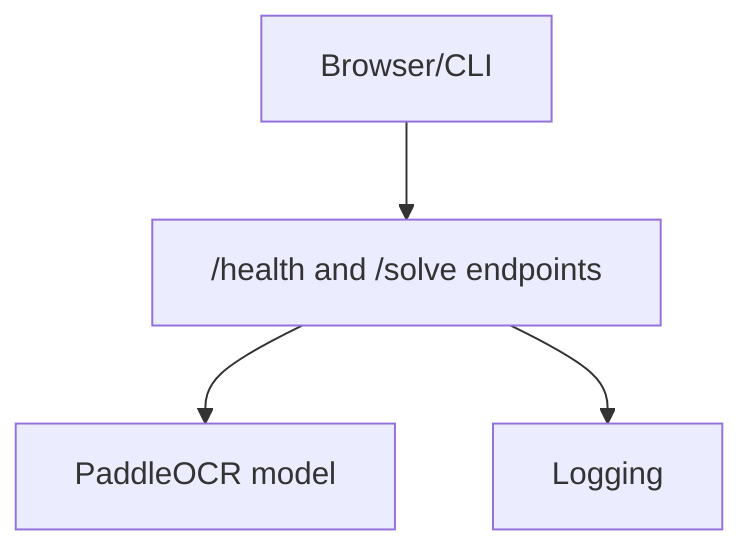
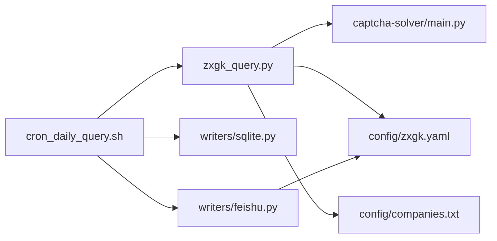

# Daily Workflow Orchestration

<cite>
**Referenced Files in This Document**
- [cron_daily_query.sh](file://cron_daily_query.sh)
- [setup.sh](file://setup.sh)
- [smoke_test.sh](file://smoke_test.sh)
- [diagnose_subsites.py](file://diagnose_subsites.py)
- [zxgk_query.py](file://zxgk_query.py)
- [writers/__init__.py](file://writers/__init__.py)
- [writers/sqlite.py](file://writers/sqlite.py)
- [writers/feishu.py](file://writers/feishu.py)
- [config/zxgk.yaml](file://config/zxgk.yaml)
- [config/companies.txt](file://config/companies.txt)
- [README.md](file://README.md)
- [captcha-solver/main.py](file://captcha-solver/main.py)
- [captcha-solver/Dockerfile](file://captcha-solver/Dockerfile)
- [captcha-solver/docker-compose.yml](file://captcha-solver/docker-compose.yml)
</cite>

## Table of Contents
1. [Introduction](#introduction)
2. [Project Structure](#project-structure)
3. [Core Components](#core-components)
4. [Architecture Overview](#architecture-overview)
5. [Detailed Component Analysis](#detailed-component-analysis)
6. [Dependency Analysis](#dependency-analysis)
7. [Performance Considerations](#performance-considerations)
8. [Troubleshooting Guide](#troubleshooting-guide)
9. [Conclusion](#conclusion)
10. [Appendices](#appendices)

## Introduction
This document explains the daily workflow orchestration for automated querying of China Enforcement Information Public Network (执行信息查询) across three subsites: “被执行人” (zhixing), “失信被执行人” (shixin), and “限制消费人员” (xgl). It covers the bash orchestrator, error handling and notifications, logging, multi-subsite execution, and end-to-end storage via SQLite and optional Feishu multi-dimensional tables. It also provides practical guidance for cron scheduling, environment setup, monitoring, performance tuning, maintenance, troubleshooting, backups, recovery, customization, and extension.

## Project Structure
The system is organized into:
- Orchestrator shell script driving the daily run
- Core CLI for browser automation and data extraction
- Writers for local SQLite and optional Feishu integration
- Captcha solver service (OCR) with Docker support
- Configuration and company lists
- Diagnostics and smoke tests for validation

**Diagram sources**
- [cron_daily_query.sh:1-246](file://cron_daily_query.sh#L1-L246)
- [setup.sh:1-150](file://setup.sh#L1-L150)
- [smoke_test.sh:1-155](file://smoke_test.sh#L1-L155)
- [diagnose_subsites.py:1-429](file://diagnose_subsites.py#L1-L429)
- [zxgk_query.py:1-800](file://zxgk_query.py#L1-L800)
- [writers/__init__.py:1-10](file://writers/__init__.py#L1-L10)
- [writers/sqlite.py:1-121](file://writers/sqlite.py#L1-L121)
- [writers/feishu.py:1-596](file://writers/feishu.py#L1-L596)
- [config/zxgk.yaml:1-102](file://config/zxgk.yaml#L1-L102)
- [config/companies.txt:1-6](file://config/companies.txt#L1-L6)
- [captcha-solver/main.py:1-215](file://captcha-solver/main.py#L1-L215)
- [captcha-solver/docker-compose.yml:1-13](file://captcha-solver/docker-compose.yml#L1-L13)

**Section sources**
- [README.md:1-122](file://README.md#L1-L122)
- [cron_daily_query.sh:1-246](file://cron_daily_query.sh#L1-L246)
- [config/zxgk.yaml:1-102](file://config/zxgk.yaml#L1-L102)

## Core Components
- Orchestrator: [cron_daily_query.sh](file://cron_daily_query.sh) performs mutual exclusion, sentinel checks, pre-flight verification, runs three subsite queries, aggregates summaries, optionally backfills screenshots, and cleans old artifacts.
- Core CLI: [zxgk_query.py](file://zxgk_query.py) encapsulates browser automation, captcha solving, query execution, pagination, screenshot capture, and structured output.
- Writers: [writers/sqlite.py](file://writers/sqlite.py) writes batch results to a local SQLite database; [writers/feishu.py](file://writers/feishu.py) writes to Feishu tables and optionally uploads screenshots.
- Captcha solver: [captcha-solver/main.py](file://captcha-solver/main.py) exposes health and solve endpoints; supports Docker deployment via [docker-compose.yml](file://captcha-solver/docker-compose.yml).
- Configuration: [config/zxgk.yaml](file://config/zxgk.yaml) defines subsites, browser, WAF, screenshots, Feishu mapping, and defaults; [config/companies.txt](file://config/companies.txt) lists companies to query.
- Diagnostics and validation: [diagnose_subsites.py](file://diagnose_subsites.py) probes DOM structures; [smoke_test.sh](file://smoke_test.sh) validates environment and outputs.

**Section sources**
- [cron_daily_query.sh:1-246](file://cron_daily_query.sh#L1-L246)
- [zxgk_query.py:1-800](file://zxgk_query.py#L1-L800)
- [writers/sqlite.py:1-121](file://writers/sqlite.py#L1-L121)
- [writers/feishu.py:1-596](file://writers/feishu.py#L1-L596)
- [config/zxgk.yaml:1-102](file://config/zxgk.yaml#L1-L102)
- [config/companies.txt:1-6](file://config/companies.txt#L1-L6)
- [diagnose_subsites.py:1-429](file://diagnose_subsites.py#L1-L429)
- [smoke_test.sh:1-155](file://smoke_test.sh#L1-L155)

## Architecture Overview
The workflow is a multi-stage pipeline orchestrated by a single shell script, with robust error handling and optional Feishu integration.

**Diagram sources**
- [cron_daily_query.sh:1-246](file://cron_daily_query.sh#L1-L246)
- [zxgk_query.py:1-800](file://zxgk_query.py#L1-L800)
- [writers/sqlite.py:1-121](file://writers/sqlite.py#L1-L121)
- [writers/feishu.py:1-596](file://writers/feishu.py#L1-L596)
- [captcha-solver/main.py:1-215](file://captcha-solver/main.py#L1-L215)

## Detailed Component Analysis

### Orchestrator: cron_daily_query.sh
Responsibilities:
- Mutual exclusion via lock directory and sentinel file
- Pre-flight checks: captcha-solver health, lark-cli auth
- Per-subsite execution with independent failure handling
- Local SQLite backup and optional Feishu writes
- Summary aggregation and Phase B screenshot backfill
- Artifact cleanup and logging

Key behaviors:
- Locking prevents concurrent runs; sentinel avoids re-execution on the same day
- Subsite runner function executes CLI, logs to both terminal and file, writes SQLite, conditionally Feishu
- Summary JSON consolidates counts and statuses across subsites
- Optional backfill waits for Feishu computation then re-queries missing screenshots

**Diagram sources**
- [cron_daily_query.sh:16-246](file://cron_daily_query.sh#L16-L246)

**Section sources**
- [cron_daily_query.sh:16-246](file://cron_daily_query.sh#L16-L246)

### Core CLI: zxgk_query.py
Responsibilities:
- Browser lifecycle management with stealth and cleanup
- Navigation to subsites, WAF detection, retries
- Captcha extraction and solving via external service
- Form submission, result parsing, pagination, and de-duplication by viewId
- Screenshot capture and optional upload mapping
- Structured JSON output for downstream writers

Design highlights:
- Modular classes: BrowserManager, CaptchaSolver, QueryEngine, DetailScreenshot, ScreenshotBackfiller
- Robust error handling: WAF blocked, navigation errors, captcha unavailable
- Extensive logging and signal handlers for graceful shutdown

**Diagram sources**
- [zxgk_query.py:175-772](file://zxgk_query.py#L175-L772)

**Section sources**
- [zxgk_query.py:175-772](file://zxgk_query.py#L175-L772)

### Writers: SQLite and Feishu
- SQLite writer: [writers/sqlite.py](file://writers/sqlite.py) writes per-subsite tables, supports storing screenshot paths or binary data, and migrates schema on demand.
- Feishu writer: [writers/feishu.py](file://writers/feishu.py) writes raw tables, optionally updates cross-references in the case master table, and uploads screenshots to the master table. It uses lark-cli for API calls and media uploads.

**Diagram sources**
- [writers/sqlite.py:37-100](file://writers/sqlite.py#L37-L100)
- [writers/feishu.py:154-478](file://writers/feishu.py#L154-L478)

**Section sources**
- [writers/sqlite.py:1-121](file://writers/sqlite.py#L1-L121)
- [writers/feishu.py:1-596](file://writers/feishu.py#L1-L596)

### Captcha Solver Service
- [captcha-solver/main.py](file://captcha-solver/main.py) exposes health and solve endpoints, validates images, and logs requests.
- Deployment: [docker-compose.yml](file://captcha-solver/docker-compose.yml) and [Dockerfile](file://captcha-solver/Dockerfile) enable containerized OCR with PaddleOCR.

**Diagram sources**
- [captcha-solver/main.py:107-215](file://captcha-solver/main.py#L107-L215)
- [captcha-solver/docker-compose.yml:1-13](file://captcha-solver/docker-compose.yml#L1-L13)
- [captcha-solver/Dockerfile:1-22](file://captcha-solver/Dockerfile#L1-L22)

**Section sources**
- [captcha-solver/main.py:1-215](file://captcha-solver/main.py#L1-L215)
- [captcha-solver/docker-compose.yml:1-13](file://captcha-solver/docker-compose.yml#L1-L13)
- [captcha-solver/Dockerfile:1-22](file://captcha-solver/Dockerfile#L1-L22)

### Diagnostics and Validation
- [diagnose_subsites.py](file://diagnose_subsites.py) probes DOM structures, captures table info, pagination, and attempts a test search with OCR.
- [smoke_test.sh](file://smoke_test.sh) validates Python/Shell syntax, YAML config, environment variables, venv, and recent batch JSON format.

**Section sources**
- [diagnose_subsites.py:1-429](file://diagnose_subsites.py#L1-L429)
- [smoke_test.sh:1-155](file://smoke_test.sh#L1-L155)

## Dependency Analysis
- Orchestrator depends on:
  - Python virtual environment and activated packages
  - Captcha solver service availability
  - Feishu CLI authentication (optional)
  - Configuration and company list files
- Core CLI depends on:
  - Playwright Chromium installation
  - Captcha solver service
  - Feishu app token (optional)
- Writers depend on:
  - SQLite for local persistence
  - Feishu APIs via lark-cli (optional)

**Diagram sources**
- [cron_daily_query.sh:1-246](file://cron_daily_query.sh#L1-L246)
- [zxgk_query.py:1-800](file://zxgk_query.py#L1-L800)
- [writers/sqlite.py:1-121](file://writers/sqlite.py#L1-L121)
- [writers/feishu.py:1-596](file://writers/feishu.py#L1-L596)
- [config/zxgk.yaml:1-102](file://config/zxgk.yaml#L1-L102)
- [config/companies.txt:1-6](file://config/companies.txt#L1-L6)
- [captcha-solver/main.py:1-215](file://captcha-solver/main.py#L1-L215)

**Section sources**
- [cron_daily_query.sh:1-246](file://cron_daily_query.sh#L1-L246)
- [zxgk_query.py:1-800](file://zxgk_query.py#L1-L800)
- [writers/sqlite.py:1-121](file://writers/sqlite.py#L1-L121)
- [writers/feishu.py:1-596](file://writers/feishu.py#L1-L596)
- [config/zxgk.yaml:1-102](file://config/zxgk.yaml#L1-L102)
- [config/companies.txt:1-6](file://config/companies.txt#L1-L6)
- [captcha-solver/main.py:1-215](file://captcha-solver/main.py#L1-L215)

## Performance Considerations
- Concurrency and isolation:
  - Mutual exclusion via lock directory prevents overlapping runs; sentinel avoids redundant executions on the same day.
- Resource limits:
  - Captcha solver Docker service sets memory limit; adjust as needed for your environment.
- Browser and network:
  - Headless mode reduces overhead; viewport and stealth settings improve compatibility.
- Retry and throttling:
  - WAF retry and cooldown parameters reduce blocking; screenshot intervals prevent rate limiting.
- Storage:
  - SQLite provides zero-dependency local persistence; consider BLOB storage for screenshots if disk space allows.
- Monitoring:
  - Daily summary JSON and detailed logs facilitate quick diagnostics.

[No sources needed since this section provides general guidance]

## Troubleshooting Guide
Common issues and resolutions:
- Captcha solver not running:
  - Orchestrator attempts Docker and falls back to venv; verify port 8001 and process conflicts.
- Feishu not configured:
  - Lark-cli auth check sets a flag; Feishu steps are skipped; configure token and tables to enable.
- WAF blocked:
  - CLI detects absence of captcha element and retries with cooldown; review navigation selectors and extra waits.
- No results:
  - CLI returns non-zero exit code; verify company names and subsite-specific fields (e.g., province selection for shixin).
- OCR failures:
  - Low-confidence predictions trigger captcha refresh; ensure captcha-solver health and image quality.
- Diagnostics:
  - Use [diagnose_subsites.py](file://diagnose_subsites.py) to probe DOM structures and test search flow.
- Smoke testing:
  - Use [smoke_test.sh](file://smoke_test.sh) to validate environment, configs, and recent batch JSON.

**Section sources**
- [cron_daily_query.sh:48-96](file://cron_daily_query.sh#L48-L96)
- [zxgk_query.py:297-324](file://zxgk_query.py#L297-L324)
- [writers/feishu.py:29-33](file://writers/feishu.py#L29-L33)
- [smoke_test.sh:106-143](file://smoke_test.sh#L106-L143)

## Conclusion
The daily workflow orchestration integrates a robust shell orchestrator, a resilient browser automation core, and pluggable storage writers. It ensures reliability through mutual exclusion, sentinel checks, WAF-aware retries, and optional Feishu integration. With diagnostics and smoke tests, operators can maintain and troubleshoot the system effectively while optimizing performance and resource usage.

[No sources needed since this section summarizes without analyzing specific files]

## Appendices

### Practical Cron Job Configuration
- Schedule the orchestrator to run daily at a chosen time:
  - Example: run at 02:15 UTC for Beijing-time morning processing
  - Command: [cron_daily_query.sh](file://cron_daily_query.sh)
- Ensure environment:
  - Source virtual environment and set required variables before invoking the script
  - Confirm Feishu token if enabling Feishu writes

[No sources needed since this section provides general guidance]

### Environment Setup
- Install prerequisites and dependencies:
  - Use [setup.sh](file://setup.sh) to install Python venv, Playwright Chromium, lark-cli, and optional PaddleOCR
- Configure:
  - Copy and edit [config/zxgk.yaml](file://config/zxgk.yaml) and [config/companies.txt](file://config/companies.txt)
  - Set environment variable FEISHU_APP_TOKEN for Feishu integration

**Section sources**
- [setup.sh:1-150](file://setup.sh#L1-L150)
- [config/zxgk.yaml:1-102](file://config/zxgk.yaml#L1-L102)
- [config/companies.txt:1-6](file://config/companies.txt#L1-L6)

### Monitoring Approaches
- Logs:
  - Orchestrator writes to a dated log file and prints summary location
- Summaries:
  - Daily summary JSON aggregated per subsite for downstream AI consumption
- Health checks:
  - Captcha solver health endpoint and lark-cli auth check included in orchestrator

**Section sources**
- [cron_daily_query.sh:35-40](file://cron_daily_query.sh#L35-L40)
- [cron_daily_query.sh:166-210](file://cron_daily_query.sh#L166-L210)
- [captcha-solver/main.py:107-109](file://captcha-solver/main.py#L107-L109)

### Backup and Recovery
- Local backup:
  - SQLite database serves as primary local backup; consider periodic off-machine copies
- Cleanup policy:
  - Orchestrator removes old progress, single-company JSON, summary JSON, batch JSON, and screenshots older than thresholds
- Recovery:
  - Re-run orchestrator to regenerate missing summaries and backfill screenshots if Feishu was enabled

**Section sources**
- [writers/sqlite.py:37-100](file://writers/sqlite.py#L37-L100)
- [cron_daily_query.sh:233-239](file://cron_daily_query.sh#L233-L239)

### Customization and Extension
- Add new subsites:
  - Extend [config/zxgk.yaml](file://config/zxgk.yaml) subsites section with name, CSS selector, and extra wait seconds
- Modify storage:
  - Use [writers/sqlite.py](file://writers/sqlite.py) or implement a new writer module under [writers/](file://writers/)
- Integrate new outputs:
  - Extend orchestrator to call additional writers or post-processing scripts
- Diagnose DOM changes:
  - Use [diagnose_subsites.py](file://diagnose_subsites.py) to probe and update selectors

**Section sources**
- [config/zxgk.yaml:28-42](file://config/zxgk.yaml#L28-L42)
- [writers/__init__.py:1-10](file://writers/__init__.py#L1-L10)
- [diagnose_subsites.py:25-48](file://diagnose_subsites.py#L25-L48)