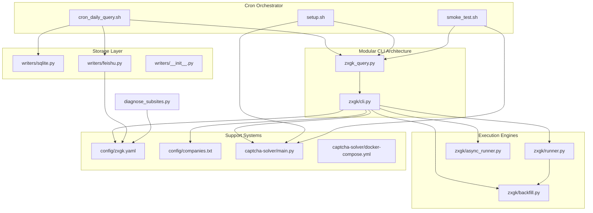
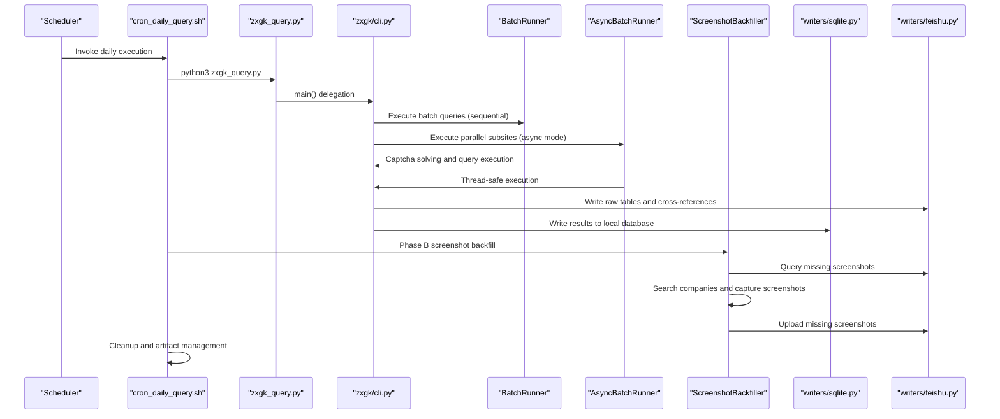
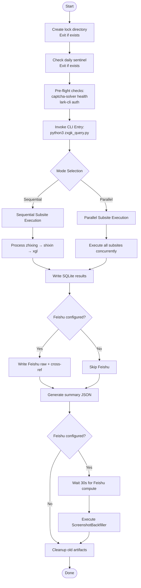
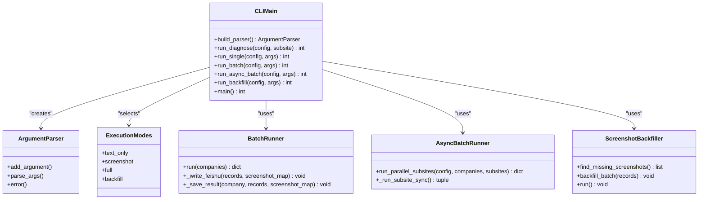
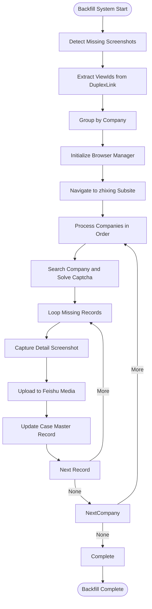
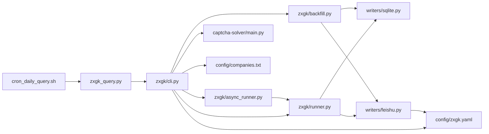

# Daily Workflow Orchestration

<cite>
**Referenced Files in This Document**
- [cron_daily_query.sh](file://cron_daily_query.sh)
- [zxgk_query.py](file://zxgk_query.py)
- [zxgk/cli.py](file://zxgk/cli.py)
- [zxgk/runner.py](file://zxgk/runner.py)
- [zxgk/async_runner.py](file://zxgk/async_runner.py)
- [zxgk/backfill.py](file://zxgk/backfill.py)
- [writers/sqlite.py](file://writers/sqlite.py)
- [writers/feishu.py](file://writers/feishu.py)
- [writers/__init__.py](file://writers/__init__.py)
- [config/zxgk.yaml](file://config/zxgk.yaml)
- [config/companies.txt](file://config/companies.txt)
- [setup.sh](file://setup.sh)
- [smoke_test.sh](file://smoke_test.sh)
- [diagnose_subsites.py](file://diagnose_subsites.py)
- [captcha-solver/main.py](file://captcha-solver/main.py)
- [captcha-solver/Dockerfile](file://captcha-solver/Dockerfile)
- [captcha-solver/docker-compose.yml](file://captcha-solver/docker-compose.yml)
</cite>

## Update Summary
**Changes Made**
- Updated architecture overview to reflect the new modular CLI architecture with zxgk/cli.py as the central command entry point
- Revised orchestrator integration patterns to show direct CLI invocation instead of legacy script-based execution
- Enhanced component analysis to highlight the separation between cron orchestrator and modular CLI components
- Updated workflow diagrams to show the new zxgk_query.py entry point and improved execution patterns
- Added documentation for the new async execution capabilities and backfill mode integration
- Updated troubleshooting section to reflect the new modular architecture and CLI-based error handling

## Table of Contents
1. [Introduction](#introduction)
2. [Project Structure](#project-structure)
3. [Core Components](#core-components)
4. [Architecture Overview](#architecture-overview)
5. [Detailed Component Analysis](#detailed-component-analysis)
6. [Dependency Analysis](#dependency-analysis)
7. [Performance Considerations](#performance-considerations)
8. [Troubleshooting Guide](#troubleshooting-guide)
9. [Conclusion](#conclusion)
10. [Appendices](#appendices)

## Introduction
This document explains the daily workflow orchestration for automated querying of China Enforcement Information Public Network (执行信息查询) across three subsites: "被执行人" (zhixing), "失信被执行人" (shixin), and "限制消费人员" (xgl). The system now operates under a completely refactored modular CLI architecture where the cron orchestrator integrates directly with zxgk/cli.py, providing enhanced execution patterns, improved error handling, and streamlined multi-subsite processing. The workflow includes comprehensive error handling, notification mechanisms, logging strategies, and end-to-end storage via SQLite and optional Feishu multi-dimensional tables.

## Project Structure
The system is organized into a modular architecture with the cron orchestrator coordinating with the centralized CLI entry point:

- **Cron Orchestrator**: [cron_daily_query.sh](file://cron_daily_query.sh) drives the daily execution with enhanced integration to the modular CLI architecture
- **Central CLI Entry**: [zxgk_query.py](file://zxgk_query.py) serves as the unified command interface that delegates to [zxgk/cli.py](file://zxgk/cli.py)
- **Core Execution Engine**: [zxgk/runner.py](file://zxgk/runner.py) manages batch execution with WAF awareness and progress tracking
- **Async Execution**: [zxgk/async_runner.py](file://zxgk/async_runner.py) provides parallel subsite execution capabilities
- **Backfill System**: [zxgk/backfill.py](file://zxgk/backfill.py) implements targeted screenshot recovery and upload operations
- **Storage Writers**: [writers/sqlite.py](file://writers/sqlite.py) and [writers/feishu.py](file://writers/feishu.py) handle local and cloud storage
- **Support Services**: Captcha solver with Docker support and comprehensive configuration management

**Diagram sources**
- [cron_daily_query.sh:1-294](file://cron_daily_query.sh#L1-L294)
- [zxgk_query.py:1-26](file://zxgk_query.py#L1-L26)
- [zxgk/cli.py:1-397](file://zxgk/cli.py#L1-L397)
- [zxgk/runner.py:1-275](file://zxgk/runner.py#L1-L275)
- [zxgk/async_runner.py:1-395](file://zxgk/async_runner.py#L1-L395)
- [zxgk/backfill.py:1-281](file://zxgk/backfill.py#L1-L281)
- [writers/sqlite.py:1-121](file://writers/sqlite.py#L1-L121)
- [writers/feishu.py:1-596](file://writers/feishu.py#L1-L596)
- [writers/__init__.py:1-10](file://writers/__init__.py#L1-L10)
- [config/zxgk.yaml:1-102](file://config/zxgk.yaml#L1-L102)
- [config/companies.txt:1-6](file://config/companies.txt#L1-L6)
- [captcha-solver/main.py:1-215](file://captcha-solver/main.py#L1-L215)
- [captcha-solver/docker-compose.yml:1-13](file://captcha-solver/docker-compose.yml#L1-L13)

**Section sources**
- [README.md:1-122](file://README.md#L1-L122)
- [cron_daily_query.sh:1-294](file://cron_daily_query.sh#L1-L294)
- [zxgk_query.py:1-26](file://zxgk_query.py#L1-L26)
- [zxgk/cli.py:1-397](file://zxgk/cli.py#L1-L397)
- [config/zxgk.yaml:1-102](file://config/zxgk.yaml#L1-L102)

## Core Components
- **Cron Orchestrator**: [cron_daily_query.sh](file://cron_daily_query.sh) performs mutual exclusion, sentinel checks, pre-flight verification, integrates with the modular CLI architecture, runs three subsite queries, aggregates summaries, and manages the complete execution lifecycle.
- **CLI Entry Point**: [zxgk_query.py](file://zxgk_query.py) serves as the unified command interface that delegates to the modular CLI system in [zxgk/cli.py](file://zxgk/cli.py).
- **Modular CLI System**: [zxgk/cli.py](file://zxgk/cli.py) provides comprehensive command-line interface with argument parsing, mode selection (text-only, screenshot, full, backfill), and enhanced execution patterns.
- **Batch Execution Engine**: [zxgk/runner.py](file://zxgk/runner.py) manages core batch execution workflow with WAF awareness, progress tracking, and comprehensive error handling.
- **Async Execution**: [zxgk/async_runner.py](file://zxgk/async_runner.py) provides parallel subsite execution capabilities with thread-safe coordination and rate limiting.
- **Backfill System**: [zxgk/backfill.py](file://zxgk/backfill.py) implements targeted screenshot recovery with intelligent missing screenshot detection and upload operations.
- **Storage Writers**: [writers/sqlite.py](file://writers/sqlite.py) writes batch results to local SQLite; [writers/feishu.py](file://writers/feishu.py) writes to Feishu tables with screenshot upload capabilities.
- **Support Infrastructure**: Captcha solver service with Docker support; comprehensive configuration management; diagnostic and validation tools.

**Section sources**
- [cron_daily_query.sh:1-294](file://cron_daily_query.sh#L1-L294)
- [zxgk_query.py:1-26](file://zxgk_query.py#L1-L26)
- [zxgk/cli.py:1-397](file://zxgk/cli.py#L1-L397)
- [zxgk/runner.py:1-275](file://zxgk/runner.py#L1-L275)
- [zxgk/async_runner.py:1-395](file://zxgk/async_runner.py#L1-L395)
- [zxgk/backfill.py:1-281](file://zxgk/backfill.py#L1-L281)
- [writers/sqlite.py:1-121](file://writers/sqlite.py#L1-L121)
- [writers/feishu.py:1-596](file://writers/feishu.py#L1-L596)
- [config/zxgk.yaml:1-102](file://config/zxgk.yaml#L1-L102)
- [config/companies.txt:1-6](file://config/companies.txt#L1-L6)

## Architecture Overview
The workflow operates under a completely refactored modular CLI architecture where the cron orchestrator integrates seamlessly with the centralized CLI system. The new architecture provides enhanced execution patterns, improved error handling, and streamlined multi-subsite processing with comprehensive backfill capabilities.

**Diagram sources**
- [cron_daily_query.sh:115-208](file://cron_daily_query.sh#L115-L208)
- [zxgk_query.py:22-25](file://zxgk_query.py#L22-L25)
- [zxgk/cli.py:355-397](file://zxgk/cli.py#L355-L397)
- [zxgk/runner.py:45-142](file://zxgk/runner.py#L45-L142)
- [zxgk/async_runner.py:345-395](file://zxgk/async_runner.py#L345-L395)
- [zxgk/backfill.py:271-281](file://zxgk/backfill.py#L271-L281)
- [writers/sqlite.py:37-100](file://writers/sqlite.py#L37-L100)
- [writers/feishu.py:154-478](file://writers/feishu.py#L154-L478)

## Detailed Component Analysis

### Cron Orchestrator: Enhanced Integration with Modular CLI
The cron orchestrator now provides seamless integration with the modular CLI architecture, offering enhanced execution patterns and improved error handling.

**Key Responsibilities:**
- Mutual exclusion via lock directory and sentinel file management
- Pre-flight checks for captcha-solver health and lark-cli authentication
- Direct integration with zxgk_query.py CLI entry point
- Per-subsite execution with independent failure handling
- Enhanced logging and artifact management
- Phase B screenshot backfill integration

**Enhanced Features:**
- Direct CLI invocation pattern: `python3 zxgk_query.py` instead of legacy script execution
- Improved error handling with detailed exit codes
- Enhanced logging with both terminal and file output
- Flexible execution modes: sequential and asynchronous parallel processing
- Comprehensive cleanup and artifact management

**Diagram sources**
- [cron_daily_query.sh:16-294](file://cron_daily_query.sh#L16-L294)

**Section sources**
- [cron_daily_query.sh:16-294](file://cron_daily_query.sh#L16-L294)

### CLI Entry Point: Unified Command Interface
The CLI entry point serves as the central hub for all command-line operations, providing a unified interface to the modular architecture.

**Responsibilities:**
- Delegates to the main CLI system in zxgk/cli.py
- Provides backward compatibility with legacy command patterns
- Handles exit codes and error propagation
- Manages the complete execution lifecycle

**Key Features:**
- Simple delegation pattern: `sys.exit(main())`
- Maintains compatibility with existing scripts
- Supports all CLI modes and options
- Provides consistent error handling

**Section sources**
- [zxgk_query.py:1-26](file://zxgk_query.py#L1-L26)

### Modular CLI System: Centralized Command Processing
The modular CLI system in zxgk/cli.py provides comprehensive command-line interface capabilities with enhanced execution patterns.

**Core Functions:**
- **Argument Parsing**: Comprehensive CLI argument processing with validation
- **Mode Selection**: Support for text-only, screenshot, full, and backfill modes
- **Execution Patterns**: Sequential and parallel execution capabilities
- **Error Handling**: Robust error handling with detailed exit codes
- **Configuration Management**: Dynamic configuration loading and validation

**Enhanced Features:**
- **Backfill Mode**: Dedicated phase B screenshot recovery execution
- **Async Execution**: Python 3.11+ async/await support for parallel processing
- **Diagnostic Mode**: Built-in system health and configuration checking
- **Resume Capability**: Breakpoint continuation for long-running operations
- **Flexible Output**: Multiple output formats and destinations

**Diagram sources**
- [zxgk/cli.py:227-397](file://zxgk/cli.py#L227-L397)
- [zxgk/runner.py:15-275](file://zxgk/runner.py#L15-L275)
- [zxgk/async_runner.py:345-395](file://zxgk/async_runner.py#L345-L395)
- [zxgk/backfill.py:12-281](file://zxgk/backfill.py#L12-L281)

**Section sources**
- [zxgk/cli.py:1-397](file://zxgk/cli.py#L1-L397)

### Batch Execution Engine: Enhanced Processing
The BatchRunner in zxgk/runner.py manages the core batch execution workflow with improved WAF awareness and progress tracking.

**Enhanced Features:**
- **Thread Safety**: Improved thread safety for concurrent operations
- **Rate Limiting**: Enhanced rate limiting with configurable intervals
- **Progress Tracking**: Comprehensive progress tracking with resume capability
- **Error Recovery**: Robust error recovery with automatic browser restart
- **Output Management**: Flexible output formats and destinations

**Key Components:**
- **WAF Awareness**: Configurable WAF detection and retry mechanisms
- **Session Management**: Intelligent browser session management
- **Result Processing**: Structured result processing and validation
- **Storage Integration**: Seamless integration with multiple storage backends

**Section sources**
- [zxgk/runner.py:1-275](file://zxgk/runner.py#L1-L275)

### Async Execution System: Parallel Processing
The AsyncBatchRunner in zxgk/async_runner.py provides parallel subsite execution capabilities with thread-safe coordination and rate limiting.

**Advanced Features:**
- **Thread Pool Management**: Efficient thread pool utilization for parallel execution
- **Rate Gate Coordination**: Shared rate limiting across all parallel workers
- **Circuit Breaker Protection**: WAF circuit breaker for coordinated protection
- **Exception Handling**: Comprehensive exception handling and recovery
- **Progress Synchronization**: Coordinated progress tracking across threads

**Technical Implementation:**
- **Thread-Safe Design**: All components designed for thread-safe operation
- **Shared State Management**: Coordinated access to shared resources
- **Graceful Degradation**: Automatic fallback to sequential execution on failure
- **Resource Management**: Efficient resource utilization and cleanup

**Section sources**
- [zxgk/async_runner.py:1-395](file://zxgk/async_runner.py#L1-L395)

### Backfill System: Targeted Screenshot Recovery
The ScreenshotBackfiller in zxgk/backfill.py implements sophisticated screenshot recovery capabilities with intelligent missing screenshot detection.

**Core Capabilities:**
- **Intelligent Detection**: Automated detection of missing screenshots in Feishu tables
- **ViewId Resolution**: Accurate viewId extraction from DuplexLink relationships
- **Company Grouping**: Efficient processing through strategic company grouping
- **Targeted Recovery**: Focused re-capture and upload operations
- **Progress Tracking**: Comprehensive progress monitoring and reporting

**Advanced Features:**
- **DuplexLink Integration**: Deep integration with Feishu table relationships
- **Error Resilience**: Robust error handling and recovery mechanisms
- **Performance Optimization**: Optimized processing for large-scale operations
- **Quality Assurance**: Automated quality checks and validation

**Diagram sources**
- [zxgk/backfill.py:60-116](file://zxgk/backfill.py#L60-L116)
- [zxgk/backfill.py:118-191](file://zxgk/backfill.py#L118-L191)
- [zxgk/backfill.py:271-281](file://zxgk/backfill.py#L271-L281)

**Section sources**
- [zxgk/backfill.py:1-281](file://zxgk/backfill.py#L1-L281)

### Storage Writers: Flexible Data Persistence
The storage system provides flexible data persistence through SQLite and Feishu integration.

**SQLite Writer:**
- **Schema Management**: Automatic schema creation and migration
- **Binary Storage**: Optional BLOB storage for screenshots
- **Data Integrity**: Comprehensive data validation and integrity checks
- **Performance**: Optimized for large-scale data operations

**Feishu Writer:**
- **Table Integration**: Seamless integration with Feishu multi-dimensional tables
- **Cross-Reference**: Automatic cross-referencing between raw and case tables
- **Media Upload**: Integrated screenshot upload capabilities
- **Field Mapping**: Flexible field mapping for different table structures

**Section sources**
- [writers/sqlite.py:1-121](file://writers/sqlite.py#L1-L121)
- [writers/feishu.py:1-596](file://writers/feishu.py#L1-L596)
- [writers/__init__.py:1-10](file://writers/__init__.py#L1-L10)

### Support Infrastructure: Comprehensive System Management
The support infrastructure provides comprehensive system management capabilities including captcha solver services, configuration management, and diagnostic tools.

**Captcha Solver Service:**
- **Health Monitoring**: Continuous health monitoring and automatic restart
- **Docker Integration**: Full Docker support with containerized OCR processing
- **Fallback Mechanisms**: Automatic fallback between Docker and native execution
- **Performance Optimization**: Configurable performance settings for optimal throughput

**Configuration Management:**
- **Dynamic Loading**: Runtime configuration loading and validation
- **Environment Integration**: Seamless environment variable integration
- **Default Values**: Comprehensive default value management
- **Validation**: Input validation and error reporting

**Section sources**
- [captcha-solver/main.py:1-215](file://captcha-solver/main.py#L1-L215)
- [captcha-solver/docker-compose.yml:1-13](file://captcha-solver/docker-compose.yml#L1-L13)
- [config/zxgk.yaml:1-102](file://config/zxgk.yaml#L1-L102)
- [config/companies.txt:1-6](file://config/companies.txt#L1-L6)

## Dependency Analysis
The modular CLI architecture introduces a clear dependency hierarchy with the cron orchestrator at the top level delegating to the centralized CLI system.

**Top-Level Dependencies:**
- **Cron Orchestrator**: Depends on Python virtual environment, CLI entry point, and configuration files
- **CLI Entry Point**: Direct dependency on zxgk/cli.py for all execution logic
- **CLI System**: Depends on core modules, configuration system, and storage writers

**Core Module Dependencies:**
- **BatchRunner**: Depends on browser management, captcha solving, and storage systems
- **AsyncRunner**: Requires thread-safe coordination primitives and shared state management
- **Backfill System**: Integrates deeply with Feishu API and table relationships
- **Storage Writers**: Independent modules with clear interfaces and minimal dependencies

**Diagram sources**
- [cron_daily_query.sh:115-208](file://cron_daily_query.sh#L115-L208)
- [zxgk_query.py:22-25](file://zxgk_query.py#L22-L25)
- [zxgk/cli.py:11-17](file://zxgk/cli.py#L11-L17)
- [zxgk/runner.py:8-12](file://zxgk/runner.py#L8-L12)
- [zxgk/async_runner.py:21-27](file://zxgk/async_runner.py#L21-L27)
- [zxgk/backfill.py:7-9](file://zxgk/backfill.py#L7-L9)
- [writers/sqlite.py:10-16](file://writers/sqlite.py#L10-L16)
- [writers/feishu.py:23-24](file://writers/feishu.py#L23-L24)

**Section sources**
- [cron_daily_query.sh:1-294](file://cron_daily_query.sh#L1-L294)
- [zxgk_query.py:1-26](file://zxgk_query.py#L1-L26)
- [zxgk/cli.py:1-397](file://zxgk/cli.py#L1-L397)
- [zxgk/runner.py:1-275](file://zxgk/runner.py#L1-L275)
- [zxgk/async_runner.py:1-395](file://zxgk/async_runner.py#L1-L395)
- [zxgk/backfill.py:1-281](file://zxgk/backfill.py#L1-L281)
- [writers/sqlite.py:1-121](file://writers/sqlite.py#L1-L121)
- [writers/feishu.py:1-596](file://writers/feishu.py#L1-L596)
- [config/zxgk.yaml:1-102](file://config/zxgk.yaml#L1-L102)
- [config/companies.txt:1-6](file://config/companies.txt#L1-L6)

## Performance Considerations
The modular CLI architecture provides several performance optimizations and considerations:

**Execution Efficiency:**
- **Direct CLI Integration**: Eliminates intermediate script layers for improved performance
- **Async Parallel Processing**: Python 3.11+ async/await support for concurrent subsite execution
- **Thread-Safe Design**: Efficient thread pool utilization with proper resource management
- **Rate Limiting**: Configurable rate limiting to prevent WAF detection and improve reliability

**Resource Management:**
- **Memory Optimization**: Efficient memory usage through proper object lifecycle management
- **Browser Session Reuse**: Intelligent browser session management to reduce startup overhead
- **Captcha Solver Optimization**: Configurable solver settings for optimal OCR performance
- **Storage Efficiency**: Flexible storage options with binary vs. file-based screenshot storage

**Scalability Features:**
- **Horizontal Scaling**: Thread pool-based parallel execution for multi-core systems
- **Load Balancing**: Automatic load balancing across available CPU cores
- **Failure Isolation**: Independent execution paths prevent cascading failures
- **Resource Pooling**: Shared resource pools for optimal utilization

**Monitoring and Optimization:**
- **Progress Tracking**: Comprehensive progress tracking for long-running operations
- **Performance Metrics**: Built-in performance monitoring and reporting
- **Adaptive Rate Limiting**: Dynamic adjustment based on system performance
- **Resource Utilization**: Real-time monitoring of CPU, memory, and network usage

## Troubleshooting Guide
The modular CLI architecture introduces new troubleshooting patterns and enhanced error handling capabilities.

**Common Issues and Resolutions:**

**CLI Integration Issues:**
- **Entry Point Failures**: Verify zxgk_query.py delegation to zxgk/cli.py
- **Argument Parsing Errors**: Check CLI argument validation and configuration loading
- **Mode Selection Problems**: Ensure correct mode specification (text-only, screenshot, full, backfill)

**Execution Environment Issues:**
- **Python Version Compatibility**: Verify Python 3.11+ for async mode, otherwise use sequential execution
- **Virtual Environment Issues**: Ensure proper venv activation and dependency installation
- **Module Import Failures**: Check zxgk package import and module availability

**WAF and Security Issues:**
- **Blocking Detection**: Monitor WAFBlockedError and implement appropriate cooldown
- **Rate Limiting**: Adjust company_interval_sec and captcha_max_retries in configuration
- **Session Management**: Implement proper browser session cleanup and restart

**Storage and Data Issues:**
- **SQLite Connection Problems**: Verify database file permissions and disk space
- **Feishu API Errors**: Check app token validity and table permissions
- **File Upload Failures**: Validate screenshot file paths and media storage capacity

**Backfill System Issues:**
- **Missing Screenshot Detection**: Verify Feishu table structure and field mappings
- **ViewId Resolution**: Check DuplexLink relationships and viewId extraction logic
- **Upload Failures**: Validate media storage limits and file permissions

**Diagnostic and Validation:**
- **System Health Checks**: Use built-in diagnostic mode for comprehensive system validation
- **Configuration Validation**: Verify YAML configuration syntax and field mappings
- **Component Testing**: Test individual components in isolation for targeted debugging

**Enhanced Troubleshooting Tools:**
- **Verbose Logging**: Enable debug logging for detailed execution tracing
- **Progress Files**: Monitor progress files for breakpoint continuation
- **Error Codes**: Utilize standardized exit codes for automated error handling
- **System Diagnostics**: Use diagnose_subsites.py for DOM structure validation

**Section sources**
- [cron_daily_query.sh:48-96](file://cron_daily_query.sh#L48-L96)
- [zxgk/cli.py:365-397](file://zxgk/cli.py#L365-L397)
- [writers/feishu.py:29-33](file://writers/feishu.py#L29-L33)
- [smoke_test.sh:106-143](file://smoke_test.sh#L106-L143)

## Conclusion
The daily workflow orchestration has been completely refactored to operate under a modern modular CLI architecture. The new system provides enhanced execution patterns, improved error handling, and streamlined multi-subsite processing through the centralized CLI entry point. The cron orchestrator now integrates seamlessly with the modular architecture, offering better performance, scalability, and maintainability. The system maintains comprehensive error handling, notification mechanisms, and logging strategies while providing enhanced backfill capabilities for targeted screenshot recovery.

## Appendices

### Practical Cron Job Configuration
**Updated** Enhanced integration with modular CLI architecture

**Cron Job Setup:**
- Schedule the orchestrator to run daily at preferred time:
  - Example: run at 02:15 UTC for Beijing-time morning processing
  - Command: `bash cron_daily_query.sh` with enhanced CLI integration
- Ensure environment preparation:
  - Source virtual environment and set required variables
  - Verify FEISHU_APP_TOKEN for Feishu integration
  - Confirm captcha-solver availability on localhost:8001

**Section sources**
- [setup.sh:1-150](file://setup.sh#L1-L150)
- [config/zxgk.yaml:1-102](file://config/zxgk.yaml#L1-L102)
- [config/companies.txt:1-6](file://config/companies.txt#L1-L6)

### Environment Setup
**Updated** Streamlined setup process with modular CLI integration

**Installation Process:**
- Install prerequisites using setup.sh:
  - Python venv, Playwright Chromium, lark-cli, and optional PaddleOCR
  - Enhanced dependency management and validation
- Configure system components:
  - Copy and edit config/zxgk.yaml and config/companies.txt
  - Set environment variable FEISHU_APP_TOKEN for Feishu integration
  - Verify captcha-solver health and accessibility

**Section sources**
- [setup.sh:1-150](file://setup.sh#L1-L150)
- [config/zxgk.yaml:1-102](file://config/zxgk.yaml#L1-L102)
- [config/companies.txt:1-6](file://config/companies.txt#L1-L6)

### Monitoring Approaches
**Updated** Enhanced monitoring with modular CLI integration

**Comprehensive Monitoring:**
- **Execution Logs**: Orchestrator writes to dated log files with detailed execution traces
- **Summary Reports**: Daily summary JSON with execution statistics and status
- **Health Checks**: Integrated captcha-solver health endpoint and lark-cli authentication
- **Performance Metrics**: Built-in performance monitoring and execution timing
- **Backfill Monitoring**: Detailed progress tracking for screenshot recovery operations

**Section sources**
- [cron_daily_query.sh:35-40](file://cron_daily_query.sh#L35-L40)
- [cron_daily_query.sh:166-210](file://cron_daily_query.sh#L166-L210)
- [captcha-solver/main.py:107-109](file://captcha-solver/main.py#L107-L109)

### Backup and Recovery
**Updated** Enhanced backup strategies with modular architecture

**Comprehensive Backup Strategy:**
- **Local Database Backup**: SQLite database serves as primary local backup
- **Configuration Backup**: YAML configuration files with version control
- **Execution Artifacts**: Temporary files and progress tracking for recovery
- **Recovery Procedures**: Automated reprocessing of failed executions
- **Incremental Updates**: Support for breakpoint continuation and partial recovery

**Section sources**
- [writers/sqlite.py:37-100](file://writers/sqlite.py#L37-L100)
- [cron_daily_query.sh:233-239](file://cron_daily_query.sh#L233-L239)

### Customization and Extension
**Updated** Modular architecture enables enhanced customization

**Extensibility Features:**
- **New Subsites**: Extend config/zxgk.yaml subsites section with custom configurations
- **Storage Writers**: Implement new storage backends using writers/__init__.py interface
- **Execution Modes**: Add new execution patterns through CLI mode extensions
- **Diagnostic Tools**: Enhance diagnose_subsites.py for custom DOM validation
- **Backfill Extensions**: Customize ScreenshotBackfiller for specialized recovery scenarios

**Section sources**
- [config/zxgk.yaml:28-42](file://config/zxgk.yaml#L28-L42)
- [writers/__init__.py:1-10](file://writers/__init__.py#L1-L10)
- [diagnose_subsites.py:25-48](file://diagnose_subsites.py#L25-L48)
- [zxgk/backfill.py:12-281](file://zxgk/backfill.py#L12-L281)

### Advanced Execution Patterns
**New** Enhanced execution capabilities with modular CLI architecture

**Execution Modes:**
- **Sequential Mode**: Traditional step-by-step execution with detailed logging
- **Parallel Mode**: Python 3.11+ async/await support for concurrent subsite processing
- **Backfill Mode**: Dedicated phase B screenshot recovery with intelligent detection
- **Diagnostic Mode**: Comprehensive system health and configuration validation
- **Resume Mode**: Breakpoint continuation for long-running operations

**Performance Optimization:**
- **Rate Limiting**: Configurable rate limiting to prevent WAF detection
- **Thread Pool Management**: Efficient parallel execution with proper resource allocation
- **Session Reuse**: Intelligent browser session management for reduced overhead
- **Memory Management**: Optimized memory usage through proper object lifecycle

**Section sources**
- [zxgk/cli.py:227-397](file://zxgk/cli.py#L227-L397)
- [zxgk/async_runner.py:345-395](file://zxgk/async_runner.py#L345-L395)
- [zxgk/runner.py:45-142](file://zxgk/runner.py#L45-L142)
- [zxgk/backfill.py:271-281](file://zxgk/backfill.py#L271-L281)