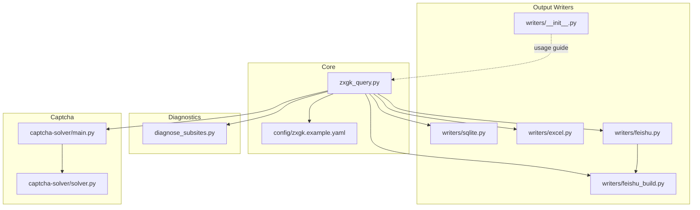
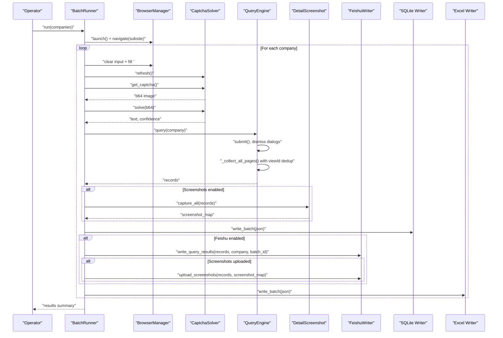
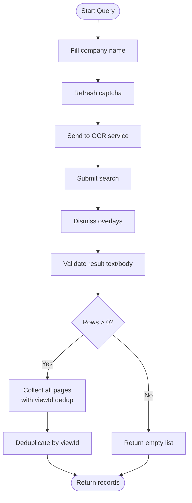
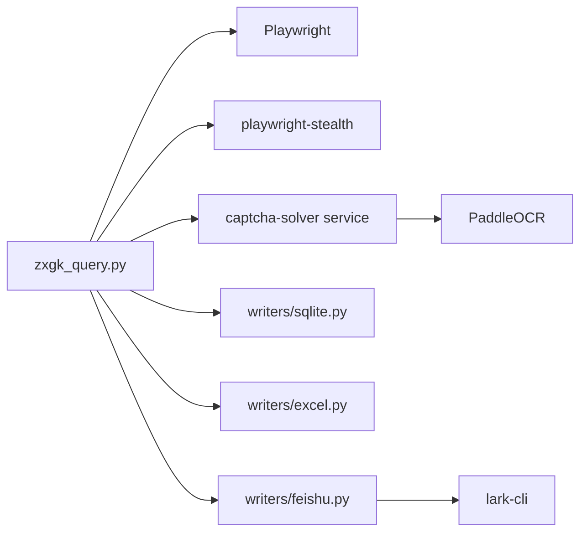

# Data Processing Engine

<cite>
**Referenced Files in This Document**
- [zxgk_query.py](file://zxgk_query.py)
- [writers/__init__.py](file://writers/__init__.py)
- [writers/excel.py](file://writers/excel.py)
- [writers/sqlite.py](file://writers/sqlite.py)
- [writers/feishu.py](file://writers/feishu.py)
- [writers/feishu_build.py](file://writers/feishu_build.py)
- [config/zxgk.example.yaml](file://config/zxgk.example.yaml)
- [README.md](file://README.md)
- [diagnose_subsites.py](file://diagnose_subsites.py)
- [captcha-solver/main.py](file://captcha-solver/main.py)
- [captcha-solver/solver.py](file://captcha-solver/solver.py)
</cite>

## Table of Contents
1. [Introduction](#introduction)
2. [Project Structure](#project-structure)
3. [Core Components](#core-components)
4. [Architecture Overview](#architecture-overview)
5. [Detailed Component Analysis](#detailed-component-analysis)
6. [Dependency Analysis](#dependency-analysis)
7. [Performance Considerations](#performance-considerations)
8. [Troubleshooting Guide](#troubleshooting-guide)
9. [Conclusion](#conclusion)
10. [Appendices](#appendices)

## Introduction
This document explains the data processing engine that powers automated query execution against China’s enforcement information public disclosure site. It focuses on the query execution workflow, result extraction from HTML tables, Chinese date parsing, deduplication strategies using viewId, pagination handling, error recovery, progress tracking, and integration with output writers and data storage systems. The goal is to make the engine understandable for beginners while providing deep technical insights for experienced developers.

## Project Structure
The project is organized into:
- Core automation and orchestration: [zxgk_query.py](file://zxgk_query.py)
- Output writers: [writers/](file://writers/) (SQLite, Excel, Feishu, Feishu builder)
- Configuration: [config/zxgk.example.yaml](file://config/zxgk.example.yaml)
- Diagnostics: [diagnose_subsites.py](file://diagnose_subsites.py)
- Captcha solver service: [captcha-solver/](file://captcha-solver/)
- Documentation and scripts: [README.md](file://README.md)

**Diagram sources**
- [zxgk_query.py](file://zxgk_query.py)
- [writers/sqlite.py](file://writers/sqlite.py)
- [writers/excel.py](file://writers/excel.py)
- [writers/feishu.py](file://writers/feishu.py)
- [writers/feishu_build.py](file://writers/feishu_build.py)
- [writers/__init__.py](file://writers/__init__.py)
- [config/zxgk.example.yaml](file://config/zxgk.example.yaml)
- [diagnose_subsites.py](file://diagnose_subsites.py)
- [captcha-solver/main.py](file://captcha-solver/main.py)
- [captcha-solver/solver.py](file://captcha-solver/solver.py)

**Section sources**
- [README.md](file://README.md)
- [writers/__init__.py](file://writers/__init__.py)

## Core Components
- BrowserManager: Launches and manages a headless Chromium instance with stealth settings, navigates to a chosen subsite, and checks WAF conditions.
- CaptchaSolver: Extracts captcha images from the page, sends them to the local OCR service, and returns recognized text and confidence.
- QueryEngine: Performs search submission, reads result tables, collects pages, validates results, and deduplicates by viewId.
- DetailScreenshot: Captures detail popups for each record and crops them precisely using OpenCV.
- ScreenshotBackfiller: Re-queries missing screenshots for records in the case master table using viewId linkage.
- BatchRunner: Orchestrates batch runs, handles retries, cooldowns, progress tracking, and writes outputs.
- Writers: SQLite, Excel, and Feishu integrations for persisting results and uploading screenshots.

Key implementation references:
- QueryEngine.query and _collect_all_pages: [zxgk_query.py](file://zxgk_query.py)
- DetailScreenshot.capture_all: [zxgk_query.py](file://zxgk_query.py)
- ScreenshotBackfiller.find_missing_screenshots and backfill_batch: [zxgk_query.py](file://zxgk_query.py)
- BatchRunner.run and progress tracking: [zxgk_query.py](file://zxgk_query.py)
- Writers: [writers/sqlite.py](file://writers/sqlite.py), [writers/excel.py](file://writers/excel.py), [writers/feishu.py](file://writers/feishu.py), [writers/feishu_build.py](file://writers/feishu_build.py)

**Section sources**
- [zxgk_query.py](file://zxgk_query.py)
- [writers/sqlite.py](file://writers/sqlite.py)
- [writers/excel.py](file://writers/excel.py)
- [writers/feishu.py](file://writers/feishu.py)
- [writers/feishu_build.py](file://writers/feishu_build.py)

## Architecture Overview
The engine follows a modular pipeline:
- Environment setup and diagnostics
- Browser navigation and WAF detection
- Captcha extraction and OCR
- Search submission and result page parsing
- Pagination loop with viewId deduplication
- Result enrichment (Chinese date parsing)
- Output writing to SQLite/Excel/Feishu
- Optional screenshot capture and upload

**Diagram sources**
- [zxgk_query.py](file://zxgk_query.py)
- [writers/sqlite.py](file://writers/sqlite.py)
- [writers/excel.py](file://writers/excel.py)
- [writers/feishu.py](file://writers/feishu.py)

## Detailed Component Analysis

### Query Execution States and Control Flow
- Initialization: Environment variables cleaned, browser launched with stealth, subsite navigated.
- WAF detection: Validates presence of captcha element and page readiness.
- Submission: Ensures search function is ready, initializes current page, triggers search, waits for network idle, dismisses overlays.
- Result validation: Checks for “no results” messages and captcha rejection feedback.
- Pagination: Iteratively reads rows, extracts viewId, deduplicates, advances to next page until exhausted.

**Diagram sources**
- [zxgk_query.py](file://zxgk_query.py)

**Section sources**
- [zxgk_query.py](file://zxgk_query.py)

### Result Extraction from HTML Tables
- Target elements: Uses selectors for the result table body and rows.
- Field extraction: Reads name, case number, date, and constructs viewId from the detail link’s onclick attribute.
- Validation: Skips header rows and rows with insufficient cells.

Key references:
- Row extraction and viewId parsing: [zxgk_query.py](file://zxgk_query.py)
- Chinese date parsing: [zxgk_query.py](file://zxgk_query.py)

**Section sources**
- [zxgk_query.py](file://zxgk_query.py)

### Chinese Date Parsing
- Parses dates in the format “YYYY年MM月DD日”.
- Converts to epoch milliseconds in Asia/Shanghai timezone.
- Used to enrich records with numeric timestamps for downstream sorting and filtering.

Reference:
- parse_chinese_date: [zxgk_query.py](file://zxgk_query.py)

**Section sources**
- [zxgk_query.py](file://zxgk_query.py)

### Deduplication Strategies Using viewId
- Global deduplication dictionary keyed by viewId during pagination collection.
- After collecting each page, only new viewIds are added, preserving insertion order and avoiding duplicates.
- Additional deduplication in Feishu writer using caseNo + viewId pairs and recent-day cutoff.

References:
- Pagination loop and viewId dedup: [zxgk_query.py](file://zxgk_query.py)
- Feishu dedup logic: [writers/feishu.py](file://writers/feishu.py)

**Section sources**
- [zxgk_query.py](file://zxgk_query.py)
- [writers/feishu.py](file://writers/feishu.py)

### Pagination Handling
- Detects next button availability and visibility.
- Falls back to scanning page text for “下一页” when button is hidden.
- Advances to next page and waits for network idle.

References:
- Pagination logic: [zxgk_query.py](file://zxgk_query.py)

**Section sources**
- [zxgk_query.py](file://zxgk_query.py)

### Error Recovery Mechanisms
- WAF封禁 detection and retry with cooldown.
- Captcha refresh on OCR failures or low confidence.
- Dialog dismissal loop to handle overlays and error popups.
- Continuous failure threshold to restart browser session.
- Progress tracking to support resume capability.

References:
- WAF detection and retries: [zxgk_query.py](file://zxgk_query.py)
- Dialog dismissal: [zxgk_query.py](file://zxgk_query.py)
- Continuous failure restart: [zxgk_query.py](file://zxgk_query.py)
- Progress tracking: [zxgk_query.py](file://zxgk_query.py)

**Section sources**
- [zxgk_query.py](file://zxgk_query.py)

### Progress Tracking
- Records completed companies to a daily JSONL file.
- Supports resuming batches by skipping completed entries.

References:
- Progress file and resume: [zxgk_query.py](file://zxgk_query.py)

**Section sources**
- [zxgk_query.py](file://zxgk_query.py)

### Output Writers and Data Storage
- SQLite writer: Stores records with optional screenshot path/blob, with migration for backward compatibility.
- Excel writer: Exports records to sheets per subsite with standardized headers.
- Feishu writer: Writes raw records, supports cross-reference updates, and uploads screenshots to the case master table.

References:
- SQLite writer: [writers/sqlite.py](file://writers/sqlite.py)
- Excel writer: [writers/excel.py](file://writers/excel.py)
- Feishu writer: [writers/feishu.py](file://writers/feishu.py)
- Feishu builder: [writers/feishu_build.py](file://writers/feishu_build.py)

**Section sources**
- [writers/sqlite.py](file://writers/sqlite.py)
- [writers/excel.py](file://writers/excel.py)
- [writers/feishu.py](file://writers/feishu.py)
- [writers/feishu_build.py](file://writers/feishu_build.py)

### Screenshot Capture and Upload
- DetailScreenshot captures detail popups and crops them precisely using OpenCV.
- Feishu writer uploads screenshots to the case master table and updates the attachment field.

References:
- DetailScreenshot: [zxgk_query.py](file://zxgk_query.py)
- Feishu screenshot upload: [writers/feishu.py](file://writers/feishu.py)

**Section sources**
- [zxgk_query.py](file://zxgk_query.py)
- [writers/feishu.py](file://writers/feishu.py)

## Dependency Analysis
- Core depends on Playwright for browser automation and playwright-stealth for evasion.
- Captcha solver is a separate FastAPI service that exposes OCR endpoints.
- Writers integrate with external systems (Feishu) via lark-cli and Bitable APIs.
- Configuration drives subsite selection, timeouts, intervals, and storage preferences.

**Diagram sources**
- [zxgk_query.py](file://zxgk_query.py)
- [writers/feishu.py](file://writers/feishu.py)
- [captcha-solver/main.py](file://captcha-solver/main.py)
- [captcha-solver/solver.py](file://captcha-solver/solver.py)

**Section sources**
- [zxgk_query.py](file://zxgk_query.py)
- [writers/feishu.py](file://writers/feishu.py)
- [captcha-solver/main.py](file://captcha-solver/main.py)
- [captcha-solver/solver.py](file://captcha-solver/solver.py)

## Performance Considerations
- Headless browser with stealth reduces detection risk and improves stability.
- Configurable intervals (company interval, screenshot interval) balance throughput and reliability.
- Deduplication minimizes redundant processing and storage.
- Batch writing to SQLite and Excel avoids frequent disk I/O.
- OCR latency and retries are bounded by configurable max attempts.

[No sources needed since this section provides general guidance]

## Troubleshooting Guide
Common issues and remedies:
- WAF封禁: The engine detects absence of captcha element and applies cooldowns; adjust cooldown and retry settings in configuration.
- Captcha OCR failures: Low confidence or empty results trigger captcha refresh; ensure OCR service is healthy.
- Overlays blocking results: The engine dismisses dialogs iteratively; if persistent, increase dismissal loops or adjust timing.
- Incomplete results: Verify pagination detection logic and ensure “下一页” text fallback is triggered.
- Malformed data: Validate row counts and header presence; skip invalid rows and log warnings.
- Large datasets: Use batch mode, enable resume, and tune intervals to prevent timeouts.

References:
- WAF封禁 and cooldown: [zxgk_query.py](file://zxgk_query.py)
- OCR health checks: [zxgk_query.py](file://zxgk_query.py)
- Dialog dismissal: [zxgk_query.py](file://zxgk_query.py)
- Pagination fallback: [zxgk_query.py](file://zxgk_query.py)
- Resume and progress: [zxgk_query.py](file://zxgk_query.py)

**Section sources**
- [zxgk_query.py](file://zxgk_query.py)

## Conclusion
The data processing engine combines robust browser automation, OCR-based captcha solving, and resilient pagination to reliably extract enforcement records. Its modular design integrates cleanly with multiple output writers and storage systems, while strong deduplication and error-handling strategies ensure data quality and operational continuity. The provided diagnostics and configuration options make it adaptable to evolving website structures and operational constraints.

[No sources needed since this section summarizes without analyzing specific files]

## Appendices

### Configuration Options
- Browser and viewport settings
- WAF parameters (retries, cooldown, intervals)
- Screenshots and storage preferences
- Subsites and CSS selectors
- Feishu table IDs and field mappings

References:
- Example configuration: [config/zxgk.example.yaml](file://config/zxgk.example.yaml)

**Section sources**
- [config/zxgk.example.yaml](file://config/zxgk.example.yaml)

### Diagnostics
- Automated DOM probing for all subsites
- Captcha OCR validation
- Pagination and table structure inspection

References:
- Diagnostics script: [diagnose_subsites.py](file://diagnose_subsites.py)

**Section sources**
- [diagnose_subsites.py](file://diagnose_subsites.py)

### Captcha Solver Service
- FastAPI endpoints for health and OCR
- Preprocessing modes and validation
- PaddleOCR integration

References:
- Service entry: [captcha-solver/main.py](file://captcha-solver/main.py)
- OCR core: [captcha-solver/solver.py](file://captcha-solver/solver.py)

**Section sources**
- [captcha-solver/main.py](file://captcha-solver/main.py)
- [captcha-solver/solver.py](file://captcha-solver/solver.py)