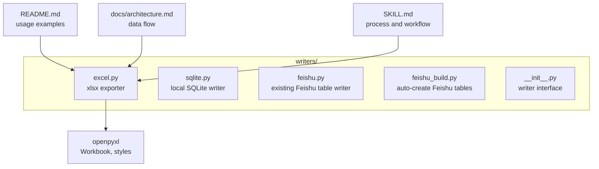
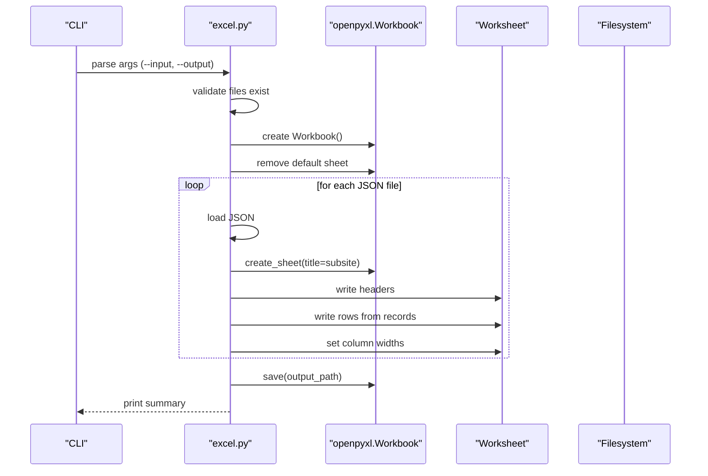
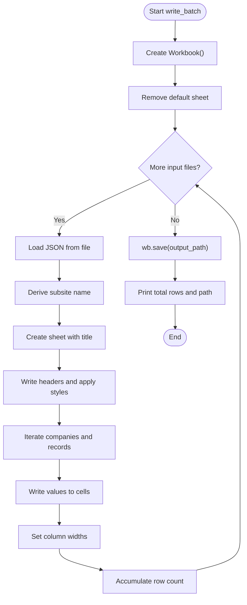
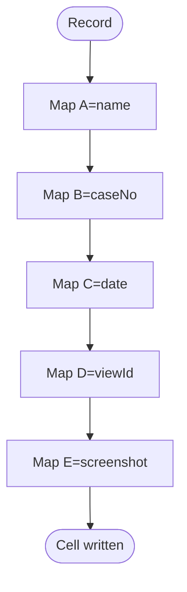
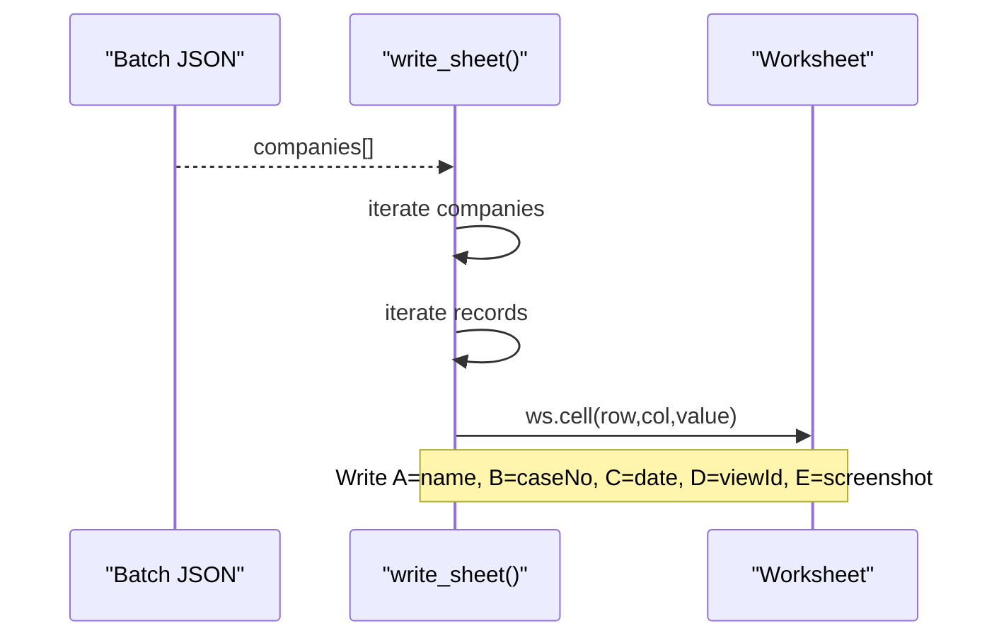
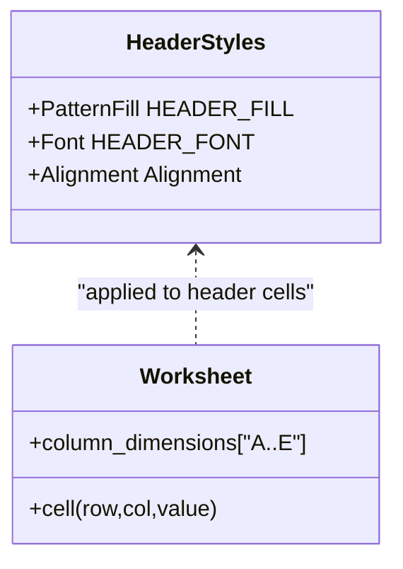
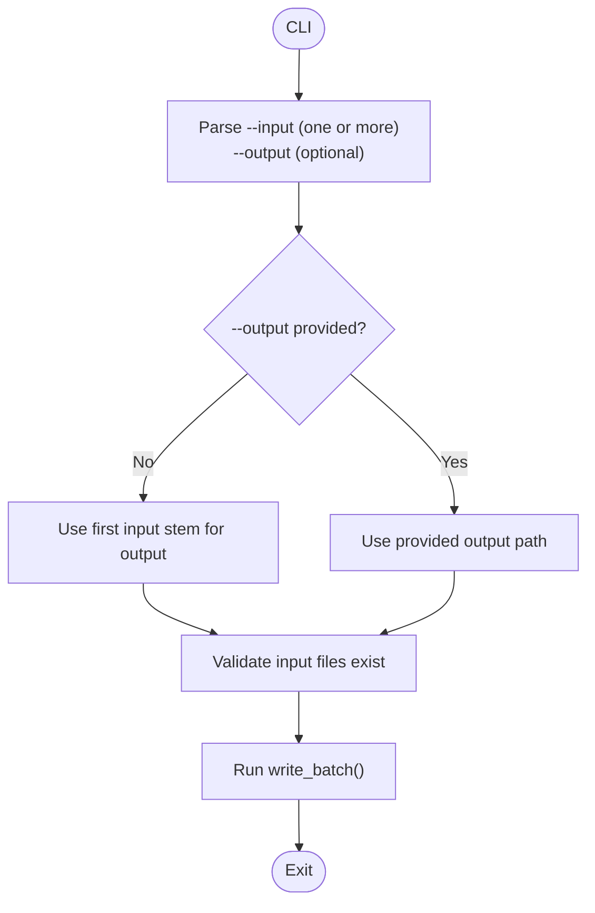
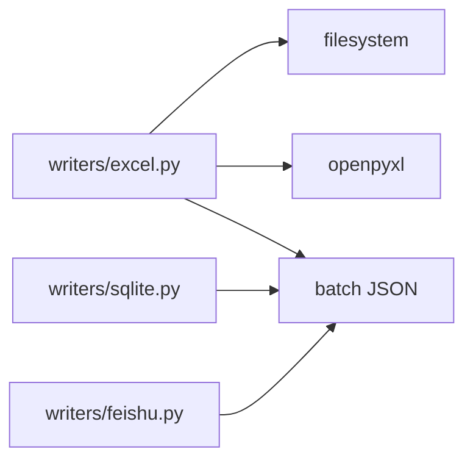

# Excel Export System

<cite>
**Referenced Files in This Document**
- [excel.py](file://writers/excel.py)
- [sqlite.py](file://writers/sqlite.py)
- [feishu.py](file://writers/feishu.py)
- [feishu_build.py](file://writers/feishu_build.py)
- [__init__.py](file://writers/__init__.py)
- [README.md](file://README.md)
- [architecture.md](file://docs/architecture.md)
- [SKILL.md](file://SKILL.md)
</cite>

## Table of Contents
1. [Introduction](#introduction)
2. [Project Structure](#project-structure)
3. [Core Components](#core-components)
4. [Architecture Overview](#architecture-overview)
5. [Detailed Component Analysis](#detailed-component-analysis)
6. [Dependency Analysis](#dependency-analysis)
7. [Performance Considerations](#performance-considerations)
8. [Troubleshooting Guide](#troubleshooting-guide)
9. [Conclusion](#conclusion)
10. [Appendices](#appendices)

## Introduction
This document explains the Excel export writer that transforms structured batch JSON into a multi-sheet Excel workbook. It covers workbook creation, worksheet organization, column mapping, data transformation from JSON to Excel cells, styling and formatting, and practical usage patterns. It also provides guidance on performance optimization, memory management, cross-platform compatibility, file size considerations, template customization, and integration with business reporting workflows.

## Project Structure
The Excel export writer is part of a modular writers package that supports multiple storage targets. The writers module exposes a consistent interface and can be invoked independently.

**Diagram sources**
- [excel.py:17-22](file://writers/excel.py#L17-L22)
- [README.md:39-43](file://README.md#L39-L43)
- [architecture.md:16-21](file://docs/architecture.md#L16-L21)
- [SKILL.md:225-234](file://SKILL.md#L225-L234)

**Section sources**
- [__init__.py:1-10](file://writers/__init__.py#L1-L10)
- [README.md:39-43](file://README.md#L39-L43)
- [architecture.md:16-21](file://docs/architecture.md#L16-L21)

## Core Components
- Excel writer module: Creates a workbook, writes one worksheet per subsite, applies header styling, and writes mapped columns from JSON records.
- Argument parsing: Supports multiple input files and optional output path inference from the first input filename.
- Style constants: Centralized header fill, font, and alignment definitions for consistent appearance.

Key responsibilities:
- Parse command-line arguments and validate inputs.
- Load JSON batches and iterate over companies and records.
- Create sheets per subsite and write headers and rows.
- Apply column width sizing and save the workbook.

**Section sources**
- [excel.py:25-27](file://writers/excel.py#L25-L27)
- [excel.py:29-53](file://writers/excel.py#L29-L53)
- [excel.py:56-73](file://writers/excel.py#L56-L73)
- [excel.py:76-96](file://writers/excel.py#L76-L96)

## Architecture Overview
The Excel export writer participates in the post-processing pipeline that follows automated querying. It reads batch JSON files produced by the main query script and writes them to Excel for reporting.

**Diagram sources**
- [excel.py:56-73](file://writers/excel.py#L56-L73)
- [excel.py:29-53](file://writers/excel.py#L29-L53)
- [excel.py:76-96](file://writers/excel.py#L76-L96)

**Section sources**
- [architecture.md:14-21](file://docs/architecture.md#L14-L21)
- [README.md:41-43](file://README.md#L41-L43)

## Detailed Component Analysis

### Workbook Creation and Sheet Organization
- Workbook initialization: A new workbook is created and the default sheet is removed to avoid clutter.
- Per-file processing: For each input JSON file, the subsite name is derived from the JSON metadata or filename, truncated to Excel’s sheet name limit.
- Worksheet creation: A new sheet is created for each subsite and populated with headers and data rows.

**Diagram sources**
- [excel.py:56-73](file://writers/excel.py#L56-L73)
- [excel.py:29-53](file://writers/excel.py#L29-L53)

**Section sources**
- [excel.py:56-73](file://writers/excel.py#L56-L73)

### Column Mapping Strategy
The writer maps JSON record fields to fixed columns in the worksheet:
- Column A: name
- Column B: caseNo
- Column C: date
- Column D: viewId
- Column E: screenshot

These correspond to the “被执行人” (executed party), “案号” (case number), “立案日期” (filing date), “viewId”, and “截图路径” (screenshot path) headers.

**Diagram sources**
- [excel.py:40-46](file://writers/excel.py#L40-L46)

**Section sources**
- [excel.py:31-31](file://writers/excel.py#L31-L31)
- [excel.py:40-46](file://writers/excel.py#L40-L46)

### Data Transformation Pipeline: JSON to Excel Cells
- JSON shape: The batch JSON contains a top-level structure with companies and records. The writer iterates over companies and then over records to populate rows.
- Field extraction: Values are extracted from each record using safe getters with defaults to prevent missing keys from breaking the pipeline.
- Cell writing: Values are written directly to cells in order, advancing the row index after each record.

**Diagram sources**
- [excel.py:39-46](file://writers/excel.py#L39-L46)

**Section sources**
- [excel.py:39-46](file://writers/excel.py#L39-L46)

### Cell Styling and Formatting Options
- Header styling: Solid blue fill, white bold font, centered alignment.
- Column widths: Explicitly set for readability and presentation.
- No formulas: The current implementation does not insert formulas; formatting is limited to header styling and column widths.

**Diagram sources**
- [excel.py:25-27](file://writers/excel.py#L25-L27)
- [excel.py:32-37](file://writers/excel.py#L32-L37)
- [excel.py:48-52](file://writers/excel.py#L48-L52)

**Section sources**
- [excel.py:25-27](file://writers/excel.py#L25-L27)
- [excel.py:32-37](file://writers/excel.py#L32-L37)
- [excel.py:48-52](file://writers/excel.py#L48-L52)

### Formula Integration
- Not implemented: There are no formulas inserted in the current implementation. If formulas are required, they can be added by setting cell values to formula strings and applying appropriate formatting.

[No sources needed since this section provides general guidance]

### Practical Export Configurations and Usage
- Command-line usage: The module supports multiple input files and optional output path specification. If output is omitted, it is inferred from the first input filename.
- Typical invocation: See the README usage examples for exporting Excel from batch JSON.

**Diagram sources**
- [excel.py:76-96](file://writers/excel.py#L76-L96)

**Section sources**
- [excel.py:76-96](file://writers/excel.py#L76-L96)
- [README.md:41-43](file://README.md#L41-L43)

### Custom Formatting Rules
- Current rules: Header fill, font, and alignment; explicit column widths.
- Extensibility: Additional formatting rules can be added by extending the header writing routine and applying styles to data cells as needed.

**Section sources**
- [excel.py:25-27](file://writers/excel.py#L25-L27)
- [excel.py:32-37](file://writers/excel.py#L32-L37)
- [excel.py:48-52](file://writers/excel.py#L48-L52)

### Error Handling During File Generation
- Missing dependencies: If openpyxl is not installed, the program prints an error and exits.
- Missing input files: The program checks existence of each input file and exits with an error if any are missing.
- Output saving: The workbook is saved to disk; errors during save are not explicitly handled in the current implementation.

**Section sources**
- [excel.py:17-22](file://writers/excel.py#L17-L22)
- [excel.py:87-91](file://writers/excel.py#L87-L91)

## Dependency Analysis
- Internal dependencies: The Excel writer depends on openpyxl for workbook creation and styling.
- External integrations: The writer consumes batch JSON produced by the main query pipeline and is part of the writers package alongside SQLite and Feishu writers.

**Diagram sources**
- [excel.py:17-22](file://writers/excel.py#L17-L22)
- [sqlite.py:45-46](file://writers/sqlite.py#L45-L46)
- [feishu.py:132-147](file://writers/feishu.py#L132-L147)

**Section sources**
- [excel.py:17-22](file://writers/excel.py#L17-L22)
- [sqlite.py:45-46](file://writers/sqlite.py#L45-L46)
- [feishu.py:132-147](file://writers/feishu.py#L132-L147)

## Performance Considerations
- Memory footprint: The current implementation loads JSON into memory and writes cells sequentially. For very large datasets, consider streaming or chunked writes to reduce peak memory usage.
- I/O efficiency: Writing to a single workbook minimizes filesystem overhead compared to multiple files.
- Column width: Explicit column widths improve rendering speed and reduce layout recalculations.
- Cross-platform compatibility: openpyxl works across platforms; ensure consistent locale settings if dates or numbers differ across environments.
- File size optimization: The current implementation does not compress images or use advanced compression; keep screenshots external and reference them via paths to minimize workbook size.

[No sources needed since this section provides general guidance]

## Troubleshooting Guide
- Missing openpyxl: Install the dependency to enable Excel export.
- Missing input files: Verify file paths and permissions.
- Output path issues: Ensure the destination directory exists and is writable.
- Large datasets: If encountering memory pressure, consider splitting exports into multiple workbooks or reducing column widths.

**Section sources**
- [excel.py:17-22](file://writers/excel.py#L17-L22)
- [excel.py:87-91](file://writers/excel.py#L87-L91)

## Conclusion
The Excel export writer provides a straightforward, reliable mechanism to transform batch JSON into a multi-sheet Excel workbook with consistent header styling and column widths. It integrates cleanly into the broader reporting pipeline and can be extended to support additional formatting rules and formulas as business needs evolve.

[No sources needed since this section summarizes without analyzing specific files]

## Appendices

### Integration with Business Reporting Workflows
- Multi-target writers: The writers package supports SQLite, Excel, and Feishu outputs, enabling flexible reporting channels.
- Workflow alignment: The Excel writer complements the main query pipeline and can be used for ad-hoc reporting or as part of automated dashboards.

**Section sources**
- [README.md:39-43](file://README.md#L39-L43)
- [SKILL.md:225-234](file://SKILL.md#L225-L234)