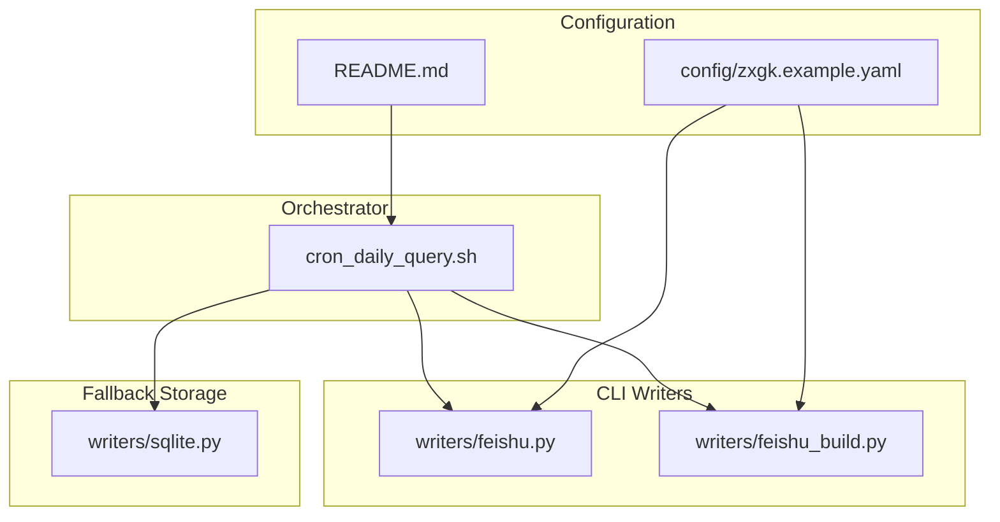
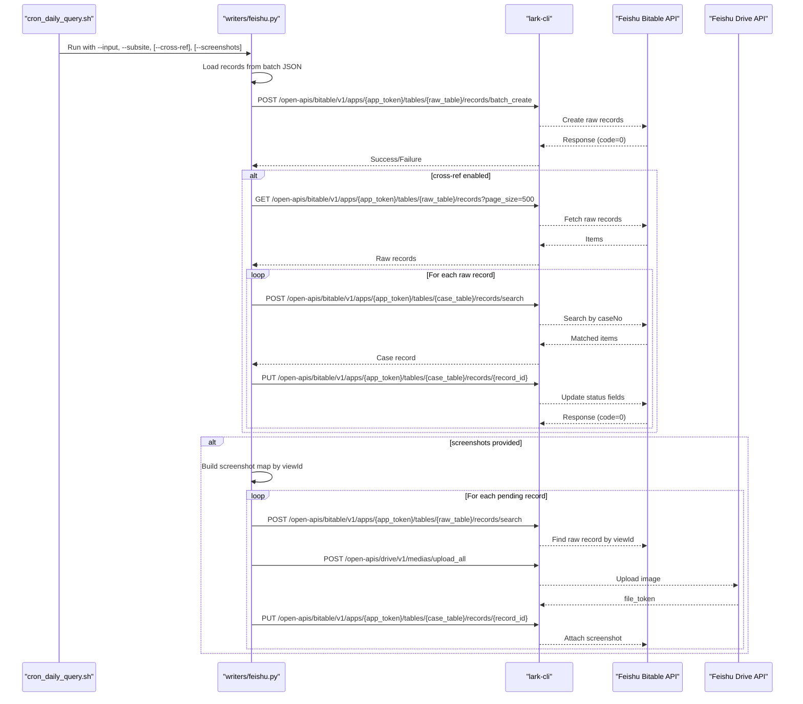
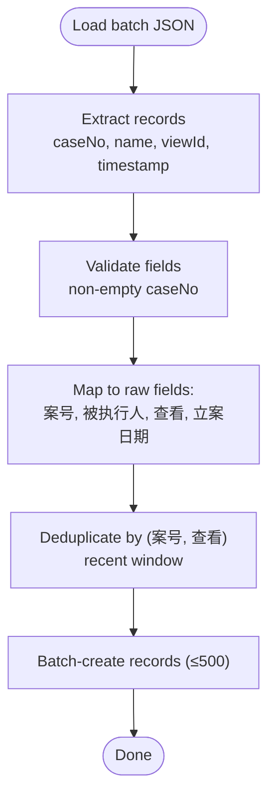
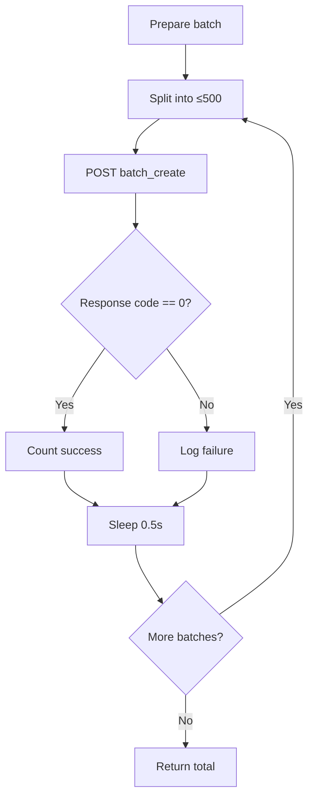
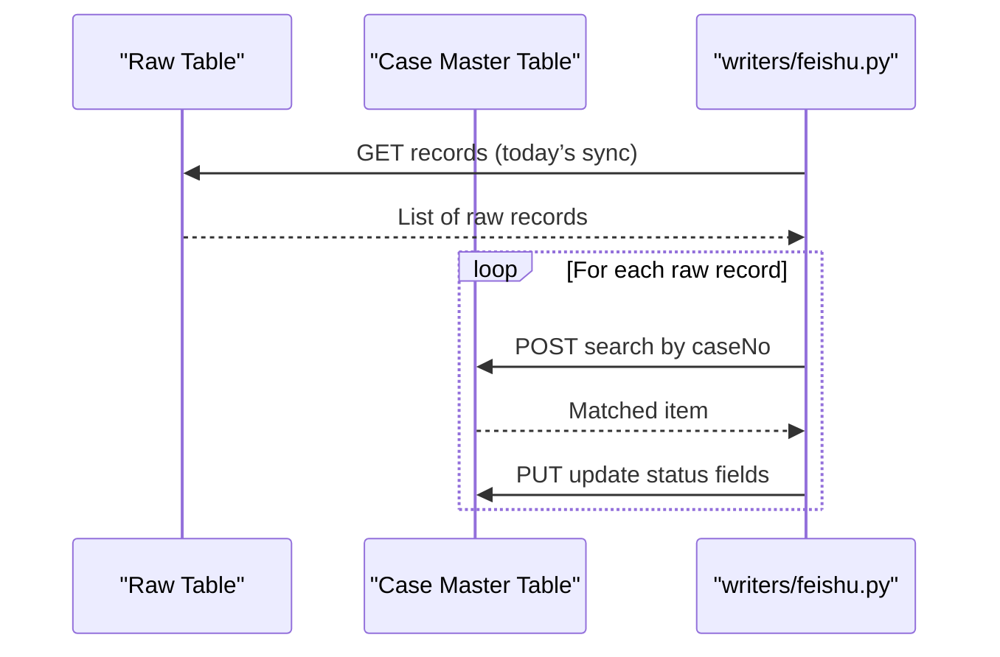
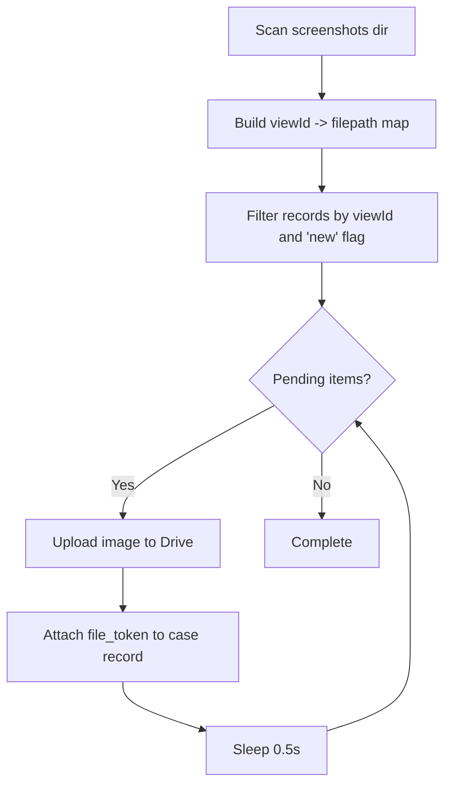
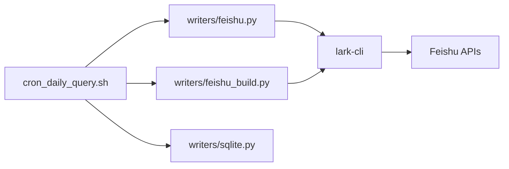

# Feishu Multi-Dimensional Table Integration

<cite>
**Referenced Files in This Document**
- [writers/feishu.py](file://writers/feishu.py)
- [writers/feishu_build.py](file://writers/feishu_build.py)
- [cron_daily_query.sh](file://cron_daily_query.sh)
- [README.md](file://README.md)
- [config/zxgk.example.yaml](file://config/zxgk.example.yaml)
- [writers/sqlite.py](file://writers/sqlite.py)
</cite>

## Table of Contents
1. [Introduction](#introduction)
2. [Project Structure](#project-structure)
3. [Core Components](#core-components)
4. [Architecture Overview](#architecture-overview)
5. [Detailed Component Analysis](#detailed-component-analysis)
6. [Dependency Analysis](#dependency-analysis)
7. [Performance Considerations](#performance-considerations)
8. [Troubleshooting Guide](#troubleshooting-guide)
9. [Conclusion](#conclusion)
10. [Appendices](#appendices)

## Introduction
This document explains the Feishu multi-dimensional table integration for enterprise collaboration platforms. It covers authentication, API endpoint configuration, table structure mapping, data transformation from execution records to Feishu table rows, field validation and mapping strategies, batch update operations, and cross-reference matching. It also documents error handling for API failures, rate limiting considerations, data conflict resolution strategies, permission management, workspace integration, and synchronization workflows with external systems.

## Project Structure
The Feishu integration is implemented as two writer modules:
- writers/feishu.py: Writes to existing Feishu tables and performs cross-reference updates and screenshot uploads.
- writers/feishu_build.py: Automatically creates Feishu tables, establishes bidirectional links, and writes initial data.

The integration is orchestrated by cron_daily_query.sh, which runs the three subsites (zhixing, shixin, xgl), writes to SQLite as a backup, and conditionally writes to Feishu when authenticated.

**Diagram sources**
- [writers/feishu.py:1-596](file://writers/feishu.py#L1-L596)
- [writers/feishu_build.py:1-242](file://writers/feishu_build.py#L1-L242)
- [cron_daily_query.sh:1-246](file://cron_daily_query.sh#L1-L246)
- [config/zxgk.example.yaml:1-103](file://config/zxgk.example.yaml#L1-L103)
- [writers/sqlite.py:1-121](file://writers/sqlite.py#L1-L121)

**Section sources**
- [writers/feishu.py:1-50](file://writers/feishu.py#L1-L50)
- [writers/feishu_build.py:1-20](file://writers/feishu_build.py#L1-L20)
- [cron_daily_query.sh:100-107](file://cron_daily_query.sh#L100-L107)
- [README.md:29-44](file://README.md#L29-L44)

## Core Components
- Authentication and Token Management
  - Uses FEISHU_APP_TOKEN environment variable for the Feishu Base app token.
  - Requires lark-cli authentication; the orchestrator checks user_info before enabling Feishu writes.

- API Layer
  - Wraps lark-cli commands to call Feishu Bitable and Drive APIs.
  - Provides helpers for media upload, record creation/update, and search/filter operations.

- Data Transformation and Field Mapping
  - Transforms execution records into Feishu raw table fields and case master table fields.
  - Supports cross-reference updates and screenshot uploads with precise matching by viewId.

- Batch Operations
  - Batch-create records with 500-record chunks.
  - Deduplication by (caseNo, viewId) within a configurable recent window.

- Cross-Reference Matching
  - Updates case master table fields (e.g., “is_shixin”, “is_xgl”) based on raw table records.
  - Uses exact case number match and respects “new vs existing” flags.

- Screenshot Upload and Attachment
  - Scans screenshot directory for viewId-based matches.
  - Uploads images to Feishu Drive and attaches to case master table records.

**Section sources**
- [writers/feishu.py:26-32](file://writers/feishu.py#L26-L32)
- [writers/feishu.py:56-66](file://writers/feishu.py#L56-L66)
- [writers/feishu.py:154-201](file://writers/feishu.py#L154-L201)
- [writers/feishu.py:208-277](file://writers/feishu.py#L208-L277)
- [writers/feishu.py:284-478](file://writers/feishu.py#L284-L478)

## Architecture Overview
The integration follows a staged pipeline:
- Execution records are generated by the query engine and saved as batch JSON.
- The orchestrator runs three subsites and writes to SQLite as a fallback.
- If lark-cli is authenticated, the Feishu writer writes to raw tables, optionally updates cross-references, and uploads screenshots.

**Diagram sources**
- [writers/feishu.py:154-201](file://writers/feishu.py#L154-L201)
- [writers/feishu.py:208-277](file://writers/feishu.py#L208-L277)
- [writers/feishu.py:284-478](file://writers/feishu.py#L284-L478)

**Section sources**
- [cron_daily_query.sh:142-146](file://cron_daily_query.sh#L142-L146)
- [writers/feishu.py:56-66](file://writers/feishu.py#L56-L66)

## Detailed Component Analysis

### Authentication and Environment Setup
- Token sourcing
  - FEISHU_APP_TOKEN environment variable supplies the Feishu Base app token.
  - The writer validates presence and exits early if missing.
- lark-cli authentication
  - The orchestrator checks user_info via lark-cli before enabling Feishu writes.
  - If unauthenticated, Feishu writes are skipped and a warning is logged.

Practical steps:
- Set FEISHU_APP_TOKEN to your Feishu Base token.
- Authenticate lark-cli with lark-cli auth.
- Ensure cron_daily_query.sh runs with the same environment.

**Section sources**
- [writers/feishu.py:26-32](file://writers/feishu.py#L26-L32)
- [cron_daily_query.sh:100-107](file://cron_daily_query.sh#L100-L107)
- [README.md:29-34](file://README.md#L29-L34)

### API Endpoint Configuration
- Bitable APIs used:
  - Records batch creation: POST /open-apis/bitable/v1/apps/{app_token}/tables/{table_id}/records/batch_create
  - Record update: PUT /open-apis/bitable/v1/apps/{app_token}/tables/{table_id}/records/{record_id}
  - Records search: POST /open-apis/bitable/v1/apps/{app_token}/tables/{table_id}/records/search
  - Records list with pagination: GET /open-apis/bitable/v1/apps/{app_token}/tables/{table_id}/records?page_size={N}
- Drive API used:
  - Media upload: POST /open-apis/drive/v1/medias/upload_all

These endpoints are invoked via lark-cli wrapper functions that handle timeouts, error logging, and response parsing.

**Section sources**
- [writers/feishu.py:56-66](file://writers/feishu.py#L56-L66)
- [writers/feishu.py:121-126](file://writers/feishu.py#L121-L126)
- [writers/feishu.py:226-227](file://writers/feishu.py#L226-L227)
- [writers/feishu.py:254-257](file://writers/feishu.py#L254-L257)
- [writers/feishu.py:89](file://writers/feishu.py#L89)

### Table Structure Mapping
- Raw table fields (per subsite)
  - Case number, party name, filing date, viewId, sync date.
- Case master table fields
  - Case number extract, party name extract, filing date, executing court, enforcement target amount, screenshot attachments, verification status.
- Bidirectional link
  - Raw table links to case master table and vice versa to enable cross-reference updates.

The automatic builder creates these tables and fields, then writes initial records and optionally uploads screenshots.

**Section sources**
- [writers/feishu_build.py:128-156](file://writers/feishu_build.py#L128-L156)
- [writers/feishu.py:34-51](file://writers/feishu.py#L34-L51)

### Data Transformation and Field Validation
- Execution record to raw table fields
  - Extract caseNo, name, viewId, timestamp.
  - Map to raw fields: “案号”, “被执行人”, “查看”, “立案日期”.
- Case master table fields
  - Populate extracted fields and verification status.
- Validation and mapping strategies
  - Extract text values from complex field structures.
  - Parse viewId from “查看” field.
  - Deduplicate by (caseNo, viewId) within a recent time window.

**Diagram sources**
- [writers/feishu.py:132-147](file://writers/feishu.py#L132-L147)
- [writers/feishu.py:154-201](file://writers/feishu.py#L154-L201)
- [writers/feishu.py:502-549](file://writers/feishu.py#L502-L549)

**Section sources**
- [writers/feishu.py:132-147](file://writers/feishu.py#L132-L147)
- [writers/feishu.py:484-500](file://writers/feishu.py#L484-L500)
- [writers/feishu.py:502-549](file://writers/feishu.py#L502-L549)

### Batch Update Operations
- Chunking
  - Records are split into 500-record batches for batch_create.
- Rate limiting
  - Short sleeps between batches and between cross-reference updates to avoid throttling.
- Error handling
  - Per-batch success counting; partial failures are logged and retried externally.

**Diagram sources**
- [writers/feishu.py:185-199](file://writers/feishu.py#L185-L199)

**Section sources**
- [writers/feishu.py:185-199](file://writers/feishu.py#L185-L199)

### Cross-Reference Matching and Status Updates
- Purpose
  - Update case master table fields “is_shixin”, “is_xgl” and corresponding dates based on raw table records.
- Matching strategy
  - Exact case number match in case master table.
  - Only process records flagged as “new” in raw table.
- Update operation
  - PUT record update with status fields set to “yes”.

**Diagram sources**
- [writers/feishu.py:208-277](file://writers/feishu.py#L208-L277)

**Section sources**
- [writers/feishu.py:208-277](file://writers/feishu.py#L208-L277)

### Screenshot Upload and Attachment
- Directory scanning
  - Build a map of viewId to screenshot file path.
- Matching and filtering
  - Only process records with viewId present and marked as “new”.
- Upload and attach
  - Upload image via Drive API to obtain file_token.
  - Attach file_token to the case master table record’s screenshot field.

**Diagram sources**
- [writers/feishu.py:284-478](file://writers/feishu.py#L284-L478)

**Section sources**
- [writers/feishu.py:284-478](file://writers/feishu.py#L284-L478)

### Automatic Table Creation and Setup
- Steps
  - Create raw table with fields: case number, party name, filing date, viewId, sync date.
  - Create case master table with fields: extracts, filing date, executing court, enforcement amount, screenshot, verification status.
  - Establish bidirectional link fields between raw and case tables.
  - Batch-write raw records and optionally upload screenshots.
- Usage
  - Run writers/feishu_build.py with --input and --app-token.

**Section sources**
- [writers/feishu_build.py:109-205](file://writers/feishu_build.py#L109-L205)

## Dependency Analysis
- Internal dependencies
  - writers/feishu.py depends on lark-cli wrappers and environment variables.
  - cron_daily_query.sh orchestrates Feishu writes and falls back to SQLite.
- External dependencies
  - lark-cli must be installed and authenticated.
  - Feishu Base app token must be configured.

**Diagram sources**
- [cron_daily_query.sh:142-146](file://cron_daily_query.sh#L142-L146)
- [writers/feishu.py:56-66](file://writers/feishu.py#L56-L66)
- [writers/feishu_build.py:28-42](file://writers/feishu_build.py#L28-L42)

**Section sources**
- [cron_daily_query.sh:142-146](file://cron_daily_query.sh#L142-L146)
- [writers/feishu.py:56-66](file://writers/feishu.py#L56-L66)
- [writers/feishu_build.py:28-42](file://writers/feishu_build.py#L28-L42)

## Performance Considerations
- Batch sizes
  - 500 records per batch for batch_create to minimize API round trips.
- Rate limiting
  - Sleep intervals between batches and cross-reference updates to avoid throttling.
- Pagination and filtering
  - Use page_size and page_token for large datasets.
  - Filter by recent days to reduce search scope during deduplication.
- Media upload
  - Use stdin piping to bypass known lark-cli file handling issues; set reasonable timeouts.

**Section sources**
- [writers/feishu.py:185-199](file://writers/feishu.py#L185-L199)
- [writers/feishu.py:524-547](file://writers/feishu.py#L524-L547)
- [writers/feishu.py:68-118](file://writers/feishu.py#L68-L118)

## Troubleshooting Guide
- Authentication failures
  - Ensure FEISHU_APP_TOKEN is set and lark-cli is authenticated.
  - The orchestrator checks user_info and skips Feishu writes if unauthenticated.
- API errors
  - lark_api logs stderr and returns None on non-zero exit codes.
  - Inspect response code and messages; retry selectively.
- Media upload issues
  - If upload fails, verify file permissions and size limits; consider increasing timeout.
- Cross-reference mismatches
  - Verify case number extraction and “new” flag in raw records.
  - Confirm bidirectional link fields exist in both tables.
- Deduplication not working
  - Check recent_days window and ensure “sync date” is populated.
  - Validate that “viewId” is present in the “查看” field.

**Section sources**
- [writers/feishu.py:29-32](file://writers/feishu.py#L29-L32)
- [writers/feishu.py:56-66](file://writers/feishu.py#L56-L66)
- [writers/feishu.py:68-118](file://writers/feishu.py#L68-L118)
- [writers/feishu.py:208-277](file://writers/feishu.py#L208-L277)
- [writers/feishu.py:502-549](file://writers/feishu.py#L502-L549)

## Conclusion
The Feishu integration provides a robust, staged pipeline for synchronizing execution records into Feishu multi-dimensional tables. It supports batch operations, cross-reference updates, and screenshot attachments, with built-in deduplication and rate-limiting safeguards. The automatic builder simplifies table setup, while the orchestrator ensures reliable synchronization with external systems and fallback storage.

## Appendices

### Practical Examples
- Table creation and initial data write
  - Use writers/feishu_build.py to create raw and case tables, establish links, and write records.
- Row insertion
  - Use writers/feishu.py to batch-insert raw records from a batch JSON file.
- Cross-reference matching
  - Enable --cross-ref to update case master table fields based on raw records.
- Screenshot upload
  - Provide --screenshots with a directory containing viewId-named PNG files; the writer uploads and attaches them to case records.

**Section sources**
- [writers/feishu_build.py:109-205](file://writers/feishu_build.py#L109-L205)
- [writers/feishu.py:154-201](file://writers/feishu.py#L154-L201)
- [writers/feishu.py:208-277](file://writers/feishu.py#L208-L277)
- [writers/feishu.py:284-478](file://writers/feishu.py#L284-L478)

### Permission Management and Workspace Integration
- Workspace integration
  - The Base app token (FEISHU_APP_TOKEN) determines workspace scope.
  - Ensure the authenticated user has edit permissions on the tables and fields.
- Field-level permissions
  - Configure read/write permissions for fields like “截图” (attachments) and “验证状态” (SingleSelect).
- Automation safety
  - The orchestrator checks lark-cli authentication before writing to Feishu.

**Section sources**
- [README.md:29-34](file://README.md#L29-L34)
- [cron_daily_query.sh:100-107](file://cron_daily_query.sh#L100-L107)

### Synchronization Workflows with External Systems
- Daily orchestration
  - cron_daily_query.sh runs three subsites, writes to SQLite, and conditionally writes to Feishu.
- Backup and reconciliation
  - SQLite serves as a zero-dependency backup; discrepancies can be reconciled by comparing raw and case tables.
- Phase B screenshot backfill
  - After Feishu calculations settle, run screenshot backfill to attach images to case records.

**Section sources**
- [cron_daily_query.sh:159-161](file://cron_daily_query.sh#L159-L161)
- [cron_daily_query.sh:215-228](file://cron_daily_query.sh#L215-L228)