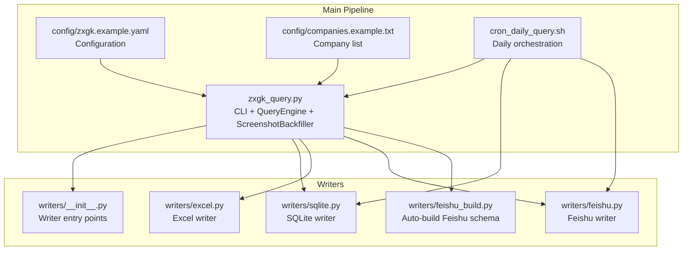
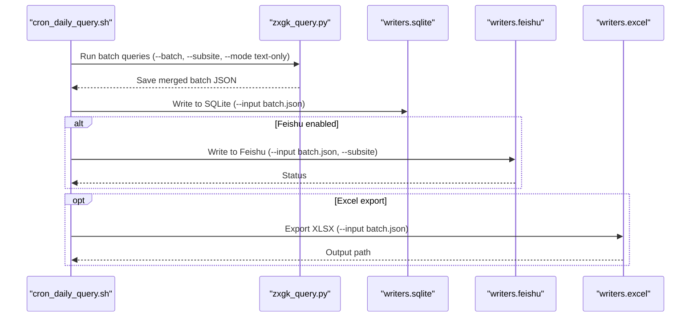
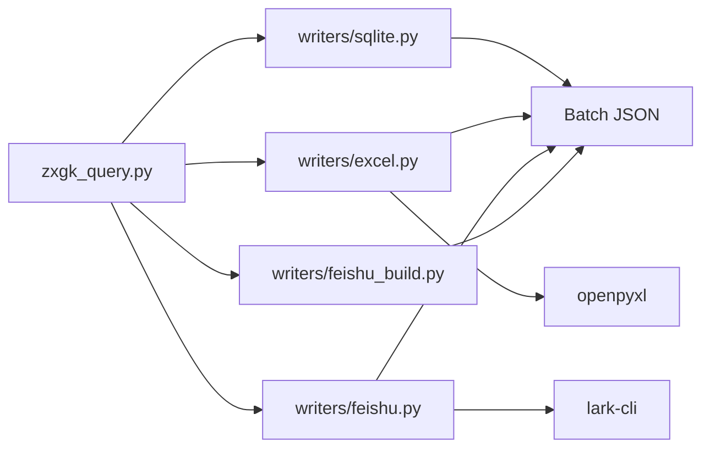
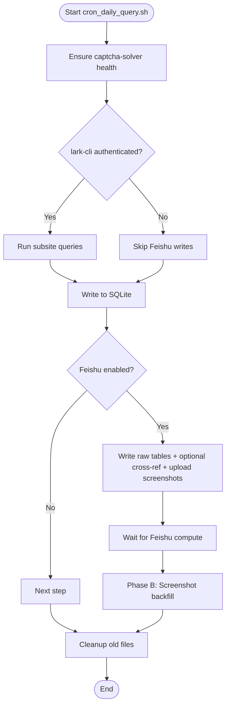

# Output Generation System

<cite>
**Referenced Files in This Document**
- [README.md](file://README.md)
- [writers/__init__.py](file://writers/__init__.py)
- [writers/sqlite.py](file://writers/sqlite.py)
- [writers/excel.py](file://writers/excel.py)
- [writers/feishu.py](file://writers/feishu.py)
- [writers/feishu_build.py](file://writers/feishu_build.py)
- [zxgk_query.py](file://zxgk_query.py)
- [cron_daily_query.sh](file://cron_daily_query.sh)
- [config/zxgk.example.yaml](file://config/zxgk.example.yaml)
- [config/companies.example.txt](file://config/companies.example.txt)
</cite>

## Table of Contents
1. [Introduction](#introduction)
2. [Project Structure](#project-structure)
3. [Core Components](#core-components)
4. [Architecture Overview](#architecture-overview)
5. [Detailed Component Analysis](#detailed-component-analysis)
6. [Dependency Analysis](#dependency-analysis)
7. [Performance Considerations](#performance-considerations)
8. [Troubleshooting Guide](#troubleshooting-guide)
9. [Conclusion](#conclusion)
10. [Appendices](#appendices)

## Introduction
This document explains the output generation system that persists and publishes query results across multiple formats and platforms. It focuses on the pluggable writer architecture, the writer factory pattern, JSON serialization format, and screenshot processing capabilities. It documents each output writer (SQLite, Excel, Feishu multi-dimensional table), practical configuration and transformation strategies, error handling, performance considerations for large datasets, and cross-platform compatibility.

## Project Structure
The output generation system is organized around a small set of writer modules under writers/, each implementing a uniform interface to write batch JSON to a target destination. The system integrates with the main query pipeline and a daily orchestration script.

**Diagram sources**
- [writers/__init__.py:1-10](file://writers/__init__.py#L1-L10)
- [writers/sqlite.py:1-121](file://writers/sqlite.py#L1-L121)
- [writers/excel.py:1-97](file://writers/excel.py#L1-L97)
- [writers/feishu.py:1-596](file://writers/feishu.py#L1-L596)
- [writers/feishu_build.py:1-242](file://writers/feishu_build.py#L1-L242)
- [zxgk_query.py:1318-1510](file://zxgk_query.py#L1318-L1510)
- [cron_daily_query.sh:112-154](file://cron_daily_query.sh#L112-L154)

**Section sources**
- [README.md:1-122](file://README.md#L1-L122)
- [writers/__init__.py:1-10](file://writers/__init__.py#L1-L10)
- [writers/sqlite.py:1-121](file://writers/sqlite.py#L1-L121)
- [writers/excel.py:1-97](file://writers/excel.py#L1-L97)
- [writers/feishu.py:1-596](file://writers/feishu.py#L1-L596)
- [writers/feishu_build.py:1-242](file://writers/feishu_build.py#L1-L242)
- [zxgk_query.py:1318-1510](file://zxgk_query.py#L1318-L1510)
- [cron_daily_query.sh:112-154](file://cron_daily_query.sh#L112-L154)

## Core Components
- Writer factory pattern: Each writer module exposes a write method and a CLI entry point. The unified interface allows interchangeable persistence targets.
- JSON serialization format: The batch JSON produced by the query pipeline contains structured records with metadata suitable for multiple writers.
- Screenshot processing: Screenshots are captured and optionally embedded or stored externally, then synchronized to external systems.

Key responsibilities:
- SQLite writer: Stores results locally with optional binary embedding of screenshots.
- Excel writer: Exports batch results to XLSX with one sheet per subsite.
- Feishu writer: Writes to raw tables, optionally updates cross-reference flags, and uploads screenshots to a main case table.
- Feishu auto-builder: Creates tables and fields, establishes links, and writes initial data.

**Section sources**
- [writers/__init__.py:1-10](file://writers/__init__.py#L1-L10)
- [writers/sqlite.py:37-100](file://writers/sqlite.py#L37-L100)
- [writers/excel.py:56-73](file://writers/excel.py#L56-L73)
- [writers/feishu.py:556-591](file://writers/feishu.py#L556-L591)
- [writers/feishu_build.py:109-201](file://writers/feishu_build.py#L109-L201)

## Architecture Overview
The system follows a pipeline where the query engine produces a batch JSON file. Writers consume this JSON and persist it to various destinations. The daily orchestration script coordinates the entire workflow, ensuring local backups and optional cloud synchronization.

**Diagram sources**
- [cron_daily_query.sh:112-154](file://cron_daily_query.sh#L112-L154)
- [writers/sqlite.py:103-116](file://writers/sqlite.py#L103-L116)
- [writers/feishu.py:556-591](file://writers/feishu.py#L556-L591)
- [writers/excel.py:76-92](file://writers/excel.py#L76-L92)

## Detailed Component Analysis

### Writer Factory Pattern and Unified Interface
- Each writer module defines a write function and a main entry point that parses arguments and invokes the write routine.
- The interface contract is consistent: write(batch_json_path) → None.
- Writers are invoked as modules: python3 -m writers.<writer> with --input and writer-specific options.

Implementation highlights:
- SQLite writer: Supports storing screenshots as file paths, binary blobs, or both.
- Excel writer: Produces one sheet per subsite, with standardized headers.
- Feishu writer: Writes raw tables, performs cross-reference updates, and uploads screenshots to a main case table.

**Section sources**
- [writers/__init__.py:1-10](file://writers/__init__.py#L1-L10)
- [writers/sqlite.py:103-116](file://writers/sqlite.py#L103-L116)
- [writers/excel.py:76-92](file://writers/excel.py#L76-L92)
- [writers/feishu.py:556-591](file://writers/feishu.py#L556-L591)

### JSON Serialization Format
The batch JSON produced by the query pipeline includes:
- Metadata: batch_id, subsite, query_time, summary totals.
- Companies: list of companies with status and records.
- Records: list of case records with fields such as name, caseNo, date, viewId, timestamp, and optional screenshot path.

Transformation and storage strategies:
- SQLite: Embeds records into a table per subsite with optional BLOB storage of screenshots.
- Excel: Flattens records into a tabular layout per subsite.
- Feishu: Writes raw records to a raw table and optionally updates a main case table with cross-reference flags and attachments.

**Section sources**
- [zxgk_query.py:1256-1317](file://zxgk_query.py#L1256-L1317)
- [writers/sqlite.py:37-100](file://writers/sqlite.py#L37-L100)
- [writers/excel.py:29-53](file://writers/excel.py#L29-L53)
- [writers/feishu.py:132-147](file://writers/feishu.py#L132-L147)

### SQLite Integration
Purpose:
- Local, zero-dependency persistence of query results with optional screenshot storage strategies.

Key behaviors:
- Schema creation per subsite with fields for company, case number, name, date, viewId, timestamp, and screenshot metadata.
- Migration support to add screenshot_data column if missing.
- Storage modes:
  - file: Store only the screenshot path.
  - blob: Store screenshot as binary and delete the file after successful write.
  - both: Store both path and binary.

Performance and reliability:
- Uses transactions per batch write to minimize overhead.
- Handles file read failures gracefully when loading binary data.

**Section sources**
- [writers/sqlite.py:19-34](file://writers/sqlite.py#L19-L34)
- [writers/sqlite.py:37-100](file://writers/sqlite.py#L37-L100)
- [writers/sqlite.py:103-116](file://writers/sqlite.py#L103-L116)

### Excel Export Functionality
Purpose:
- Produce XLSX reports for human consumption with one sheet per subsite.

Key behaviors:
- Reads batch JSON and writes a sheet per subsite.
- Standardized header row with formatting.
- Column widths optimized for readability.
- Skips empty sheets and prints counts per sheet.

Integration:
- Designed for offline review and sharing.

**Section sources**
- [writers/excel.py:29-53](file://writers/excel.py#L29-L53)
- [writers/excel.py:56-73](file://writers/excel.py#L56-L73)
- [writers/excel.py:76-92](file://writers/excel.py#L76-L92)

### Feishu Multi-Dimensional Table Synchronization
Purpose:
- Persist results to Feishu multi-dimensional tables, establish cross-references, and upload screenshots.

Core workflows:
- Raw table write:
  - Deduplicates by (caseNo, viewId) within a recent window.
  - Writes in batches of up to 500 records.
- Cross-reference update:
  - For shixin/xgl subsites, updates main case table flags and dates based on raw table content.
- Screenshot upload:
  - Scans a screenshots directory for files matching viewId patterns.
  - Uploads images to Feishu media storage and attaches them to the main case table record.
  - Removes uploaded files locally after successful attachment.

External integration:
- Uses lark-cli to call Feishu APIs for records, uploads, and updates.
- Requires FEISHU_APP_TOKEN environment variable.

**Section sources**
- [writers/feishu.py:154-201](file://writers/feishu.py#L154-L201)
- [writers/feishu.py:208-277](file://writers/feishu.py#L208-L277)
- [writers/feishu.py:284-478](file://writers/feishu.py#L284-L478)
- [writers/feishu.py:502-549](file://writers/feishu.py#L502-L549)
- [writers/feishu.py:556-591](file://writers/feishu.py#L556-L591)

### Feishu Auto-Build
Purpose:
- Automatically create Feishu tables, fields, and links, then write initial data and optionally upload screenshots.

Key steps:
- Create raw table with fields for case number, name, timestamp, viewId, and sync date.
- Create main case table with fields for extraction, court, amount, attachment, and verification status.
- Establish DuplexLink between tables.
- Batch-write raw records and optionally upload screenshots.

**Section sources**
- [writers/feishu_build.py:109-201](file://writers/feishu_build.py#L109-L201)
- [writers/feishu_build.py:207-237](file://writers/feishu_build.py#L207-L237)

### Screenshot Processing Capabilities
Processing pipeline:
- During query runs, screenshots are captured for each record’s detail view.
- The screenshot map (viewId → file path) is embedded in the JSON for downstream use.
- Feishu writer can upload screenshots to the main case table and remove local files upon success.
- Excel writer does not embed screenshots; it stores only the path.

Cross-system integration:
- Feishu writer scans a directory for files named with viewId patterns and attaches them to records.
- Local cleanup ensures disk usage remains bounded.

**Section sources**
- [zxgk_query.py:682-726](file://zxgk_query.py#L682-L726)
- [writers/feishu.py:284-306](file://writers/feishu.py#L284-L306)
- [writers/feishu.py:369-478](file://writers/feishu.py#L369-L478)
- [writers/excel.py:29-53](file://writers/excel.py#L29-L53)

### Practical Examples of Writer Configuration and Usage
- SQLite:
  - Default: python3 -m writers.sqlite --input batch.json
  - Store screenshots as BLOB: python3 -m writers.sqlite --input batch.json --store-screenshots blob
- Excel:
  - Default: python3 -m writers.excel --input batch.json
  - Custom output: python3 -m writers.excel --input batch.json --output report.xlsx
- Feishu:
  - Basic: python3 -m writers.feishu --input batch.json --subsite zhixing
  - Cross-reference: python3 -m writers.feishu --input batch.json --subsite shixin --cross-ref
  - Upload screenshots: python3 -m writers.feishu --input batch.json --subsite zhixing --screenshots output/screenshots
- Feishu auto-build:
  - python3 -m writers.feishu_build --input batch.json --app-token "<your_app_token>" [--screenshots output/screenshots]

**Section sources**
- [README.md:35-44](file://README.md#L35-L44)
- [writers/sqlite.py:103-116](file://writers/sqlite.py#L103-L116)
- [writers/excel.py:76-92](file://writers/excel.py#L76-L92)
- [writers/feishu.py:556-591](file://writers/feishu.py#L556-L591)
- [writers/feishu_build.py:207-237](file://writers/feishu_build.py#L207-L237)

### Relationship Between Processed Data and Output Formats
- Processed data: The query engine collects records with standardized fields and captures screenshots, producing a batch JSON with embedded screenshot maps.
- Output formats:
  - SQLite: Relational persistence with optional binary storage.
  - Excel: Tabular export for reporting.
  - Feishu: Structured multi-dimensional tables with cross-references and attachments.

Field mapping and transformations:
- SQLite: Maps JSON fields to relational columns; optionally stores BLOBs.
- Excel: Flattens records into a fixed header layout per subsite.
- Feishu: Writes raw records and updates main table fields based on subsite-specific logic.

**Section sources**
- [writers/sqlite.py:37-100](file://writers/sqlite.py#L37-L100)
- [writers/excel.py:29-53](file://writers/excel.py#L29-L53)
- [writers/feishu.py:154-201](file://writers/feishu.py#L154-L201)

### Error Handling During Write Operations
- SQLite:
  - Gracefully handles file read failures when loading binary data.
  - Prints counts and returns total inserted records.
- Excel:
  - Validates input files and prints errors for missing files.
  - Uses workbook defaults and sheet naming constraints.
- Feishu:
  - Checks environment token presence and prints actionable errors.
  - Implements timeouts for uploads and API calls.
  - Deduplication queries handle API errors by skipping dedup checks.
  - Batch writes log partial successes and failures.
- Auto-build:
  - Validates app token and lark-cli authentication.
  - Reports failures for table creation and field addition.

**Section sources**
- [writers/sqlite.py:66-71](file://writers/sqlite.py#L66-L71)
- [writers/excel.py:87-91](file://writers/excel.py#L87-L91)
- [writers/feishu.py:29-33](file://writers/feishu.py#L29-L33)
- [writers/feishu.py:101-117](file://writers/feishu.py#L101-L117)
- [writers/feishu.py:502-532](file://writers/feishu.py#L502-L532)
- [writers/feishu_build.py:220-237](file://writers/feishu_build.py#L220-L237)

### Performance Considerations for Large Datasets
- Batch sizes:
  - Feishu raw table writes use chunks of up to 500 records per batch.
  - Excel writes iterate through records and sheets without chunking.
- Rate limiting and delays:
  - Feishu writers introduce short sleeps between batch operations and per-record updates to avoid throttling.
- Storage strategies:
  - SQLite BLOB mode reduces filesystem fragmentation but increases database size; file mode keeps DB compact.
- I/O patterns:
  - Excel writer sets column widths and styles; avoid excessive formatting for very large exports.
  - Feishu screenshot uploads stream file content via stdin to bypass known lark-cli bugs.

**Section sources**
- [writers/feishu.py:185-199](file://writers/feishu.py#L185-L199)
- [writers/feishu.py:474-477](file://writers/feishu.py#L474-L477)
- [writers/sqlite.py:91-96](file://writers/sqlite.py#L91-L96)
- [writers/excel.py:48-52](file://writers/excel.py#L48-L52)
- [writers/feishu.py:89-118](file://writers/feishu.py#L89-L118)

### Configuration Options, Field Mapping, and External Integrations
- Configuration:
  - YAML config supports browser, WAF, screenshots, subsites, Feishu table IDs and field mappings, output directories, and company lists.
  - Environment variables: FEISHU_APP_TOKEN supplies the Feishu Base token.
- Field mapping:
  - Feishu writer expects specific field names for raw and main tables; adjust mappings in the writer or configuration.
- External integrations:
  - Feishu APIs via lark-cli.
  - Excel via openpyxl.
  - SQLite via built-in sqlite3.

**Section sources**
- [config/zxgk.example.yaml:1-103](file://config/zxgk.example.yaml#L1-L103)
- [writers/feishu.py:26-51](file://writers/feishu.py#L26-L51)
- [writers/excel.py:17-22](file://writers/excel.py#L17-L22)
- [README.md:29-34](file://README.md#L29-L34)

### Best Practices for Data Persistence and Cross-Platform Compatibility
- Choose storage based on use case:
  - SQLite for local, fast, and portable persistence.
  - Excel for human-readable reports and cross-platform spreadsheets.
  - Feishu for team collaboration and automated workflows.
- Manage screenshot storage:
  - Prefer file mode for SQLite to keep DB small; use BLOB mode only when necessary.
  - Clean up uploaded screenshots locally after successful attachment.
- Cross-platform:
  - Use Python standard libraries (sqlite3) and widely available packages (openpyxl).
  - Ensure lark-cli is installed and authenticated for Feishu integration.

**Section sources**
- [writers/sqlite.py:37-44](file://writers/sqlite.py#L37-L44)
- [writers/feishu.py:467-477](file://writers/feishu.py#L467-L477)
- [README.md:8-14](file://README.md#L8-L14)

## Dependency Analysis
The system exhibits low coupling among writers and high cohesion within each writer module. Writers depend on shared JSON formats and optional external tools.

**Diagram sources**
- [writers/sqlite.py:103-116](file://writers/sqlite.py#L103-L116)
- [writers/excel.py:76-92](file://writers/excel.py#L76-L92)
- [writers/feishu.py:556-591](file://writers/feishu.py#L556-L591)
- [writers/feishu_build.py:207-237](file://writers/feishu_build.py#L207-L237)

**Section sources**
- [writers/sqlite.py:103-116](file://writers/sqlite.py#L103-L116)
- [writers/excel.py:76-92](file://writers/excel.py#L76-L92)
- [writers/feishu.py:556-591](file://writers/feishu.py#L556-L591)
- [writers/feishu_build.py:207-237](file://writers/feishu_build.py#L207-L237)

## Performance Considerations
- Batch writing:
  - Feishu raw table writes use chunk sizes of 500 to balance throughput and rate limits.
- I/O efficiency:
  - SQLite BLOB mode reduces filesystem fragmentation but increases DB size; file mode is more compact.
- Network and API limits:
  - Feishu writers include deliberate delays between operations to avoid throttling.
- Formatting overhead:
  - Excel writer applies styles and column widths; avoid excessive formatting for very large exports.

[No sources needed since this section provides general guidance]

## Troubleshooting Guide
Common issues and resolutions:
- Missing dependencies:
  - Install openpyxl for Excel writer; install lark-cli for Feishu writer.
- Environment variables:
  - Set FEISHU_APP_TOKEN for Feishu integration.
- File paths:
  - Ensure input JSON exists; writers validate file existence and print errors.
- API errors:
  - Feishu writer logs API errors and continues; check network connectivity and token permissions.
- Upload failures:
  - Verify lark-cli authentication and file permissions; ensure screenshots directory exists and contains expected files.

**Section sources**
- [writers/excel.py:17-22](file://writers/excel.py#L17-L22)
- [writers/feishu.py:29-33](file://writers/feishu.py#L29-L33)
- [writers/feishu.py:101-117](file://writers/feishu.py#L101-L117)
- [writers/feishu.py:454-477](file://writers/feishu.py#L454-L477)

## Conclusion
The output generation system provides a flexible, pluggable architecture for persisting and publishing query results across multiple formats and platforms. The unified writer interface, consistent JSON serialization, and robust error handling enable reliable operation at scale. By choosing appropriate storage strategies and managing screenshot handling carefully, teams can achieve efficient local backups, human-friendly reports, and collaborative workflows in Feishu.

[No sources needed since this section summarizes without analyzing specific files]

## Appendices

### Appendix A: Daily Orchestration Workflow
The daily script coordinates three subsites, writes to SQLite, optionally synchronizes to Feishu, and performs a follow-up screenshot backfill after Feishu computation completes.

**Diagram sources**
- [cron_daily_query.sh:112-154](file://cron_daily_query.sh#L112-L154)
- [cron_daily_query.sh:215-228](file://cron_daily_query.sh#L215-L228)