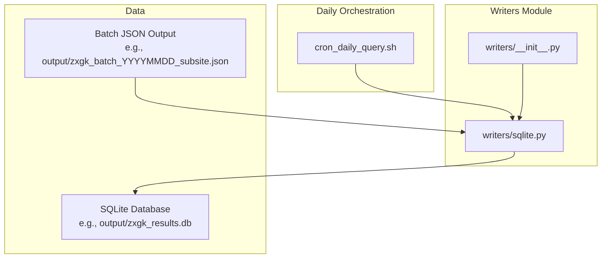
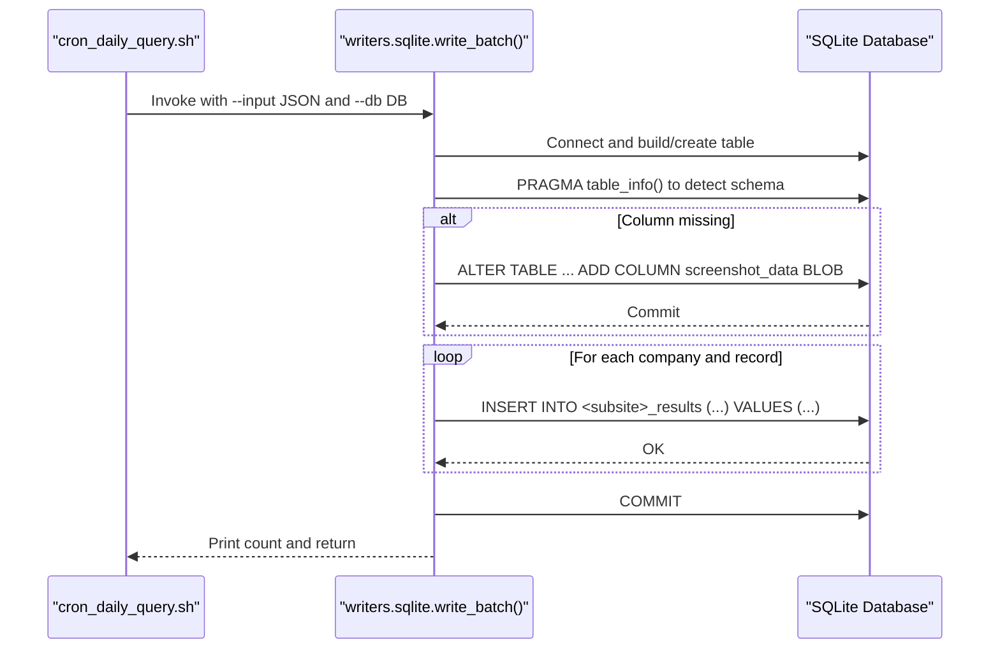
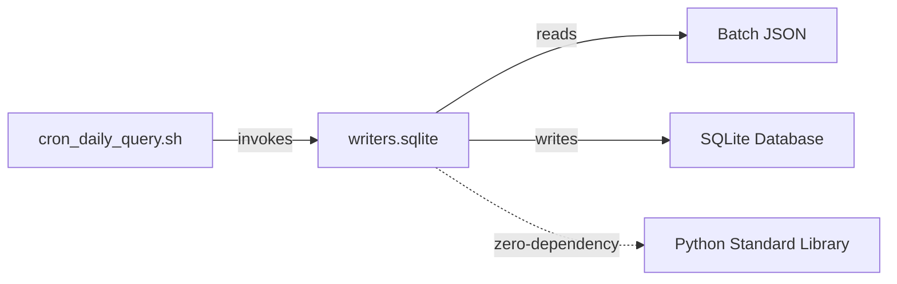

# SQLite Database Integration

<cite>
**Referenced Files in This Document**
- [sqlite.py](file://writers/sqlite.py)
- [README.md](file://README.md)
- [SKILL.md](file://SKILL.md)
- [cron_daily_query.sh](file://cron_daily_query.sh)
- [__init__.py](file://writers/__init__.py)
</cite>

## Table of Contents
1. [Introduction](#introduction)
2. [Project Structure](#project-structure)
3. [Core Components](#core-components)
4. [Architecture Overview](#architecture-overview)
5. [Detailed Component Analysis](#detailed-component-analysis)
6. [Dependency Analysis](#dependency-analysis)
7. [Performance Considerations](#performance-considerations)
8. [Troubleshooting Guide](#troubleshooting-guide)
9. [Conclusion](#conclusion)
10. [Appendices](#appendices)

## Introduction
This document provides comprehensive guidance for integrating SQLite as the persistent storage layer for execution records produced by the daily query pipeline. It focuses on database schema design, data persistence, write operations, migration strategies, validation rules, batch insertion, error handling, indexing, concurrency, integrity constraints, maintenance, and schema evolution across SQLite versions. The SQLite writer is designed to be zero-dependency, robust, and suitable for long-term archival of execution results.

## Project Structure
The SQLite integration resides in the writers module and is invoked by the daily orchestration script. The following diagram shows the relationship between the SQLite writer, the orchestration script, and the batch JSON input.

**Diagram sources**
- [cron_daily_query.sh:138-139](file://cron_daily_query.sh#L138-L139)
- [sqlite.py:37-100](file://writers/sqlite.py#L37-L100)
- [__init__.py:1-10](file://writers/__init__.py#L1-L10)

**Section sources**
- [cron_daily_query.sh:138-139](file://cron_daily_query.sh#L138-L139)
- [sqlite.py:37-100](file://writers/sqlite.py#L37-L100)
- [__init__.py:1-10](file://writers/__init__.py#L1-L10)

## Core Components
- Schema builder: Creates or updates the target table per subsite with a fixed set of columns.
- Write operation: Iterates over batch records and inserts them into the database.
- Migration: Adds new columns when upgrading older databases.
- Storage modes: Supports storing screenshots as file paths, binary blobs, or both.
- CLI entry point: Provides arguments for input JSON, database path, and screenshot storage mode.

Key responsibilities:
- Ensure the target table exists and is compatible with the current schema.
- Migrate legacy tables by adding missing columns.
- Insert execution records with validation of required fields.
- Manage screenshot storage according to the chosen mode.
- Report successful insertions and return counts.

**Section sources**
- [sqlite.py:19-34](file://writers/sqlite.py#L19-L34)
- [sqlite.py:37-100](file://writers/sqlite.py#L37-L100)
- [sqlite.py:103-120](file://writers/sqlite.py#L103-L120)

## Architecture Overview
The SQLite writer participates in the daily orchestration flow. The orchestration script generates batch JSON files and invokes the SQLite writer to persist results locally. The writer connects to the database, ensures the table exists, migrates it if needed, and performs batch-like insertion of records.

**Diagram sources**
- [cron_daily_query.sh:138-139](file://cron_daily_query.sh#L138-L139)
- [sqlite.py:52-58](file://writers/sqlite.py#L52-L58)
- [sqlite.py:73-88](file://writers/sqlite.py#L73-L88)
- [sqlite.py:97-99](file://writers/sqlite.py#L97-L99)

## Detailed Component Analysis

### Schema Design and Table Creation
- Table naming: Per subsite, the table name is derived from the subsite identifier, forming a unique table per child site.
- Columns:
  - Primary key: autoincrement integer id
  - Batch metadata: batch_id, company
  - Case identifiers: case_no, name
  - Execution details: date, view_id, timestamp
  - Screenshots: screenshot_path (text), screenshot_data (BLOB)
  - Audit: created_at with default current timestamp
- Constraints:
  - Primary key on id
  - No explicit NOT NULL constraints on most fields to accommodate partial data from batch JSON
  - Default timestamp for audit trail

Migration strategy:
- On connect, the writer checks for the presence of screenshot_data column.
- If absent, it adds the column and commits immediately to ensure future writes succeed.

Validation rules:
- The writer reads fields from the batch JSON and inserts them as-is, with minimal validation.
- Timestamp defaults to zero if missing.
- Case number and view id are taken from the record payload.

**Section sources**
- [sqlite.py:19-34](file://writers/sqlite.py#L19-L34)
- [sqlite.py:54-58](file://writers/sqlite.py#L54-L58)
- [sqlite.py:73-88](file://writers/sqlite.py#L73-L88)

### Write Operation Implementation
- Input parsing: Loads the batch JSON and extracts batch_id and subsite.
- Table selection: Constructs the table name from the subsite.
- Connection lifecycle: Opens a connection, executes DDL, and closes after inserts.
- Iteration: Traverses companies and records, building INSERT statements with positional parameters.
- Screenshot handling:
  - file: stores the path; no binary read
  - blob: reads the file into memory and stores as BLOB; optionally deletes the file after successful write
  - both: stores both path and BLOB; retains the file
- Commit: Commits all inserts at once and closes the connection.

Error handling:
- File read failures for screenshots are caught and ignored to avoid aborting the entire batch.
- Missing input file triggers an immediate CLI error and exit.

Concurrency:
- The writer opens a single connection and performs sequential inserts. There is no explicit transaction block; the commit happens once after all inserts.

**Section sources**
- [sqlite.py:45-50](file://writers/sqlite.py#L45-L50)
- [sqlite.py:66-95](file://writers/sqlite.py#L66-L95)
- [sqlite.py:97-99](file://writers/sqlite.py#L97-L99)
- [sqlite.py:112-116](file://writers/sqlite.py#L112-L116)

### Batch Insertion Optimization
Current behavior:
- The writer iterates records and issues individual INSERT statements.
- It does not wrap inserts in a transaction block; a single COMMIT occurs after all inserts.
- No explicit batching (e.g., executemany) is used.

Optimization opportunities:
- Wrap the insert loop inside a transaction to reduce overhead and improve atomicity.
- Use executemany for bulk inserts to minimize round-trips.
- Consider chunking large batches to manage memory and transaction duration.

Note: These are recommendations for improvement; the current implementation is functional and zero-dependency.

**Section sources**
- [sqlite.py:60-99](file://writers/sqlite.py#L60-L99)

### Data Validation Rules
- Required fields extracted from batch JSON:
  - batch_id, company, case_no, name, date, view_id, timestamp, screenshot
- Defaults:
  - timestamp defaults to zero if missing
  - case_no and view_id default to empty string if missing
- Validation:
  - Minimal validation is performed; the writer assumes the batch JSON is well-formed and passes values as-is.

**Section sources**
- [sqlite.py:77-87](file://writers/sqlite.py#L77-L87)

### Practical Examples of Queries and Retrieval Patterns
- Retrieve all records for a given subsite and date range:
  - SELECT * FROM <subsite>_results WHERE created_at BETWEEN '<start>' AND '<end>'
- Count records by company:
  - SELECT company, COUNT(*) FROM <subsite>_results GROUP BY company
- Find records by case number:
  - SELECT * FROM <subsite>_results WHERE case_no = ?
- List recent records:
  - SELECT * FROM <subsite>_results ORDER BY created_at DESC LIMIT 100

These patterns are illustrative and should be adapted to the specific subsite and filtering criteria.

**Section sources**
- [sqlite.py:19-34](file://writers/sqlite.py#L19-L34)

### Backup Procedures
- Local backup: The orchestration script always writes to the SQLite database, ensuring a local backup of results.
- Manual backup:
  - Copy the database file to another location.
  - Use SQLite’s .backup command or export via .dump/.restore for cross-platform portability.
- Retention:
  - The orchestration script cleans old files periodically; keep the database for long-term archival.

**Section sources**
- [cron_daily_query.sh:138-139](file://cron_daily_query.sh#L138-L139)
- [README.md:39-40](file://README.md#L39-L40)

### Indexing Strategies for Performance
- Recommended indexes:
  - idx_batch_id: ON <subsite>_results(batch_id)
  - idx_company: ON <subsite>_results(company)
  - idx_case_no: ON <subsite>_results(case_no)
  - idx_created_at: ON <subsite>_results(created_at)
- Composite indexes:
  - idx_company_case: ON <subsite>_results(company, case_no)
  - idx_timestamp: ON <subsite>_results(timestamp)
- Rationale:
  - Improve filtering by company and case number.
  - Optimize chronological scans and backups.
  - Reduce cost of frequent queries in downstream tools.

Note: Create indexes after initial data loads to avoid write-time overhead.

**Section sources**
- [sqlite.py:19-34](file://writers/sqlite.py#L19-L34)

### Concurrent Access Handling
- Single-writer model:
  - The SQLite writer opens one connection and performs sequential inserts, committing once.
- Concurrency considerations:
  - For read-heavy workloads, enable WAL mode and appropriate pragmas.
  - Avoid concurrent writers; if multiple processes must write, serialize access externally.
- Integrity:
  - The writer relies on SQLite’s ACID guarantees; ensure no external modifications occur during writes.

**Section sources**
- [sqlite.py:52-58](file://writers/sqlite.py#L52-L58)
- [sqlite.py:97-99](file://writers/sqlite.py#L97-L99)

### Data Integrity Constraints
- Primary key: id ensures uniqueness per row.
- Default timestamp: created_at provides an audit trail.
- No explicit NOT NULL constraints: accommodates partial data but may require defensive queries.
- Foreign keys: Not applicable; this is a standalone archive table.

Recommendations:
- Add NOT NULL constraints for critical fields if downstream consumers require them.
- Normalize later if additional entities (e.g., companies, cases) emerge.

**Section sources**
- [sqlite.py:22-33](file://writers/sqlite.py#L22-L33)

### Database Maintenance Tasks
- Vacuum and analyze:
  - Periodically run VACUUM to reclaim space and ANALYZE to update statistics.
- Integrity check:
  - PRAGMA integrity_check to validate database health.
- Journal mode:
  - Consider WAL mode for improved concurrency and durability.
- Size monitoring:
  - Track database growth and prune old data as needed.

**Section sources**
- [sqlite.py:52-58](file://writers/sqlite.py#L52-L58)

### Schema Evolution and Compatibility
- Versioning:
  - The writer detects missing columns and adds them on first use.
  - This allows incremental schema evolution without downtime.
- Backward compatibility:
  - Newer versions can read older databases; older versions may lack new columns.
- SQLite version compatibility:
  - The writer uses standard SQL features present in widely supported SQLite versions.
  - Avoid experimental features; stick to core SQL standards.

**Section sources**
- [sqlite.py:54-58](file://writers/sqlite.py#L54-L58)

## Dependency Analysis
The SQLite writer is a standalone module with no external dependencies. It integrates with the orchestration script and batch JSON files.

**Diagram sources**
- [cron_daily_query.sh:138-139](file://cron_daily_query.sh#L138-L139)
- [sqlite.py:10-16](file://writers/sqlite.py#L10-L16)

**Section sources**
- [cron_daily_query.sh:138-139](file://cron_daily_query.sh#L138-L139)
- [sqlite.py:10-16](file://writers/sqlite.py#L10-L16)

## Performance Considerations
- Transaction boundaries: Wrap inserts in a transaction to reduce overhead and improve throughput.
- Batching: Use executemany to minimize round-trips.
- Indexing: Add indexes for frequently queried columns (company, case_no, created_at).
- I/O: Prefer file storage for screenshots when disk space is abundant; use BLOB mode when memory is constrained.
- Concurrency: Enable WAL mode and avoid concurrent writers.

[No sources needed since this section provides general guidance]

## Troubleshooting Guide
Common issues and resolutions:
- Missing input file:
  - The CLI reports an error and exits; verify the JSON path.
- Screenshot read failures:
  - The writer ignores OS errors and continues; check file permissions and paths.
- Database connectivity:
  - Ensure the database path is writable and the file is not locked by another process.
- Schema mismatch:
  - The writer automatically adds missing columns; verify the table structure after first run.

Operational tips:
- Monitor logs from the orchestration script for errors.
- Validate database integrity periodically.
- Keep the database file backed up and monitored for growth.

**Section sources**
- [sqlite.py:112-116](file://writers/sqlite.py#L112-L116)
- [sqlite.py:67-71](file://writers/sqlite.py#L67-L71)
- [sqlite.py:91-95](file://writers/sqlite.py#L91-L95)

## Conclusion
The SQLite integration provides a robust, zero-dependency mechanism for persisting execution records. It supports flexible screenshot storage modes, automatic schema migration, and straightforward batch insertion. By adopting recommended indexing, transactional batching, and maintenance practices, the system can scale effectively while maintaining data integrity and performance.

[No sources needed since this section summarizes without analyzing specific files]

## Appendices

### Appendix A: CLI Usage and Options
- Default mode: Store screenshot paths.
- Blob mode: Store screenshots as binary; delete local files after successful write.
- Both mode: Store both path and binary; retain files.

**Section sources**
- [README.md:39-40](file://README.md#L39-L40)
- [sqlite.py:107-109](file://writers/sqlite.py#L107-L109)

### Appendix B: Orchestration Integration
- The orchestration script always writes to SQLite, ensuring local archival.
- Subsequent steps may sync to remote systems if configured.

**Section sources**
- [cron_daily_query.sh:138-139](file://cron_daily_query.sh#L138-L139)
- [SKILL.md:95](file://SKILL.md#L95)