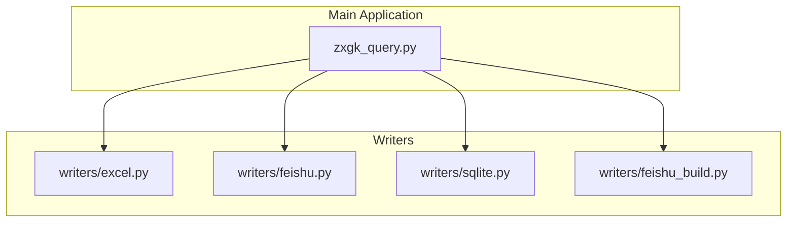
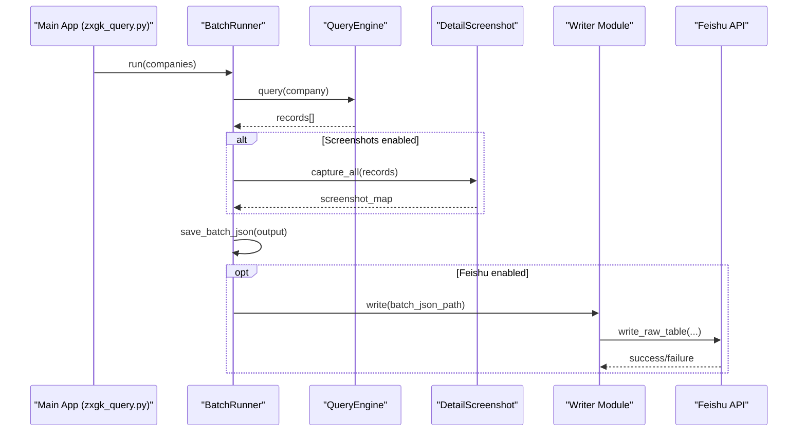
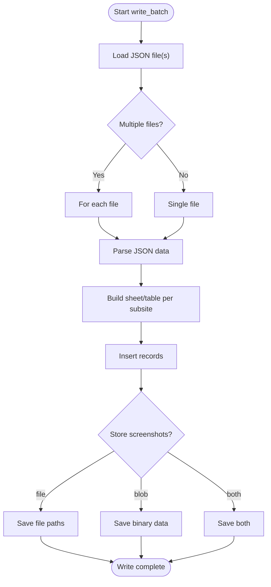
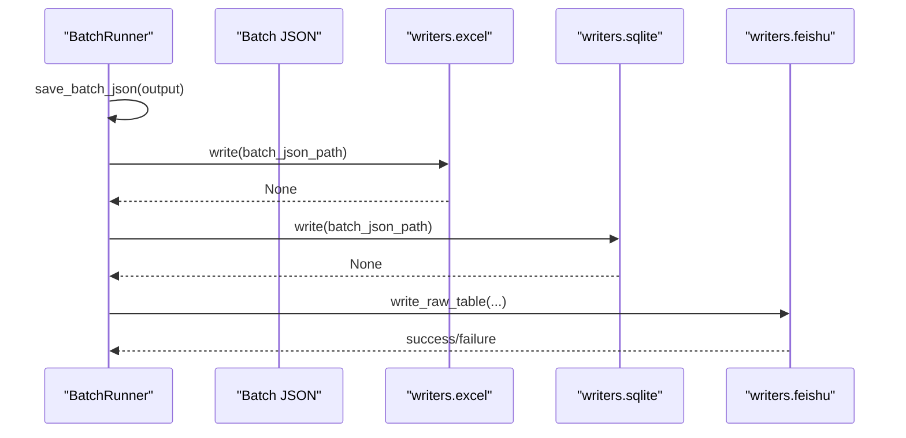
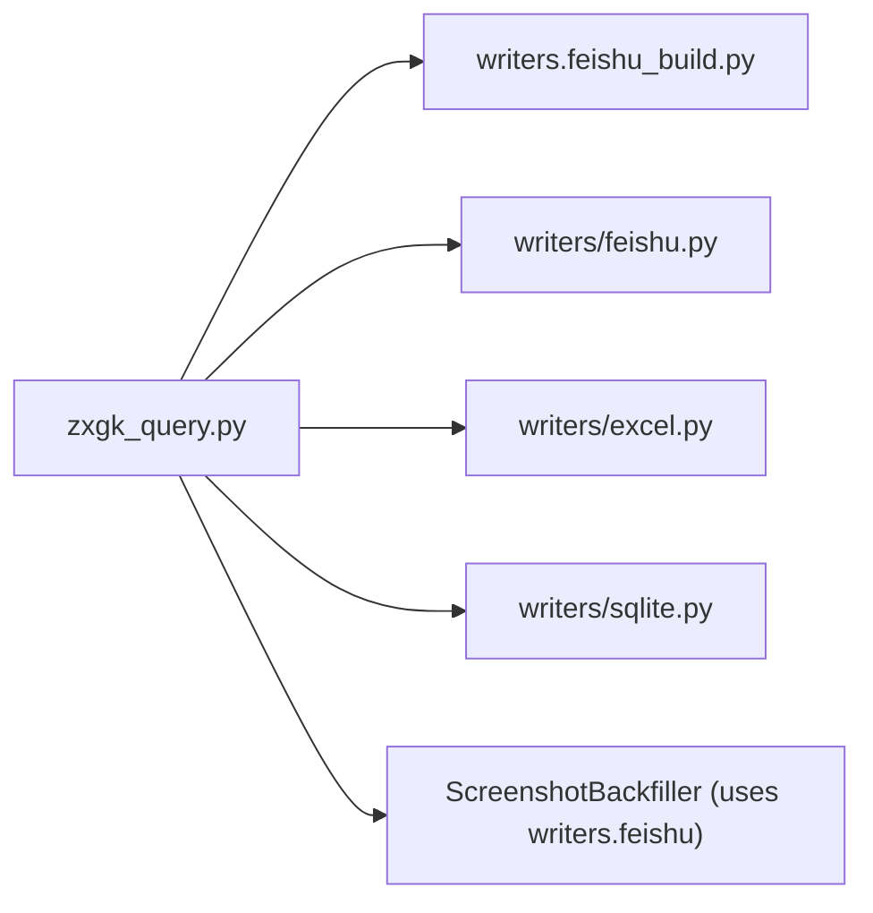

# Writer Architecture Overview

<cite>
**Referenced Files in This Document**
- [writers/__init__.py](file://writers/__init__.py)
- [writers/excel.py](file://writers/excel.py)
- [writers/feishu.py](file://writers/feishu.py)
- [writers/sqlite.py](file://writers/sqlite.py)
- [writers/feishu_build.py](file://writers/feishu_build.py)
- [zxgk_query.py](file://zxgk_query.py)
- [README.md](file://README.md)
- [config/zxgk.example.yaml](file://config/zxgk.example.yaml)
</cite>

## Table of Contents
1. [Introduction](#introduction)
2. [Project Structure](#project-structure)
3. [Core Components](#core-components)
4. [Architecture Overview](#architecture-overview)
5. [Detailed Component Analysis](#detailed-component-analysis)
6. [Dependency Analysis](#dependency-analysis)
7. [Performance Considerations](#performance-considerations)
8. [Troubleshooting Guide](#troubleshooting-guide)
9. [Conclusion](#conclusion)
10. [Appendices](#appendices)

## Introduction
This document explains the pluggable writer system design used to persist and export query results from the main application. It focuses on the factory-like usage model, unified interface contract, module organization, batch processing workflow, and command-line execution patterns. It also documents how writers integrate with the main query engine, error propagation, and extensibility for adding new output formats.

## Project Structure
The writer subsystem resides under writers/ and exposes independent modules that implement a common write contract. The main application orchestrates browser automation, query execution, and screenshot capture, then delegates persistence to writers.

**Diagram sources**
- [writers/__init__.py:1-10](file://writers/__init__.py#L1-L10)
- [writers/excel.py:1-97](file://writers/excel.py#L1-L97)
- [writers/feishu.py:1-596](file://writers/feishu.py#L1-L596)
- [writers/sqlite.py:1-121](file://writers/sqlite.py#L1-L121)
- [writers/feishu_build.py:1-242](file://writers/feishu_build.py#L1-L242)
- [zxgk_query.py:1063-1197](file://zxgk_query.py#L1063-L1197)

**Section sources**
- [writers/__init__.py:1-10](file://writers/__init__.py#L1-L10)
- [README.md:97-117](file://README.md#L97-L117)

## Core Components
- Unified write contract: Each writer module defines a write() method that accepts a batch JSON path and returns None. Writers can also expose a main() entry point for direct CLI invocation.
- Independent modules: Each writer is a standalone script/module with its own CLI argument parsing and internal processing logic.
- Factory-like usage: The main application does not directly instantiate writers. Instead, writers are invoked via CLI or imported selectively for specialized tasks (e.g., ScreenshotBackfiller imports writers.feishu for API calls).
- Batch processing: Writers process one or more batch JSON files, iterating over companies and records, and writing to the target medium.

Key implementation highlights:
- Excel writer: Reads batch JSON, writes to an Excel workbook with one sheet per subsite, and prints summary statistics.
- SQLite writer: Writes records to a local SQLite database, with configurable screenshot storage modes.
- Feishu writer: Writes to a configured Bitable structure, supports de-duplication, cross-reference updates, and screenshot uploads.
- Feishu build writer: Provisions a new Bitable structure and writes initial data.

**Section sources**
- [writers/__init__.py:3-9](file://writers/__init__.py#L3-L9)
- [writers/excel.py:56-73](file://writers/excel.py#L56-L73)
- [writers/sqlite.py:37-100](file://writers/sqlite.py#L37-L100)
- [writers/feishu.py:154-201](file://writers/feishu.py#L154-L201)
- [writers/feishu_build.py:109-204](file://writers/feishu_build.py#L109-L204)

## Architecture Overview
The main application runs browser automation, captures screenshots, and produces a batch JSON. Writers consume this batch JSON to persist results in various formats. The relationship is:

- Main application: Orchestrates queries, screenshots, and batch JSON generation.
- Writers: Independent modules that accept batch JSON and write to external systems.
- Integration points:
  - BatchRunner saves merged batch JSON and optionally triggers writers.
  - ScreenshotBackfiller imports writers.feishu to perform API operations for screenshot uploads.
  - FeishuWriter stub in the main application is intended for future integration.

**Diagram sources**
- [zxgk_query.py:1095-1197](file://zxgk_query.py#L1095-L1197)
- [writers/excel.py:76-96](file://writers/excel.py#L76-L96)
- [writers/sqlite.py:103-121](file://writers/sqlite.py#L103-L121)
- [writers/feishu.py:556-596](file://writers/feishu.py#L556-L596)

## Detailed Component Analysis

### Unified Write Contract and CLI Patterns
- Contract: Each writer module defines a write() function that takes a batch JSON path and returns None. Writers also define a main() entry point for direct CLI usage.
- CLI usage: Writers are executed as modules with arguments like --input and --output (or subsite-specific flags). The writers package docstring demonstrates typical invocations.

Practical examples:
- Writing to Excel: python3 -m writers.excel --input output/zxgk_batch_20260514_zhixing.json [--output report.xlsx]
- Writing to SQLite: python3 -m writers.sqlite --input output/zxgk_batch_20260514_zhixing.json [--db zxgk_results.db] [--store-screenshots file|blob|both]
- Writing to Feishu: python3 -m writers.feishu --input output/zxgk_batch_20260514_zhixing.json --subsite zhixing [--cross-ref] [--screenshots output/screenshots]

**Section sources**
- [writers/__init__.py:3-9](file://writers/__init__.py#L3-L9)
- [writers/excel.py:76-96](file://writers/excel.py#L76-L96)
- [writers/sqlite.py:103-121](file://writers/sqlite.py#L103-L121)
- [writers/feishu.py:556-596](file://writers/feishu.py#L556-L596)

### Batch Processing Workflow
- Excel writer:
  - Loads each JSON file, iterates over companies and records, writes to sheets named after subsite or file stem, and prints totals.
  - Uses a helper to write a single sheet and a driver to iterate multiple files.
- SQLite writer:
  - Creates a table per subsite, migrates schema if needed, inserts records, and optionally stores screenshots as file paths or binary blobs.
  - Supports three storage modes for screenshots: file, blob, or both.
- Feishu writer:
  - Loads records from JSON, writes to raw tables with de-duplication, optionally updates case tables via cross-reference, and uploads screenshots to Bitable media storage.
  - Implements rate limiting and chunked batch operations.

**Diagram sources**
- [writers/excel.py:56-73](file://writers/excel.py#L56-L73)
- [writers/sqlite.py:37-100](file://writers/sqlite.py#L37-L100)
- [writers/feishu.py:154-201](file://writers/feishu.py#L154-L201)

**Section sources**
- [writers/excel.py:56-73](file://writers/excel.py#L56-L73)
- [writers/sqlite.py:37-100](file://writers/sqlite.py#L37-L100)
- [writers/feishu.py:154-201](file://writers/feishu.py#L154-L201)

### Integration with the Main Query Engine
- BatchRunner saves merged batch JSON and optionally triggers writers by invoking them via CLI or importing specific modules for API operations.
- ScreenshotBackfiller imports writers.feishu to perform low-level API calls for screenshot uploads and cross-references.
- FeishuWriter stub in the main application is intended to integrate with the Feishu API in later phases.

**Diagram sources**
- [zxgk_query.py:1195-1197](file://zxgk_query.py#L1195-L1197)
- [writers/excel.py:76-96](file://writers/excel.py#L76-L96)
- [writers/sqlite.py:103-121](file://writers/sqlite.py#L103-L121)
- [writers/feishu.py:556-596](file://writers/feishu.py#L556-L596)

**Section sources**
- [zxgk_query.py:1195-1197](file://zxgk_query.py#L1195-L1197)
- [writers/feishu.py:800-821](file://writers/feishu.py#L800-L821)

### Practical Examples: Registration, Initialization, and Configuration
- Registration: Writers are discovered as separate modules. There is no explicit registry; they are invoked via CLI or imported by name.
- Initialization:
  - Excel: write_batch(json_files, output_path)
  - SQLite: write_batch(json_path, db_path, store_screenshots)
  - Feishu: main() parses arguments and performs write_raw_table(), optional cross-ref, and optional screenshot uploads.
- Configuration:
  - SQLite: --db and --store-screenshots flags.
  - Feishu: --input, --subsite, --cross-ref, --screenshots.
  - Feishu build: --input, --app-token, --screenshots.

**Section sources**
- [writers/excel.py:56-73](file://writers/excel.py#L56-L73)
- [writers/sqlite.py:37-100](file://writers/sqlite.py#L37-L100)
- [writers/feishu.py:556-596](file://writers/feishu.py#L556-L596)
- [writers/feishu_build.py:207-242](file://writers/feishu_build.py#L207-L242)

### Error Propagation Mechanisms
- Import-time failures: Writers handle missing dependencies (e.g., openpyxl) by printing an error and exiting with a non-zero status.
- Runtime validation: Writers check for required files and environment variables, printing errors and exiting early when prerequisites are missing.
- API errors: Feishu writer wraps API calls and logs errors; batch operations are retried per chunk with per-chunk reporting.

**Section sources**
- [writers/excel.py:17-22](file://writers/excel.py#L17-L22)
- [writers/feishu.py:29-33](file://writers/feishu.py#L29-L33)
- [writers/feishu.py:56-65](file://writers/feishu.py#L56-L65)

### Extensibility Patterns for New Output Formats
To add a new writer:
- Create a new module under writers/, implementing:
  - write(batch_json_path) -> None
  - Optional main() entry point for CLI usage
- Follow the established CLI patterns and error handling conventions demonstrated by existing writers.
- Integrate with the main application by invoking the new writer either via CLI from BatchRunner or by importing it for specialized tasks.

**Section sources**
- [writers/__init__.py:3-9](file://writers/__init__.py#L3-L9)
- [writers/excel.py:76-96](file://writers/excel.py#L76-L96)
- [writers/sqlite.py:103-121](file://writers/sqlite.py#L103-L121)

## Dependency Analysis
- Internal dependencies:
  - writers.feishu is imported by ScreenshotBackfiller for API operations.
  - writers.feishu_build is a separate module used for provisioning Bitable structures.
- External dependencies:
  - Excel writer depends on openpyxl.
  - Feishu writer depends on lark-cli for API calls and environment variables for credentials.
  - SQLite writer has zero external dependencies.

**Diagram sources**
- [writers/feishu.py:800-821](file://writers/feishu.py#L800-L821)
- [writers/feishu_build.py:1-242](file://writers/feishu_build.py#L1-L242)
- [writers/excel.py:1-97](file://writers/excel.py#L1-L97)
- [writers/sqlite.py:1-121](file://writers/sqlite.py#L1-L121)

**Section sources**
- [writers/feishu.py:800-821](file://writers/feishu.py#L800-L821)

## Performance Considerations
- Chunked writes: Feishu writer batches records up to 500 per request and applies rate limits between chunks.
- De-duplication: Feishu writer queries existing keys to avoid duplicates, reducing redundant API calls.
- Rate limiting: Feishu writer sleeps between operations to respect API quotas.
- Local storage: SQLite writer supports storing screenshots as binary blobs to reduce filesystem overhead, at the cost of larger database sizes.

**Section sources**
- [writers/feishu.py:185-199](file://writers/feishu.py#L185-L199)
- [writers/feishu.py:502-549](file://writers/feishu.py#L502-L549)
- [writers/sqlite.py:37-100](file://writers/sqlite.py#L37-L100)

## Troubleshooting Guide
Common issues and resolutions:
- Missing dependencies:
  - Excel writer requires openpyxl; install it if import fails.
- Environment configuration:
  - Feishu writer requires FEISHU_APP_TOKEN; ensure it is set.
- File validation:
  - Writers check for existence of input files and print helpful errors when missing.
- API errors:
  - Feishu writer logs detailed API errors and continues with subsequent chunks; review printed messages for failed batches.

**Section sources**
- [writers/excel.py:17-22](file://writers/excel.py#L17-L22)
- [writers/feishu.py:29-33](file://writers/feishu.py#L29-L33)
- [writers/feishu.py:56-65](file://writers/feishu.py#L56-L65)

## Conclusion
The writer architecture provides a clean, modular, and extensible way to persist and export query results. By adhering to a simple write() contract and offering independent CLI entry points, writers can be easily integrated into the main application’s workflow or used standalone. The Feishu writer demonstrates advanced patterns such as de-duplication, cross-reference updates, and media uploads, while SQLite and Excel writers offer straightforward persistence options. Extending the system with new output formats follows the established patterns and integrates seamlessly with the main query engine.

## Appendices

### Configuration Reference
- Feishu configuration (example):
  - app_token: ${FEISHU_APP_TOKEN}
  - raw_table.id and field mappings
  - detail_table.id and field mappings
  - dedup_options

**Section sources**
- [config/zxgk.example.yaml:46-92](file://config/zxgk.example.yaml#L46-L92)