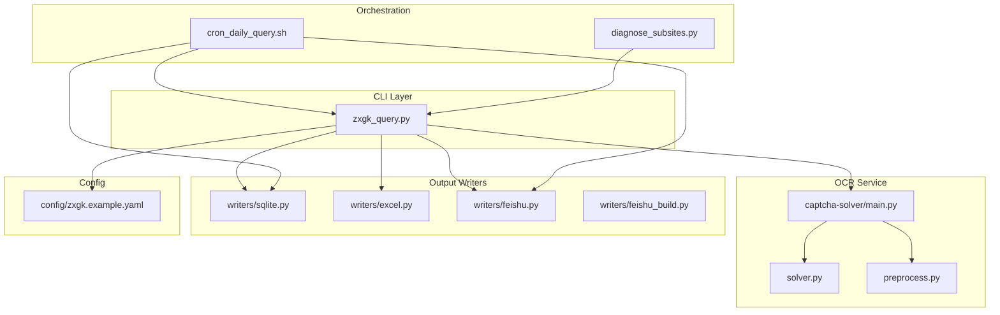
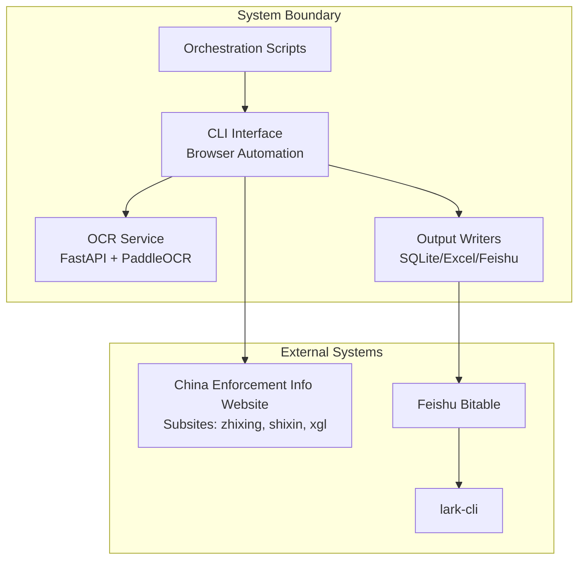
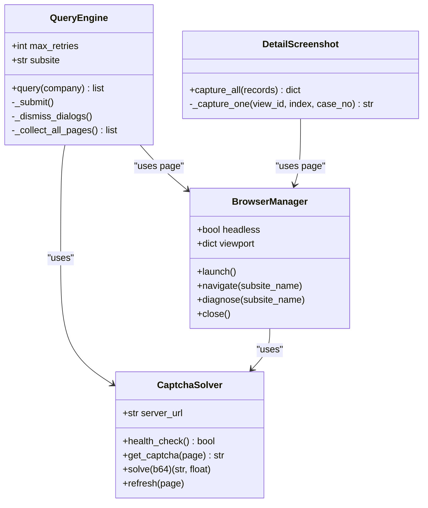
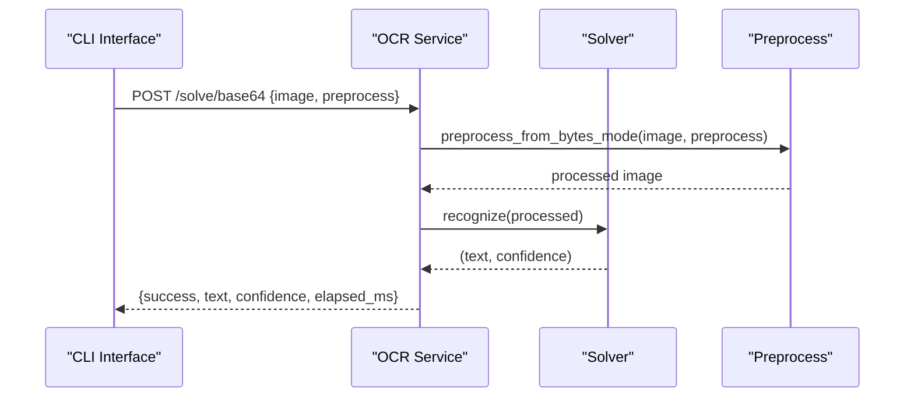
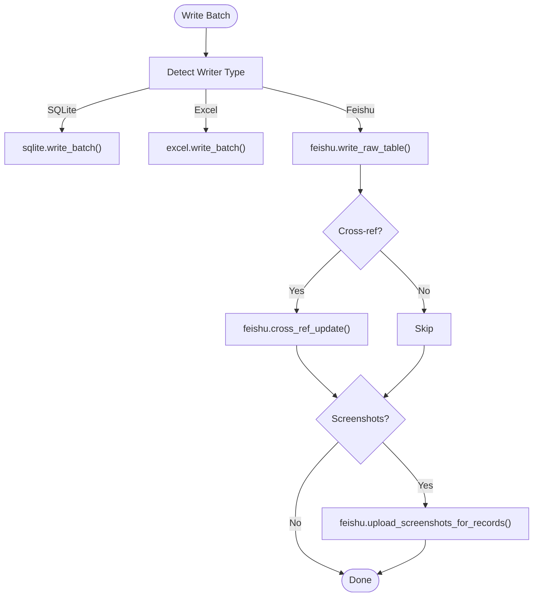
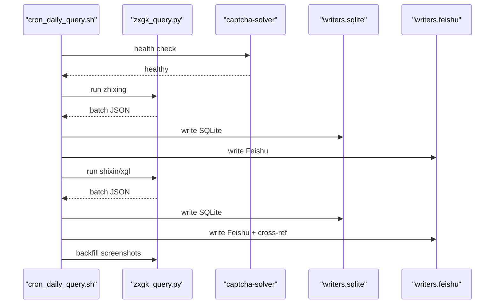
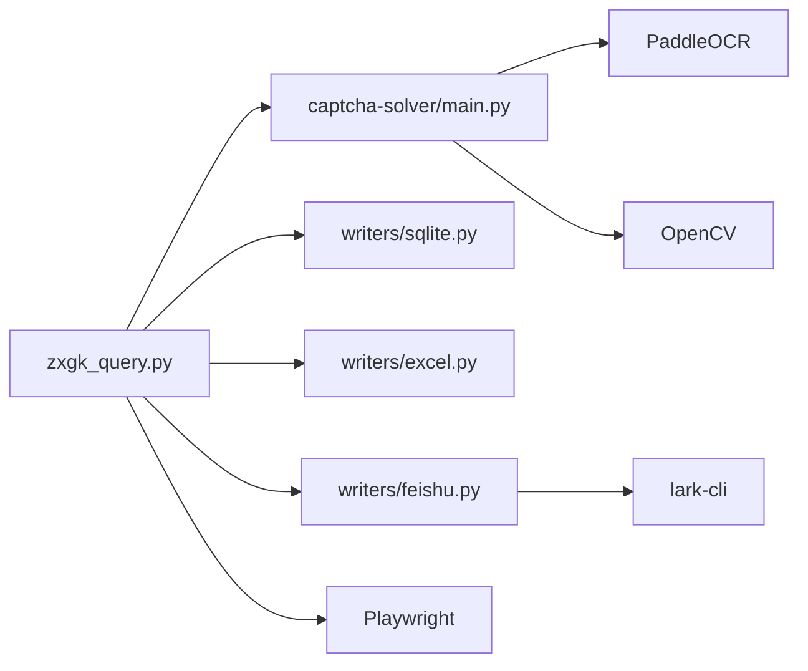

# Architecture Overview

<cite>
**Referenced Files in This Document**
- [zxgk_query.py](file://zxgk_query.py)
- [main.py](file://captcha-solver/main.py)
- [solver.py](file://captcha-solver/solver.py)
- [preprocess.py](file://captcha-solver/preprocess.py)
- [excel.py](file://writers/excel.py)
- [sqlite.py](file://writers/sqlite.py)
- [feishu.py](file://writers/feishu.py)
- [feishu_build.py](file://writers/feishu_build.py)
- [cron_daily_query.sh](file://cron_daily_query.sh)
- [diagnose_subsites.py](file://diagnose_subsites.py)
- [README.md](file://README.md)
- [zxgk.example.yaml](file://config/zxgk.example.yaml)
</cite>

## Table of Contents
1. [Introduction](#introduction)
2. [Project Structure](#project-structure)
3. [Core Components](#core-components)
4. [Architecture Overview](#architecture-overview)
5. [Detailed Component Analysis](#detailed-component-analysis)
6. [Dependency Analysis](#dependency-analysis)
7. [Performance Considerations](#performance-considerations)
8. [Troubleshooting Guide](#troubleshooting-guide)
9. [Conclusion](#conclusion)

## Introduction
This document presents the architecture overview of the Execution Information Query System, a modular pipeline designed to automate querying China's enforcement information websites across three subsites (zhixing, shixin, xgl). The system integrates a CLI interface for orchestration, an OCR service for CAPTCHA solving, and pluggable output writers for data persistence and reporting. It emphasizes a separation of concerns, robust error handling, and extensibility through configuration-driven abstractions.

## Project Structure
The system is organized into distinct modules:
- CLI orchestrator: [zxgk_query.py](file://zxgk_query.py)
- OCR service: [captcha-solver/main.py](file://captcha-solver/main.py) with solver and preprocessing logic
- Output writers: [writers/](file://writers/) package with SQLite, Excel, and Feishu integrations
- Orchestration scripts: [cron_daily_query.sh](file://cron_daily_query.sh), [diagnose_subsites.py](file://diagnose_subsites.py)
- Configuration: [config/zxgk.example.yaml](file://config/zxgk.example.yaml)
- Documentation: [README.md](file://README.md)

**Diagram sources**
- [zxgk_query.py](file://zxgk_query.py)
- [main.py](file://captcha-solver/main.py)
- [solver.py](file://captcha-solver/solver.py)
- [preprocess.py](file://captcha-solver/preprocess.py)
- [excel.py](file://writers/excel.py)
- [sqlite.py](file://writers/sqlite.py)
- [feishu.py](file://writers/feishu.py)
- [feishu_build.py](file://writers/feishu_build.py)
- [cron_daily_query.sh](file://cron_daily_query.sh)
- [diagnose_subsites.py](file://diagnose_subsites.py)
- [zxgk.example.yaml](file://config/zxgk.example.yaml)

**Section sources**
- [README.md](file://README.md)
- [zxgk.example.yaml](file://config/zxgk.example.yaml)

## Core Components
- CLI Interface (zxgk_query.py): Provides command-line entry points for single-company and batch queries, navigation to subsites, CAPTCHA solving, result collection, and screenshot capture. It encapsulates browser automation, OCR integration, and output writing coordination.
- OCR Service (captcha-solver): A FastAPI-based HTTP service exposing endpoints for CAPTCHA recognition, health checks, and pre-processing modes. It loads a PaddleOCR model and exposes synchronous and asynchronous processing paths.
- Output Writers (writers/): Pluggable modules for persisting results:
  - SQLite writer: stores structured results locally with optional screenshot storage as file paths or binary blobs.
  - Excel writer: exports tabular results to XLSX for reporting.
  - Feishu writer: writes to Feishu Bitable tables, performs cross-references, and uploads screenshots via lark-cli.
  - Feishu Build writer: automates table creation and DuplexLink setup for new users.

**Section sources**
- [zxgk_query.py](file://zxgk_query.py)
- [main.py](file://captcha-solver/main.py)
- [solver.py](file://captcha-solver/solver.py)
- [preprocess.py](file://captcha-solver/preprocess.py)
- [excel.py](file://writers/excel.py)
- [sqlite.py](file://writers/sqlite.py)
- [feishu.py](file://writers/feishu.py)
- [feishu_build.py](file://writers/feishu_build.py)

## Architecture Overview
The system follows a modular, layered architecture:
- Orchestrator Layer: CLI and orchestration scripts coordinate end-to-end workflows.
- Automation Layer: Browser automation (Playwright) navigates to subsites, handles WAF protections, and submits queries.
- Intelligence Layer: OCR service recognizes CAPTCHAs and returns text with confidence metrics.
- Processing Layer: Query engine extracts tabular data, de-duplicates by viewId, and manages pagination.
- Persistence Layer: Writers serialize results to multiple destinations (SQLite, Excel, Feishu).
- Diagnostics Layer: Tools probe DOM structures and validate subsite configurations.

**Diagram sources**
- [zxgk_query.py](file://zxgk_query.py)
- [main.py](file://captcha-solver/main.py)
- [excel.py](file://writers/excel.py)
- [sqlite.py](file://writers/sqlite.py)
- [feishu.py](file://writers/feishu.py)
- [cron_daily_query.sh](file://cron_daily_query.sh)

## Detailed Component Analysis

### CLI Interface (zxgk_query.py)
Key responsibilities:
- Environment setup and cleanup
- Browser management with stealth and viewport configuration
- Subsite navigation abstraction via CSS selectors
- WAF detection and retry logic
- Query execution with CAPTCHA solving and result extraction
- Pagination handling and de-duplication by viewId
- Screenshot capture and OpenCV-based cropping
- Batch processing and output coordination

**Diagram sources**
- [zxgk_query.py](file://zxgk_query.py)

**Section sources**
- [zxgk_query.py](file://zxgk_query.py)

### OCR Service (captcha-solver)
Key responsibilities:
- FastAPI endpoints for health checks and CAPTCHA recognition
- Preprocessing modes: full pipeline, grayscale-only, or raw
- PaddleOCR integration with configurable thresholds and batch sizes
- Async execution for CPU-bound OCR tasks

**Diagram sources**
- [main.py](file://captcha-solver/main.py)
- [solver.py](file://captcha-solver/solver.py)
- [preprocess.py](file://captcha-solver/preprocess.py)

**Section sources**
- [main.py](file://captcha-solver/main.py)
- [solver.py](file://captcha-solver/solver.py)
- [preprocess.py](file://captcha-solver/preprocess.py)

### Output Writers (writers/)
Key responsibilities:
- SQLite writer: creates subsite-specific tables, inserts records, and optionally stores screenshots as file paths or binary blobs.
- Excel writer: generates XLSX reports with standardized headers.
- Feishu writer: writes to raw tables, performs cross-reference updates, and uploads screenshots via lark-cli.
- Feishu Build writer: automates table creation, DuplexLink setup, and initial data population.

**Diagram sources**
- [sqlite.py](file://writers/sqlite.py)
- [excel.py](file://writers/excel.py)
- [feishu.py](file://writers/feishu.py)

**Section sources**
- [sqlite.py](file://writers/sqlite.py)
- [excel.py](file://writers/excel.py)
- [feishu.py](file://writers/feishu.py)
- [feishu_build.py](file://writers/feishu_build.py)

### Orchestration and Diagnostics
- Daily orchestration script coordinates OCR service startup, runs subsite queries, writes outputs, and performs screenshot backfill.
- Diagnostic tool probes DOM structures, validates CSS selectors, and verifies OCR readiness.

**Diagram sources**
- [cron_daily_query.sh](file://cron_daily_query.sh)
- [zxgk_query.py](file://zxgk_query.py)
- [sqlite.py](file://writers/sqlite.py)
- [feishu.py](file://writers/feishu.py)

**Section sources**
- [cron_daily_query.sh](file://cron_daily_query.sh)
- [diagnose_subsites.py](file://diagnose_subsites.py)

## Dependency Analysis
- Internal dependencies:
  - CLI depends on OCR service for CAPTCHA recognition and on writers for output persistence.
  - Writers depend on Feishu APIs via lark-cli and on local filesystem for screenshots.
- External dependencies:
  - OCR service relies on PaddleOCR and OpenCV for preprocessing and recognition.
  - CLI uses Playwright for browser automation and stealth to bypass WAF.
  - Orchestration scripts rely on Docker (optional) and lark-cli for authentication.

**Diagram sources**
- [zxgk_query.py](file://zxgk_query.py)
- [main.py](file://captcha-solver/main.py)
- [excel.py](file://writers/excel.py)
- [sqlite.py](file://writers/sqlite.py)
- [feishu.py](file://writers/feishu.py)

**Section sources**
- [README.md](file://README.md)
- [main.py](file://captcha-solver/main.py)
- [solver.py](file://captcha-solver/solver.py)
- [preprocess.py](file://captcha-solver/preprocess.py)
- [zxgk_query.py](file://zxgk_query.py)

## Performance Considerations
- Concurrency and throughput:
  - Parallelize subsite queries across independent sessions to reduce wall-clock time.
  - Limit concurrent OCR requests to match model capacity and avoid memory pressure.
- Resource management:
  - Tune browser viewport and headless mode for stability vs. speed trade-offs.
  - Control screenshot intervals and batch sizes to balance I/O and network throughput.
- Model efficiency:
  - Prefer grayscale preprocessing for small, fine-text CAPTCHAs to improve OCR accuracy.
  - Adjust OCR thresholds and batch sizes to optimize latency and accuracy.
- Storage optimization:
  - Store screenshots as binary blobs only when required; otherwise use file paths to minimize database size.
  - Use incremental writes and deduplication to avoid redundant storage operations.

[No sources needed since this section provides general guidance]

## Troubleshooting Guide
Common issues and resolutions:
- WAF blocking:
  - The CLI detects absence of CAPTCHA elements and retries after cooldown. Verify proxy settings and stealth configuration.
- OCR service unavailability:
  - Confirm health endpoint availability and model loading logs. Restart OCR service if unhealthy.
- Subsite navigation failures:
  - Validate CSS selectors in configuration and re-run diagnostics to confirm DOM structure.
- Feishu authentication:
  - Ensure lark-cli is authenticated and FEISHU_APP_TOKEN is set. Check table IDs and field mappings.
- Memory and resource limits:
  - Monitor OCR model and browser memory usage; scale resources accordingly.

**Section sources**
- [zxgk_query.py](file://zxgk_query.py)
- [main.py](file://captcha-solver/main.py)
- [diagnose_subsites.py](file://diagnose_subsites.py)
- [README.md](file://README.md)

## Conclusion
The Execution Information Query System demonstrates a clean, modular architecture that separates concerns across automation, intelligence, processing, and persistence layers. Its configuration-driven design enables abstraction over multiple subsites, while robust error handling and diagnostics support reliable operation at scale. The pluggable writer ecosystem ensures flexible output strategies, and orchestration scripts streamline daily workflows with resilience against transient failures.