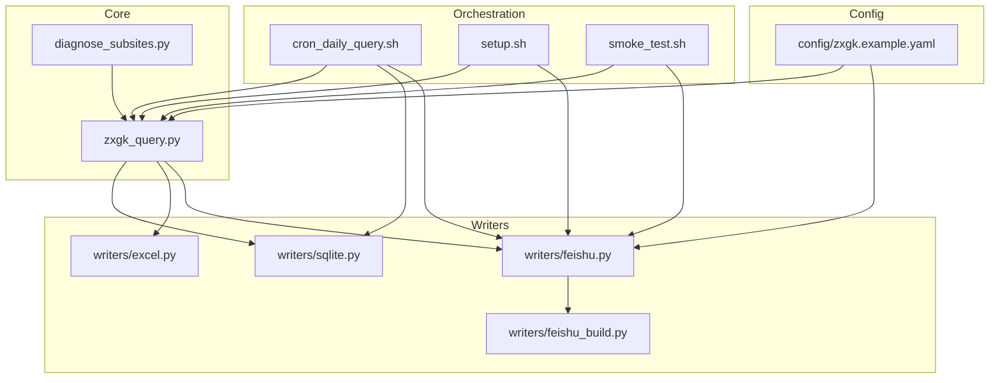
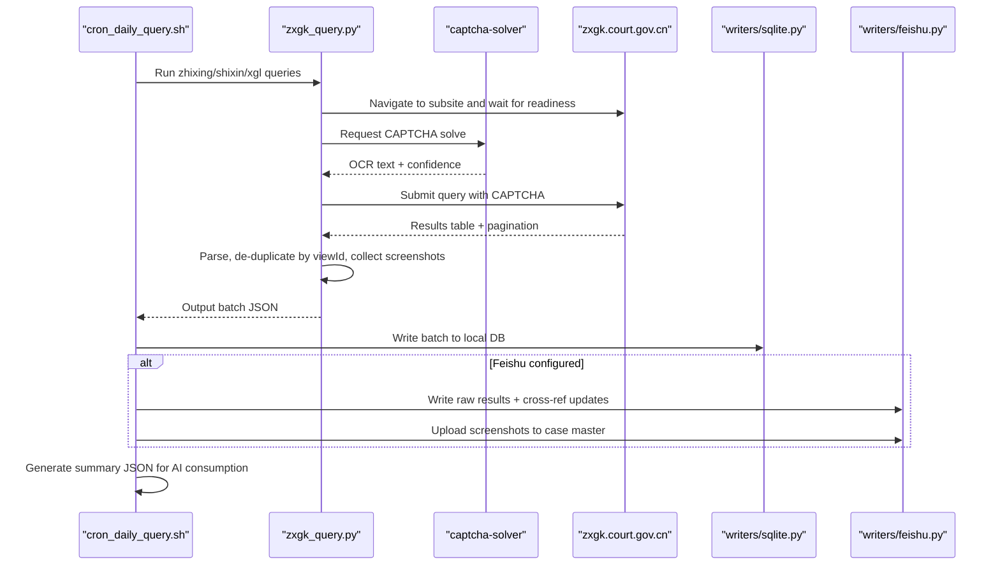
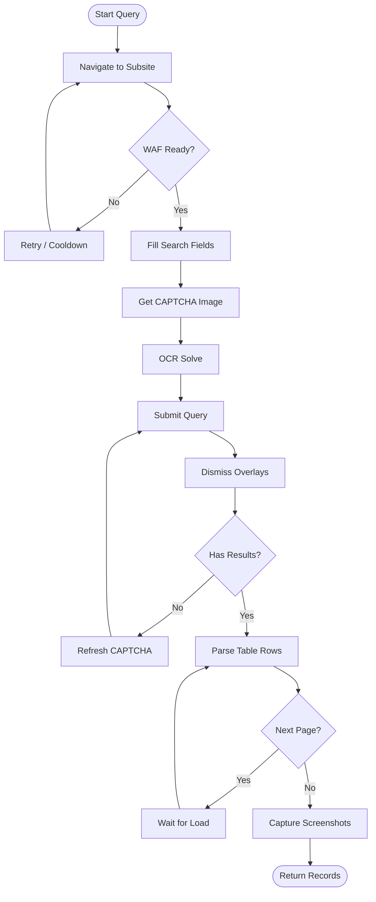
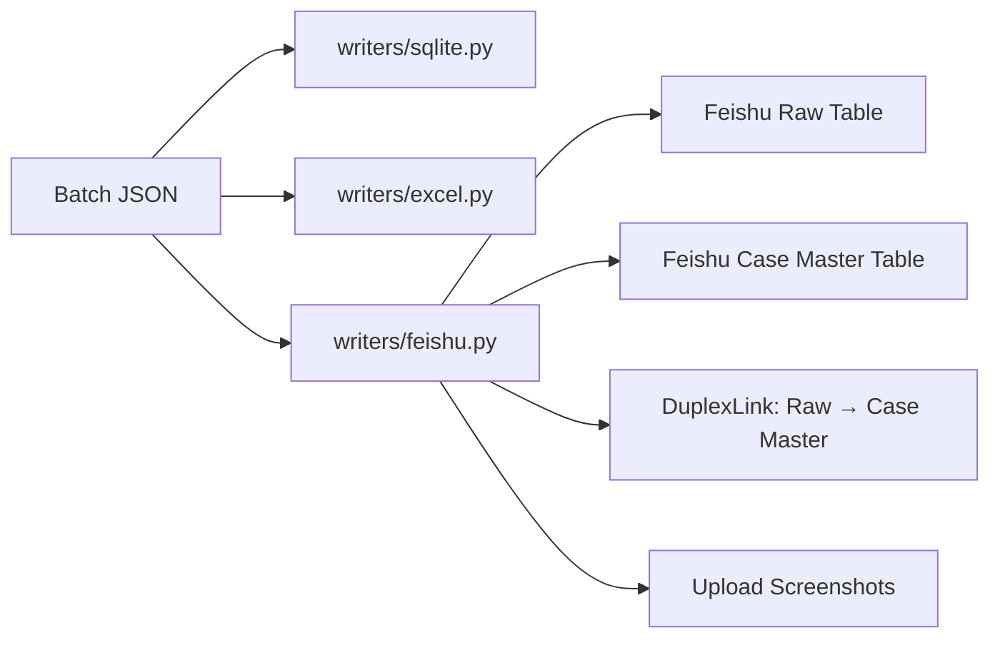
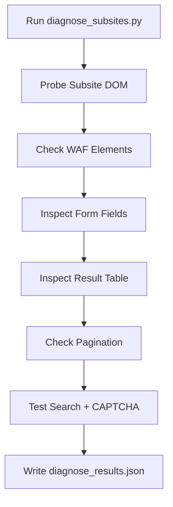
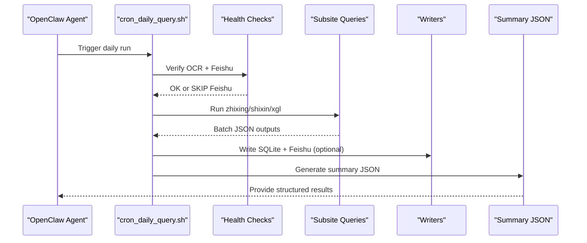
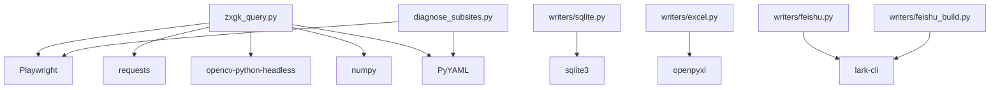

# Introduction and Purpose

<cite>
**Referenced Files in This Document**
- [README.md](file://README.md)
- [SKILL.md](file://SKILL.md)
- [zxgk_query.py](file://zxgk_query.py)
- [diagnose_subsites.py](file://diagnose_subsites.py)
- [config/zxgk.example.yaml](file://config/zxgk.example.yaml)
- [writers/sqlite.py](file://writers/sqlite.py)
- [writers/excel.py](file://writers/excel.py)
- [writers/feishu.py](file://writers/feishu.py)
- [writers/feishu_build.py](file://writers/feishu_build.py)
- [setup.sh](file://setup.sh)
- [cron_daily_query.sh](file://cron_daily_query.sh)
- [smoke_test.sh](file://smoke_test.sh)
</cite>

## Table of Contents
1. [Introduction](#introduction)
2. [Project Structure](#project-structure)
3. [Core Components](#core-components)
4. [Architecture Overview](#architecture-overview)
5. [Detailed Component Analysis](#detailed-component-analysis)
6. [Dependency Analysis](#dependency-analysis)
7. [Performance Considerations](#performance-considerations)
8. [Troubleshooting Guide](#troubleshooting-guide)
9. [Conclusion](#conclusion)

## Introduction
This project automates querying China’s Execution Information Public Disclosure Network (zxgk.court.gov.cn) across three subsites:
- zhixing (executed persons)
- shixin (dishonest executed persons)
- xgl (restricted consumption personnel)

Its mission is to provide automated, reliable, and efficient access to execution information for businesses, legal professionals, and researchers. The system replaces manual, repetitive, and error-prone data collection with a robust, repeatable pipeline that runs daily, captures structured results, and integrates with storage systems such as SQLite, Excel, and optionally, Feishu multi-dimensional tables.

Why this tool was developed:
- Repetitive manual work: querying the public network for multiple companies across three subsites is time-consuming and inconsistent.
- Need for centralized data: organizations require a unified dataset to track enforcement actions, assess risk, and support compliance workflows.
- Scalability: the solution scales across hundreds of companies and multiple subsites with minimal human intervention.
- Ethical and legal considerations: the system is designed to minimize impact on the target site, respect rate limits, and operate within acceptable bounds of web scraping.

Target audience:
- Businesses: monitoring counterparties’ enforcement risks, credit checks, and due diligence.
- Law firms and legal professionals: tracking enforcement actions, preparing litigation strategies, and managing client matters.
- Compliance teams: maintaining watchlists, regulatory reporting, and internal controls.
- Researchers: aggregating enforcement data for academic or policy studies.

Value proposition:
- Automation reduces manual effort and human error.
- Structured outputs enable downstream analytics and reporting.
- Optional integration with Feishu enables collaborative workflows and cross-referencing with case master tables.
- Local SQLite backup ensures data persistence even when cloud integrations are unavailable.

Ethical and legal considerations:
- The system respects WAF signals and cooldowns, and includes retry logic to avoid excessive load.
- It validates environment readiness and service health before proceeding.
- It avoids scraping beyond the intended public disclosure pages and does not attempt to bypass authentication or access restricted areas.
- Users are encouraged to configure rate limits and intervals according to their operational needs and to monitor for site changes that may affect stability.

## Project Structure
The repository organizes functionality into cohesive modules:
- Core automation engine: zxgk_query.py orchestrates browser automation, OCR-based CAPTCHA solving, query execution, and result extraction.
- Writers: pluggable storage backends for SQLite, Excel, and Feishu multi-dimensional tables.
- Diagnostics: diagnose_subsites.py probes DOM structures and verifies page readiness.
- Orchestration: cron_daily_query.sh coordinates daily runs, health checks, and post-processing.
- Setup and validation: setup.sh installs dependencies and configures environment; smoke_test.sh validates configuration and runtime readiness.

**Diagram sources**
- [zxgk_query.py](file://zxgk_query.py)
- [diagnose_subsites.py](file://diagnose_subsites.py)
- [writers/sqlite.py](file://writers/sqlite.py)
- [writers/excel.py](file://writers/excel.py)
- [writers/feishu.py](file://writers/feishu.py)
- [writers/feishu_build.py](file://writers/feishu_build.py)
- [cron_daily_query.sh](file://cron_daily_query.sh)
- [setup.sh](file://setup.sh)
- [smoke_test.sh](file://smoke_test.sh)
- [config/zxgk.example.yaml](file://config/zxgk.example.yaml)

**Section sources**
- [README.md:1-122](file://README.md#L1-L122)
- [SKILL.md:1-273](file://SKILL.md#L1-L273)

## Core Components
- Execution Information Query Engine (zxgk_query.py): Implements browser automation, CAPTCHA recognition, query submission, result parsing, and screenshot capture. It encapsulates:
  - Browser lifecycle management and stealth configuration
  - Subsite navigation and WAF detection
  - Query execution with retries and dialog dismissal
  - Pagination handling and duplicate elimination by viewId
  - Screenshot extraction and cropping
  - Phase B backfilling for missing screenshots

- Writers:
  - SQLite writer: writes batch results to a local database with optional BLOB storage for screenshots.
  - Excel writer: exports tabular results to XLSX for reporting.
  - Feishu writer: writes raw results to Feishu tables, performs cross-reference updates, and uploads screenshots to case master tables.
  - Feishu builder: creates table structures and links automatically for new users.

- Diagnostics (diagnose_subsites.py): Probes DOM structures, checks WAF elements, pagination, and search function availability across all three subsites.

- Orchestration scripts:
  - cron_daily_query.sh: runs the full pipeline, manages locks and sentinels, and triggers Phase B backfill.
  - setup.sh: installs dependencies, configures environment, and validates Feishu authentication.
  - smoke_test.sh: validates syntax, configuration, environment variables, and recent batch outputs.

**Section sources**
- [zxgk_query.py:1-800](file://zxgk_query.py#L1-L800)
- [writers/sqlite.py:1-121](file://writers/sqlite.py#L1-L121)
- [writers/excel.py:1-97](file://writers/excel.py#L1-L97)
- [writers/feishu.py:1-596](file://writers/feishu.py#L1-L596)
- [writers/feishu_build.py:1-242](file://writers/feishu_build.py#L1-L242)
- [diagnose_subsites.py:1-429](file://diagnose_subsites.py#L1-L429)
- [cron_daily_query.sh:1-246](file://cron_daily_query.sh#L1-L246)
- [setup.sh:1-150](file://setup.sh#L1-L150)
- [smoke_test.sh:1-155](file://smoke_test.sh#L1-L155)

## Architecture Overview
The system follows a modular, layered architecture:
- Data ingestion: Playwright-driven browser automation queries the public network and extracts structured results.
- OCR integration: A local or external OCR service resolves CAPTCHAs.
- Storage: Results are persisted locally (SQLite) and optionally synchronized to Feishu multi-dimensional tables.
- Post-processing: Screenshots are captured and later backfilled to case master tables when missing.
- Orchestration: A daily cron job coordinates all steps, handles failures gracefully, and cleans up old artifacts.

**Diagram sources**
- [cron_daily_query.sh:112-161](file://cron_daily_query.sh#L112-L161)
- [zxgk_query.py:409-618](file://zxgk_query.py#L409-L618)
- [writers/sqlite.py:37-100](file://writers/sqlite.py#L37-L100)
- [writers/feishu.py:154-201](file://writers/feishu.py#L154-L201)

## Detailed Component Analysis

### Execution Information Query Engine
The engine encapsulates the core logic for querying, parsing, and capturing results:
- Browser management: Launches a stealthed Chromium instance, navigates to the main site, clicks the desired subsite, and waits for readiness.
- WAF detection: Validates presence of expected elements and handles封禁 scenarios with retries and cooldowns.
- Query execution: Fills search fields, solves CAPTCHAs, submits forms, dismisses overlays, and reads result tables.
- Pagination and deduplication: Iterates pages, collects records, and removes duplicates by viewId.
- Screenshot capture: Extracts detail popups and crops to regions of interest.

**Diagram sources**
- [zxgk_query.py:251-304](file://zxgk_query.py#L251-L304)
- [zxgk_query.py:409-618](file://zxgk_query.py#L409-L618)

**Section sources**
- [zxgk_query.py:175-304](file://zxgk_query.py#L175-L304)
- [zxgk_query.py:409-618](file://zxgk_query.py#L409-L618)

### Writers and Storage Backends
- SQLite writer: Creates a dedicated table per subsite, inserts records with optional screenshot paths or BLOBs, and migrates older schemas.
- Excel writer: Exports a standardized sheet layout for reporting.
- Feishu writer: Writes raw results to subsite-specific tables, deduplicates by caseNo + viewId, updates case master fields (e.g., 是否失信, 是否限高), and uploads screenshots to the case master table.
- Feishu builder: Automatically constructs raw and case master tables, establishes DuplexLink relations, and optionally uploads screenshots.

**Diagram sources**
- [writers/sqlite.py:37-100](file://writers/sqlite.py#L37-L100)
- [writers/excel.py:56-73](file://writers/excel.py#L56-L73)
- [writers/feishu.py:154-201](file://writers/feishu.py#L154-L201)
- [writers/feishu.py:309-340](file://writers/feishu.py#L309-L340)
- [writers/feishu.py:369-478](file://writers/feishu.py#L369-L478)
- [writers/feishu_build.py:128-204](file://writers/feishu_build.py#L128-L204)

**Section sources**
- [writers/sqlite.py:19-100](file://writers/sqlite.py#L19-L100)
- [writers/excel.py:29-73](file://writers/excel.py#L29-L73)
- [writers/feishu.py:154-278](file://writers/feishu.py#L154-L278)
- [writers/feishu_build.py:109-204](file://writers/feishu_build.py#L109-L204)

### Diagnostics and Configuration
- Diagnostics: Probes DOM readiness, checks WAF elements, pagination, and search function availability across zhixing, shixin, and xgl.
- Configuration: Centralized YAML defines subsite selectors, OCR server endpoint, browser settings, rate limits, and Feishu field mappings.

**Diagram sources**
- [diagnose_subsites.py:103-330](file://diagnose_subsites.py#L103-L330)

**Section sources**
- [diagnose_subsites.py:25-46](file://diagnose_subsites.py#L25-L46)
- [diagnose_subsites.py:103-330](file://diagnose_subsites.py#L103-L330)
- [config/zxgk.example.yaml:32-44](file://config/zxgk.example.yaml#L32-L44)

### Orchestration and Lifecycle
- Daily orchestration: The cron script ensures mutual exclusion, health-checks OCR and Feishu, runs queries per subsite, writes outputs, and triggers Phase B backfill.
- Setup and validation: The setup script installs dependencies, configures environment, and validates Feishu authentication; smoke tests verify configuration and recent outputs.

**Diagram sources**
- [cron_daily_query.sh:45-96](file://cron_daily_query.sh#L45-L96)
- [cron_daily_query.sh:112-161](file://cron_daily_query.sh#L112-L161)
- [cron_daily_query.sh:169-210](file://cron_daily_query.sh#L169-L210)

**Section sources**
- [cron_daily_query.sh:1-246](file://cron_daily_query.sh#L1-L246)
- [setup.sh:1-150](file://setup.sh#L1-L150)
- [smoke_test.sh:1-155](file://smoke_test.sh#L1-L155)

## Dependency Analysis
Key dependencies and relationships:
- zxgk_query.py depends on:
  - Playwright for browser automation and stealth
  - Requests for OCR service communication
  - OpenCV and NumPy for screenshot cropping
  - YAML for configuration loading
- Writers depend on:
  - SQLite for local persistence
  - openpyxl for Excel export
  - lark-cli for Feishu API interactions
- Diagnostics rely on Playwright and the same configuration as the main engine.

**Diagram sources**
- [zxgk_query.py:36-43](file://zxgk_query.py#L36-L43)
- [writers/sqlite.py:10-17](file://writers/sqlite.py#L10-L17)
- [writers/excel.py:17-22](file://writers/excel.py#L17-L22)
- [writers/feishu.py:23-26](file://writers/feishu.py#L23-L26)
- [writers/feishu_build.py:20-26](file://writers/feishu_build.py#L20-L26)
- [diagnose_subsites.py:16-19](file://diagnose_subsites.py#L16-L19)

**Section sources**
- [zxgk_query.py:36-43](file://zxgk_query.py#L36-L43)
- [writers/sqlite.py:10-17](file://writers/sqlite.py#L10-L17)
- [writers/excel.py:17-22](file://writers/excel.py#L17-L22)
- [writers/feishu.py:23-26](file://writers/feishu.py#L23-L26)
- [writers/feishu_build.py:20-26](file://writers/feishu_build.py#L20-L26)
- [diagnose_subsites.py:16-19](file://diagnose_subsites.py#L16-L19)

## Performance Considerations
- Rate limiting: The configuration includes cooldowns and intervals to reduce pressure on the target site and improve reliability.
- Headless mode: Chromium runs headless by default to conserve resources.
- Efficient parsing: Uses DOM queries and pagination detection to minimize unnecessary waits.
- Optional screenshot storage: Choose between file paths and BLOBs depending on storage and performance needs.
- Cleanup: Old artifacts are pruned automatically to manage disk usage.

[No sources needed since this section provides general guidance]

## Troubleshooting Guide
Common issues and resolutions:
- OCR service unavailable: Ensure the captcha-solver is healthy and reachable at the configured endpoint; the cron script attempts Docker and fallback to bare-metal startup.
- Feishu authentication missing: Run lark-cli auth and set FEISHU_APP_TOKEN; otherwise, the system falls back to local storage.
- WAF封禁: The engine retries with cooldowns; adjust intervals and consider proxy settings if applicable.
- Missing batch JSON: Validate configuration, environment variables, and recent outputs; use smoke_test.sh to verify syntax and structure.
- Phase B backfill: If screenshots are missing in the case master table, run the backfiller to re-query and upload images.

**Section sources**
- [cron_daily_query.sh:45-96](file://cron_daily_query.sh#L45-L96)
- [cron_daily_query.sh:215-228](file://cron_daily_query.sh#L215-L228)
- [smoke_test.sh:106-143](file://smoke_test.sh#L106-L143)
- [writers/feishu.py:369-478](file://writers/feishu.py#L369-L478)

## Conclusion
This Execution Information Query System automates the collection of enforcement data across three subsites of China’s public disclosure network. By combining browser automation, OCR-based CAPTCHA solving, structured storage, and optional Feishu integration, it delivers a reliable, scalable solution for businesses, legal professionals, and researchers. Its design emphasizes ethical scraping practices, robust error handling, and operational simplicity, enabling consistent daily insights with minimal manual effort.

[No sources needed since this section summarizes without analyzing specific files]