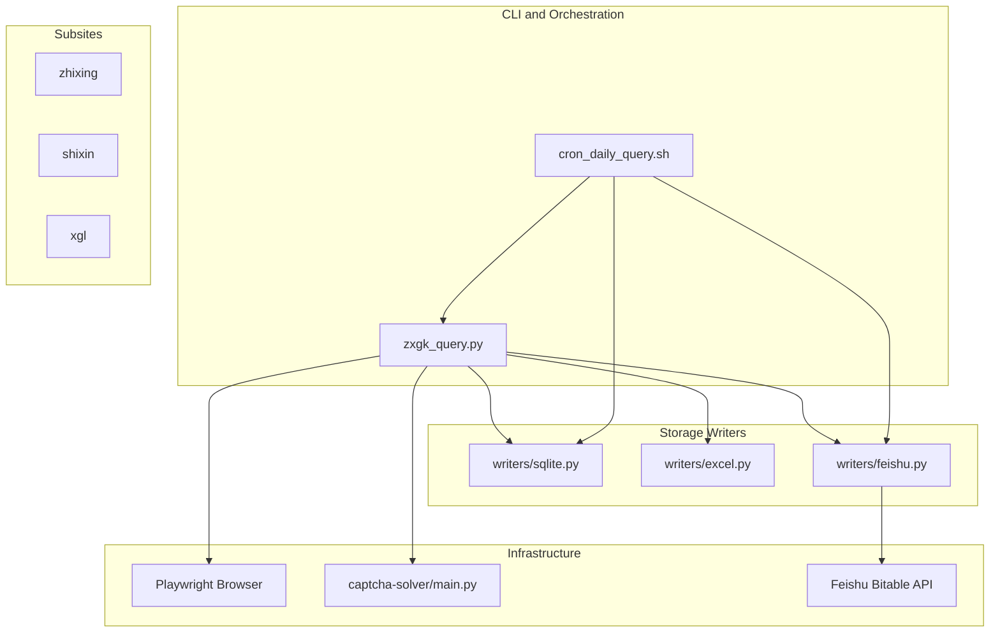
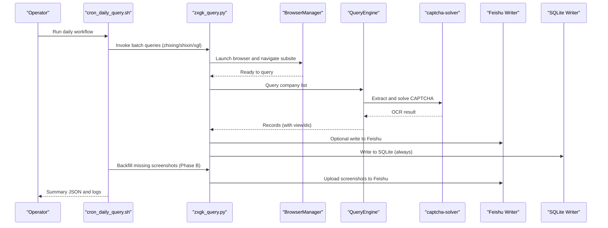
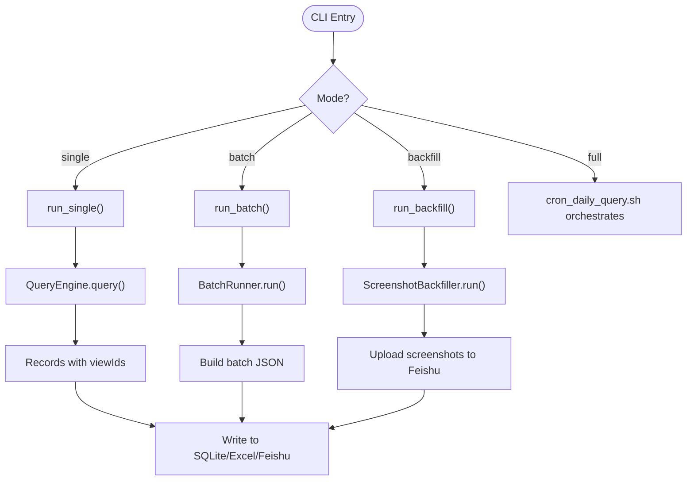
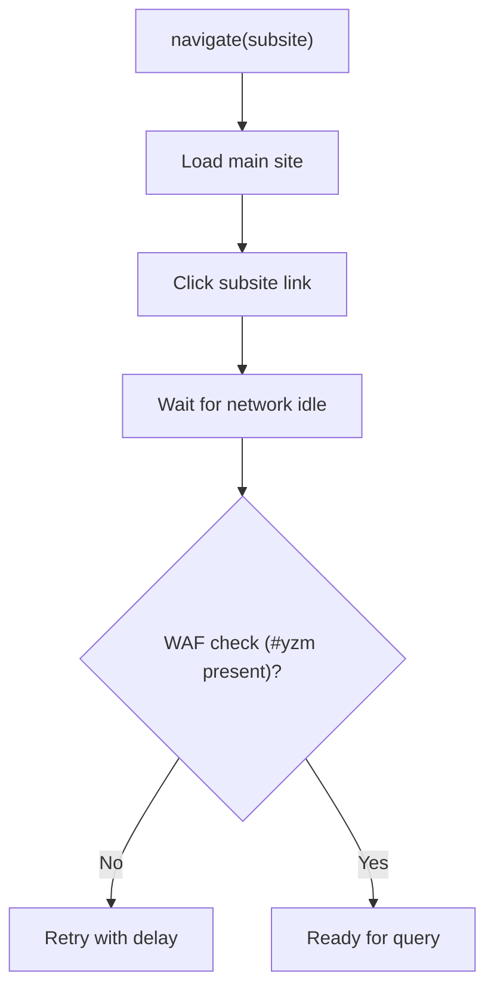
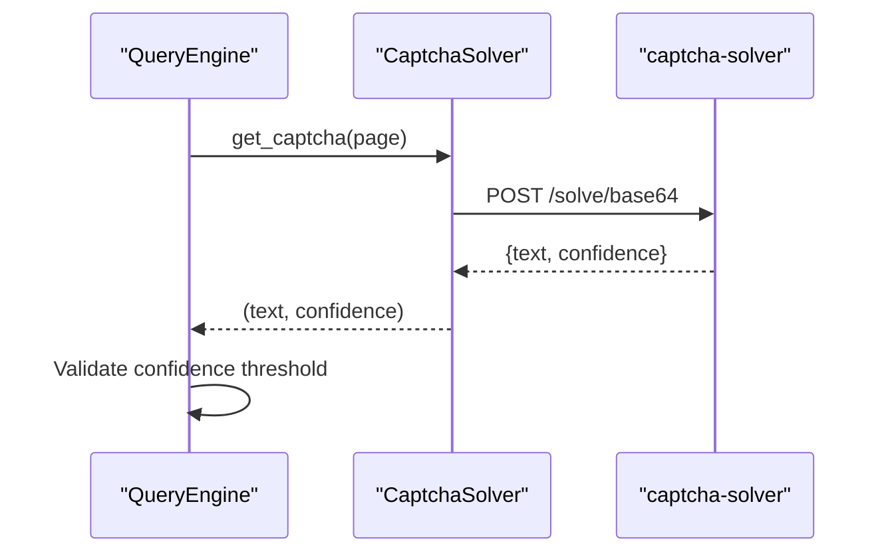
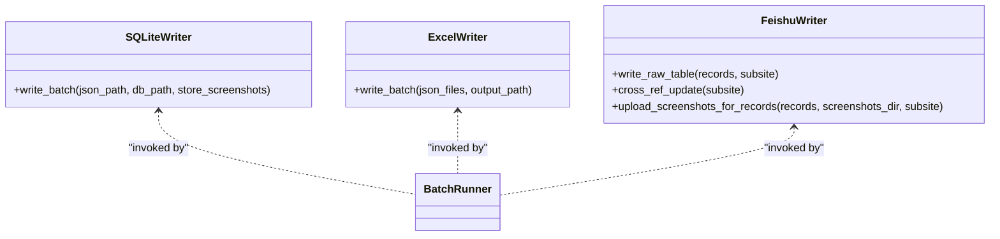
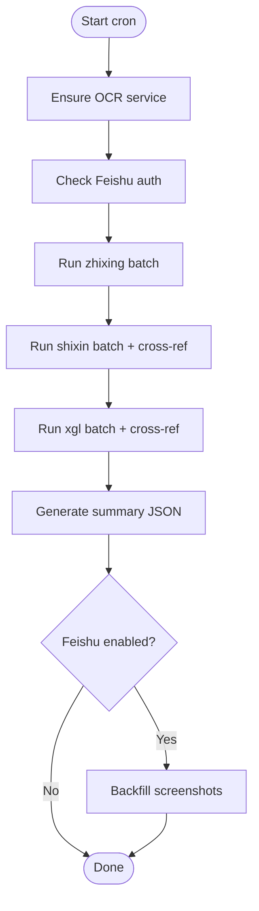
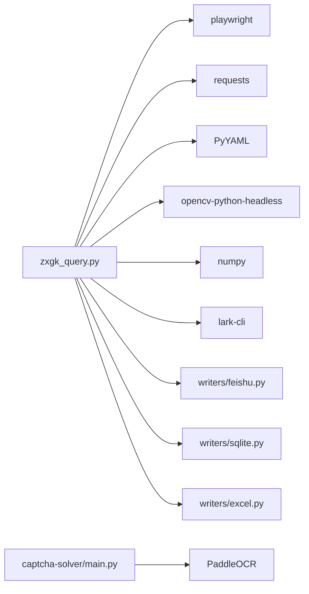

# Project Overview

<cite>
**Referenced Files in This Document**
- [README.md](file://README.md)
- [SKILL.md](file://SKILL.md)
- [zxgk_query.py](file://zxgk_query.py)
- [cron_daily_query.sh](file://cron_daily_query.sh)
- [diagnose_subsites.py](file://diagnose_subsites.py)
- [setup.sh](file://setup.sh)
- [smoke_test.sh](file://smoke_test.sh)
- [config/zxgk.example.yaml](file://config/zxgk.example.yaml)
- [writers/__init__.py](file://writers/__init__.py)
- [writers/sqlite.py](file://writers/sqlite.py)
- [writers/excel.py](file://writers/excel.py)
- [writers/feishu.py](file://writers/feishu.py)
- [captcha-solver/main.py](file://captcha-solver/main.py)
</cite>

## Table of Contents
1. [Introduction](#introduction)
2. [Project Structure](#project-structure)
3. [Core Components](#core-components)
4. [Architecture Overview](#architecture-overview)
5. [Detailed Component Analysis](#detailed-component-analysis)
6. [Dependency Analysis](#dependency-analysis)
7. [Performance Considerations](#performance-considerations)
8. [Troubleshooting Guide](#troubleshooting-guide)
9. [Conclusion](#conclusion)
10. [Appendices](#appendices)

## Introduction
The Execution Information Query System automates daily retrieval of enforcement information from China’s Execution Information Public Disclosure Network. It targets three subsites:
- zhixing (Executed Persons)
- shixin (Dishonest Executed Persons)
- xgl (Consumption Restriction Persons)

The system is implemented as a CLI tool and a daily orchestration script that performs multi-subsite batch queries, writes results to storage, optionally synchronizes with Feishu, and backfills missing screenshots. It integrates browser automation, OCR-based CAPTCHA solving, and pluggable storage writers.

Key goals:
- Automate repetitive daily tasks
- Provide reliable, repeatable data extraction across subsites
- Offer flexible output formats (SQLite, Excel, Feishu)
- Support robust diagnostics and recovery

## Project Structure
High-level layout:
- CLI entrypoint and core logic: [zxgk_query.py](file://zxgk_query.py)
- Daily orchestration: [cron_daily_query.sh](file://cron_daily_query.sh)
- Environment setup and dependencies: [setup.sh](file://setup.sh)
- Smoke tests and diagnostics: [smoke_test.sh](file://smoke_test.sh), [diagnose_subsites.py](file://diagnose_subsites.py)
- Writers (storage backends): [writers/](file://writers/)
- Configuration: [config/zxgk.example.yaml](file://config/zxgk.example.yaml)
- OCR service: [captcha-solver/main.py](file://captcha-solver/main.py)

**Diagram sources**
- [zxgk_query.py:1514-1612](file://zxgk_query.py#L1514-L1612)
- [cron_daily_query.sh:112-161](file://cron_daily_query.sh#L112-L161)
- [writers/sqlite.py:1-121](file://writers/sqlite.py#L1-L121)
- [writers/excel.py:1-97](file://writers/excel.py#L1-L97)
- [writers/feishu.py:1-596](file://writers/feishu.py#L1-L596)
- [captcha-solver/main.py:1-215](file://captcha-solver/main.py#L1-L215)

**Section sources**
- [README.md:97-122](file://README.md#L97-L122)
- [SKILL.md:225-240](file://SKILL.md#L225-L240)

## Core Components
- CLI and orchestration
  - Single and batch query modes, diagnostics, and backfill support
  - See [zxgk_query.py:1514-1612](file://zxgk_query.py#L1514-L1612) for CLI entrypoints and modes
- Browser automation
  - Stealth browser management, navigation, WAF detection, and result parsing
  - See [zxgk_query.py:175-324](file://zxgk_query.py#L175-L324)
- OCR-based CAPTCHA solving
  - Health checks, image extraction, and OCR inference via local or external service
  - See [zxgk_query.py:328-392](file://zxgk_query.py#L328-L392), [captcha-solver/main.py:107-215](file://captcha-solver/main.py#L107-L215)
- Query engine
  - Form filling, submission, pagination, and result collection per subsite
  - See [zxgk_query.py:396-618](file://zxgk_query.py#L396-L618)
- Screenshot capture
  - Popup extraction and cropping with OpenCV fallback
  - See [zxgk_query.py:682-726](file://zxgk_query.py#L682-L726)
- Storage writers
  - SQLite (local), Excel (reporting), Feishu (multi-value table)
  - See [writers/sqlite.py:19-100](file://writers/sqlite.py#L19-L100), [writers/excel.py:29-73](file://writers/excel.py#L29-L73), [writers/feishu.py:154-201](file://writers/feishu.py#L154-L201)
- Daily orchestration
  - Bootstraps OCR, runs three subsites, writes outputs, and backfills screenshots
  - See [cron_daily_query.sh:112-228](file://cron_daily_query.sh#L112-L228)

**Section sources**
- [zxgk_query.py:175-324](file://zxgk_query.py#L175-L324)
- [zxgk_query.py:328-392](file://zxgk_query.py#L328-L392)
- [zxgk_query.py:396-618](file://zxgk_query.py#L396-L618)
- [zxgk_query.py:682-726](file://zxgk_query.py#L682-L726)
- [writers/sqlite.py:19-100](file://writers/sqlite.py#L19-L100)
- [writers/excel.py:29-73](file://writers/excel.py#L29-L73)
- [writers/feishu.py:154-201](file://writers/feishu.py#L154-L201)
- [cron_daily_query.sh:112-228](file://cron_daily_query.sh#L112-L228)

## Architecture Overview
The system follows a layered architecture:
- Presentation: CLI and shell scripts
- Workflow: BatchRunner orchestrates queries and writes
- Automation: Playwright-driven browser sessions
- Intelligence: OCR service for CAPTCHA resolution
- Persistence: Pluggable writers (SQLite, Excel, Feishu)

**Diagram sources**
- [cron_daily_query.sh:112-228](file://cron_daily_query.sh#L112-L228)
- [zxgk_query.py:1065-1197](file://zxgk_query.py#L1065-L1197)
- [writers/feishu.py:556-596](file://writers/feishu.py#L556-L596)
- [writers/sqlite.py:37-100](file://writers/sqlite.py#L37-L100)

## Detailed Component Analysis

### CLI and Batch Execution
- Modes:
  - text-only: collect textual results only
  - screenshot: capture detail popups
  - full: end-to-end pipeline including post-processing and backfill
  - backfill: re-collect screenshots for missing records
- BatchRunner manages retries, intervals, progress checkpoints, and output consolidation
- Exit codes encode outcomes (success/no results/WAF blocked/captcha unavailable/config error)

**Diagram sources**
- [zxgk_query.py:1514-1612](file://zxgk_query.py#L1514-L1612)
- [zxgk_query.py:1065-1197](file://zxgk_query.py#L1065-L1197)
- [zxgk_query.py:1458-1469](file://zxgk_query.py#L1458-L1469)
- [writers/sqlite.py:37-100](file://writers/sqlite.py#L37-L100)
- [writers/excel.py:56-73](file://writers/excel.py#L56-L73)
- [writers/feishu.py:556-596](file://writers/feishu.py#L556-L596)

**Section sources**
- [zxgk_query.py:1514-1612](file://zxgk_query.py#L1514-L1612)
- [zxgk_query.py:1065-1197](file://zxgk_query.py#L1065-L1197)
- [zxgk_query.py:1458-1469](file://zxgk_query.py#L1458-L1469)

### Browser Automation and WAF Handling
- Stealth browser initialization and cleanup
- Navigation to subsites with CSS selectors
- WAF detection via presence of CAPTCHA element and body length
- Retry logic on WAF封禁 and overlay dismissal

**Diagram sources**
- [zxgk_query.py:251-304](file://zxgk_query.py#L251-L304)

**Section sources**
- [zxgk_query.py:251-304](file://zxgk_query.py#L251-L304)

### OCR and CAPTCHA Resolution
- CaptchaSolver extracts image from page, posts to OCR service, and validates confidence thresholds
- Health checks ensure service availability before proceeding
- Supports both file uploads and base64 payloads

**Diagram sources**
- [zxgk_query.py:339-392](file://zxgk_query.py#L339-L392)
- [captcha-solver/main.py:174-215](file://captcha-solver/main.py#L174-L215)

**Section sources**
- [zxgk_query.py:339-392](file://zxgk_query.py#L339-L392)
- [captcha-solver/main.py:174-215](file://captcha-solver/main.py#L174-L215)

### Storage Writers
- SQLite writer persists results locally with optional screenshot storage as file path or BLOB
- Excel writer exports tabular data for reporting
- Feishu writer writes raw records, supports deduplication, cross-reference updates, and screenshot uploads

**Diagram sources**
- [writers/sqlite.py:37-100](file://writers/sqlite.py#L37-L100)
- [writers/excel.py:56-73](file://writers/excel.py#L56-L73)
- [writers/feishu.py:154-201](file://writers/feishu.py#L154-L201)

**Section sources**
- [writers/sqlite.py:37-100](file://writers/sqlite.py#L37-L100)
- [writers/excel.py:56-73](file://writers/excel.py#L56-L73)
- [writers/feishu.py:154-201](file://writers/feishu.py#L154-L201)

### Daily Orchestration
- Ensures OCR service is running, authenticates with Feishu, and executes three subsites in order
- Writes results to SQLite and Feishu, generates summary JSON, and backfills screenshots

**Diagram sources**
- [cron_daily_query.sh:112-228](file://cron_daily_query.sh#L112-L228)

**Section sources**
- [cron_daily_query.sh:112-228](file://cron_daily_query.sh#L112-L228)

## Dependency Analysis
External dependencies and integrations:
- Playwright and stealth for browser automation
- Requests for HTTP calls
- YAML for configuration
- OpenCV and NumPy for image processing
- Feishu CLI for API interactions
- PaddleOCR for local OCR service

**Diagram sources**
- [setup.sh:39-40](file://setup.sh#L39-L40)
- [writers/feishu.py:23-26](file://writers/feishu.py#L23-L26)
- [writers/sqlite.py:10-16](file://writers/sqlite.py#L10-L16)
- [writers/excel.py:17-22](file://writers/excel.py#L17-L22)
- [captcha-solver/main.py](file://captcha-solver/main.py#L16)

**Section sources**
- [setup.sh:39-40](file://setup.sh#L39-L40)
- [writers/feishu.py:23-26](file://writers/feishu.py#L23-L26)
- [writers/sqlite.py:10-16](file://writers/sqlite.py#L10-L16)
- [writers/excel.py:17-22](file://writers/excel.py#L17-L22)
- [captcha-solver/main.py](file://captcha-solver/main.py#L16)

## Performance Considerations
- Browser reuse and session limits: BatchRunner caps screenshots per session and restarts browsers after consecutive failures
- Intervals: Configurable delays between companies and screenshots reduce WAF pressure
- Deduplication: Feishu writer avoids duplicate raw records and filters by recent creation time
- Local storage: SQLite ensures immediate persistence without network overhead

[No sources needed since this section provides general guidance]

## Troubleshooting Guide
Common scenarios and remedies:
- WAF封禁: The system detects封禁 and applies cooldowns; retry logic is built-in
- OCR service unavailable: Health checks gate execution; cron attempts to start OCR automatically
- Feishu auth issues: Re-authenticate via lark-cli; writer gracefully skips Feishu when unauthenticated
- No results: Exit code indicates no matches; verify company names and subsite selection
- Diagnostics: Use diagnose_subsites.py to probe DOM and pagination; use smoke_test.sh to validate environment

**Section sources**
- [zxgk_query.py:1157-1187](file://zxgk_query.py#L1157-L1187)
- [cron_daily_query.sh:48-96](file://cron_daily_query.sh#L48-L96)
- [writers/feishu.py:556-596](file://writers/feishu.py#L556-L596)
- [smoke_test.sh:106-114](file://smoke_test.sh#L106-L114)
- [diagnose_subsites.py:103-331](file://diagnose_subsites.py#L103-L331)

## Conclusion
The Execution Information Query System provides a robust, automated solution for extracting enforcement data across China’s three subsites. Its modular design separates concerns across CLI, orchestration, automation, OCR, and storage, enabling reliable daily workflows, extensible outputs, and strong diagnostics. Operators can choose from multiple storage backends and integrate with Feishu for collaborative data management.

[No sources needed since this section summarizes without analyzing specific files]

## Appendices

### Target Audience and Use Cases
- Legal and compliance teams needing daily monitoring of enforcement actions
- Risk analysts tracking corporate litigation and asset restrictions
- Operations staff automating data ingestion into internal systems

Practical examples:
- Batch queries for a predefined company list across zhixing, shixin, and xgl
- Daily full pipeline with Feishu synchronization and screenshot backfill
- Diagnostics and smoke testing to validate environment readiness

**Section sources**
- [README.md:63-77](file://README.md#L63-L77)
- [SKILL.md:85-120](file://SKILL.md#L85-L120)

### Configuration and Integration Patterns
- Configuration file defines subsite selectors, browser behavior, WAF parameters, and Feishu field mappings
- Writers are invoked independently for specialized workflows (e.g., SQLite-only, Excel export, Feishu sync)
- Environment variables supply optional tokens for cloud integrations

**Section sources**
- [config/zxgk.example.yaml:32-98](file://config/zxgk.example.yaml#L32-L98)
- [writers/__init__.py:1-10](file://writers/__init__.py#L1-L10)
- [writers/feishu.py:23-33](file://writers/feishu.py#L23-L33)