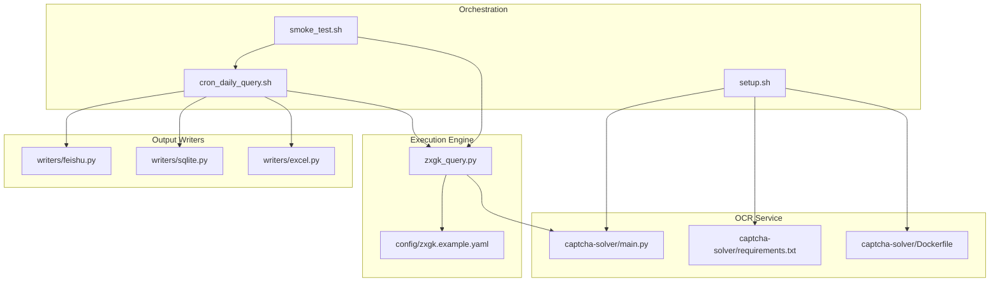
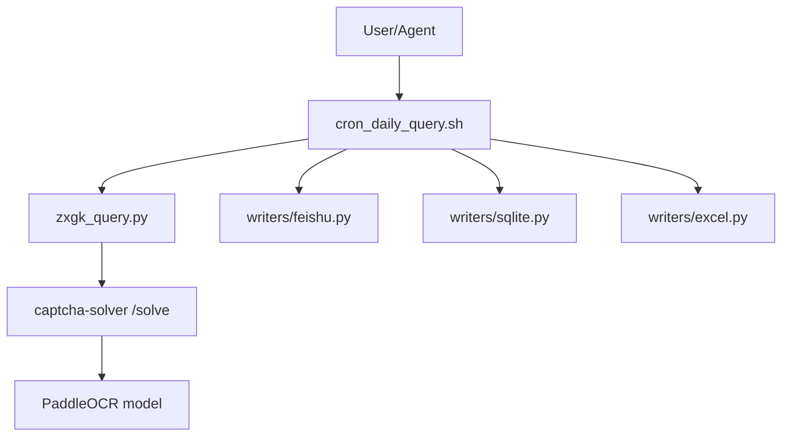
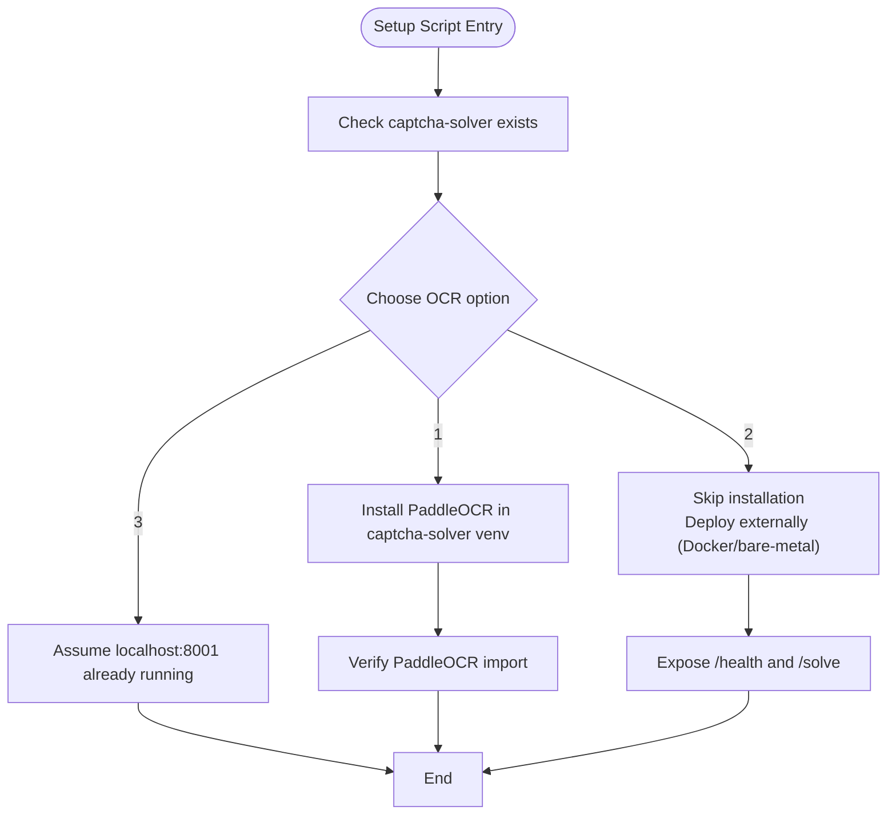
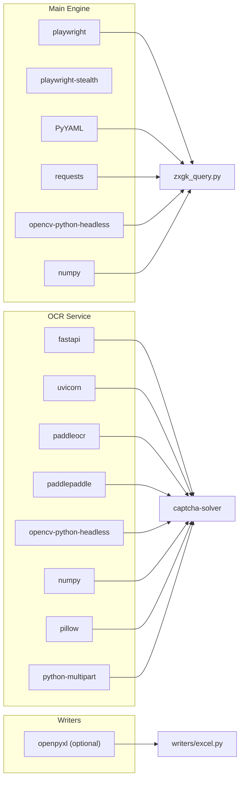
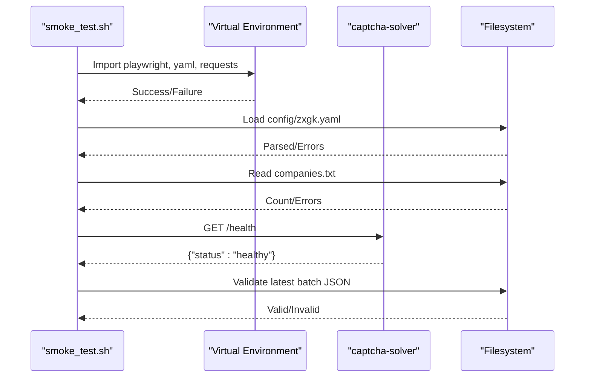
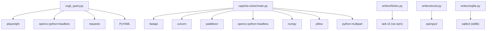

# System Requirements and Dependencies

<cite>
**Referenced Files in This Document**
- [README.md](file://README.md)
- [setup.sh](file://setup.sh)
- [cron_daily_query.sh](file://cron_daily_query.sh)
- [smoke_test.sh](file://smoke_test.sh)
- [config/zxgk.example.yaml](file://config/zxgk.example.yaml)
- [captcha-solver/requirements.txt](file://captcha-solver/requirements.txt)
- [captcha-solver/Dockerfile](file://captcha-solver/Dockerfile)
- [captcha-solver/main.py](file://captcha-solver/main.py)
- [writers/feishu.py](file://writers/feishu.py)
- [writers/sqlite.py](file://writers/sqlite.py)
- [writers/excel.py](file://writers/excel.py)
</cite>

## Table of Contents
1. [Introduction](#introduction)
2. [Project Structure](#project-structure)
3. [Core Components](#core-components)
4. [Architecture Overview](#architecture-overview)
5. [Detailed Component Analysis](#detailed-component-analysis)
6. [Dependency Analysis](#dependency-analysis)
7. [Performance Considerations](#performance-considerations)
8. [Troubleshooting Guide](#troubleshooting-guide)
9. [Conclusion](#conclusion)

## Introduction
This document specifies the system requirements and dependencies for the Execution Information Query System. It covers hardware requirements, operating system compatibility, software prerequisites, OCR service options, Python package dependencies, memory considerations, installation verification, and optional components that affect system performance.

## Project Structure
The system is organized around a browser automation query engine, an OCR service (captcha-solver), and multiple output writers. The setup script automates dependency installation and OCR service configuration, while orchestration scripts coordinate daily runs and post-processing.

**Diagram sources**
- [README.md:8-14](file://README.md#L8-L14)
- [setup.sh:16-25](file://setup.sh#L16-L25)
- [cron_daily_query.sh:48-96](file://cron_daily_query.sh#L48-L96)
- [writers/feishu.py:26-32](file://writers/feishu.py#L26-L32)
- [writers/sqlite.py:19-34](file://writers/sqlite.py#L19-L34)
- [writers/excel.py:17-22](file://writers/excel.py#L17-L22)
- [config/zxgk.example.yaml:7-8](file://config/zxgk.example.yaml#L7-L8)

**Section sources**
- [README.md:8-14](file://README.md#L8-L14)
- [setup.sh:16-25](file://setup.sh#L16-L25)
- [cron_daily_query.sh:48-96](file://cron_daily_query.sh#L48-L96)
- [writers/feishu.py:26-32](file://writers/feishu.py#L26-L32)
- [writers/sqlite.py:19-34](file://writers/sqlite.py#L19-L34)
- [writers/excel.py:17-22](file://writers/excel.py#L17-L22)
- [config/zxgk.example.yaml:7-8](file://config/zxgk.example.yaml#L7-L8)

## Core Components
- Hardware requirements
  - Minimum 4 GB RAM recommended to accommodate the OCR model (~1.5 GB) and browser automation (~500 MB).
- Operating systems
  - Ubuntu and macOS are supported.
- Software prerequisites
  - Python 3.10+ and pip.
  - npm for installing the lark-cli.
  - Docker (optional but recommended for OCR service deployment).
- OCR service
  - The system requires a local OCR service at localhost:8001 with compatible endpoints.
  - Two deployment approaches are supported:
    - Built-in PaddleOCR installation via setup.sh.
    - External OCR service deployment (Docker or bare-metal venv) exposing GET /health and POST /solve.

**Section sources**
- [README.md:8-14](file://README.md#L8-L14)
- [setup.sh:58-109](file://setup.sh#L58-L109)
- [cron_daily_query.sh:48-96](file://cron_daily_query.sh#L48-L96)

## Architecture Overview
The system orchestrates browser automation queries, integrates with an OCR service for CAPTCHA solving, and writes results to multiple destinations. The OCR service can be deployed locally or via Docker.

**Diagram sources**
- [cron_daily_query.sh:112-154](file://cron_daily_query.sh#L112-L154)
- [writers/feishu.py:56-65](file://writers/feishu.py#L56-L65)
- [writers/sqlite.py:37-100](file://writers/sqlite.py#L37-L100)
- [writers/excel.py:56-73](file://writers/excel.py#L56-L73)
- [captcha-solver/main.py:107-141](file://captcha-solver/main.py#L107-L141)

## Detailed Component Analysis

### Hardware and OS Requirements
- Memory
  - Minimum 4 GB RAM to reliably run OCR models and browser automation concurrently.
- Operating systems
  - Ubuntu and macOS are explicitly supported by the setup and orchestration scripts.

**Section sources**
- [README.md:10](file://README.md#L10)
- [README.md:13](file://README.md#L13)

### Software Prerequisites
- Python 3.10+ and pip are required for the main engine and writers.
- npm is required to install lark-cli for Feishu integration.
- Docker is optional but recommended for deploying the OCR service.

**Section sources**
- [setup.sh:16-25](file://setup.sh#L16-L25)
- [README.md:11](file://README.md#L11)

### OCR Service Requirements and Dual Approach
The system depends on a local OCR service at localhost:8001. The setup script offers three options:
- Install PaddleOCR locally (pip) with a dedicated virtual environment in captcha-solver.
- Skip installation and deploy externally (Docker or bare-metal venv).
- Assume an external service is already running at localhost:8001.

The OCR service must expose:
- GET /health returning {"status":"healthy"}
- POST /solve returning {"success":true,"text":"xxxx"}

**Diagram sources**
- [setup.sh:58-109](file://setup.sh#L58-L109)
- [captcha-solver/main.py:107-141](file://captcha-solver/main.py#L107-L141)

**Section sources**
- [setup.sh:58-109](file://setup.sh#L58-L109)
- [README.md:5-6](file://README.md#L5-L6)
- [captcha-solver/main.py:107-141](file://captcha-solver/main.py#L107-L141)

### Python Dependencies
Core Python packages installed by the setup script include:
- Playwright and stealth for browser automation.
- PyYAML, requests for configuration and HTTP operations.
- OpenCV (headless) and NumPy for image processing.
- lark-cli (via npm) for Feishu integration.

Additional OCR service dependencies (when using built-in PaddleOCR):
- FastAPI, Uvicorn, PaddleOCR, OpenCV (headless), NumPy, Pillow, python-multipart.

Optional writers dependencies:
- openpyxl for Excel export.

**Diagram sources**
- [setup.sh:39](file://setup.sh#L39)
- [captcha-solver/requirements.txt:1-9](file://captcha-solver/requirements.txt#L1-L9)
- [writers/excel.py:17-22](file://writers/excel.py#L17-L22)

**Section sources**
- [setup.sh:39](file://setup.sh#L39)
- [captcha-solver/requirements.txt:1-9](file://captcha-solver/requirements.txt#L1-L9)
- [writers/excel.py:17-22](file://writers/excel.py#L17-L22)

### Memory Considerations for OCR Models and Browser Automation
- OCR model footprint
  - The PaddleOCR model requires approximately 1.5 GB of memory during loading and inference.
- Browser automation overhead
  - Playwright Chromium consumes roughly 500 MB of memory per browser instance.
- Combined recommendation
  - Ensure at least 4 GB RAM to avoid swapping and performance degradation when both OCR and browser automation are active.

**Section sources**
- [README.md:10](file://README.md#L10)

### Installation Verification and Dependency Validation
Verification steps performed by the smoke test script:
- Python syntax checks for core modules.
- Shell syntax checks for orchestration scripts.
- YAML configuration validation.
- Company list presence.
- Environment variable presence (FEISHU_APP_TOKEN).
- Virtual environment existence and key dependency imports.
- Local OCR service health endpoint availability.
- Batch JSON format validation.

**Diagram sources**
- [smoke_test.sh:16-143](file://smoke_test.sh#L16-L143)
- [cron_daily_query.sh:48-96](file://cron_daily_query.sh#L48-L96)

**Section sources**
- [smoke_test.sh:16-143](file://smoke_test.sh#L16-L143)
- [cron_daily_query.sh:48-96](file://cron_daily_query.sh#L48-L96)

### Optional Components and Performance Impact
- Feishu integration
  - Requires lark-cli and a valid FEISHU_APP_TOKEN.
  - Adds network calls and media uploads; performance impact is moderate.
- Excel export
  - Requires openpyxl; adds CPU and memory overhead for spreadsheet generation.
- SQLite storage
  - Zero external dependencies; minimal overhead for local persistence.
- Screenshots and cross-reference updates
  - Increase disk I/O and API calls; enable only when needed.

**Section sources**
- [writers/feishu.py:26-32](file://writers/feishu.py#L26-L32)
- [writers/excel.py:17-22](file://writers/excel.py#L17-L22)
- [writers/sqlite.py:37-100](file://writers/sqlite.py#L37-L100)

## Dependency Analysis
The system’s runtime dependencies form a layered graph: the main engine depends on Playwright and OpenCV for automation and image processing; the OCR service depends on PaddleOCR and related libraries; writers depend on optional libraries for output formats.

**Diagram sources**
- [setup.sh:39](file://setup.sh#L39)
- [captcha-solver/requirements.txt:1-9](file://captcha-solver/requirements.txt#L1-L9)
- [writers/feishu.py:56-65](file://writers/feishu.py#L56-L65)
- [writers/excel.py:17-22](file://writers/excel.py#L17-L22)
- [writers/sqlite.py:10-16](file://writers/sqlite.py#L10-L16)

**Section sources**
- [setup.sh:39](file://setup.sh#L39)
- [captcha-solver/requirements.txt:1-9](file://captcha-solver/requirements.txt#L1-L9)
- [writers/feishu.py:56-65](file://writers/feishu.py#L56-L65)
- [writers/excel.py:17-22](file://writers/excel.py#L17-L22)
- [writers/sqlite.py:10-16](file://writers/sqlite.py#L10-L16)

## Performance Considerations
- Prefer Docker for OCR service deployment to isolate resource usage and reduce conflicts with the host system.
- Limit concurrent browser instances to reduce memory pressure; adjust viewport and concurrency settings as needed.
- Disable screenshot generation or reduce frequency if disk I/O becomes a bottleneck.
- Use SQLite for local backups to minimize external dependencies and overhead.

## Troubleshooting Guide
Common issues and remedies:
- Missing Python or npm
  - Ensure Python 3.10+ and pip are installed; ensure npm is installed for lark-cli.
- OCR service not reachable
  - Verify localhost:8001 responds to /health and /solve; use setup.sh to install PaddleOCR or deploy externally.
- Feishu authentication
  - Run lark-cli auth and ensure FEISHU_APP_TOKEN is set; smoke test validates environment variables.
- Port conflicts
  - If port 8001 is occupied by another process, change the OCR server port in configuration and restart the service.
- YAML configuration errors
  - Validate YAML syntax and required keys using the smoke test script.

**Section sources**
- [setup.sh:16-25](file://setup.sh#L16-L25)
- [setup.sh:112-124](file://setup.sh#L112-L124)
- [cron_daily_query.sh:48-96](file://cron_daily_query.sh#L48-L96)
- [smoke_test.sh:40-60](file://smoke_test.sh#L40-L60)

## Conclusion
The Execution Information Query System requires at least 4 GB RAM, supports Ubuntu and macOS, and depends on Python 3.10+, npm, and optionally Docker. The OCR service is mandatory and can be deployed via setup.sh (PaddleOCR) or externally. The smoke test script provides a practical validation suite. Optional components like Feishu integration, Excel export, and screenshots can increase resource usage; enable them based on operational needs.