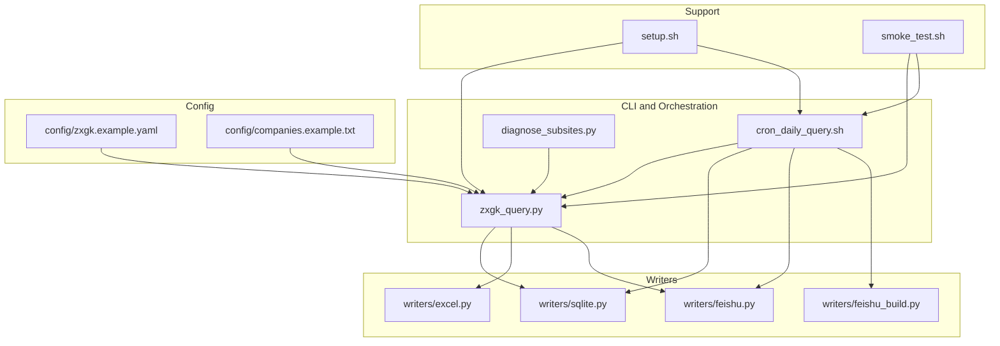
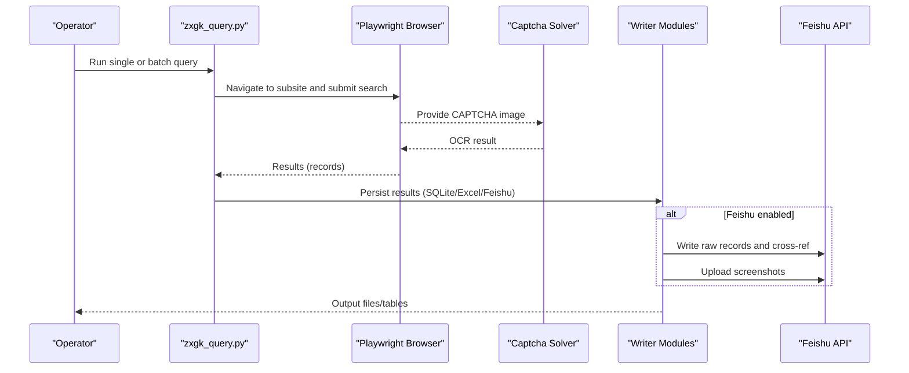
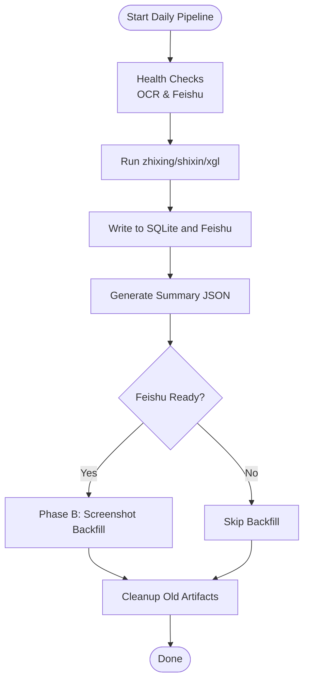
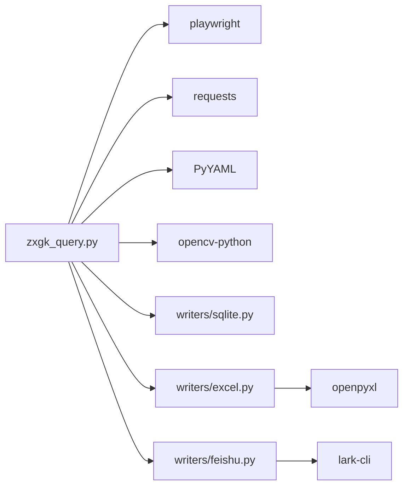

# Use Cases and Examples

<cite>
**Referenced Files in This Document**
- [README.md](file://README.md)
- [zxgk_query.py](file://zxgk_query.py)
- [cron_daily_query.sh](file://cron_daily_query.sh)
- [diagnose_subsites.py](file://diagnose_subsites.py)
- [writers/__init__.py](file://writers/__init__.py)
- [writers/excel.py](file://writers/excel.py)
- [writers/feishu.py](file://writers/feishu.py)
- [writers/feishu_build.py](file://writers/feishu_build.py)
- [writers/sqlite.py](file://writers/sqlite.py)
- [config/companies.example.txt](file://config/companies.example.txt)
- [config/zxgk.example.yaml](file://config/zxgk.example.yaml)
- [setup.sh](file://setup.sh)
- [smoke_test.sh](file://smoke_test.sh)
</cite>

## Table of Contents
1. [Introduction](#introduction)
2. [Project Structure](#project-structure)
3. [Core Components](#core-components)
4. [Architecture Overview](#architecture-overview)
5. [Detailed Component Analysis](#detailed-component-analysis)
6. [Dependency Analysis](#dependency-analysis)
7. [Performance Considerations](#performance-considerations)
8. [Troubleshooting Guide](#troubleshooting-guide)
9. [Conclusion](#conclusion)
10. [Appendices](#appendices)

## Introduction
This document presents practical use cases and examples for the Execution Information Query System. It focuses on real-world scenarios such as single company queries, batch processing for compliance monitoring, daily automated workflows, and enterprise integration with Feishu. It also demonstrates operational modes (single, batch, backfill, diagnostic), CLI usage patterns, configuration options, and output formats. Business use cases covered include credit risk assessment, due diligence processes, and regulatory compliance reporting.

## Project Structure
The system is organized around a CLI query engine, a daily orchestration script, writer modules for multiple outputs, and auxiliary diagnostics and setup utilities. The key components are:
- CLI query engine: zxgk_query.py
- Daily orchestrator: cron_daily_query.sh
- Writers: SQLite, Excel, Feishu, Feishu Build
- Diagnostics: diagnose_subsites.py
- Configuration templates: config/zxgk.example.yaml, config/companies.example.txt
- Setup and smoke test: setup.sh, smoke_test.sh

**Diagram sources**
- [zxgk_query.py](file://zxgk_query.py)
- [cron_daily_query.sh](file://cron_daily_query.sh)
- [diagnose_subsites.py](file://diagnose_subsites.py)
- [writers/sqlite.py](file://writers/sqlite.py)
- [writers/excel.py](file://writers/excel.py)
- [writers/feishu.py](file://writers/feishu.py)
- [writers/feishu_build.py](file://writers/feishu_build.py)
- [config/zxgk.example.yaml](file://config/zxgk.example.yaml)
- [config/companies.example.txt](file://config/companies.example.txt)
- [setup.sh](file://setup.sh)
- [smoke_test.sh](file://smoke_test.sh)

**Section sources**
- [README.md](file://README.md)
- [writers/__init__.py](file://writers/__init__.py)

## Core Components
- CLI Query Engine (zxgk_query.py): Provides single and batch query modes, diagnostic mode, and backfill mode. It integrates browser automation, OCR-based CAPTCHA solving, result collection, and optional screenshot capture.
- Daily Orchestrator (cron_daily_query.sh): Runs the three subsites (zhixing, shixin, xgl) in sequence, writes results to SQLite and Feishu, generates a summary JSON, and performs Phase B screenshot backfill.
- Writers:
  - SQLite Writer (writers/sqlite.py): Stores results locally in SQLite with optional screenshot storage as file path or binary.
  - Excel Writer (writers/excel.py): Exports tabular results to Excel sheets.
  - Feishu Writer (writers/feishu.py): Writes raw results to Feishu tables, optionally updates cross-references, and uploads screenshots to case tables.
  - Feishu Build (writers/feishu_build.py): Automatically creates Feishu table structures and writes data for new users.
- Diagnostics (diagnose_subsites.py): Probes DOM structures and validates navigation and search flows for each subsite.
- Configuration (config/zxgk.example.yaml, config/companies.example.txt): Defines subsite selectors, browser and WAF parameters, storage preferences, Feishu table mappings, and company lists.

**Section sources**
- [zxgk_query.py](file://zxgk_query.py)
- [cron_daily_query.sh](file://cron_daily_query.sh)
- [writers/sqlite.py](file://writers/sqlite.py)
- [writers/excel.py](file://writers/excel.py)
- [writers/feishu.py](file://writers/feishu.py)
- [writers/feishu_build.py](file://writers/feishu_build.py)
- [diagnose_subsites.py](file://diagnose_subsites.py)
- [config/zxgk.example.yaml](file://config/zxgk.example.yaml)
- [config/companies.example.txt](file://config/companies.example.txt)

## Architecture Overview
The system operates in two primary modes:
- Interactive CLI mode: Single-company or batch queries with optional Feishu writing and screenshot capture.
- Automated daily mode: Orchestrated pipeline that runs all three subsites, persists results, and synchronizes with Feishu.

**Diagram sources**
- [zxgk_query.py](file://zxgk_query.py)
- [writers/feishu.py](file://writers/feishu.py)
- [writers/sqlite.py](file://writers/sqlite.py)
- [writers/excel.py](file://writers/excel.py)

## Detailed Component Analysis

### Operational Modes and CLI Usage Patterns
- Single Company Query
  - Purpose: Quick verification for a single entity.
  - Example usage: [README.md](file://README.md)
  - Key options: subsite selection, mode selection, output path, optional Feishu writing.
  - Notes: Uses fresh CAPTCHA handling and result collection.

- Batch Processing
  - Purpose: Process a list of companies efficiently.
  - Example usage: [README.md](file://README.md)
  - Key options: batch input file, subsite, mode, output JSON.
  - Notes: Supports resume and deduplication via viewId during collection.

- Backfill Mode
  - Purpose: Re-query missing screenshots for previously stored records.
  - Implementation: [ScreenshotBackfiller](file://zxgk_query.py) class and usage in [cron_daily_query.sh](file://cron_daily_query.sh).
  - Notes: Uses Feishu raw table to locate records and re-navigate to detail pages.

- Diagnostic Mode
  - Purpose: Inspect subsite navigation and DOM readiness.
  - Tool: [diagnose_subsites.py](file://diagnose_subsites.py)
  - Notes: Validates presence of key elements and pagination.

**Section sources**
- [README.md](file://README.md)
- [zxgk_query.py](file://zxgk_query.py)
- [cron_daily_query.sh](file://cron_daily_query.sh)
- [diagnose_subsites.py](file://diagnose_subsites.py)

### Daily Automated Workflow
- Execution flow:
  - Health checks for OCR service and Feishu authentication.
  - Sequentially query zhixing, shixin, xgl with text-only mode.
  - Write to SQLite and Feishu for each subsite.
  - Generate a consolidated summary JSON for downstream AI agents.
  - Perform Phase B screenshot backfill after Feishu computation.
  - Cleanup old artifacts and mark completion with a sentinel.

- Command example:
  - [README.md](file://README.md) and [cron_daily_query.sh](file://cron_daily_query.sh)

**Diagram sources**
- [cron_daily_query.sh](file://cron_daily_query.sh)

**Section sources**
- [cron_daily_query.sh](file://cron_daily_query.sh)

### Enterprise Integration with Feishu
- Writing Raw Records:
  - Use Feishu writer to insert raw records into subsite-specific tables.
  - Cross-reference updates for shixin/xgl to mark case master table flags.
  - Upload screenshots to case master table attachments.

- Automatic Table Building:
  - Use Feishu Build to create raw and case master tables, establish DuplexLink, and populate data.

- Configuration:
  - Define Feishu app token, table IDs, and field mappings in the YAML configuration.

- Example commands:
  - [README.md](file://README.md)
  - [writers/feishu.py](file://writers/feishu.py)
  - [writers/feishu_build.py](file://writers/feishu_build.py)

**Section sources**
- [writers/feishu.py](file://writers/feishu.py)
- [writers/feishu_build.py](file://writers/feishu_build.py)
- [config/zxgk.example.yaml](file://config/zxgk.example.yaml)

### Output Formats and Storage Options
- SQLite
  - Store results locally with optional screenshot storage as file path or binary.
  - Supports migration for backward compatibility.

- Excel
  - Export tabular results to XLSX with standardized headers.

- Feishu
  - Write raw records and optionally update cross-references and screenshots.

- Example commands:
  - [README.md](file://README.md)
  - [writers/sqlite.py](file://writers/sqlite.py)
  - [writers/excel.py](file://writers/excel.py)
  - [writers/feishu.py](file://writers/feishu.py)

**Section sources**
- [writers/sqlite.py](file://writers/sqlite.py)
- [writers/excel.py](file://writers/excel.py)
- [writers/feishu.py](file://writers/feishu.py)
- [README.md](file://README.md)

### Business Use Cases
- Credit Risk Assessment
  - Monitor zhixing and shixin records to flag potential defaults or blacklisted entities.
  - Use batch mode to scan portfolios regularly.

- Due Diligence Processes
  - Validate counterparties against xgl (consumption restriction) and shixin lists.
  - Combine with screenshot backfill for audit trails.

- Regulatory Compliance Reporting
  - Daily pipelines feed Feishu dashboards for compliance teams.
  - Consolidated summary JSON enables automated reporting.

[No sources needed since this section provides conceptual use cases]

## Dependency Analysis
- Internal dependencies:
  - CLI depends on playwright, stealth, requests, yaml, and OpenCV for screenshot extraction.
  - Writers depend on lark-cli for Feishu operations and optional openpyxl for Excel export.
- External dependencies:
  - OCR service on localhost:8001.
  - Feishu app token and configured table IDs.

**Diagram sources**
- [zxgk_query.py](file://zxgk_query.py)
- [writers/feishu.py](file://writers/feishu.py)
- [writers/excel.py](file://writers/excel.py)

**Section sources**
- [zxgk_query.py](file://zxgk_query.py)
- [writers/feishu.py](file://writers/feishu.py)
- [writers/excel.py](file://writers/excel.py)

## Performance Considerations
- Browser and OCR throughput:
  - Configure viewport and headless mode for stability and speed.
  - Tune retry and cooldown parameters for WAF resilience.
- Batch sizing:
  - Use batch mode to reduce overhead and leverage deduplication.
- Storage trade-offs:
  - SQLite file paths vs. BLOB storage impact disk usage and backup strategies.
- Feishu rate limits:
  - Respect API limits when uploading screenshots and updating records.

[No sources needed since this section provides general guidance]

## Troubleshooting Guide
- Environment and Dependencies
  - Use the setup script to install Python venv, Playwright Chromium, lark-cli, and optional OCR service.
  - Verify environment variables and Feishu authentication.

- Smoke Test
  - Run the smoke test to validate Python/Shell syntax, YAML configuration, company list, venv, OCR health, and batch JSON format.

- Common Issues
  - OCR service unavailable: Confirm health endpoint and port binding.
  - Feishu authentication missing: Ensure lark-cli is authenticated and app token is set.
  - WAF blocked: The system retries navigation; adjust cooldown and retries in configuration.

**Section sources**
- [setup.sh](file://setup.sh)
- [smoke_test.sh](file://smoke_test.sh)
- [config/zxgk.example.yaml](file://config/zxgk.example.yaml)

## Conclusion
The Execution Information Query System offers flexible, production-ready capabilities for monitoring enforcement information across three subsites. Operators can choose between interactive CLI usage and fully automated daily workflows, persist results in multiple formats, and integrate seamlessly with Feishu for enterprise collaboration. The provided examples and configurations enable immediate adoption for credit risk assessment, due diligence, and compliance reporting.

[No sources needed since this section summarizes without analyzing specific files]

## Appendices

### Practical Command-Line Examples
- Single company query:
  - [README.md](file://README.md)
- Batch query:
  - [README.md](file://README.md)
- Full daily pipeline:
  - [README.md](file://README.md)
- SQLite output:
  - [README.md](file://README.md)
- Excel output:
  - [README.md](file://README.md)
- Feishu build:
  - [README.md](file://README.md)
- Feishu write:
  - [README.md](file://README.md)

**Section sources**
- [README.md](file://README.md)

### Configuration Options
- YAML configuration highlights:
  - OCR server, browser settings, WAF parameters, screenshots, subsites, Feishu mappings, output directories, and company list.
- Company list template:
  - [config/companies.example.txt](file://config/companies.example.txt)

**Section sources**
- [config/zxgk.example.yaml](file://config/zxgk.example.yaml)
- [config/companies.example.txt](file://config/companies.example.txt)