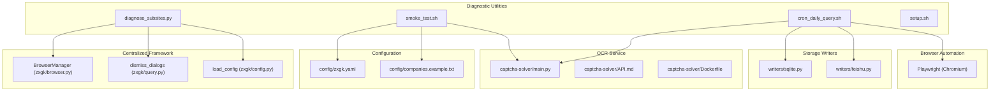
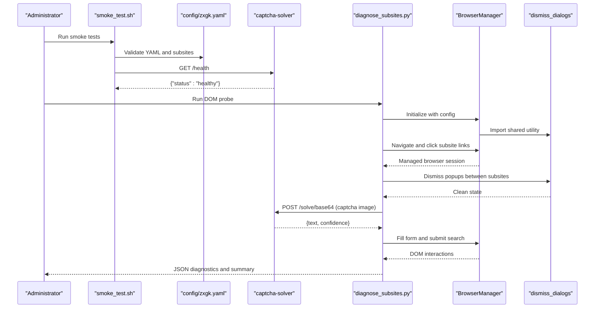
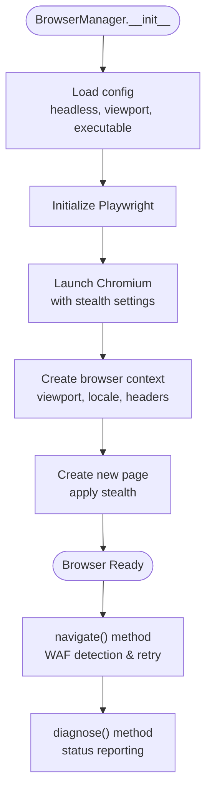
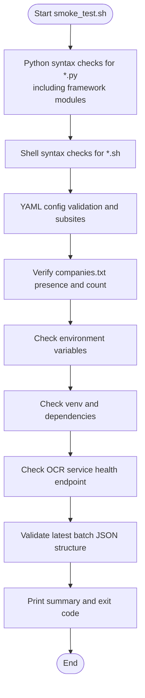
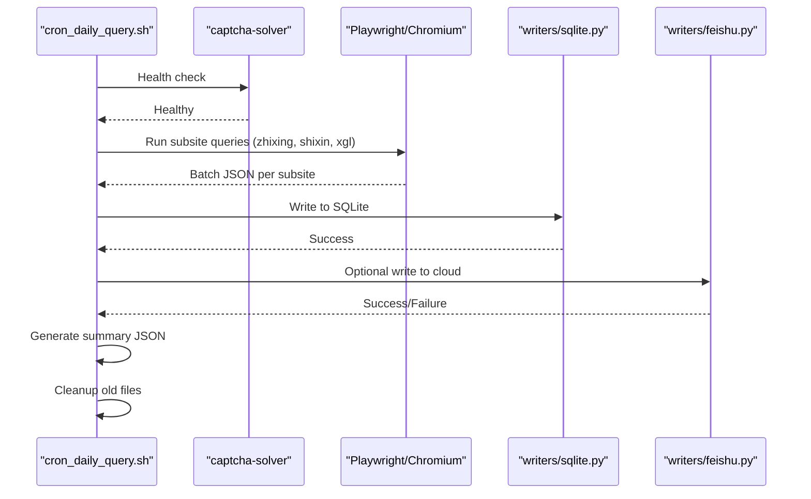
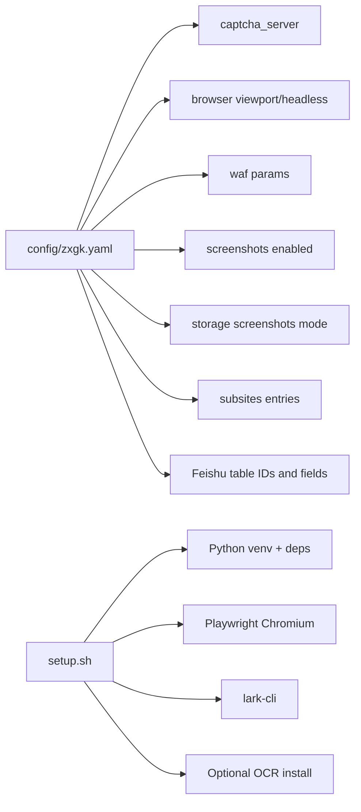
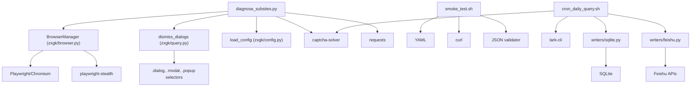

# System Diagnostics

<cite>
**Referenced Files in This Document**
- [README.md](file://README.md)
- [SKILL.md](file://SKILL.md)
- [diagnose_subsites.py](file://diagnose_subsites.py)
- [smoke_test.sh](file://smoke_test.sh)
- [cron_daily_query.sh](file://cron_daily_query.sh)
- [setup.sh](file://setup.sh)
- [config/zxgk.example.yaml](file://config/zxgk.example.yaml)
- [config/zxgk.yaml](file://config/zxgk.yaml)
- [config/companies.example.txt](file://config/companies.example.txt)
- [zxgk/browser.py](file://zxgk/browser.py)
- [zxgk/query.py](file://zxgk/query.py)
- [zxgk/config.py](file://zxgk/config.py)
- [captcha-solver/main.py](file://captcha-solver/main.py)
- [captcha-solver/API.md](file://captcha-solver/API.md)
- [captcha-solver/Dockerfile](file://captcha-solver/Dockerfile)
- [writers/sqlite.py](file://writers/sqlite.py)
- [writers/feishu.py](file://writers/feishu.py)
</cite>

## Update Summary
**Changes Made**
- Updated diagnose_subsites.py section to reflect the completely rewritten diagnostic utility
- Added new framework components: BrowserManager, centralized browser lifecycle management
- Enhanced popup detection capabilities with shared utility functions
- Updated architecture diagrams to show centralized framework components
- Revised troubleshooting procedures to leverage new framework capabilities

## Table of Contents
1. [Introduction](#introduction)
2. [Project Structure](#project-structure)
3. [Core Components](#core-components)
4. [Architecture Overview](#architecture-overview)
5. [Detailed Component Analysis](#detailed-component-analysis)
6. [Dependency Analysis](#dependency-analysis)
7. [Performance Considerations](#performance-considerations)
8. [Troubleshooting Guide](#troubleshooting-guide)
9. [Conclusion](#conclusion)
10. [Appendices](#appendices)

## Introduction
This document provides a comprehensive guide to system diagnostics for health checks and troubleshooting workflows. It explains how to verify DOM structure across the three subsites using the newly rewritten diagnostic utility, monitor performance, and apply systematic troubleshooting approaches. The document covers the centralized BrowserManager framework, popup detection capabilities, and shared utility functions that provide comprehensive site health monitoring. It also documents the diagnose_subsites.py utility for subsite health assessment and smoke_test.sh for comprehensive system validation, along with relationships to browser automation, configuration validation, performance bottleneck identification, network connectivity issues, and component dependency problems.

## Project Structure
The project centers around a daily query pipeline that automates browser-driven searches across three subsites, validates configurations, and writes results to local storage and optionally to a cloud platform. The newly rewritten diagnostic utility leverages centralized framework components for robust site health monitoring.

**Diagram sources**
- [diagnose_subsites.py:17-20](file://diagnose_subsites.py#L17-L20)
- [zxgk/browser.py:58-190](file://zxgk/browser.py#L58-L190)
- [zxgk/query.py:34-51](file://zxgk/query.py#L34-L51)
- [zxgk/config.py:49-70](file://zxgk/config.py#L49-L70)
- [smoke_test.sh:124-131](file://smoke_test.sh#L124-L131)
- [cron_daily_query.sh:43-96](file://cron_daily_query.sh#L43-L96)
- [writers/sqlite.py:1-121](file://writers/sqlite.py#L1-L121)
- [writers/feishu.py:1-596](file://writers/feishu.py#L1-L596)

**Section sources**
- [README.md:1-122](file://README.md#L1-L122)
- [SKILL.md:1-273](file://SKILL.md#L1-L273)

## Core Components
- **BrowserManager**: Centralized browser lifecycle management with stealth mode, automatic cleanup, and WAF detection capabilities.
- **dismiss_dialogs**: Shared utility function for popup detection and dismissal across all framework components.
- **load_config**: Centralized configuration loading with environment variable expansion and validation.
- **diagnose_subsites.py**: Rewritten diagnostic utility leveraging framework components for comprehensive DOM structure analysis, query testing, and popup detection.
- **smoke_test.sh**: Validates Python/Shell syntax, configuration YAML, companies list, environment variables, virtual environment dependencies, OCR service health, and latest batch JSON format.
- **cron_daily_query.sh**: Orchestrates the full pipeline with centralized browser management and popup handling.
- **setup.sh**: Installs OS-level prerequisites, creates and populates a Python virtual environment, installs Playwright Chromium, configures lark-cli, and optionally installs the OCR service locally or remotely.
- **Configuration files**: Define subsite selectors, OCR server endpoint, browser viewport, WAF parameters, screenshots behavior, storage options, and Feishu table mappings.
- **Storage writers**: SQLite writer persists results locally; Feishu writer synchronizes with cloud tables and supports screenshot uploads.

**Section sources**
- [diagnose_subsites.py:17-20](file://diagnose_subsites.py#L17-L20)
- [zxgk/browser.py:58-190](file://zxgk/browser.py#L58-L190)
- [zxgk/query.py:34-51](file://zxgk/query.py#L34-L51)
- [smoke_test.sh:16-154](file://smoke_test.sh#L16-L154)
- [cron_daily_query.sh:43-96](file://cron_daily_query.sh#L43-L96)
- [setup.sh:1-150](file://setup.sh#L1-L150)
- [config/zxgk.yaml:7-96](file://config/zxgk.yaml#L7-L96)
- [writers/sqlite.py:1-121](file://writers/sqlite.py#L1-L121)
- [writers/feishu.py:1-596](file://writers/feishu.py#L1-L596)

## Architecture Overview
The system integrates centralized browser management with OCR validation and storage backends. The newly rewritten diagnostic utility provides comprehensive health checks and diagnostics through framework components focusing on:
- Centralized browser lifecycle management with automatic cleanup
- Popup detection and dismissal across all components
- DOM structure verification across subsites
- OCR service availability and response quality
- Configuration correctness and environment readiness
- Storage integrity and optional cloud synchronization

**Diagram sources**
- [smoke_test.sh:124-131](file://smoke_test.sh#L124-L131)
- [diagnose_subsites.py:282-283](file://diagnose_subsites.py#L282-L283)
- [zxgk/browser.py:58-104](file://zxgk/browser.py#L58-L104)
- [zxgk/query.py:34-51](file://zxgk/query.py#L34-L51)
- [captcha-solver/main.py:107-109](file://captcha-solver/main.py#L107-L109)

## Detailed Component Analysis

### diagnose_subsites.py: Rewritten Diagnostic Utility with Framework Integration
**Updated** Completely rewritten to leverage centralized framework components for comprehensive site health monitoring.

Key responsibilities with new framework integration:
- **Centralized Browser Management**: Uses BrowserManager for stealthed Chromium instance with automatic cleanup and WAF detection.
- **Shared Popup Handling**: Leverages dismiss_dialogs utility for popup detection and dismissal across subsites.
- **Enhanced DOM Analysis**: Performs comprehensive DOM structure verification with detailed element inspection.
- **Integrated Configuration Loading**: Utilizes load_config for centralized configuration management.
- **Robust Error Handling**: Implements cross-subsite popup cleanup and structured result collection.

```mermaid
flowchart TD
Start(["Start diagnose_subsites.py"]) --> LoadCfg["Load config via load_config()<br/>Centralized configuration management"]
LoadCfg --> InitBM["Initialize BrowserManager<br/>with stealth settings"]
InitBM --> LaunchBrowser["Launch Chromium (headless)<br/>Apply stealth settings"]
LaunchBrowser --> Navigate["Navigate to main portal<br/>Wait for network idle"]
Navigate --> ClickSubsite["Click subsite link via CSS selector<br/>Managed by BrowserManager"]
ClickSubsite --> WaitExtra["Wait extra seconds per subsite"]
WaitExtra --> ProbeWAF["Probe WAF elements:<br/>yzm, pName, captchaId"]
ProbeWAF --> FormFields["Inspect extra form fields:<br/>pProvince options and selection"]
FormFields --> TableScan["Scan result tables:<br/>tb-1, tb-2, result-table, tbody-result"]
TableScan --> ResultBlock["Evaluate result-block:<br/>exists, visible, innerText"]
ResultBlock --> Pagination["Check pagination:<br/>next-btn existence, disabled, visible"]
Pagination --> SearchHandler["Find onclick containing 'search()'<br/>Cross-site popup cleanup"]
SearchHandler --> TestSearch["Fill test keyword '张'<br/>Extract captcha image"]
TestSearch --> OCRAPI["POST /solve/base64 to OCR service"]
OCRAPI --> FillCaptcha["Fill captcha and submit search"]
FillCaptcha --> CollectResults["Collect result text, row/col counts,<br/>first row samples, showDetail onclick"]
CollectResults --> PostPagination["Check pagination after query"]
PostPagination --> Cleanup["Cross-subsite popup cleanup<br/>via dismiss_dialogs utility"]
Cleanup --> Summarize["Print summary and save JSON"]
Summarize --> End(["End"])
```

**Diagram sources**
- [diagnose_subsites.py:277-350](file://diagnose_subsites.py#L277-L350)
- [zxgk/browser.py:58-104](file://zxgk/browser.py#L58-L104)
- [zxgk/query.py:34-51](file://zxgk/query.py#L34-L51)

**Section sources**
- [diagnose_subsites.py:17-20](file://diagnose_subsites.py#L17-L20)
- [diagnose_subsites.py:277-350](file://diagnose_subsites.py#L277-L350)

### BrowserManager: Centralized Browser Lifecycle Management
**New** Centralized framework component providing comprehensive browser management.

Key features:
- **Automatic Cleanup**: Handles orphan process cleanup and signal handling for graceful shutdown.
- **Stealth Mode**: Applies playwright-stealth to bypass bot detection.
- **WAF Detection**: Built-in WAF blocking detection with automatic retry logic.
- **Centralized Configuration**: Manages viewport, headless mode, and browser arguments.
- **Exception Handling**: Provides specific exceptions for navigation and WAF blocking scenarios.

**Diagram sources**
- [zxgk/browser.py:58-190](file://zxgk/browser.py#L58-L190)

**Section sources**
- [zxgk/browser.py:58-190](file://zxgk/browser.py#L58-L190)

### dismiss_dialogs: Shared Popup Detection Utility
**New** Module-level utility function for popup detection and dismissal.

Key capabilities:
- **Universal Dialog Detection**: Identifies various dialog types including `.dialog`, `.modal`, `.popup`, and role-based dialogs.
- **Smart Button Recognition**: Detects "确定" (OK) and "关闭" (Close) buttons within dialog contexts.
- **Cross-Site Popup Cleanup**: Enables popup dismissal between different subsites to maintain clean state.
- **Iterative Dismissal**: Implements polling mechanism to handle late-appearing dialogs.

**Section sources**
- [zxgk/query.py:34-51](file://zxgk/query.py#L34-L51)

### smoke_test.sh: Comprehensive System Validation
Checks performed:
- Python syntax validation for key modules including the new framework components.
- Shell syntax validation for operational scripts.
- YAML configuration validation and subsite inspection.
- Presence and content of the companies list.
- Environment variable presence (e.g., token for cloud storage).
- Virtual environment existence and installed packages.
- OCR service health endpoint.
- Latest batch JSON format validation.

**Diagram sources**
- [smoke_test.sh:17-173](file://smoke_test.sh#L17-L173)

**Section sources**
- [smoke_test.sh:17-173](file://smoke_test.sh#L17-L173)

### cron_daily_query.sh: End-to-End Pipeline Orchestration
Highlights:
- Ensures the OCR service is running, attempting Docker or fallback startup.
- Verifies cloud authentication and proceeds accordingly.
- Executes subsite queries in sequence, writing to SQLite and optionally to cloud storage.
- Generates a consolidated summary for downstream consumption.
- Triggers screenshot backfill when cloud storage is enabled.
- Applies cleanup policies for old artifacts.

**Diagram sources**
- [cron_daily_query.sh:43-96](file://cron_daily_query.sh#L43-L96)
- [cron_daily_query.sh:112-154](file://cron_daily_query.sh#L112-L154)
- [cron_daily_query.sh:169-210](file://cron_daily_query.sh#L169-L210)
- [writers/sqlite.py:37-100](file://writers/sqlite.py#L37-L100)
- [writers/feishu.py:556-591](file://writers/feishu.py#L556-L591)

**Section sources**
- [cron_daily_query.sh:43-96](file://cron_daily_query.sh#L43-L96)
- [cron_daily_query.sh:112-154](file://cron_daily_query.sh#L112-L154)
- [cron_daily_query.sh:169-210](file://cron_daily_query.sh#L169-L210)
- [writers/sqlite.py:37-100](file://writers/sqlite.py#L37-L100)
- [writers/feishu.py:556-591](file://writers/feishu.py#L556-L591)

### Configuration Validation and Dependencies
- **config/zxgk.yaml** defines:
  - OCR server endpoint and port.
  - Browser viewport and headless mode.
  - WAF-related parameters (retries, cooldown, intervals).
  - Screenshots storage mode and storage options.
  - Subsite entries with human-readable names, CSS selectors, and extra wait durations.
  - Feishu table IDs and field mappings.
  - Output directories for JSON and screenshots.
- **companies.example.txt** provides a template for the company list.
- **setup.sh** ensures OS-level tools, Python virtual environment, Playwright installation, lark-cli, and optional OCR service are present.

**Diagram sources**
- [config/zxgk.yaml:7-96](file://config/zxgk.yaml#L7-L96)
- [config/companies.example.txt:1-7](file://config/companies.example.txt#L1-L7)
- [setup.sh:27-124](file://setup.sh#L27-L124)

**Section sources**
- [config/zxgk.yaml:7-96](file://config/zxgk.yaml#L7-L96)
- [config/companies.example.txt:1-7](file://config/companies.example.txt#L1-L7)
- [setup.sh:27-124](file://setup.sh#L27-L124)

## Dependency Analysis
**Updated** Enhanced with centralized framework components and shared utilities.

- **diagnose_subsites.py** depends on:
  - **Centralized Framework**: BrowserManager, dismiss_dialogs, load_config from zxgk package.
  - **Playwright/Chromium** for browser automation.
  - **captcha-solver** for OCR assistance during search attempts.
  - **Requests** for OCR API calls.
- **BrowserManager** depends on:
  - **Playwright** for browser automation.
  - **playwright-stealth** for anti-detection measures.
  - **Configuration module** for browser arguments and settings.
- **dismiss_dialogs** depends on:
  - **Shared utility functions** for popup detection across framework.
- **smoke_test.sh** depends on:
  - **Python/YAML parsing** for configuration validation.
  - **curl** for OCR service health checks.
  - **JSON validation** for batch outputs.
- **cron_daily_query.sh** depends on:
  - **OCR service health checks** and optional Docker/fallback startup.
  - **Cloud authentication** via lark-cli.
  - **writers modules** for storage backends.

**Diagram sources**
- [diagnose_subsites.py:17-20](file://diagnose_subsites.py#L17-L20)
- [zxgk/browser.py:8-12](file://zxgk/browser.py#L8-L12)
- [zxgk/query.py:8-31](file://zxgk/query.py#L8-L31)
- [smoke_test.sh:43-60](file://smoke_test.sh#L43-L60)
- [smoke_test.sh:124-131](file://smoke_test.sh#L124-L131)
- [cron_daily_query.sh:43-96](file://cron_daily_query.sh#L43-L96)
- [writers/sqlite.py:37-100](file://writers/sqlite.py#L37-L100)
- [writers/feishu.py:556-591](file://writers/feishu.py#L556-L591)

**Section sources**
- [diagnose_subsites.py:17-20](file://diagnose_subsites.py#L17-L20)
- [zxgk/browser.py:8-12](file://zxgk/browser.py#L8-L12)
- [zxgk/query.py:8-31](file://zxgk/query.py#L8-L31)
- [smoke_test.sh:43-60](file://smoke_test.sh#L43-L60)
- [smoke_test.sh:124-131](file://smoke_test.sh#L124-L131)
- [cron_daily_query.sh:43-96](file://cron_daily_query.sh#L43-L96)
- [writers/sqlite.py:37-100](file://writers/sqlite.py#L37-L100)
- [writers/feishu.py:556-591](file://writers/feishu.py#L556-L591)

## Performance Considerations
**Updated** Enhanced with centralized browser management and popup handling.

- **Centralized Browser Management**: BrowserManager reduces resource overhead through shared browser instances and automatic cleanup.
- **Popup Detection Efficiency**: Shared dismiss_dialogs utility prevents popup interference between subsites, reducing re-navigation attempts.
- **OCR latency**: The OCR service introduces latency per captcha recognition. Monitor response times and adjust preprocessing modes if needed.
- **Browser overhead**: Headless Chromium consumes memory and CPU. Ensure adequate resources for concurrent subsite probing with centralized management.
- **Network stability**: Frequent retries and timeouts are configured in the pipeline; verify network connectivity to the target portal and OCR service.
- **Storage throughput**: SQLite writes are synchronous; consider disabling screenshot BLOB storage if disk I/O becomes a bottleneck.
- **Pagination and result volume**: Large result sets increase DOM parsing time; validate table scanning logic and limit unnecessary waits.

## Troubleshooting Guide

### Health Check Procedures
**Updated** Enhanced with centralized framework components.

- **Run smoke tests** to validate syntax, configuration, environment, and OCR service readiness.
- **Use diagnose_subsites.py** to probe each subsite's DOM structure, form fields, tables, pagination, and search handler using centralized BrowserManager.
- **Verify OCR service health** and responsiveness.
- **Monitor BrowserManager lifecycle** for proper cleanup and resource management.
- **Check popup detection** across subsites using dismiss_dialogs utility.

**Section sources**
- [smoke_test.sh:17-173](file://smoke_test.sh#L17-L173)
- [diagnose_subsites.py:277-350](file://diagnose_subsites.py#L277-L350)
- [zxgk/browser.py:58-190](file://zxgk/browser.py#L58-L190)
- [zxgk/query.py:34-51](file://zxgk/query.py#L34-L51)
- [captcha-solver/main.py:107-109](file://captcha-solver/main.py#L107-L109)

### Common Issues and Resolution Strategies
**Updated** Enhanced with framework-specific troubleshooting.

- **OCR service unavailable**:
  - Confirm service health endpoint and port binding.
  - If Docker is used, ensure the container is running and model initialization completed.
  - As a fallback, start the OCR service manually in a venv and verify readiness.
- **Captcha recognition failures**:
  - Validate OCR preprocessing mode and image extraction accuracy.
  - Check OCR service logs for errors and retry thresholds.
- **Subsite navigation failures**:
  - Verify CSS selectors in configuration match current site structure.
  - Adjust extra wait times for dynamic content loading.
  - Check BrowserManager WAF detection and retry logic.
- **Popup interference between subsites**:
  - Ensure dismiss_dialogs utility is properly cleaning popups.
  - Verify popup detection selectors cover all dialog types.
- **Browser resource exhaustion**:
  - Monitor BrowserManager cleanup processes.
  - Check for orphan Chromium processes and terminate if found.
- **Cloud storage write failures**:
  - Re-authenticate lark-cli and retry writes.
  - Validate table IDs and field mappings in configuration.
- **Memory/CPU pressure**:
  - Reduce concurrency, disable screenshots, or switch to file-based screenshot storage.

**Section sources**
- [cron_daily_query.sh:43-96](file://cron_daily_query.sh#L43-L96)
- [setup.sh:54-124](file://setup.sh#L54-L124)
- [writers/feishu.py:556-591](file://writers/feishu.py#L556-L591)
- [zxgk/browser.py:41-56](file://zxgk/browser.py#L41-L56)
- [zxgk/query.py:34-51](file://zxgk/query.py#L34-L51)

### Systematic Troubleshooting Approaches
**Updated** Enhanced with framework integration.

- **Isolate components**: Test OCR service independently, then DOM probing with BrowserManager, then full pipeline with centralized management.
- **Validate configuration**: Compare effective configuration against examples and ensure all required fields are present.
- **Monitor framework lifecycle**: Track BrowserManager initialization, cleanup, and error handling.
- **Test popup detection**: Verify dismiss_dialogs utility works across all dialog types and subsites.
- **Capture and review logs**: Monitor BrowserManager debug logs, popup detection traces, and script outputs.
- **Reproduce with minimal steps**: Use single-subsite probing and basic search to narrow down issues.

**Section sources**
- [diagnose_subsites.py:277-350](file://diagnose_subsites.py#L277-L350)
- [cron_daily_query.sh:112-154](file://cron_daily_query.sh#L112-L154)
- [setup.sh:126-140](file://setup.sh#L126-L140)
- [zxgk/browser.py:58-190](file://zxgk/browser.py#L58-L190)
- [zxgk/query.py:34-51](file://zxgk/query.py#L34-L51)

### Performance Bottleneck Identification
**Updated** Enhanced with framework performance considerations.

- **Measure OCR latency** and throughput under load.
- **Profile BrowserManager lifecycle** and identify slow initialization/cleanup steps.
- **Evaluate popup detection performance** and optimize dialog selectors.
- **Monitor browser automation steps** and identify slow DOM scans.
- **Assess storage write performance** and adjust screenshot storage mode.

**Section sources**
- [captcha-solver/main.py:120-141](file://captcha-solver/main.py#L120-L141)
- [writers/sqlite.py:37-100](file://writers/sqlite.py#L37-L100)
- [zxgk/browser.py:58-104](file://zxgk/browser.py#L58-L104)

### Network Connectivity Issues
- **Validate DNS resolution** and firewall rules for the target portal and OCR service endpoints.
- **Use curl commands** to test reachability and response codes.
- **Configure proxy environment variables** if applicable, then remove them for clean diagnostics.

**Section sources**
- [smoke_test.sh:124-131](file://smoke_test.sh#L124-L131)
- [diagnose_subsites.py:334-336](file://diagnose_subsites.py#L334-L336)

### Component Dependency Problems
**Updated** Enhanced with framework dependency management.

- **Ensure Playwright Chromium** is installed and up to date through BrowserManager.
- **Verify Python virtual environment** contains required packages including playwright-stealth.
- **Confirm lark-cli** is installed and authenticated for cloud storage operations.
- **Check framework module imports** and ensure proper package structure.

**Section sources**
- [setup.sh:27-45](file://setup.sh#L27-L45)
- [setup.sh:112-124](file://setup.sh#L112-L124)
- [writers/feishu.py:23-33](file://writers/feishu.py#L23-L33)
- [zxgk/browser.py:8-12](file://zxgk/browser.py#L8-L12)

## Conclusion
The diagnostic toolkit has been significantly enhanced with centralized framework components, providing comprehensive site health monitoring with detailed DOM structure analysis, query testing, and popup detection capabilities. The newly rewritten diagnose_subsites.py leverages BrowserManager for robust browser lifecycle management, dismiss_dialogs for popup handling, and centralized configuration loading. By combining targeted DOM probing, comprehensive system validation, and end-to-end orchestration through framework components, administrators can quickly identify configuration drift, OCR service issues, browser automation failures, and storage bottlenecks. The centralized approach ensures consistent behavior across all diagnostic operations and provides clear signals for remediation.

## Appendices

### Quick Reference: Diagnostic Commands
- **Run smoke tests**: bash smoke_test.sh
- **Probe subsites**: python3 diagnose_subsites.py
- **Single subsite test**: python3 zxgk_query.py --company "XX公司" --subsite zhixing --mode text-only --output /tmp/test.json
- **Validate OCR service**: curl -s http://localhost:8001/health
- **Monitor browser lifecycle**: Check BrowserManager logs for initialization and cleanup events

**Section sources**
- [smoke_test.sh:16-173](file://smoke_test.sh#L16-L173)
- [diagnose_subsites.py:277-350](file://diagnose_subsites.py#L277-L350)
- [README.md:63-77](file://README.md#L63-L77)
- [captcha-solver/API.md:70-75](file://captcha-solver/API.md#L70-L75)
- [zxgk/browser.py:58-104](file://zxgk/browser.py#L58-L104)