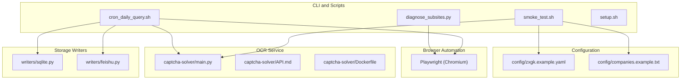
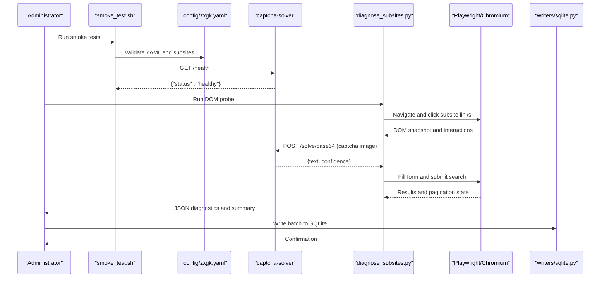
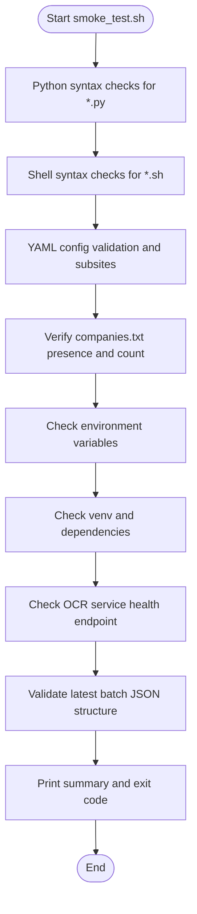
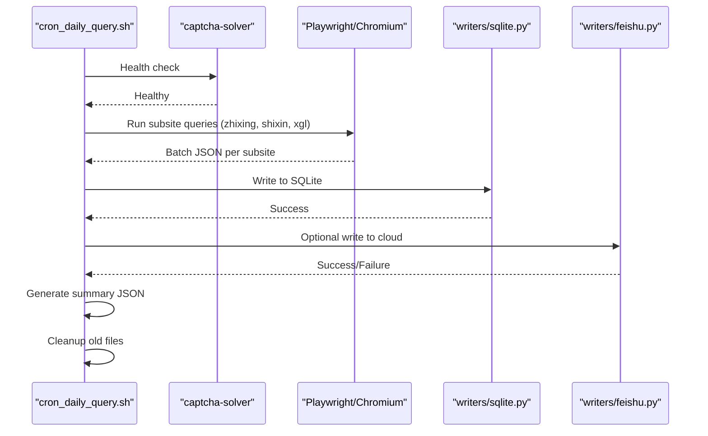
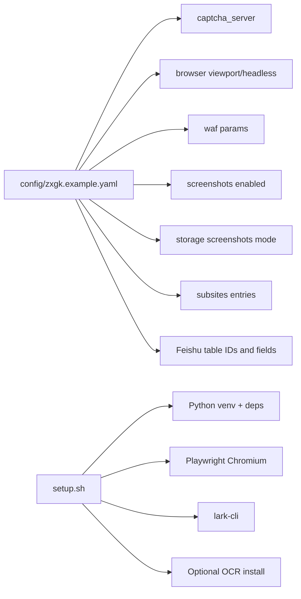
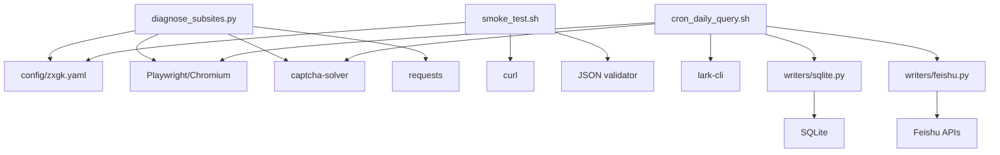

# System Diagnostics

<cite>
**Referenced Files in This Document**
- [README.md](file://README.md)
- [SKILL.md](file://SKILL.md)
- [diagnose_subsites.py](file://diagnose_subsites.py)
- [smoke_test.sh](file://smoke_test.sh)
- [cron_daily_query.sh](file://cron_daily_query.sh)
- [setup.sh](file://setup.sh)
- [config/zxgk.example.yaml](file://config/zxgk.example.yaml)
- [config/companies.example.txt](file://config/companies.example.txt)
- [captcha-solver/main.py](file://captcha-solver/main.py)
- [captcha-solver/API.md](file://captcha-solver/API.md)
- [captcha-solver/Dockerfile](file://captcha-solver/Dockerfile)
- [writers/sqlite.py](file://writers/sqlite.py)
- [writers/feishu.py](file://writers/feishu.py)
</cite>

## Table of Contents
1. [Introduction](#introduction)
2. [Project Structure](#project-structure)
3. [Core Components](#core-components)
4. [Architecture Overview](#architecture-overview)
5. [Detailed Component Analysis](#detailed-component-analysis)
6. [Dependency Analysis](#dependency-analysis)
7. [Performance Considerations](#performance-considerations)
8. [Troubleshooting Guide](#troubleshooting-guide)
9. [Conclusion](#conclusion)
10. [Appendices](#appendices)

## Introduction
This document provides a comprehensive guide to system diagnostics for health checks and troubleshooting workflows. It explains how to verify DOM structure across the three subsites, monitor performance, and apply systematic troubleshooting approaches. It documents the diagnose_subsites.py utility for subsite health assessment and smoke_test.sh for comprehensive system validation. It also covers relationships with browser automation, configuration validation, performance bottleneck identification, network connectivity issues, and component dependency problems. The content is designed to be accessible to system administrators while offering sufficient technical depth for advanced troubleshooting.

## Project Structure
The project centers around a daily query pipeline that automates browser-driven searches across three subsites, validates configurations, and writes results to local storage and optionally to a cloud platform. Diagnostic utilities and scripts enable health checks and smoke testing.

**Diagram sources**
- [diagnose_subsites.py:1-429](file://diagnose_subsites.py#L1-L429)
- [smoke_test.sh:1-155](file://smoke_test.sh#L1-L155)
- [cron_daily_query.sh:1-246](file://cron_daily_query.sh#L1-L246)
- [setup.sh:1-150](file://setup.sh#L1-L150)
- [config/zxgk.example.yaml:1-103](file://config/zxgk.example.yaml#L1-L103)
- [config/companies.example.txt:1-7](file://config/companies.example.txt#L1-L7)
- [captcha-solver/main.py:1-215](file://captcha-solver/main.py#L1-L215)
- [captcha-solver/API.md:1-121](file://captcha-solver/API.md#L1-L121)
- [captcha-solver/Dockerfile:1-22](file://captcha-solver/Dockerfile#L1-L22)
- [writers/sqlite.py:1-121](file://writers/sqlite.py#L1-L121)
- [writers/feishu.py:1-596](file://writers/feishu.py#L1-L596)

**Section sources**
- [README.md:1-122](file://README.md#L1-L122)
- [SKILL.md:1-273](file://SKILL.md#L1-L273)

## Core Components
- diagnose_subsites.py: Performs automated navigation to each subsite, probes DOM elements, collects table structures, pagination, and search behavior, and validates OCR integration via the captcha-solver service.
- smoke_test.sh: Validates Python/Shell syntax, configuration YAML, companies list, environment variables, virtual environment dependencies, OCR service health, and latest batch JSON format.
- cron_daily_query.sh: Orchestrates the full pipeline, ensuring the OCR service is available, running queries per subsite, writing to SQLite, conditionally writing to cloud storage, and performing screenshot backfill.
- setup.sh: Installs OS-level prerequisites, creates and populates a Python virtual environment, installs Playwright Chromium, configures lark-cli, and optionally installs the OCR service locally or remotely.
- Configuration files: Define subsite selectors, OCR server endpoint, browser viewport, WAF parameters, screenshots behavior, storage options, and Feishu table mappings.
- Storage writers: SQLite writer persists results locally; Feishu writer synchronizes with cloud tables and supports screenshot uploads.

**Section sources**
- [diagnose_subsites.py:1-429](file://diagnose_subsites.py#L1-L429)
- [smoke_test.sh:1-155](file://smoke_test.sh#L1-L155)
- [cron_daily_query.sh:1-246](file://cron_daily_query.sh#L1-L246)
- [setup.sh:1-150](file://setup.sh#L1-L150)
- [config/zxgk.example.yaml:1-103](file://config/zxgk.example.yaml#L1-L103)
- [writers/sqlite.py:1-121](file://writers/sqlite.py#L1-L121)
- [writers/feishu.py:1-596](file://writers/feishu.py#L1-L596)

## Architecture Overview
The system integrates browser automation with OCR validation and storage backends. Health checks and diagnostics focus on:
- DOM structure verification across subsites
- OCR service availability and response quality
- Configuration correctness and environment readiness
- Storage integrity and optional cloud synchronization

**Diagram sources**
- [smoke_test.sh:106-113](file://smoke_test.sh#L106-L113)
- [diagnose_subsites.py:252-275](file://diagnose_subsites.py#L252-L275)
- [captcha-solver/main.py:107-109](file://captcha-solver/main.py#L107-L109)
- [writers/sqlite.py:37-100](file://writers/sqlite.py#L37-L100)

## Detailed Component Analysis

### diagnose_subsites.py: DOM Structure Verification and Search Validation
Key responsibilities:
- Loads subsite configuration from YAML or falls back to defaults.
- Launches a stealthed Chromium instance via Playwright and navigates to the main portal.
- Locates and clicks subsite links using CSS selectors.
- Probes WAF elements (captcha container, input fields).
- Inspects form fields (e.g., province selector) and option sets.
- Scans result tables by known IDs and counts rows/columns.
- Evaluates visibility and content of the result block.
- Checks pagination controls and their states.
- Validates search handler presence by inspecting onclick attributes.
- Attempts a real search using a test keyword and OCR-assisted captcha solving.
- Aggregates results and prints a diagnostic summary.

```mermaid
flowchart TD
Start(["Start diagnose_subsites.py"]) --> LoadCfg["Load subsites from config/zxgk.yaml<br/>Fallback to defaults"]
LoadCfg --> LaunchBrowser["Launch Chromium (headless)<br/>Apply stealth settings"]
LaunchBrowser --> Navigate["Go to main portal<br/>Wait for network idle"]
Navigate --> ClickSubsite["Click subsite link via CSS selector"]
ClickSubsite --> WaitExtra["Wait extra seconds per subsite"]
WaitExtra --> ProbeWAF["Probe WAF elements:<br/>yzm, pName, captchaId"]
ProbeWAF --> FormFields["Inspect extra form fields:<br/>pProvince options and selection"]
FormFields --> TableScan["Scan result tables:<br/>tb-1, tb-2, result-table, tbody-result"]
TableScan --> ResultBlock["Evaluate result-block:<br/>exists, visible, innerText"]
ResultBlock --> Pagination["Check pagination:<br/>next-btn existence, disabled, visible"]
Pagination --> SearchHandler["Find onclick containing 'search()'"]
SearchHandler --> TestSearch["Fill test keyword '张'<br/>Extract captcha image"]
TestSearch --> OCRAPI["POST /solve/base64 to OCR service"]
OCRAPI --> FillCaptcha["Fill captcha and submit search"]
FillCaptcha --> CollectResults["Collect result text, row/col counts,<br/>first row samples, showDetail onclick"]
CollectResults --> PostPagination["Check pagination after query"]
PostPagination --> Summarize["Print summary and save JSON"]
Summarize --> End(["End"])
```

**Diagram sources**
- [diagnose_subsites.py:25-48](file://diagnose_subsites.py#L25-L48)
- [diagnose_subsites.py:103-330](file://diagnose_subsites.py#L103-L330)

**Section sources**
- [diagnose_subsites.py:25-48](file://diagnose_subsites.py#L25-L48)
- [diagnose_subsites.py:103-330](file://diagnose_subsites.py#L103-L330)

### smoke_test.sh: Comprehensive System Validation
Checks performed:
- Python syntax validation for key modules.
- Shell syntax validation for operational scripts.
- YAML configuration validation and subsite inspection.
- Presence and content of the companies list.
- Environment variable presence (e.g., token for cloud storage).
- Virtual environment existence and installed packages.
- OCR service health endpoint.
- Latest batch JSON format validation.

**Diagram sources**
- [smoke_test.sh:16-154](file://smoke_test.sh#L16-L154)

**Section sources**
- [smoke_test.sh:16-154](file://smoke_test.sh#L16-L154)

### cron_daily_query.sh: End-to-End Pipeline Orchestration
Highlights:
- Ensures the OCR service is running, attempting Docker or fallback startup.
- Verifies cloud authentication and proceeds accordingly.
- Executes subsite queries in sequence, writing to SQLite and optionally to cloud storage.
- Generates a consolidated summary for downstream consumption.
- Triggers screenshot backfill when cloud storage is enabled.
- Applies cleanup policies for old artifacts.

**Diagram sources**
- [cron_daily_query.sh:43-96](file://cron_daily_query.sh#L43-L96)
- [cron_daily_query.sh:112-154](file://cron_daily_query.sh#L112-L154)
- [cron_daily_query.sh:169-210](file://cron_daily_query.sh#L169-L210)
- [writers/sqlite.py:37-100](file://writers/sqlite.py#L37-L100)
- [writers/feishu.py:556-591](file://writers/feishu.py#L556-L591)

**Section sources**
- [cron_daily_query.sh:43-96](file://cron_daily_query.sh#L43-L96)
- [cron_daily_query.sh:112-154](file://cron_daily_query.sh#L112-L154)
- [cron_daily_query.sh:169-210](file://cron_daily_query.sh#L169-L210)
- [writers/sqlite.py:37-100](file://writers/sqlite.py#L37-L100)
- [writers/feishu.py:556-591](file://writers/feishu.py#L556-L591)

### Configuration Validation and Dependencies
- config/zxgk.example.yaml defines:
  - OCR server endpoint and port.
  - Browser viewport and headless mode.
  - WAF-related parameters (retries, cooldown, intervals).
  - Screenshots storage mode and storage options.
  - Subsite entries with human-readable names, CSS selectors, and extra wait durations.
  - Feishu table IDs and field mappings.
  - Output directories for JSON and screenshots.
- companies.example.txt provides a template for the company list.
- setup.sh ensures OS-level tools, Python virtual environment, Playwright installation, lark-cli, and optional OCR service are present.

**Diagram sources**
- [config/zxgk.example.yaml:7-96](file://config/zxgk.example.yaml#L7-L96)
- [config/companies.example.txt:1-7](file://config/companies.example.txt#L1-L7)
- [setup.sh:27-124](file://setup.sh#L27-L124)

**Section sources**
- [config/zxgk.example.yaml:7-96](file://config/zxgk.example.yaml#L7-L96)
- [config/companies.example.txt:1-7](file://config/companies.example.txt#L1-L7)
- [setup.sh:27-124](file://setup.sh#L27-L124)

## Dependency Analysis
- diagnose_subsites.py depends on:
  - YAML configuration for subsite definitions.
  - Playwright/Chromium for browser automation.
  - captcha-solver for OCR assistance during search attempts.
  - Requests for OCR API calls.
- smoke_test.sh depends on:
  - Python/YAML parsing for configuration validation.
  - curl for OCR service health checks.
  - JSON validation for batch outputs.
- cron_daily_query.sh depends on:
  - OCR service health checks and optional Docker/fallback startup.
  - Cloud authentication via lark-cli.
  - writers modules for storage backends.
- writers modules depend on:
  - SQLite for local persistence.
  - Feishu APIs for remote synchronization and screenshot uploads.

**Diagram sources**
- [diagnose_subsites.py:16-18](file://diagnose_subsites.py#L16-L18)
- [diagnose_subsites.py:252-256](file://diagnose_subsites.py#L252-L256)
- [smoke_test.sh:43-60](file://smoke_test.sh#L43-L60)
- [smoke_test.sh:106-113](file://smoke_test.sh#L106-L113)
- [cron_daily_query.sh:43-96](file://cron_daily_query.sh#L43-L96)
- [writers/sqlite.py:37-100](file://writers/sqlite.py#L37-L100)
- [writers/feishu.py:556-591](file://writers/feishu.py#L556-L591)

**Section sources**
- [diagnose_subsites.py:16-18](file://diagnose_subsites.py#L16-L18)
- [diagnose_subsites.py:252-256](file://diagnose_subsites.py#L252-L256)
- [smoke_test.sh:43-60](file://smoke_test.sh#L43-L60)
- [smoke_test.sh:106-113](file://smoke_test.sh#L106-L113)
- [cron_daily_query.sh:43-96](file://cron_daily_query.sh#L43-L96)
- [writers/sqlite.py:37-100](file://writers/sqlite.py#L37-L100)
- [writers/feishu.py:556-591](file://writers/feishu.py#L556-L591)

## Performance Considerations
- OCR latency: The OCR service introduces latency per captcha recognition. Monitor response times and adjust preprocessing modes if needed.
- Browser overhead: Headless Chromium consumes memory and CPU. Ensure adequate resources for concurrent subsite probing.
- Network stability: Frequent retries and timeouts are configured in the pipeline; verify network connectivity to the target portal and OCR service.
- Storage throughput: SQLite writes are synchronous; consider disabling screenshot BLOB storage if disk I/O becomes a bottleneck.
- Pagination and result volume: Large result sets increase DOM parsing time; validate table scanning logic and limit unnecessary waits.

[No sources needed since this section provides general guidance]

## Troubleshooting Guide

### Health Check Procedures
- Run smoke tests to validate syntax, configuration, environment, and OCR service readiness.
- Use diagnose_subsites.py to probe each subsite’s DOM structure, form fields, tables, pagination, and search handler.
- Verify OCR service health and responsiveness.

**Section sources**
- [smoke_test.sh:16-154](file://smoke_test.sh#L16-L154)
- [diagnose_subsites.py:103-330](file://diagnose_subsites.py#L103-L330)
- [captcha-solver/main.py:107-109](file://captcha-solver/main.py#L107-L109)

### Common Issues and Resolution Strategies
- OCR service unavailable:
  - Confirm service health endpoint and port binding.
  - If Docker is used, ensure the container is running and model initialization completed.
  - As a fallback, start the OCR service manually in a venv and verify readiness.
- Captcha recognition failures:
  - Validate OCR preprocessing mode and image extraction accuracy.
  - Check OCR service logs for errors and retry thresholds.
- Subsite navigation failures:
  - Verify CSS selectors in configuration match current site structure.
  - Adjust extra wait times for dynamic content loading.
- Cloud storage write failures:
  - Re-authenticate lark-cli and retry writes.
  - Validate table IDs and field mappings in configuration.
- Memory/CPU pressure:
  - Reduce concurrency, disable screenshots, or switch to file-based screenshot storage.

**Section sources**
- [cron_daily_query.sh:43-96](file://cron_daily_query.sh#L43-L96)
- [setup.sh:54-124](file://setup.sh#L54-L124)
- [writers/feishu.py:556-591](file://writers/feishu.py#L556-L591)

### Systematic Troubleshooting Approaches
- Isolate components: Test OCR service independently, then DOM probing, then full pipeline.
- Validate configuration: Compare effective configuration against examples and ensure all required fields are present.
- Monitor logs: Capture and review OCR service logs, browser automation traces, and script outputs.
- Reproduce with minimal steps: Use single-subsite probing and basic search to narrow down issues.

**Section sources**
- [diagnose_subsites.py:333-429](file://diagnose_subsites.py#L333-L429)
- [cron_daily_query.sh:112-154](file://cron_daily_query.sh#L112-L154)
- [setup.sh:126-140](file://setup.sh#L126-L140)

### Performance Bottleneck Identification
- Measure OCR latency and throughput under load.
- Profile browser automation steps and identify slow DOM scans.
- Evaluate storage write performance and adjust screenshot storage mode.

**Section sources**
- [captcha-solver/main.py:120-141](file://captcha-solver/main.py#L120-L141)
- [writers/sqlite.py:37-100](file://writers/sqlite.py#L37-L100)

### Network Connectivity Issues
- Validate DNS resolution and firewall rules for the target portal and OCR service endpoints.
- Use curl commands to test reachability and response codes.
- Configure proxy environment variables if applicable, then remove them for clean diagnostics.

**Section sources**
- [smoke_test.sh:106-113](file://smoke_test.sh#L106-L113)
- [diagnose_subsites.py:334-336](file://diagnose_subsites.py#L334-L336)

### Component Dependency Problems
- Ensure Playwright Chromium is installed and up to date.
- Verify Python virtual environment contains required packages.
- Confirm lark-cli is installed and authenticated for cloud storage operations.

**Section sources**
- [setup.sh:27-45](file://setup.sh#L27-L45)
- [setup.sh:112-124](file://setup.sh#L112-L124)
- [writers/feishu.py:23-33](file://writers/feishu.py#L23-L33)

## Conclusion
The diagnostic toolkit combines targeted DOM probing, comprehensive system validation, and end-to-end orchestration to maintain system health. By leveraging diagnose_subsites.py and smoke_test.sh, administrators can quickly identify configuration drift, OCR service issues, browser automation failures, and storage bottlenecks. The cron_daily_query.sh orchestrator ties these components together, ensuring reliable daily operations and providing clear signals for remediation.

[No sources needed since this section summarizes without analyzing specific files]

## Appendices

### Quick Reference: Diagnostic Commands
- Run smoke tests: bash smoke_test.sh
- Probe subsites: python3 diagnose_subsites.py
- Single subsite test: python3 zxgk_query.py --company "XX公司" --subsite zhixing --mode text-only --output /tmp/test.json
- Validate OCR service: curl -s http://localhost:8001/health

**Section sources**
- [smoke_test.sh:213-221](file://smoke_test.sh#L213-L221)
- [diagnose_subsites.py:333-429](file://diagnose_subsites.py#L333-L429)
- [README.md:63-77](file://README.md#L63-L77)
- [captcha-solver/API.md:70-75](file://captcha-solver/API.md#L70-L75)