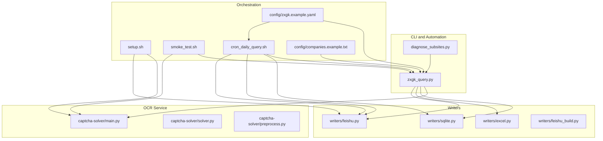
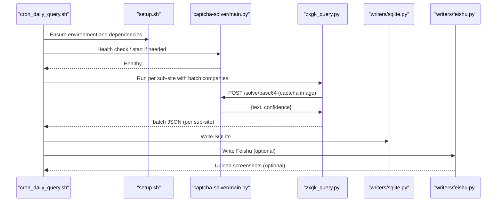
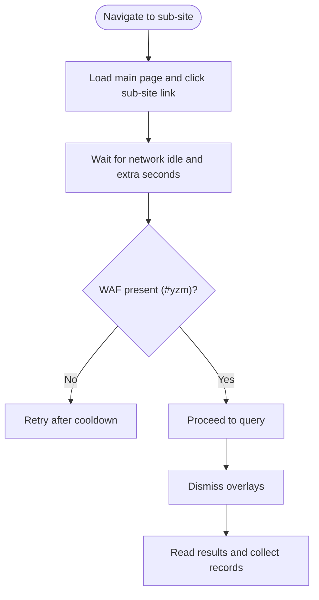
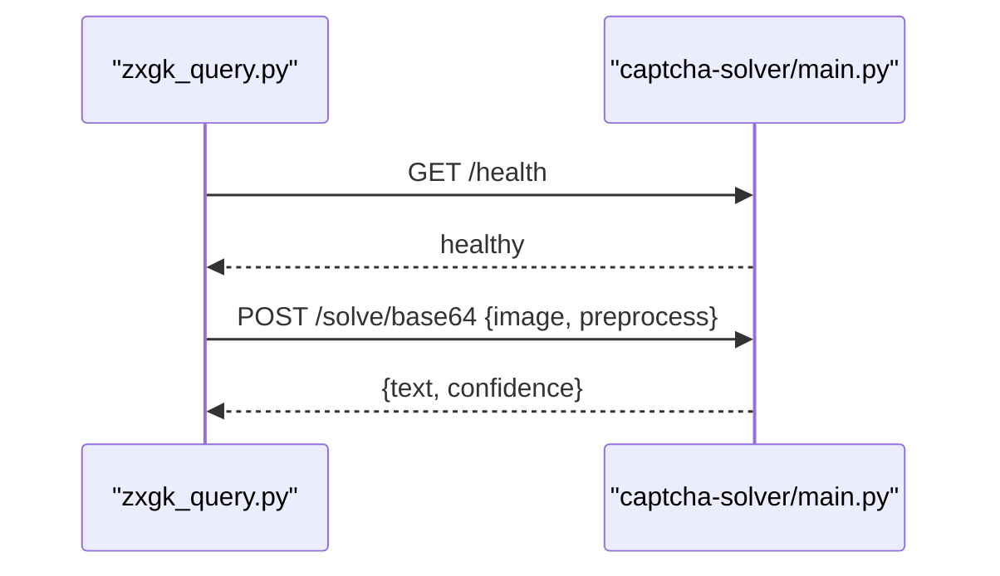
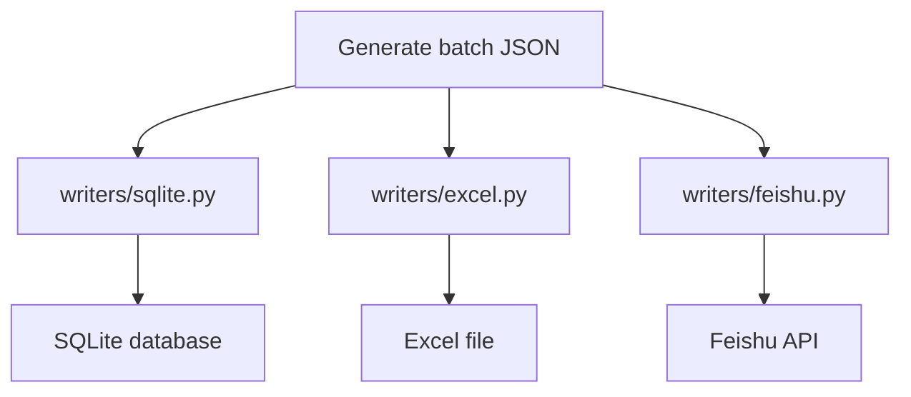
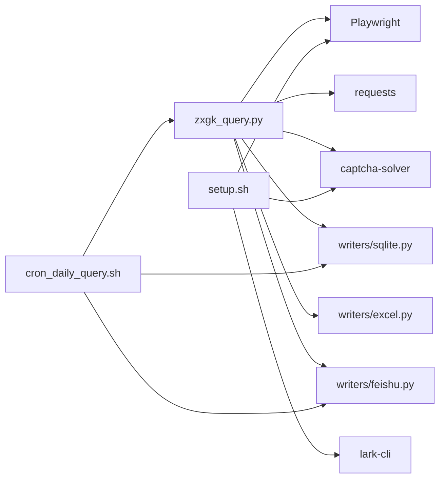

# Troubleshooting and FAQ

<cite>
**Referenced Files in This Document**
- [README.md](file://README.md)
- [zxgk_query.py](file://zxgk_query.py)
- [diagnose_subsites.py](file://diagnose_subsites.py)
- [smoke_test.sh](file://smoke_test.sh)
- [setup.sh](file://setup.sh)
- [cron_daily_query.sh](file://cron_daily_query.sh)
- [config/zxgk.example.yaml](file://config/zxgk.example.yaml)
- [config/companies.example.txt](file://config/companies.example.txt)
- [captcha-solver/main.py](file://captcha-solver/main.py)
- [captcha-solver/solver.py](file://captcha-solver/solver.py)
- [captcha-solver/preprocess.py](file://captcha-solver/preprocess.py)
- [writers/sqlite.py](file://writers/sqlite.py)
- [writers/excel.py](file://writers/excel.py)
- [writers/feishu.py](file://writers/feishu.py)
- [writers/feishu_build.py](file://writers/feishu_build.py)
</cite>

## Table of Contents
1. [Introduction](#introduction)
2. [Project Structure](#project-structure)
3. [Core Components](#core-components)
4. [Architecture Overview](#architecture-overview)
5. [Detailed Component Analysis](#detailed-component-analysis)
6. [Dependency Analysis](#dependency-analysis)
7. [Performance Considerations](#performance-considerations)
8. [Troubleshooting Guide](#troubleshooting-guide)
9. [Security and Legal Considerations](#security-and-legal-considerations)
10. [Frequently Asked Questions (FAQ)](#frequently-asked-questions-faq)
11. [Community Resources and Support](#community-resources-and-support)
12. [Conclusion](#conclusion)

## Introduction
This document provides comprehensive troubleshooting and FAQ guidance for the Execution Information Query System. It focuses on diagnosing and resolving common issues related to OCR service connectivity, browser automation failures, and output generation errors. It also covers performance optimization, memory usage, network configuration, security best practices, legal and ethical considerations, and integration tips. Step-by-step debugging procedures and escalation paths are included to help users at all technical levels resolve issues efficiently.

## Project Structure
The system comprises:
- A Playwright-based browser automation CLI for querying three sub-sites
- An OCR service (captcha-solver) for solving CAPTCHA
- Writers for SQLite, Excel, and Feishu integration
- Daily orchestration script to run queries, persist results, and optionally upload screenshots
- Diagnostic and smoke testing utilities

**Diagram sources**
- [zxgk_query.py](file://zxgk_query.py)
- [diagnose_subsites.py](file://diagnose_subsites.py)
- [captcha-solver/main.py](file://captcha-solver/main.py)
- [captcha-solver/solver.py](file://captcha-solver/solver.py)
- [captcha-solver/preprocess.py](file://captcha-solver/preprocess.py)
- [writers/sqlite.py](file://writers/sqlite.py)
- [writers/excel.py](file://writers/excel.py)
- [writers/feishu.py](file://writers/feishu.py)
- [writers/feishu_build.py](file://writers/feishu_build.py)
- [cron_daily_query.sh](file://cron_daily_query.sh)
- [setup.sh](file://setup.sh)
- [smoke_test.sh](file://smoke_test.sh)
- [config/zxgk.example.yaml](file://config/zxgk.example.yaml)
- [config/companies.example.txt](file://config/companies.example.txt)

**Section sources**
- [README.md](file://README.md)
- [cron_daily_query.sh](file://cron_daily_query.sh)
- [setup.sh](file://setup.sh)
- [smoke_test.sh](file://smoke_test.sh)
- [config/zxgk.example.yaml](file://config/zxgk.example.yaml)
- [config/companies.example.txt](file://config/companies.example.txt)

## Core Components
- Browser automation engine with stealth and navigation to sub-sites
- OCR service with health checks and multiple pre-processing modes
- Query engine with retry logic, CAPTCHA handling, and result collection
- Writers for SQLite, Excel, and Feishu with de-duplication and screenshot upload
- Orchestration scripts for installation, daily runs, diagnostics, and smoke tests

Key behaviors:
- WAF detection and retry logic during navigation
- CAPTCHA extraction, OCR solving, and validation with confidence thresholds
- Page overlay dismissal to reveal results
- Batch JSON generation and downstream storage/writing

**Section sources**
- [zxgk_query.py](file://zxgk_query.py)
- [captcha-solver/main.py](file://captcha-solver/main.py)
- [writers/sqlite.py](file://writers/sqlite.py)
- [writers/excel.py](file://writers/excel.py)
- [writers/feishu.py](file://writers/feishu.py)

## Architecture Overview
The system integrates browser automation, OCR, and storage/writer modules. The daily orchestration script coordinates service startup, runs queries per sub-site, writes results locally, and optionally synchronizes with Feishu and uploads screenshots.

**Diagram sources**
- [cron_daily_query.sh](file://cron_daily_query.sh)
- [setup.sh](file://setup.sh)
- [captcha-solver/main.py](file://captcha-solver/main.py)
- [zxgk_query.py](file://zxgk_query.py)
- [writers/sqlite.py](file://writers/sqlite.py)
- [writers/feishu.py](file://writers/feishu.py)

## Detailed Component Analysis

### Browser Automation and Navigation
Common issues:
- WAF blocks leading to navigation retries
- Sub-site link selectors outdated due to DOM changes
- Pop-up overlays blocking result retrieval

Resolutions:
- Verify WAF handling and extra waits configured per sub-site
- Re-run diagnostic tool to confirm selectors and readiness
- Ensure overlay dismissal logic runs before reading results

**Diagram sources**
- [zxgk_query.py](file://zxgk_query.py)

**Section sources**
- [zxgk_query.py](file://zxgk_query.py)
- [diagnose_subsites.py](file://diagnose_subsites.py)

### OCR Service Connectivity
Common issues:
- captcha-solver not running or unhealthy
- Port conflicts or non-OCR process occupying port 8001
- Slow or failing OCR responses

Resolutions:
- Confirm health endpoint responds
- Prefer Docker deployment or bare-metal venv startup
- Adjust pre-processing mode if images are small or noisy

**Diagram sources**
- [captcha-solver/main.py](file://captcha-solver/main.py)
- [zxgk_query.py](file://zxgk_query.py)

**Section sources**
- [captcha-solver/main.py](file://captcha-solver/main.py)
- [captcha-solver/solver.py](file://captcha-solver/solver.py)
- [captcha-solver/preprocess.py](file://captcha-solver/preprocess.py)
- [cron_daily_query.sh](file://cron_daily_query.sh)

### Output Generation and Storage
Common issues:
- Missing batch JSON after query
- SQLite write failures or schema mismatches
- Excel export errors due to missing dependencies
- Feishu write/upload failures due to authentication or missing tokens

Resolutions:
- Validate batch JSON structure and content
- Use SQLite writer to confirm local persistence
- Install optional dependencies for Excel export
- Ensure Feishu token and table IDs are configured

**Diagram sources**
- [writers/sqlite.py](file://writers/sqlite.py)
- [writers/excel.py](file://writers/excel.py)
- [writers/feishu.py](file://writers/feishu.py)

**Section sources**
- [writers/sqlite.py](file://writers/sqlite.py)
- [writers/excel.py](file://writers/excel.py)
- [writers/feishu.py](file://writers/feishu.py)
- [writers/feishu_build.py](file://writers/feishu_build.py)

## Dependency Analysis
- CLI depends on Playwright for browser automation and stealth
- CLI depends on OCR service for CAPTCHA recognition
- Writers depend on external APIs (Feishu) and optional libraries (Excel)
- Orchestration scripts manage service lifecycle and environment setup

**Diagram sources**
- [zxgk_query.py](file://zxgk_query.py)
- [cron_daily_query.sh](file://cron_daily_query.sh)
- [setup.sh](file://setup.sh)
- [writers/sqlite.py](file://writers/sqlite.py)
- [writers/excel.py](file://writers/excel.py)
- [writers/feishu.py](file://writers/feishu.py)

**Section sources**
- [README.md](file://README.md)
- [setup.sh](file://setup.sh)
- [cron_daily_query.sh](file://cron_daily_query.sh)

## Performance Considerations
- Memory usage
  - OCR model (~1.5 GB) and Chromium (~500 MB) require sufficient RAM
  - Reduce concurrency and reuse browser contexts where appropriate
- Network configuration
  - Configure proxy environment variables cleanly before launching browsers
  - Ensure stable connectivity to target sites and OCR service
- OCR pre-processing
  - Use lighter pre-processing modes for small or noisy images
  - Tune CLAHE and threshold parameters for better contrast and readability
- Browser settings
  - Headless mode reduces overhead
  - Disable unnecessary features to minimize resource usage

[No sources needed since this section provides general guidance]

## Troubleshooting Guide

### Step-by-Step Debugging Procedures

- Verify environment and dependencies
  - Run the smoke test to validate Python syntax, shell scripts, configuration, and environment variables
  - Confirm OCR service health endpoint responds
  - Ensure virtual environment is activated and required packages are installed

- Diagnose sub-site readiness
  - Use the diagnostic tool to probe DOM structure, WAF presence, and basic query behavior
  - Check for expected elements and pagination indicators

- Test OCR service
  - Confirm health endpoint and successful OCR responses
  - Try different pre-processing modes if accuracy is low

- Validate output generation
  - Check batch JSON existence and structure
  - Write to SQLite to confirm local persistence
  - Export to Excel to verify optional dependencies

- Integrate with Feishu
  - Authenticate lark-cli and set the app token
  - Verify table IDs and field mappings
  - Upload screenshots and cross-reference records

- Escalation path
  - If persistent failures occur, reduce concurrency and increase delays
  - Capture logs and screenshots for further analysis
  - Re-run diagnostics and compare against known-good configurations

**Section sources**
- [smoke_test.sh](file://smoke_test.sh)
- [diagnose_subsites.py](file://diagnose_subsites.py)
- [captcha-solver/main.py](file://captcha-solver/main.py)
- [writers/sqlite.py](file://writers/sqlite.py)
- [writers/excel.py](file://writers/excel.py)
- [writers/feishu.py](file://writers/feishu.py)
- [cron_daily_query.sh](file://cron_daily_query.sh)

### Common Issues and Solutions

- OCR service connectivity problems
  - Symptoms: OCR requests fail or return empty results
  - Actions: Check health endpoint, ensure Docker or bare-metal service is running, verify port availability, adjust pre-processing mode

- Browser automation failures
  - Symptoms: WAF blocks, sub-site link not found, overlays prevent reading results
  - Actions: Review WAF handling and extra waits, re-run diagnostics, dismiss overlays before reading results

- Output generation errors
  - Symptoms: Missing batch JSON, SQLite write failures, Excel export errors, Feishu write failures
  - Actions: Validate JSON structure, install optional dependencies, configure Feishu tokens and IDs, check permissions

- Performance and memory issues
  - Symptoms: Slow OCR, high memory usage, browser crashes
  - Actions: Increase system RAM, tune OCR pre-processing, disable unnecessary browser features, reduce concurrency

- Network configuration issues
  - Symptoms: Proxy-related failures, intermittent connectivity
  - Actions: Clean proxy environment variables, configure proxies properly, test connectivity to target sites and OCR service

**Section sources**
- [captcha-solver/main.py](file://captcha-solver/main.py)
- [zxgk_query.py](file://zxgk_query.py)
- [writers/sqlite.py](file://writers/sqlite.py)
- [writers/excel.py](file://writers/excel.py)
- [writers/feishu.py](file://writers/feishu.py)
- [cron_daily_query.sh](file://cron_daily_query.sh)

## Security and Legal Considerations
- Authentication and tokens
  - Store tokens securely and avoid committing secrets to repositories
  - Use environment variables and restrict file permissions
- Data handling
  - Minimize retention of sensitive data; delete old files according to policy
  - Encrypt sensitive artifacts if required by policy
- Compliance
  - Ensure usage complies with target site terms of service and applicable laws
  - Avoid excessive automation that could impact site stability or violate ToS
- Ethical usage
  - Use the system responsibly and only for authorized purposes
  - Respect rate limits and implement appropriate delays

[No sources needed since this section provides general guidance]

## Frequently Asked Questions (FAQ)

- What are the system requirements?
  - Minimum memory, supported OS, and recommended Python and Docker versions are documented in the project README

- How do I configure the OCR service?
  - Choose Docker or bare-metal deployment; ensure health endpoint responds and port 8001 is free

- How do I integrate with Feishu?
  - Set the app token, configure table IDs and field mappings, authenticate lark-cli, and run the Feishu writer

- How do I run diagnostics?
  - Use the diagnostic tool to probe DOM structure and test basic query behavior

- How do I validate my setup?
  - Run the smoke test to verify syntax, configuration, environment variables, and dependencies

- How do I troubleshoot OCR accuracy?
  - Adjust pre-processing mode and parameters; validate image quality and size

- How do I handle WAF blocks?
  - Enable retries and extra waits; review diagnostics for WAF indicators

- How do I optimize performance?
  - Tune OCR pre-processing, reduce concurrency, and disable unnecessary browser features

**Section sources**
- [README.md](file://README.md)
- [setup.sh](file://setup.sh)
- [smoke_test.sh](file://smoke_test.sh)
- [diagnose_subsites.py](file://diagnose_subsites.py)
- [writers/feishu.py](file://writers/feishu.py)
- [writers/feishu_build.py](file://writers/feishu_build.py)

## Community Resources and Support
- Project documentation and examples are provided in the repository
- Use the diagnostic and smoke test scripts to validate environments
- For Feishu integration, refer to the Feishu writer and builder modules
- Report issues and contribute improvements via the repository’s issue tracker

**Section sources**
- [README.md](file://README.md)
- [writers/feishu.py](file://writers/feishu.py)
- [writers/feishu_build.py](file://writers/feishu_build.py)

## Conclusion
By following the troubleshooting procedures, understanding component interactions, and applying the recommended optimizations and best practices, users can reliably operate the Execution Information Query System. Use the diagnostics and smoke tests to validate environments, monitor OCR accuracy, and ensure secure and compliant usage.